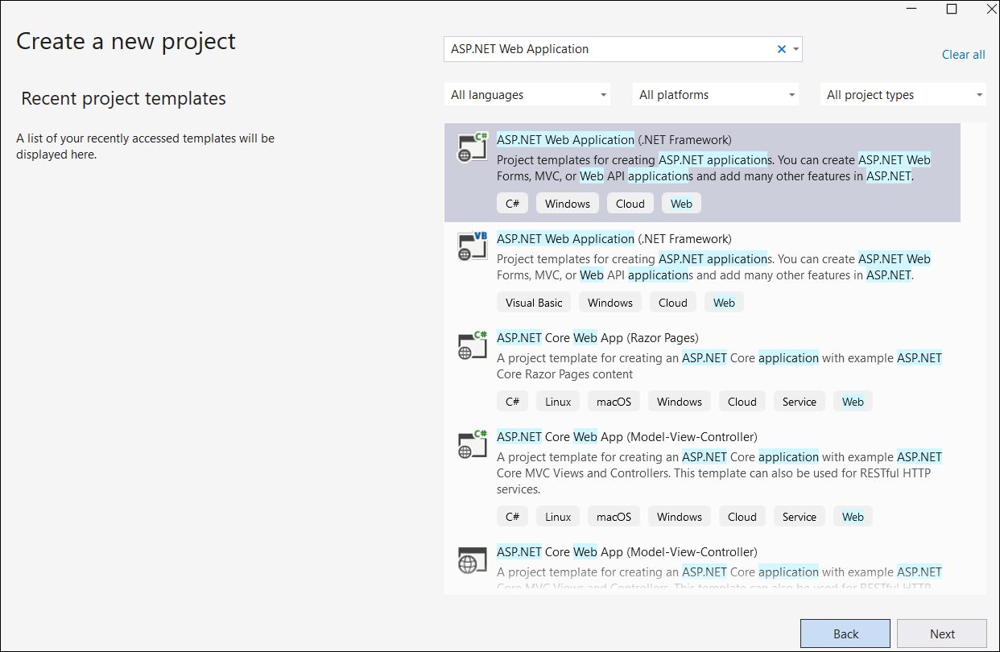
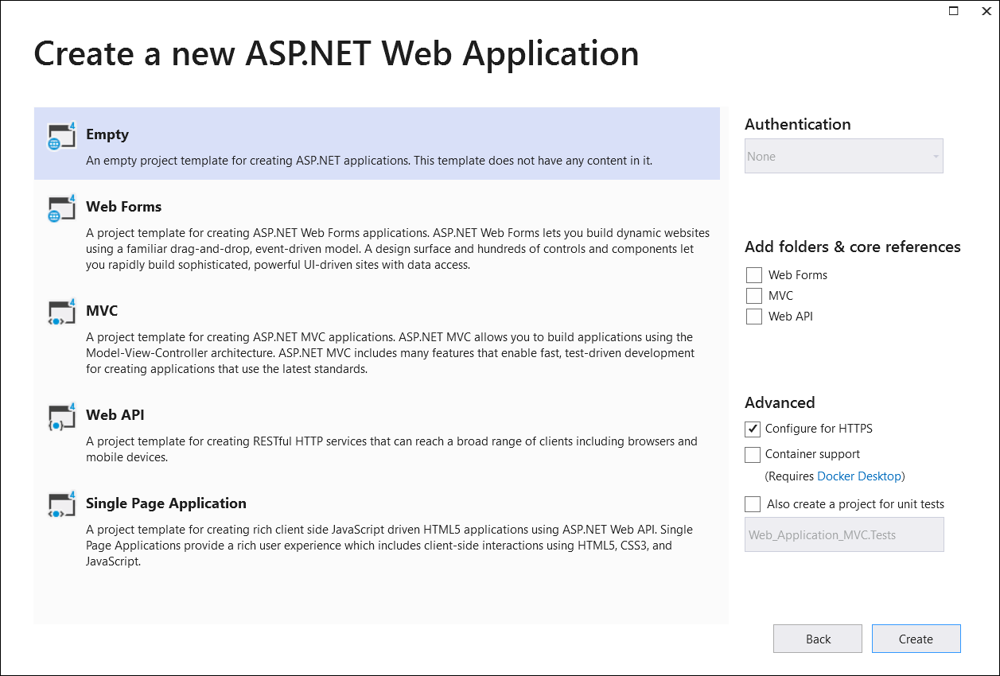
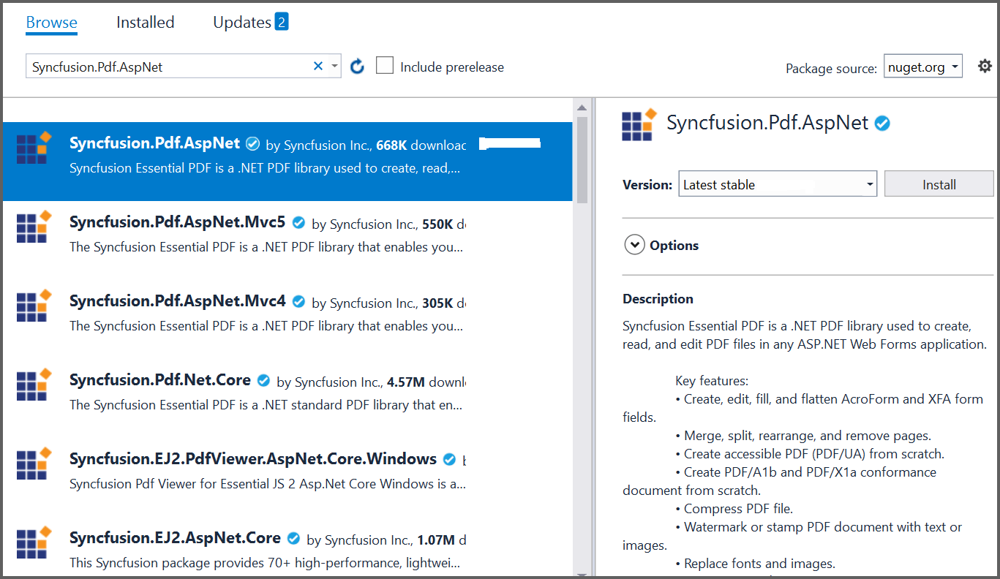

# Create or Generate a PDF File in ASP.NET Web Forms

The [.NET PDF library](https://www.syncfusion.com/document-sdk/net-pdf-library) creates, reads, and edits PDF documents. It also merges, splits, stamps, fills forms, and secures PDF files.

To include the .NET PDF library in your ASP.NET Web Forms application, refer to the [NuGet Package Required](https://help.syncfusion.com/document-processing/pdf/pdf-library/net/nuget-packages-required) or [Assemblies Required](https://help.syncfusion.com/document-processing/pdf/pdf-library/net/assemblies-required) documentation.

### Platform note

N> ASP.NET Web Forms is a legacy platform. Syncfusion continues to support existing Web Forms applications, but new development should target [ASP.NET Core](https://help.syncfusion.com/document-processing/pdf/pdf-library/net/create-pdf-file-in-asp-net-core). The same PDF features are available there via the [Syncfusion.Pdf.Net.Core](https://www.nuget.org/packages/Syncfusion.Pdf.Net.Core) NuGet package.

## Prerequisites

- **.NET Framework** 4.6.2 or later
- **Visual Studio 2017 or later** with the **ASP.NET and web development** workload
- A **Syncfusion&reg; license key** — register it in your application using `Syncfusion.Licensing.SyncfusionLicenseProvider.RegisterLicense("YOUR_LICENSE_KEY")`. For details, see the [Syncfusion licensing overview](https://help.syncfusion.com/common/essential-studio/licensing/overview).
- The **[Syncfusion.Pdf.AspNet](https://www.nuget.org/packages/Syncfusion.Pdf.AspNet/)** NuGet package installed in the project. This package is the Web Forms wrapper for `Syncfusion.Pdf.Base` and targets .NET Framework only.

## Compatibility

| Component | Minimum version |
| --- | --- |
| .NET Framework | 4.6.2 or later |
| Visual Studio | 2017 |
| IIS | 7.0 |
| Syncfusion&reg; PDF library | Latest version |
| Syncfusion&reg; NuGet package | [Syncfusion.Pdf.AspNet](https://www.nuget.org/packages/Syncfusion.Pdf.AspNet/) |

## Step to create a PDF document in ASP.NET Web Forms

**Step 1:** Create a new **ASP.NET Web Application (.NET Framework)** project in Visual Studio.

**Step 2:** In the template selection dialog, choose **Web Forms** (not the Empty template) so the project includes `Default.aspx` and the Web Forms configuration.

**Step 3:** Install the [Syncfusion.Pdf.AspNet](https://www.nuget.org/packages/Syncfusion.Pdf.AspNet/) NuGet package from [NuGet.org](https://www.nuget.org/). Use the latest stable version compatible with .NET Framework 4.5 or later.

N> If you reference Syncfusion&reg; assemblies from the trial setup or the NuGet feed, you must add a reference to the `Syncfusion.Licensing` assembly and include a valid license key in your project. See the [Syncfusion licensing overview](https://help.syncfusion.com/common/essential-studio/licensing/overview) for details on registering the license key.

**Step 4:** Right-click the project, choose **Add > New Item**, select **Web Form** from the list, and name it `MainPage`.

**Step 5:** In `MainPage.aspx`, add the following button.




<html xmlns="http://www.w3.org/1999/xhtml">
<head runat="server">
    <title></title>
</head>
<body>
    <form id="form1" runat="server">
    

    <asp:Button ID="Button1" runat="server" Text="Create Document" OnClick="OnButtonClicked" />
    

    </form>
</body>
</html>




**Step 6:** Include the following namespaces in your `MainPage.aspx.cs` file. Note that `System.Web` must be referenced (it is added automatically in Web Forms projects, but verify it for class-library projects).

**Step 7:** Define the `OnButtonClicked` event handler in `MainPage.aspx.cs` and include the following code to generate a PDF document using the [PdfDocument](https://help.syncfusion.com/cr/document-processing/Syncfusion.Pdf.PdfDocument.html) class. The [DrawString](https://help.syncfusion.com/cr/document-processing/Syncfusion.Pdf.Graphics.PdfGraphics.html#Syncfusion_Pdf_Graphics_PdfGraphics_DrawString_System_String_Syncfusion_Pdf_Graphics_PdfFont_Syncfusion_Pdf_Graphics_PdfBrush_System_Drawing_PointF_) method of the [PdfGraphics](https://help.syncfusion.com/cr/document-processing/Syncfusion.Pdf.Graphics.PdfGraphics.html) object draws text on the PDF page. The `HttpReadType.Save` enum value writes the PDF directly to the response so the browser downloads `Output.pdf`.




//Create a new PDF document. 
using (PdfDocument document = new PdfDocument())
{
  //Add a page to the document.
  PdfPage page = document.Pages.Add();
  //Create PDF graphics for the page.
  PdfGraphics graphics = page.Graphics;
  //Set the standard font.
  PdfFont font = new PdfStandardFont(PdfFontFamily.Helvetica, 20);
  //Draw the text.
  graphics.DrawString("Hello World!!!", font, PdfBrushes.Black, new PointF(0, 0));
  //Open the document in browser after saving it.
  document.Save("Output.pdf", HttpContext.Current.Response, HttpReadType.Save);
}




You can download a complete working sample from the [`ASP.NET` folder on GitHub](https://github.com/SyncfusionExamples/PDF-Examples/tree/master/Getting%20Started/ASP.NET).

Running the program produces the following PDF document.

Explore the [Syncfusion&reg; PDF library features](https://www.syncfusion.com/document-sdk/net-pdf-library) to learn more about merging, splitting, securing, and stamping PDF files.

An online sample demonstrating how to [create a PDF document](https://document.syncfusion.com/demos/pdf/default#/tailwind) is also available.

## Troubleshooting

- **Watermark appears in the output PDF** — Your Syncfusion&reg; license key is not registered. Call `SyncfusionLicenseProvider.RegisterLicense("YOUR_LICENSE_KEY")` at application startup.
- **`Server cannot set content type after headers are sent` exception** — The `document.Save(..., Response, HttpReadType.Save)` overload writes the PDF directly to the response. Do not call `Response.End()` or write further content after the save; the response is finalized when the method returns.
- **Package not found when targeting .NET Core** — The `Syncfusion.Pdf.AspNet` package only supports ASP.NET Web Forms on .NET Framework. For ASP.NET Core, use the [Syncfusion.Pdf.Net.Core](https://www.nuget.org/packages/Syncfusion.Pdf.Net.Core) package instead.
- **GDI+ errors on Windows Server** — Ensure the **Server Core** optional feature for "Server-Gui-Shell" or the **Desktop Experience** is installed so the GDI+ subsystem is available to `System.Drawing`.
- **PDF file opens in the browser instead of downloading** — Add `Response.AddHeader("content-disposition", "attachment; filename=Output.pdf");` or rely on the `HttpReadType.Save` overload, which sets the header automatically.

## See also

- [NuGet Packages Required](https://help.syncfusion.com/document-processing/pdf/pdf-library/net/nuget-packages-required)
- [Assemblies Required](https://help.syncfusion.com/document-processing/pdf/pdf-library/net/assemblies-required)
- [Syncfusion&reg; Licensing Overview](https://help.syncfusion.com/common/essential-studio/licensing/overview)
- [Create a PDF file in ASP.NET Core](create-pdf-file-in-asp-net-core)
- [Create a PDF file in ASP.NET Core Web API](create-pdf-document-in-web-api)
- [Create a PDF file in Blazor](create-pdf-document-in-blazor)
- [Create a PDF file in Docker](create-pdf-document-in-docker)
- [Open and read PDF files](https://help.syncfusion.com/document-processing/pdf/pdf-library/net/open-pdf-files)
- [Merge PDF documents](https://help.syncfusion.com/document-processing/pdf/pdf-library/net/merge-documents)
- [Split PDF documents](https://help.syncfusion.com/document-processing/pdf/pdf-library/net/split-documents)
- [Working with PDF forms](https://help.syncfusion.com/document-processing/pdf/pdf-library/net/working-with-forms)
- [Working with security and permissions](https://help.syncfusion.com/document-processing/pdf/pdf-library/net/working-with-security)
- [Working with stamps and watermarks](https://help.syncfusion.com/document-processing/pdf/pdf-library/net/working-with-watermarks)
- [Syncfusion&reg; PDF library — Demos](https://document.syncfusion.com/demos/pdf/default)