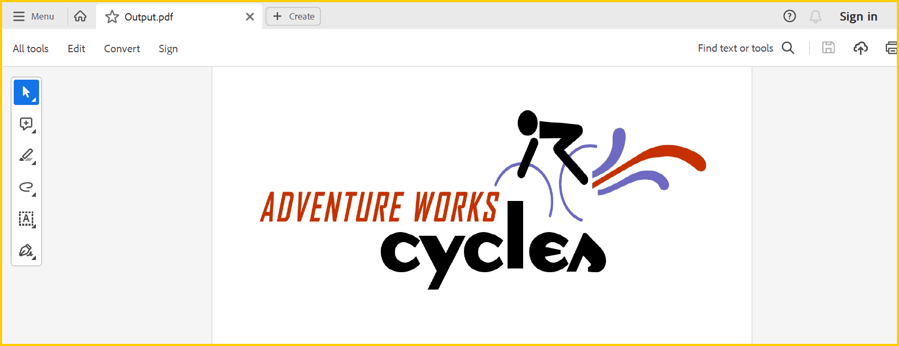
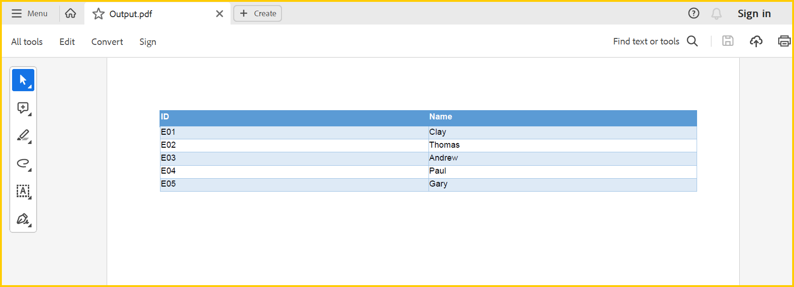

# Create or Generate PDF file in ASP.NET Web Forms

The Syncfusion&reg; [.NET PDF library](https://www.syncfusion.com/document-processing/pdf-framework/net/pdf-library) is used to create, read, and edit PDF documents. This library also offers functionality to merge, split, stamp, work with forms, and secure PDF files.

To include the .NET PDF library into your ASP.NET Web application, please refer to the [NuGet Package Required](https://help.syncfusion.com/document-processing/pdf/pdf-library/net/nuget-packages-required) or [Assemblies Required](https://help.syncfusion.com/document-processing/pdf/pdf-library/net/assemblies-required) documentation.

N> This ASP.NET Web Forms platform is deprecated; you can use the same product from the [ASP.NET Core](https://help.syncfusion.com/document-processing/pdf/pdf-library/net/create-pdf-file-in-asp-net-core) platform.

## Steps to create PDF document in ASP.NET Web Forms

Step 1: Create a new ASP.NET Web application project.

Step 2: Select the Empty project.

Step 3: Install the [Syncfusion.Pdf.AspNet](https://www.nuget.org/packages/Syncfusion.Pdf.AspNet/) NuGet package as a reference to your .NET Framework applications from [NuGet.org](https://www.nuget.org/).

N> Starting with v16.2.0.x, if you reference Syncfusion&reg; assemblies from trial setup or from the NuGet feed, you also have to add the `Syncfusion.Licensing` assembly reference and include a license key in your projects. Please refer to this [link](https://help.syncfusion.com/common/essential-studio/licensing/overview) to learn about registering the Syncfusion&reg; license key in your application to use our components.

Step 4: Add a new Web Form in the ASP.NET project. Right-click the project, select **Add > New Item**, and add a Web Form from the list. Name it `MainPage`.

Step 5: Add a new button in the `MainPage.aspx` as follows.




<html xmlns="http://www.w3.org/1999/xhtml">
<head runat="server">
    <title></title>
</head>
<body>
    <form id="form1" runat="server">
    

    <asp:Button ID="Button1" runat="server" Text="Create Document" OnClick="OnButtonClicked" />
    

    </form>
</body>
</html>




Step 6: Include the following namespaces in your `MainPage.aspx.cs` file.
   



using Syncfusion.Pdf;
using Syncfusion.Pdf.Graphics;
using System.Drawing;




Step 7: Include the following code example in the click event of the button in `MainPage.aspx.cs` to generate a PDF document using the [PdfDocument](https://help.syncfusion.com/cr/document-processing/Syncfusion.Pdf.PdfDocument.html) class. Then use the [DrawString](https://help.syncfusion.com/cr/document-processing/Syncfusion.Pdf.Graphics.PdfGraphics.html#Syncfusion_Pdf_Graphics_PdfGraphics_DrawString_System_String_Syncfusion_Pdf_Graphics_PdfFont_Syncfusion_Pdf_Graphics_PdfBrush_System_Drawing_PointF_) method of the [PdfGraphics](https://help.syncfusion.com/cr/document-processing/Syncfusion.Pdf.Graphics.PdfGraphics.html) object to draw text on the PDF page.




//Create a new PDF document. 
using (PdfDocument document = new PdfDocument())
{
//Add a page to the document.
PdfPage page = document.Pages.Add();
//Create PDF graphics for the page.
PdfGraphics graphics = page.Graphics;
//Set the standard font.
PdfFont font = new PdfStandardFont(PdfFontFamily.Helvetica, 20);
//Draw the text.
graphics.DrawString("Hello World!!!", font, PdfBrushes.Black, new PointF(0, 0));
//Open the document in browser after saving it.
document.Save("Output.pdf", HttpContext.Current.Response, HttpReadType.Save);
}




You can download a complete working sample from [GitHub](https://github.com/SyncfusionExamples/PDF-Examples/tree/master/Getting%20Started/ASP.NET).

By executing the program, you will get the PDF document as follows.

## Creating a PDF document with image

Load image stream from the local files on disk and draw the images through the [DrawImage](https://help.syncfusion.com/cr/document-processing/Syncfusion.Pdf.Graphics.PdfGraphics.html#Syncfusion_Pdf_Graphics_PdfGraphics_DrawImage_Syncfusion_Pdf_Graphics_PdfImage_System_Single_System_Single_) method of the [PdfGraphics](https://help.syncfusion.com/cr/document-processing/Syncfusion.Pdf.Graphics.PdfGraphics.html) class. The following code example shows how to create a PDF document with an image.




using Syncfusion.Pdf;
using Syncfusion.Pdf.Graphics;

//Create a new PDF document.
PdfDocument doc = new PdfDocument();
//Add a page to the document.
PdfPage page = doc.Pages.Add();
//Create PDF graphics for the page
PdfGraphics graphics = page.Graphics;
//Load the image from the disk.
PdfBitmap image = new PdfBitmap(Server.MapPath("~/Adventure Cycles.png"));
//Draw the image
graphics.DrawImage(image, 0, 0);
//Save the document.
doc.Save("Output.pdf", HttpContext.Current.Response, HttpReadType.Save);
//Close the document.
doc.Close(true);




You can download a complete working sample from [GitHub](https://github.com/SyncfusionExamples/PDF-Examples/tree/master/Getting%20Started/ASP.NET/Creating-a-PDF-document-with-image).

By executing the program, you will get the PDF document as follows.

## Creating a PDF document with table

The [PdfGrid](https://help.syncfusion.com/cr/document-processing/Syncfusion.Pdf.Grid.PdfGrid.html) allows you to create a table from a [DataSource](https://help.syncfusion.com/cr/document-processing/Syncfusion.Pdf.Grid.PdfGrid.html#Syncfusion_Pdf_Grid_PdfGrid_DataSource) (data set, data table, arrays, or IEnumerable object) in a PDF document.The following code example shows how to create a PDF document with a simple table.




using Syncfusion.Pdf;
using Syncfusion.Pdf.Grid;
using System.Data;
using Syncfusion.Drawing;

//Create a new PDF document.
PdfDocument doc = new PdfDocument();
//Add a page.
PdfPage page = doc.Pages.Add();
//Create a PdfGrid.
PdfGrid pdfGrid = new PdfGrid();
//Create a DataTable.
DataTable dataTable = new DataTable();
//Add columns to the DataTable
dataTable.Columns.Add("ID");
dataTable.Columns.Add("Name");
//Add rows to the DataTable.
dataTable.Rows.Add(new object[] { "E01", "Clay" });
dataTable.Rows.Add(new object[] { "E02", "Thomas" });
dataTable.Rows.Add(new object[] { "E03", "Andrew" });
dataTable.Rows.Add(new object[] { "E04", "Paul" });
dataTable.Rows.Add(new object[] { "E05", "Gary" });
//Assign data source.
pdfGrid.DataSource = dataTable;
//Apply built-in table style
pdfGrid.ApplyBuiltinStyle(PdfGridBuiltinStyle.GridTable4Accent1);
//Draw grid to the page of PDF document.
pdfGrid.Draw(page, new PointF(10, 10));
//Open the document in browser after saving it.
doc.Save("Output.pdf", HttpContext.Current.Response, HttpReadType.Save);
//Close the document.
doc.Close(true);




You can download a complete working sample from [GitHub](https://github.com/SyncfusionExamples/PDF-Examples/tree/master/Getting%20Started/ASP.NET/Creating-a-PDF-document-with-table).

By executing the program, you will get the PDF document as follows.

## Creating a simple PDF document with basic elements
The [PdfDocument](https://help.syncfusion.com/cr/document-processing/Syncfusion.Pdf.PdfDocument.html) object represents an entire PDF document that is being created. The following code example shows how to create a PDF document and add a [PdfPage](https://help.syncfusion.com/cr/document-processing/Syncfusion.Pdf.PdfPage.html) to it along with the [PdfPageSettings](https://help.syncfusion.com/cr/document-processing/Syncfusion.Pdf.PdfPageSettings.html).




//Creates a new PDF document.
PdfDocument document = new PdfDocument();
//Adds page settings.
document.PageSettings.Orientation = PdfPageOrientation.Landscape;
document.PageSettings.Margins.All = 50;
//Adds a page to the document.
PdfPage page = document.Pages.Add();
PdfGraphics graphics = page.Graphics;




1. Essential&reg; PDF has APIs similar to the .NET GDI+ which help draw elements to the PDF page just like 2D drawing in .NET.
2. Unlike System.Drawing APIs, all units are measured in points instead of pixels.
3. In PDF, all elements are placed at absolute positions and may overlap if misplaced.
4. Essential&reg; PDF provides the rendered bounds for elements added through [PdfLayoutResult](https://help.syncfusion.com/cr/document-processing/Syncfusion.Pdf.Graphics.PdfLayoutResult.html) objects. These bounds can be used to add successive elements and prevent content overlap.

The following code example explains how to add an image from disk to a PDF document, by providing the rectangle coordinates. 




//Loads the image from disk.
PdfImage image = PdfImage.FromFile(Server.MapPath("~/AdventureCycle.jpg"));
RectangleF bounds = new RectangleF(176, 0, 390, 130);
//Draws the image to the PDF page.
page.Graphics.DrawImage(image, bounds);




The following methods can be used to add text to a PDF document.

1. [DrawString()](https://help.syncfusion.com/cr/document-processing/Syncfusion.Pdf.Graphics.PdfGraphics.html#Syncfusion_Pdf_Graphics_PdfGraphics_DrawString_System_String_Syncfusion_Pdf_Graphics_PdfFont_Syncfusion_Pdf_Graphics_PdfBrush_System_Drawing_PointF_) method of the [PdfGraphics](https://help.syncfusion.com/cr/document-processing/Syncfusion.Pdf.Graphics.PdfGraphics.html)
2. [PdfTextElement](https://help.syncfusion.com/cr/document-processing/Syncfusion.Pdf.Graphics.PdfTextElement.html) class.

The `PdfTextElement` provides the layout result of the added text by using the location of the next element to prevent content overlapping. This is not available in the `DrawString` method.

The following code example adds the necessary text such as address, invoice number and date to create a basic invoice application. 
 



PdfBrush solidBrush = new PdfSolidBrush(new PdfColor(126, 151, 173));
bounds = new RectangleF(0, bounds.Bottom + 90, graphics.ClientSize.Width, 30);
//Draws a rectangle to place the heading in that region.
graphics.DrawRectangle(solidBrush, bounds);
//Creates a font for adding the heading in the page.
PdfFont subHeadingFont = new PdfStandardFont(PdfFontFamily.TimesRoman, 14);
//Creates a text element to add the invoice number.
PdfTextElement element = new PdfTextElement("INVOICE " + id.ToString(), subHeadingFont);
element.Brush = PdfBrushes.White;

//Draws the heading on the page.
PdfLayoutResult result = element.Draw(page, new PointF(10, bounds.Top + 8));
string currentDate = "DATE " + DateTime.Now.ToString("MM/dd/yyyy");
//Measures the width of the text to place it in the correct location.
SizeF textSize = subHeadingFont.MeasureString(currentDate);
PointF textPosition = new PointF(graphics.ClientSize.Width - textSize.Width - 10, result.Bounds.Y);
//Draws the date by using DrawString method.
graphics.DrawString(currentDate, subHeadingFont, element.Brush, textPosition);
PdfFont timesRoman = new PdfStandardFont(PdfFontFamily.TimesRoman, 10);
//Creates text elements to add the address and draw it to the page.
element = new PdfTextElement("BILL TO ", timesRoman);
element.Brush = new PdfSolidBrush(new PdfColor(126, 155, 203));
result = element.Draw(page, new PointF(10, result.Bounds.Bottom + 25));
PdfPen linePen = new PdfPen(new PdfColor(126, 151, 173), 0.70f);
PointF startPoint = new PointF(0, result.Bounds.Bottom + 3);
PointF endPoint = new PointF(graphics.ClientSize.Width, result.Bounds.Bottom + 3);
//Draws a line at the bottom of the address.
graphics.DrawLine(linePen, startPoint, endPoint);




Essential&reg; PDF provides two types of table models. The difference between both the table models can be referred from the link 
[Difference between PdfLightTable and PdfGrid](https://help.syncfusion.com/document-processing/pdf/pdf-library/net/working-with-tables)

Since the invoice document requires only simple cell customizations, the given code example explains how to create a simple invoice table by using [PdfGrid](https://help.syncfusion.com/cr/document-processing/Syncfusion.Pdf.Grid.PdfGrid.html).
 



//Creates the datasource for the table.
DataTable invoiceDetails = GetProductDetailsAsDataTable();
//Creates a PDF grid.
PdfGrid grid = new PdfGrid();
//Adds the data source.
grid.DataSource = invoiceDetails;
//Creates the grid cell styles.
PdfGridCellStyle cellStyle = new PdfGridCellStyle();
cellStyle.Borders.All = PdfPens.White;
PdfGridRow header = grid.Headers[0];
//Creates the header style.
PdfGridCellStyle headerStyle = new PdfGridCellStyle();
headerStyle.Borders.All = new PdfPen(new PdfColor(126, 151, 173));
headerStyle.BackgroundBrush = new PdfSolidBrush(new PdfColor(126, 151, 173));
headerStyle.TextBrush = PdfBrushes.White;
headerStyle.Font = new PdfStandardFont(PdfFontFamily.TimesRoman, 14f, PdfFontStyle.Regular);

//Adds cell customizations.
for (int i = 0; i < header.Cells.Count; i++)
{
  if (i == 0 || i == 1)
    header.Cells[i].StringFormat = new PdfStringFormat(PdfTextAlignment.Left, PdfVerticalAlignment.Middle);
  else
    header.Cells[i].StringFormat = new PdfStringFormat(PdfTextAlignment.Right, PdfVerticalAlignment.Middle);
}

//Applies the header style.
header.ApplyStyle(headerStyle);
cellStyle.Borders.Bottom = new PdfPen(new PdfColor(217, 217, 217), 0.70f);
cellStyle.Font = new PdfStandardFont(PdfFontFamily.TimesRoman, 12f);
cellStyle.TextBrush = new PdfSolidBrush(new PdfColor(131, 130, 136));
//Creates the layout format for grid.
PdfGridLayoutFormat layoutFormat = new PdfGridLayoutFormat();
// Creates layout format settings to allow the table pagination.
layoutFormat.Layout = PdfLayoutType.Paginate;
//Draws the grid to the PDF page.
PdfGridLayoutResult gridResult = grid.Draw(page, new RectangleF(new PointF(0, result.Bounds.Bottom + 40), new SizeF(graphics.ClientSize.Width, graphics.ClientSize.Height - 100)), layoutFormat);




The following code example shows how to save the invoice document to disk and dispose the [PdfDocument](https://help.syncfusion.com/cr/document-processing/Syncfusion.Pdf.PdfDocument.html) object.
 



//Save and closes the PDF document. 
document.Save("Output.pdf", HttpContext.Current.Response, HttpReadType.Save);
document.Close(true);




You can download a complete working sample from [GitHub](https://github.com/SyncfusionExamples/PDF-Examples/tree/master/Getting%20Started/ASP.NET).

The following screenshot shows the invoice PDF document created by using Essential&reg; PDF.

## Filling forms

An interactive form sometimes referred to as an AcroForm, is a collection of fields for gathering information interactively from the user. A [PDF document](https://help.syncfusion.com/cr/document-processing/Syncfusion.Pdf.PdfDocument.html) or [existing PDF document](https://help.syncfusion.com/cr/document-processing/Syncfusion.Pdf.Parsing.PdfLoadedDocument.html) contain any number of fields appearing in any combination of pages, all that make a single, globally interactive form spanning the entire document.

Essential&reg; PDF allows you to create and manipulate existing form in PDF document. To work with existing form documents, the following namespaces are required.

1. Syncfusion.Pdf
2. Syncfusion.Pdf.Parsing

The following guide shows how to fill out a sample PDF form.

The Essential&reg; PDF allows you to fill the form fields by using the [PdfLoadedField](https://help.syncfusion.com/cr/document-processing/Syncfusion.Pdf.Parsing.PdfLoadedField.html) class. Get the form field either by using its field name or field index.




using Syncfusion.Pdf;
using Syncfusion.Pdf.Parsing;

//Loads the PDF form.
PdfLoadedDocument loadedDocument = new PdfLoadedDocument(@"JobApplication.pdf");
//Loads the form.
PdfLoadedForm form = loadedDocument.Form;
//Fills the textbox field by using index.
(form.Fields[0] as PdfLoadedTextBoxField).Text = "John";
//Fills the textbox fields by using field name.
(form.Fields["LastName"] as PdfLoadedTextBoxField).Text = "Doe";
(form.Fields["Address"] as PdfLoadedTextBoxField).Text = " John Doe \n 123 Main St \n Any town, USA";
//Loads the radio button group.
PdfLoadedRadioButtonItemCollection radioButtonCollection = (form.Fields["Gender"] as PdfLoadedRadioButtonListField).Items;
//Checks the 'Male' option.
radioButtonCollection[0].Checked = true;
//Checks the 'business' checkbox field.
(form.Fields["Business"] as PdfLoadedCheckBoxField).Checked = true;
//Checks the 'retiree' checkbox field.
(form.Fields["Retiree"] as PdfLoadedCheckBoxField).Checked = true;
//Saves and closes the document.
loadedDocument.Save("Output.pdf", HttpContext.Current.Response, HttpReadType.Save);
loadedDocument.Close(true);




You can download a complete working sample from [GitHub](https://github.com/SyncfusionExamples/PDF-Examples/tree/master/Getting%20Started/ASP.NET/Fill-form-in-an-existing-PDF-document).

The filled form is shown in Adobe Reader as follows.

## Merge PDF Documents

The Essential&reg; PDF supports [merging multiple PDF documents](https://www.syncfusion.com/document-processing/pdf-framework/net/pdf-library/merge-pdf) from disk and stream using the [Merge](https://help.syncfusion.com/cr/document-processing/Syncfusion.Pdf.PdfDocumentBase.html#Syncfusion_Pdf_PdfDocumentBase_Merge_Syncfusion_Pdf_PdfDocumentBase_Syncfusion_Pdf_Parsing_PdfLoadedDocument_) method of the [PdfDocumentBase](https://help.syncfusion.com/cr/document-processing/Syncfusion.Pdf.PdfDocumentBase.html) class. You can merge the multiple PDF documents from disk by specifying the path of the documents in a string array.

Refer to the following code example to merge multiple documents from disk.
 



using Syncfusion.Pdf;

//Creates the new PDF document.
PdfDocument finalDoc = new PdfDocument();
//Creates a string array of source files to be merged.
string[] source = System.IO.Directory.GetFiles(Server.MapPath("~/DataFolder"),"*.pdf");
//Merges PDFDocument.
PdfDocument.Merge(finalDoc, source);
//Open the document in browser after saving it.
finalDoc.Save("Output.pdf", HttpContext.Current.Response, HttpReadType.Save);
//Closes the document.
finalDoc.Close(true);




You can download a complete working sample from [GitHub](https://github.com/SyncfusionExamples/PDF-Examples/tree/master/Getting%20Started/ASP.NET/Merge-multiple-PDF-documents).

Click [here](https://www.syncfusion.com/document-processing/pdf-framework/net) to explore the rich set of Syncfusion&reg; PDF library features.

An online sample link to [create PDF document](https://document.syncfusion.com/demos/pdf/default#/tailwind) in ASP.NET Core. 