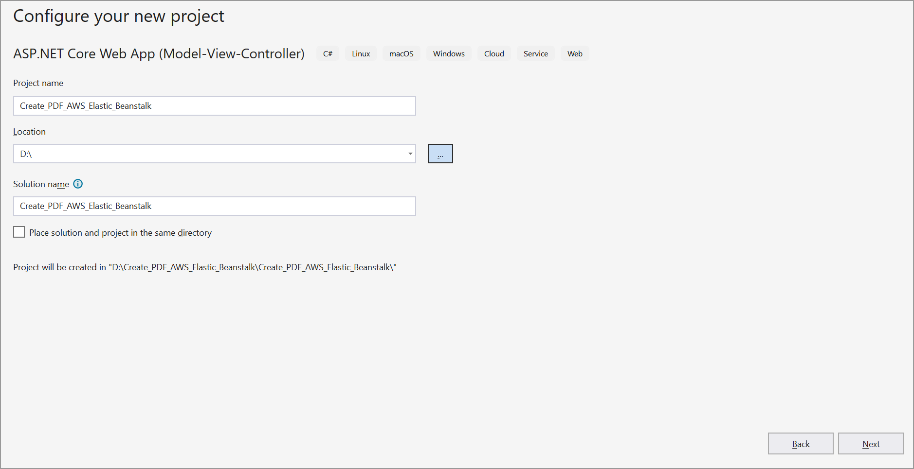
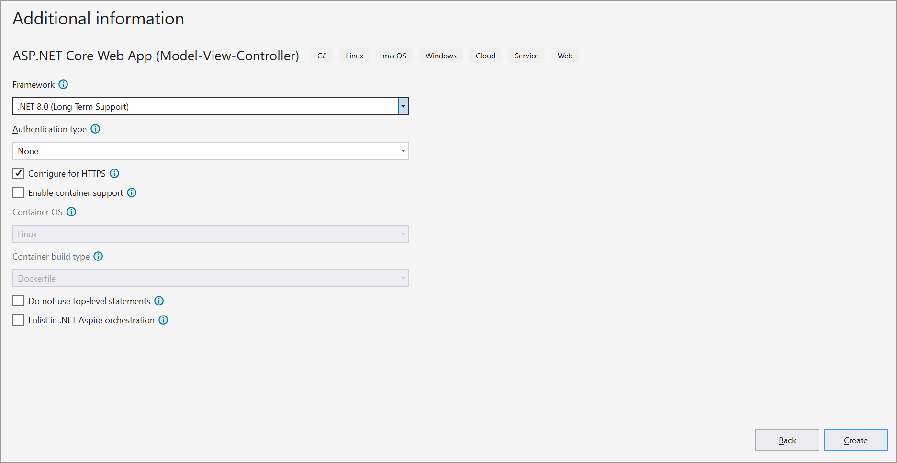
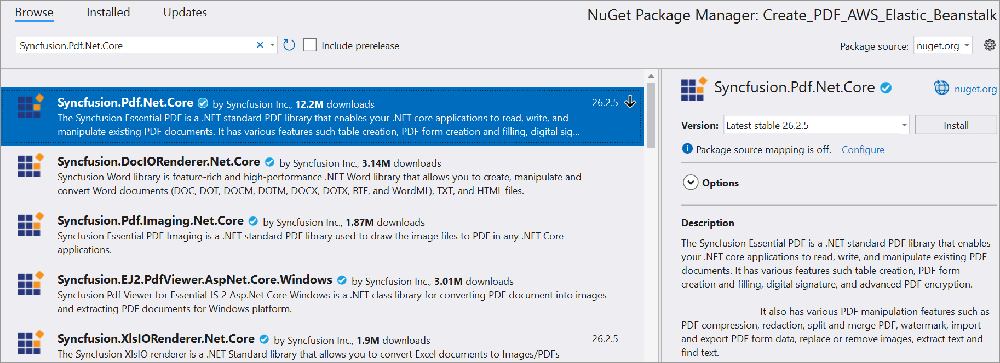
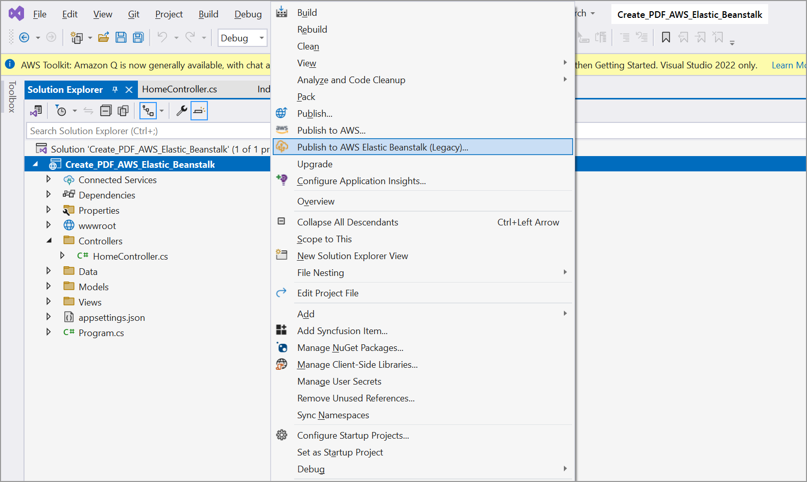
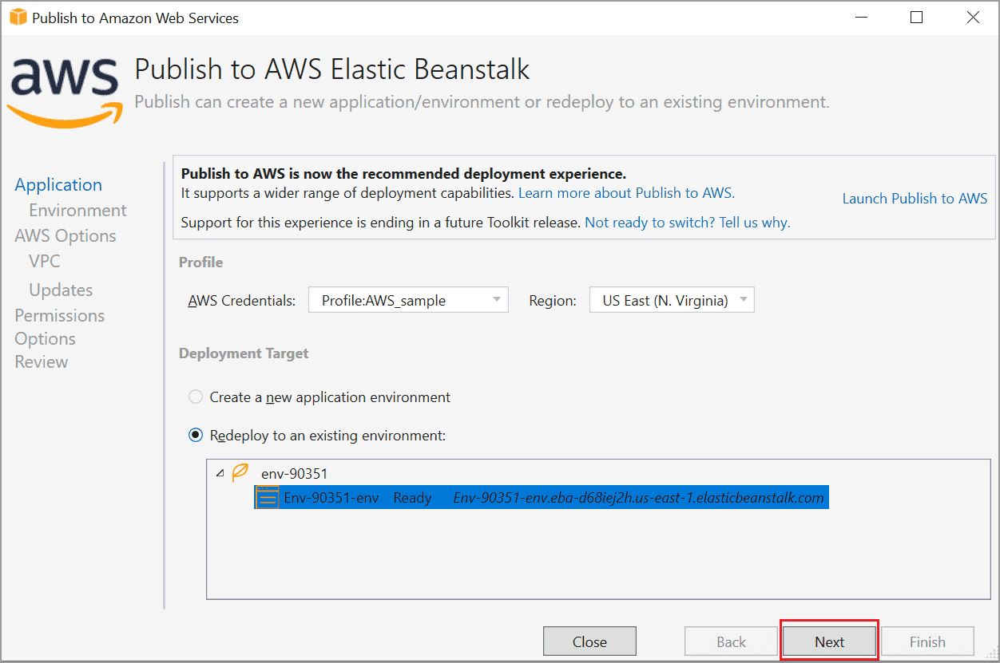
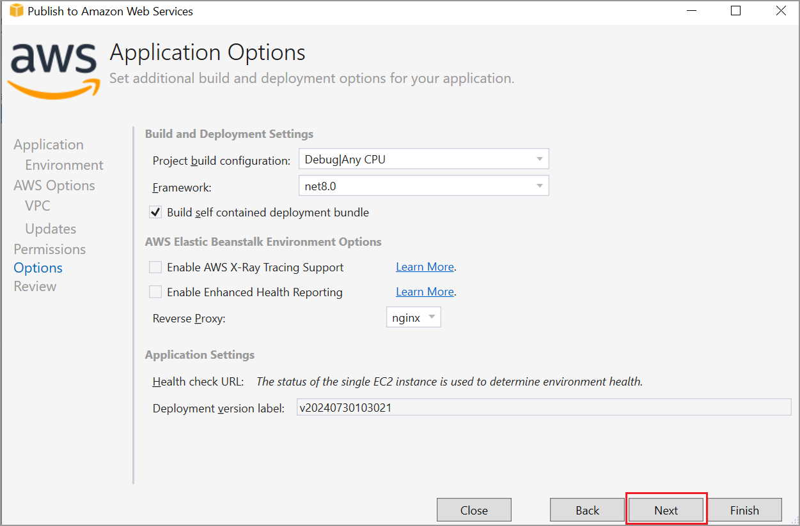
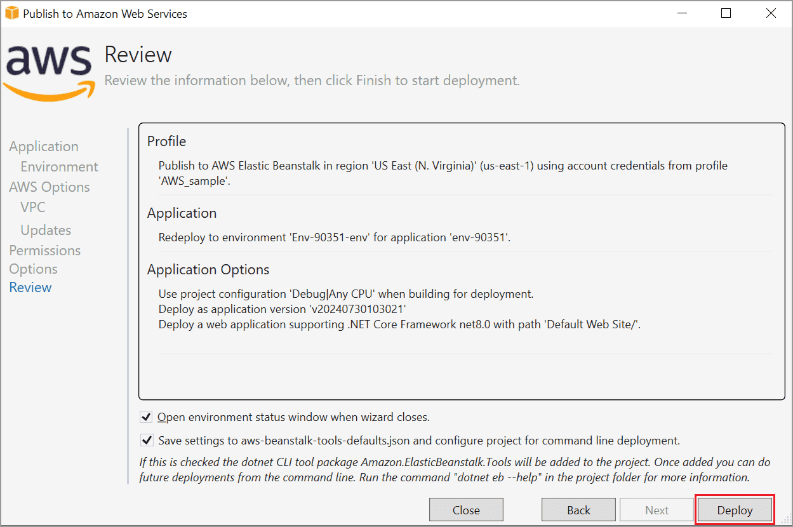
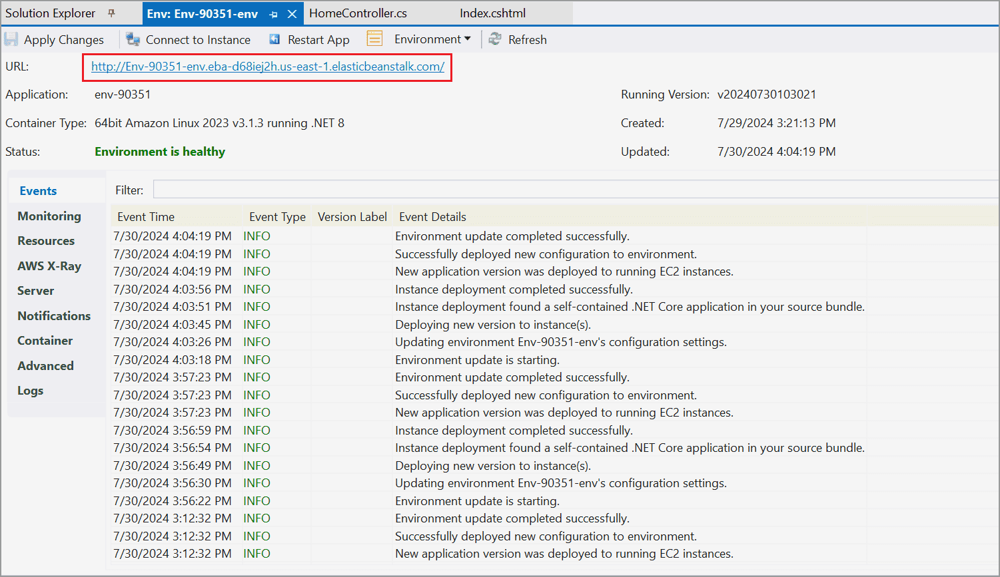
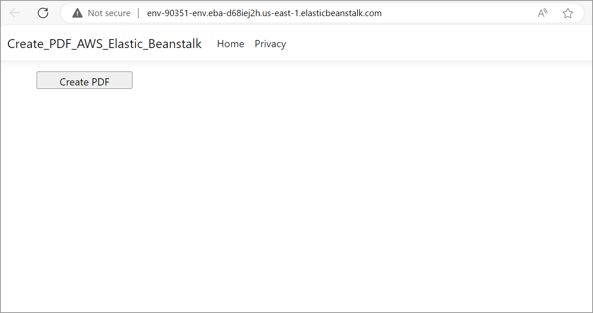

# Create PDF document in AWS Elastic Beanstalk

The [.NET PDF library](https://www.syncfusion.com/document-sdk/net-pdf-library) is used to create, read, and edit PDF documents programmatically without the dependency of Adobe Acrobat. Using this library, you can open and save PDF documents in AWS Elastic Beanstalk. 

## Prerequisites

* An active **Amazon Web Services (AWS) account** is required. If you don't have one, please [create an account](https://aws.amazon.com/) before starting.
* Download and install the **AWS Toolkit** for Visual Studio from this [link](https://aws.amazon.com/visualstudio/). You can install the toolkit from the **Extensions > Manage Extensions** option in Visual Studio.
* Visual Studio 2022 with the **ASP.NET and web development** workload.
* .NET 8.0 SDK or later.
* An active Syncfusion license. If you do not have one, request a free 30-day trial at [https://www.syncfusion.com/sales/communitylicense](https://www.syncfusion.com/sales/communitylicense).

## Steps to create a PDF document in AWS Elastic Beanstalk

Step 1: Create a new **C# ASP.NET Core Web Application** project using the **ASP.NET Core Web App (Model-View-Controller)** template so that a `HomeController.cs` and `Views/Home/index.cshtml` are available.

Step 2: In configuration windows, name your project and select Next.

Step 3: Install the [Syncfusion.Pdf.Net.Core](https://www.nuget.org/packages/Syncfusion.Pdf.Net.Core/) NuGet package as a reference to your project from [NuGet.org](https://www.nuget.org/).

Step 4: Register the Syncfusion license key. A trial watermark is added to every page of the generated PDF until a valid key is registered. Include the license key in **Program.cs** before initializing any Syncfusion component:




using Syncfusion.Licensing;

var builder = WebApplication.CreateBuilder(args);
// Register the Syncfusion license
Syncfusion.Licensing.SyncfusionLicenseProvider.RegisterLicense("YOUR LICENSE KEY");

// Add services to the container.
builder.Services.AddControllersWithViews();

var app = builder.Build();




Replace `"YOUR LICENSE KEY"` with the key from your Syncfusion account. If you do not have one, request a free 30-day trial at [https://www.syncfusion.com/sales/communitylicense](https://www.syncfusion.com/sales/communitylicense). For Elastic Beanstalk, store the key in the environment's **Configuration > Software > Environment properties** (key/value pair) and read it with `builder.Configuration["SyncfusionLicenseKey"]` so the key is never committed to source control. Refer to the [Syncfusion License documentation](https://help.syncfusion.com/common/essential-studio/licensing/overview) to learn about registering the Syncfusion license key in your application.

Step 5: A default controller named HomeController.cs is created with the ASP.NET Core MVC project. Create a `Data` folder in the project root, copy the `Input.pdf` file into it, and set **Copy to Output Directory** to **Copy if newer** for the file. Then include the following namespaces in the HomeController.cs file.




using Syncfusion.Pdf;
using Syncfusion.Pdf.Graphics;
using Syncfusion.Pdf.Grid;
using Syncfusion.Pdf.Parsing;
using Syncfusion.Drawing;




Step 6: Add a new button in index.cshtml as follows




@{
Html.BeginForm("CreatePDF", "Home", FormMethod.Get);
{
    

        <input type="submit" value="Create PDF" style="width:150px;height:27px" />
         
        

            @ViewBag.Message
        

    

}
Html.EndForm();
}




Step 7: Add a new action method named CreatePDF in HomeController.cs file and include the below code example to generate a PDF document in HomeController.cs.




public IActionResult CreatePDF()
{
    //Open an existing PDF document.
    FileStream fileStream = new FileStream("Data/Input.pdf", FileMode.Open, FileAccess.Read);
    PdfLoadedDocument document = new PdfLoadedDocument(fileStream);

    //Get the first page from a document.
    PdfLoadedPage page = document.Pages[0] as PdfLoadedPage;

    //Create PDF graphics for the page.
    PdfGraphics graphics = page.Graphics;

    //Create a PdfGrid.
    PdfGrid pdfGrid = new PdfGrid();
    //Add values to the list.
    List<object> data = new List<object>();
    data.Add(new { Product_ID = "1001", Product_Name = "Bicycle", Price = "10,000" });
    data.Add(new { Product_ID = "1002", Product_Name = "Head Light", Price = "3,000" });
    data.Add(new { Product_ID = "1003", Product_Name = "Break wire", Price = "1,500" });

    //Assign data source.
    pdfGrid.DataSource = data;

    //Apply built-in table style.
    pdfGrid.ApplyBuiltinStyle(PdfGridBuiltinStyle.GridTable4Accent3);

    //Draw the grid to the page of PDF document.
    pdfGrid.Draw(graphics, new RectangleF(40, 400, page.Size.Width - 80, 0));
    //Create the memory stream.
    MemoryStream stream = new MemoryStream();
    //Save the document to the memory stream.
    document.Save(stream);
    //Close the document
    document.Close(true); 
    //Return the PDF file as a download
    return File(stream.ToArray(), System.Net.Mime.MediaTypeNames.Application.Pdf, "Output.pdf");
}




Step 8: Build the project to ensure there are no compile errors. Then right-click the project and click the **Publish to AWS Elastic Beanstalk (Legacy)** option to publish the application in the AWS Elastic Beanstalk environment. Note that this option uses the legacy AWS publish tooling, which may be deprecated in future Visual Studio versions.

Step 9: Add the AWS profile (access key, secret key, and region) in the Publish to AWS Elastic Beanstalk window. After creating the profile, choose **Create a new application environment** or **Re-deploy to the existing environment**. Then, click **Next**.

Step 10: Click Next from the Application Options window.

Step 11: Click Deploy from the Review window.

Step 12: Click the URL link to launch the application once the Environment is updated successfully and Environment status is healthy.

Step 13: Now, the webpage will open in the browser. Click the **Create PDF** button to generate and download the PDF document.

By executing the program, you will get the PDF document as follows.

Users can download the [AWS Elastic Beanstalk](https://github.com/SyncfusionExamples/PDF-Examples/tree/master/Getting%20Started/AWS/AWSElasticBeanstalk) project from GitHub.

Click [here](https://www.syncfusion.com/document-sdk/net-pdf-library) to explore the rich set of Syncfusion&reg; PDF library features.

An online sample link to [create a PDF document](https://document.syncfusion.com/demos/pdf/default#/tailwind).

## Next steps

* [Create a PDF in AWS Lambda](Create-PDF-file-in-AWS-Lambda.md)
* [Create a PDF in ASP.NET Core MVC](Create-PDF-file-in-ASP-NET-Core.md)
* [Create a PDF in Docker](Create-PDF-document-in-Docker.md)
* [Open and read an existing PDF document](Open-PDF-file.md)
* [Save the generated PDF to a file or stream](Save-PDF-file.md)