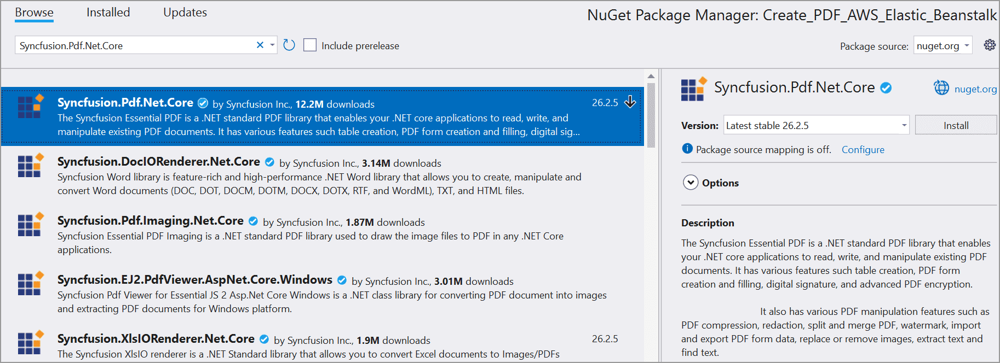
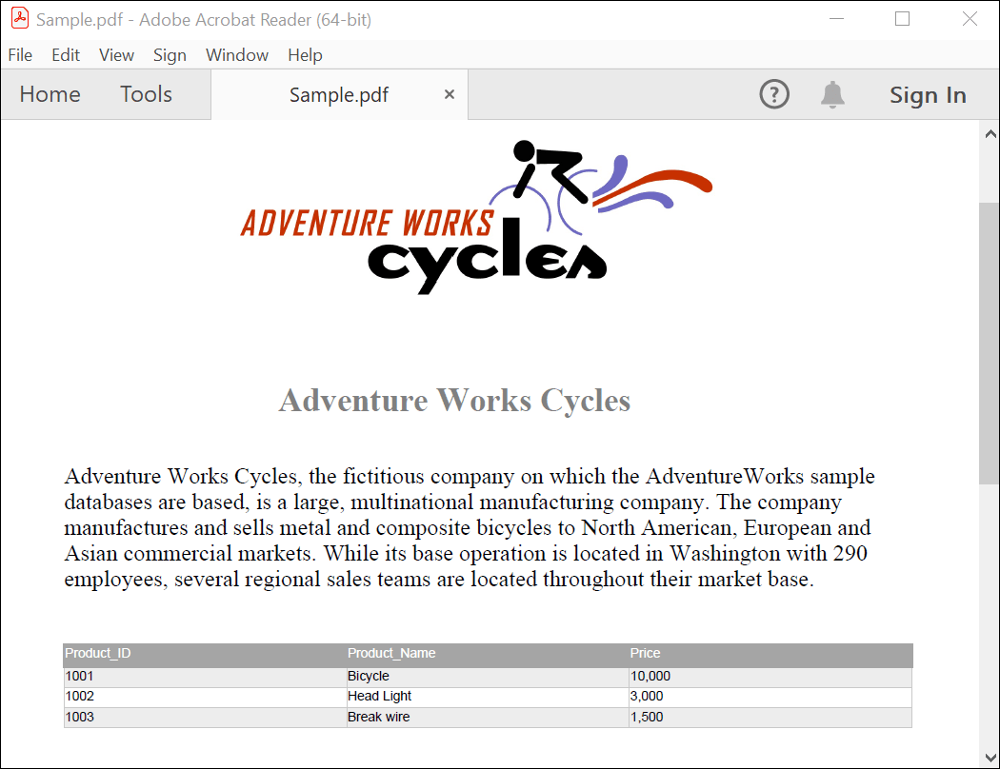

# Steps to create PDF document in AWS Elastic Beanstalk

The [Syncfusion&reg; .NET Core PDF library](https://www.syncfusion.com/document-processing/pdf-framework/net-core) is used to create, read, and edit PDF documents programmatically without the dependency of Adobe Acrobat. Using this library, open and save PDF documents in AWS Elastic Beanstalk. 

## Steps to create a PDF document in AWS Elastic Beanstalk

Step 1: Create a new C# ASP.NET Core Web Application project.

Step 2: In configuration windows, name your project and select Next.

Step 3: Install the [Syncfusion.Pdf.Net.Core](https://www.nuget.org/packages/Syncfusion.Pdf.Net.Core/) NuGet package as a reference to your project from [NuGet.org](https://www.nuget.org/).

Step 4: A default controller named HomeController.cs gets added to create the ASP.NET Core MVC project. Include the following namespaces in that HomeController.cs file.




    using Syncfusion.Pdf;
    using Syncfusion.Pdf.Graphics;
    using Syncfusion.Pdf.Grid;
    using Syncfusion.Pdf.Parsing;
    using Syncfusion.Drawing;




Step 5: Add a new button in index.cshtml as follows




   @{
    Html.BeginForm("CreatePDF", "Home", FormMethod.Get);
    {
        

            <input type="submit" value="Create PDF" style="width:150px;height:27px" />
             
            

                @ViewBag.Message
            

        

    }
    Html.EndForm();
}




Step 6: Add a new action method named CreatePDF in HomeController.cs file and include the below code example to generate a PDF document in HomeController.cs.




    public IActionResult CreatePDF()
    {
        //Open an existing PDF document.
        FileStream fileStream = new FileStream("Data/Input.pdf", FileMode.Open, FileAccess.Read);
        PdfLoadedDocument document = new PdfLoadedDocument(fileStream);

        //Get the first page from a document.
        PdfLoadedPage page = document.Pages[0] as PdfLoadedPage;

        //Create PDF graphics for the page.
        PdfGraphics graphics = page.Graphics;

        //Create a PdfGrid.
        PdfGrid pdfGrid = new PdfGrid();
        //Add values to the list.
        List<object> data = new List<object>();
        data.Add(new { Product_ID = "1001", Product_Name = "Bicycle", Price = "10,000" });
        data.Add(new { Product_ID = "1002", Product_Name = "Head Light", Price = "3,000" });
        data.Add(new { Product_ID = "1003", Product_Name = "Break wire", Price = "1,500" });

        //Assign data source.
        pdfGrid.DataSource = data;

        //Apply built-in table style.
        pdfGrid.ApplyBuiltinStyle(PdfGridBuiltinStyle.GridTable4Accent3);

        //Draw the grid to the page of PDF document.
        pdfGrid.Draw(graphics, new RectangleF(40, 400, page.Size.Width - 80, 0));
        //Create the memory stream.
        MemoryStream stream = new MemoryStream();
        //Save the document to the memory stream.
        document.Save(stream);
        //Close the documet
	    document.Close(true); 
	    //Return the PDF file as a download
        return File(stream.ToArray(), System.Net.Mime.MediaTypeNames.Application.Pdf, "Output.pdf");
    }




Step 7: Click the Publish to AWS Elastic Beanstalk (Legacy) option by right-clicking the project to publish the application in the AWS Elastic Beanstalk environment.

Step 8: Add the AWS profile in the Publish to AWS Elastic Beanstalk Window. After creating the profile, Choose Create a new application environment or Re-deploy to the existing environment. Then, click Next.

Step 9: Click Next from the Application Options window.

Step 10: Click Deploy from the Review window.

Step 11: Click the URL link to launch the application once the Environment is updated successfully and Environment status is healthy.

Step 12: Now, the webpage will open in the browser. Click the button to convert the webpage to a PDF document.

By executing the program, you will get the PDF document as follows.

Users can download the [AWS Elastic Beanstalk](https://github.com/SyncfusionExamples/PDF-Examples/tree/master/Getting%20Started/AWS/AWSElasticBeanstalk) project from GitHub.

Click [here](https://www.syncfusion.com/document-processing/pdf-framework/net-core?_gl=1*7czwz1*_ga*OTcwNzc5NDkuMTY4MTEwMjEwNA..*_ga_WC4JKKPHH0*MTY4OTg0NTE0Ni4zMzguMC4xNjg5ODQ1MTQ2LjYwLjAuMA..) to explore the rich set of Syncfusion&reg; PDF library features.

An online sample link to [create a PDF document](https://ej2.syncfusion.com/aspnetcore/PDF/HelloWorld#/bootstrap5) in ASP.NET Core