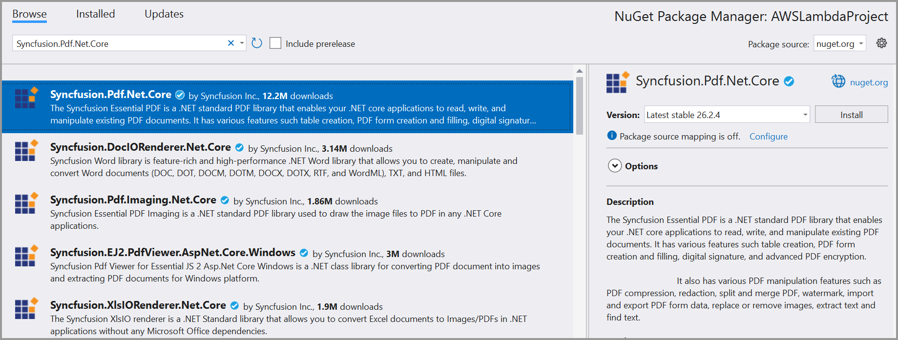
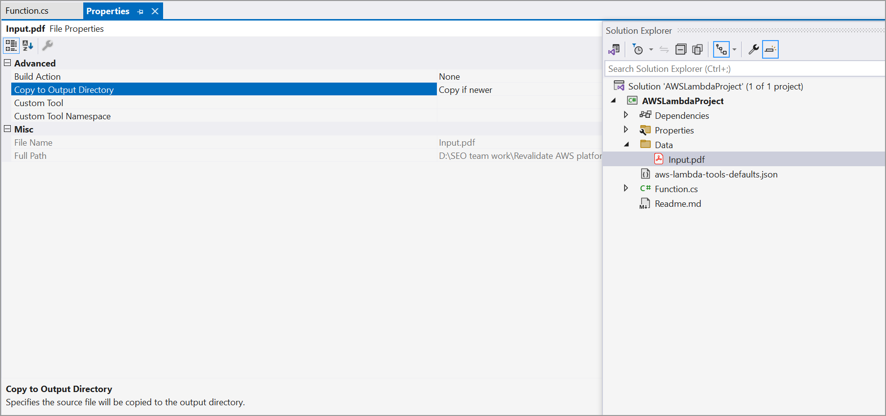
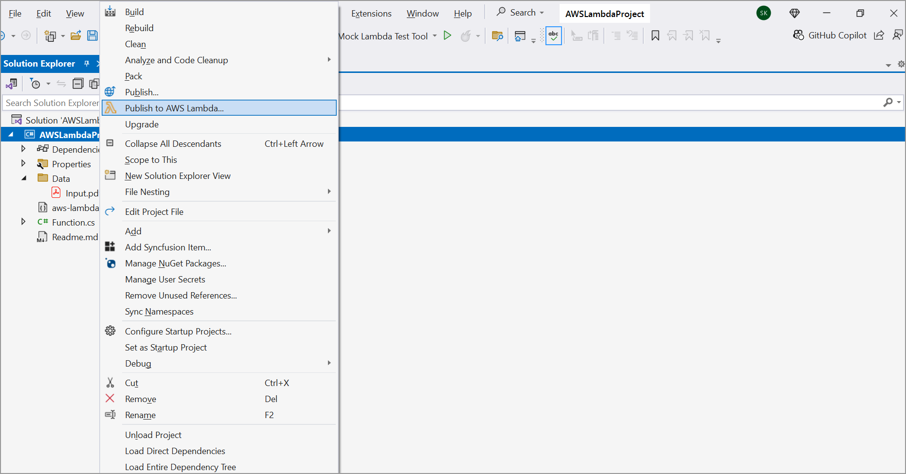
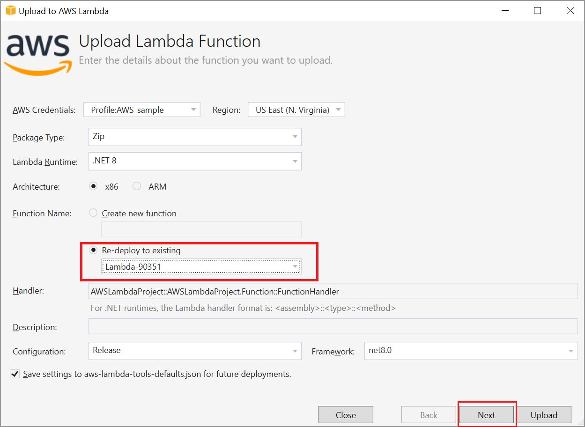
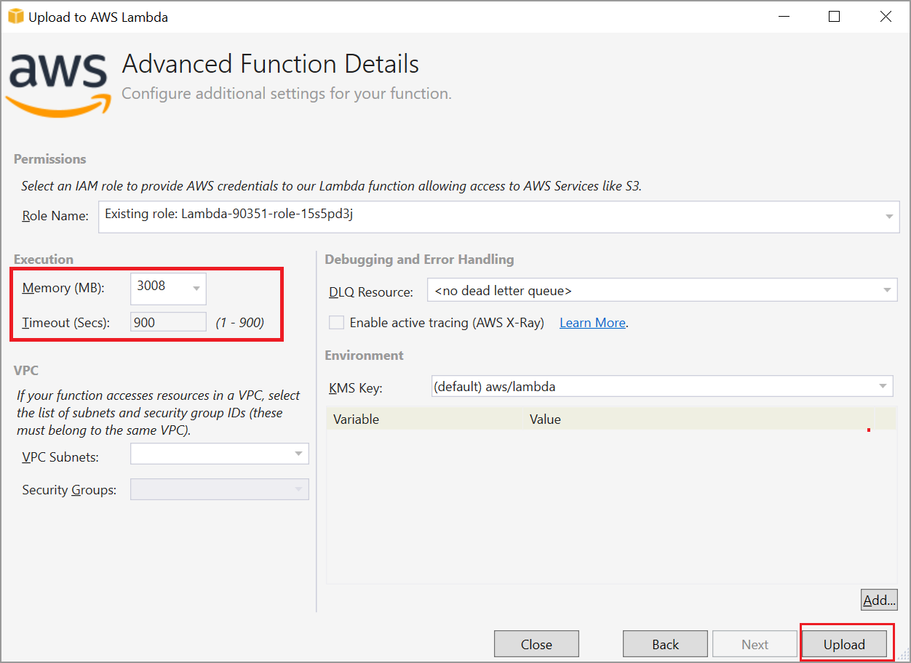
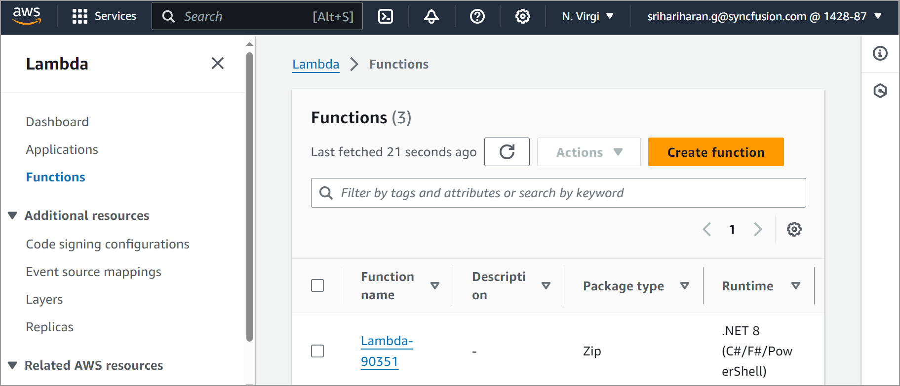
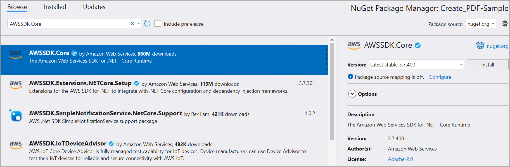
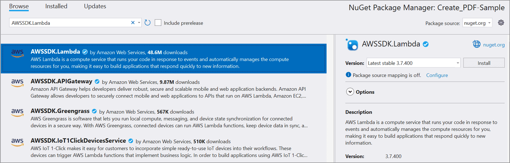
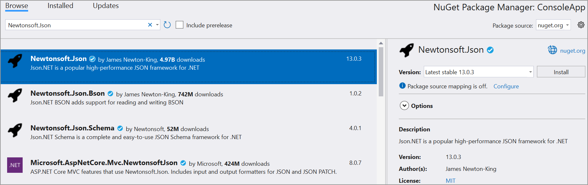
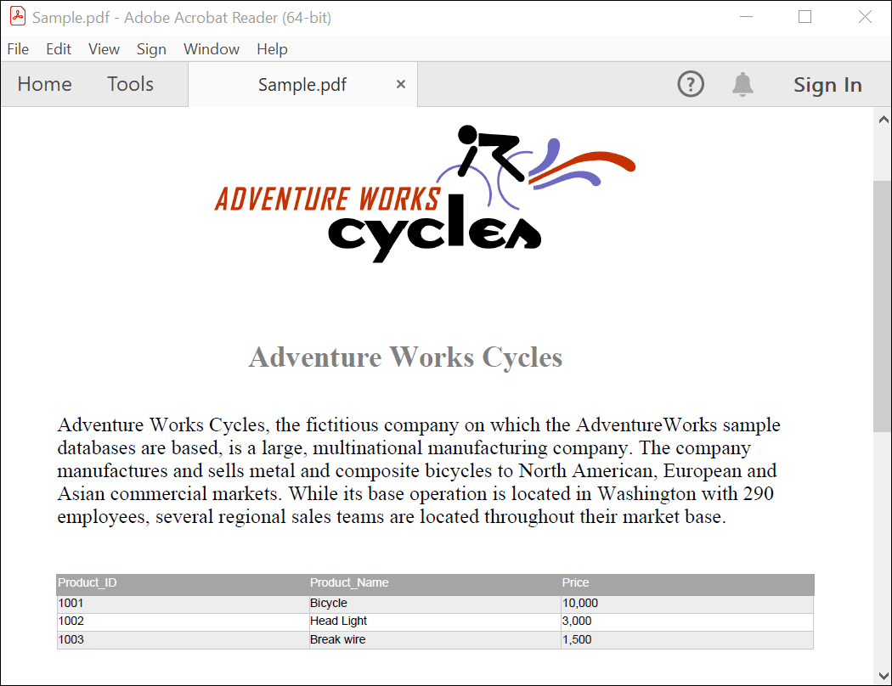

# Steps to create PDF document in AWS Lambda

The [Syncfusion&reg; .NET Core PDF library](https://www.syncfusion.com/document-processing/pdf-framework/net-core) is used to create, read, and edit PDF documents programmatically without the dependency of Adobe Acrobat. Using this library, open and save PDF documents in AWS Lambda. 

## Steps to create a PDF document in AWS Lambda

Step 1: Create a new **AWS Lambda project** as follows.

Step 2: Select Blueprint as Empty Function and click **Finish**.

Step 3: Install the [Syncfusion.Pdf.Imaging.Net.Core](https://www.nuget.org/packages?q=Syncfusion.Pdf.Imaging.Net.Core) NuGet package as a reference to your project from [NuGet.org](https://www.nuget.org/).

N> Starting with v16.2.0.x, if you reference Syncfusion&reg; assemblies from the trial setup or the NuGet feed, add the "Syncfusion.Licensing" assembly reference and include a license key in your projects. Please refer to this [link](https://help.syncfusion.com/common/essential-studio/licensing/overview) to register the Syncfusion&reg; license key in your application to use our components.

Step 4: Create a folder and copy the required data files and include the files in the project.

Step 5: Set the copy to output directory to Copy if newer to all the data files.

Step 6: Include the following namespaces in the **Function.cs** file.




using Syncfusion.Pdf;
using Syncfusion.Pdf.Graphics;
using Syncfusion.Drawing;
using Syncfusion.Pdf.Parsing;
using Syncfusion.Pdf.Grid;




step 7: Add the following code in Function.cs to open the PDF document and update in AWS Lambda.




string filePath = Path.GetFullPath(@"Data/Input.pdf");
//Open an existing PDF document.
using (FileStream stream = new FileStream(filePath, FileMode.Open, FileAccess.Read))
{
    PdfLoadedDocument document = new PdfLoadedDocument(stream);

    //Get the first page from a document.
    PdfLoadedPage page = document.Pages[0] as PdfLoadedPage;

    //Create PDF graphics for the page.
    PdfGraphics graphics = page.Graphics;

    //Create a PdfGrid.
    PdfGrid pdfGrid = new PdfGrid();
    //Add values to the list.
    List<object> data = new List<object>();
    data.Add(new { Product_ID = "1001", Product_Name = "Bicycle", Price = "10,000" });
    data.Add(new { Product_ID = "1002", Product_Name = "Head Light", Price = "3,000" });
    data.Add(new { Product_ID = "1003", Product_Name = "Break wire", Price = "1,500" });
                
    //Assign data source.
    pdfGrid.DataSource = data;

    //Apply built-in table style.
    pdfGrid.ApplyBuiltinStyle(PdfGridBuiltinStyle.GridTable4Accent3);

    //Draw the grid to the page of PDF document.
    pdfGrid.Draw(graphics, new RectangleF(40, 400, page.Size.Width - 80, 0));

    //Save the document into stream.
    MemoryStream memoryStream = new MemoryStream();
    document.Save(memoryStream);
    //Close the document.
    document.Close(true);
    //return the stream as base64 string
    return Convert.ToBase64String(memoryStream.ToArray());
}




Step 8: Right-click the project and select Publish to AWS Lambda.

Step 9: Add the AWS profile in the Upload Lambda Function Window. After creating the profile, Choose Create new function or Re-deploy to the existing Lambda function to publish. Then, click Next.

Step 10: In the Advanced Function Details window, specify the Role Name based on AWS Managed policy. And edit the memory size and Timeout as maximum in Basic settings of the AWS Lambda function. Then, click Upload to deploy your application.

Step 11: See the published Lambda function in the AWS console after deploying the application.

## Steps to post the request to AWS Lambda

Follow these steps to submit a request to the AWS Lambda function.

Step 1: Create a new console project.

step 2: Install the following NuGet packages in your application from [NuGet.org](https://www.nuget.org/).

* [AWSSDK.Core](https://www.nuget.org/packages/AWSSDK.Core/)
* [AWSSDK.Lambda](https://www.nuget.org/packages/AWSSDK.Lambda/)
* [Newtonsoft.Json](https://www.nuget.org/packages/Newtonsoft.Json/)

Step 3: Include the following namespaces in Program.cs file.




using Amazon;
using Amazon.Lambda;
using Amazon.Lambda.Model;
using Newtonsoft.Json;
using System.IO;




Step 4: Add the following code sample in Program.cs to invoke the published AWS Lambda function using the function name and access keys.




//Create a new AmazonLambdaClient
AmazonLambdaClient client = new AmazonLambdaClient("awsaccessKeyID", "awsSecreteAccessKey", RegionEndpoint.USEast1);
//Create new InvokeRequest with published function name.
InvokeRequest invoke = new InvokeRequest
{
    FunctionName = "MyNewFunction", //Add your lambda function name here
    InvocationType = InvocationType.RequestResponse,
    Payload = "\"Test\""
};
//Get the InvokeResponse from client InvokeRequest
InvokeResponse response = await client.InvokeAsync(invoke);
//Read the response stream
var stream = new StreamReader(response.Payload);
//Deserialize the response stream
JsonReader reader = new JsonTextReader(stream);
JsonSerializer serializer = new JsonSerializer();
var responseText = serializer.Deserialize(reader);

//Convert Base64String into byte array
byte[] bytes = Convert.FromBase64String(responseText.ToString());

//Write the byte array into a file
FileStream fileStream = new FileStream("Sample.pdf", FileMode.Create);
fileStream.Write(bytes, 0, bytes.Length);
fileStream.Flush();
fileStream.Dispose();

System.Diagnostics.Process.Start(new System.Diagnostics.ProcessStartInfo() { FileName = "Sample.pdf", UseShellExecute = true });




By executing the program, you will get the PDF document as follows.

Users can download the [console application](https://github.com/SyncfusionExamples/PDF-Examples/tree/master/Getting%20Started/AWS/ConsoleApp) and [AWS Lambda](https://github.com/SyncfusionExamples/PDF-Examples/tree/master/Getting%20Started/AWS/AWSLambdaProject) project from GitHub.

Click [here](https://www.syncfusion.com/document-processing/pdf-framework/net-core?_gl=1*7czwz1*_ga*OTcwNzc5NDkuMTY4MTEwMjEwNA..*_ga_WC4JKKPHH0*MTY4OTg0NTE0Ni4zMzguMC4xNjg5ODQ1MTQ2LjYwLjAuMA..) to explore the rich set of Syncfusion&reg; PDF library features.

An online sample link to [create a PDF document](https://ej2.syncfusion.com/aspnetcore/PDF/HelloWorld#/bootstrap5) in ASP.NET Core