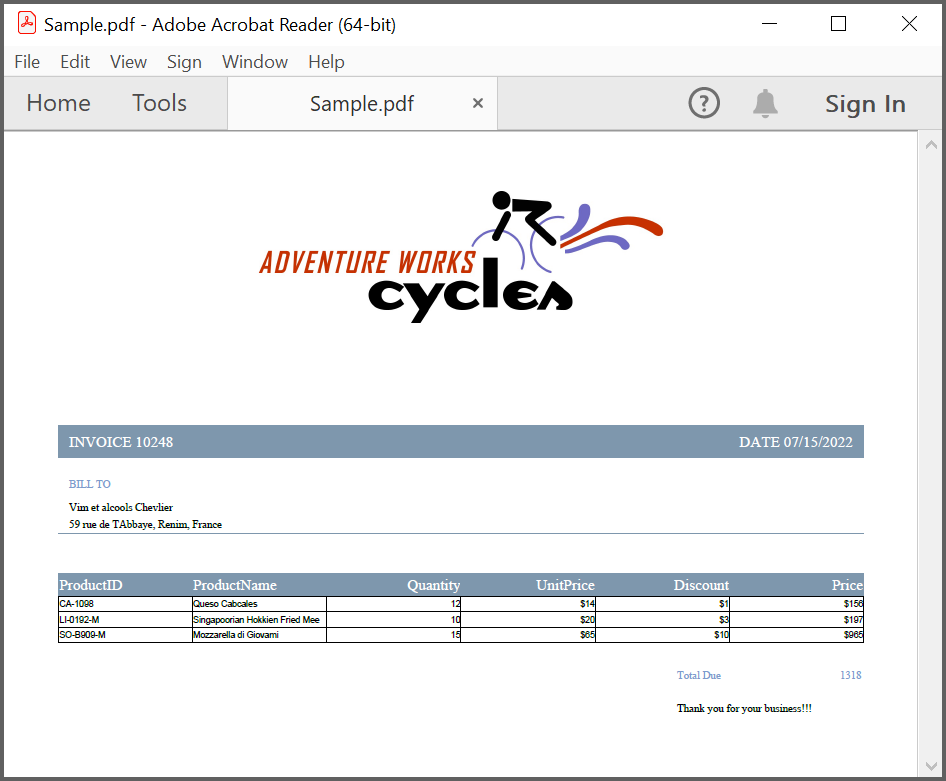
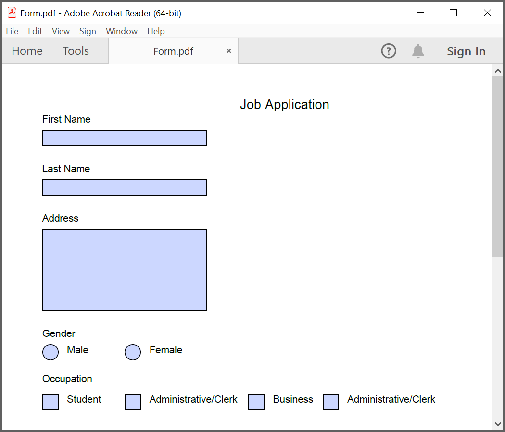
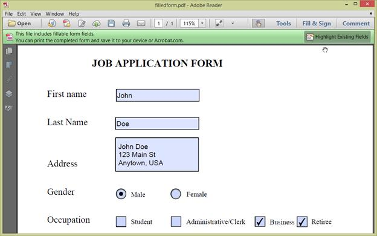

# Create or Generate PDF file in C# and VB.NET

The [.NET PDF library](https://www.syncfusion.com/document-sdk/net-pdf-library) is used to create a PDF document from scratch and save it to disk or stream. This library also offers functionality to merge, split, stamp, work with forms, and secure PDF files.

To include the .NET PDF library into your application, please refer to the [NuGet Package Required](https://help.syncfusion.com/document-processing/pdf/pdf-library/net/nuget-packages-required) or [Assemblies Required](https://help.syncfusion.com/document-processing/pdf/pdf-library/net/assemblies-required) documentation.

N> 1. Starting with v16.2.0.x, if you reference Syncfusion<sup>&reg;</sup> assemblies from trial setup or from the NuGet feed, you also have to include a license key in your projects. Please refer to this [link](https://help.syncfusion.com/common/essential-studio/licensing/overview) to know about registering Syncfusion<sup>&reg;</sup> license key in your application to use our components.
N> 2. Unlike System.Drawing APIs all the units are measured in point instead of pixel.

To quickly get started with creating a PDF document in .NET, watch this video:


## Creating a PDF document with simple text

The following code example shows how to create a PDF document with simple text using the [DrawString](https://help.syncfusion.com/cr/document-processing/Syncfusion.Pdf.Graphics.PdfGraphics.html#Syncfusion_Pdf_Graphics_PdfGraphics_DrawString_System_String_Syncfusion_Pdf_Graphics_PdfFont_Syncfusion_Pdf_Graphics_PdfBrush_System_Drawing_PointF_) method of the [PdfGraphics](https://help.syncfusion.com/cr/document-processing/Syncfusion.Pdf.Graphics.PdfGraphics.html) object to draw the text on the PDF page.




using Syncfusion.Drawing;
using Syncfusion.Pdf;
using Syncfusion.Pdf.Graphics;

//Create a new PDF document.
PdfDocument document = new PdfDocument();
//Add a page to the document.
PdfPage page = document.Pages.Add();
//Create PDF graphics for the page.
PdfGraphics graphics = page.Graphics;
//Set the standard font.
PdfFont font = new PdfStandardFont(PdfFontFamily.Helvetica, 20);
//Draw the text.
graphics.DrawString("Hello World!!!", font, PdfBrushes.Black, new PointF(0, 0));
//Save the document.
document.Save("Output.pdf");
//Close the document.
document.Close(true);





using System.Drawing;
using Syncfusion.Pdf;
using Syncfusion.Pdf.Graphics;

//Create a new PDF document.
PdfDocument document = new PdfDocument();
//Add a page to the document.
PdfPage page = document.Pages.Add();
//Create PDF graphics for the page.
PdfGraphics graphics = page.Graphics;
//Set the standard font.
PdfFont font = new PdfStandardFont(PdfFontFamily.Helvetica, 20);
//Draw the text.
graphics.DrawString("Hello World!!!", font, PdfBrushes.Black, new PointF(0, 0));
//Save the document.
document.Save("Output.pdf");
//Close the document.
document.Close(true);





Imports System.Drawing
Imports Syncfusion.Pdf
Imports Syncfusion.Pdf.Graphics

'Create a new PDF document.
Dim document As New PdfDocument()
'Add a page to the document.
Dim page As PdfPage = document.Pages.Add()
'Create PDF graphics for the page.
Dim graphics As PdfGraphics = page.Graphics
'Set the standard font.
Dim font As PdfFont = New PdfStandardFont(PdfFontFamily.Helvetica, 20)
'Draw the text.
graphics.DrawString("Hello World!!!", font, PdfBrushes.Black, New PointF(0, 0))
'Save the document.
document.Save("Output.pdf")
'Close the document.
document.Close(True)





You can download a complete working sample from [GitHub](https://github.com/SyncfusionExamples/PDF-Examples/blob/master/Getting%20Started/.NET/Create_PDF_NET/Create_PDF_NET/Program.cs).

## Creating a PDF document with image

The following code example shows how to generate a PDF document with an image using the [DrawImage](https://help.syncfusion.com/cr/document-processing/Syncfusion.Pdf.Graphics.PdfGraphics.html#Syncfusion_Pdf_Graphics_PdfGraphics_DrawImage_Syncfusion_Pdf_Graphics_PdfImage_System_Single_System_Single_) method of the [PdfGraphics](https://help.syncfusion.com/cr/document-processing/Syncfusion.Pdf.Graphics.PdfGraphics.html) class. 




using Syncfusion.Pdf;
using Syncfusion.Pdf.Graphics;

//Create a new PDF document.
PdfDocument doc = new PdfDocument();
//Add a page to the document.
PdfPage page = doc.Pages.Add();
//Create PDF graphics for the page
PdfGraphics graphics = page.Graphics;
//Load the image as stream.
FileStream imageStream = new FileStream("Autumn Leaves.jpg", FileMode.Open, FileAccess.Read);
PdfBitmap image = new PdfBitmap(imageStream);
//Draw the image
graphics.DrawImage(image, 0, 0);
//Save the document.
doc.Save("Output.pdf");
//Close the document.
doc.Close(true);




using Syncfusion.Pdf;
using Syncfusion.Pdf.Graphics;

//Create a new PDF document.
PdfDocument doc = new PdfDocument();
//Add a page to the document.
PdfPage page = doc.Pages.Add();
//Create PDF graphics for the page
PdfGraphics graphics = page.Graphics;
//Load the image from the disk.
PdfBitmap image = new PdfBitmap("Autumn Leaves.jpg");
//Draw the image
graphics.DrawImage(image, 0, 0);
//Save the document.
doc.Save("Output.pdf");
//Close the document.
doc.Close(true);




Imports Syncfusion.Pdf
Imports Syncfusion.Pdf.Graphics

'Create a new PDF document.
Dim doc As New PdfDocument()
'Add a page to the document.
Dim page As PdfPage = doc.Pages.Add()
'Create PDF graphics for the page
Dim graphics As PdfGraphics = page.Graphics
'Load the image from the disk.
Dim image As New PdfBitmap("Autumn Leaves.jpg")
'Draw the image
graphics.DrawImage(image, 0, 0)
'Save the document.
doc.Save("Output.pdf")
'Close the document.
doc.Close(True)




You can download a complete working sample from [GitHub](https://github.com/SyncfusionExamples/PDF-Examples/tree/master/Getting%20Started/.NET/Create_PDF_with_image_NET).

## Creating a PDF document with table

The following code example shows how to generate a PDF document with a simple table from a [DataSource](https://help.syncfusion.com/cr/document-processing/Syncfusion.Pdf.Grid.PdfGrid.html#Syncfusion_Pdf_Grid_PdfGrid_DataSource) using the [PdfGrid](https://help.syncfusion.com/cr/document-processing/Syncfusion.Pdf.Grid.PdfGrid.html) class. The [DataSource](https://help.syncfusion.com/cr/document-processing/Syncfusion.Pdf.Grid.PdfGrid.html#Syncfusion_Pdf_Grid_PdfGrid_DataSource) can be a data set, data table, arrays or an IEnumerable object.




using Syncfusion.Drawing;
using Syncfusion.Pdf;
using Syncfusion.Pdf.Grid;
using System.Data;

//Create a new PDF document
PdfDocument doc = new PdfDocument();
//Add a page
PdfPage page = doc.Pages.Add();
//Create a PdfGrid
PdfGrid pdfGrid = new PdfGrid();
//Create a DataTable
DataTable dataTable = new DataTable();
//Add columns to the DataTable
dataTable.Columns.Add("ProductID");
dataTable.Columns.Add("ProductName");
dataTable.Columns.Add("Quantity");
dataTable.Columns.Add("UnitPrice");
dataTable.Columns.Add("Discount");
dataTable.Columns.Add("Price");
//Add rows to the DataTable
dataTable.Rows.Add(new object[] { "CA-1098", "Queso Cabrales", "12", "14", "1", "167" });
dataTable.Rows.Add(new object[] { "LJ-0192-M", "Singaporean Hokkien Fried Mee", "10", "20", "3", "197" });
dataTable.Rows.Add(new object[] { "SO-B909-M", "Mozzarella di Giovanni", "15", "65", "10", "956"});
//Assign data source
pdfGrid.DataSource = dataTable;
//Draw grid to the page of PDF document
pdfGrid.Draw(page, new PointF(10, 10));
//Save the document
doc.Save("Output.pdf");
//Close the document
doc.Close(true);





using System.Drawing;
using Syncfusion.Pdf;
using Syncfusion.Pdf.Grid;
using System.Data;

//Create a new PDF document
PdfDocument doc = new PdfDocument();
//Add a page
PdfPage page = doc.Pages.Add();
//Create a PdfGrid
PdfGrid pdfGrid = new PdfGrid();
//Create a DataTable
DataTable dataTable = new DataTable();
//Add columns to the DataTable
dataTable.Columns.Add("ProductID");
dataTable.Columns.Add("ProductName");
dataTable.Columns.Add("Quantity");
dataTable.Columns.Add("UnitPrice");
dataTable.Columns.Add("Discount");
dataTable.Columns.Add("Price");
//Add rows to the DataTable
dataTable.Rows.Add(new object[] { "CA-1098", "Queso Cabrales", "12", "14", "1", "167" });
dataTable.Rows.Add(new object[] { "LJ-0192-M", "Singaporean Hokkien Fried Mee", "10", "20", "3", "197" });
dataTable.Rows.Add(new object[] { "SO-B909-M", "Mozzarella di Giovanni", "15", "65", "10", "956"});
//Assign data source
pdfGrid.DataSource = dataTable;
//Draw grid to the page of PDF document
pdfGrid.Draw(page, new PointF(10, 10));
//Save the document
doc.Save("Output.pdf");
//Close the document
doc.Close(true);





Imports Syncfusion.Drawing
Imports Syncfusion.Pdf
Imports Syncfusion.Pdf.Grid
Imports System.Data

'Create a new PDF document.
Dim doc As New PdfDocument()
'Add a page.
Dim page As PdfPage = doc.Pages.Add()
'Create a PdfGrid.
Dim pdfGrid As New PdfGrid()
'Create a DataTable.
Dim dataTable As New DataTable()
'Add columns to the DataTable
dataTable.Columns.Add("ProductID")
dataTable.Columns.Add("ProductName")
dataTable.Columns.Add("Quantity")
dataTable.Columns.Add("UnitPrice")
dataTable.Columns.Add("Discount")
dataTable.Columns.Add("Price")
'Add rows to the DataTable
dataTable.Rows.Add(New Object() {"CA-1098", "Queso Cabrales", "12", "14", "1", "167"})
dataTable.Rows.Add(New Object() {"LJ-0192-M", "Singaporean Hokkien Fried Mee", "10", "20", "3", "197"})
dataTable.Rows.Add(New Object() {"SO-B909-M", "Mozzarella di Giovanni", "15", "65", "10", "956"})
'Assign data source
pdfGrid.DataSource = dataTable
'Draw grid to the page of PDF document
pdfGrid.Draw(page, New PointF(10, 10))
'Save the document
doc.Save("Output.pdf")
'Close the document
doc.Close(True)





You can download a complete working sample from [GitHub](https://github.com/SyncfusionExamples/PDF-Examples/tree/master/Getting%20Started/.NET/Create_PDF_with_table_NET).

## Creating a simple PDF document with basic elements

Include the following necessary namespaces to create a simple PDF document with basic elements.




using Syncfusion.Drawing;
using Syncfusion.Pdf;
using Syncfusion.Pdf.Graphics;
using Syncfusion.Pdf.Grid;
using System.Data;
using System.Xml.Linq;





using System.Drawing;
using Syncfusion.Pdf;
using Syncfusion.Pdf.Graphics;
using Syncfusion.Pdf.Grid;
using System.Data;
using System.Xml.Linq;




Imports System.Data
Imports System.Xml.Linq
Imports Syncfusion.Drawing
Imports Syncfusion.Pdf
Imports Syncfusion.Pdf.Graphics
Imports Syncfusion.Pdf.Grid 





The [PdfDocument](https://help.syncfusion.com/cr/document-processing/Syncfusion.Pdf.PdfDocument.html) object represents an entire PDF document that is being created. The following code example shows how to generate a PDF document and add a [PdfPage](https://help.syncfusion.com/cr/document-processing/Syncfusion.Pdf.PdfPage.html) to it along with the [PdfPageSettings](https://help.syncfusion.com/cr/document-processing/Syncfusion.Pdf.PdfPageSettings.html).




//Creates a new PDF document
PdfDocument document = new PdfDocument();
//Adds page settings
document.PageSettings.Orientation = PdfPageOrientation.Landscape;
document.PageSettings.Margins.All = 50;
//Adds a page to the document
PdfPage page = document.Pages.Add();




//Creates a new PDF document
PdfDocument document = new PdfDocument();
//Adds page settings
document.PageSettings.Orientation = PdfPageOrientation.Landscape;
document.PageSettings.Margins.All = 50;
//Adds a page to the document
PdfPage page = document.Pages.Add();




'Creates a new PDF document
Dim document As New PdfDocument()
'Adds page settings
document.PageSettings.Orientation = PdfPageOrientation.Landscape
document.PageSettings.Margins.All = 50
'Adds a page to the document
Dim page As PdfPage = document.Pages.Add()





1. Essential<sup>&reg;</sup> PDF has APIs similar to the .NET GDI plus which helps to draw elements to the PDF page just like 2D drawing in .NET. 
2. Unlike System.Drawing APIs all the units are measured in point instead of pixel. 
3. In PDF, all the elements are placed in absolute positions and has the possibility for content overlapping if misplaced. 
4. Essential<sup>&reg;</sup> PDF provides the rendered bounds for each and every elements added, through [PdfLayoutResult](https://help.syncfusion.com/cr/document-processing/Syncfusion.Pdf.Graphics.PdfLayoutResult.html) objects. This can be used to add successive elements and prevent content overlap.

The following code example explains how to add an image from disk to a PDF document, by providing the rectangle coordinates. 



//Create PDF graphics for the page.
PdfGraphics g = page.Graphics;
//Loads the image from disk
FileStream imageStream = new FileStream("AdventureCycle.jpg", FileMode.Open, FileAccess.Read);
PdfImage image = PdfImage.FromStream(imageStream);
//Draws the image to the PDF page
page.Graphics.DrawImage(image, new RectangleF(176, 0, 390, 130));




//Create PDF graphics for the page.
PdfGraphics g = page.Graphics;
//Loads the image from disk
PdfImage image = PdfImage.FromFile("AdventureCycle.jpg");
//Draws the image to the PDF page
page.Graphics.DrawImage(image, new RectangleF(176, 0, 390, 130));




'Create PDF graphics for the page.
PdfGraphics g = page.Graphics
'Loads the image from disk 
Dim image As PdfImage = PdfImage.FromFile("AdventureCycle.jpg")
'Draws the image to the PDF page
page.Graphics.DrawImage(image, New RectangleF(176, 0, 390, 130))





The following methods can be used to add text to a PDF document:

1. [DrawString()](https://help.syncfusion.com/cr/document-processing/Syncfusion.Pdf.Graphics.PdfGraphics.html#Syncfusion_Pdf_Graphics_PdfGraphics_DrawString_System_String_Syncfusion_Pdf_Graphics_PdfFont_Syncfusion_Pdf_Graphics_PdfBrush_System_Drawing_PointF_) method of the [PdfGraphics](https://help.syncfusion.com/cr/document-processing/Syncfusion.Pdf.Graphics.PdfGraphics.html)
2. [PdfTextElement](https://help.syncfusion.com/cr/document-processing/Syncfusion.Pdf.Graphics.PdfTextElement.html) class.

The ```PdfTextElement``` provides the layout result of the added text by using the location of the next element that decides to prevent content overlapping. This is not available in the ```DrawString``` method. 

The following code example adds the necessary text such as address, invoice number and date to create a basic invoice application. 




PdfLayoutResult result = new PdfLayoutResult(page, new RectangleF(0, 0, page.Graphics.ClientSize.Width / 2, 95));
PdfFont subHeadingFont = new PdfStandardFont(PdfFontFamily.TimesRoman, 14);
//Draw Rectangle place on location
g.DrawRectangle(new PdfSolidBrush(new PdfColor(126, 151, 173)), new RectangleF(0, result.Bounds.Bottom + 40, g.ClientSize.Width, 30));
element = new PdfTextElement("INVOICE " + 10248, subHeadingFont);
element.Brush = PdfBrushes.White;
result = element.Draw(page, new PointF(10, result.Bounds.Bottom + 48));
string currentDate = "DATE " + DateTime.Now.ToString("MM/dd/yyyy");
SizeF textSize = subHeadingFont.MeasureString(currentDate);
g.DrawString(currentDate, subHeadingFont, element.Brush, new PointF(g.ClientSize.Width - textSize.Width - 10, result.Bounds.Y));

//Draw Bill header
element = new PdfTextElement("BILL TO ", new PdfStandardFont(PdfFontFamily.TimesRoman, 10));
element.Brush = new PdfSolidBrush(new PdfColor(126, 155, 203));
result = element.Draw(page, new PointF(10, result.Bounds.Bottom + 25));
//Draw Bill address
element = new PdfTextElement(string.Format("{0}, {1}, {2}", "Vin et alcohol Chevalier", "\n59 rue deb l'Abbaye ", " Reims, France"), new PdfStandardFont(PdfFontFamily.TimesRoman, 10));
element.Brush = new PdfSolidBrush(new PdfColor(89, 89, 93));
result = element.Draw(page, new RectangleF(10, result.Bounds.Bottom + 3, g.ClientSize.Width / 2, 100));
//Draw Bill line
g.DrawLine(new PdfPen(new PdfColor(126, 151, 173), 0.70f), new PointF(0, result.Bounds.Bottom + 3), new PointF(g.ClientSize.Width, result.Bounds.Bottom + 3));





PdfLayoutResult result = new PdfLayoutResult(page, new RectangleF(0, 0, page.Graphics.ClientSize.Width / 2, 95));
PdfFont subHeadingFont = new PdfStandardFont(PdfFontFamily.TimesRoman, 14);
//Draw Rectangle place on location
g.DrawRectangle(new PdfSolidBrush(new PdfColor(126, 151, 173)), new RectangleF(0, result.Bounds.Bottom + 40, g.ClientSize.Width, 30));
element = new PdfTextElement("INVOICE " + 10248, subHeadingFont);
element.Brush = PdfBrushes.White;
result = element.Draw(page, new PointF(10, result.Bounds.Bottom + 48));
string currentDate = "DATE " + DateTime.Now.ToString("MM/dd/yyyy");
SizeF textSize = subHeadingFont.MeasureString(currentDate);
g.DrawString(currentDate, subHeadingFont, element.Brush, new PointF(g.ClientSize.Width - textSize.Width - 10, result.Bounds.Y));

//Draw Bill header
element = new PdfTextElement("BILL TO ", new PdfStandardFont(PdfFontFamily.TimesRoman, 10));
element.Brush = new PdfSolidBrush(new PdfColor(126, 155, 203));
result = element.Draw(page, new PointF(10, result.Bounds.Bottom + 25));
//Draw Bill address
element = new PdfTextElement(string.Format("{0}, {1}, {2}", "Vin et alcohol Chevalier", "\n59 rue deb l'Abbaye ", " Reims, France"), new PdfStandardFont(PdfFontFamily.TimesRoman, 10));
element.Brush = new PdfSolidBrush(new PdfColor(89, 89, 93));
result = element.Draw(page, new RectangleF(10, result.Bounds.Bottom + 3, g.ClientSize.Width / 2, 100));
//Draw Bill line
g.DrawLine(new PdfPen(new PdfColor(126, 151, 173), 0.70f), new PointF(0, result.Bounds.Bottom + 3), new PointF(g.ClientSize.Width, result.Bounds.Bottom + 3));





Dim subHeadingFont As PdfFont = New PdfStandardFont(PdfFontFamily.TimesRoman, 14)
'Draw Rectangle place on location
g.DrawRectangle(New PdfSolidBrush(New PdfColor(126, 151, 173)), New RectangleF(0, (result.Bounds.Bottom + 40), g.ClientSize.Width, 30))
element = New PdfTextElement(("INVOICE " + 10248), subHeadingFont)
element.Brush = PdfBrushes.White
result = element.Draw(page, New PointF(10, (result.Bounds.Bottom + 48)))
Dim currentDate As String = ("DATE " + DateTime.Now.ToString("MM/dd/yyyy"))
Dim textSize As SizeF = subHeadingFont.MeasureString(currentDate)
g.DrawString(currentDate, subHeadingFont, element.Brush, New PointF((g.ClientSize.Width - (textSize.Width - 10)), result.Bounds.Y))
'Draw Bill header
element = New PdfTextElement("BILL TO ", New PdfStandardFont(PdfFontFamily.TimesRoman, 10))
element.Brush = New PdfSolidBrush(New PdfColor(126, 155, 203))
result = element.Draw(page, New PointF(10, (result.Bounds.Bottom + 25)))
'Draw Bill address
element = New PdfTextElement(String.Format("{0}, {1}, {2}", "Vin et alcohol Chevalier", ""& vbLf&"59 rue deb l'Abbaye ", " Reims, France"), New PdfStandardFont(PdfFontFamily.TimesRoman, 10))
element.Brush = New PdfSolidBrush(New PdfColor(89, 89, 93))
result = element.Draw(page, New RectangleF(10, (result.Bounds.Bottom + 3), (g.ClientSize.Width / 2), 100))
'Draw Bill line
g.DrawLine(New PdfPen(New PdfColor(126, 151, 173), 0.7!), New PointF(0, (result.Bounds.Bottom + 3)), New PointF(g.ClientSize.Width, (result.Bounds.Bottom + 3)))





Essential<sup>&reg;</sup> PDF provides two types of table models. The difference between both the table models can be referred from the link 
[Difference between PdfLightTable and PdfGrid](https://help.syncfusion.com/document-processing/pdf/pdf-library/net/working-with-tables#difference-between-pdflighttable-and-pdfgrid)

Since the invoice document requires only simple cell customizations, the given code example explains how to create a simple invoice table by using [PdfGrid](https://help.syncfusion.com/cr/document-processing/Syncfusion.Pdf.Grid.PdfGrid.html).




//Creates the datasource for the table
DataTable invoiceDetails = GetProductDetailsAsDataTable();
//Creates a PDF grid
PdfGrid grid = new PdfGrid();
//Adds the data source
grid.DataSource = invoiceDetails;
//Creates the grid cell styles
PdfGridCellStyle cellStyle = new PdfGridCellStyle();
cellStyle.Borders.All = PdfPens.White;
PdfGridRow header = grid.Headers[0];
//Creates the header style
PdfGridCellStyle headerStyle = new PdfGridCellStyle();
headerStyle.Borders.All = new PdfPen(new PdfColor(126, 151, 173));
headerStyle.BackgroundBrush = new PdfSolidBrush(new PdfColor(126, 151, 173));
headerStyle.TextBrush = PdfBrushes.White;
headerStyle.Font = new PdfStandardFont(PdfFontFamily.TimesRoman, 14f, PdfFontStyle.Regular);

//Adds cell customizations
for (int i = 0; i < header.Cells.Count; i++)
{
if (i == 0 || i == 1)
header.Cells[i].StringFormat = new PdfStringFormat(PdfTextAlignment.Left, PdfVerticalAlignment.Middle);
else
header.Cells[i].StringFormat = new PdfStringFormat(PdfTextAlignment.Right, PdfVerticalAlignment.Middle);
}

//Applies the header style
header.ApplyStyle(headerStyle);
cellStyle.Borders.Bottom = new PdfPen(new PdfColor(217, 217, 217), 0.70f);
cellStyle.Font = new PdfStandardFont(PdfFontFamily.TimesRoman, 12f);
cellStyle.TextBrush = new PdfSolidBrush(new PdfColor(131, 130, 136));
//Creates the layout format for grid
PdfGridLayoutFormat layoutFormat = new PdfGridLayoutFormat();
// Creates layout format settings to allow the table pagination
layoutFormat.Layout = PdfLayoutType.Paginate;
//Draws the grid to the PDF page.
PdfGridLayoutResult gridResult = grid.Draw(page, new RectangleF(new PointF(0, result.Bounds.Bottom + 40), new SizeF(g.ClientSize.Width, g.ClientSize.Height - 100)), layoutFormat);





//Creates the datasource for the table
DataTable invoiceDetails = GetProductDetailsAsDataTable();
//Creates a PDF grid
PdfGrid grid = new PdfGrid();
//Adds the data source
grid.DataSource = invoiceDetails;
//Creates the grid cell styles
PdfGridCellStyle cellStyle = new PdfGridCellStyle();
cellStyle.Borders.All = PdfPens.White;
PdfGridRow header = grid.Headers[0];
//Creates the header style
PdfGridCellStyle headerStyle = new PdfGridCellStyle();
headerStyle.Borders.All = new PdfPen(new PdfColor(126, 151, 173));
headerStyle.BackgroundBrush = new PdfSolidBrush(new PdfColor(126, 151, 173));
headerStyle.TextBrush = PdfBrushes.White;
headerStyle.Font = new PdfStandardFont(PdfFontFamily.TimesRoman, 14f, PdfFontStyle.Regular);

//Adds cell customizations
for (int i = 0; i < header.Cells.Count; i++)
{
if (i == 0 || i == 1)
header.Cells[i].StringFormat = new PdfStringFormat(PdfTextAlignment.Left, PdfVerticalAlignment.Middle);
else
header.Cells[i].StringFormat = new PdfStringFormat(PdfTextAlignment.Right, PdfVerticalAlignment.Middle);
}

//Applies the header style
header.ApplyStyle(headerStyle);
cellStyle.Borders.Bottom = new PdfPen(new PdfColor(217, 217, 217), 0.70f);
cellStyle.Font = new PdfStandardFont(PdfFontFamily.TimesRoman, 12f);
cellStyle.TextBrush = new PdfSolidBrush(new PdfColor(131, 130, 136));
//Creates the layout format for grid
PdfGridLayoutFormat layoutFormat = new PdfGridLayoutFormat();
// Creates layout format settings to allow the table pagination
layoutFormat.Layout = PdfLayoutType.Paginate;
//Draws the grid to the PDF page.
PdfGridLayoutResult gridResult = grid.Draw(page, new RectangleF(new PointF(0, result.Bounds.Bottom + 40), new SizeF(g.ClientSize.Width, g.ClientSize.Height - 100)), layoutFormat);





'Creates the datasource for the table
Dim invoiceDetails As DataTable = GetProductDetails(Integer.Parse(invoiceNumber))
'Create a PDF grid
Dim grid As New PdfGrid()
'Adds the data source
grid.DataSource = invoiceDetails
'creates the grid cell styles
Dim cellStyle As New PdfGridCellStyle()
cellStyle.Borders.All = PdfPens.White
Dim header As PdfGridRow = grid.Headers(0)
'Creates the header style
Dim headerStyle As New PdfGridCellStyle()
headerStyle.Borders.All = New PdfPen(New PdfColor(126, 151, 173))
headerStyle.BackgroundBrush = New PdfSolidBrush(New PdfColor(126, 151, 173))
headerStyle.TextBrush = PdfBrushes.White
headerStyle.Font = New PdfStandardFont(PdfFontFamily.TimesRoman, 14.0F, PdfFontStyle.Regular)
'Adds cell customizations
For i As Integer = 0 To header.Cells.Count - 1
If i = 0 OrElse i = 1 Then
header.Cells(i).StringFormat = New PdfStringFormat(PdfTextAlignment.Left, PdfVerticalAlignment.Middle)
Else
header.Cells(i).StringFormat = New PdfStringFormat(PdfTextAlignment.Right, PdfVerticalAlignment.Middle)
End If
Next
'Applies the header style
header.ApplyStyle(headerStyle)
cellStyle.Borders.Bottom = New PdfPen(New PdfColor(217, 217, 217), 0.7F)
cellStyle.Font = New PdfStandardFont(PdfFontFamily.TimesRoman, 12.0F)
cellStyle.TextBrush = New PdfSolidBrush(New PdfColor(131, 130, 136))
'Creates the layout format for grid
Dim layoutFormat As New PdfGridLayoutFormat()
'Layout format settings to allow the table pagination
layoutFormat.Layout = PdfLayoutType.Paginate
'Draws the grid to the PDF page.
Dim gridResult As PdfGridLayoutResult = grid.Draw(page, New RectangleF(New PointF(0, result.Bounds.Bottom + 40), New SizeF(g.ClientSize.Width, g.ClientSize.Height - 100)), layoutFormat)





The following code example shows how to save the invoice document to disk and dispose the [PdfDocument](https://help.syncfusion.com/cr/document-processing/Syncfusion.Pdf.PdfDocument.html) object.




//Saves and closes the document.
document.Save("Sample.pdf");
document.Close(true);





//Saves and closes the document.
document.Save("Sample.pdf");
document.Close(true);





'Saves and closes the document.
document.Save("Sample.pdf")
document.Close(True)





You can download a complete working sample from [GitHub](https://github.com/SyncfusionExamples/PDF-Examples/tree/master/Getting%20Started/.NET/Create_PDF_with_basic_elements_NET).

The following screenshot shows the invoice PDF document created by using .NET PDF library.


## Filling forms

An interactive form, sometimes referred to as an AcroForm is a collection of fields for gathering information interactively from the user. A [PDF document](https://help.syncfusion.com/cr/document-processing/Syncfusion.Pdf.PdfDocument.html) or an [existing PDF document](https://help.syncfusion.com/cr/document-processing/Syncfusion.Pdf.Parsing.PdfLoadedDocument.html) can contain any number of fields appearing in any combination of pages, all of that make a single, globally interactive form spanning the entire document.

.NET PDF library allows you to [create/write and manipulate existing form](https://www.syncfusion.com/document-processing/pdf-framework/net/pdf-library/pdf-form-fields) in PDF document using the [PdfForm](https://help.syncfusion.com/cr/document-processing/Syncfusion.Pdf.Interactive.PdfForm.html) class. To work with existing form documents, the following namespaces are required.

1. Syncfusion.Pdf
2. Syncfusion.Pdf.Parsing

The following guide shows how to fill a sample PDF form programmatically.


.NET PDF library allows you to fill the form fields by using [PdfLoadedField](https://help.syncfusion.com/cr/document-processing/Syncfusion.Pdf.Parsing.PdfLoadedField.html) class. You can get the form field either by using its field name or field index.




using Syncfusion.Pdf.Parsing;

//Loads the PDF form.
PdfLoadedDocument loadedDocument = new PdfLoadedDocument(@"JobApplication.pdf");
//Loads the form
PdfLoadedForm form = loadedDocument.Form;
//Fills the textbox field by using index
(form.Fields[0] as PdfLoadedTextBoxField).Text = "John";
//Fills the textbox fields by using field name
(form.Fields["LastName"] as PdfLoadedTextBoxField).Text = "Doe";
(form.Fields["Address"] as PdfLoadedTextBoxField).Text = " John Doe \n 123 Main St \n Any town, USA";
//Loads the radio button group
PdfLoadedRadioButtonItemCollection radioButtonCollection = (form.Fields["Gender"] as PdfLoadedRadioButtonListField).Items;
//Checks the 'Male' option
radioButtonCollection[0].Checked = true;
//Checks the 'business' checkbox field
(form.Fields["Business"] as PdfLoadedCheckBoxField).Checked = true;
//Checks the 'retiree' checkbox field
(form.Fields["Retiree"] as PdfLoadedCheckBoxField).Checked = true;
//Saves and closes the document
loadedDocument.Save("output.pdf");
loadedDocument.Close(true);





using Syncfusion.Pdf.Parsing;

//Loads the PDF form.
PdfLoadedDocument loadedDocument = new PdfLoadedDocument(@"JobApplication.pdf");
//Loads the form
PdfLoadedForm form = loadedDocument.Form;
//Fills the textbox field by using index
(form.Fields[0] as PdfLoadedTextBoxField).Text = "John";
//Fills the textbox fields by using field name
(form.Fields["LastName"] as PdfLoadedTextBoxField).Text = "Doe";
(form.Fields["Address"] as PdfLoadedTextBoxField).Text = " John Doe \n 123 Main St \n Any town, USA";
//Loads the radio button group
PdfLoadedRadioButtonItemCollection radioButtonCollection = (form.Fields["Gender"] as PdfLoadedRadioButtonListField).Items;
//Checks the 'Male' option
radioButtonCollection[0].Checked = true;
//Checks the 'business' checkbox field
(form.Fields["Business"] as PdfLoadedCheckBoxField).Checked = true;
//Checks the 'retiree' checkbox field
(form.Fields["Retiree"] as PdfLoadedCheckBoxField).Checked = true;
//Saves and closes the document
loadedDocument.Save("output.pdf");
loadedDocument.Close(true);





Imports Syncfusion.Pdf.Parsing

'Loads the PDF form.
Dim loadedDocument As New PdfLoadedDocument("JobApplication.pdf")
'Load the form
Dim form As PdfLoadedForm = loadedDocument.Form
'Fills the textbox field by using index
TryCast(form.Fields(0), PdfLoadedTextBoxField).Text = "John"
'Fills the textbox fields by using field name
TryCast(form.Fields("LastName"), PdfLoadedTextBoxField).Text = "Doe"
TryCast(form.Fields("Address"), PdfLoadedTextBoxField).Text = " John Doe " & vbLf & " 123 Main St " & vbLf & " Any town, USA"
'Load the radio button group
Dim radioButtonCollection As PdfLoadedRadioButtonItemCollection = TryCast(form.Fields("Gender"), PdfLoadedRadioButtonListField).Items
'Checks the 'Male' option
radioButtonCollection(0).Checked = True
'Checks the 'business' checkbox field
TryCast(form.Fields("Business"), PdfLoadedCheckBoxField).Checked = True
'Checks the 'retiree' checkbox field
TryCast(form.Fields("Retiree"), PdfLoadedCheckBoxField).Checked = True
'Saves and closes the document
loadedDocument.Save("output.pdf")
loadedDocument.Close(True)





You can download a complete working sample from [GitHub](https://github.com/SyncfusionExamples/PDF-Examples/tree/master/Getting%20Started/.NET/Filling_forms_NET).

The filled form is shown in adobe reader application as follows.


## Converting HTML files to PDF

The [HTML-to-PDF converter](https://help.syncfusion.com/document-processing/pdf/conversions/html-to-pdf/overview) is a .NET library for converting webpages, SVG, MHTML, and HTML files to PDF using C#. It uses the popular rendering engine [Blink](https://en.wikipedia.org/wiki/Blink_(browser_engine)) (Google Chrome) and the result preserves all graphics, images, text, fonts, and the layout of the original HTML document or webpage.  

The HTML-to-PDF converter works seamlessly in various platforms: [Azure App Services](https://help.syncfusion.com/document-processing/pdf/conversions/html-to-pdf/net/convert-html-to-pdf-in-azure-app-service-linux), [Azure Functions](https://help.syncfusion.com/document-processing/pdf/conversions/html-to-pdf/net/convert-html-to-pdf-in-azure-functions-linux), [AWS Lambda](https://help.syncfusion.com/document-processing/pdf/conversions/html-to-pdf/net/convert-html-to-pdf-in-aws-lambda), [Docker](https://help.syncfusion.com/document-processing/pdf/conversions/html-to-pdf/net/docker), [WinForms](https://help.syncfusion.com/document-processing/pdf/conversions/html-to-pdf/net/windows-forms), [WPF](https://help.syncfusion.com/document-processing/pdf/conversions/html-to-pdf/net/wpf), [Blazor](https://help.syncfusion.com/document-processing/pdf/conversions/html-to-pdf/net/blazor), [ASP.NET MVC](https://help.syncfusion.com/document-processing/pdf/conversions/html-to-pdf/net/aspnet-mvc), [ASP.NET Core](https://help.syncfusion.com/document-processing/pdf/conversions/html-to-pdf/net/net-core) with [Windows](https://help.syncfusion.com/document-processing/pdf/conversions/html-to-pdf/net/windows-forms), [Linux](https://help.syncfusion.com/document-processing/pdf/conversions/html-to-pdf/net/linux), and [MacOS](https://help.syncfusion.com/document-processing/pdf/conversions/html-to-pdf/net/mac).

**Install HTML to PDF .NET library to your project**

To include the HTML to PDF .NET library into your application, please refer to the [NuGet Package Required](https://help.syncfusion.com/document-processing/pdf/pdf-library/net/nuget-packages-required) or [Assemblies Required](https://help.syncfusion.com/document-processing/pdf/pdf-library/net/assemblies-required) documentation. 

**Convert website URL to PDF**  

To convert website URL or local HTML file to PDF document using [Convert](https://help.syncfusion.com/cr/document-processing/Syncfusion.HtmlConverter.HtmlToPdfConverter.html#Syncfusion_HtmlConverter_HtmlToPdfConverter_Convert_System_String_) method in [HtmlToPdfConverter](https://help.syncfusion.com/cr/document-processing/Syncfusion.HtmlConverter.HtmlToPdfConverter.html) class, refer to the following code example.





using Syncfusion.HtmlConverter;
using Syncfusion.Pdf;

//Initialize HTML to PDF converter.
HtmlToPdfConverter htmlConverter = new HtmlToPdfConverter();
//Convert URL to PDF document. 
PdfDocument document = htmlConverter.Convert("https://www.google.com");
//Save and close the PDF document.
document.Save("Output.pdf");
document.Close(true);





using Syncfusion.HtmlConverter;
using Syncfusion.Pdf;

//Initialize HTML to PDF converter.
HtmlToPdfConverter htmlConverter = new HtmlToPdfConverter();
//Convert URL to PDF document. 
PdfDocument document = htmlConverter.Convert("https://www.google.com");
//Save and close the PDF document.
document.Save("Output.pdf");
document.Close(true);





Imports Syncfusion.HtmlConverter
Imports Syncfusion.Pdf

'Initialize HTML to PDF converter.
Dim htmlConverter As HtmlToPdfConverter = New HtmlToPdfConverter()
'Convert URL to PDF document. 
Dim document As PdfDocument = htmlConverter.Convert("https://www.google.com")
'Save and close the PDF document.
document.Save("Output.pdf")
document.Close(True)





You can download a complete working sample from [GitHub](https://github.com/SyncfusionExamples/PDF-Examples/tree/master/Getting%20Started/.NET/HTML_to_PDF_NET).

**HTML String to PDF** 

The HTML to PDF converter provides support for converting HTML string to PDF. While converting HTML string to PDF, converter provides option to specify the base URL.

<b>baseURL:</b> Path of the resources (images, style sheets, scripts.,) used in the input HTML string.

For the following HTML string, the baseURL will be the path of the syncfusion_logo.gif image. For example, if the above image is in "C:/Temp/ HTMLFiles/syncfusion_logo.gif" location, then the baseURL will be as follows.
*baseURL: C:/Temp/HTMLFiles/*

To convert the HTML string to PDF using [Convert](https://help.syncfusion.com/cr/document-processing/Syncfusion.HtmlConverter.HtmlToPdfConverter.html#Syncfusion_HtmlConverter_HtmlToPdfConverter_Convert_System_String_System_String_) method in [HtmlToPdfConverter](https://help.syncfusion.com/cr/document-processing/Syncfusion.HtmlConverter.HtmlToPdfConverter.html) class, refer to the following code example.





using Syncfusion.Drawing;
using Syncfusion.HtmlConverter;

//Initialize HTML to PDF converter.
HtmlToPdfConverter htmlConverter = new HtmlToPdfConverter();
//HTML string and Base URL.
string htmlText = "<html><body><p> Hello World</p></body></html>";
string baseUrl = @"C:/Temp/HTMLFiles/";
//Convert URL to PDF.
PdfDocument document = htmlConverter.Convert(htmlText, baseUrl);
//Save and close the PDF document.
document.Save("Output.pdf");
document.Close(true);





using Syncfusion.Drawing;
using Syncfusion.HtmlConverter;

//Initialize HTML to PDF converter.
HtmlToPdfConverter htmlConverter = new HtmlToPdfConverter();
//HTML string and Base URL.
string htmlText = "<html><body><p> Hello World</p></body></html>";
string baseUrl = @"C:/Temp/HTMLFiles/";
//Convert URL to PDF.
PdfDocument document = htmlConverter.Convert(htmlText, baseUrl);
//Save and close the PDF document.
document.Save("Output.pdf");
document.Close(true);





Imports Syncfusion.Drawing
Imports Syncfusion.HtmlConverter

'Initialize HTML to PDF converter.
Dim htmlConverter As HtmlToPdfConverter = New HtmlToPdfConverter()
'HTML string and Base URL.
Dim htmlText As String = "<html><body><p> Hello World</p></body></html>"
Dim baseUrl As String = "C:/Temp/HTMLFiles/"
'Convert URL to PDF document. 
Dim document As PdfDocument = htmlConverter.Convert(htmlText, baseUrl)
'Save and close the PDF document.
document.Save("Output.pdf")
document.Close(True)





You can download a complete working sample from [GitHub](https://github.com/SyncfusionExamples/PDF-Examples/tree/master/Getting%20Started/.NET/HTML_string_to_PDF_NET).

## Merge PDF Documents

Essential<sup>&reg;</sup> PDF supports [merging multiple PDF documents](https://www.syncfusion.com/document-processing/pdf-framework/net/pdf-library/merge-pdf) from disk and stream using [Merge](https://help.syncfusion.com/cr/document-processing/Syncfusion.Pdf.PdfDocumentBase.html#Syncfusion_Pdf_PdfDocumentBase_Merge_Syncfusion_Pdf_PdfDocumentBase_Syncfusion_Pdf_Parsing_PdfLoadedDocument_) method of the [PdfDocumentBase](https://help.syncfusion.com/cr/document-processing/Syncfusion.Pdf.PdfDocumentBase.html) class. You can merge the multiple PDF documents from disk by specifying the path of the documents in a string array.

Refer to the following code example to merge multiple documents from disk.



using Syncfusion.Pdf;

// Create the new PDF document
PdfDocument finalDoc = new PdfDocument();
// Creates a string array of source files to be merged.
string[] source = { "file1.pdf, file2.pdf" };
// Merges PDFDocument.
PdfDocument.Merge(finalDoc, source);
//Saves the final document
finalDoc.Save("Sample.pdf");
//Closes the document
finalDoc.Close(true);





using Syncfusion.Pdf;

// Create the new PDF document
PdfDocument finalDoc = new PdfDocument();
// Creates a string array of source files to be merged.
string[] source = { "file1.pdf, file2.pdf" };
// Merges PDFDocument.
PdfDocument.Merge(finalDoc, source);
//Saves the final document
finalDoc.Save("Sample.pdf");
//Closes the document
finalDoc.Close(true);





Imports Syncfusion.Pdf

'Create the new PDF document
Dim finalDoc As New PdfDocument()
'Creates a string array of source files to be merged.
Dim source As String() = {"file1.pdf, file2.pdf"}
'Merges PDFDocument.
PdfDocument.Merge(finalDoc, source)
'Saves the final document
finalDoc.Save("Sample.pdf")
'Closes the document
finalDoc.Close(True)




You can merge the [PDF document](https://help.syncfusion.com/cr/document-processing/Syncfusion.Pdf.PdfDocument.html) streams by using the following code example.




using Syncfusion.Pdf;

//Creates the destination document
PdfDocument finalDoc = new PdfDocument();
Stream stream1 = File.OpenRead("file1.pdf");
Stream stream2 = File.OpenRead("file2.pdf");
//Creates a PDF stream for merging.
Stream[] streams = { stream1, stream2 };
//Merges PDFDocument.
PdfDocumentBase.Merge(finalDoc, streams);
//Saves the document
finalDoc.Save("sample.pdf");
//Closes the document
finalDoc.Close(true);





using Syncfusion.Pdf;

//Creates the destination document
PdfDocument finalDoc = new PdfDocument();
Stream stream1 = File.OpenRead("file1.pdf");
Stream stream2 = File.OpenRead("file2.pdf");
//Creates a PDF stream for merging.
Stream[] streams = { stream1, stream2 };
//Merges PDFDocument.
PdfDocumentBase.Merge(finalDoc, streams);
//Saves the document
finalDoc.Save("sample.pdf");
//Closes the document
finalDoc.Close(true);





Imports Syncfusion.Pdf

'Creates the destination document
Dim finalDoc As New PdfDocument()
Dim stream1 As Stream = File.OpenRead("file1.pdf")
Dim stream2 As Stream = File.OpenRead("file2.pdf")
'Creates a PDF stream for merging.
Dim streams As Stream() = {stream1, stream2}
'Merges PDFDocument.
PdfDocumentBase.Merge(finalDoc, streams)
'Saves the document
finalDoc.Save("sample.pdf")
'Closes the document
finalDoc.Close(True)





N> You can also explore our [.NET PDF library](https://document.syncfusion.com/demos/pdf/default#/tailwind) demo that shows how to create and modify PDF files from C# with just five lines of code.
N> Looking for the full .NET PDF Library overview, features, pricing, and documentation? Visit the [.NET PDF Library](https://www.syncfusion.com/document-sdk/net-pdf-library) page.
