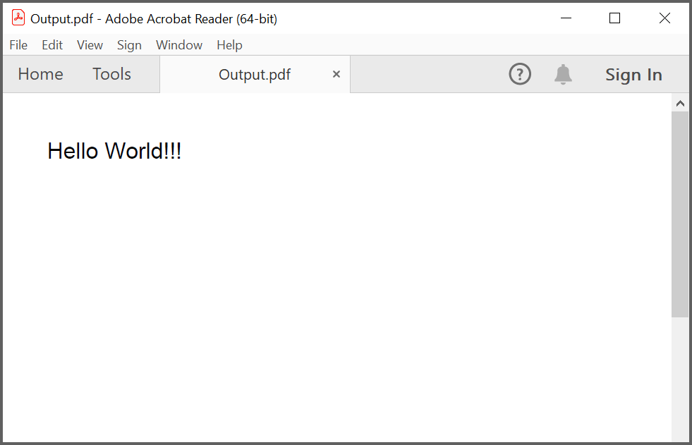
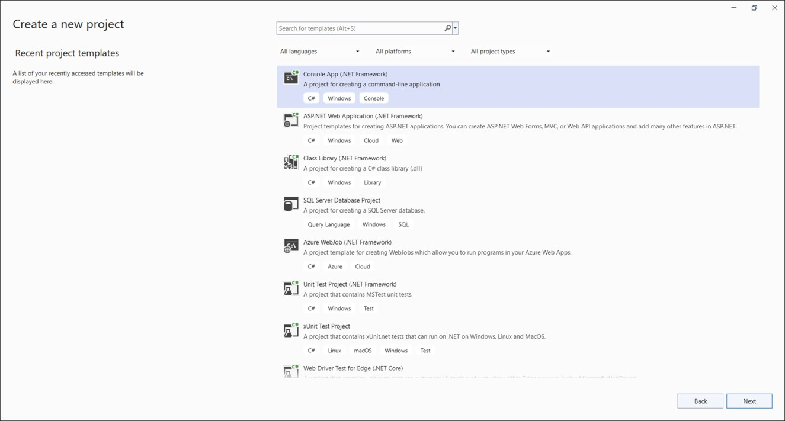
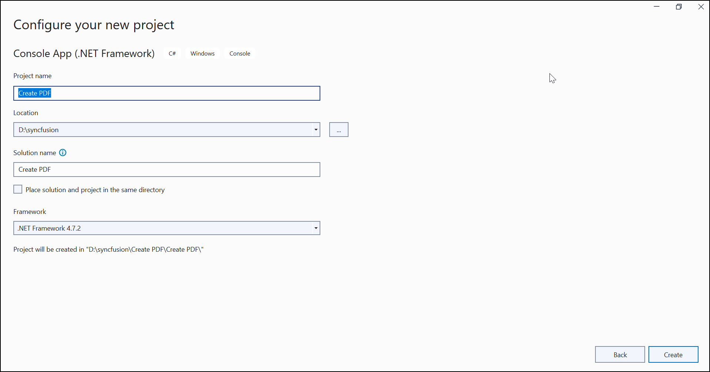

---
title: Create PDF file in Console Application | Syncfusion
description: Discover how to generate a PDF in a Console Application by using the Syncfusion PDF library efficiently.
platform: document-processing
control: PDF
documentation: UG
--- 

# Create or Generate a PDF file in a Console application

The Syncfusion&reg; [.NET PDF library](https://www.syncfusion.com/document-processing/pdf-framework/net/pdf-library) is used to create, read, and edit PDF documents. This library also offers functionality to merge, split, stamp, form, and secure PDF files.

To quickly get started with .NET PDF Library. Please, check this video:


## Steps to create PDF document in Console App





 









You can download a complete working sample from [GitHub](https://github.com/SyncfusionExamples/PDF-Examples/tree/master/Getting%20Started/Console/.NET/Create_PDF).

By executing the program, you will get the PDF document as follows.

## Create a simple PDF document using .NET Framework

The following steps illustrates creating a simple Hello world PDF document in console application using .NET Framework.

**Prerequisites**:

* Install .NET SDK: Ensure that you have the .NET SDK installed on your system. You can download it from the [.NET Downloads page](https://dotnet.microsoft.com/en-us/download).
* Install Visual Studio: Download and install Visual Studio Code from the [official website](https://code.visualstudio.com/download).

**Steps to create PDF document using .NET Framework**

Step 1: Create a new C# Console Application (.NET Framework) project.

Step 2: Name the project.

Step 3: Install the [Syncfusion.Pdf.WinForms](https://www.nuget.org/packages/Syncfusion.Pdf.WinForms/) NuGet package as reference to your .NET Standard applications from [NuGet.org](https://www.nuget.org).

N> The [Syncfusion.Pdf.WinForms](https://www.nuget.org/packages/Syncfusion.Pdf.WinForms/) NuGet package is dependent package for Syncfusion&reg; Windows Forms GUI controls, so named with suffix "WinForms". It has a platform-independent .NET framework (4.0, 4.5, 4.5.1, 4.6) assemblies of the PDF library and doesn't contain any Windows Forms-related references or code. Hence, we recommend this package for the .NET framework Console application.

Step 4: Include the following namespaces in the *Program.cs*.



using Syncfusion.Pdf.Graphics;
using Syncfusion.Pdf;
using System.Drawing;



Step 5: Include the following code sample in *Program.cs* to create a PDF file.



//Create a new PDF document. 
using (PdfDocument document = new PdfDocument())
{
    //Add a page to the document.
    PdfPage page = document.Pages.Add();
    //Create PDF graphics for a page.
    PdfGraphics graphics = page.Graphics;
    //Set the standard font.
    PdfFont font = new PdfStandardFont(PdfFontFamily.Helvetica, 20);
    //Draw the text.
    graphics.DrawString("Hello World!!!", font, PdfBrushes.Black, new PointF(0, 0));
    //Save the document.
    document.Save("Output.pdf");
}



Step 6: Build the project.

To build the project, go to the `Build` menu and select `Build Solution`, or simply press <kbd>Ctrl</kbd>+<kbd>Shift</kbd>+<kbd>B</kbd>.

Step 7: Run the project.

Click the **Run** button (green arrow) in the toolbar or press <kbd>F5</kbd> to run the app.

You can download a complete working sample from [GitHub](https://github.com/SyncfusionExamples/PDF-Examples/tree/master/Getting%20Started/Console/.NET%20Framework/Create%20PDF).

By executing the program, you will get the PDF document as follows.

Click [here](https://www.syncfusion.com/document-processing/pdf-framework/net) to explore the rich set of Syncfusion&reg; PDF library features.

An online sample link to [create PDF document](https://ej2.syncfusion.com/aspnetcore/PDF/HelloWorld#/material3) in ASP.NET Core.
