# Create a PDF document in Google App Engine

The [.NET Core PDF library](https://www.syncfusion.com/document-sdk/net-pdf-library) is used to create, read, and edit PDF documents programmatically without the dependency on Adobe Acrobat. Using this library, you can open and save PDF documents in Google App Engine.

**Prerequisites**

* A Google Cloud Platform (GCP) account with an active billing account.
* The Google App Engine Admin API must be enabled in your GCP project. To enable it, navigate to **APIs & Services > Library**, search for **App Engine Admin API**, and click **Enable**.
* A basic understanding of Google Cloud Shell and `gcloud` CLI commands.

**Set up App Engine**

Step 1: Open the **Google Cloud Console** and click the **Activate Cloud Shell** button.
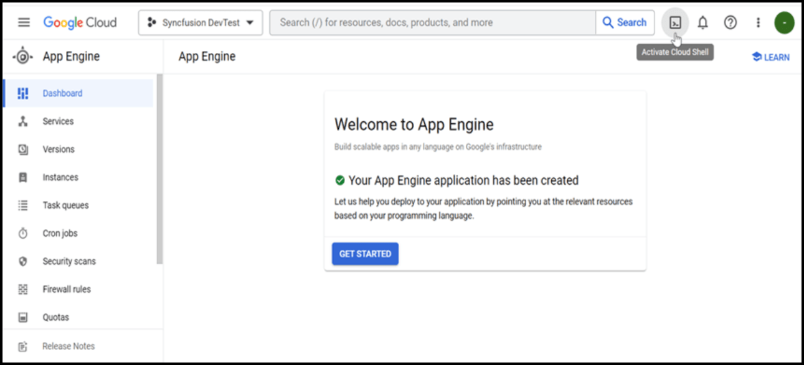

Step 2: Click the **Cloud Shell Editor** button to view the **Workspace**.
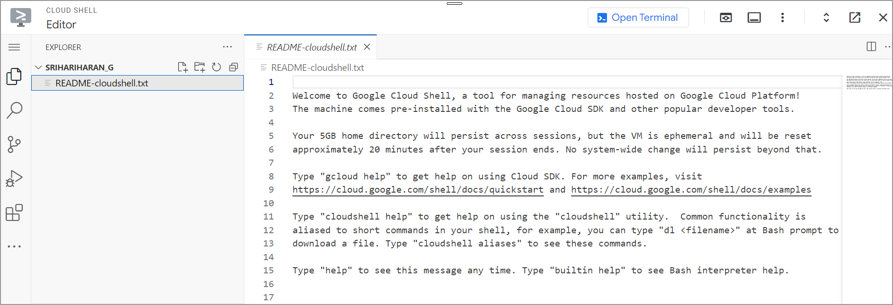

Step 3: Open **Cloud Shell Terminal**, and run the following **command** to confirm authentication.



gcloud auth list




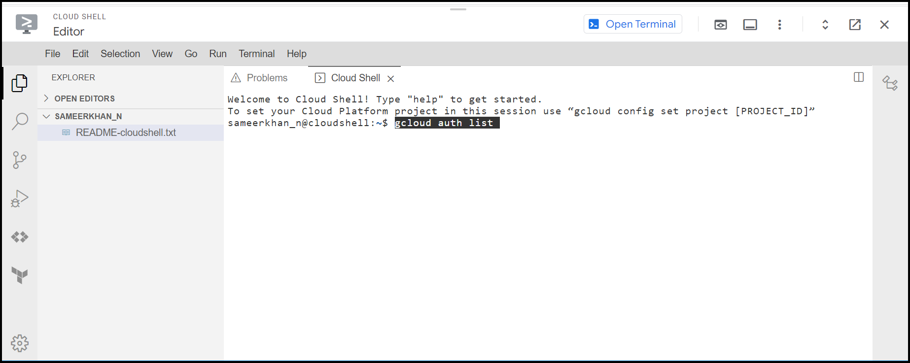

Step 4: Click the **Authorize** button.
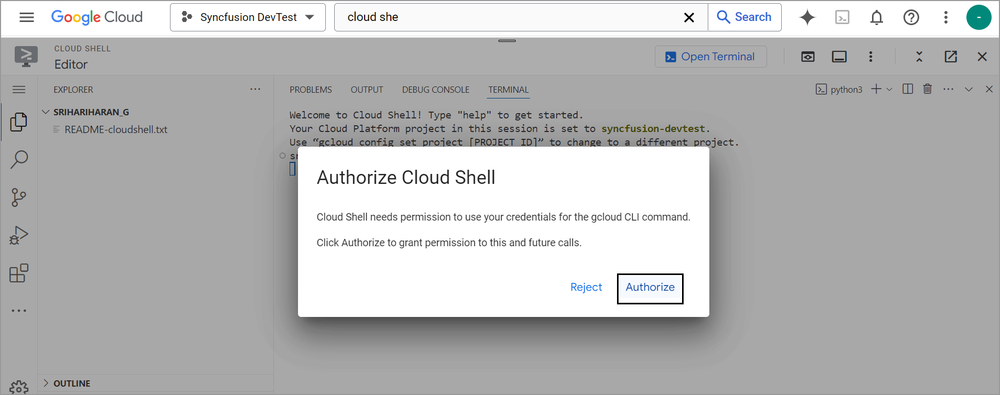

**Create an application for App Engine**

Step 1: Open Visual Studio and select the ASP.NET Core Web app (Model-View-Controller) template.

Step 2: Configure your new project according to your requirements.
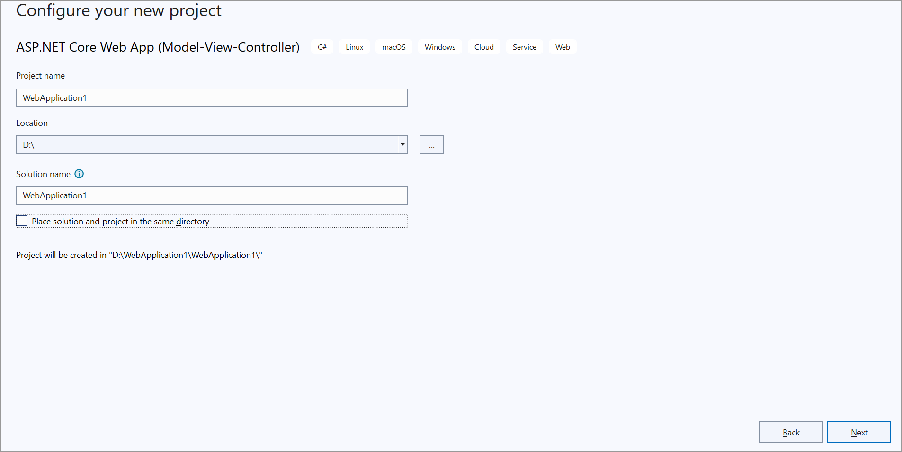

Step 3: Click the **Create** button.
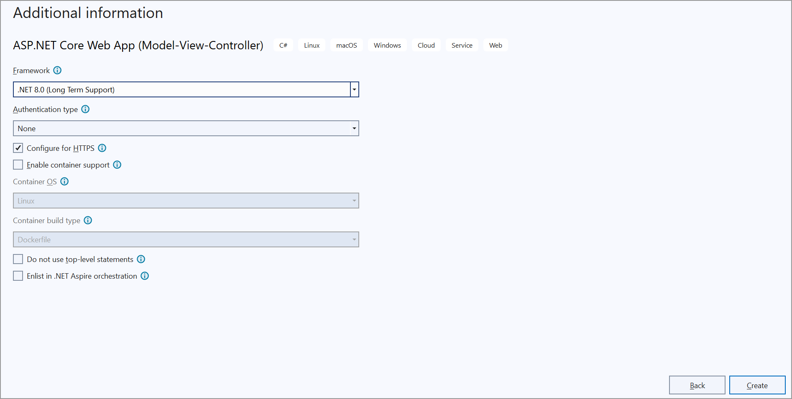

Step 4: Install the [Syncfusion.Pdf.Net.Core](https://www.nuget.org/packages/Syncfusion.Pdf.Net.Core/) NuGet package as a reference to your project from [NuGet.org](https://www.nuget.org/).
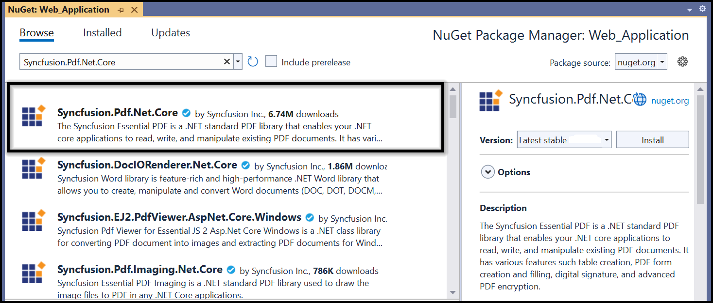

Step 5: Register the Syncfusion license key. A trial watermark is added to every page of the generated PDF until a valid key is registered. Include the license key in **Program.cs** before initializing any Syncfusion component:




using Syncfusion.Licensing;

var builder = WebApplication.CreateBuilder(args);
// Register the Syncfusion license
Syncfusion.Licensing.SyncfusionLicenseProvider.RegisterLicense("YOUR LICENSE KEY");

// Add services to the container.
builder.Services.AddControllersWithViews();

var app = builder.Build();




Replace `"YOUR LICENSE KEY"` with the key from your Syncfusion account. If you do not have one, request a free 30-day trial at [https://www.syncfusion.com/sales/communitylicense](https://www.syncfusion.com/sales/communitylicense). For Google App Engine, store the key in **app.yaml** under `env_variables: SyncfusionLicenseKey: YOUR-KEY` and read it with `builder.Configuration["SyncfusionLicenseKey"]` so the key is not committed to source control. Refer to the [Syncfusion License documentation](https://help.syncfusion.com/common/essential-studio/licensing/overview) to learn about registering the Syncfusion license key in your application.

Step 6: Include the following namespaces in the **HomeController.cs** file.




using Syncfusion.Pdf;
using Syncfusion.Pdf.Graphics;
using Syncfusion.Pdf.Grid;
using Syncfusion.Drawing;
using System;
using System.Collections.Generic;
using System.IO;




Step 7: A default action method named Index will be present in HomeController.cs. Right click on Index method and select **Go To View** where you will be directed to its associated view page **Index.cshtml**.

Step 8: Add a new button in the Index.cshtml as shown in the following.




@{Html.BeginForm("CreateDocument", "Home", FormMethod.Get);
    {
        

            <input type="submit" value="Create PDF Document" style="width:200px;height:27px" />
        

    }
    Html.EndForm();
}



Step 8a: Add a sample **Input.pdf** file to the **Data** folder of your project. Right-click the **Data** folder, select **Add > New Item**, and choose an existing PDF file or create a new one. Then, set its **Copy to Output Directory** property to **Copy if newer** so the file is included in the publish output.

Step 9: Add a new action method **CreateDocument** in HomeController.cs and include the following code sample to **create PDF document** and download it.




public ActionResult CreateDocument()
{
    //Load PDF document as stream.
    using FileStream docStream = new FileStream(@"Data/Input.pdf", FileMode.Open, FileAccess.Read);
    //Load an existing PDF document.
    PdfLoadedDocument document = new PdfLoadedDocument(docStream);

    //Load the existing page.
    PdfLoadedPage loadedPage = document.Pages[0] as PdfLoadedPage;
    //Create PDF graphics for the page.
    PdfGraphics graphics = loadedPage.Graphics;

        //Create a PdfGrid.
        PdfGrid pdfGrid = new PdfGrid();
        //Add values to the list.
        List<object> data = new List<object>();
        data.Add(new { Product_ID = "1001", Product_Name = "Bicycle", Price = "10,000" });
        data.Add(new { Product_ID = "1002", Product_Name = "Head Light", Price = "3,000" });
        data.Add(new { Product_ID = "1003", Product_Name = "Break wire", Price = "1,500" });
        //Assign data source.
        pdfGrid.DataSource = data;
        //Apply built-in table style.
        pdfGrid.ApplyBuiltinStyle(PdfGridBuiltinStyle.GridTable4Accent3);
        //Draw the grid to the page of PDF document.
        pdfGrid.Draw(graphics, new RectangleF(40, 400, loadedPage.Size.Width - 80, 0));

        //Create memory stream.
        MemoryStream stream = new MemoryStream();
        //Save the PDF document to stream.
        document.Save(stream);
        //If the position is not set to '0' then the PDF will be empty.
        stream.Position = 0;
        //Close the document.
        document.Close(true);
        //Download PDF document in the browser.
        return File(stream, "application/pdf", "Sample.pdf");
    }
}




**Move application to App Engine**

Step 1: Open the **Cloud Shell editor**.

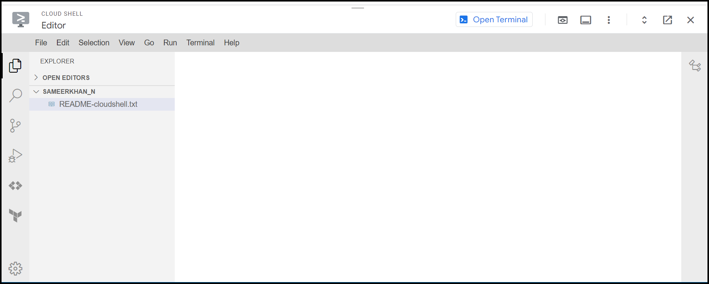

Step 2: Drag and drop the sample from your local machine to **Workspace**.

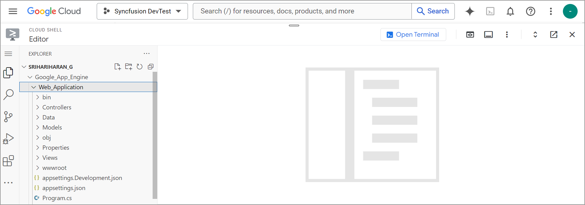

N> If you have your sample application in your local machine, drag and drop it into the Workspace. If you created the sample using the Cloud Shell terminal command, it will be available in the Workspace.

Step 3: Open the Cloud Shell Terminal and run the following **command** to view the files and directories within your **current Workspace**.




ls




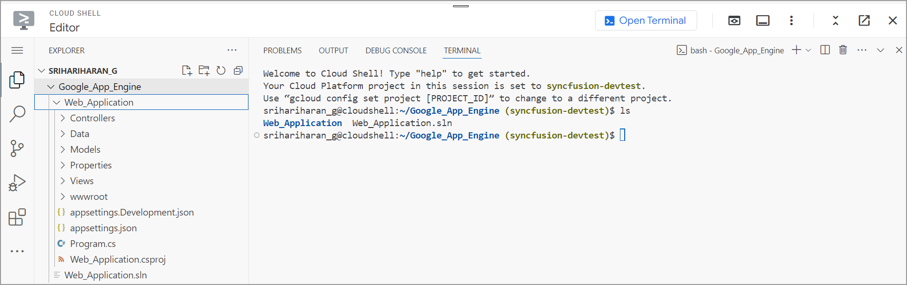

Step 4: Run the following **command** to navigate to the sample you want to run.




cd Web_Application




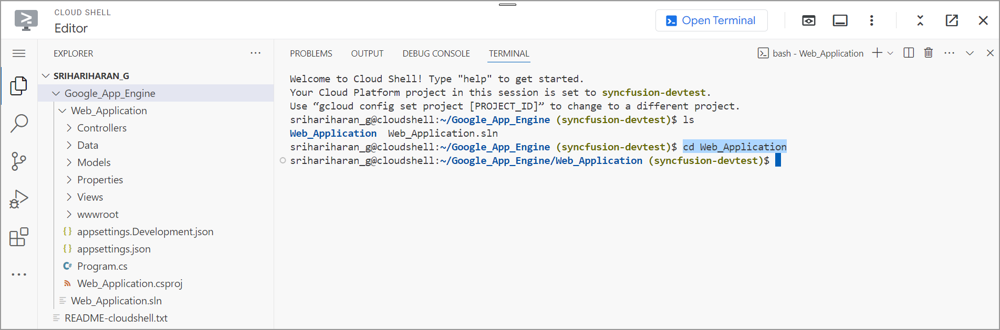

Step 5: To ensure that the sample is working correctly, please run the application using the following command.




dotnet run --urls=http://localhost:8080




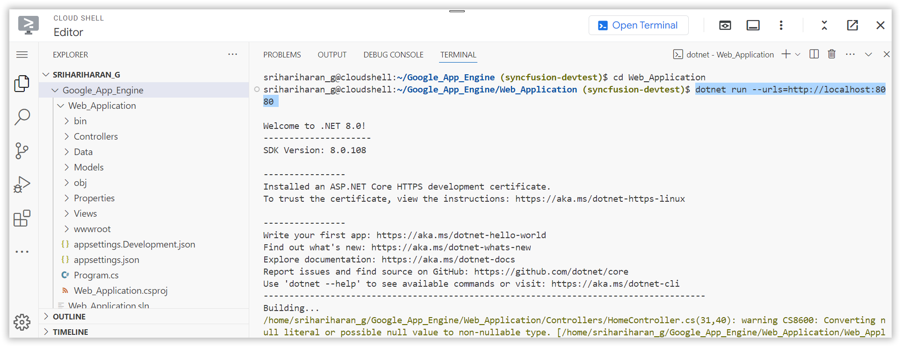

Step 6: Verify that the application is running properly by accessing the **Web View -> Preview on port 8080**.

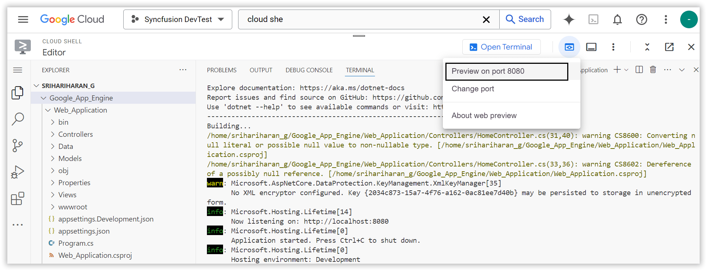

Step 7: Now you can see the sample output on the preview page.

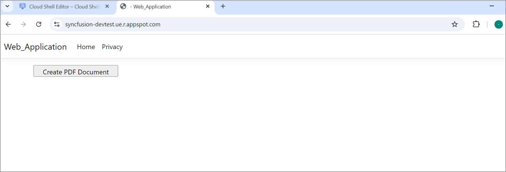

Step 8: Close the preview page and return to the terminal, then press **Ctrl+C** to stop the process.

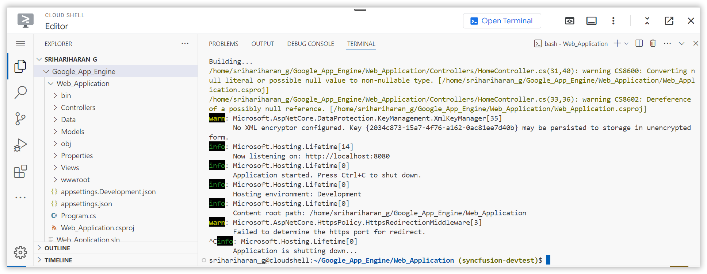

**Publish the application**

Step 1: Run the following command in the **Cloud Shell Terminal** to publish the application.




dotnet publish -c Release




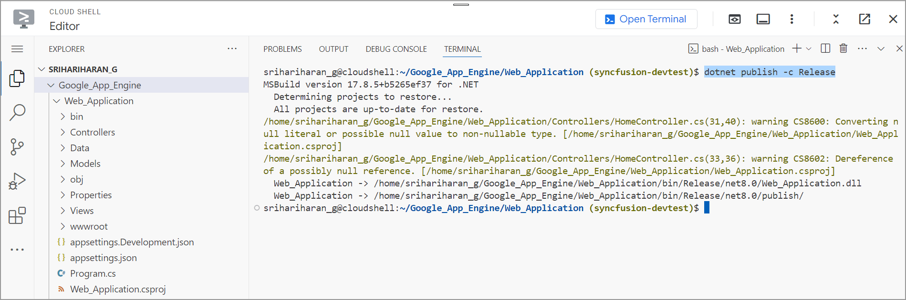

Step 2: Run the following command in the **Cloud Shell Terminal** to navigate to the publish folder.




cd bin/Release/net8.0/publish/




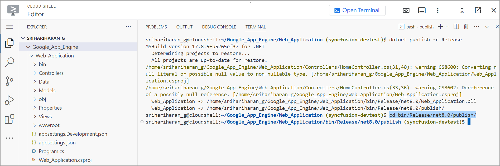

**Configure app.yaml and docker file**

Step 1: Add the app.yaml file to the publish folder with the following contents.




cat <<EOT >> app.yaml
env: flex
runtime: custom   
EOT




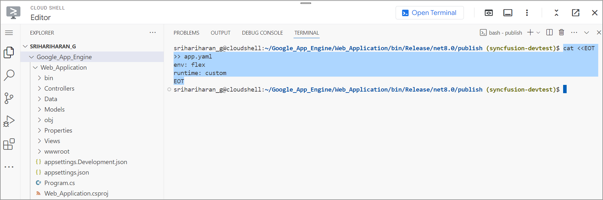

Step 2: Add the Docker file to the publish folder with the following contents.




cat <<EOT >> Dockerfile
FROM mcr.microsoft.com/dotnet/aspnet:8.0
RUN apt-get update -y && apt-get install libfontconfig -y
ADD / /app
EXPOSE 8080
ENV ASPNETCORE_URLS=http://*:8080
WORKDIR /app
ENTRYPOINT [ "dotnet", "Web_Application.dll"]
EOT




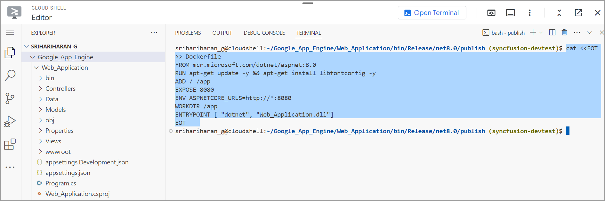

Step 3: You can ensure **Docker** and **app.yaml** files are added in **Workspace**.

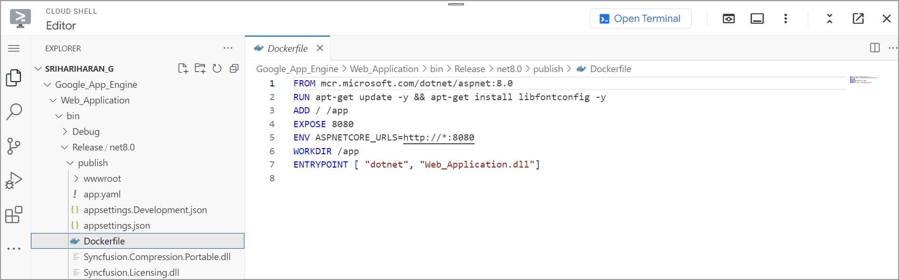

**Deploy to App Engine**

Step 1: To deploy the application to the App Engine, run the following command in Cloud Shell Terminal. Afterwards, retrieve the **URL** from the Cloud Shell Terminal.




gcloud app deploy --version v0




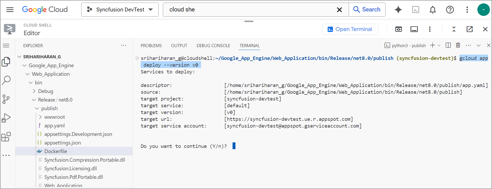
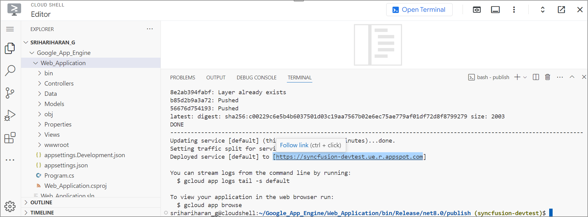

Step 2: Open the **URL** to access the application, which has been successfully deployed.

You can download a complete working sample from [GitHub](https://github.com/SyncfusionExamples/PDF-Examples/tree/master/Getting%20Started/GCP/Google_App_Engine).

By executing the program, you will get the **PDF document** as follows. The output will be saved in the **bin folder**.

Click [here](https://www.syncfusion.com/document-sdk/net-pdf-library) to explore the rich set of Syncfusion&reg; PDF library features.

## Next steps

* [Create a PDF in Azure App Service on Linux](Create-PDF-document-in-Azure-App-Service-Linux.md)
* [Create a PDF in Docker](Create-PDF-document-in-Docker.md)
* [Create a PDF in ASP.NET Core](Create-PDF-file-in-ASP-NET-Core.md)
* [Open and read an existing PDF document](Open-PDF-file.md)
* [Save the generated PDF to a file or stream](Save-PDF-file.md)