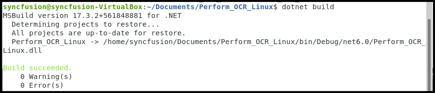
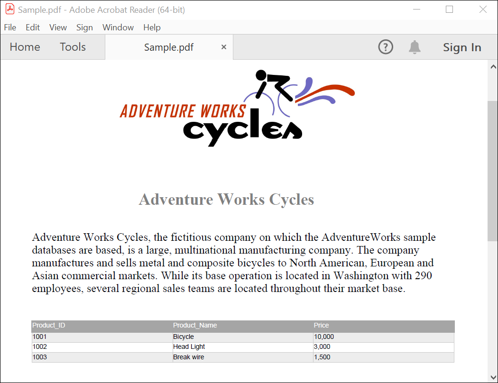

# Create a PDF Document on Linux

The [.NET PDF library](https://www.syncfusion.com/document-sdk/net-pdf-library) creates, reads, and edits PDF documents programmatically, with no dependency on Adobe Acrobat. You can use this library to create a PDF document in a .NET application on Linux.

## Prerequisites

- A **Linux distribution** that supports .NET 6 or later (for example, **Ubuntu 20.04+**, **Debian 11+**, **RHEL 8+**, or **Fedora 36+**).
- **.NET SDK 8.0** or later installed. Verify with `dotnet --list-sdks`; install from the [.NET Downloads page](https://dotnet.microsoft.com/en-us/download) or your distribution's package manager.
- A **Syncfusion&reg; license key** — register it in your application using `Syncfusion.Licensing.SyncfusionLicenseProvider.RegisterLicense("YOUR_LICENSE_KEY")`. For details, see the [Syncfusion licensing overview](https://help.syncfusion.com/common/essential-studio/licensing/overview).
- The **[Syncfusion.Pdf.Net.Core](https://www.nuget.org/packages/Syncfusion.Pdf.Net.Core)** NuGet package.

## Step to create a PDF document programmatically

**Step 1:** Run the following command in the Linux terminal to create a new .NET console application project. The project is created in the current directory.

Step 2: Install the [Syncfusion.Pdf.Net.Core](https://www.nuget.org/packages/Syncfusion.Pdf.Net.Core) NuGet package as a reference to your project from [NuGet.org](https://www.nuget.org/) by executing the following command.




dotnet add package Syncfusion.Pdf.Net.Core -v <version>




N> If you reference Syncfusion&reg; assemblies from the trial setup or the NuGet feed, you must add a reference to the `Syncfusion.Licensing` assembly and include a valid license key in your project. See the [Syncfusion licensing overview](https://help.syncfusion.com/common/essential-studio/licensing/overview) for details on registering the license key.

**Step 3:** Add the following `using` directives to `Program.cs`. The `System.Collections.Generic` directive is required for the `List<object>` data source used in the next step.




using Syncfusion.Pdf;
using Syncfusion.Pdf.Graphics;
using Syncfusion.Drawing;
using System.IO;




**Step 4:** Add the following code to `Program.cs` to create a PDF document in the .NET application on Linux.




//Create a new PDF document.
PdfDocument document = new PdfDocument();
// Set the page size.
document.PageSettings.Size = PdfPageSize.A4;
//Add a page to the document.
PdfPage page = document.Pages.Add();

//Create PDF graphics for the page.
PdfGraphics graphics = page.Graphics;
//Load the image from the disk.
FileStream imageStream = new FileStream("AdventureCycle.jpg", FileMode.Open, FileAccess.Read);
PdfBitmap image = new PdfBitmap(imageStream);
//Draw an image.
graphics.DrawImage(image, new RectangleF(130,0, 250, 100));

//Draw header text. 
graphics.DrawString("Adventure Works Cycles", new PdfStandardFont(PdfFontFamily.TimesRoman, 20, PdfFontStyle.Bold), PdfBrushes.Gray, new PointF(150, 150));

//Add paragraph. 
string text = "Adventure Works Cycles, the fictitious company on which the AdventureWorks sample databases are based, is a large, multinational manufacturing company. The company manufactures and sel
//Create a text element with the text and font.
PdfTextElement textElement = new PdfTextElement(text, new PdfStandardFont(PdfFontFamily.TimesRoman, 12));
//Draw the text in the first column.
textElement.Draw(page, new RectangleF(0, 200, page.GetClientSize().Width, page.GetClientSize().Height));

//Create a PdfGrid.
PdfGrid pdfGrid = new PdfGrid();
//Add values to the list.
List<object> data = new List<object>();
Object row1 = new { Product_ID = "1001", Product_Name = "Bicycle", Price = "10,000" };
Object row2 = new { Product_ID = "1002", Product_Name = "Head Light", Price = "3,000" };
Object row3 = new { Product_ID = "1003", Product_Name = "Break wire", Price = "1,500" };
data.Add(row1);
data.Add(row2);
data.Add(row3);
//Add list to IEnumerable.
IEnumerable<object> dataTable = data;
//Assign data source.
pdfGrid.DataSource = dataTable;
//Apply built-in table style.
pdfGrid.ApplyBuiltinStyle(PdfGridBuiltinStyle.GridTable4Accent3);
//Draw the grid to the page of PDF document.
pdfGrid.Draw(graphics, new RectangleF(0, 300, page.Size.Width - 80, 0));

//Create file stream.
using (FileStream outputFileStream = new FileStream(Path.GetFullPath(@"Output.pdf"), FileMode.Create, FileAccess.ReadWrite))
{
    //Save the PDF document to file stream.
    document.Save(outputFileStream);
}




**Step 5:** Run the following command to restore the NuGet packages. (`dotnet add package` already restores, so this step is optional unless you have a custom `NuGet.config`.)

**Step 6:** Run the following command in the terminal to build and run the application.

After the run completes, verify that `Output.pdf` was generated in the project's working directory (typically the project root or `bin/Debug/<target-framework>/`).

Download a complete working sample from the [Linux folder on GitHub](https://github.com/SyncfusionExamples/PDF-Examples/tree/master/Getting%20Started/Linux).

Running the program produces the following PDF document. The output is saved in the project's working directory.

Explore the [Syncfusion&reg; PDF library features](https://www.syncfusion.com/document-sdk/net-pdf-library) to learn more about merging, splitting, securing, and stamping PDF files.

An online sample demonstrating how to [create a PDF document](https://document.syncfusion.com/demos/pdf/default#/tailwind) is also available.

## Troubleshooting

- **Watermark appears in the output PDF** — Your Syncfusion&reg; license key is not registered. Call `SyncfusionLicenseProvider.RegisterLicense("YOUR_LICENSE_KEY")` at the start of the `Main` method.
- **`Unable to load shared library 'libSkiaSharp'` or `libgdiplus` errors** — Install the native graphics dependencies: `sudo apt-get install -y libfontconfig1 libgdiplus` (Debian/Ubuntu) or `sudo dnf install -y fontconfig libgdiplus` (RHEL/Fedora).
- **Font rendering issues (boxes instead of characters)** — Install `libfontconfig1` and ensure the `FONTCONFIG_PATH` environment variable points to a valid font configuration (or run `fc-cache -fv` to rebuild the cache).
- **`Output.pdf` is empty or zero bytes** — Wrap `PdfDocument` in a `using` block (or call `document.Close(true)`) so the native buffers are flushed before the process exits.
- **NuGet restore fails on air-gapped systems** — Configure a local NuGet feed with `dotnet nuget add source <path>` and pass the source to `dotnet add package` via the `-s` flag.
- **`Permission denied` writing `Output.pdf`** — The current working directory may be read-only. Change to a writable folder (`cd /tmp`) before running, or pass an absolute path to the `FileStream` constructor.
- **`dotnet` command not found** — Install the .NET SDK from the [.NET Downloads page](https://dotnet.microsoft.com/en-us/download) or your distribution's package manager, then restart the terminal.
- **`AdventureCycle.jpg` not found at runtime** — The relative path resolves against the current working directory. Copy the image to the project folder or pass an absolute path.

## See also

- [Create a PDF File in Docker](create-pdf-document-in-docker)
- [Create a PDF File in Console](create-pdf-file-in-console)
- [NuGet Packages Required](https://help.syncfusion.com/document-processing/pdf/pdf-library/net/nuget-packages-required)
- [Assemblies Required](https://help.syncfusion.com/document-processing/pdf/pdf-library/net/assemblies-required)
- [Syncfusion&reg; Licensing Overview](https://help.syncfusion.com/common/essential-studio/licensing/overview)
- [Create a PDF file in ASP.NET Core](create-pdf-file-in-asp-net-core)
- [Create a PDF file in AWS Lambda](create-pdf-file-in-aws-lambda)
- [Open and read PDF files](https://help.syncfusion.com/document-processing/pdf/pdf-library/net/open-pdf-files)
- [Merge PDF documents](https://help.syncfusion.com/document-processing/pdf/pdf-library/net/merge-documents)
- [Split PDF documents](https://help.syncfusion.com/document-processing/pdf/pdf-library/net/split-documents)
- [Working with PDF forms](https://help.syncfusion.com/document-processing/pdf/pdf-library/net/working-with-forms)
- [Working with security and permissions](https://help.syncfusion.com/document-processing/pdf/pdf-library/net/working-with-security)
- [Working with stamps and watermarks](https://help.syncfusion.com/document-processing/pdf/pdf-library/net/working-with-watermarks)
- [Syncfusion&reg; PDF library — Demos](https://document.syncfusion.com/demos/pdf/default)