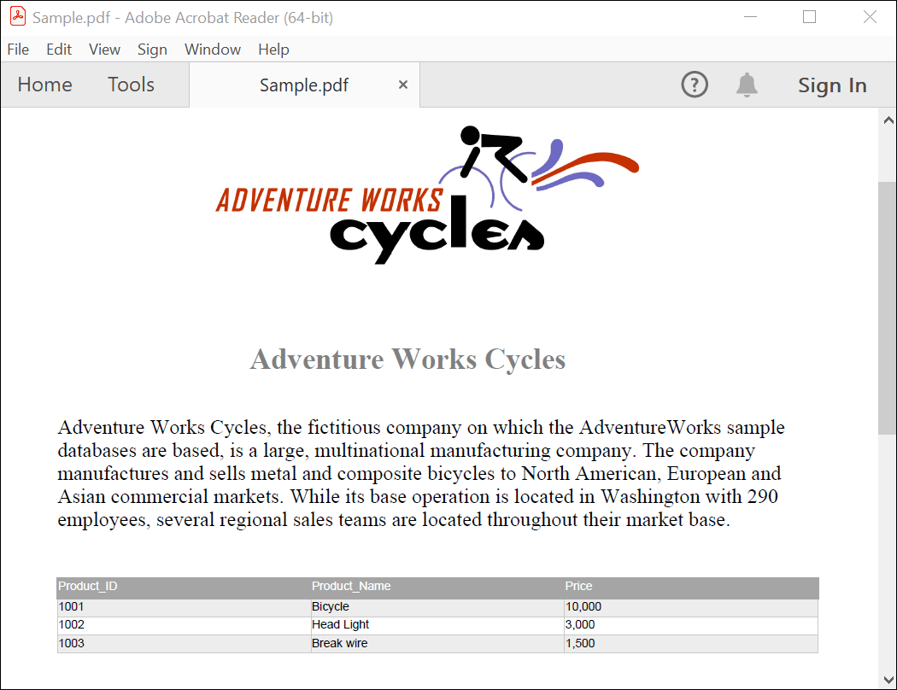

# Create PDF document on Mac OS

The [Syncfusion .NET Core PDF library](https://www.syncfusion.com/document-processing/pdf-framework/net-core) is used to create, read, and edit PDF documents programatically without the dependency on Adobe Acrobat. Using this library, you can **Create PDF document on Mac OS**. 





 





A complete working sample can be downloaded from [Github](https://github.com/SyncfusionExamples/PDF-Examples/tree/master/Getting%20Started/Mac).

By executing the program, you will get the **PDF document** as follows.

Click [here](https://www.syncfusion.com/document-processing/pdf-framework/net-core) to explore the rich set of Syncfusion&reg; PDF library features.

An online sample link to [create PDF document](https://ej2.syncfusion.com/aspnetcore/PDF/HelloWorld#/material3) in ASP.NET Core. 