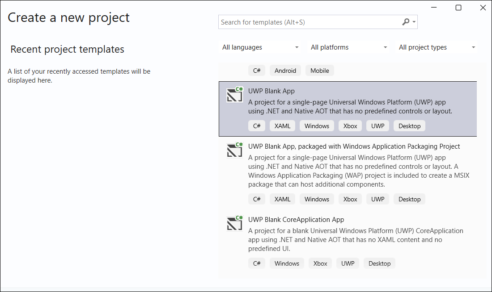
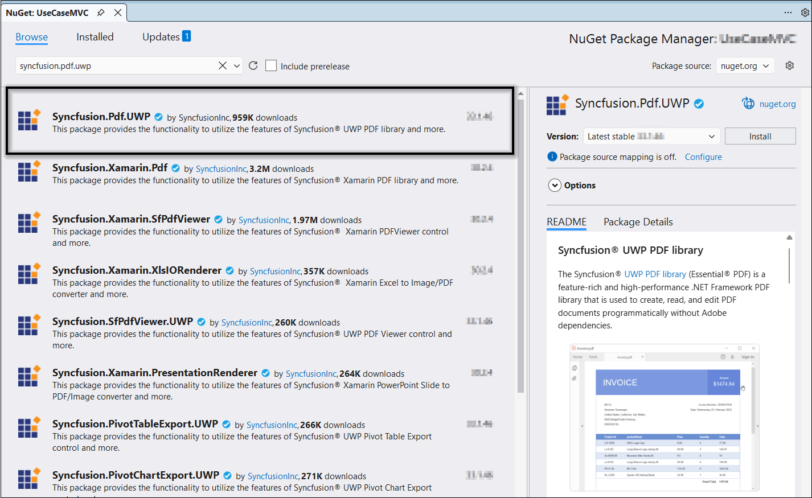

# Create or Generate a PDF File in UWP

The [UWP PDF library](https://www.syncfusion.com/document-sdk/net-pdf-library) creates, reads, and edits PDF documents. It merges, splits, stamps, fills forms, and secures PDF files.

To include the Syncfusion UWP PDF library in your UWP application, refer to the [NuGet Package Required](https://help.syncfusion.com/document-processing/pdf/pdf-library/net/nuget-packages-required) or [Assemblies Required](https://help.syncfusion.com/document-processing/pdf/pdf-library/net/assemblies-required) documentation.

N> UWP development is in maintenance mode. For new apps, consider [WinUI 3 / Windows App SDK](https://learn.microsoft.com/en-us/windows/apps/windows-app-sdk/) using the [Syncfusion.Pdf.Net.Core](https://www.nuget.org/packages/Syncfusion.Pdf.Net.Core) package. Syncfusion continues to support existing UWP applications.

## Prerequisites

- **Windows 10 version 1809** (build 17763) or later.
- **Visual Studio 2022** (17.8 or later) with the **Universal Windows Platform development** workload installed.
- **Developer Mode** enabled in **Windows Settings > Privacy & security > For developers**. This is required to deploy and sideload UWP apps.
- A **Syncfusion&reg; license key** — register it in your application using `Syncfusion.Licensing.SyncfusionLicenseProvider.RegisterLicense("YOUR_LICENSE_KEY")`. For details, see the [Syncfusion licensing overview](https://help.syncfusion.com/common/essential-studio/licensing/overview).
- The **[Syncfusion.Pdf.UWP](https://www.nuget.org/packages/Syncfusion.Pdf.UWP/)** NuGet package installed in the project.

## Step to create a PDF document in UWP

**Step 1:** In Visual Studio, create a new **Blank App (Universal Windows)** project. Choose a Target SDK of **Windows 10, version 1903** (or later) and a Minimum SDK of **Windows 10, version 1809** (or later).

**Step 2:** Install the [Syncfusion.Pdf.UWP](https://www.nuget.org/packages/Syncfusion.Pdf.UWP/) NuGet package from [NuGet.org](https://www.nuget.org/). Use the latest stable version compatible with your target SDK.

N> If you reference Syncfusion&reg; assemblies from the trial setup or the NuGet feed, you must add a reference to the `Syncfusion.Licensing` assembly and include a valid license key in your project. See the [Syncfusion licensing overview](https://help.syncfusion.com/common/essential-studio/licensing/overview) for details on registering the license key.

**Step 3:** In `MainPage.xaml`, add the following button and wire its `Click` event to a handler named `Button_Click`.



<Grid>
  <Button Content="CreatePDF" HorizontalAlignment="Center"  VerticalAlignment="Center" Width="150" Height="100" Click="Button_Click" />
</Grid>




**Step 4:** Add the following `using` directives to `MainPage.xaml.cs`. The `System.Drawing` namespace provides `PointF`; on .NET 6+ UWP you may need to use the `Syncfusion.Drawing` namespace instead (see the **Troubleshooting** section).




using Syncfusion.Pdf;
using Syncfusion.Pdf.Graphics;
using System;
using System.Collections.Generic;
using System.Drawing;
using System.IO;
using Windows.Storage;
using Windows.Storage.Pickers;
using Windows.UI.Popups;
using Windows.UI.Xaml;
using Windows.UI.Xaml.Controls;




**Step 5:** In the `Button_Click` handler in `MainPage.xaml.cs`, add the following code to create a PDF document with the [PdfDocument](https://help.syncfusion.com/cr/document-processing/Syncfusion.Pdf.PdfDocument.html) class. The [DrawString](https://help.syncfusion.com/cr/document-processing/Syncfusion.Pdf.Graphics.PdfGraphics.html#Syncfusion_Pdf_Graphics_PdfGraphics_DrawString_System_String_Syncfusion_Pdf_Graphics_PdfFont_Syncfusion_Pdf_Graphics_PdfBrush_System_Drawing_PointF_) method of the [PdfGraphics](https://help.syncfusion.com/cr/document-processing/Syncfusion.Pdf.Graphics.PdfGraphics.html) object draws the text on the PDF page. The stream is passed to the `Save` helper in the next step.




private void Button_Click(object sender, RoutedEventArgs e)
{
    //Create a PDF document. 
    using (PdfDocument document = new PdfDocument())
    {
        //Add a page to the document.
        PdfPage page = document.Pages.Add();
        //Create PDF graphics for the page
        PdfGraphics graphics = page.Graphics;
        //Set the standard font.
        PdfFont font = new PdfStandardFont(PdfFontFamily.Helvetica, 20);
        //Draw the text.
        graphics.DrawString("Hello World!!!", font, PdfBrushes.Black, new PointF(0, 0));
        //Create memory stream.
        MemoryStream ms = new MemoryStream();
        //Open the document in browser after saving it.
        document.Save(ms);
        //Close the document.
        document.Close(true);
        Save(ms, "Sample.pdf");
    }
}




**Step 6:** Add the following helper method (in the same class) to save the stream as a physical file and open it for viewing.



#region Helper Methods
public async void Save(Stream stream, string filename)
{
    stream.Position = 0; 

    StorageFile stFile; 
    if (!(Windows.Foundation.Metadata.ApiInformation.IsTypePresent("Windows.Phone.UI.Input.HardwareButtons"))) 
    { 
        FileSavePicker savePicker = new FileSavePicker(); 
        savePicker.DefaultFileExtension = ".pdf"; 
        savePicker.SuggestedFileName = "Sample"; 
        savePicker.FileTypeChoices.Add("Adobe PDF Document", new List<string>() { ".pdf" }); 
        stFile = await savePicker.PickSaveFileAsync(); 
    } 
    else 
    { 
        StorageFolder local = Windows.Storage.ApplicationData.Current.LocalFolder; 
        stFile = await local.CreateFileAsync(filename, CreationCollisionOption.ReplaceExisting); 
    } 
    if (stFile != null) 
    { 
        Windows.Storage.Streams.IRandomAccessStream fileStream = await stFile.OpenAsync(FileAccessMode.ReadWrite); 
        Stream st = fileStream.AsStreamForWrite(); 
        st.SetLength(0); 
        st.Write((stream as MemoryStream).ToArray(), 0, (int)stream.Length); 
        st.Flush(); 
        st.Dispose(); 
        fileStream.Dispose(); 
        MessageDialog msgDialog = new MessageDialog("Do you want to view the Document?", "File created."); 
        UICommand yesCmd = new UICommand("Yes"); 
        msgDialog.Commands.Add(yesCmd); 
        UICommand noCmd = new UICommand("No"); 
        msgDialog.Commands.Add(noCmd); 
        IUICommand cmd = await msgDialog.ShowAsync(); 
        if (cmd == yesCmd) 
        { 
            //Launch the retrieved file.
            bool success = await Windows.System.Launcher.LaunchFileAsync(stFile); 
        } 
    } 
}
#endregion




You can download a complete working sample from the [`Create-a-new-PDF-document` folder on GitHub](https://github.com/SyncfusionExamples/PDF-Examples/tree/master/Getting%20Started/UWP/Create-a-new-PDF-document).

Running the program produces the following PDF document.

Explore the [Syncfusion&reg; PDF library features](https://www.syncfusion.com/document-sdk/net-pdf-library) to learn more about merging, splitting, securing, and stamping PDF files.

An online sample demonstrating how to [create a PDF document](https://document.syncfusion.com/demos/pdf/default#/tailwind) is also available.

## Troubleshooting

- **Watermark appears in the output PDF** — Your Syncfusion&reg; license key is not registered. Call `SyncfusionLicenseProvider.RegisterLicense("YOUR_LICENSE_KEY")` at application startup, before any Syncfusion API is called.
- **`System.Drawing.Common` exceptions on .NET 6+** — `System.Drawing` is restricted on .NET 6+ for non-Windows targets. Use the `Syncfusion.Drawing` namespace and the `Syncfusion.Pdf.Net.Core` package, or migrate the app to WinUI 3 / Windows App SDK.
- **`COMException` when calling `FileSavePicker.PickSaveFileAsync()` on Windows 10 1903+** — The picker requires a window handle. Call `WinRT.Interop.InitializeWithWindow.Initialize(savePicker, Window.Current.Handle);` before `PickSaveFileAsync()`.
- **`stream as MemoryStream` returns null and throws NullReferenceException** — If `stream` is typed as `Stream` but is actually a `MemoryStream`, the cast succeeds. If it is not, replace the cast with `(MemoryStream)stream` after a type check, or change the helper signature to accept `MemoryStream` directly.
- **`Windows.Phone.UI.Input.HardwareButtons` check is true** — The `else` branch in the helper handles legacy Windows 10 Mobile targets. UWP for phone is deprecated; remove the `else` branch for new apps or wrap the phone-specific code in `#if` directives.
- **`ApplicationData.Current.LocalFolder` returns null on WinUI 3** — UWP-specific APIs are not available in WinUI 3. Use `Microsoft.Maui.Storage` or `Windows.Storage` from the Windows App SDK instead, or migrate the helper to use `FileSystem.Current.AppDataDirectory` from .NET MAUI Essentials.
- **Deployment fails with "Developer Mode is not enabled"** — Enable Developer Mode in **Windows Settings > Privacy & security > For developers**, then redeploy.
- **`MessageDialog` does not appear in a Click handler** — `MessageDialog` requires the UI thread. Ensure the `Button_Click` handler is invoked on the dispatcher thread (it is, by default for XAML click events) and that the `Save` method is awaited.
- **`LaunchFileAsync` returns `false`** — The file is saved to the user's chosen location but cannot be opened because no PDF reader is installed. Install a PDF reader (such as Microsoft Edge or Adobe Reader) or launch the file manually.

## See also

- [Create a PDF File in WinUI](create-pdf-file-in-winui)
- [Create a PDF File in WPF](create-pdf-file-in-wpf)
- [Create a PDF File in Windows Forms](create-pdf-file-in-windows-forms)
- [Create a PDF File in ASP.NET Core](create-pdf-file-in-asp-net-core)
- [NuGet Packages Required](https://help.syncfusion.com/document-processing/pdf/pdf-library/net/nuget-packages-required)
- [Assemblies Required](https://help.syncfusion.com/document-processing/pdf/pdf-library/net/assemblies-required)
- [Syncfusion&reg; Licensing Overview](https://help.syncfusion.com/common/essential-studio/licensing/overview)
- [Open and read PDF files](https://help.syncfusion.com/document-processing/pdf/pdf-library/net/open-pdf-files)
- [Merge PDF documents](https://help.syncfusion.com/document-processing/pdf/pdf-library/net/merge-documents)
- [Split PDF documents](https://help.syncfusion.com/document-processing/pdf/pdf-library/net/split-documents)
- [Working with PDF forms](https://help.syncfusion.com/document-processing/pdf/pdf-library/net/working-with-forms)
- [Working with security and permissions](https://help.syncfusion.com/document-processing/pdf/pdf-library/net/working-with-security)
- [Working with stamps and watermarks](https://help.syncfusion.com/document-processing/pdf/pdf-library/net/working-with-watermarks)
- [Syncfusion&reg; PDF library — Demos](https://document.syncfusion.com/demos/pdf/default) 