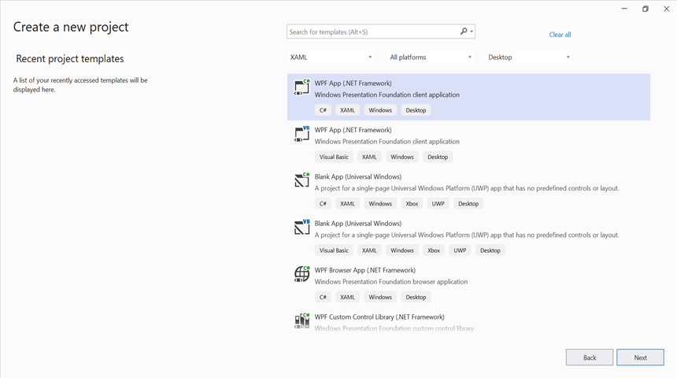
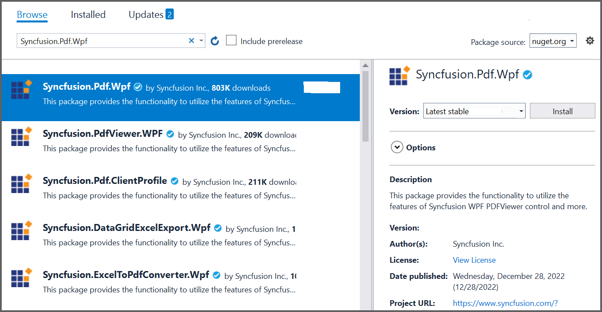

---
title: Create or Generate a PDF file in WPF | Syncfusion
description: Learn how to create or generate a PDF file in WPF with easy steps using Syncfusion .NET PDF library without depending on Adobe.
platform: document-processing
control: PDF
documentation: UG
--- 

# Create or Generate a PDF file in WPF

The [.NET PDF library](https://www.syncfusion.com/document-sdk/net-pdf-library) is used to create, read, and edit PDF documents. This library also offers functionality to merge, split, stamp, work with forms, and secure PDF files. 

To include the .NET PDF library into your WPF application, please refer to the [NuGet Package Required](https://help.syncfusion.com/document-processing/pdf/pdf-library/net/nuget-packages-required) or [Assemblies Required](https://help.syncfusion.com/document-processing/pdf/pdf-library/net/assemblies-required) documentation. 

## Steps to create a PDF document in WPF

Step 1: Create a new **WPF Application** project in Visual Studio, targeting .NET Framework 4.6.2 (or later) or .NET 8.0/9.0/10.0 (Windows).

Step 2: Install the [Syncfusion.Pdf.Wpf](https://www.nuget.org/packages/Syncfusion.Pdf.Wpf/) NuGet package as a reference to your application from [NuGet.org](https://www.nuget.org/).

N> The [Syncfusion.Pdf.Wpf](https://www.nuget.org/packages/Syncfusion.Pdf.Wpf/) NuGet package targets **.NET Framework 4.6.2 and later**. as well as **.NET 8.0, 9.0, and 10.0 (Windows)** WPF applications — all from the same package. Select the project template that matches your target framework in Visual Studio.

N> Starting with v16.2.0.x, if you reference Syncfusion&reg; assemblies from trial setup or from the NuGet feed, you also have to add the `Syncfusion.Licensing` assembly reference and include a license key in your projects. Please refer to this [link](https://help.syncfusion.com/common/essential-studio/licensing/overview) to learn about registering the Syncfusion&reg; license key in your application to use our components.

Step 3: Register the Syncfusion&reg; license key in the *App.xaml.cs* file before any Syncfusion component is used, to remove the evaluation watermark. Replace `"YOUR LICENSE KEY"` with the actual key from your Syncfusion account.




using System.Windows;

namespace CreatePdfWpf
{
    /// 

    /// Interaction logic for App.xaml
    /// 

    public partial class App : Application
    {
        public App()
        {
            //Register the Syncfusion license key to remove the evaluation watermark.
            Syncfusion.Licensing.SyncfusionLicenseProvider.RegisterLicense("YOUR LICENSE KEY");
        }
    }
}




N> The license must be registered once during application startup, before instantiating any Syncfusion component (for example, before creating a `PdfDocument`).

Step 4: Include the following namespaces in the *MainWindow.xaml.cs* file.




using Syncfusion.Pdf;
using Syncfusion.Pdf.Graphics;
using System;
using System.Drawing;
using System.Windows;




Step 5: Add a new button in *MainWindow.xaml* to create a PDF document as follows. Place this snippet inside the default `<Grid>` of the existing *MainWindow.xaml* file.




<TextBlock TextAlignment="Justify"
           FontFamily="Verdana"
           FontSize="11"
           TextWrapping="Wrap"
           Padding="5,5,5,5"
           Margin="0,77,0,1">
    <TextBlock.Background>
        <LinearGradientBrush StartPoint="0.5,1.04"
                             EndPoint="0.5,-0.04">
            <GradientStop Color="#FFD9E9F7" Offset="0" />
            <GradientStop Color="#FFEFF8FF" Offset="1" />
        </LinearGradientBrush>
    </TextBlock.Background>
    <TextBlock.Text>
        Click the button to view a PDF file generated by Essential PDF.
    </TextBlock.Text>
</TextBlock>
<Button Click="btnCreate_Click"
        Margin="0,0,10,12"
        VerticalAlignment="Bottom"
        HorizontalAlignment="Right"
        Height="30"
        Width="180"
        BorderBrush="LightBlue">
    <Button.Background>
        <LinearGradientBrush StartPoint="0.5,1.04"
                             EndPoint="0.5,-0.04">
            <GradientStop Color="#FFD9E9F7" Offset="0" />
            <GradientStop Color="#FFEFF8FF" Offset="1" />
        </LinearGradientBrush>
    </Button.Background>
    <StackPanel Orientation="Horizontal"
                Height="23"
                Width="100"
                Margin="0,0,0,-2.52"
                VerticalAlignment="Bottom"
                HorizontalAlignment="Right">
        <TextBlock Text="Create PDF"
                   Height="15.96"
                   Width="126"
                   Margin="0,4,0,3"
                   VerticalAlignment="Center" />
    </StackPanel>
</Button>




Step 6: In *MainWindow.xaml.cs*, add the `btnCreate_Click` event handler to create or generate a PDF document using the [PdfDocument](https://help.syncfusion.com/cr/document-processing/Syncfusion.Pdf.PdfDocument.html) class. The [DrawString](https://help.syncfusion.com/cr/document-processing/Syncfusion.Pdf.Graphics.PdfGraphics.html#Syncfusion_Pdf_Graphics_PdfGraphics_DrawString_System_String_Syncfusion_Pdf_Graphics_PdfFont_Syncfusion_Pdf_Graphics_PdfBrush_System_Drawing_PointF_) method of the [PdfGraphics](https://help.syncfusion.com/cr/document-processing/Syncfusion.Pdf.Graphics.PdfGraphics.html) object is used to draw text on the PDF page and save the output in your application.




private void btnCreate_Click(object sender, RoutedEventArgs e)
{
    //Create a new PDF document.
    using (PdfDocument document = new PdfDocument())
    {
    //Add a page to the document.
    PdfPage page = document.Pages.Add();
    //Create PDF graphics for a page.
    PdfGraphics graphics = page.Graphics;
    //Set the standard font.
    PdfFont font = new PdfStandardFont(PdfFontFamily.Helvetica, 20);
    //Draw the text.
    graphics.DrawString("Hello World!!!", font, PdfBrushes.Black, new PointF(0, 0));
    //Save the document.
    document.Save("Output.pdf");
    }
}




You can download a complete working sample from [GitHub](https://github.com/SyncfusionExamples/PDF-Examples/tree/master/Getting%20Started/WPF/Create-a-new-PDF-document).

By executing the program, you will get the PDF document as follows.

An online sample link to [create a PDF document](https://document.syncfusion.com/demos/pdf/default#/tailwind).

N> If a valid license key is not registered, an evaluation watermark is applied to the generated PDF document. To remove the watermark, register the license key in *App.xaml.cs* at application startup (as shown in Step 3). Refer to the [licensing overview](https://help.syncfusion.com/common/essential-studio/licensing/overview) for details. 