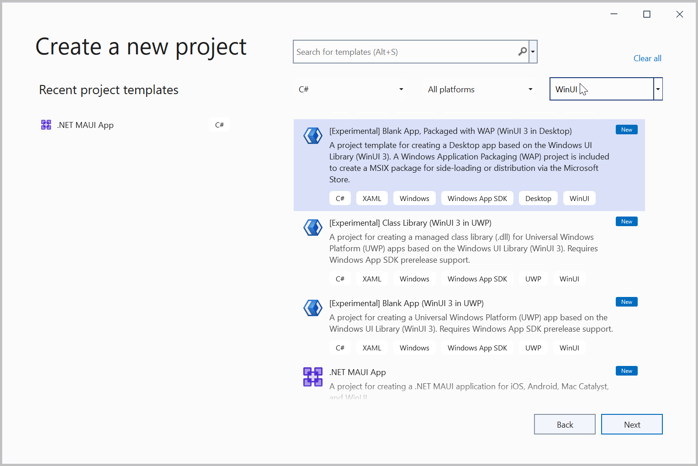
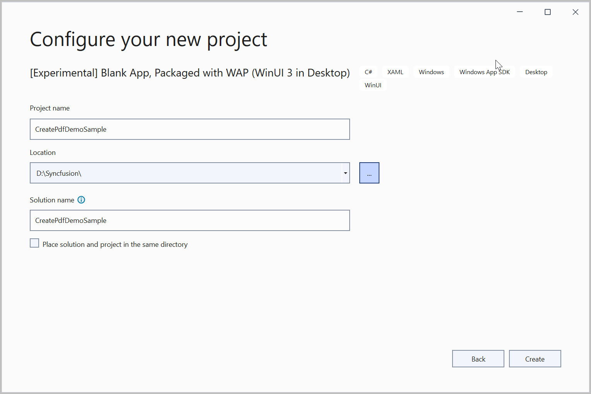
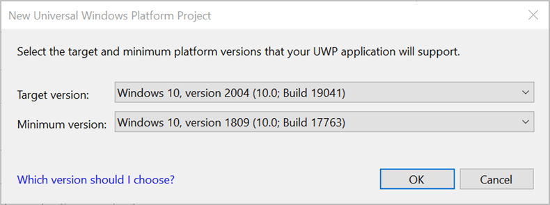
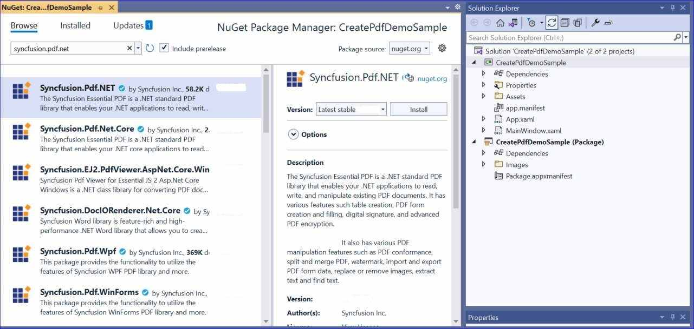
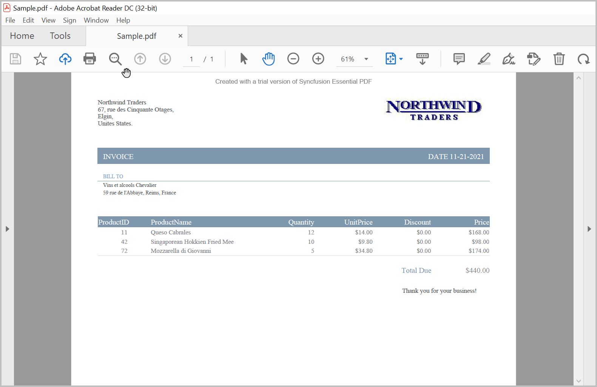

# Create or Generate a PDF file in WinUI

The [WinUI PDF library](https://www.syncfusion.com/document-sdk/net-pdf-library) is used to create, read, and edit **PDF** documents. This library also includes functions for merging, splitting, stamping, working with forms, and securing PDF files, among others. Using this library, you can create a PDF document in WinUI with just a few lines of code.

**Prerequisites:**
- Install the **Windows App SDK** extension for Visual Studio to use the WinUI 3 project templates. For more details, refer [here](https://learn.microsoft.com/en-us/windows/apps/windows-app-sdk/set-up-your-development-environment?tabs=cs-vs-community%2Ccpp-vs-community%2Cvs-2022-17-1-a%2Cvs-2022-17-1-b).
- This guide targets **WinUI 3 Desktop (packaged)** on **.NET 8.0 (Windows) or later**.

## WinUI Desktop app

Step 1: Create a new C# WinUI Desktop app. Select Blank App, Packaged with WAP (WinUI 3 in Desktop) from the template and click the **Next** button.
 

Step 2: Enter the project name and click **Create**.
 

Step 3: Set the Target version to Windows 10, version 2004 (build 19041) and the Minimum version to Windows 10, version 1809 (build 17763) and then click **OK**.
 

Step 4: Install the [Syncfusion.Pdf.NET](https://www.nuget.org/packages/Syncfusion.Pdf.NET/) NuGet package as a reference to your project from [NuGet.org](https://www.nuget.org/).
 

Step 5: Register the Syncfusion&reg; license key in the *App.xaml.cs* file before any Syncfusion component is used, to remove the evaluation watermark. Replace `"YOUR LICENSE KEY"` with the actual key from your Syncfusion account.




using Microsoft.UI.Xaml;
using Syncfusion.Licensing;

namespace CreatePdfDemoSample
{
    public partial class App : Application
    {
        public App()
        {
            //Register the Syncfusion license key to remove the evaluation watermark.
            Syncfusion.Licensing.SyncfusionLicenseProvider.RegisterLicense("YOUR LICENSE KEY");
            this.InitializeComponent();
        }
    }
}




N> The license must be registered once during application startup, before instantiating any Syncfusion component (for example, before creating a `PdfDocument`). Refer to the [licensing overview](https://help.syncfusion.com/common/essential-studio/licensing/overview) for details.

Step 6: Add a new button to the **MainWindow.xaml** as shown below. This snippet replaces the default page contents of the empty WinUI 3 Desktop window.




<Window
    x:Class="CreatePdfDemoSample.MainWindow"
    xmlns="http://schemas.microsoft.com/winfx/2006/xaml/presentation"
    xmlns:x="http://schemas.microsoft.com/winfx/2006/xaml"
    xmlns:local="using:CreatePdfDemoSample"
    xmlns:d="http://schemas.microsoft.com/expression/blend/2008"
    xmlns:mc="http://schemas.openxmlformats.org/markup-compatibility/2006"
    mc:Ignorable="d">
    <StackPanel Orientation="Horizontal" HorizontalAlignment="Center" VerticalAlignment="Center">
        <Button x:Name="button" Click="CreatePdf_Click">Create PDF</Button>
    </StackPanel>
</Window>




Step 7: Include the following namespaces in the **MainWindow.xaml.cs** file.




using Syncfusion.Pdf;
using Syncfusion.Pdf.Graphics;
using Syncfusion.Pdf.Grid;
using Syncfusion.Drawing;
using System.Reflection;
using System.Xml.Linq;





Step 8: Add a new action method `CreatePdf_Click` in *MainWindow.xaml.cs* and include the following code example to generate a PDF document using the [PdfDocument](https://help.syncfusion.com/cr/document-processing/Syncfusion.Pdf.PdfDocument.html) class. The [PdfTextElement](https://help.syncfusion.com/cr/document-processing/Syncfusion.Pdf.Graphics.PdfTextElement.html) is used to add text to a PDF document and provides layout results that help prevent content overlapping. Images are loaded from a local file on disk and drawn through the [DrawImage](https://help.syncfusion.com/cr/document-processing/Syncfusion.Pdf.Graphics.PdfGraphics.html#Syncfusion_Pdf_Graphics_PdfGraphics_DrawImage_Syncfusion_Pdf_Graphics_PdfImage_System_Single_System_Single_) method of the [PdfGraphics](https://help.syncfusion.com/cr/document-processing/Syncfusion.Pdf.Graphics.PdfGraphics.html) class. The [PdfGrid](https://help.syncfusion.com/cr/document-processing/Syncfusion.Pdf.Grid.PdfGrid.html) lets you create a table by entering data manually or from external data sources.

N> The example below uses sample data classes (`Orders`, `CustOrders`, `ShipDetails`) and helper methods (`GetShipDetails`, `GetTotalPrice`) that are not part of the Syncfusion PDF library. They are provided in the [GitHub WinUI sample](https://github.com/SyncfusionExamples/PDF-Examples/tree/master/Getting%20Started/WinUI) along with the `logo.jpg` asset, which must be added to the project as an embedded resource under the `CreatePdfDemoSample.Assets` namespace.




private void CreatePdf_Click(object sender, RoutedEventArgs e)
{
    //Create a new PDF document.
    PdfDocument document = new PdfDocument();
    //Set page orientation and margin. 
    document.PageSettings.Orientation = PdfPageOrientation.Landscape;
    document.PageSettings.Margins.All = 50;
    //Add a page to the document.
    PdfPage page = document.Pages.Add();
    //Create PDF graphics for the page.
    PdfGraphics graphics = page.Graphics;

    //Create a text element with the text and font.
    PdfTextElement element = new PdfTextElement("Northwind Traders\n67, rue des Cinquante Otages,\nElgin,\nUnites States.");
    element.Font = new PdfStandardFont(PdfFontFamily.TimesRoman, 12);
    element.Brush = new PdfSolidBrush(new PdfColor(89, 89, 93));
    PdfLayoutResult result = element.Draw(page, new RectangleF(0, 0, page.Graphics.ClientSize.Width / 2, 200));

    //Draw the image to a PDF page with the specified size
    Stream imgStream = typeof(MainWindow).GetTypeInfo().Assembly.GetManifestResourceStream("CreatePdfDemoSample.Assets.logo.jpg");
    PdfImage img = new PdfBitmap(imgStream);
    graphics.DrawImage(img, new RectangleF(graphics.ClientSize.Width - 200, result.Bounds.Y, 190, 45));
    PdfFont subHeadingFont = new PdfStandardFont(PdfFontFamily.TimesRoman, 14);
    graphics.DrawRectangle(new PdfSolidBrush(new PdfColor(126, 151, 173)), new RectangleF(0, result.Bounds.Bottom + 40, graphics.ClientSize.Width, 30));

    //Create a text element with the text and font.
    element = new PdfTextElement("INVOICE", subHeadingFont);
    element.Brush = PdfBrushes.White;
    result = element.Draw(page, new PointF(10, result.Bounds.Bottom + 48));
    string currentDate = "DATE " + DateTime.Now.ToString("MM/dd/yyyy");
    SizeF textSize = subHeadingFont.MeasureString(currentDate);
    graphics.DrawString(currentDate, subHeadingFont, element.Brush, new PointF(graphics.ClientSize.Width - textSize.Width - 10, result.Bounds.Y));

    //Create a text element and draw it to a PDF page.
    element = new PdfTextElement("BILL TO ", new PdfStandardFont(PdfFontFamily.TimesRoman, 10));
    element.Brush = new PdfSolidBrush(new PdfColor(126, 155, 203));
    result = element.Draw(page, new PointF(10, result.Bounds.Bottom + 25));
    graphics.DrawLine(new PdfPen(new PdfColor(126, 151, 173), 0.70f), new PointF(0, result.Bounds.Bottom + 3), new PointF(graphics.ClientSize.Width, result.Bounds.Bottom + 3));

    //Get products list to create invoice.
    IEnumerable<CustOrders> products = Orders.GetProducts();

    List<CustOrders> list = new List<CustOrders>();
    foreach (CustOrders cust in products)
    {
        list.Add(cust);
    }
    var reducedList = list.Select(f => new { f.ProductID, f.ProductName, f.Quantity, f.UnitPrice, f.Discount, f.Price }).ToList();

    //Get the shipping address details. 
    IEnumerable<ShipDetails> shipDetails = Orders.GetShipDetails();
    GetShipDetails(shipDetails);

    //Create a text element and draw it to a PDF page.
    element = new PdfTextElement(shipName, new PdfStandardFont(PdfFontFamily.TimesRoman, 10));
    element.Brush = new PdfSolidBrush(new PdfColor(89, 89, 93));
    result = element.Draw(page, new RectangleF(10, result.Bounds.Bottom + 5, graphics.ClientSize.Width / 2, 100));

    //Create a text element and draw it to a PDF page.
    element = new PdfTextElement(string.Format("{0}, {1}, {2}", address, shipCity, shipCountry), new PdfStandardFont(PdfFontFamily.TimesRoman, 10));
    element.Brush = new PdfSolidBrush(new PdfColor(89, 89, 93));
    result = element.Draw(page, new RectangleF(10, result.Bounds.Bottom + 3, graphics.ClientSize.Width / 2, 100));

    //Create a PDF grid with the product details.
    PdfGrid grid = new PdfGrid();
    grid.DataSource = reducedList;

    //Initialize PdfGridCellStyle and set the border color.
    PdfGridCellStyle cellStyle = new PdfGridCellStyle();
    cellStyle.Borders.All = PdfPens.White;
    cellStyle.Borders.Bottom = new PdfPen(new PdfColor(217, 217, 217), 0.70f);
    cellStyle.Font = new PdfStandardFont(PdfFontFamily.TimesRoman, 12f);
    cellStyle.TextBrush = new PdfSolidBrush(new PdfColor(131, 130, 136));

    //Initialize PdfGridCellStyle and set the header style.
    PdfGridCellStyle headerStyle = new PdfGridCellStyle();
    headerStyle.Borders.All = new PdfPen(new PdfColor(126, 151, 173));
    headerStyle.BackgroundBrush = new PdfSolidBrush(new PdfColor(126, 151, 173));
    headerStyle.TextBrush = PdfBrushes.White;
    headerStyle.Font = new PdfStandardFont(PdfFontFamily.TimesRoman, 14f, PdfFontStyle.Regular);

    PdfGridRow header = grid.Headers[0];
    for (int i = 0; i < header.Cells.Count; i++)
    {
        if (i == 0 || i == 1)
            header.Cells[i].StringFormat = new PdfStringFormat(PdfTextAlignment.Left, PdfVerticalAlignment.Middle);
        else
            header.Cells[i].StringFormat = new PdfStringFormat(PdfTextAlignment.Right, PdfVerticalAlignment.Middle);
    }
    header.ApplyStyle(headerStyle);

    foreach (PdfGridRow row in grid.Rows)
    {
        row.ApplyStyle(cellStyle);
        for (int i = 0; i < row.Cells.Count; i++)
        {
            //Create and customize the string formats
            PdfGridCell cell = row.Cells[i];
            if (i == 1)
                cell.StringFormat = new PdfStringFormat(PdfTextAlignment.Left, PdfVerticalAlignment.Middle);
            else if (i == 0)
                cell.StringFormat = new PdfStringFormat(PdfTextAlignment.Center, PdfVerticalAlignment.Middle);
            else
                cell.StringFormat = new PdfStringFormat(PdfTextAlignment.Right, PdfVerticalAlignment.Middle);

            if (i > 2)
            {
                float val = float.MinValue;
                float.TryParse(cell.Value.ToString(), out val);
                cell.Value = '$' + val.ToString("0.00");
            }
        }
    }

    grid.Columns[0].Width = 100;
    grid.Columns[1].Width = 200;

    //Set properties to paginate the grid.
    PdfGridLayoutFormat layoutFormat = new PdfGridLayoutFormat();
    layoutFormat.Layout = PdfLayoutType.Paginate;

    //Draw a grid on the page of the PDF document.
    PdfGridLayoutResult gridResult = grid.Draw(page, new RectangleF(new PointF(0, result.Bounds.Bottom + 40), new SizeF(graphics.ClientSize.Width, graphics.ClientSize.Height - 100)), layoutFormat);
    float pos = 0.0f;
    for (int i = 0; i < grid.Columns.Count - 1; i++)
        pos += grid.Columns[i].Width;

    PdfFont font = new PdfStandardFont(PdfFontFamily.TimesRoman, 14f);

    GetTotalPrice(products);

    gridResult.Page.Graphics.DrawString("Total Due", font, new PdfSolidBrush(new PdfColor(126, 151, 173)), new RectangleF(new PointF(pos, gridResult.Bounds.Bottom + 20), new SizeF(grid.Columns[3].Width - pos, 20)), new PdfStringFormat(PdfTextAlignment.Right));
    gridResult.Page.Graphics.DrawString("Thank you for your business!", new PdfStandardFont(PdfFontFamily.TimesRoman, 12), new PdfSolidBrush(new PdfColor(89, 89, 93)), new PointF(pos - 55, gridResult.Bounds.Bottom + 60));
    pos += grid.Columns[4].Width;
    gridResult.Page.Graphics.DrawString('$' + string.Format("{0:N2}", total), font, new PdfSolidBrush(new PdfColor(131, 130, 136)), new RectangleF(new PointF(pos, gridResult.Bounds.Bottom + 20), new SizeF(grid.Columns[4].Width - pos, 20)), new PdfStringFormat(PdfTextAlignment.Right));

    string filePath = Path.GetFullPath("Sample.pdf");

    //Save the PDF document to stream.
    using (FileStream outputStream = new FileStream(filePath, FileMode.Create, FileAccess.ReadWrite, FileShare.ReadWrite))
    {
        document.Save(outputStream);
        document.Close();
    }
}




You can download a complete working sample from [GitHub](https://github.com/SyncfusionExamples/PDF-Examples/tree/master/Getting%20Started/WinUI) or directly from this [link](https://www.syncfusion.com/downloads/support/directtrac/general/ze/CreatePdfDemoSample208256365).

By executing the program, you will get the PDF document as follows.

Explore the rich set of [Syncfusion&reg; PDF library features](https://www.syncfusion.com/document-sdk/net-pdf-library).

An online sample link to [create a PDF document](https://document.syncfusion.com/demos/pdf/default#/tailwind).

N> If a valid license key is not registered, an evaluation watermark is applied to the generated PDF document. To remove the watermark, register the license key in *App.xaml.cs* at application startup (as shown in Step 5). Refer to the [licensing overview](https://help.syncfusion.com/common/essential-studio/licensing/overview) for details.

## Next steps

- [Open a PDF file](https://help.syncfusion.com/document-processing/pdf/pdf-library/net/open-pdf-file)
- [Save a PDF file](https://help.syncfusion.com/document-processing/pdf/pdf-library/net/save-pdf-file)
- [Working with pages](https://help.syncfusion.com/document-processing/pdf/pdf-library/net/working-with-pages) 