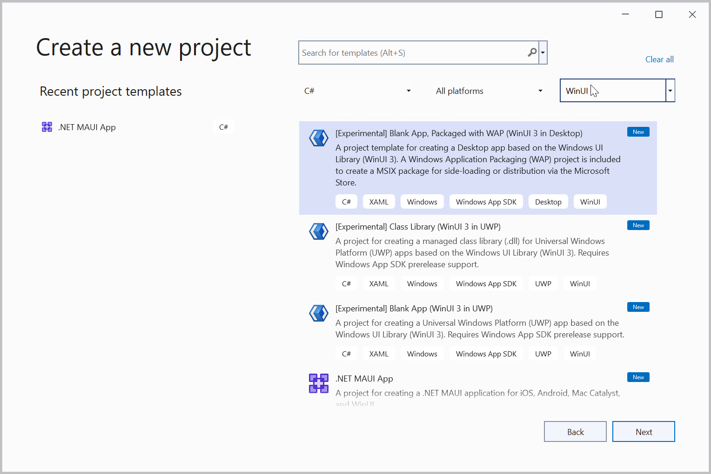
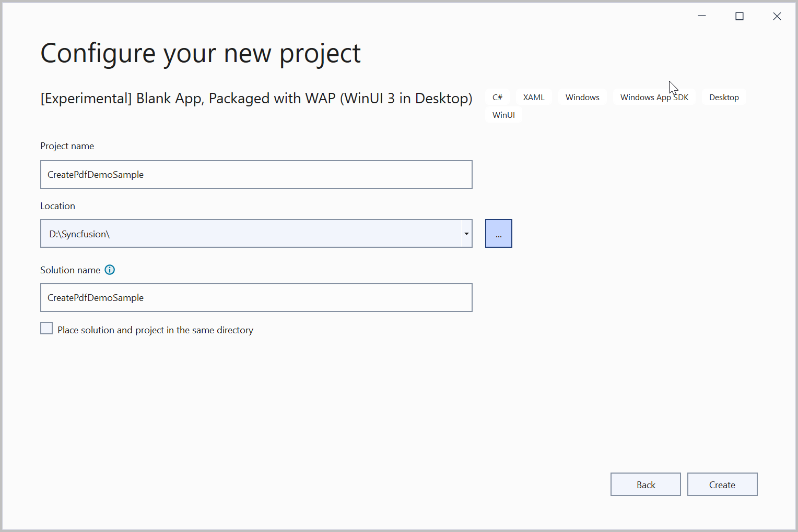
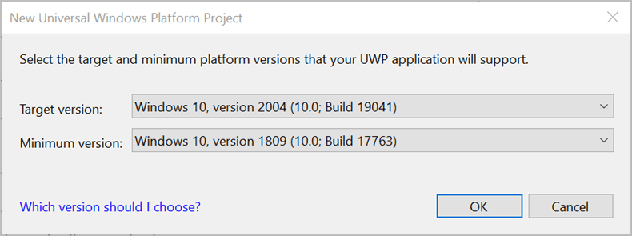
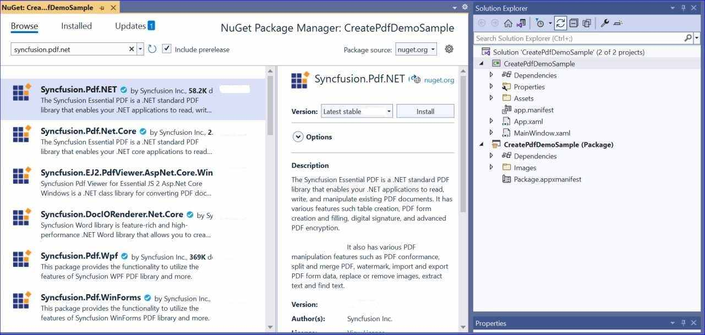

# Create PDF file in WinUI

The Syncfusion&reg; [WinUI PDF library](https://www.syncfusion.com/document-processing/pdf-framework/winui/pdf-library) is used to create, read, and edit **PDF** documents. This library also includes functions for merging, splitting, stamping, forms, and securing PDF files and more. Using this library, you can create a PDF document in WinUI with just a few lines of code.

**Prerequisites:**
To use the WinUI 3 project templates, install the Windows App SDK extension for Visual Studio. For more details, refer [here](https://learn.microsoft.com/en-us/windows/apps/windows-app-sdk/set-up-your-development-environment?tabs=cs-vs-community%2Ccpp-vs-community%2Cvs-2022-17-1-a%2Cvs-2022-17-1-b).

## WinUI Desktop app

Step 1: Create a new C# WinUI Desktop app. Select Blank App, Packaged with WAP (WinUI 3 in Desktop) from the template and click the **Next** button.
 

Step 2: Enter the project name and click **Create**.
 

Step 3: Set the Target version to Windows 10, version 2004 (build 19041) and the Minimum version to Windows 10, version 1809 (build 17763) and then click **OK**.
 

Step 4: Install the [Syncfusion.Pdf.Net](https://www.nuget.org/packages/Syncfusion.Pdf.NET/) NuGet package as a reference to your project from the [NuGet.org](https://www.nuget.org/).
 

N> Starting with v16.2.0.x, if you reference Syncfusion&reg; assemblies from trial setup or from the NuGet feed, you also have to add "Syncfusion.Licensing" assembly reference and include a license key in your projects. Please refer to this [link](https://help.syncfusion.com/common/essential-studio/licensing/overview) to know about registering Syncfusion&reg; license key in your application to use our components.

Step 5: Add a new button to the **MainWindow.xaml** as shown below.






<Window
    x:Class="CreatePdfDemoSample.MainWindow"
    xmlns="http://schemas.microsoft.com/winfx/2006/xaml/presentation"
    xmlns:x="http://schemas.microsoft.com/winfx/2006/xaml"
    xmlns:local="using:CreatePdfDemoSample"
    xmlns:d="http://schemas.microsoft.com/expression/blend/2008"
    xmlns:mc="http://schemas.openxmlformats.org/markup-compatibility/2006"
    mc:Ignorable="d">

    <StackPanel Orientation="Horizontal" HorizontalAlignment="Center" VerticalAlignment="Center">
        <Button x:Name="button" Click="createPdf_Click">Create PDF</Button>
    </StackPanel>
</Window>





{{ codesnippet1 | OrderList_Indent_Level_1 }}

Step 6: Include the following namespaces in the **MainWindow.xaml.cs** file.





using Syncfusion.Pdf;
using Syncfusion.Pdf.Graphics;
using Syncfusion.Pdf.Grid;
using Syncfusion.Drawing;
using System.Reflection;
using System.Xml.Linq;





{{ codesnippet2 | OrderList_Indent_Level_1 }}

Step 7: Add a new action method *createPdf_Click* in *MainWindow.xaml.cs* and include the below code example to generate a PDF document using the [PdfDocument](https://help.syncfusion.com/cr/document-processing/Syncfusion.Pdf.PdfDocument.html) class. The [PdfTextElement](https://help.syncfusion.com/cr/document-processing/Syncfusion.Pdf.Graphics.PdfTextElement.html) is used to add text in a PDF document and which provides the layout result of the added text by using the location of the next element that decides to prevent content overlapping. Load image stream from the local files on disk and draw the images through the [DrawImage](https://help.syncfusion.com/cr/document-processing/Syncfusion.Pdf.Graphics.PdfGraphics.html#Syncfusion_Pdf_Graphics_PdfGraphics_DrawImage_Syncfusion_Pdf_Graphics_PdfImage_System_Single_System_Single_) method of the [PdfGraphics](https://help.syncfusion.com/cr/document-processing/Syncfusion.Pdf.Graphics.PdfGraphics.html) class. The [PdfGrid](https://help.syncfusion.com/cr/document-processing/Syncfusion.Pdf.Grid.PdfGrid.html) allows you to create table by entering data manually or from an external data sources and include helper classes, methods and required files in the assets folder.






//Create a new PDF document.
PdfDocument document = new PdfDocument();
//Set page orientation and margin. 
document.PageSettings.Orientation = PdfPageOrientation.Landscape;
document.PageSettings.Margins.All = 50;
//Add a page to the document.
PdfPage page = document.Pages.Add();
//Create PDF graphics for the page.
PdfGraphics graphics = page.Graphics;

//Create a text element with the text and font.
PdfTextElement element = new PdfTextElement("Northwind Traders\n67, rue des Cinquante Otages,\nElgin,\nUnites States.");
element.Font = new PdfStandardFont(PdfFontFamily.TimesRoman, 12);
element.Brush = new PdfSolidBrush(new PdfColor(89, 89, 93));
PdfLayoutResult result = element.Draw(page, new RectangleF(0, 0, page.Graphics.ClientSize.Width / 2, 200));

//Draw the image to a PDF page with the specified size
Stream imgStream = typeof(MainWindow).GetTypeInfo().Assembly.GetManifestResourceStream("CreatePdfDemoSample.Assets.logo.jpg");
PdfImage img = new PdfBitmap(imgStream);
graphics.DrawImage(img, new RectangleF(graphics.ClientSize.Width - 200, result.Bounds.Y, 190, 45));
PdfFont subHeadingFont = new PdfStandardFont(PdfFontFamily.TimesRoman, 14);
graphics.DrawRectangle(new PdfSolidBrush(new PdfColor(126, 151, 173)), new RectangleF(0, result.Bounds.Bottom + 40, graphics.ClientSize.Width, 30));

//Create a text element with the text and font.
element = new PdfTextElement("INVOICE", subHeadingFont);
element.Brush = PdfBrushes.White;
result = element.Draw(page, new PointF(10, result.Bounds.Bottom + 48));
string currentDate = "DATE " + DateTime.Now.ToString("MM/dd/yyyy");
SizeF textSize = subHeadingFont.MeasureString(currentDate);
graphics.DrawString(currentDate, subHeadingFont, element.Brush, new PointF(graphics.ClientSize.Width - textSize.Width - 10, result.Bounds.Y));

//Create a text element and draw it to a PDF page.
element = new PdfTextElement("BILL TO ", new PdfStandardFont(PdfFontFamily.TimesRoman, 10));
element.Brush = new PdfSolidBrush(new PdfColor(126, 155, 203));
result = element.Draw(page, new PointF(10, result.Bounds.Bottom + 25));
graphics.DrawLine(new PdfPen(new PdfColor(126, 151, 173), 0.70f), new PointF(0, result.Bounds.Bottom + 3), new PointF(graphics.ClientSize.Width, result.Bounds.Bottom + 3));

//Get products list to create invoice.
IEnumerable<CustOrders> products = Orders.GetProducts();

List<CustOrders> list = new List<CustOrders>();
foreach (CustOrders cust in products)
{
    list.Add(cust);
}
var reducedList = list.Select(f => new { f.ProductID, f.ProductName, f.Quantity, f.UnitPrice, f.Discount, f.Price }).ToList();

//Get the shipping address details. 
IEnumerable<ShipDetails> shipDetails = Orders.GetShipDetails();]]
GetShipDetails(shipDetails);

//Create a text element and draw it to a PDF page.
element = new PdfTextElement(shipName, new PdfStandardFont(PdfFontFamily.TimesRoman, 10));
element.Brush = new PdfSolidBrush(new PdfColor(89, 89, 93));
result = element.Draw(page, new RectangleF(10, result.Bounds.Bottom + 5, graphics.ClientSize.Width / 2, 100));

//Create a text element and draw it to a PDF page.
element = new PdfTextElement(string.Format("{0}, {1}, {2}", address, shipCity, shipCountry), new PdfStandardFont(PdfFontFamily.TimesRoman, 10));
element.Brush = new PdfSolidBrush(new PdfColor(89, 89, 93));
result = element.Draw(page, new RectangleF(10, result.Bounds.Bottom + 3, graphics.ClientSize.Width / 2, 100));

//Create a PDF grid with the product details.
PdfGrid grid = new PdfGrid();
grid.DataSource = reducedList;

//Initialize PdfGridCellStyle and set the border color.
PdfGridCellStyle cellStyle = new PdfGridCellStyle();
cellStyle.Borders.All = PdfPens.White;
cellStyle.Borders.Bottom = new PdfPen(new PdfColor(217, 217, 217), 0.70f);
cellStyle.Font = new PdfStandardFont(PdfFontFamily.TimesRoman, 12f);
cellStyle.TextBrush = new PdfSolidBrush(new PdfColor(131, 130, 136));

//Initialize PdfGridCellStyle and set the header style.
PdfGridCellStyle headerStyle = new PdfGridCellStyle();
headerStyle.Borders.All = new PdfPen(new PdfColor(126, 151, 173));
headerStyle.BackgroundBrush = new PdfSolidBrush(new PdfColor(126, 151, 173));
headerStyle.TextBrush = PdfBrushes.White;
headerStyle.Font = new PdfStandardFont(PdfFontFamily.TimesRoman, 14f, PdfFontStyle.Regular);

PdfGridRow header = grid.Headers[0];
for (int i = 0; i < header.Cells.Count; i++)
{
    if (i == 0 || i == 1)
        header.Cells[i].StringFormat = new PdfStringFormat(PdfTextAlignment.Left, PdfVerticalAlignment.Middle);
    else
        header.Cells[i].StringFormat = new PdfStringFormat(PdfTextAlignment.Right, PdfVerticalAlignment.Middle);
}
header.ApplyStyle(headerStyle);

foreach (PdfGridRow row in grid.Rows)
{
    row.ApplyStyle(cellStyle);
    for (int i = 0; i < row.Cells.Count; i++)
    {
        //Create and customize the string formats
        PdfGridCell cell = row.Cells[i];
        if (i == 1)
            cell.StringFormat = new PdfStringFormat(PdfTextAlignment.Left, PdfVerticalAlignment.Middle);
        else if (i == 0)
            cell.StringFormat = new PdfStringFormat(PdfTextAlignment.Center, PdfVerticalAlignment.Middle);
        else
            cell.StringFormat = new PdfStringFormat(PdfTextAlignment.Right, PdfVerticalAlignment.Middle);

        if (i > 2)
        {
            float val = float.MinValue;
            float.TryParse(cell.Value.ToString(), out val);
            cell.Value = '$' + val.ToString("0.00");
        }
    }
}

grid.Columns[0].Width = 100;
grid.Columns[1].Width = 200;

//Set properties to paginate the grid.
PdfGridLayoutFormat layoutFormat = new PdfGridLayoutFormat();
layoutFormat.Layout = PdfLayoutType.Paginate;

//Draw a grid on the page of the PDF document.
PdfGridLayoutResult gridResult = grid.Draw(page, new RectangleF(new PointF(0, result.Bounds.Bottom + 40), new SizeF(graphics.ClientSize.Width, graphics.ClientSize.Height - 100)), layoutFormat);
float pos = 0.0f;
for (int i = 0; i < grid.Columns.Count - 1; i++)
    pos += grid.Columns[i].Width;

PdfFont font = new PdfStandardFont(PdfFontFamily.TimesRoman, 14f);

GetTotalPrice(products);

gridResult.Page.Graphics.DrawString("Total Due", font, new PdfSolidBrush(new PdfColor(126, 151, 173)), new RectangleF(new PointF(pos, gridResult.Bounds.Bottom + 20), new SizeF(grid.Columns[3].Width - pos, 20)), new PdfStringFormat(PdfTextAlignment.Right));
gridResult.Page.Graphics.DrawString("Thank you for your business!", new PdfStandardFont(PdfFontFamily.TimesRoman, 12), new PdfSolidBrush(new PdfColor(89, 89, 93)), new PointF(pos - 55, gridResult.Bounds.Bottom + 60));
pos += grid.Columns[4].Width;
gridResult.Page.Graphics.DrawString('$' + string.Format("{0:N2}", total), font, new PdfSolidBrush(new PdfColor(131, 130, 136)), new RectangleF(new PointF(pos, gridResult.Bounds.Bottom + 20), new SizeF(grid.Columns[4].Width - pos, 20)), new PdfStringFormat(PdfTextAlignment.Right));

string filePath = Path.GetFullPath("Sample.pdf");

//Save the PDF document to stream.
using (FileStream outputStream = new FileStream(filePath, FileMode.Create, FileAccess.ReadWrite, FileShare.ReadWrite))
{
    document.Save(outputStream);
    document.Close();
}





{{ codesnippet3 | OrderList_Indent_Level_1 }}

A complete working example of creating a PDF document in the WinUI Desktop app can be downloaded from this [link](https://www.syncfusion.com/downloads/support/directtrac/general/ze/CreatePdfDemoSample208256365).

You can download a complete working sample from [GitHub](https://github.com/SyncfusionExamples/PDF-Examples/tree/master/Getting%20Started/WinUI).

By executing the program, you will get the PDF document as follows.

Click [here](https://www.syncfusion.com/document-processing/pdf-framework/winui) to explore the rich set of Syncfusion&reg; PDF library features.

An online sample link to [create PDF document](https://ej2.syncfusion.com/aspnetcore/PDF/HelloWorld#/material3) in ASP.NET Core. 