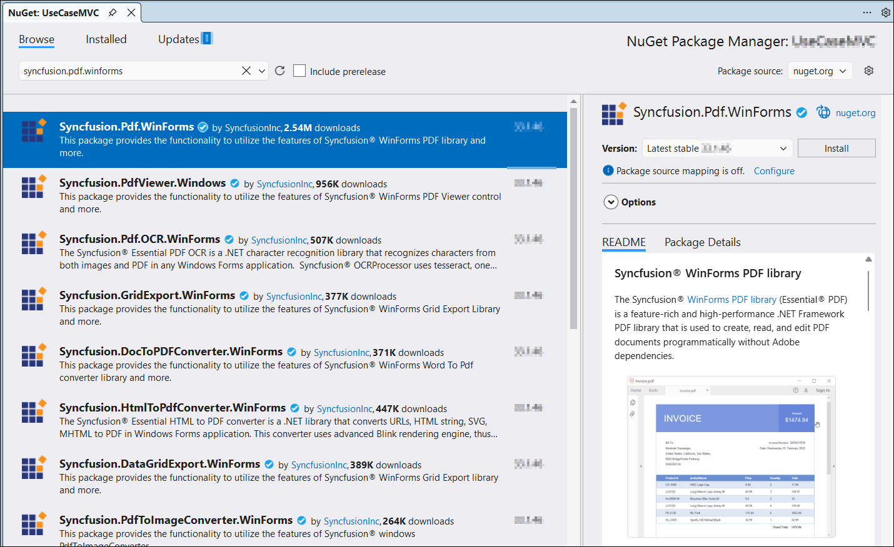

---
title: Create or Generate PDF file in Windows Forms | Syncfusion
description: Learn how to create or generate a PDF file in Windows Forms with easy steps using Syncfusion .NET PDF library without depending on Adobe.
platform: document-processing
control: PDF
documentation: UG
--- 

# Create or Generate a PDF File in Windows Forms

The [.NET PDF library](https://www.syncfusion.com/document-sdk/net-pdf-library) creates, reads, and edits PDF documents. It merges, splits, stamps, fills forms, and secures PDF files.

To include the .NET PDF library in your Windows Forms application, refer to the [NuGet Package Required](https://help.syncfusion.com/document-processing/pdf/pdf-library/net/nuget-packages-required) or [Assemblies Required](https://help.syncfusion.com/document-processing/pdf/pdf-library/net/assemblies-required) documentation.

## Prerequisites

- **Visual Studio 2022** (17.8 or later) with the **.NET desktop development** workload installed.
- A target framework of **.NET 8** (or later) or **.NET Framework 4.6.2** (or later).
- A **Syncfusion&reg; license key** — register it in your application using `Syncfusion.Licensing.SyncfusionLicenseProvider.RegisterLicense("YOUR_LICENSE_KEY")`. For details, see the [Syncfusion licensing overview](https://help.syncfusion.com/common/essential-studio/licensing/overview).
- The appropriate Syncfusion NuGet package:
  - **.NET 8+:** [Syncfusion.Pdf.Net.Core](https://www.nuget.org/packages/Syncfusion.Pdf.Net.Core) (preferred cross-platform package)
  - **.NET Framework 4.6.2+:** [Syncfusion.Pdf.WinForms](https://www.nuget.org/packages/Syncfusion.Pdf.WinForms/) (legacy .NET Framework package)

## Step to create a PDF document in Windows Forms

**Step 1:** In Visual Studio, create a new **Windows Forms App** project (targeting .NET 8 or later) or a **Windows Forms App (.NET Framework)** project (targeting .NET Framework 4.6.2 or later).

**Step 2:** Install the appropriate Syncfusion NuGet package from [NuGet.org](https://www.nuget.org/) using the **NuGet Package Manager** or the **Package Manager Console** (`Install-Package Syncfusion.Pdf.WinForms` for .NET Framework, or `Install-Package Syncfusion.Pdf.Net.Core` for .NET 8+). Use the latest stable version compatible with your target framework.

N> If you reference Syncfusion&reg; assemblies from the trial setup or the NuGet feed, you must add a reference to the `Syncfusion.Licensing` assembly and include a valid license key in your project. See the [Syncfusion licensing overview](https://help.syncfusion.com/common/essential-studio/licensing/overview) for details on registering the license key.

**Step 3:** Add the following `using` directives to `Form1.cs` (not `Form1.Designer.cs`, which is auto-generated and should not be edited manually).




using Syncfusion.Pdf;
using Syncfusion.Pdf.Graphics;
using System.Drawing;




**Step 4:** Add a new button to `Form1.cs` (or use the Visual Studio **Designer** view) with the following code. The Designer view is recommended for production code, but the code below shows the equivalent C# that the Designer generates.




private Button btnCreate;
private Label label;
  
private void InitializeComponent()
{
  btnCreate = new Button();
  label = new Label();
  
  //Label
  label.Location = new System.Drawing.Point(0, 40);
  label.Size = new System.Drawing.Size(426, 35);
  label.Text = "Click the button to generate PDF file by Essential PDF";
  label.TextAlign = System.Drawing.ContentAlignment.MiddleCenter;
  
  //Button
  btnCreate.Location = new System.Drawing.Point(180, 110);
  btnCreate.Size = new System.Drawing.Size(85, 26);
  btnCreate.Text = "Create PDF";
  btnCreate.Click += new EventHandler(btnCreate_Click); 
                               
  //Create PDF
  ClientSize = new System.Drawing.Size(450, 150);
  Controls.Add(label);
  Controls.Add(btnCreate);
  Text = "Create PDF";
}




**Step 5:** Create the `btnCreate_Click` event in `Form1.cs` and add the following code to generate a PDF document using the [PdfDocument](https://help.syncfusion.com/cr/document-processing/Syncfusion.Pdf.PdfDocument.html) class. The [DrawString](https://help.syncfusion.com/cr/document-processing/Syncfusion.Pdf.Graphics.PdfGraphics.html#Syncfusion_Pdf_Graphics_PdfGraphics_DrawString_System_String_Syncfusion_Pdf_Graphics_PdfFont_Syncfusion_Pdf_Graphics_PdfBrush_System_Drawing_PointF_) method of the [PdfGraphics](https://help.syncfusion.com/cr/document-processing/Syncfusion.Pdf.Graphics.PdfGraphics.html) object draws the text on the PDF page. The `document.Save("Output.pdf")` call writes the PDF to the current working directory (typically `bin\Debug\<target-framework>\`); pass an absolute path or use a `SaveFileDialog` to let the user choose the location.




private void GeneratePDF(object sender, EventArgs e)
{
  //Create a new PDF document. 
  using (PdfDocument document = new PdfDocument())
  {
    //Add a page to the document.
    PdfPage page = document.Pages.Add();
    //Create PDF graphics for a page.
    PdfGraphics graphics = page.Graphics;
    //Set the standard font.
    PdfFont font = new PdfStandardFont(PdfFontFamily.Helvetica, 20);
    //Draw the text.
    graphics.DrawString("Hello World!!!", font, PdfBrushes.Black, new PointF(0, 0));
    //Save the document.
    document.Save("Output.pdf");
  }
}




You can download a complete working sample from the [`Create-new-PDF-document` folder on GitHub](https://github.com/SyncfusionExamples/PDF-Examples/tree/master/Getting%20Started/Windows%20Forms/Create-new-PDF-document).

Running the program and clicking the **Create PDF** button produces the following PDF document.

Explore the [Syncfusion&reg; PDF library features](https://www.syncfusion.com/document-sdk/net-pdf-library) to learn more about merging, splitting, securing, and stamping PDF files.

An online sample demonstrating how to [create a PDF document](https://document.syncfusion.com/demos/pdf/default#/tailwind) is also available.

## Troubleshooting

- **Watermark appears in the output PDF** — Your Syncfusion&reg; license key is not registered. Call `SyncfusionLicenseProvider.RegisterLicense("YOUR_LICENSE_KEY")` at application startup, before any Syncfusion API is called.
- **`System.Drawing.Common` exceptions on .NET 6+ for non-Windows targets** — `System.Drawing` is restricted on .NET 6+ for non-Windows targets. Use the `Syncfusion.Drawing` namespace and the `Syncfusion.Pdf.Net.Core` package.
- **GDI+ errors on Windows Server** — Ensure the **Server Core** optional feature for "Server-Gui-Shell" or the **Desktop Experience** is installed so the GDI+ subsystem is available.
- **`Output.pdf` is created in `bin\Debug\net6.0-windows\`** — `document.Save("Output.pdf")` writes to the current working directory, which is the executable's folder for a WinForms app. Use `SaveFileDialog` to let the user choose the location, or pass an absolute path.
- **PDF file is locked when trying to open it after saving** — Wrap the `document.Save(...)` call in a `using` block (as shown in the sample) and ensure the `PdfDocument` is disposed before opening the file with another reader.
- **NuGet restore fails with "package not compatible"** — On .NET 6+, use `Syncfusion.Pdf.Net.Core` instead of `Syncfusion.Pdf.WinForms` (which targets .NET Framework only).

## See also

- [Create a PDF File in WPF](create-pdf-file-in-wpf)
- [Create a PDF File in WinUI](create-pdf-file-in-winui)
- [Create a PDF File in UWP](create-pdf-file-in-uwp)
- [Create a PDF File in ASP.NET Core](create-pdf-file-in-asp-net-core)
- [NuGet Packages Required](https://help.syncfusion.com/document-processing/pdf/pdf-library/net/nuget-packages-required)
- [Assemblies Required](https://help.syncfusion.com/document-processing/pdf/pdf-library/net/assemblies-required)
- [Syncfusion&reg; Licensing Overview](https://help.syncfusion.com/common/essential-studio/licensing/overview)
- [Open and read PDF files](https://help.syncfusion.com/document-processing/pdf/pdf-library/net/open-pdf-files)
- [Merge PDF documents](https://help.syncfusion.com/document-processing/pdf/pdf-library/net/merge-documents)
- [Split PDF documents](https://help.syncfusion.com/document-processing/pdf/pdf-library/net/split-documents)
- [Working with PDF forms](https://help.syncfusion.com/document-processing/pdf/pdf-library/net/working-with-forms)
- [Working with security and permissions](https://help.syncfusion.com/document-processing/pdf/pdf-library/net/working-with-security)
- [Working with stamps and watermarks](https://help.syncfusion.com/document-processing/pdf/pdf-library/net/working-with-watermarks)
- [Syncfusion&reg; PDF library — Demos](https://document.syncfusion.com/demos/pdf/default) 