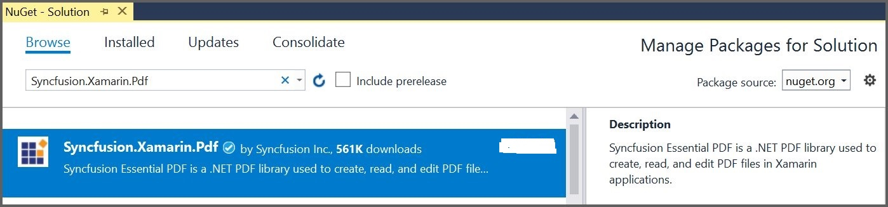

# Create or Generate PDF file in Xamarin

> **Note:** Xamarin reached end-of-life in May 2024 and is no longer supported by Microsoft. For new projects, use the [.NET MAUI](https://help.syncfusion.com/document-processing/pdf/pdf-library/net/create-pdf-file-in-maui) equivalent of this guide.

The [Xamarin PDF library](https://www.syncfusion.com/document-sdk/net-pdf-library) is used to create, read, and edit PDF documents. This library also offers functionality to merge, split, stamp, work with forms, and secure PDF files.

To include the Syncfusion&reg; Xamarin PDF library into your Xamarin application, please refer to the [NuGet Package Required](https://help.syncfusion.com/document-processing/pdf/pdf-library/net/nuget-packages-required) or [Assemblies Required](https://help.syncfusion.com/document-processing/pdf/pdf-library/net/assemblies-required) documentation.

## Prerequisites

* [Visual Studio 2019](https://visualstudio.microsoft.com/downloads/) (or later) with the **Mobile development with .NET** workload installed
* Xamarin SDK installed through the Visual Studio Installer
* An active [Syncfusion&reg; license key](https://www.syncfusion.com/sales/communitylicense) (a free 30-day trial is available)

## Steps to create PDF document in Xamarin

Step 1: Create a new C# Xamarin.Forms application project.

Step 2: Select a project template and required platforms to deploy the application. In this application, the portable assemblies to be shared across multiple platforms, so the .NET Standard code sharing strategy has been selected. For more details about code sharing, refer [here](https://learn.microsoft.com/en-us/xamarin/cross-platform/app-fundamentals/code-sharing).

N> If .NET Standard is not available in the code sharing strategy, the Portable Class Library (PCL) can be selected.

Step 3: Install the [Syncfusion.Xamarin.PDF](https://www.nuget.org/packages/Syncfusion.Xamarin.PDF/) NuGet package as a reference to your Xamarin.Forms applications from [NuGet.org](https://www.nuget.org/).

N> Starting with v16.2.0.x, if you reference Syncfusion&reg; assemblies from trial setup or from the NuGet feed, you also have to add the `Syncfusion.Licensing` assembly reference and include a license key in your projects. Please refer to this [link](https://help.syncfusion.com/common/essential-studio/licensing/overview) to learn about registering the Syncfusion license key in your application to use our components.

Step 4: Register the Syncfusion&reg; license key. An evaluation watermark is added to every page of the generated PDF until a valid key is registered. Include the license key in the **App.xaml.cs** constructor (or any startup class) before creating a `PdfDocument` instance. Refer to the [Syncfusion License documentation](https://help.syncfusion.com/common/essential-studio/licensing/overview) to learn about registering the Syncfusion&reg; license key in your application.




using Syncfusion.Licensing;

public App()
{
    // Register the Syncfusion license
    Syncfusion.Licensing.SyncfusionLicenseProvider.RegisterLicense("YOUR LICENSE KEY");
    //The root page of your application.
    MainPage = new MainXamlPage();
}




Replace `"YOUR LICENSE KEY"` with the actual key from your Syncfusion&reg; account. If you do not have one, request a free 30-day trial at [https://www.syncfusion.com/sales/communitylicense](https://www.syncfusion.com/sales/communitylicense). For local development, store the key in an environment variable and read it with `Environment.GetEnvironmentVariable("SyncfusionLicenseKey")` rather than hardcoding it. For production environments, prefer reading the key from a secure store such as **Azure Key Vault**, the platform **Secure Storage** plugin, or a configuration provider. Refer to the [Syncfusion License documentation](https://help.syncfusion.com/common/essential-studio/licensing/overview) for details.

Step 5: Add a new Forms XAML page in the portable project if no XAML page is defined in the App class. Otherwise, proceed to the next step.

a. To add the new XAML page, right-click the project and select **Add > New Item** and add a Forms XAML Page from the list. Name it as **MainXamlPage**.

b. In App class of portable project (App.cs), replace the existing constructor of App class with the following code example, which invokes the *MainXamlPage*.




public App()
{
  //The root page of your application.
  MainPage = new MainXamlPage();
}




Step 6: In the *MainXamlPage.xaml*, add new button as follows.



<ContentPage xmlns="http://xamarin.com/schemas/2014/forms"
             xmlns:x="http://schemas.microsoft.com/winfx/2009/xaml"
             x:Class="GettingStarted.MainXamlPage">
  <StackLayout VerticalOptions="Center">
    <Button Text="Generate Document" Clicked="OnButtonClicked" HorizontalOptions="Center"/>
  </StackLayout>
</ContentPage>



Step 7: Include the following namespace in the *MainXamlPage.xaml.cs* file.




using Syncfusion.Pdf;
using Syncfusion.Pdf.Parsing;
using Syncfusion.Pdf.Graphics;
using Syncfusion.Pdf.Grid;




Step 8: Include the following code example in the click event of the button in *MainXamlPage.xaml.cs*, to create a PDF document and save it in a stream.
 



private void Button_Clicked(object sender, EventArgs e)
{
  //Create a new PDF document.
  PdfDocument document = new PdfDocument();
  //Add a page to the document.
  PdfPage page = document.Pages.Add();
  //Create PDF graphics for the page.
  PdfGraphics graphics = page.Graphics;
  //Set the standard font.
  PdfFont font = new PdfStandardFont(PdfFontFamily.Helvetica, 20);
  //Draw the text.
  graphics.DrawString("Hello World!!!", font, PdfBrushes.Black, new PointF(0, 0));
  //Save the document to the stream.
  MemoryStream stream = new MemoryStream();
  document.Save(stream);
  //Close the document.
  document.Close(true);
  //Save the stream as a file in the device and invoke it for viewing.
  Xamarin.Forms.DependencyService.Get<ISave>().SaveAndView("Output.pdf", "application/pdf", stream);
}




Step 9: Download the helper files from this [link](https://www.syncfusion.com/downloads/support/directtrac/general/ze/Helper_Class1305995392) and add them into the mentioned project. These helper files allow you to save the stream as a physical file and open the file for viewing.

<table>
  <tr>
    <th>Project</th>
    <th>File Name</th>
	<th>Summary</th>
  </tr>
  <tr>
    <td>portable project</td>
    <td>ISave.cs </td>
	<td>Represents the base interface for the save operation</td>
  </tr>
  <tr>
    <td rowspan="2">iOS Project</td>
    <td>SaveIOS.cs</td>
	<td>Save implementation for iOS device</td>
  </tr>
   <tr>    
    <td>PreviewControllerDS.cs</td>
	<td>Helper class for viewing the PDF file in iOS device</td>	
  </tr>
  <tr>
    <td>Android project</td>
    <td>SaveAndroid.cs</td>
	<td>Save implementation for Android device</td>	
  </tr>
  <tr>
    <td>WinPhone project</td>
    <td>SaveWinPhone.cs</td>
	<td>Save implementation for Windows Phone device</td>	
  </tr>
  <tr>
    <td>UWP project</td>
    <td>SaveWindows.cs</td>
	<td>Save implementation for UWP device.</td>	
  </tr>
  <tr>
    <td>Windows(8.1) project </td>
    <td>SaveWindows81.cs</td>
	<td>Save implementation for WinRT device.</td>	
  </tr>     
</table>

Step 10: Configure the Android file provider so that the generated PDF document can be saved and viewed on devices running Android SDK 23 and above. Android introduced a new runtime permission model from SDK version 23 onwards.

a. Create a new XML file named `provider_paths.xml` under the Android project `Resources` folder and add the following code in it.
Eg: Resources/xml/provider_paths.xml




<?xml version="1.0" encoding="UTF-8"?>
<paths xmlns:android="http://schemas.android.com/apk/res/android">
    <external-path
        name="external_files"
        path="." />
</paths>




b. Add the following code to the `AndroidManifest.xml` file located under `Properties/AndroidManifest.xml`.



<?xml version="1.0" encoding="utf-8"?>
<manifest xmlns:android="http://schemas.android.com/apk/res/android"
          android:versionCode="1"
          android:versionName="1.0"
          package="com.companyname.GettingStarted">
    <uses-sdk
        android:minSdkVersion="19"
        android:targetSdkVersion="27" />
    <application
        android:label=" GettingStarted.Android"
        android:requestLegacyExternalStorage="true">
        <provider
            android:name="android.support.v4.content.FileProvider"
            android:authorities="${applicationId}.provider"
            android:exported="false"
            android:grantUriPermissions="true">
            <meta-data
                android:name="android.support.FILE_PROVIDER_PATHS"
                android:resource="@xml/provider_paths" />
        </provider>
    </application>
</manifest>



**Include the following changes when deploying the application on Android 11 and later:**

* Add the user permission for reading and writing external storage to the `AndroidManifest.xml` file. The `android:requestLegacyExternalStorage` attribute can be enabled on the `<application>` element when required, as shown below.




<uses-permission android:name="android.permission.WRITE_EXTERNAL_STORAGE" />
<uses-permission android:name="android.permission.READ_EXTERNAL_STORAGE" />

<application android:label="GettingStarted.Android" android:requestLegacyExternalStorage="true">




Step 11: Compile and execute the application. This will create a simple PDF document.

You can download a complete working sample from [GitHub](https://github.com/SyncfusionExamples/PDF-Examples/tree/master/Getting%20Started/Xamarin/CreatePDFDocument).

By executing the program, you will get the PDF document as follows.

Click [here](https://www.syncfusion.com/document-sdk/net-pdf-library) to explore the rich set of Syncfusion&reg; PDF library features.

An online sample link to [create PDF document](https://document.syncfusion.com/demos/pdf/default#/tailwind).

## Next steps

* [Create a PDF in .NET MAUI](Create-PDF-file-in-MaUI.md) (the recommended modern alternative to Xamarin)
* [Create a PDF in WPF](Create-PDF-file-in-WPF.md)
* [Create a PDF in Windows Forms](Create-PDF-file-in-Windows-Forms.md)
* [Create a PDF in ASP.NET Core](Create-PDF-file-in-ASP-NET-Core.md)
* [Open and read an existing PDF document](Open-PDF-file.md)
* [Save the generated PDF to a file or stream](Save-PDF-file.md)