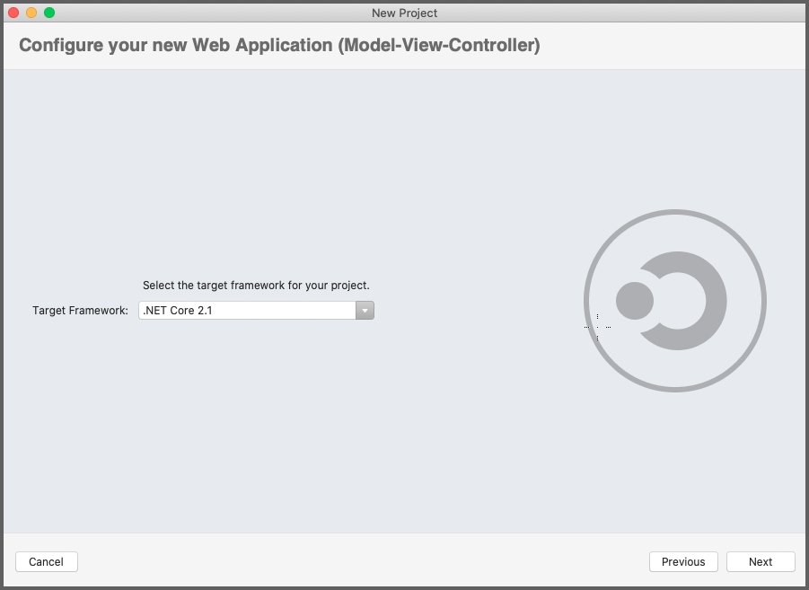
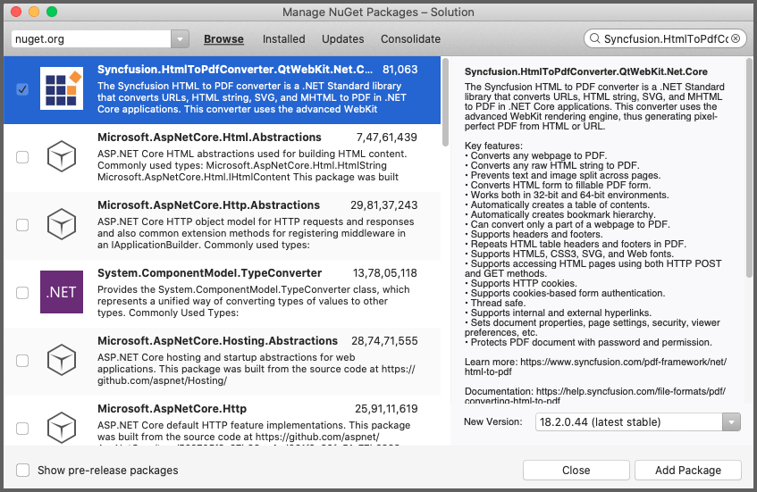
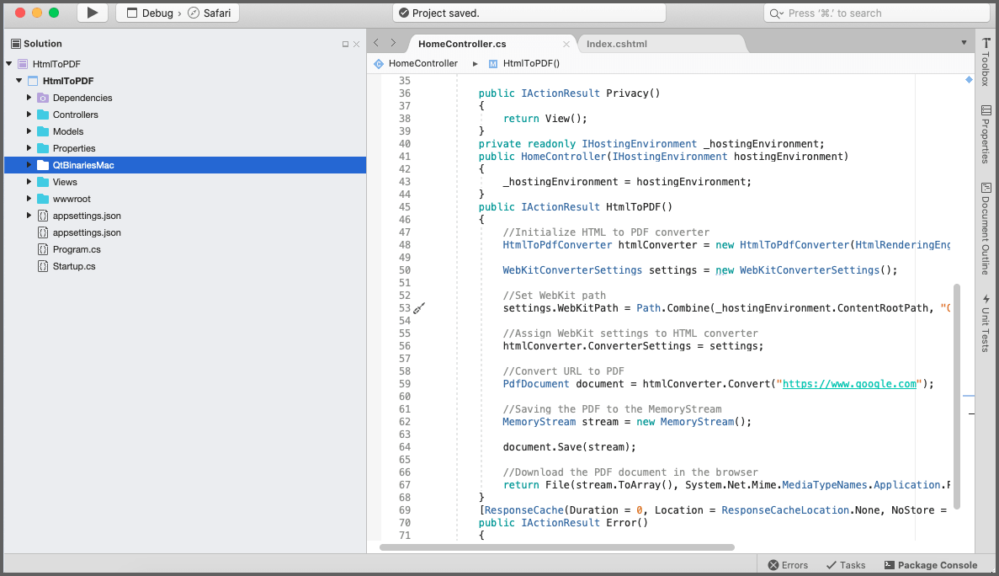
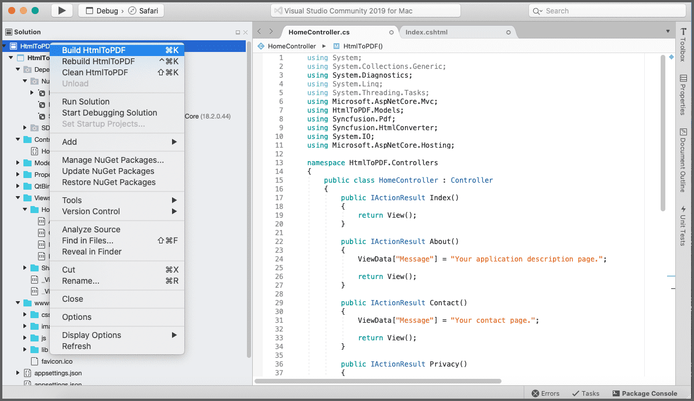
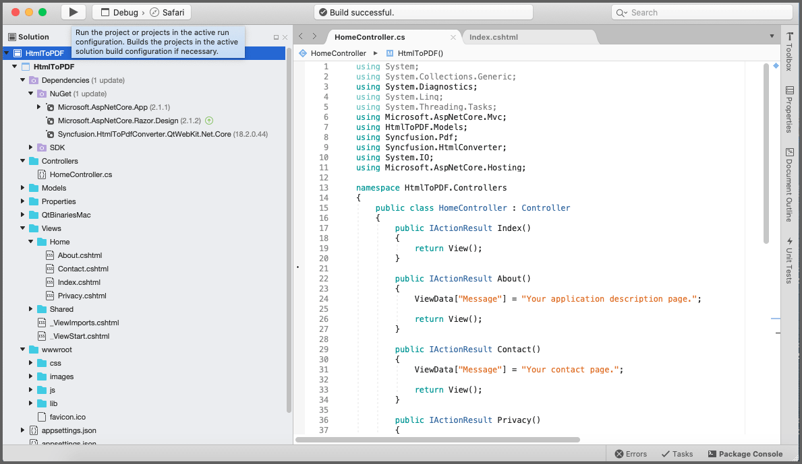
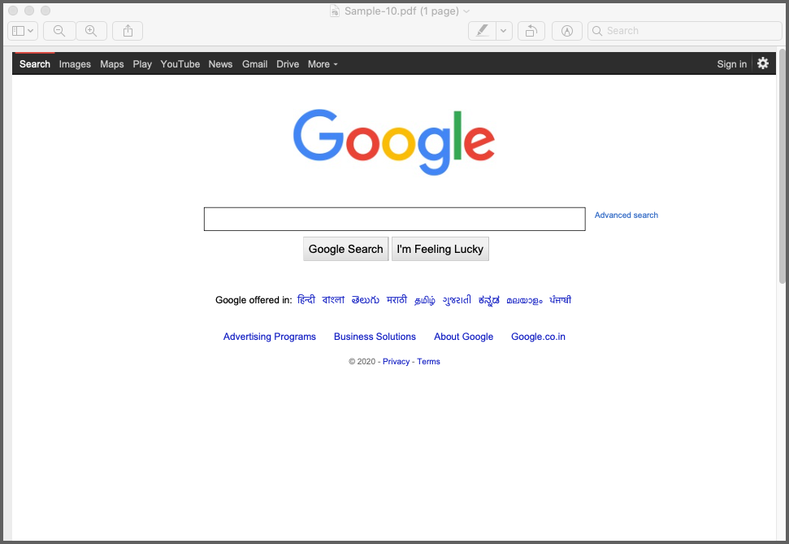

# How to use the HTML converter in Visual Studio for Mac.

In your ASP.NET Core application, add the following assemblies to use Essential&reg; HTML Converter:

* Syncfusion.Compression.Portable.dll
* Syncfusion.Pdf.Portable.dll
* Syncfusion.HtmlConverter.Portable.dll

For more details, refer to this [Assemblies Required](https://help.syncfusion.com/document-processing/pdf/pdf-library/net/assemblies-required) documentation.

## Steps to convert HTML to PDF using WebKit in ASP.NET Core Mac

Create a new C# ASP.NET Core Web Application project.

Select the Target Framework of your project.

Configure your application and click <b>Create</b>.

Install the [Syncfusion.HtmlToPdfConverter.QtWebKit.Net.Core](https://www.nuget.org/packages/Syncfusion.HtmlToPdfConverter.QtWebKit.Net.Core/) NuGet package as reference to your .NET Standard applications from [NuGet.org](https://www.nuget.org/).

Copy the QtBinariesMac folder from the installed HtmlToPdfConverter package and paste it into the folder which contains the HTMLtoPDF.csproj file.

A default controller with name HomeController.cs gets added on creation of ASP.NET MVC project. Include the following namespaces in that HomeController.cs file.



using Syncfusion.Pdf;
using Syncfusion.HtmlConverter;
using System.IO;
using Microsoft.AspNetCore.Hosting;



A default action method named Index will be present in HomeController.cs. Right click on Index method and select Go To View where you will be directed to its associated view page Index.cshtml.

Add a new button in the Index.cshtml as shown below.



@{Html.BeginForm("ExportToPDF", "Home", FormMethod.Post);
{

    <input type="submit" value="Convert PDF" style="width:150px;height:27px" />

}
Html.EndForm();
}


Add a new action method ExportToPDF in HomeController.cs and include the below code snippet to convert HTML to PDF file and download it.



//To get content root path of the project
private readonly IHostingEnvironment _hostingEnvironment;
public HomeController(IHostingEnvironment hostingEnvironment)
{
   _hostingEnvironment = hostingEnvironment;
}

public IActionResult ExportToPDF()
{
//Initialize HTML to PDF converter 
HtmlToPdfConverter htmlConverter = new HtmlToPdfConverter(HtmlRenderingEngine.WebKit);

WebKitConverterSettings settings = new WebKitConverterSettings();

//Set WebKit path
settings.WebKitPath = Path.Combine(_hostingEnvironment.ContentRootPath, "QtBinariesMac");

//Assign WebKit settings to HTML converter
htmlConverter.ConverterSettings = settings;

//Convert URL to PDF
PdfDocument document = htmlConverter.Convert("https://www.google.com");

//Saving the PDF to the MemoryStream
MemoryStream stream = new MemoryStream();

document.Save(stream);

//Download the PDF document in the browser
return File(stream.ToArray(), System.Net.Mime.MediaTypeNames.Application.Pdf, "Output.pdf");

}



Right click the project and select <b>Build</b>. 

After Build succeeded. Run the application.

A complete working sample can be downloaded from [HtmlToPDF.zip](https://www.syncfusion.com/downloads/support/directtrac/general/ze/HtmlToPDF-545793311)

By executing the program, you will get the PDF document as follows.

