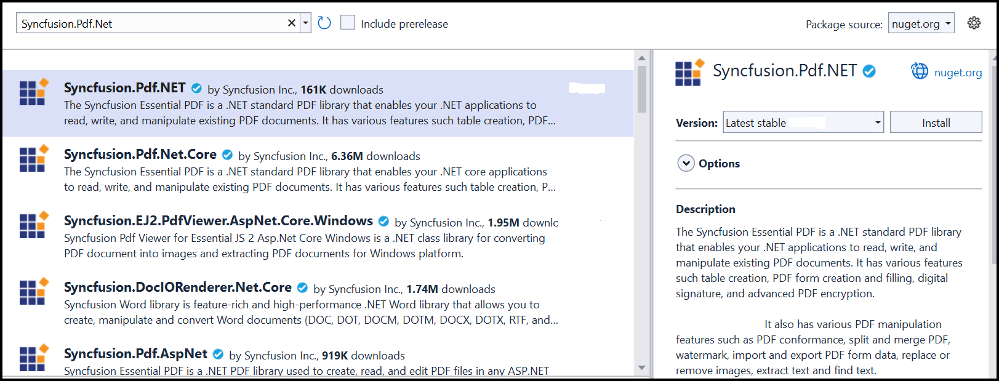

# Open and Save PDF documents in .NET MAUI

The Syncfusion&reg; [.NET MAUI PDF library](https://www.syncfusion.com/document-processing/pdf-framework/maui/pdf-library) is used to create, read, and edit PDF documents programatically without the dependency on Adobe Acrobat. Using this library, you can **open and save a PDF document in .NET MAUI**.

**Prerequisites:**
To create .NET Multi-platform App UI (.NET MAUI) apps, you need the latest versions of Visual Studio 2022 and .NET 6. For more details, refer [here](https://learn.microsoft.com/en-us/dotnet/maui/get-started/installation?view=net-maui-7.0&tabs=vswin).

## Steps to open and save PDF documents programmatically in .NET MAUI

N> Our PDF library is currently supported in .NET MAUI applications on the Android, iOS, and Windows platforms. Currently, the PDF library is not supported in the Mac Catalyst platform.

Step 1: Create a new C# .NET MAUI app. Select **.NET MAUI App (Preview)** from the template and click the **Next** button.

Step 2: Enter the project name and click **Create**.

Step 3: Install the [Syncfusion.Pdf.NET](https://www.nuget.org/packages/Syncfusion.Pdf.NET) NuGet package as a reference to your project from [NuGet.org](https://www.nuget.org/).

N> Starting with v16.2.0.x, if you reference Syncfusion&reg; assemblies from the trial setup or from the NuGet feed, you also have to add the "Syncfusion.Licensing" assembly reference and include a license key in your projects. Please refer to this [link](https://help.syncfusion.com/common/essential-studio/licensing/overview) to know about registering a Syncfusion&reg; license key in your application to use our components.

Step 4: Add a new button to the **MainPage.xaml** as shown in the following.




<ContentPage xmlns="http://schemas.microsoft.com/dotnet/2021/maui"
             xmlns:x="http://schemas.microsoft.com/winfx/2009/xaml"
             x:Class="Load_and_Save_PDF_MAUI.MainPage">

    <ScrollView>
        <Button
                x:Name="Btn"
                Text="Create PDF"
                FontAttributes="Bold"
                Grid.Row="3"
                Clicked="ButtonClick"
                HorizontalOptions="Center"
                VerticalOptions="Center"/>
    </ScrollView>

</ContentPage>




Step 5: Include the following namespaces in the **MainPage.xaml.cs** file.




using Syncfusion.Pdf.Graphics;
using Syncfusion.Pdf.Grid;
using Syncfusion.Pdf.Parsing;
using Syncfusion.Pdf;
using Syncfusion.Drawing;




Step 6: Add a new action method **OpenAndSaveDocument** in the MainPage.xaml.cs and include the below code sample to **open an existing PDF document in .NET MAUI**.




//Open an existing PDF document.
Assembly assembly = typeof(MainPage).GetTypeInfo().Assembly;
string basePath = "Load_and_Save_PDF_MAUI.Resources.Data.";
Stream inputStream = assembly.GetManifestResourceStream(basePath + "Input.pdf");
PdfLoadedDocument document = new PdfLoadedDocument(inputStream);




Step 7: Add the following code example to add paragraph and table to the PDF document.




//Get the first page from a document.
PdfLoadedPage page = document.Pages[0] as PdfLoadedPage;
//Create PDF graphics for the page.
PdfGraphics graphics = page.Graphics;
//Create a PdfGrid.
PdfGrid pdfGrid = new PdfGrid();

//Add values to the list.
List<object> data = new List<object>();
Object row1 = new { Product_ID = "1001", Product_Name = "Bicycle", Price = "10,000" };
Object row2 = new { Product_ID = "1002", Product_Name = "Head Light", Price = "3,000" };
Object row3 = new { Product_ID = "1003", Product_Name = "Break wire", Price = "1,500" };
data.Add(row1);
data.Add(row2);
data.Add(row3);

//Add list to IEnumerable.
IEnumerable<object> dataTable = data;
//Assign data source.
pdfGrid.DataSource = dataTable;
//Apply built-in table style.
pdfGrid.ApplyBuiltinStyle(PdfGridBuiltinStyle.GridTable4Accent3);
//Draw the grid to the page of PDF document.
pdfGrid.Draw(graphics, new RectangleF(40, 400, page.Size.Width - 80, 0));




Step 8: Add the following code example to **save the PDF document in .NET MAUI**.




//Saves the PDF to the memory stream.
using MemoryStream ms = new();
document.Save(ms);
//Close the PDF document
document.Close(true);
ms.Position = 0;
//Saves the memory stream as file.
SaveService saveService = new();
saveService.SaveAndView("Result.pdf", "application/pdf", ms);




A complete working sample can be downloaded from [Github](https://github.com/SyncfusionExamples/PDF-Examples/tree/master/Open%20and%20Save%20PDF%20document/.NET%20MAUI/Load_and_Save_PDF_MAUI).

By executing the program, you will get the **PDF document** as follows.

## Helper files for .NET MAUI

Download the helper files from this [link](https://www.syncfusion.com/downloads/support/directtrac/general/ze/Helper_files-1664336865?_ga=2.61942826.782463986.1686541355-97077949.1681102104) and add them to the mentioned project. These helper files allow you to save the stream as a physical file and open the file for viewing.

<table>
  <tr>
  <td>
    <b>Folder Name</b>
  </td>
  <td>
    <b>File Name</b>
  </td>
  <td>
    <b>Summary</b>
  </td>
  </tr>
  <tr>
  <td>
    .NET MAUI Project
  </td>
  <td>
    SaveService.cs
  </td>
  <td>Represent the base class for save operation.
  </td>
  </tr>
  <tr>
  <td>
    Windows
  </td>
  <td>
    SaveWindows.cs
  </td>
  <td>Save implementation for Windows.
  </td>
  </tr>
  <tr>
  <td>
    Android
  </td>
  <td>
    SaveAndroid.cs
  </td>
  <td>Save implementation for Android device.
  </td>
  </tr>
  <tr>
  <td>
    Mac Catalyst
  </td>
  <td>
    SaveMac.cs
  </td>
  <td>Save implementation for Mac Catalyst device.
  </td>
  </tr>
  <tr>
  <td rowspan="2">
    iOS
  </td>
  <td>
    SaveIOS.cs
  </td>
  <td>
    Save implementation for iOS device
  </td>
  </tr>
  <tr>
  <td>
    PreviewControllerDS.cs QLPreviewItemFileSystem.cs
  </td>
  <td>
    Helper classes for viewing the <b>PDF document</b> in iOS device
  </td>
  </tr>
</table>

Click [here](https://www.syncfusion.com/document-processing/pdf-framework/maui) to explore the rich set of Syncfusion&reg; PDF library features.

