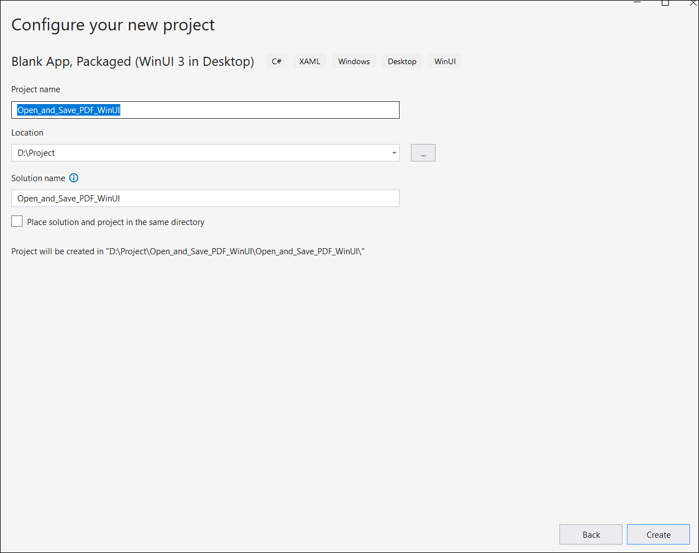

# Open and Save PDF document in WinUI

The Syncfusion&reg; [WinUI PDF Library](https://www.syncfusion.com/document-processing/pdf-framework/winui/pdf-library) is used to create, read, and edit Word documents programmatically without the dependency on Adobe Acrobat. Using this library, you can **open and save a PDF document in WinUI**.

**Prerequisites:**
To use the WinUI 3 project templates, install the Windows App SDK extension for Visual Studio. For more details, refer [here](https://learn.microsoft.com/en-us/windows/apps/windows-app-sdk/set-up-your-development-environment?tabs=cs-vs-community%2Ccpp-vs-community%2Cvs-2022-17-1-a%2Cvs-2022-17-1-b).

## Steps to open and save PDF document programmatically in WinUI Desktop app

Step 1: Create a new C# WinUI Desktop app. Select Blank App, Packaged with WAP (WinUI 3 in Desktop) from the template and click the **Next** button.

Step 2: Enter the project name and click **Create**.

Step 3: Set the Target version to Windows 10, version 2004 (build 19041) and the Minimum version to Windows 10, version 1809 (build 17763) and then click **OK**.

Step 4: Install the [Syncfusion.Pdf.Net](https://www.nuget.org/packages/Syncfusion.Pdf.NET/) NuGet package as a reference to your project from the [NuGet.org](https://www.nuget.org/).

N> Starting with v16.2.0.x, if you reference Syncfusion&reg; assemblies from trial setup or from the NuGet feed, you also have to add "Syncfusion.Licensing" assembly reference and include a license key in your projects. Please refer to this [link](https://help.syncfusion.com/common/essential-studio/licensing/overview) to know about registering a Syncfusion&reg; license key in your application to use our components.

Step 5: Add a new button to the **MainWindow.xaml** as shown below.




<Window
    x:Class="Load_and_Save_PDF_WinUI_Desktop.MainWindow"
    xmlns="http://schemas.microsoft.com/winfx/2006/xaml/presentation"
    xmlns:x="http://schemas.microsoft.com/winfx/2006/xaml"
    xmlns:local="using:Load_and_Save_PDF_WinUI_Desktop"
    xmlns:d="http://schemas.microsoft.com/expression/blend/2008"
    xmlns:mc="http://schemas.openxmlformats.org/markup-compatibility/2006"
    mc:Ignorable="d">

    <StackPanel Orientation="Horizontal" HorizontalAlignment="Center" VerticalAlignment="Center">
        <Button x:Name="button" Click="myButton_Click">Create PDF</Button>
    </StackPanel>
</Window>




Step 6: Include the following namespaces in the **MainWindow.xaml.cs** file.




using Syncfusion.Pdf;
using Syncfusion.Pdf.Graphics;
using Syncfusion.Pdf.Grid;
using Syncfusion.Drawing;
using System.Reflection;
using System.Xml.Linq;




Step 7: Add a new action method **OpenAndSaveDocument** in the MainWindow.xaml.cs and include the below code sample to **open an existing PDF document in the WinUI Desktop app**.




private void OnButtonClicked(object sender, RoutedEventArgs e)
{
    //Open an existing PDF document.
    Assembly assembly = typeof(MainWindow).GetTypeInfo().Assembly;
    string basePath = "Load_and_Save_PDF_WinUI_Desktop.Assets.";
    Stream inputStream = assembly.GetManifestResourceStream(basePath + "Input.pdf");
    PdfLoadedDocument document = new PdfLoadedDocument(inputStream);
}




Step 8: Add the following code example to add paragraph and table to the PDF document.




//Get the first page from a document.
PdfLoadedPage page = document.Pages[0] as PdfLoadedPage;
//Create PDF graphics for the page.
PdfGraphics graphics = page.Graphics;
//Create a PdfGrid.
PdfGrid pdfGrid = new PdfGrid();

//Add values to the list.
List<object> data = new List<object>();
Object row1 = new { Product_ID = "1001", Product_Name = "Bicycle", Price = "10,000" };
Object row2 = new { Product_ID = "1002", Product_Name = "Head Light", Price = "3,000" };
Object row3 = new { Product_ID = "1003", Product_Name = "Break wire", Price = "1,500" };
data.Add(row1);
data.Add(row2);
data.Add(row3);

//Add list to IEnumerable.
IEnumerable<object> dataTable = data;
//Assign data source.
pdfGrid.DataSource = dataTable;
//Apply built-in table style.
pdfGrid.ApplyBuiltinStyle(PdfGridBuiltinStyle.GridTable4Accent3);
//Draw the grid to the page of PDF document.
pdfGrid.Draw(graphics, new RectangleF(40, 400, page.Size.Width - 80, 0));




Step 9: Add below code example to **save the PDF document in the WinUI Desktop app**. 




//Give file path
filePath = "D://Result.pdf"; 
//Create a FileStream to save the PDF document.
using (FileStream outputStream = new FileStream(filePath, FileMode.Create, FileAccess.ReadWrite))
{
//Save the PDF file.
document.Save(outputStream);
}




A complete working sample can be downloaded from [Github](https://github.com/SyncfusionExamples/PDF-Examples/tree/master/Open%20and%20Save%20PDF%20document/WinUI/Load_and_Save_PDF_WinUI_Desktop).

By executing the program, you will get the **PDF document** as follows.

Click [here](https://www.syncfusion.com/document-processing/pdf-framework/winui) to explore the rich set of Syncfusion&reg; PDF library features.