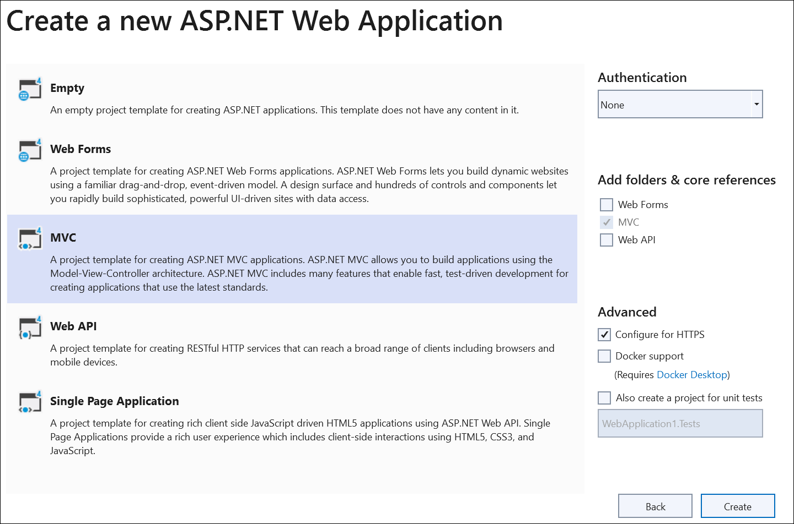
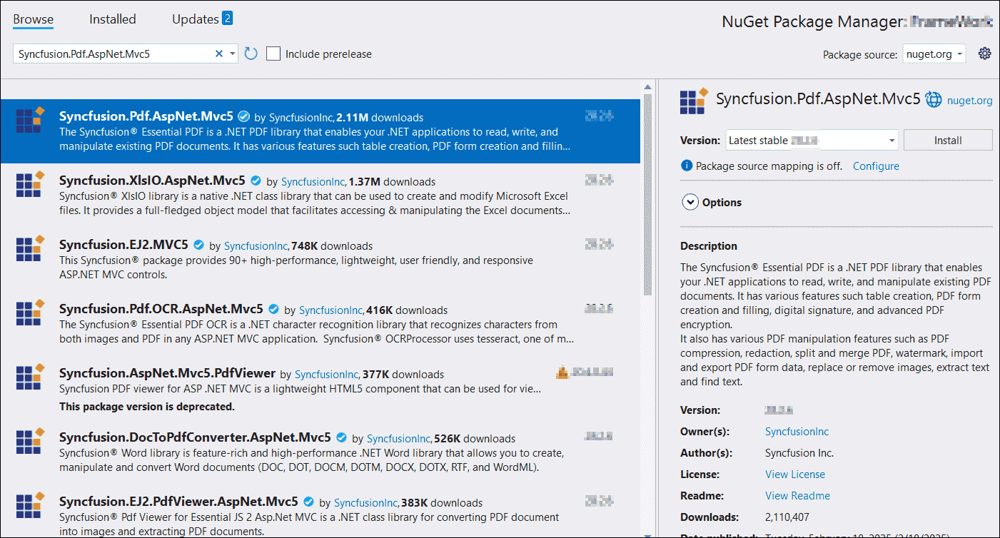

# Open and save PDF document in ASP.NET MVC 

The [Syncfusion&reg; .NET PDF library](https://www.syncfusion.com/document-processing/pdf-framework/net) is used to create, read, and edit PDF documents programatically without the dependency of Adobe Acrobat. Using this library, you can **open and save PDF document in ASP.NET MVC**. 

## Steps to open and save PDF document programatically:

Step 1: Create a new ASP.NET MVC application project.

Step 2: Install the [Syncfusion.Pdf.AspNet.Mvc5](https://www.nuget.org/packages/Syncfusion.Pdf.AspNet.Mvc5/) NuGet package as a reference to your ASP.NET MVC application using [NuGet.org](https://www.nuget.org/).

N> Starting with v16.2.0.x, if you reference Syncfusion&reg; assemblies from trial setup or from the NuGet feed, you also have to add "Syncfusion.Licensing" assembly reference and include a license key in your projects. Please refer to this [link](https://help.syncfusion.com/common/essential-studio/licensing/overview) to know about registering Syncfusion&reg; license key in your application to use our components.

Step 3: Include the following namespace in that HomeController.cs file.





using Syncfusion.Pdf;
using Syncfusion.Pdf.Graphics;
using Syncfusion.Pdf.Grid;
using Syncfusion.Pdf.Parsing;





Step 4: A default action method named **Index** will be present in the HomeController.cs. Right click on this action method and select **Go To View** where you will be directed to its associated view page **Index.cshtml**.

Step 5: Add a new button in the Index.cshtml as shown in the follwoing.





@{Html.BeginForm("OpenAndSaveDocument", "Home", FormMethod.Get);
    {
        

            <input type="submit" value="Open and Save Document" style="width:180px;height:27px" />
        

    }
    Html.EndForm();
}





Step 6: Add a new action method **OpenAndSaveDocument** in HomeController.cs.

Step 7: Add below code example to **open an existing PDF document in ASP.NET MVC**.





//Load an existing PDF document.
PdfLoadedDocument document = new PdfLoadedDocument("Input.pdf");





Step 8: Add the below code example to add a table in the PDF document.





//Create a PdfGrid.
PdfGrid pdfGrid = new PdfGrid();
//Add values to the list.
List<object> data = new List<object>();
Object row1 = new { Product_ID = "1001", Product_Name = "Bicycle", Price = "10,000" };
Object row2 = new { Product_ID = "1002", Product_Name = "Head Light", Price = "3,000" };
Object row3 = new { Product_ID = "1003", Product_Name = "Break wire", Price = "1,500" };
data.Add(row1);
data.Add(row2);
data.Add(row3);
//Add list to IEnumerable.
IEnumerable<object> dataTable = data;

//Assign data source.
pdfGrid.DataSource = dataTable;
//Apply built-in table style.
pdfGrid.ApplyBuiltinStyle(PdfGridBuiltinStyle.GridTable4Accent3);
//Draw the grid to the page of PDF document.
pdfGrid.Draw(graphics, new RectangleF(40, 400, page.Size.Width - 80, 0));





Step 9: Add below code example to **save the PDF document in ASP.NET MVC**.





//Save the PDF document and download as attachment.
document.Save("Output.pdf", HttpContext.ApplicationInstance.Response, HttpReadType.Save);





You can download a complete working sample from [GitHub](https://github.com/SyncfusionExamples/PDF-Examples/tree/master/Open%20and%20Save%20PDF%20document/ASP.NET%20MVC/Load_and_save_PDF_document_MVC).

By executing the program, you will get the **PDF document** as follows.

Click [here](https://www.syncfusion.com/document-processing/pdf-framework/net) to explore the rich set of Syncfusion&reg; PDF library features.