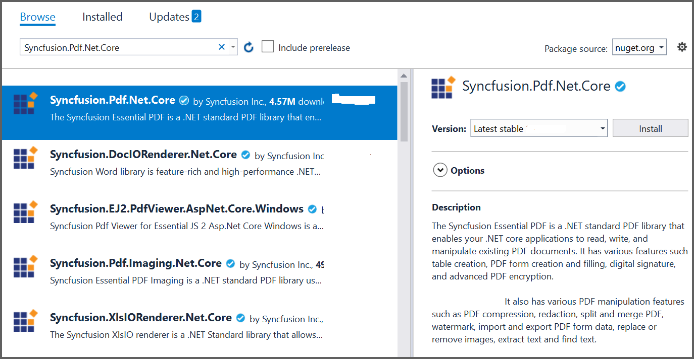
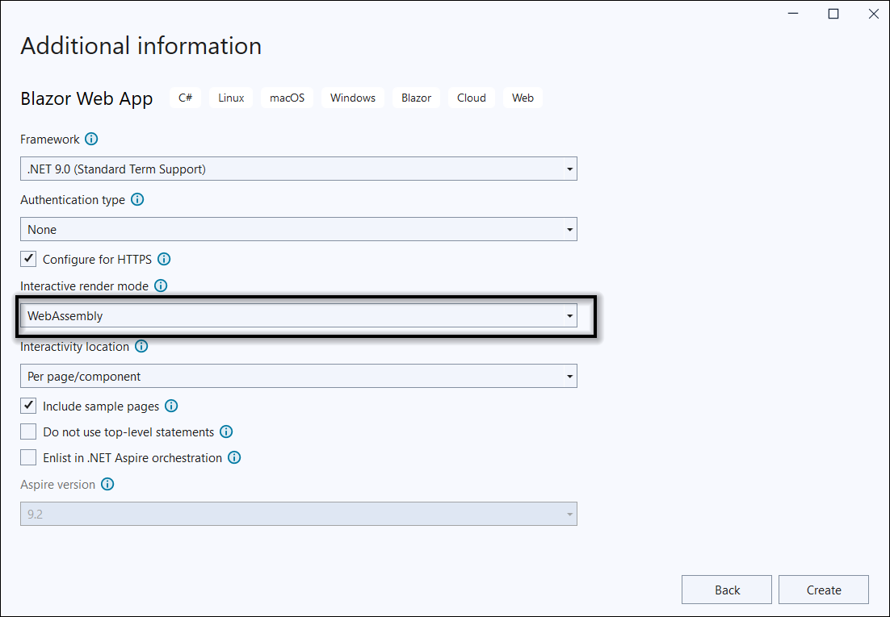

# Open and save PDF document in Blazor

The [Syncfusion&reg; Blazor PDF library](https://www.syncfusion.com/document-processing/pdf-framework/blazor) creates, reads, and edits PDF documents programmatically without the dependency of Adobe Acrobat. Using this library, **open and save PDF documents in ASP.NET Core**.

**Prerequisites:**

* Visual Studio 2022 or later
* Install the [.NET 8 SDK](https://dotnet.microsoft.com/en-us/download/dotnet/8.0) or later

## Server app

Step 1: Create a new C# Blazor server-side application project. Select **Blazor Web App** from the template and click the Next button.

Step 2: In the **Interactive Render Mode section**, choose `Server` as the render mode. Then, click the `Create` button to generate a new Blazor Server-Side Application.

Step 3: To **open and save a PDF document in Blazor Server app**, install [Syncfusion.Pdf.Net.Core](https://www.nuget.org/packages/Syncfusion.pdf.Net.Core) to the Blazor project.

N> Starting with v16.2.0.x, if referencing Syncfusion&reg; assemblies from trial setup or from the NuGet feed, add "Syncfusion.Licensing" assembly reference and include a license key in projects. Refer to this [link](https://help.syncfusion.com/common/essential-studio/licensing/overview) to learn about registering Syncfusion&reg; license key in applications to use the components.

Step 4: Inject ExportService into `FetchData.razor` using the following code.




@inject ExportService service
@inject Microsoft.JSInterop.IJSRuntime JS
@using System.IO




Step 5: Create a button in the `FetchData.razor` using the following code.





<button class="btn btn-primary" @onclick="@LoadAndSave">Load and save PDF document</button>





Step 6: Add the `LoadAndSavePDF` method in `FetchData.razor` page to call the export service.




protected async Task LoadAndSave()
{
    using (MemoryStream memoryStream = ExportService.LoadAndSavePDF(forecasts))
    {
        await JS.SaveAs("Sample.pdf", memoryStream.ToArray());
    }
}




Step 7: Create a new cs file named `ExportService` under `Data` folder and include the following namespaces in the file.





using Syncfusion.Pdf;
using Syncfusion.Pdf.Graphics;
using Syncfusion.Pdf.Grid;
using Syncfusion.Drawing;
using Syncfusion.Pdf.Parsing;
using System.IO;





Step 8: Register the service in the `ConfigureServices` method available in the `Startup.cs` class as follows.





public void ConfigureServices(IServiceCollection services)
{
    services.AddRazorPages();
    services.AddServerSideBlazor();
    services.AddSingleton<WeatherForecastService>();
    services.AddSingleton<ExportService>();
}





Step 9: Create a new MemoryStream method with name as **LoadAndSavePDF** in **ExportService** class and include the following code snippet to **open an existing PDF document in Blazor** Server app.





public static MemoryStream LoadAndSavePDF()
{
    //Open an existing PDF document
    FileStream fileStream = new FileStream("Input.pdf", System.IO.FileMode.Open, System.IO.FileAccess.Read);
    PdfLoadedDocument document = new PdfLoadedDocument(fileStream);    
}




Step 10: Add below code example to add a table in PDF document. 





//Create a PdfGrid
PdfGrid pdfGrid = new PdfGrid();
//Add values to the list
List<object> data = new List<object>();
Object row1 = new { Product_ID = "1001", Product_Name = "Bicycle", Price = "10,000" };
Object row2 = new { Product_ID = "1002", Product_Name = "Head Light", Price = "3,000" };
Object row3 = new { Product_ID = "1003", Product_Name = "Break wire", Price = "1,500" };
data.Add(row1);
data.Add(row2);
data.Add(row3);
//Add list to IEnumerable
IEnumerable<object> dataTable = data;
//Assign data source
pdfGrid.DataSource = dataTable;
//Apply built-in table style
pdfGrid.ApplyBuiltinStyle(PdfGridBuiltinStyle.GridTable4Accent3);
//Draw the grid to the page of PDF document
pdfGrid.Draw(graphics, new RectangleF(40, 400, loadedPage.Size.Width - 80, 0));





Step 11: Add the below code example to save the PDF document in Blazor server application. 





//Create memory stream. 
using (MemoryStream stream = new MemoryStream())
{
    //Saving the PDF document into the stream
    document.Save(stream);
    //Closing the PDF document
    document.Close(true);
}





Step 12: Create a class file with `FileUtil` name and add the following code to invoke the JavaScript action to download the file in the browser.





public static class FileUtil
{
    public static ValueTask<object> SaveAs(this IJSRuntime js, string filename, byte[] data)
   => js.InvokeAsync<object>(
       "saveAsFile",
       filename,
       Convert.ToBase64String(data));
}





Step 13: Add the following JavaScript function in the `_Host.cshtml` available under the `Pages` folder.









You can download a complete working sample from [GitHub](https://github.com/SyncfusionExamples/PDF-Examples/tree/master/Open%20and%20Save%20PDF%20document/Blazor/ServerSideApplication).A complete working sample is available from [GitHub](https://github.com/SyncfusionExamples/PDF-Examples/tree/master/Open%20and%20Save%20PDF%20document/Blazor/ServerSideApplication).
The following output appears after executing the program.

Click [here](https://www.syncfusion.com/document-processing/pdf-framework/blazor) to explore the rich set of Syncfusion&reg; PDF library features.

## WASM app 

Step 1: Create a new C# Blazor server-side application project. Select **Blazor Web App** from the template and click the Next button.

Step 2: In the **Interactive Render Mode section**, choose `WebAssembly` as the render mode. Then, click the `Create` button to generate a new Blazor client-Side Application.

Step 3: Install the [Syncfusion.PDF.Net.Core](https://www.nuget.org/packages/Syncfusion.pdf.Net.Core) NuGet package as a reference to the Blazor application from [NuGet.org](https://www.nuget.org/).
  

Step 4: Include the following namespaces in the `FetchData.razor` file.





@using Syncfusion.Pdf 
@using Syncfusion.Pdf.Grid
@using Syncfusion.Pdf.Graphics
@using Syncfusion.Drawing
@using Syncfusion.Pdf.Parsing





Step 5: Create a button in the `FetchData.razor` using the following code.





<button class="btn btn-primary" @onclick="@LoadAndSavePDF">Export to PDF</button>





Step 6: Create a new async method with name as `LoadAndSavePDF` and include the following code snippet to **open an existing PDF document in Blazor** WASM app.





@functions {
    public async void LoadAndSavePDF()
    {
        //Load an existing PDF document.
        PdfLoadedDocument document = new PdfLoadedDocument(inputstream);
    }
}





Step 7: Add the below code example to add table in the PDF document. 





//Create a PdfGrid
PdfGrid pdfGrid = new PdfGrid();
//Add values to the list
List<object> data = new List<object>();
Object row1 = new { Product_ID = "1001", Product_Name = "Bicycle", Price = "10,000" };
Object row2 = new { Product_ID = "1002", Product_Name = "Head Light", Price = "3,000" };
Object row3 = new { Product_ID = "1003", Product_Name = "Break wire", Price = "1,500" };
data.Add(row1);
data.Add(row2);
data.Add(row3);
//Add list to IEnumerable
IEnumerable<object> dataTable = data;
//Assign data source
pdfGrid.DataSource = dataTable;
//Apply built-in table style
pdfGrid.ApplyBuiltinStyle(PdfGridBuiltinStyle.GridTable4Accent3);
//Draw the grid to the page of PDF document
pdfGrid.Draw(graphics, new RectangleF(40, 400, loadedPage.Size.Width - 80, 0));





Step 8: Add below code example to **save the PDF document in Blazor**.





//Save the PDF document.
MemoryStream memoryStream = new MemoryStream();
document.Save(memoryStream);
//Close the document.
document.Close();
//Download the PDF document
await JS.SaveAs("Sample.pdf", memoryStream.ToArray());





Step 9: Create a class file with `FileUtil` name and add the following code to invoke the JavaScript action to download the file in the browser. 





public static class FileUtil
{
    public static ValueTask<object> SaveAs(this IJSRuntime js, string filename, byte[] data)
  => js.InvokeAsync<object>(
      "saveAsFile",
      filename,
      Convert.ToBase64String(data));
}





Step 10: Add the following JavaScript function in the `index.html` available under the wwwroot folder. 









A complete working sample is available from [GitHub](https://github.com/SyncfusionExamples/PDF-Examples/tree/master/Open%20and%20Save%20PDF%20document/Blazor/ClientSideApplication).

The following output appears after executing the program.

N> Even though PDF library works in WASM app, server deployment is recommended. Since the WASM app deployment increases the application payload size.

Explore the [supported and unsupported features of PDF library in Blazor](https://www.syncfusion.com/document-processing/pdf-framework/blazor/pdf-library).

Click [here](https://www.syncfusion.com/document-processing/pdf-framework/blazor) to explore the rich set of Syncfusion&reg; PDF library features.