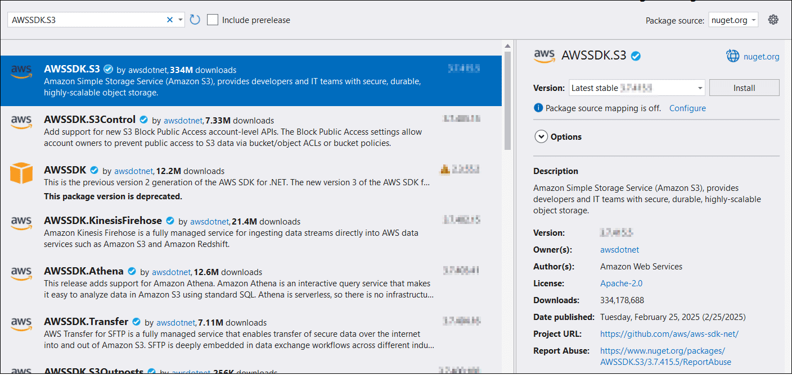

# Open PDF file from AWS S3

To load a PDF file from AWS S3, follow these steps:

Step 1: Create a simple console application.

Step 2: Install the [Syncfusion.Pdf.Net.Core](https://www.nuget.org/packages/Syncfusion.Pdf.Net.Core) NuGet package as a reference to your project from [NuGet.org](https://www.nuget.org/).

Step 3: Install the [AWSSDK.S3](https://www.nuget.org/packages/AWSSDK.S3) NuGet package as a reference to your project from the [NuGet.org](https://www.nuget.org/).

Step 4: Include the following namespaces in the Program.cs file.




using Amazon;
using Amazon.S3;
using Amazon.S3.Transfer;
using Syncfusion.Pdf;
using Syncfusion.Pdf.Parsing;
using System.IO;




Step 5: Add the below code example to load a PDF from AWS S3.




// Set your AWS credentials and region.
string accessKey = "YOUR_ACCESS_KEY";
string secretKey = "YOUR_SECRET_KEY";
// Change to your desired region.
RegionEndpoint region = RegionEndpoint.YOUR_REGION;

// Specify the bucket name and object key.
string bucketName = "YOUR_BUCKET_NAME";
string objectKey = "YOUR_OBJECT_KEY";

// Download the PDF from S3 to a local file.
string localFilePath = "Output.pdf";
using (var s3Client = new AmazonS3Client(accessKey, secretKey, region))
{
    using (var transferUtility = new TransferUtility(s3Client))
    {
        transferUtility.Download(localFilePath, bucketName, objectKey);
    }
}

// Load the downloaded PDF using Syncfusion.
using (FileStream fileStream = new FileStream(localFilePath, FileMode.Open, FileAccess.Read))
{
    PdfLoadedDocument loadedDocument = new PdfLoadedDocument(fileStream);
    // Use the loadedDocument for further processing (e.g., extracting text or images).
    // Remember to dispose of the loadedDocument when you are done.
    loadedDocument.Close(true);
}





You can download a complete working sample from [GitHub](https://github.com/SyncfusionExamples/PDF-Examples/tree/master/Open-PDF-file/To%20AWS%20S3).
