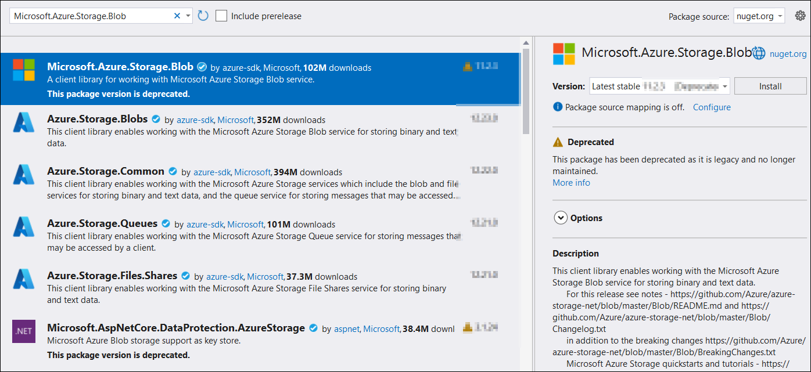

# Open PDF document from Azure Blob Storage

To load a PDF file from Azure Blob Storage, follow these steps:

Step 1: Create a simple console application.

Step 2: Install the [Syncfusion.Pdf.Net.Core](https://www.nuget.org/packages/Syncfusion.Pdf.Net.Core) NuGet package as a reference to your project from [NuGet.org](https://www.nuget.org/).

Step 3: Install the [Microsoft.Azure.Storage.Blob](https://www.nuget.org/packages/Microsoft.Azure.Storage.Blob) NuGet package as a reference to your project from the [NuGet.org](https://www.nuget.org/).

Step 4: Include the following namespaces in the Program.cs file.





using Microsoft.Azure.Storage;
using Microsoft.Azure.Storage.Blob;
using Syncfusion.Pdf;
using Syncfusion.Pdf.Parsing;
using System.IO;





Step 5: Add the below code example to load a PDF from Azure blob storage.





// Parse the connection string to your Azure Storage Account.
CloudStorageAccount storageAccount = CloudStorageAccount.Parse(connectionString);

// Create a client to interact with Blob storage.
CloudBlobClient blobClient = storageAccount.CreateCloudBlobClient();

// Get a reference to the container.
CloudBlobContainer container = blobClient.GetContainerReference(containerName);

// Get a reference to the block blob.
CloudBlockBlob blockBlob = container.GetBlockBlobReference(blobName);

// Download the blob's content to a file stream.
string localFilePath = "Sample.pdf";
using (var fileStream = File.OpenWrite(localFilePath))
{
    blockBlob.DownloadToStream(fileStream);
}

// Load the downloaded PDF using Syncfusion.
using (FileStream fileStream = new FileStream(localFilePath, FileMode.Open, FileAccess.Read))
{
    PdfLoadedDocument loadedDocument = new PdfLoadedDocument(fileStream);
    // Use the loadedDocument for further processing (e.g., extracting text or images).
    // Remember to dispose of the loadedDocument when you are done.
    loadedDocument.Close(true);
}





You can download a complete working sample from [GitHub](https://github.com/SyncfusionExamples/PDF-Examples/tree/master/Open-PDF-file/To%20Azure%20Blob%20Storage).
