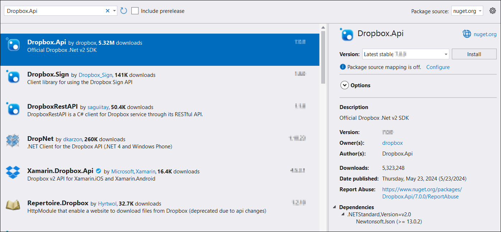

# Open PDF file from Dropbox cloud file storage

To open a PDF file from Dropbox cloud file storage, follow the steps below.

Step 1: Create a Dropbox API app

To create a Dropbox API App, follow the official documentation provided by Dropbox at this [link](https://www.dropbox.com/developers/documentation/dotnet#tutorial). The process involves visiting the Dropbox Developer website and using their App Console to set up your API app. This app will allow you to interact with Dropbox programmatically, enabling secure access to files and data.

Step 2: Create a simple console application.

Step 3: Install the [Syncfusion.Pdf.Net.Core](https://www.nuget.org/packages/Syncfusion.Pdf.Net.Core) NuGet package as a reference to your project from [NuGet.org](https://www.nuget.org/).

Step 4: Install the [Dropbox.Api](https://www.nuget.org/packages/Dropbox.Api) NuGet package as a reference to your project from the [NuGet.org](https://www.nuget.org/).

Step 5: Include the following namespaces in the Program.cs file.




using Dropbox.Api;
using Syncfusion.Pdf;
using Syncfusion.Pdf.Parsing;
using System.IO;




Step 5: Add the below code example to load a PDF from Dropbox cloud file storage.




// Define the access token for authentication with the Dropbox API.
// Replace with your actual access token.
var accessToken = "YOUR_ACCESS_TOKEN";

// Define the file path in Dropbox where the PDF file is located.
// Replace with the actual file path in Dropbox.
var filePathInDropbox = "/path/to/Sample.pdf";

string localFilePath = "Output.pdf";
// Create a new DropboxClient instance using the provided access token.
using (var dbx = new DropboxClient(accessToken))
{
    // Start a download request for the specified file in Dropbox.
    using (var response = await dbx.Files.DownloadAsync(filePathInDropbox))
    {
        // Get the content of the downloaded file as a stream.
        var content = await response.GetContentAsStreamAsync();
        // Create a new file stream to save the downloaded content locally.
        using (var fileStream = File.Create(localFilePath))
        {
            // Copy the content stream to the file stream.
            content.CopyTo(fileStream);
        }
    }
}

// Load the downloaded PDF using Syncfusion.
using (FileStream fileStream = new FileStream(localFilePath, FileMode.Open, FileAccess.Read))
{
    PdfLoadedDocument loadedDocument = new PdfLoadedDocument(fileStream);
    // Use the loadedDocument for further processing (e.g., extracting text or images).
    // Remember to dispose of the loadedDocument when you are done.
    loadedDocument.Close(true);
}




You can download a complete working sample from [GitHub](https://github.com/SyncfusionExamples/PDF-Examples/tree/master/Open-PDF-file/To%20Dropbox%20Cloud%20Storage).
