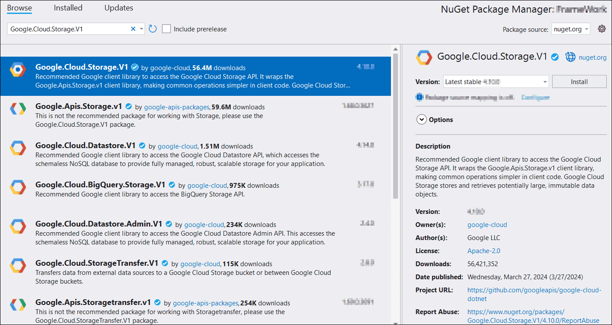

# Open PDF file from Google Cloud Storage

To open a PDF file from Google Cloud Storage, follow these steps:

Step 1: Create a simple console application.

Step 2: Install the [Syncfusion.Pdf.Net.Core](https://www.nuget.org/packages/Syncfusion.Pdf.Net.Core) NuGet package as a reference to your project from [NuGet.org](https://www.nuget.org/).

Step 3: Install the [Google.Cloud.Storage.V1](https://www.nuget.org/packages/Google.Cloud.Storage.V1) NuGet package as a reference to your project from the [NuGet.org](https://www.nuget.org/).

Step 4: Include the following namespaces in the Program.cs file.




using Google.Cloud.Storage.V1;
using Google.Apis.Auth.OAuth2;
using Syncfusion.Pdf;
using Syncfusion.Pdf.Parsing;
using System.IO;




Step 5: Add the below code example to create a simple PDF and save in Google cloud storage.




// Load the credentials file.
GoogleCredential credential = GoogleCredential.FromFile("credentials.json");
// Create a storage client.
StorageClient storage = StorageClient.Create(credential);

// Download the PDF from Google Cloud Storage into a memory stream.
using (MemoryStream stream = new MemoryStream())
{
    storage.DownloadObject("YOUR_BUCKET_NAME", "Sample.pdf", stream);
    stream.Position = 0;

    // Load the downloaded PDF using Syncfusion.
    PdfLoadedDocument loadedDocument = new PdfLoadedDocument(stream);
    // Use the loadedDocument for further processing (e.g., extracting text or images).
    // Remember to dispose of the loadedDocument when you are done.
    loadedDocument.Close(true);
}




You can download a complete working sample from [GitHub](https://github.com/SyncfusionExamples/PDF-Examples/tree/master/Open-PDF-file/To%20Google%20Cloud%20Storage).