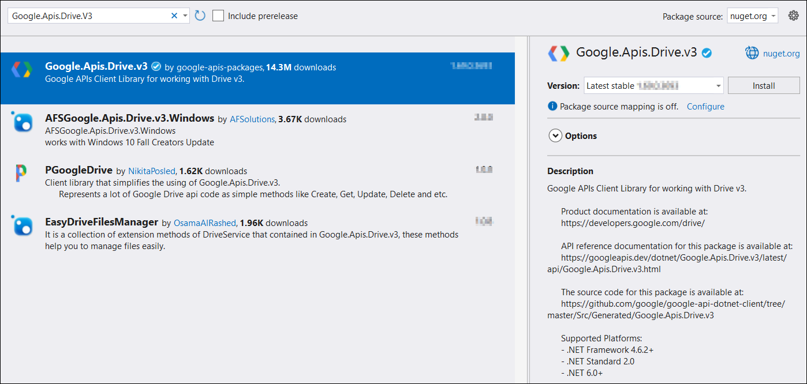

# Open PDF file from Google Drive

To open a PDF file from Google Drive, follow these steps:

Step 1: Set up the Google Drive API

You must set up a project in the Google Developers Console and enable the Google Drive API. Obtain the necessary credentials to access the API. For more information, view the official [link](https://developers.google.com/drive/api/guides/enable-sdk).

Step 2: Create a simple console application.

Step 3: Install the [Syncfusion.Pdf.Net.Core](https://www.nuget.org/packages/Syncfusion.Pdf.Net.Core) NuGet package as a reference to your project from [NuGet.org](https://www.nuget.org/).

Step 4: Install the [Google.Apis.Drive.v3](https://www.nuget.org/packages/Google.Apis.Drive.v3) NuGet package as a reference to your project from the [NuGet.org](https://www.nuget.org/).

Step 5: Include the following namespaces in the Program.cs file.




using Google.Apis.Auth.OAuth2;
using Google.Apis.Drive.v3;
using Google.Apis.Services;
using Google.Apis.Util.Store;
using Syncfusion.Pdf;
using Syncfusion.Pdf.Parsing;
using System.IO;




Step 5: Add the below code example to open a PDF from google drive.




// Step 1: Authenticate using the credentials JSON file.
UserCredential credential;
string[] Scopes = { DriveService.Scope.DriveReadonly };
string ApplicationName = "YourAppName";

using (var stream1 = new FileStream("credentials.json", FileMode.Open, FileAccess.Read))
{
    string credPath = "token.json";
    credential = GoogleWebAuthorizationBroker.AuthorizeAsync(
        GoogleClientSecrets.Load(stream1).Secrets,
        Scopes,
        "user",
        CancellationToken.None,
        new FileDataStore(credPath, true)).Result;
}

// Step 2: Create the Drive API service.
var service = new DriveService(new BaseClientService.Initializer()
{
    HttpClientInitializer = credential,
    ApplicationName = ApplicationName,
});

// Step 3: Specify the file ID of the PDF you want to open.
// Replace with the actual file ID.
string fileId = "YOUR_FILE_ID";

// Step 4: Download the PDF file from Google Drive.
var request = service.Files.Get(fileId);
var stream = new MemoryStream();
request.Download(stream);
stream.Position = 0;

// Step 5: Open the PDF with Syncfusion.
PdfLoadedDocument loadedDocument = new PdfLoadedDocument(stream);
// Use the loadedDocument for further processing (e.g., extracting text or images).
// Remember to dispose of the loadedDocument when you are done.
loadedDocument.Close(true);
   



You can download a complete working sample from [GitHub](https://github.com/SyncfusionExamples/PDF-Examples/tree/master/Open-PDF-file/To%20Google%20Drive).