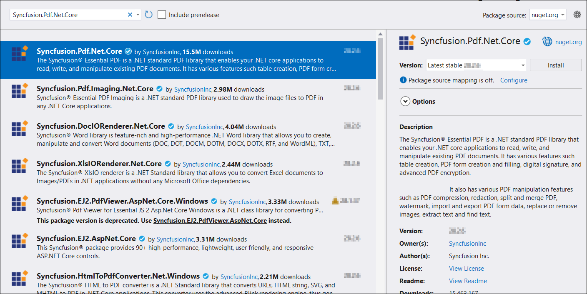

# Save PDF file to Google Cloud Storage

To save a PDF file to Google Cloud Storage, you can follow the steps below.

Step 1: Create a simple console application.

Step 2: Install the [Syncfusion.Pdf.Net.Core](https://www.nuget.org/packages/Syncfusion.Pdf.Net.Core) and [Google.Cloud.Storage.V1](https://www.nuget.org/packages/Google.Cloud.Storage.V1) NuGet packages as a reference to your project from the [NuGet.org](https://www.nuget.org/).

  

Step 4: Include the following namespaces in the Program.cs file.




using Syncfusion.Pdf;
using Google.Cloud.Storage.V1;
using Syncfusion.Pdf.Graphics;
using Google.Apis.Auth.OAuth2;
using Syncfusion.Drawing;
using System.IO;




Step 5: Add the below code example to create a simple PDF and save in Google Cloud Storage.




// Step 1: Create a PDF document.
PdfDocument document = new PdfDocument();

// Step 2: Add a page to the document.
PdfPage page = document.Pages.Add();

// Step 3: Add content to the page.
PdfGraphics graphics = page.Graphics;
graphics.DrawString("Hello, World!", new PdfStandardFont(PdfFontFamily.Helvetica, 12), PdfBrushes.Black, new PointF(10, 10));

// Step 4: Save the PDF to a memory stream.
MemoryStream stream = new MemoryStream();
document.Save(stream);
document.Close(true);
// Reset the stream position so the upload can read it from the beginning.
stream.Position = 0;

// Step 5: Upload the PDF to Google Cloud Storage.
// Load the credentials file. Replace with the path to your actual credentials.json.
GoogleCredential credential = GoogleCredential.FromFile("credentials.json");

// Create a storage client.
StorageClient storage = StorageClient.Create(credential);

// Upload the PDF to the specified bucket and object name.
storage.UploadObject("YOUR_BUCKET_NAME", "Sample.pdf", null, stream);




You can download a complete working sample from [GitHub](https://github.com/SyncfusionExamples/PDF-Examples/tree/master/Save-PDF-file/To%20Google%20Cloud%20Storage).
