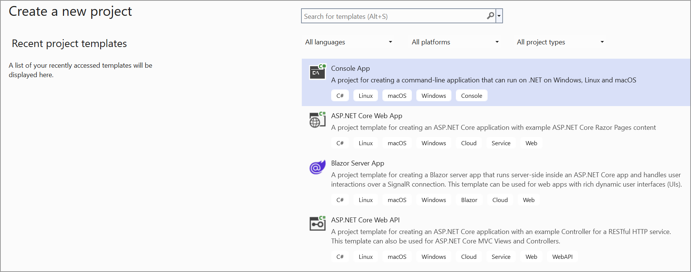
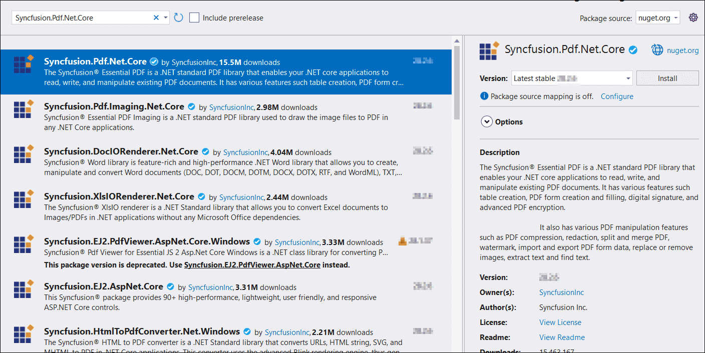

# Save PDF document to Google Drive

To save a PDF document to Google Drive, you can follow the steps below.

Step 1: Set up the Google Drive API

You must set up a project in the Google Developers Console and enable the Google Drive API. Obtain the necessary credentials to access the API. For more information, view the official [link](https://developers.google.com/drive/api/guides/enable-sdk).

Step 2: Create a simple console application.

Step 3: Install the [Syncfusion.Pdf.Net.Core](https://www.nuget.org/packages/Syncfusion.Pdf.Net.Core) and [Google.Apis.Drive.v3](https://www.nuget.org/packages/Google.Apis.Drive.v3) NuGet packages as a reference to your project from the [NuGet.org](https://www.nuget.org/).

  

Step 4: Include the following namespaces in the Program.cs file.




using Syncfusion.Pdf;
using Syncfusion.Pdf.Graphics;
using Google.Apis.Auth.OAuth2;
using Google.Apis.Drive.v3;
using Google.Apis.Services;
using Google.Apis.Util.Store;
using File = Google.Apis.Drive.v3.Data.File;
using Syncfusion.Drawing;




Step 5: Add the below code example to create a simple PDF and save in Google Drive.




// Create a new PDF document.
PdfDocument document = new PdfDocument();
// Add a new page to the document.
PdfPage page = document.Pages.Add();
// Get the graphics object for the page.
PdfGraphics graphics = page.Graphics;
// Draw text on the page.
graphics.DrawString("Hello, World!", new PdfStandardFont(PdfFontFamily.Helvetica, 12), PdfBrushes.Black, new PointF(10, 10));
// Create a memory stream to save the PDF document.
MemoryStream stream = new MemoryStream();
// Save the document to the memory stream.
document.Save(stream);
// Close the document.
document.Close(true);

// Load Google Drive API credentials from a file.
UserCredential credential;
string[] Scopes = { DriveService.Scope.Drive };
string ApplicationName = "YourAppName";

using (var stream1 = new FileStream("credentials.json", FileMode.Open, FileAccess.Read))// Replace with the path to your actual credentials.json.
{
    string credPath = "token.json";
    // Authorize the Google Drive API access.
    credential = GoogleWebAuthorizationBroker.AuthorizeAsync(
        GoogleClientSecrets.Load(stream1).Secrets,
        Scopes,
        "user",
        CancellationToken.None,
        new FileDataStore(credPath, true)).Result;
}
// Create a new instance of the Google Drive service.
var service = new DriveService(new BaseClientService.Initializer()
{
    HttpClientInitializer = credential,
    ApplicationName = ApplicationName,
});

// Create metadata for the file to be uploaded.
var fileMetadata = new File()
{
    Name = "Sample.pdf",
    MimeType = "application/pdf",
};

// Create a memory stream from the PDF document and upload it to Google Drive.
using (var fs = new MemoryStream(stream.ToArray()))
{
    // Create an upload request for Google Drive.
    FilesResource.CreateMediaUpload request = service.Files.Create(fileMetadata, fs, "application/pdf");
    // Upload the file.
    request.Upload();
}




You can download a complete working sample from [GitHub](https://github.com/SyncfusionExamples/PDF-Examples/tree/master/Save-PDF-file/To%20Google%20Drive).