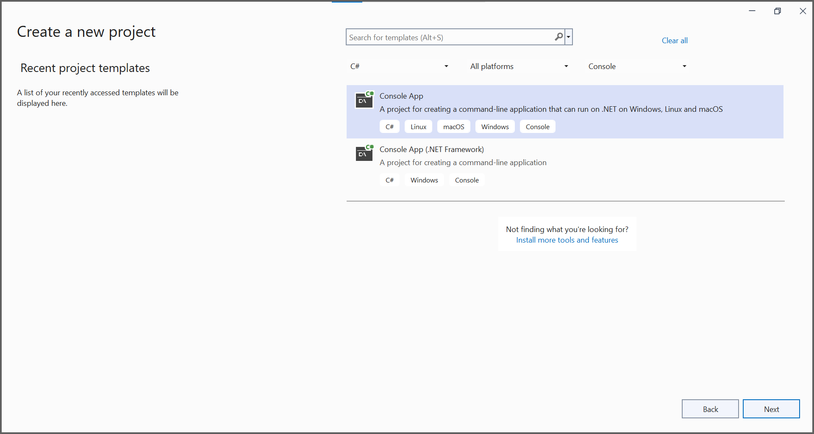
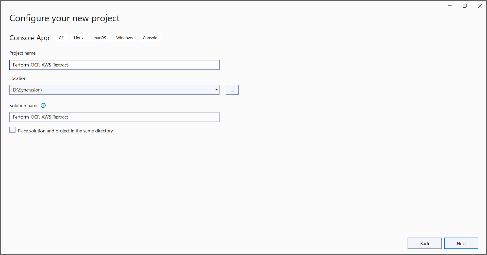
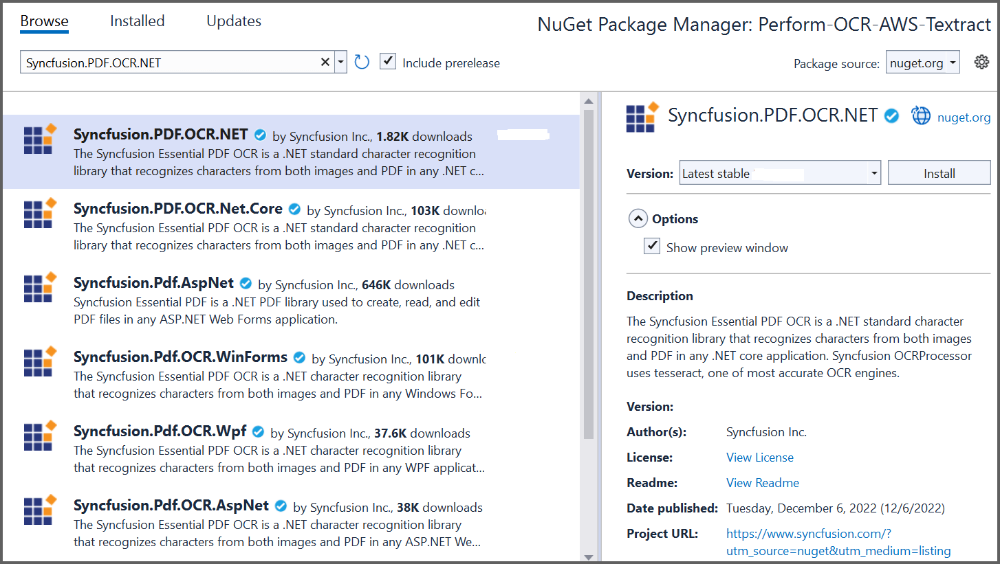
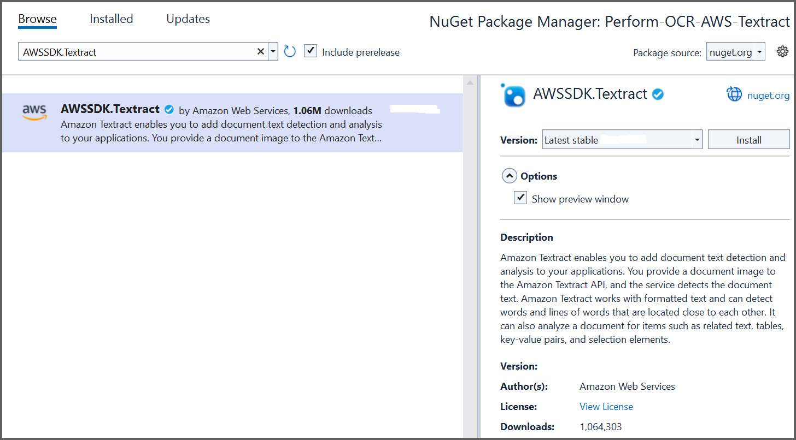

---
title: Perform OCR on PDF and image files in AWS Textract | Syncfusion
description: Learn how to perform OCR on scanned PDF documents and images in AWS Textract using Syncfusion .NET OCR library. 
platform: document-processing
control: PDF
documentation: UG
keywords: Assemblies
--- 

# Perform OCR with AWS Textract 

The [Syncfusion&reg; .NET OCR library](https://www.syncfusion.com/document-processing/pdf-framework/net/pdf-library/ocr-process) supports an external engine (AWS Textract) to process the OCR on image and PDF documents. 

## Steps to perform OCR with AWS Textract 

Step 1: Create a new .NET Console application project. 

In project configuration window, name your project and select Next. 

Step 2: Install [Syncfusion.PDF.OCR.NET](https://www.nuget.org/packages/Syncfusion.PDF.OCR.NET) and [AWSSDK.Textract](https://www.nuget.org/packages/AWSSDK.Textract) NuGet packages as reference to your .NET application from [nuget.org](https://www.nuget.org/). 

N> 1. Beginning from version 21.1.x, the default configuration includes the addition of the TesseractBinaries and Tesseract language data folder paths, eliminating the requirement to explicitly provide these paths.
N> 2. Starting with v16.2.0.x, if you reference Syncfusion&reg; assemblies from trial setup or from the NuGet feed, you also have to add "Syncfusion.Licensing" assembly reference and include a license key in your projects. Please refer to this [link](https://help.syncfusion.com/common/essential-studio/licensing/overview) to know about registering Syncfusion&reg; license key in your application to use our components.

Step 3: Include the following namespaces in the Program.cs file. 


using Syncfusion.OCRProcessor;
using Syncfusion.Pdf.Parsing;


Step 4: Use the following code sample to perform OCR on a PDF document using [PerformOCR](https://help.syncfusion.com/cr/document-processing/Syncfusion.OCRProcessor.OCRProcessor.html#Syncfusion_OCRProcessor_OCRProcessor_PerformOCR_Syncfusion_Pdf_Parsing_PdfLoadedDocument_System_String_) method of the [OCRProcessor](https://help.syncfusion.com/cr/document-processing/Syncfusion.OCRProcessor.OCRProcessor.html) class with AWS Textract.


//Initialize the OCR processor.
using (OCRProcessor processor = new OCRProcessor())
{
    //Load an existing PDF document.
    FileStream stream = new FileStream("Region.pdf", FileMode.Open);
    PdfLoadedDocument lDoc = new PdfLoadedDocument(stream);
    //Set the OCR language.
    processor.Settings.Language = Languages.English;
    //Initialize the AWS Textract external OCR engine.
    IOcrEngine azureOcrEngine = new AWSExternalOcrEngine();
    processor.ExternalEngine = azureOcrEngine;
    //Perform OCR with input document.
    string text = processor.PerformOCR(lDoc);
    //Create file stream.
    FileStream fileStream = new FileStream("Output.pdf", FileMode.CreateNew);
    //Save the document into stream.
    lDoc.Save(fileStream);
    //Close the document.
    lDoc.Close();
    stream.Dispose();
    fileStream.Dispose();
}


Step 5: Create a new class named <b>AWSExternalOcrEngine</b> and implement the IOcrEngine interface. Get the image stream from the PerformOCR method and process it with an external OCR engine. This will return the OCRLayoutResult for the image.

N> Provide a valid Secret Access Key to work with AWS Textract. 



class AWSExternalOcrEngine : IOcrEngine
{
    private string awsAccessKeyId = "AccessKey";
    private string awsSecretAccessKey = "SecretAccessKey";
    private float imageHeight;
    private float imageWidth;
    public OCRLayoutResult PerformOCR(Stream stream)
    {
        AmazonTextractClient clientText = Authenticate();
        DetectDocumentTextResponse textResponse = GetAWSTextractResult(clientText, stream).Result;         
        OCRLayoutResult oCRLayoutResult = ConvertAWSTextractResultToOcrLayoutResult(textResponse);
        return oCRLayoutResult;
    }

    public AmazonTextractClient Authenticate()
    {
        AmazonTextractClient client = new AmazonTextractClient(awsAccessKeyId, awsSecretAccessKey, RegionEndpoint.USEast1);
        return client;
    }
    
    public async Task<DetectDocumentTextResponse> GetAWSTextractResult(AmazonTextractClient client, Stream stream)
    {
        stream.Position = 0;
        MemoryStream memoryStream = new MemoryStream();
        stream.CopyTo(memoryStream);
        PdfTiffImage bitmap = new PdfTiffImage(memoryStream);
        imageHeight = bitmap.Height;
        imageWidth = bitmap.Width;

        DetectDocumentTextResponse response = await client.DetectDocumentTextAsync(new DetectDocumentTextRequest
        {
            Document = new Document
            {
                Bytes = memoryStream
            }
        });
        return response;
    }
    
    public OCRLayoutResult ConvertAWSTextractResultToOcrLayoutResult(DetectDocumentTextResponse textResponse)
    {
        OCRLayoutResult layoutResult = new OCRLayoutResult();
        Syncfusion.OCRProcessor.Page ocrPage = new Page();
        Syncfusion.OCRProcessor.Line ocrLine;
        Syncfusion.OCRProcessor.Word ocrWord;
        layoutResult.ImageHeight = imageHeight;
        layoutResult.ImageWidth = imageWidth;
        foreach (var page in textResponse.Blocks)
        {                   
            ocrLine = new Line();
            if (page.BlockType == "WORD")
            {
                ocrWord = new Word();
                ocrWord.Text = page.Text;
                
                float left = page.Geometry.BoundingBox.Left;
                float top = page.Geometry.BoundingBox.Top;
                float width = page.Geometry.BoundingBox.Width;
                float height = page.Geometry.BoundingBox.Height;
                Rectangle rect = GetBoundingBox(left,top,width,height);
                ocrWord.Rectangle = rect;
                ocrLine.Add(ocrWord);
                ocrPage.Add(ocrLine);
            }               
        }
        layoutResult.Add(ocrPage);
        return layoutResult;
    }
    public Rectangle GetBoundingBox(float left, float top, float width, float height)
    {
        int x = Convert.ToInt32(left * imageWidth);
        int y = Convert.ToInt32(top * imageHeight);
        int bboxWidth = Convert.ToInt32((width * imageWidth) + x);
        int bboxHeight = Convert.ToInt32((height * imageHeight) + y);
        Rectangle rect = new Rectangle(x,y, bboxWidth, bboxHeight);
        return rect;
    }
}



By executing the program, you will get a PDF document as follows. 

A complete working sample can be downloaded from [Github](https://github.com/SyncfusionExamples/OCR-csharp-examples/tree/master/AWS%20Textract).

