# Perform OCR with Azure Kubernetes Service

The [Syncfusion&reg; .NET OCR library](https://www.syncfusion.com/document-processing/pdf-framework/net/pdf-library/ocr-process) can be integrated with external OCR engines like Azure Computer Vision and deployed on Azure Kubernetes Service (AKS) to efficiently process OCR tasks on images and PDF documents at scale.

## Steps to perform OCR with Azure Kubernetes Service

Step 1: Create a new ASP.NET Core application project.
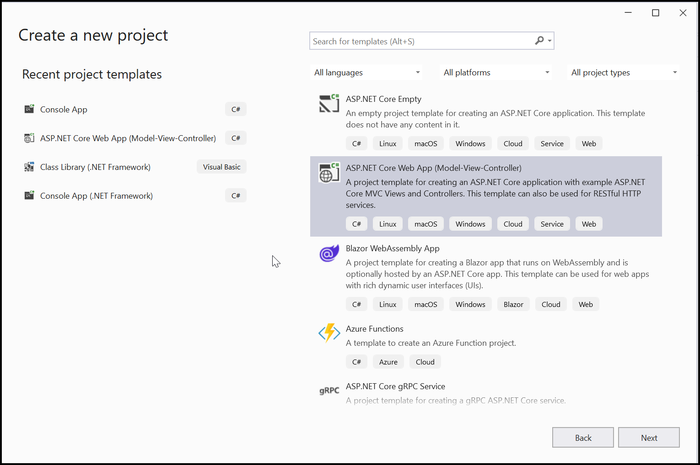

Step 2: In the project configuration window, name your project and select Next.
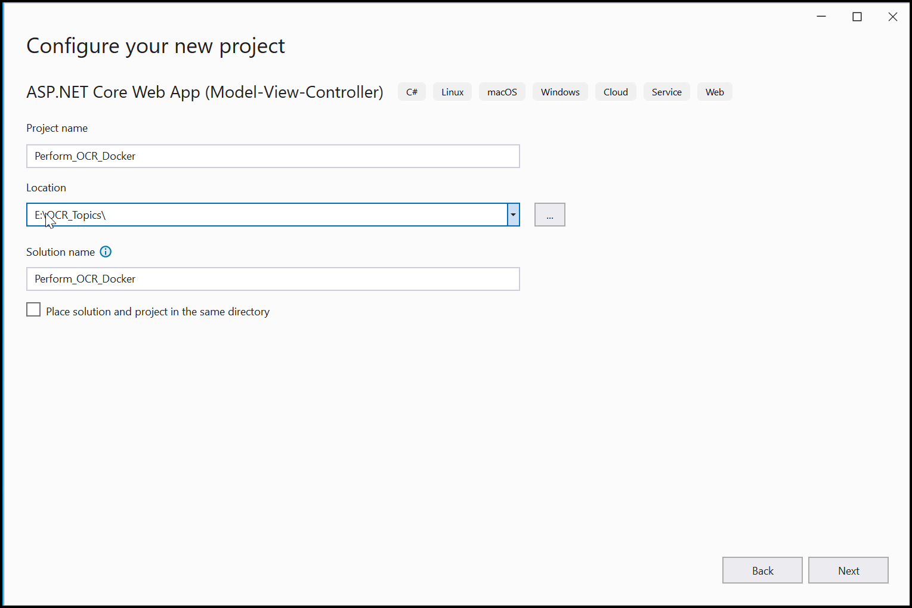

Step 3: Enable the Docker support with Linux as a target OS.
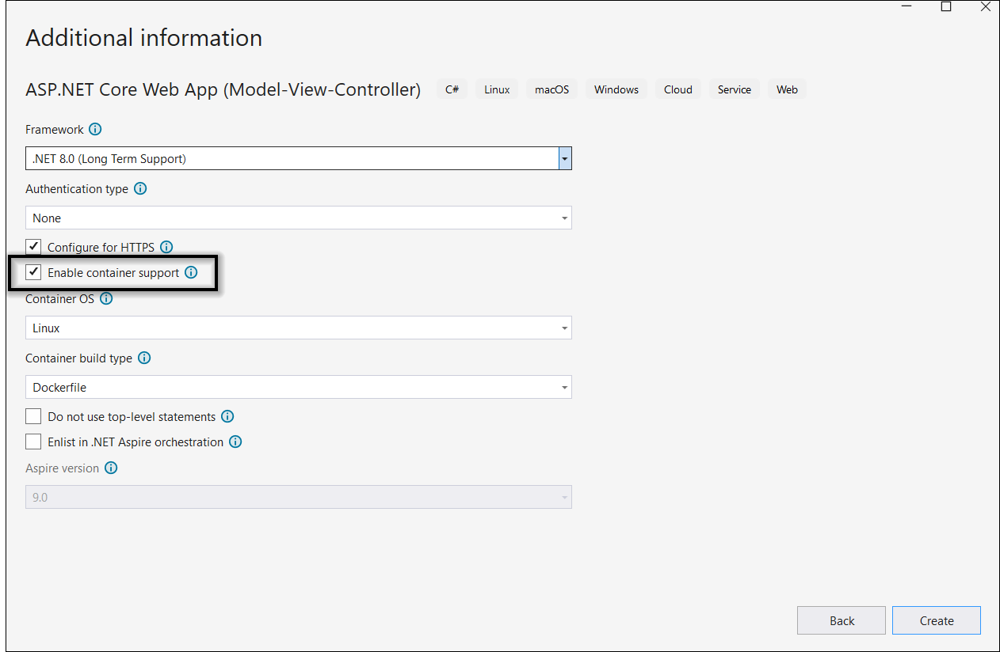

Step 4:  Install the [Syncfusion.PDF.OCR.Net.Core](https://www.nuget.org/packages/Syncfusion.PDF.OCR.Net.Core) NuGet package as a reference to your .NET Standard applications from [NuGet.org](https://www.nuget.org/).   
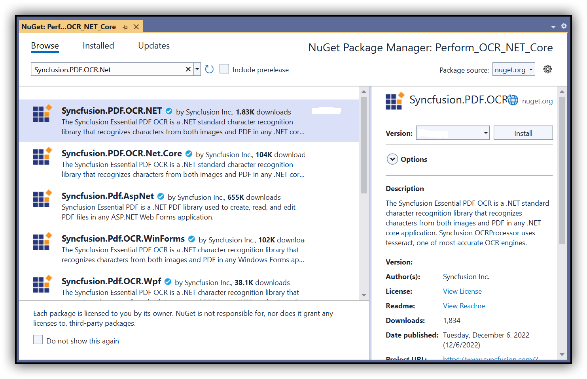

N> 1. Beginning from version 21.1.x, the default configuration includes the addition of the TesseractBinaries and Tesseract language data folder paths, eliminating the requirement to explicitly provide these paths.
N> 2. Starting with v16.2.0.x, if you reference Syncfusion&reg; assemblies from trial setup or from the NuGet feed, you also have to add "Syncfusion.Licensing" assembly reference and include a license key in your projects. Please refer to this [link](https://help.syncfusion.com/common/essential-studio/licensing/overview) to know about registering Syncfusion&reg; license key in your application to use our components.

Step 5: Include the following commands in the Docker file to install the dependent packages in the docker container.



RUN apt-get update && \
apt-get install -yq --no-install-recommends libgdiplus libc6-dev libleptonica-dev libjpeg62 && \
ln -s /usr/lib/x86_64-linux-gnu/libtiff.so.6 /usr/lib/x86_64-linux-gnu/libtiff.so.5 && \
ln -s /lib/x86_64-linux-gnu/libdl.so.2 /usr/lib/x86_64-linux-gnu/libdl.so



 

Step 6: A default action method named Index will be present in the *HomeController.cs*. Right-click on the Index method and select Go to View, where you will be directed to its associated view page *Index.cshtml*.

Step 7: Add a new button in the *index.cshtml* as follows.



@{Html.BeginForm("PerformOCR", "Home", FormMethod.Get);
    {
        

            <input type="submit" value="Perform OCR on entire PDF" style="width:200px;height:27px" />
        

    }
    Html.EndForm();
}



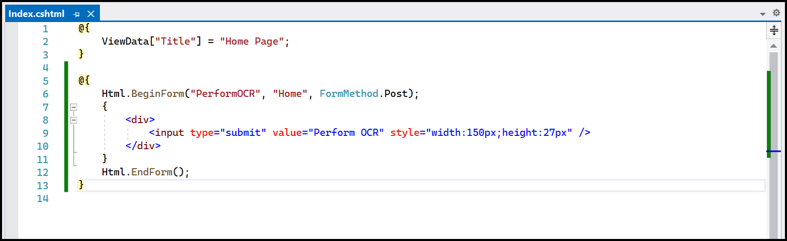 

Step 8: A default controller with the name *HomeController.cs* gets added to the creation of the ASP.NET Core project. Include the following namespaces in that HomeController.cs file.



using Syncfusion.OCRProcessor;
using Syncfusion.Pdf.Parsing;



Step 9: Add a new action method PerformOCR in the *HomeController.cs*, and include the code sample to perform OCR on the entire PDF document using `PerformOCR` method of the `OCRProcessor` class. 



public ActionResult PerformOCR()
{
   string docPath = _hostingEnvironment.WebRootPath + "/Data/Input.pdf";
    //Initialize the OCR processor.
    using (OCRProcessor processor = new OCRProcessor())
    {
        FileStream fileStream = new FileStream(docPath, FileMode.Open, FileAccess.Read);
        //Load a PDF document
        PdfLoadedDocument lDoc = new PdfLoadedDocument(fileStream);
        //Set OCR language to process
        processor.Settings.Language = Languages.English;
        //Process OCR by providing the PDF document.
        processor.PerformOCR(lDoc);
        //Create memory stream
        MemoryStream stream = new MemoryStream();
        //Save the document to memory stream
        lDoc.Save(stream);
        lDoc.Close();
        //Set the position as '0'
        stream.Position = 0;

        // Return file result
        return File(stream.ToArray(), "application/pdf", "Sample.pdf");
    }
}



## Deploying an Application to Kubernetes

### Overview
This guide provides step-by-step instructions to deploy an application using Docker and Kubernetes. We'll tag a Docker image, push it to a repository, and apply Kubernetes configurations.

### Prerequisites
* Docker installed on your system
* Access to a Kubernetes cluster
* Kubernetes CLI (kubectl) installed

### Detailed Explanation of Docker Image Tagging
Step 1: Tag the Docker image

Tagging a Docker image is an essential step in Docker container management. It allows you to create an alias for a Docker image, making it easier to identify and manage. Tags are often used to denote different versions or environments (e.g., development, staging, production).

1.Open your terminal. Ensure Docker is running on your system.

2.Run the tag command. Use the following syntax to tag your Docker image:



    docker tag <source-image> <repository>:<tag>



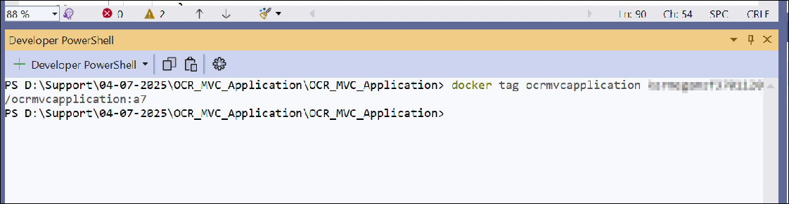 

Step 2: Push the Docker Image

Pushing uploads your tagged image to a Docker repository, making it accessible for deployment.



docker push <source-image> <repository>:<tag>



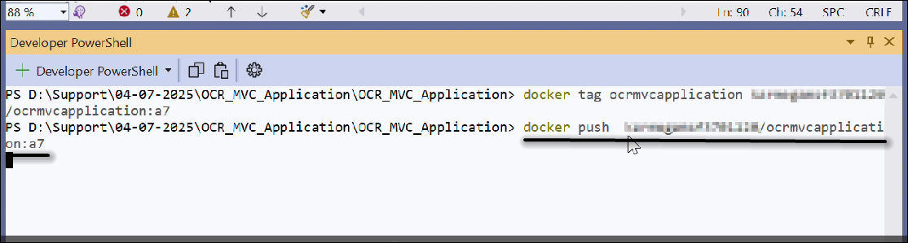 

Step 3: Apply the deployment configuration

This step creates or updates your application's deployment configuration in your Kubernetes cluster.



kubectl apply -f deployment.yaml



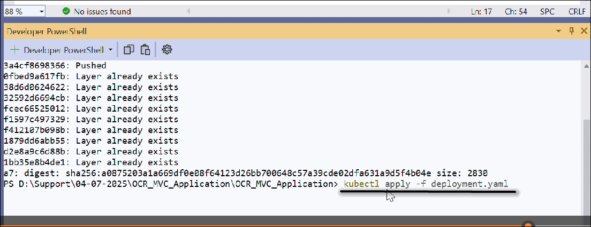 

Step 4: Apply the service configuration

Creating a service configuration exposes your application to the network, allowing external access.



kubectl apply -f service.yaml



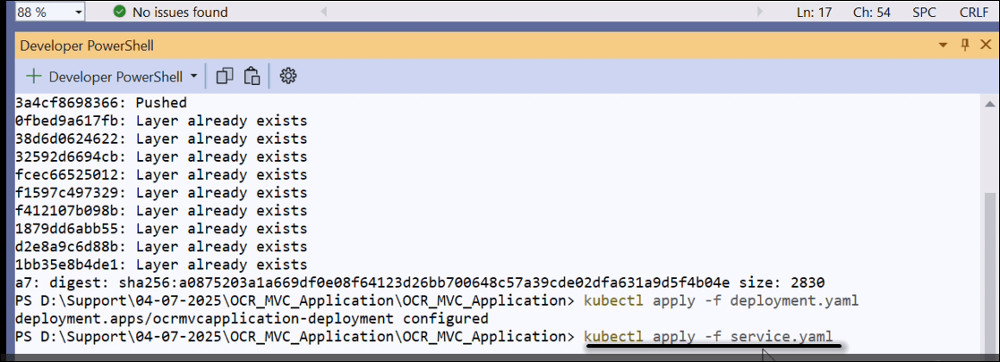 

Step 5: Viewing service details

Using **kubectl get service** allows you to check the services running in your Kubernetes cluster, ensuring they are correctly configured and accessible. You can copy the external IP and paste it into a browser like Chrome to view your application's output.



kubectl get service



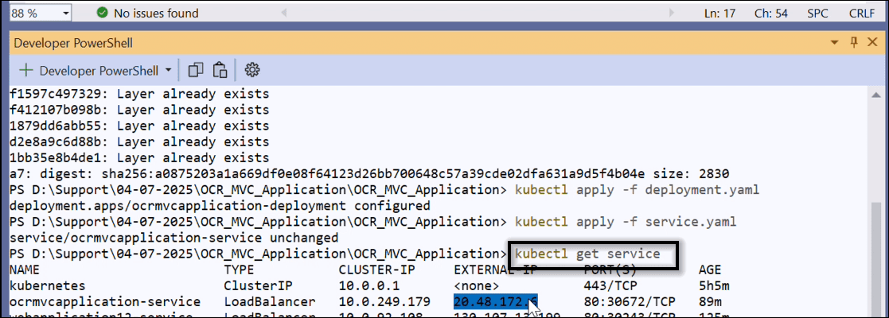 

 Now be able to use this to browse the the web app running on AKS.

 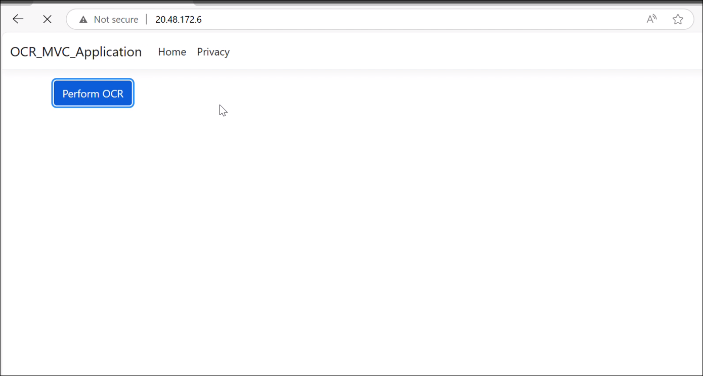 

 Click create PDF document to create a PDF document.You will get the output PDF document as follows.

  

 You can download a complete working sample from [GitHub](https://github.com/SyncfusionExamples/OCR-csharp-examples/tree/master/Docker).

 Click [here](https://www.syncfusion.com/document-processing/pdf-framework/net-core) to explore the rich set of Syncfusion® PDF library features.

