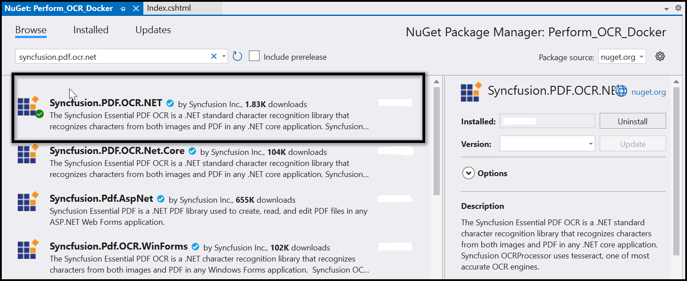

# Perform OCR with Azure Kubernetes Service

The [Syncfusion&reg; .NET OCR library](https://www.syncfusion.com/document-processing/pdf-framework/net/pdf-library/ocr-process) can be integrated with external OCR engines like Azure Computer Vision and deployed on Azure Kubernetes Service (AKS) to efficiently process OCR tasks on images and PDF documents at scale.

## Steps to perform OCR with Azure Kubernetes Service

Step 1: Create a new ASP.NET Core application project.

Step 2: In the project configuration window, name your project and select Next.

Step 3: Enable the Docker support with Linux as a target OS.

Step 4: Install the [Syncfusion.PDF.OCR.NET](https://www.nuget.org/packages/Syncfusion.PDF.OCR.Net/) NuGet package as a reference to your .NET Core application [NuGet.org](https://www.nuget.org/). 

N> 1. Beginning from version 21.1.x, the default configuration includes the addition of the TesseractBinaries and Tesseract language data folder paths, eliminating the requirement to explicitly provide these paths.
N> 2. Starting with v16.2.0.x, if you reference Syncfusion&reg; assemblies from trial setup or from the NuGet feed, you also have to add "Syncfusion.Licensing" assembly reference and include a license key in your projects. Please refer to this [link](https://help.syncfusion.com/common/essential-studio/licensing/overview) to know about registering Syncfusion&reg; license key in your application to use our components.

Step 5: Include the following commands in the Docker file to install the dependent packages in the docker container.



RUN apt-get update && \
apt-get install -yq --no-install-recommends libgdiplus libc6-dev libleptonica-dev libjpeg62 && \
ln -s /usr/lib/x86_64-linux-gnu/libtiff.so.6 /usr/lib/x86_64-linux-gnu/libtiff.so.5 && \
ln -s /lib/x86_64-linux-gnu/libdl.so.2 /usr/lib/x86_64-linux-gnu/libdl.so



 

Step 6: A default action method named Index will be present in the *HomeController.cs*. Right-click on the Index method and select Go to View, where you will be directed to its associated view page *Index.cshtml*.

Step 7: Add a new button in the *index.cshtml* as follows.



@{Html.BeginForm("PerformOCR", "Home", FormMethod.Get);
    {
        

            <input type="submit" value="Perform OCR on entire PDF" style="width:200px;height:27px" />
        

    }
    Html.EndForm();
}



 

Step 8: A default controller with the name *HomeController.cs* gets added to the creation of the ASP.NET Core project. Include the following namespaces in that HomeController.cs file.



using Syncfusion.OCRProcessor;
using Syncfusion.Pdf.Parsing;



Step 9: Add a new action method PerformOCR in the *HomeController.cs*, and include the code sample to perform OCR on the entire PDF document using [PerformOCR](https://help.syncfusion.com/cr/document-processing/Syncfusion.OCRProcessor.OCRProcessor.html#Syncfusion_OCRProcessor_OCRProcessor_PerformOCR_Syncfusion_Pdf_Parsing_PdfLoadedDocument_System_String_) method of the [OCRProcessor](https://help.syncfusion.com/cr/document-processing/Syncfusion.OCRProcessor.OCRProcessor.html) class. 



public ActionResult PerformOCR()
{
   string docPath = _hostingEnvironment.WebRootPath + "/Data/Input.pdf";
    //Initialize the OCR processor.
    using (OCRProcessor processor = new OCRProcessor())
    {
        FileStream fileStream = new FileStream(docPath, FileMode.Open, FileAccess.Read);
        //Load a PDF document
        PdfLoadedDocument lDoc = new PdfLoadedDocument(fileStream);
        //Set OCR language to process
        processor.Settings.Language = Languages.English;
        //Process OCR by providing the PDF document.
        processor.PerformOCR(lDoc);
        //Create memory stream
        MemoryStream stream = new MemoryStream();
        //Save the document to memory stream
        lDoc.Save(stream);
        lDoc.Close();
        //Set the position as '0'
        stream.Position = 0;
        //Download the PDF document in the browser
        FileStreamResult fileStreamResult = new FileStreamResult(stream, "application/pdf");
        fileStreamResult.FileDownloadName = "Sample.pdf";
        return fileStreamResult;
    }
}



