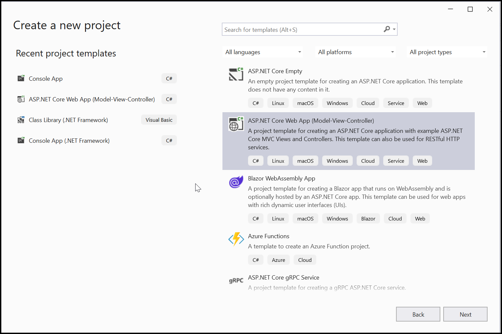
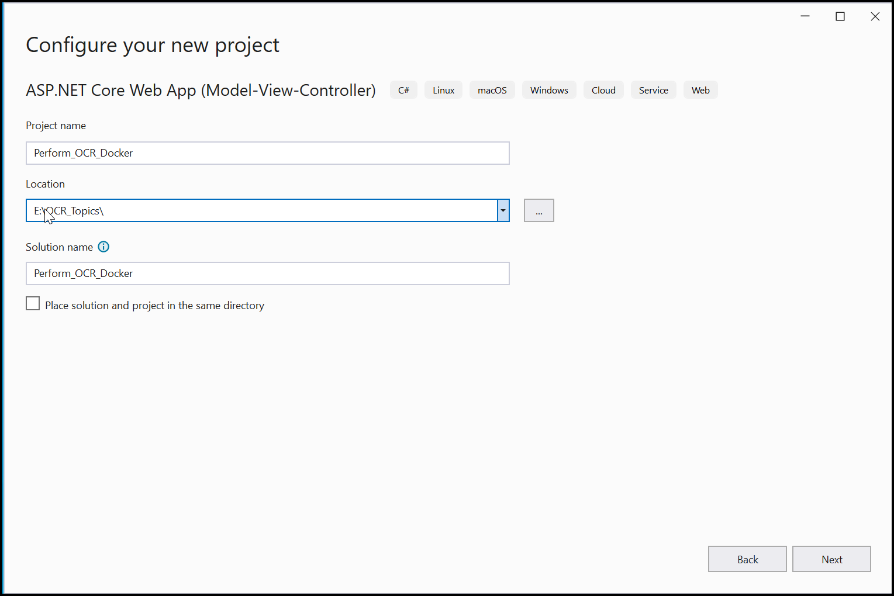
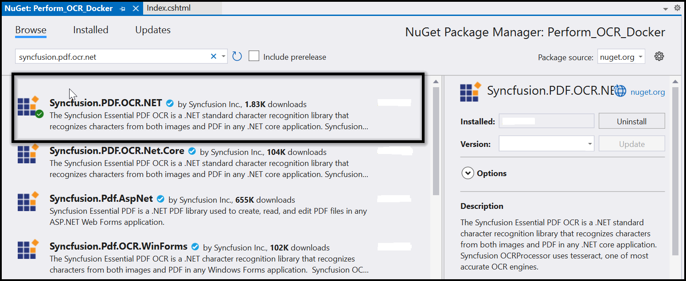

# Perform OCR in Docker

The [Syncfusion&reg; .NET OCR library](https://www.syncfusion.com/document-processing/pdf-framework/net-core/pdf-library/ocr-process) is used to extract text from the scanned PDFs and images in the Docker application with the help of Google's [Tesseract](https://github.com/tesseract-ocr/tesseract) Optical Character Recognition engine.

## Steps to perform OCR on entire PDF document in Docker
Step 1: Create a new ASP.NET Core application project.

Step 2: In the project configuration window, name your project and select Next.

Step 3: Enable the Docker support with Linux as a target OS.

Step 4: Install the [Syncfusion.PDF.OCR.NET](https://www.nuget.org/packages/Syncfusion.PDF.OCR.Net/) NuGet package as a reference to your .NET Core application [NuGet.org](https://www.nuget.org/). 
  

N> 1. Beginning from version 21.1.x, the default configuration includes the addition of the TesseractBinaries and Tesseract language data folder paths, eliminating the requirement to explicitly provide these paths.
N> 2. Starting with v16.2.0.x, if you reference Syncfusion&reg; assemblies from trial setup or from the NuGet feed, you also have to add "Syncfusion.Licensing" assembly reference and include a license key in your projects. Please refer to this [link](https://help.syncfusion.com/common/essential-studio/licensing/overview) to know about registering Syncfusion&reg; license key in your application to use our components.

Step 5: Include the following commands in the Docker file to install the dependent packages in the docker container.



RUN apt-get update && \
apt-get install -yq --no-install-recommends \
libgdiplus libc6-dev libleptonica-dev libjpeg62
RUN ln -s /usr/lib/x86_64-linux-gnu/libtiff.so.6 /usr/lib/x86_64-linux-gnu/libtiff.so.5
RUN ln -s /lib/x86_64-linux-gnu/libdl.so.2 /usr/lib/x86_64-linux-gnu/libdl.so



 

Step 6: A default action method named Index will be present in the *HomeController.cs*. Right-click on the Index method and select Go to View, where you will be directed to its associated view page *Index.cshtml*.

Step 7: Add a new button in the *index.cshtml* as follows.



@{Html.BeginForm("PerformOCR", "Home", FormMethod.Get);
    {
        

            <input type="submit" value="Perform OCR on entire PDF" style="width:200px;height:27px" />
        

    }
    Html.EndForm();
}



 

Step 8: A default controller with the name *HomeController.cs* gets added to the creation of the ASP.NET Core project. Include the following namespaces in that HomeController.cs file.



using Syncfusion.OCRProcessor;
using Syncfusion.Pdf.Parsing;



Step 9: Add a new action method PerformOCR in the *HomeController.cs*, and include the code sample to perform OCR on the entire PDF document using [PerformOCR](https://help.syncfusion.com/cr/document-processing/Syncfusion.OCRProcessor.OCRProcessor.html#Syncfusion_OCRProcessor_OCRProcessor_PerformOCR_Syncfusion_Pdf_Parsing_PdfLoadedDocument_System_String_) method of the [OCRProcessor](https://help.syncfusion.com/cr/document-processing/Syncfusion.OCRProcessor.OCRProcessor.html) class. 



public ActionResult PerformOCR()
{
   string docPath = _hostingEnvironment.WebRootPath + "/Data/Input.pdf";
    //Initialize the OCR processor.
    using (OCRProcessor processor = new OCRProcessor())
    {
        FileStream fileStream = new FileStream(docPath, FileMode.Open, FileAccess.Read);
        //Load a PDF document
        PdfLoadedDocument lDoc = new PdfLoadedDocument(fileStream);
        //Set OCR language to process
        processor.Settings.Language = Languages.English;
        //Process OCR by providing the PDF document.
        processor.PerformOCR(lDoc);
        //Create memory stream
        MemoryStream stream = new MemoryStream();
        //Save the document to memory stream
        lDoc.Save(stream);
        lDoc.Close();
        //Set the position as '0'
        stream.Position = 0;
        //Download the PDF document in the browser
        FileStreamResult fileStreamResult = new FileStreamResult(stream, "application/pdf");
        fileStreamResult.FileDownloadName = "Sample.pdf";
        return fileStreamResult;
    }
}



Step 10: Build and run the sample in Docker. It will pull the Linux Docker image from the Docker hub and run the project. Now, the webpage will open in the browser. Click the button to convert the webpage to a PDF.

By executing the program, you will get a PDF document as follows.

 

A complete working sample for converting an HTML to PDF in the Linux docker container can be downloaded from [Github](https://github.com/SyncfusionExamples/OCR-csharp-examples/tree/master/Docker).

Click [here](https://www.syncfusion.com/document-processing/pdf-framework/net-core) to explore the rich set of Syncfusion&reg; PDF library features.