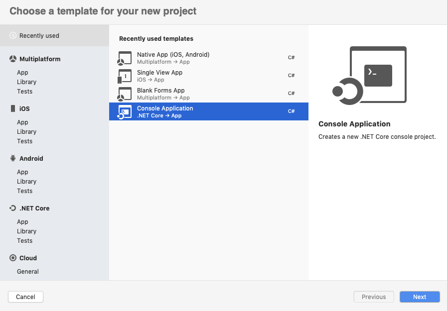

---
title: Perform OCR on PDF and Image Files in Mac | Syncfusion
description: Learn how to perform OCR on scanned PDF documents and images in WPF with different Tesseract versions using Syncfusion .NET OCR library. 
platform: document-processing
control: PDF
documentation: UG
keywords: Assemblies
--- 

# Perform OCR in Mac 

The [Syncfusion<sup>&reg;</sup> .NET OCR library](https://www.syncfusion.com/document-processing/pdf-framework/net/pdf-library/ocr-process) used to extract text from scanned PDFs and images in the Mac application.

## Steps to perform OCR on entire PDF document in Mac





**Prerequisites**:

* Install .NET SDK: Ensure that you have the .NET SDK installed on your system. You can download it from the [.NET Downloads page](https://dotnet.microsoft.com/en-us/download).
* Install Visual Studio: Download and install Visual Studio Code from the [official website](https://code.visualstudio.com/download).

Step 1: Create a new .NET Core console application project.


Step 2: Select the project version.

Step 3: Install the [Syncfusion.PDF.OCR.Net.Core](https://www.nuget.org/packages/Syncfusion.PDF.OCR.Net.Core) NuGet package as a reference to your project from [NuGet.org](https://www.nuget.org/).


N> Starting with v16.2.0.x, if you reference Syncfusion<sup>&reg;</sup> assemblies from the trial setup or from the NuGet feed, you also have to add "Syncfusion.Licensing" assembly reference and include a license key in your projects. Refer to this [link](https://help.syncfusion.com/common/essential-studio/licensing/overview) to learn about registering the Syncfusion<sup>&reg;</sup> license key in your application to use our components.

Step 4: Include the following Namespaces in the Program.cs file.



using Syncfusion.OCRProcessor;

using Syncfusion.Pdf.Parsing;





Step 5: Add the following code sample to the *Program.cs* file to **Perform OCR in .NET Core application on Mac OS**.




//Initialize the OCR processor.
using (OCRProcessor processor = new OCRProcessor())
{
   FileStream fileStream = new FileStream("Input.pdf", FileMode.Open, FileAccess.Read);
   //Load a PDF document.
   PdfLoadedDocument lDoc = new PdfLoadedDocument(fileStream);
   //Set the OCR language to be processed.
   processor.Settings.Language = Languages.English;
   //Process OCR by providing the PDF document.
   processor.PerformOCR(lDoc);
   //Create memory stream.
   MemoryStream stream = new MemoryStream();
   //Save the document to the memory stream.
   lDoc.Save(stream);
   lDoc.Close();
   //Set the position as '0'.
   stream.Position = 0;
   //Download the PDF document in the browser.
   FileStreamResult fileStreamResult = new FileStreamResult(stream, "application/pdf");
   fileStreamResult.FileDownloadName = "OCR.pdf";
   return fileStreamResult;
}





Step 6: Build the project.

Click on Build > Build Solution or press Ctrl + Shift + B to build the project.

Step 7: Run the project.

Click the Start button (green arrow) or press F5 to run the app.





**Prerequisites**:

**Prerequisites**:

* Install .NET SDK: Ensure that you have the .NET SDK installed on your system. You can download it from the [.NET Downloads page](https://dotnet.microsoft.com/en-us/download).
* Install Visual Studio Code: Download and install Visual Studio Code from the [official website](https://code.visualstudio.com/download).
* Install C# Extension for VS Code: Open Visual Studio Code, go to the Extensions view (Ctrl+Shift+X), and search for 'C#'. Install the official [C# extension provided by Microsoft](https://marketplace.visualstudio.com/items?itemName=ms-dotnettools.csharp).

Step 1: Open the terminal (Ctrl+` ) and run the following command to create a new .NET Core console application project.

```
dotnet new console -n CreatePdfMacOSApp
```
Step 2: Replace ****CreatePdfMacOSApp** with your desired project name.

Step 3: Navigate to the project directory using the following command

```
cd CreatePdfMacOSApp
```
Step 4: Use the following command in the terminal to add the [Syncfusion.Pdf.Net.Core](https://www.nuget.org/packages/Syncfusion.pdf.Net.Core) package to your project.

```
dotnet add package Syncfusion.Pdf.Net.Core
```
N> Starting with v16.2.0.x, if you reference Syncfusion<sup>&reg;</sup> assemblies from the trial setup or from the NuGet feed, you also have to add "Syncfusion.Licensing" assembly reference and include a license key in your projects. Refer to this [link](https://help.syncfusion.com/common/essential-studio/licensing/overview) to learn about registering the Syncfusion<sup>&reg;</sup> license key in your application to use our components.

Step 4: Include the following Namespaces in the Program.cs file.



using Syncfusion.OCRProcessor;

using Syncfusion.Pdf.Parsing;





Step 5: Add the following code sample to the *Program.cs* file to **Perform OCR in .NET Core application on Mac OS**.




//Initialize the OCR processor.
using (OCRProcessor processor = new OCRProcessor())
{
   FileStream fileStream = new FileStream("Input.pdf", FileMode.Open, FileAccess.Read);
   //Load a PDF document.
   PdfLoadedDocument lDoc = new PdfLoadedDocument(fileStream);
   //Set the OCR language to be processed.
   processor.Settings.Language = Languages.English;
   //Process OCR by providing the PDF document.
   processor.PerformOCR(lDoc);
   //Create memory stream.
   MemoryStream stream = new MemoryStream();
   //Save the document to the memory stream.
   lDoc.Save(stream);
   lDoc.Close();
   //Set the position as '0'.
   stream.Position = 0;
   //Download the PDF document in the browser.
   FileStreamResult fileStreamResult = new FileStreamResult(stream, "application/pdf");
   fileStreamResult.FileDownloadName = "OCR.pdf";
   return fileStreamResult;
}





Step 7: Build the project.

Run the following command in terminal to build the project.

```
dotnet build
```

Step 8: Run the project.

Run the following command in terminal to build the project.

```
dotnet run
```




By executing the program, you will get a PDF document as follows. 


A complete working sample can be downloaded from [GitHub](https://github.com/SyncfusionExamples/OCR-csharp-examples/tree/master/Mac).

Click [here](https://www.syncfusion.com/document-processing/pdf-framework/net) to explore the rich set of Syncfusion<sup>&reg;</sup> PDF library features.

