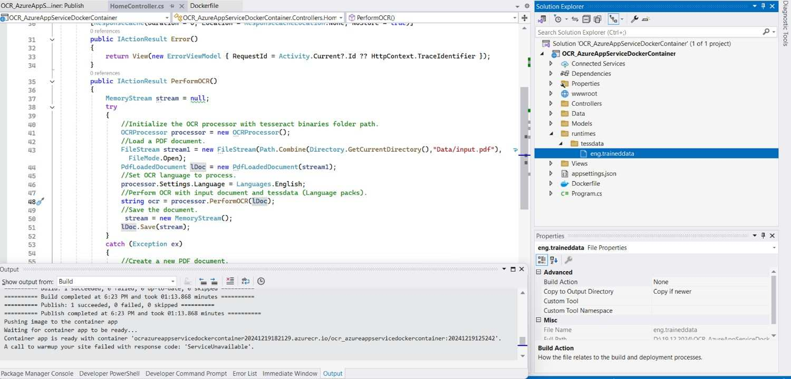

---
title: Troubleshooting PDF OCR failures | Syncfusion
description: Learn how to overcome OCR Processor failures using Syncfusion .NET OCR library with the help of Google's Tesseract Optical Character Recognition engine.
platform: document-processing
control: PDF
documentation: UG
keywords: Assemblies
--- 

# OCR Processor Troubleshooting 

## Tesseract has not been initialized exception

<table>
<th style="font-size:14px" width="100px">Exception</th>
<th style="font-size:14px">Tesseract has not been initialized exception.</th>
<tr>
<th style="font-size:14px" width="100px">Reason
</th>
<td>The exception may occur if the tesseract binaries and tessdata files are unavailable on the provided path. 
</td>
</tr>
<tr>
<th style="font-size:14px" width="100px">Solution1</th>
<td>
Set proper tesseract binaries and tessdata folder with all files and inner folders. The tessdata folder name is case-sensitive and should not change.  
  



//TesseractBinaries - path of the folder tesseract binaries. 
OCRProcessor processor = new OCRProcessor(@"TesseractBinaries/");

//TessData - path of the folder containing the language pack
processor.PerformOCR(lDoc, @"TessData/");



</td>
</tr>
<tr>
<th style="font-size:14px" width="100px">Solution2</th>
<td>
Ensure that your data file version is 3.02 since the OCR processor is built with the Tesseract version 3.02.
</td>
</tr>
</table>

## Exception has been thrown by the target of an invocation

<table>
<th style="font-size:14px" width="100px">Exception</th>
<th style="font-size:14px">Exception has been thrown by the target of an invocation.</th>
<tr>
<th style="font-size:14px" width="100px">Reason
</th>
<td>If the tesseract binaries are not in the required structure.  
</td>
</tr>
<tr>
<th style="font-size:14px" width="100px">Solution</th>
<td>
To resolve this exception, ensure the tesseract binaries are in the following structure.
  
The tessdata and tesseract binaries folder are automatically added to the bin folder of the application. The assemblies should be in the following structure.
  
1.<i>bin\Debug\net7.0\runtimes\win-x64\native\leptonica-1.80.0.dll,libSyncfusionTesseract.dll</i> 
2.<i>bin\Debug\net7.0\runtimes\win-x86\native\leptonica-1.80.0.dll,libSyncfusionTesseract.dll</i>
</td>
</tr>
<tr>
<th style="font-size:14px" width="100px">Reason 1
</th>
<td>An exception may occur due to missing or mismatched assemblies of the Tesseract binaries and Tesseract data from the OCR processor.
</td>
</tr>
<tr>
<th style="font-size:14px" width="100px">Reason 2
</th>
<td>An exception may occur due to the VC++ 2015 redistributable files missing in the machine where the OCR processor takes place.
</td>
</tr>
<tr>
<th style="font-size:14px" width="100px">Solution</th>
<td>
Install the VC++ 2015 redistributable files in your machine to overcome an exception. So, please select both file and install it.
 
<b>Refer to the following screenshot:</b>
 

  
Please find the download link Visual C++ 2015 Redistributable file, 
<a href="https://www.microsoft.com/en-us/download/details.aspx?id=48145">Visual C++ 2015 Redistributable file</a> 
</td>
</tr>
</table>

## Can't be opened because the developer's identity cannot be confirmed

<table>
<th style="font-size:14px" width="100px">Exception</th>
<th style="font-size:14px">Can't be opened because the developer's identity cannot be confirmed.</th>
<tr>
<th style="font-size:14px" width="100px">Reason
</th>
<td>This error may occur during the initial loading of the OCR processor in Mac environments.     
</td>
</tr>
<tr>
<th style="font-size:14px" width="100px">Solution</th>
<td>
To resolve this issue, refer this <a href="https://support.shippingeasy.com/hc/en-us/articles/211543683-What-is-the-error-identity-of-the-developer-cannot-be-confirmed-">link</a> for more details.

</td>
</tr>
</table>

## The OCR processor doesn't process languages other than English

<table>
<th style="font-size:14px" width="100px">Exception</th>
<th style="font-size:14px">The OCR processor doesn't process languages other than English.</th>
<tr>
<th style="font-size:14px" width="100px">Reason
</th>
<td>This issue may occur if the input image has other languages. The language and tessdata are unavailable for those languages.    
</td>
</tr>
<tr>
<th style="font-size:14px" width="100px">Solution</th>
<td>
The essential&reg; PDF supports all the languages the Tesseract engine supports in the OCR processor.
The dictionary packs for the languages can be downloaded from the following online location: 
<a href="https://code.google.com/p/tesseract-ocr/downloads/list">https://code.google.com/p/tesseract-ocr/downloads/list</a>
  
It is also mandatory to change the corresponding language code in the OCRProcessor.Settings.Language property.   
For example, to perform the optical character recognition in German, the property should be set as   
"processor.Settings.Language = "deu";"
</td>
</tr>
</table>

## OCR fails in .NET Core WinForms but Works in .NET Framework

<table>
<th style="font-size:14px" width="100px">Exception</th>
<th style="font-size:14px">OCR processing works correctly in a <b>.NET Framework WinForms</b> application but fails to produce any output when the same logic is used in a <b>.NET Core WinForms</b> application. The application runs without throwing any exceptions, but no text is recognized from the PDF or image.</th>
<tr>
<th style="font-size:14px" width="100px">Reason
</th>
<td>The root cause is a <b>platform-specific dependency mismatch</b>. The Tesseract binaries required for .NET Framework are different from those required for .NET Core. Even if the binaries are present in the output folder, using Framework-specific binaries in a .NET Core project causes the OCR process to fail silently.    
</td>
</tr>
<tr>
<th style="font-size:14px" width="100px">Solution</th>
<td>
Ensure your .NET Core project uses the correct Tesseract binaries built for .NET Core:  
1.<b>Install the Correct NuGet Package</b>: 
Reference the Syncfusion.PDF.OCR.Net.Core NuGet package in your .NET Core project. 
2.<b>Verify the Tesseract Binaries</b>: 
Confirm that the correct binaries are copied to your output directory: 
a.Extract the Syncfusion.PDF.OCR.Net.Core NuGet package. 
b.Copy the appropriate runtimes folder from the extracted package into your project's output directory (e.g., bin/Debug/net6.0-windows/). 

</td>
</tr>
</table>

## Text does not recognize properly when performing OCR on a PDF document with low-quality images

<table>
<th style="font-size:14px" width="100px">Issue</th>
<th style="font-size:14px">Text does not recognize properly when performing OCR on a PDF document with low-quality images</th>
<tr>
<th style="font-size:14px" width="100px">Reason
</th>
<td>The presence of low quality images in the input PDF document may be the cause of this issue.
</td>
</tr>
<tr>
<th style="font-size:14px" width="100px">Solution</th>
<td>
By using the best tessdata, we can improve the OCR results. For more information,  please refer to the links below.
 
<a href="https://github.com/tesseract-ocr/tessdata_best">https://github.com/tesseract-ocr/tessdata_best</a>  
{{'**Note:**'| markdownify }}For better performance, kindly use the fast tessdata which is mentioned in below link, <a href="https://github.com/tesseract-ocr/tessdata_fast">https://github.com/tesseract-ocr/tessdata_fast</a> 
</td>
</tr>
</table>

## OCR not working on Mac: Exception has been thrown by the target of an invocation

<table>
<th style="font-size:14px" width="100px">Issue
</th>
<th style="font-size:14px">Syncfusion.Pdf.PdfException: Exception has been thrown by the target of an invocation" in the Mac machine. 
</th>
<tr>
<th style="font-size:14px" width="100px">Reason
</th>
<td>The problem occurs due to a mismatch in the dependency package versions on your Mac machine. 
</td>
</tr>
<tr>
<th style="font-size:14px" width="100px">Solution
</th>
<td>To resolve this problem, you should install and utilize Tesseract 5 on your Mac machine. Refer to the following steps for installing Tesseract 5 and integrating it into an OCR processing workflow. 
 
1.Execute the following command to install Tesseract 5. 
 



brew install tesseract



 
If the "brew" is not installed on your machine, you can install it using the following command.
 



/bin/bash -c "$(curl -fsSL https://raw.githubusercontent.com/Homebrew/install/HEAD/install.sh)"



 
2.Once Tesseract 5 is successfully installed, you can configure the path to the latest binaries by copying the location of the Tesseract folder and setting it as the Tesseract binaries path when setting up the OCR processor. Refer to the example code below:
 



//Initialize the OCR processor by providing the path of tesseract binaries.
using (OCRProcessor processor = new OCRProcessor("/opt/homebrew/Cellar/tesseract/5.3.2/lib"))



 

3.Add the TessDataPath from bin folder. Refer to the example code below:
 



using (OCRProcessor processor = new OCRProcessor("/opt/homebrew/Cellar/tesseract/5.3.2/lib"))
{
    FileStream fileStream = new FileStream("../../../Input.pdf", FileMode.Open, FileAccess.Read);
    //Load a PDF document.
    PdfLoadedDocument lDoc = new PdfLoadedDocument(fileStream);
    //Set OCR language to process.
    processor.Settings.Language = Languages.English;
    //Process OCR by providing the PDF document.
    processor.TessDataPath = "runtimes/tessdata";
    processor.PerformOCR(lDoc);
    //Create file stream.
    using (FileStream outputFileStream = new FileStream("Output.pdf", FileMode.Create, FileAccess.ReadWrite))
    {
        //Save the PDF document to file stream.
        lDoc.Save(outputFileStream);
    }
    //Close the document.
    lDoc.Close(true);
}



</td>
</tr>
</table>

## Method PerformOCR() causes problems and ignores the tesseract files under WSL.

<table>
<th style="font-size:14px" width="100px">Issue</th>
<th style="font-size:14px">Method PerformOCR() causes problem and ignores the tesseract files under WSL</th>
<tr>
<th style="font-size:14px" width="100px">Reason
</th>
<td>Tesseract binaries in WSL are missing.
</td>
</tr>
<tr>
<th style="font-size:14px" width="100px">Solution</th>
<td>To resolve this problem, you should install and utilize Leptonica and Tesseract on your machine. Refer to the following steps for installing Leptonica and Tesseract,
  
1. Install the leptonica.
 



sudo apt-get install libleptonica-dev



  

  
2.Install the tesseract.
 



sudo apt-get install tesseract-ocr-eng



  

  
3. Copy the binaries (liblept.so and libtesseract.so) to the missing files exception folder in the project location.
 



cp /usr/lib/x86_64-linux-gnu/liblept.so /home/syncfusion/linuxdockersample/linuxdockersample/bin/Debug/net7.0/liblept1753.so



 



cp /usr/lib/x86_64-linux-gnu/libtesseract.so.4 /home/syncfusion/linuxdockersample/linuxdockersample/bin/Debug/net7.0/libSyncfusionTesseract.so



 
</td>
</tr>
</table>

## OCR not working on Linux: Exception has been thrown by the target of an invocation

<table>
<th style="font-size:14px" width="100px">Issue</th>
<th style="font-size:14px">Syncfusion.Pdf.PdfException: Exception has been thrown by the target of an invocation" in the Linux machine.</th>
<tr>
<th style="font-size:14px" width="100px">Reason
</th>
<td>The problem occurs due to the missing prerequisites dependencies on your Linux machine.
</td>
</tr>
<tr>
<th style="font-size:14px" width="100px">Solution</th>
<td>
To resolve this problem, you should install all required dependencies in your Linux machine. Refer to the following steps to installing the missing dependencies.

Step 1: Execute the following command in terminal window to check dependencies are installed properly.



ldd  liblept1753.so
ldd  libSyncfusionTesseract.so



Run the following commands in terminal 
Step 1:



sudo apt-get install libleptonica-dev libjpeg62



Step 2:



ln -s /usr/lib/x86_64-linux-gnu/libtiff.so.6 /usr/lib/x86_64-linux-gnu/libtiff.so.5



Step 3:



ln -s /lib/x86_64-linux-gnu/libdl.so.2 /usr/lib/x86_64-linux-gnu/libdl.so



</td>
</tr>
</table>

## OCR not working on Docker net 8.0: Exception has been thrown by target of an invocation.

<table>
<th style="font-size:14px" width="100px">Exception</th>
<th style="font-size:14px">OCR not working on Docker net 8.0: Exception has been thrown by target of an invocation.</th>
<tr>
<th style="font-size:14px" width="100px">Reason
</th>
<td>The reported issue occurs due to the missing prerequisite dependencies packages in the Docker container in .NET 8.0 version.
</td>
</tr>
<tr>
<th style="font-size:14px" width="100px">Solution</th>
<td>
 We can resolve the reported issue by installing the tesseract required dependencies by using Docker file. Please refer the below commands.





FROM mcr.microsoft.com/dotnet/aspnet:8.0 AS base

RUN apt-get update && \

apt-get install -yq --no-install-recommends \

libgdiplus libc6-dev libleptonica-dev libjpeg62

RUN ln -s /usr/lib/x86_64-linux-gnu/libtiff.so.6 /usr/lib/x86_64-linux-gnu/libtiff.so.5

RUN ln -s /lib/x86_64-linux-gnu/libdl.so.2 /usr/lib/x86_64-linux-gnu/libdl.so

 

USER app

WORKDIR /app

EXPOSE 8080

EXPOSE 8081





</td>
</tr>
</table>

## Default path reference for Syncfusion&reg; OCR packages
When installing the Syncfusion&reg; OCR NuGet packages, the tessdata and tesseract path binaries are copied into the runtimes folder. The default binaries path references are added in the package itself, so there is no need to set the manual path.

If you are facing any issues with default reference path in your project. Kindly manually set the Tesseract and Tessdata path using the TessdataPath and TesseractPath in OCRProcessor class. You can find the binaries in the below project in your project location.

<table>
<tr>
<th style="font-size:14px" width="100px">Tessdata path
</th>
<td>
Tessdata default path reference is common for all platform. You can find the tessdata in below path in your project.

"bin\Debug\net6.0\runtimes\tessdata"
</td>
</tr>
<tr>
<th style="font-size:14px" width="100px">Tesseract Path</th>
<td>
Tesseract binaries are different based on the OS platform and bit version . You can find the tesseract path in below path in your project.
  
Windows Platform: 
bin\Debug\net6.0\runtimes\win-x86\native (or) bin\Debug\net6.0\runtimes\win-x64\native
  
Linux:
 
bin\Debug\net6.0\runtimes\linux\native
  
 
Mac:
 
bin\Debug\net6.0.\runtimes\osx\native
</td>
</tr>
</table>

## System.NullReferenceException in Azure linux VM
<table>
<th style="font-size:14px" width="100px">Exception</th>
<th style="font-size:14px">System.NullReferenceException in Azure linux VM</th>
<tr>
<th style="font-size:14px" width="100px">Reason
</th>
<td>The problem occurs while extracting the Image from PDF without a Skiasharp dependency in a Linux environment.
</td>
</tr>
<tr>
<th style="font-size:14px" width="100px">Solution</th>
<td>
Installing the following Skiasharp NuGet for the Linux environment will resolve the System.NullReferenceException while extracting the Images in Linux. 
Please find the NuGet link below, 
NuGet:  <a href="https://www.nuget.org/packages/SkiaSharp.NativeAssets.Linux.NoDependencies/2.88.6">https://www.nuget.org/packages/SkiaSharp.NativeAssets.Linux.NoDependencies/2.88.6</a>
</td>
</tr>
</table>

## IIS Fails to Load Tesseract OCR DLLs
<table>
<th style="font-size:14px" width="100px">Exception</th>
<th style="font-size:14px">The application failed to load Tesseract OCR DLLs when hosted on IIS, resulting in the error:
Could not find a part of the path 'C:\inetpub\wwwroot\VizarCore\x64'.</th>
<tr>
<th style="font-size:14px" width="100px">Reason
</th>
<td> * IIS couldn't load the required Tesseract and Leptonica DLLs because some system components were missing. 
* The Visual C++ Redistributables for VS2015-VS2022 (x86 and x64) were not installed. 
* IIS on a 64-bit server needs both redistributables to load native libraries correctly. 
* The application's folder paths and permissions were not properly set up for OCR binaries. 
</td>
</tr>
<tr>
<th style="font-size:14px" width="100px">Solution</th>
<td>
<b>Installed Required Redistributables</b> 
Installed both <b>VC_redist.x86</b> and <b>VC_redist.x64</b> for VS2015-VS2022 on the IIS server. 
<b>Updated Server</b> 
Applied all available Windows updates (including cumulative and Defender updates) to ensure system stability. 
<b>Configured Application Paths</b> 
Set default paths for OCR binaries: 
* C:\inetpub\wwwroot\myapp\Tesseractbinaries 
* C:\inetpub\wwwroot\myapp\tessdata 
<b>Set Proper Permissions</b> 
Ensured IIS_IUSRS group has <b>Read & Execute</b> and <b>List folder contents</b> permissions on the above directories. 
<b>Observed Delayed Activation</b> 
OCR functionality did not activate immediately-likely due to IIS caching or delayed DLL loading-but began working shortly after configuration. 
</td>
</tr>
</table>

## OCR not working on Azure App Service Linux Docker Container: Exception has been thrown by the target of an invocation
<table>
<th style="font-size:14px" width="100px">Exception</th>
<th style="font-size:14px">Syncfusion.Pdf.PdfException: Exception has been thrown by the target of an invocation while deploying ASP .NET Core applications in Azure App Service Linux Docker Container</th>
<tr>
<th style="font-size:14px" width="100px">Reason
</th>
<td>when publishing the ASP.NET Core application to the Azure App Service Linux Docker container, only the .so, .dylib, and .dll files are copied from the runtimes folder to the publish folder. Files in other formats are not copied to the publish folder.
</td>
</tr>
<tr>
<th style="font-size:14px" width="100px">Solution</th>
<td>
To resolve this problem, the tessdata folder path must be explicitly set relative to the project directory under runtimes/tessdata. The publish folder can be located in your project directory at this path: obj\Docker\publish.
  
Please refer to the screenshot below:
  

  
</td>
</tr>
</table>

## 'Image stream is null' exception while performing OCR in AKS (Linux)

<table>
<th style="font-size:14px" width="100px">Exception</th>
<th style="font-size:14px">	
'Image stream is null' exception while performing OCR in AKS (Linux))</th>
<tr>
<th style="font-size:14px" width="100px">Reason
</th>
<td>This issue typically arises due to insufficient file system permissions for the temporary directory used during OCR processing in an AKS (Azure Kubernetes Service) Linux environment.
</td>
</tr>
<tr>
<th style="font-size:14px" width="100px">Solution</th>
<td>
To ensure your Kubernetes workloads have appropriate read, write, and execute permissions on temporary directories, consider the following solutions:
  
<b>1.Use an EmptyDir Volume for a Writable Temp Directory:</b>
Update your deployment YAML to include a writable temporary directory with `emptyDir`:
  




spec:
  containers:
    - name: your-container
      image: your-image
      volumeMounts:
        - name: temp-volume
          mountPath: /tmp # or /app/tmp if your app uses that
  volumes:
    - name: temp-volume
      emptyDir: {}




  
This ensures each pod has its own writable temporary directory, ideal for short-lived, non-persistent data
  
<b>2.Grant Write Access Using SecurityContext:</b>
  
To ensure your container has permission to write to mounted volumes, add:
  




securityContext:
  runAsUser: 1000 # safer than root
  fsGroup: 2000   # gives access to mounted files




  
N> Avoid setting `runAsUser: 0` in production, as running containers as root poses a security risk.
  
<b>3.Use Persistent Writable Storage (Azure Files Example):</b>
  
If persistent storage is required, configure Azure Files:
  




volumes:
    - name: azurefile
    azureFile:
      secretName: azure-secret
      shareName: aksshare
      readOnly: false




  
This setup allows your container to write to a persistent Azure File Share, making it suitable for use cases that require long-term file storage.
  
By applying these configuration changes, you can ensure that your AKS workloads have the necessary write access for operations, while maintaining security and flexibility.

</td>
</tr>

</table>

