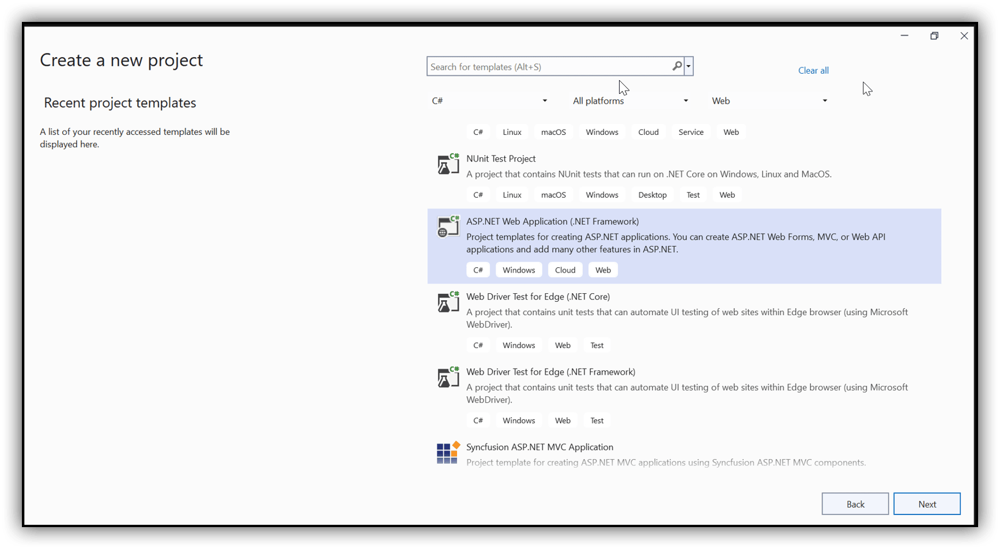
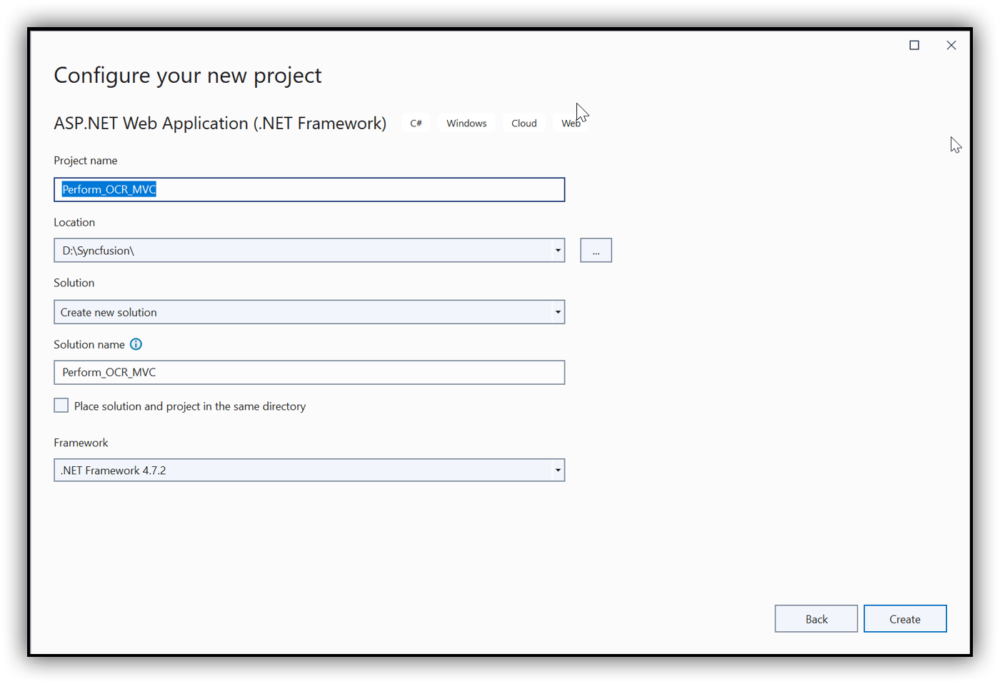
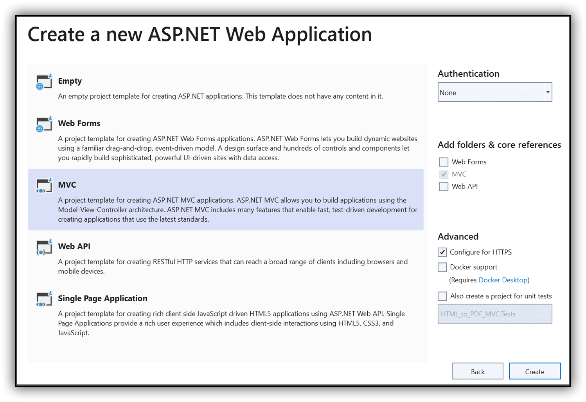
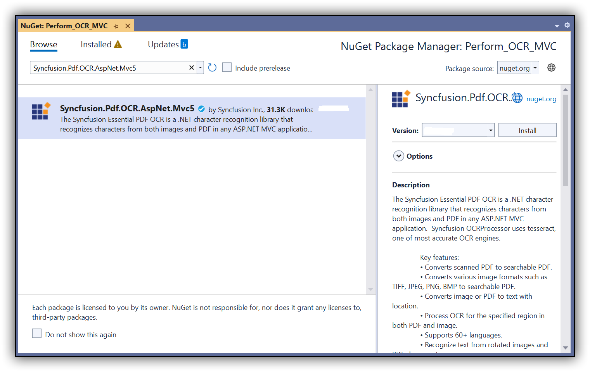

# Perform OCR in ASP.NET MVC

The [Syncfusion .NET OCR library](https://www.syncfusion.com/document-processing/pdf-framework/net/pdf-library/ocr-process) is used to extract text from scanned PDFs and images in ASP.NET MVC application with the help of Google's [Tesseract](https://github.com/tesseract-ocr/tesseract) Optical Character Recognition engine. 

## Steps to perform OCR on entire PDF document in ASP.NET MVC

Step 1: Create a new C# ASP.NET Web Application (.NET Framework) project.

Step 2: In the project configuration windows, name your project and click Create.

Step 3: Install the [Syncfusion.Pdf.OCR.AspNet.Mvc5](https://www.nuget.org/packages/Syncfusion.Pdf.OCR.AspNet.Mvc5) NuGet package as a reference to your .NET applications from [NuGet.org](https://www.nuget.org/).

N> 1. Beginning from version 21.1.x, the default configuration includes the addition of the TesseractBinaries and Tesseract language data folder paths, eliminating the requirement to explicitly provide these paths.
N> 2. Starting with v16.2.0.x, if you reference Syncfusion assemblies from trial setup or from the NuGet feed, you also have to add "Syncfusion.Licensing" assembly reference and include a license key in your projects. Please refer to this [link](https://help.syncfusion.com/common/essential-studio/licensing/overview) to know about registering Syncfusion license key in your application to use our components.

Step 4: Include the following namespaces in the HomeController.cs file.



using Syncfusion.OCRProcessor;
using Syncfusion.Pdf.Parsing;



Step 5: Add a new button in the *Index.cshtml* as follows.



@{Html.BeginForm("PerformOCR", "Home", FormMethod.Post);
   {
      

         <input type="submit" value="Perform OCR" style="width:150px;height:27px" />
      

   }
   Html.EndForm();
}



Step 6: Add a new action method named PerformOCR in the HomeController.cs file and use the following code sample to perform OCR on the entire PDF document using [PerformOCR](https://help.syncfusion.com/cr/document-processing/Syncfusion.OCRProcessor.OCRProcessor.html#Syncfusion_OCRProcessor_OCRProcessor_PerformOCR_Syncfusion_Pdf_Parsing_PdfLoadedDocument_System_String_) method of the [OCRProcessor](https://help.syncfusion.com/cr/document-processing/Syncfusion.OCRProcessor.OCRProcessor.html) class. 



//Initialize the OCR processor.
using (OCRProcessor processor = new OCRProcessor())
{
   FileStream fileStream = new FileStream("Input.pdf", FileMode.Open, FileAccess.Read);
   //Load a PDF document.
   PdfLoadedDocument lDoc = new PdfLoadedDocument(fileStream);
   //Set OCR language to process.
   processor.Settings.Language = Languages.English;
   processor.Settings.TesseractVersion = TesseractVersion.Version3_05;
   //Process OCR by providing the PDF document.
   processor.PerformOCR(lDoc);
   //Open the document in browser after saving it.
   lDoc.Save("Output.pdf", HttpContext.ApplicationInstance.Response, Syncfusion.Pdf.HttpReadType.Save);
   //Close the document.
   lDoc.Close(true);
   return View();
}



By executing the program, you will get a PDF document as follows.

A complete working sample can be downloaded from the [Github](https://github.com/SyncfusionExamples/OCR-csharp-examples/tree/master/ASP.NET%20MVC).

Click [here](https://www.syncfusion.com/document-processing/pdf-framework/net-core) to explore the rich set of Syncfusion PDF library features.
   