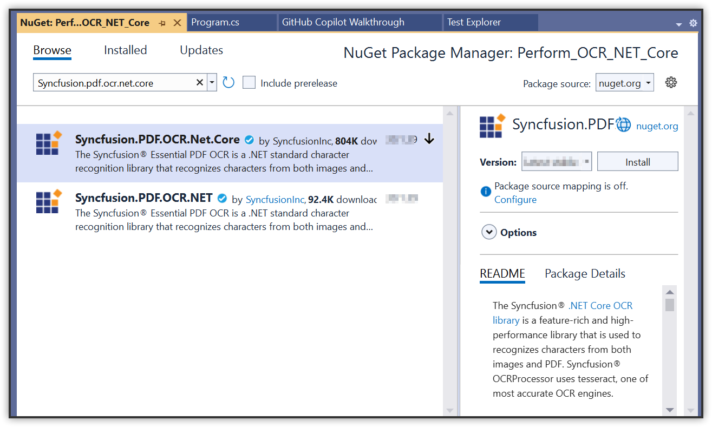

# Perform OCR in Blazor

The [Syncfusion<sup>&reg;</sup> .NET OCR library](https://www.syncfusion.com/document-processing/pdf-framework/net-core/pdf-library/ocr-process) extracts text from scanned PDFs and images in Blazor applications using Google's [Tesseract](https://github.com/tesseract-ocr/tesseract) Optical Character Recognition engine.

## Steps to perform OCR on the entire PDF document in the Blazor application





**Prerequisites**:

* Install .NET SDK: Ensure that the .NET SDK is installed on the system. Download it from the [.NET Downloads page](https://dotnet.microsoft.com/en-us/download).
* Install Visual Studio: Download and install Visual Studio from the [official website](https://visualstudio.microsoft.com/downloads/).

Step 1: Create a new C# Blazor server-side application project. Select **Blazor Web App** from the template and click the Next button.


Step 2: In the **Interactive Render Mode section**, choose `Server` as the render mode. Then, click the `Create` button to generate a new Blazor Server-Side Application.


Step 3: Install the [Syncfusion.PDF.OCR.Net.Core](https://www.nuget.org/packages/Syncfusion.PDF.OCR.Net.Core) NuGet package as a reference to .NET applications from [NuGet.org](https://www.nuget.org/).


N> 1. Beginning from version 21.1.x, the default configuration includes the addition of the TesseractBinaries and Tesseract language data folder paths, eliminating the requirement to explicitly provide these paths.
N> 2. Starting with v16.2.0.x, if referencing Syncfusion<sup>&reg;</sup> assemblies from trial setup or from the NuGet feed, add "Syncfusion.Licensing" assembly reference and include a license key in the project. Refer to this [link](https://help.syncfusion.com/common/essential-studio/licensing/overview) to learn about registering Syncfusion<sup>&reg;</sup> license key in applications to use the components.

Step 4: Create a new class file named *ExportService* under the Data folder and include the following namespaces in the file.



using Syncfusion.OCRProcessor;
using Syncfusion.Pdf.Parsing;
using System.IO;



Step 5: Use the following code sample to perform OCR on the entire PDF document using [PerformOCR](https://help.syncfusion.com/cr/document-processing/Syncfusion.OCRProcessor.OCRProcessor.html#Syncfusion_OCRProcessor_OCRProcessor_PerformOCR_Syncfusion_Pdf_Parsing_PdfLoadedDocument_System_String_) method of the [OCRProcessor](https://help.syncfusion.com/cr/document-processing/Syncfusion.OCRProcessor.OCRProcessor.html) class in the **ExportService** file.  



public MemoryStream CreatePdf()
{   
    //Initialize the OCR processor.
    using (OCRProcessor processor = new OCRProcessor("Tesseractbinaries/Windows"))
    {
        using (FileStream fileStream = new FileStream("Input.pdf", FileMode.Open, FileAccess.Read))
        {
            //Load a PDF document.
            PdfLoadedDocument lDoc = new PdfLoadedDocument(fileStream);
            //Set OCR language to process.
            processor.Settings.Language = Languages.English;
            //Process OCR by providing the PDF document.
            processor.PerformOCR(lDoc, "tessdata/");
            //Create memory stream.
            MemoryStream stream = new MemoryStream();
            //Save the document to memory stream.
            lDoc.Save(stream);
            return stream;
        }
    }
}



Step 6: Register the service in the ConfigureServices method available in the *Startup.cs* class as follows.



public void ConfigureServices(IServiceCollection services)
{
    services.AddRazorPages();
    services.AddServerSideBlazor();
    services.AddSingleton<WeatherForecastService>();
    services.AddSingleton<ExportService>();
}



Step 7: Inject ExportService into *FetchData.razor* using the following code.



@inject ExportService exportService
@inject Microsoft.JSInterop.IJSRuntime JS
@using  System.IO;



Step 8: Create a button in the *FetchData.razor* using the following code.



<button class="btn btn-primary" @onclick="@PerformOCR">Perform OCR</button>



Step 9: Add the PerformOCR method in *FetchData.razor* page to call the export service.



@functions
{
   protected async Task PerformOCR()
   {
       ExportService exportService = new ExportService();
       using (MemoryStream excelStream = exportService.CreatePdf())
       {
           await JS.SaveAs("Output.pdf", excelStream.ToArray());
       }
   }
}



Step 10: Create a class file with the FileUtil name and add the following code to invoke the JavaScript action to download the file in the browser.



public static class FileUtil
{
    public static ValueTask<object> SaveAs(this IJSRuntime js, string filename, byte[] data)
     => js.InvokeAsync<object>(
         "saveAsFile",
         filename,
         Convert.ToBase64String(data));
}



Step 11: Add the following JavaScript function in the *_Host.cshtml* available under the Pages folder.



<script type="text/javascript">
    function saveAsFile(filename, bytesBase64) {
        if (navigator.msSaveBlob) {
            //Download document in Edge browser
            var data = window.atob(bytesBase64);
            var bytes = new Uint8Array(data.length);
            for (var i = 0; i < data.length; i++) {
                bytes[i] = data.charCodeAt(i);
            }
            var blob = new Blob([bytes.buffer], { type: "application/octet-stream" });
            navigator.msSaveBlob(blob, filename);
        }
        else {
            var link = document.createElement('a');
            link.download = filename;
            link.href = "data:application/octet-stream;base64," + bytesBase64;
            document.body.appendChild(link); // Needed for Firefox
            link.click();
            document.body.removeChild(link);
        }
    }
</script>



Step 12: Build the project.

Click on Build > Build Solution or press Ctrl + Shift + B to build the project.

Step 13: Run the project.

Click the Start button (green arrow) or press F5 to run the app.





**Prerequisites**:

* Install .NET SDK: Ensure that the .NET SDK is installed on the system. Download it from the [.NET Downloads page](https://dotnet.microsoft.com/en-us/download).
* Install Visual Studio Code: Download and install Visual Studio Code from the [official website](https://code.visualstudio.com/download).
* Install C# Extension for VS Code: Open Visual Studio Code, go to the Extensions view (Ctrl+Shift+X), and search for 'C#'. Install the official [C# extension provided by Microsoft](https://marketplace.visualstudio.com/items?itemName=ms-dotnettools.csharp).

Step 1: Open the terminal (Ctrl+` ) and run the following command to create a new Blazor Server application

```
dotnet new blazorserver -n CreatePdfBlazorServerApp
```
Step 2: Replace **CreatePdfBlazorServerApp** with the desired project name.

Step 3: Navigate to the project directory using the following command

```
cd CreatePdfBlazorServerApp
```
Step 4: Use the following command in the terminal to add the [Syncfusion.PDF.OCR.Net.Core](https://www.nuget.org/packages/Syncfusion.PDF.OCR.Net.Core) package to the project.

```
dotnet add package Syncfusion.PDF.OCR.Net.Core
```
N> 1. Beginning from version 21.1.x, the default configuration includes the addition of the TesseractBinaries and Tesseract language data folder paths, eliminating the requirement to explicitly provide these paths.
N> 2. Starting with v16.2.0.x, if referencing Syncfusion<sup>&reg;</sup> assemblies from trial setup or from the NuGet feed, add "Syncfusion.Licensing" assembly reference and include a license key in the project. Refer to this [link](https://help.syncfusion.com/common/essential-studio/licensing/overview) to learn about registering Syncfusion<sup>&reg;</sup> license key in applications to use the components.

Step 5: Create a new class file named *ExportService* under the Data folder and include the following namespaces in the file.



using Syncfusion.OCRProcessor;
using Syncfusion.Pdf.Parsing;
using System.IO;



Step 6: Use the following code sample to perform OCR on the entire PDF document using [PerformOCR](https://help.syncfusion.com/cr/document-processing/Syncfusion.OCRProcessor.OCRProcessor.html#Syncfusion_OCRProcessor_OCRProcessor_PerformOCR_Syncfusion_Pdf_Parsing_PdfLoadedDocument_System_String_) method of the [OCRProcessor](https://help.syncfusion.com/cr/document-processing/Syncfusion.OCRProcessor.OCRProcessor.html) class in the **ExportService** file.  



public MemoryStream CreatePdf()
{   
    //Initialize the OCR processor.
    using (OCRProcessor processor = new OCRProcessor("Tesseractbinaries/Windows"))
    {
        using (FileStream fileStream = new FileStream("Input.pdf", FileMode.Open, FileAccess.Read))
        {
            //Load a PDF document.
            PdfLoadedDocument lDoc = new PdfLoadedDocument(fileStream);
            //Set OCR language to process.
            processor.Settings.Language = Languages.English;
            //Process OCR by providing the PDF document.
            processor.PerformOCR(lDoc, "tessdata/");
            //Create memory stream.
            MemoryStream stream = new MemoryStream();
            //Save the document to memory stream.
            lDoc.Save(stream);
            return stream;
        }
    }
}



Step 7: Register the service in the ConfigureServices method available in the *Startup.cs* class as follows.



public void ConfigureServices(IServiceCollection services)
{
    services.AddRazorPages();
    services.AddServerSideBlazor();
    services.AddSingleton<WeatherForecastService>();
    services.AddSingleton<ExportService>();
}



Step 8: Inject ExportService into *FetchData.razor* using the following code.



@inject ExportService exportService
@inject Microsoft.JSInterop.IJSRuntime JS
@using  System.IO;



Step 9: Create a button in the *FetchData.razor* using the following code.



<button class="btn btn-primary" @onclick="@PerformOCR">Perform OCR</button>



Step 10: Add the PerformOCR method in *FetchData.razor* page to call the export service.



@functions
{
   protected async Task PerformOCR()
   {
       ExportService exportService = new ExportService();
       using (MemoryStream excelStream = exportService.CreatePdf())
       {
           await JS.SaveAs("Output.pdf", excelStream.ToArray());
       }
   }
}



Step 11: Create a class file with the FileUtil name and add the following code to invoke the JavaScript action to download the file in the browser.



public static class FileUtil
{
    public static ValueTask<object> SaveAs(this IJSRuntime js, string filename, byte[] data)
     => js.InvokeAsync<object>(
         "saveAsFile",
         filename,
         Convert.ToBase64String(data));
}



Step 12: Add the following JavaScript function in the *_Host.cshtml* available under the Pages folder.



<script type="text/javascript">
    function saveAsFile(filename, bytesBase64) {
        if (navigator.msSaveBlob) {
            //Download document in Edge browser
            var data = window.atob(bytesBase64);
            var bytes = new Uint8Array(data.length);
            for (var i = 0; i < data.length; i++) {
                bytes[i] = data.charCodeAt(i);
            }
            var blob = new Blob([bytes.buffer], { type: "application/octet-stream" });
            navigator.msSaveBlob(blob, filename);
        }
        else {
            var link = document.createElement('a');
            link.download = filename;
            link.href = "data:application/octet-stream;base64," + bytesBase64;
            document.body.appendChild(link); // Needed for Firefox
            link.click();
            document.body.removeChild(link);
        }
    }
</script>



Step 13: Build the project.

Run the following command in terminal to build the project.

```
dotnet build
```

Step 14: Run the project.

Run the following command in terminal to run the project.

```
dotnet run
```




**Prerequisites:**

* JetBrains Rider.
* Install .NET 8 SDK or later.

Step 1. Open JetBrains Rider and create a new Blazor server-side app project.
* Launch JetBrains Rider.
* Click new solution on the welcome screen.


* In the new Solution dialog, select Project Type as Web.
* Enter a project name and specify the location.
* Choose template as **Blazor Server App**.
* Select the target framework (e.g., .NET 8.0, .NET 9.0).
* Click create.


Step 2: Install the NuGet package from [NuGet.org](https://www.nuget.org/).
* Click the NuGet icon in the Rider toolbar and type [Syncfusion.PDF.OCR.Net.Core](https://www.nuget.org/packages/Syncfusion.PDF.OCR.Net.Core) in the search bar.
* Ensure that "nuget.org" is selected as the package source.
* Select the latest Syncfusion.PDF.OCR.Net.Core NuGet package from the list.
* Click the + (Add) button to add the package.


* Click the Install button to complete the installation.


N> 1. Beginning from version 21.1.x, the default configuration includes the addition of the TesseractBinaries and Tesseract language data folder paths, eliminating the requirement to explicitly provide these paths.
N> 2. Starting with v16.2.0.x, if referencing Syncfusion<sup>&reg;</sup> assemblies from trial setup or from the NuGet feed, add "Syncfusion.Licensing" assembly reference and include a license key in the project. Refer to this [link](https://help.syncfusion.com/common/essential-studio/licensing/overview) to learn about registering Syncfusion<sup>&reg;</sup> license key in applications to use the components.

Step 3: Create a new class file named *ExportService* under the Data folder and include the following namespaces in the file.



using Syncfusion.OCRProcessor;
using Syncfusion.Pdf.Parsing;
using System.IO;



Step 4: Use the following code sample to perform OCR on the entire PDF document using [PerformOCR](https://help.syncfusion.com/cr/document-processing/Syncfusion.OCRProcessor.OCRProcessor.html#Syncfusion_OCRProcessor_OCRProcessor_PerformOCR_Syncfusion_Pdf_Parsing_PdfLoadedDocument_System_String_) method of the [OCRProcessor](https://help.syncfusion.com/cr/document-processing/Syncfusion.OCRProcessor.OCRProcessor.html) class in the **ExportService** file.  



public MemoryStream CreatePdf()
{   
    //Initialize the OCR processor.
    using (OCRProcessor processor = new OCRProcessor("Tesseractbinaries/Windows"))
    {
        using (FileStream fileStream = new FileStream("Input.pdf", FileMode.Open, FileAccess.Read))
        {
            //Load a PDF document.
            PdfLoadedDocument lDoc = new PdfLoadedDocument(fileStream);
            //Set OCR language to process.
            processor.Settings.Language = Languages.English;
            //Process OCR by providing the PDF document.
            processor.PerformOCR(lDoc, "tessdata/");
            //Create memory stream.
            MemoryStream stream = new MemoryStream();
            //Save the document to memory stream.
            lDoc.Save(stream);
            return stream;
        }
    }
}



Step 5: Register the service in the ConfigureServices method available in the *Startup.cs* class as follows.



public void ConfigureServices(IServiceCollection services)
{
    services.AddRazorPages();
    services.AddServerSideBlazor();
    services.AddSingleton<WeatherForecastService>();
    services.AddSingleton<ExportService>();
}



Step 6: Inject ExportService into *FetchData.razor* using the following code.



@inject ExportService exportService
@inject Microsoft.JSInterop.IJSRuntime JS
@using  System.IO;



Step 7: Create a button in the *FetchData.razor* using the following code.



<button class="btn btn-primary" @onclick="@PerformOCR">Perform OCR</button>



Step 8: Add the PerformOCR method in *FetchData.razor* page to call the export service.



@functions
{
   protected async Task PerformOCR()
   {
       ExportService exportService = new ExportService();
       using (MemoryStream excelStream = exportService.CreatePdf())
       {
           await JS.SaveAs("Output.pdf", excelStream.ToArray());
       }
   }
}



Step 9: Create a class file with the FileUtil name and add the following code to invoke the JavaScript action to download the file in the browser.



public static class FileUtil
{
    public static ValueTask<object> SaveAs(this IJSRuntime js, string filename, byte[] data)
     => js.InvokeAsync<object>(
         "saveAsFile",
         filename,
         Convert.ToBase64String(data));
}



Step 10: Add the following JavaScript function in the *_Host.cshtml* available under the Pages folder.



<script type="text/javascript">
    function saveAsFile(filename, bytesBase64) {
        if (navigator.msSaveBlob) {
            //Download document in Edge browser
            var data = window.atob(bytesBase64);
            var bytes = new Uint8Array(data.length);
            for (var i = 0; i < data.length; i++) {
                bytes[i] = data.charCodeAt(i);
            }
            var blob = new Blob([bytes.buffer], { type: "application/octet-stream" });
            navigator.msSaveBlob(blob, filename);
        }
        else {
            var link = document.createElement('a');
            link.download = filename;
            link.href = "data:application/octet-stream;base64," + bytesBase64;
            document.body.appendChild(link); // Needed for Firefox
            link.click();
            document.body.removeChild(link);
        }
    }
</script>



Step 11: Build the project.

Click the **Build** button in the toolbar or press <kbd>Ctrl</kbd>+<kbd>Shift</kbd>+<kbd>B</kbd> to build the project.

Step 12: Run the project.

Click the **Run** button (green arrow) in the toolbar or press <kbd>F5</kbd> to run the app.





The following output appears in the browser after running the program.


Click the button and obtain a PDF document with the following output.

    
A complete working sample can be downloaded from [Github](https://github.com/SyncfusionExamples/OCR-csharp-examples/tree/master/Blazor).

Click [here](https://www.syncfusion.com/document-processing/pdf-framework/blazor) to explore the rich set of Syncfusion<sup>&reg;</sup> PDF library features.