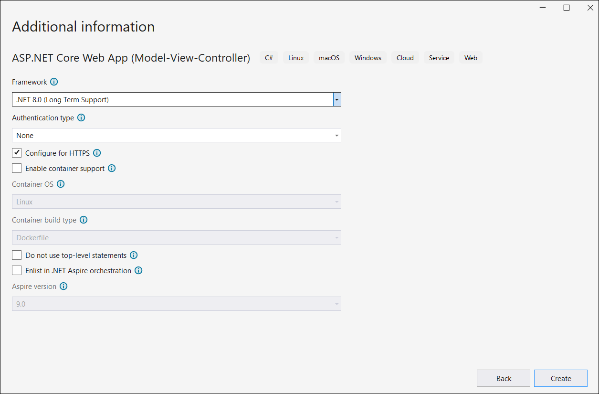

# Perform OCR in ASP.NET Core

The [Syncfusion<sup>&reg;</sup> .NET OCR library](https://www.syncfusion.com/document-processing/pdf-framework/net-core/pdf-library/ocr-process) is used to extract text from the scanned PDFs and images in the ASP.NET Core application with the help of Google's [Tesseract](https://github.com/tesseract-ocr/tesseract) Optical Character Recognition engine.

## Steps to perform OCR on entire PDF document in ASP.NET Core application





**Prerequisites**:

* Install .NET SDK: Ensure that you have the .NET SDK installed on your system. You can download it from the [.NET Downloads page](https://dotnet.microsoft.com/en-us/download).
* Install Visual Studio: Download and install Visual Studio from the [official website](https://visualstudio.microsoft.com/downloads/).

Step 1: Create a new C# ASP.NET Core Web Application project.
   

Step 2:  In configuration windows, name your project and click Next.




Step 3:  Install the [Syncfusion.PDF.OCR.NET](https://www.nuget.org/packages/Syncfusion.PDF.OCR.NET) NuGet package as a reference to your .NET Standard applications from [NuGet.org](https://www.nuget.org/).   


N> 1. Beginning from version 21.1.x, the default configuration includes the addition of the TesseractBinaries and Tesseract language data folder paths, eliminating the requirement to explicitly provide these paths.
N> 2. Starting with v16.2.0.x, if you reference Syncfusion<sup>&reg;</sup> assemblies from trial setup or from the NuGet feed, you also have to add "Syncfusion.Licensing" assembly reference and include a license key in your projects. Please refer to this [link](https://help.syncfusion.com/common/essential-studio/licensing/overview) to know about registering Syncfusion<sup>&reg;</sup> license key in your application to use our components.

Step 4: A default controller with the name HomeController.cs gets added to the creation of the ASP.NET Core MVC project. Include the following namespaces in that HomeController.cs file.



using Syncfusion.OCRProcessor;
using Syncfusion.Pdf.Parsing;



Step 5: Add a new button in index.cshtml as follows.



@{Html.BeginForm("PerformOCR", "Home", FormMethod.Post);
   {
      <div>
         <input type="submit" value="Perform OCR" style="width:150px;height:27px" />
      </div>
   }
   Html.EndForm();
}



Step 6: Add a new action method named PerformOCR in the HomeController.cs and use the following code sample to perform OCR on the entire PDF document using [PerformOCR](https://help.syncfusion.com/cr/document-processing/Syncfusion.OCRProcessor.OCRProcessor.html#Syncfusion_OCRProcessor_OCRProcessor_PerformOCR_Syncfusion_Pdf_Parsing_PdfLoadedDocument_System_String_) method of the [OCRProcessor](https://help.syncfusion.com/cr/document-processing/Syncfusion.OCRProcessor.OCRProcessor.html) class. 



//Initialize the OCR processor.
using (OCRProcessor processor = new OCRProcessor())
{
   FileStream fileStream = new FileStream("Input.pdf", FileMode.Open, FileAccess.Read);
   //Load a PDF document.
   PdfLoadedDocument lDoc = new PdfLoadedDocument(fileStream);
   //Set OCR language to process.
   processor.Settings.Language = Languages.English;
   //Process OCR by providing the PDF document.
   processor.PerformOCR(lDoc);
   //Create memory stream.
   MemoryStream stream = new MemoryStream();
   //Save the document to memory stream.
   lDoc.Save(stream);
   lDoc.Close();
   //Set the position as '0'.
   stream.Position = 0;
   //Download the PDF document in the browser.
   FileStreamResult fileStreamResult = new FileStreamResult(stream, "application/pdf");
   fileStreamResult.FileDownloadName = "Sample.pdf";
   return fileStreamResult;
}



Step 7: Build the project.

Click on Build > Build Solution or press Ctrl + Shift + B to build the project.

Step 8: Run the project.

Click the Start button (green arrow) or press F5 to run the app.





**Prerequisites**:

* Install .NET SDK: Ensure that you have the .NET SDK installed on your system. You can download it from the [.NET Downloads page](https://dotnet.microsoft.com/en-us/download).
* Install Visual Studio Code: Download and install Visual Studio Code from the [official website](https://code.visualstudio.com/download).
* Install C# Extension for VS Code: Open Visual Studio Code, go to the Extensions view (Ctrl+Shift+X), and search for 'C#'. Install the official [C# extension provided by Microsoft](https://marketplace.visualstudio.com/items?itemName=ms-dotnettools.csharp).

Step 1: Open the terminal (Ctrl+` ) and run the following command to create a new C# ASP.NET Core Web Application project.

```
dotnet new mvc -n CreatePdfASPNETCoreAPP
```
Step 2: Replace ****CreatePdfASPNETCoreAPP** with your desired project name.

Step 3: Navigate to the project directory using the following command

```
cd CreatePdfASPNETCoreAPP
```
Step 4: Use the following command in the terminal to add the [Syncfusion.PDF.OCR.NET](https://www.nuget.org/packages/Syncfusion.PDF.OCR.NET) package to your project.

```
dotnet add package Syncfusion.PDF.OCR.NET
```
N> 1. Beginning from version 21.1.x, the default configuration includes the addition of the TesseractBinaries and Tesseract language data folder paths, eliminating the requirement to explicitly provide these paths.
N> 2. Starting with v16.2.0.x, if you reference Syncfusion<sup>&reg;</sup> assemblies from trial setup or from the NuGet feed, you also have to add "Syncfusion.Licensing" assembly reference and include a license key in your projects. Please refer to this [link](https://help.syncfusion.com/common/essential-studio/licensing/overview) to know about registering Syncfusion<sup>&reg;</sup> license key in your application to use our components.

Step 5: A default controller with the name HomeController.cs gets added to the creation of the ASP.NET Core MVC project. Include the following namespaces in that HomeController.cs file.



using Syncfusion.OCRProcessor;
using Syncfusion.Pdf.Parsing;



Step 6: Add a new button in index.cshtml as follows.



@{Html.BeginForm("PerformOCR", "Home", FormMethod.Post);
   {
      <div>
         <input type="submit" value="Perform OCR" style="width:150px;height:27px" />
      </div>
   }
   Html.EndForm();
}



Step 7: Add a new action method named PerformOCR in the HomeController.cs and use the following code sample to perform OCR on the entire PDF document using [PerformOCR](https://help.syncfusion.com/cr/document-processing/Syncfusion.OCRProcessor.OCRProcessor.html#Syncfusion_OCRProcessor_OCRProcessor_PerformOCR_Syncfusion_Pdf_Parsing_PdfLoadedDocument_System_String_) method of the [OCRProcessor](https://help.syncfusion.com/cr/document-processing/Syncfusion.OCRProcessor.OCRProcessor.html) class. 



//Initialize the OCR processor.
using (OCRProcessor processor = new OCRProcessor())
{
   FileStream fileStream = new FileStream("Input.pdf", FileMode.Open, FileAccess.Read);
   //Load a PDF document.
   PdfLoadedDocument lDoc = new PdfLoadedDocument(fileStream);
   //Set OCR language to process.
   processor.Settings.Language = Languages.English;
   //Process OCR by providing the PDF document.
   processor.PerformOCR(lDoc);
   //Create memory stream.
   MemoryStream stream = new MemoryStream();
   //Save the document to memory stream.
   lDoc.Save(stream);
   lDoc.Close();
   //Set the position as '0'.
   stream.Position = 0;
   //Download the PDF document in the browser.
   FileStreamResult fileStreamResult = new FileStreamResult(stream, "application/pdf");
   fileStreamResult.FileDownloadName = "Sample.pdf";
   return fileStreamResult;
}


Step 8: Build the project.

Run the following command in terminal to build the project.

```
dotnet build
```

Step 9: Run the project.

Run the following command in terminal to build the project.

```
dotnet run
```




By executing the program, you will get a PDF document as follows.

 
A complete working sample can be downloaded from the [Github](https://github.com/SyncfusionExamples/OCR-csharp-examples/tree/master/ASP.NET%20Core).

Click [here](https://www.syncfusion.com/document-processing/pdf-framework/net-core) to explore the rich set of Syncfusion<sup>&reg;</sup> PDF library features.