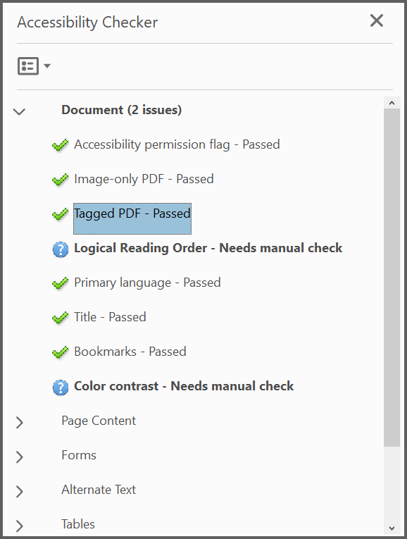

# Working with Tagged PDF

## Introduction

The Tagged PDF is a PDF that includes structure in terms for a set of instruction that defines reading order and meaning of significant elements such as figures, images, lists, tables and more. Tagged PDF documents created using Syncfusion<sup>&reg;</sup> PDF library are compliant with section 508 (PDF/UA) standard or WCAG 2.0 standard (ISO 14289-1:2014).
Usually tagged PDF used to making content accessible to users who rely on assistive technology.

This section explains how to add tags to PDF elements such as text element, image, shapes, form fields, annotations, table, list, and more

To quickly get started with creating accessible PDF documents in .NET using the PDF Library, please check this video.


## Adding tag to text element

You can add tag to text or paragraphs in PDF document by using the [PdfTag](https://help.syncfusion.com/cr/document-processing/Syncfusion.Pdf.Graphics.PdfLayoutElement.html#Syncfusion_Pdf_Graphics_PdfLayoutElement_PdfTag) property available in the [PdfTextElement](https://help.syncfusion.com/cr/document-processing/Syncfusion.Pdf.Graphics.PdfTextElement.html) class and specifying the tag type as ```Paragraph``` of [PdfTagType](https://help.syncfusion.com/cr/document-processing/Syncfusion.Pdf.PdfTagType.html) Enum in the [PdfStructureElement](https://help.syncfusion.com/cr/document-processing/Syncfusion.Pdf.PdfStructureElement.html) class.

The following code sample explains you how to add tag for the text element in PDF document.



{% highlight c# tabtitle="C# [Cross-platform]" playgroundButtonLink="https://raw.githubusercontent.com/SyncfusionExamples/PDF-Examples/master/Tagged%20PDF/Add-tag-for-the-text-element-in-PDF-document/.NET/Add-tag-for-the-text-element-in-PDF-document/Program.cs" %} 

using Syncfusion.Drawing;
using Syncfusion.Pdf;
using Syncfusion.Pdf.Graphics;

//Creates new PDF document
PdfDocument doc = new PdfDocument();
//Set the document title
doc.DocumentInformation.Title = "PdfTextElement";
//Creates new page
PdfPage page = doc.Pages.Add();

//Initialize the structure element with tag type paragraph
PdfStructureElement structureElement = new PdfStructureElement(PdfTagType.Paragraph);
//Represents the text that is exact replacement for PdfTextElement
structureElement.ActualText = "Simple paragraph element";

string text = "Adventure Works Cycles, the fictitious company on which the AdventureWorks sample databases are based, is a large, multinational manufacturing company. The company manufactures and sells metal and composite bicycles to North American, European and Asian commercial markets. While its base operation is located in Washington with 290 employees, several regional sales teams are located throughout their market base.";

//Initialize the PDF text element
PdfTextElement element = new PdfTextElement(text);
//Adding tag to the text element
element.PdfTag = structureElement;
//Creates font for the text element
element.Font = new PdfStandardFont(PdfFontFamily.TimesRoman, 12);
element.Brush = new PdfSolidBrush(new PdfColor(89, 89, 93));

//Draws text
PdfLayoutResult result = element.Draw(page, new RectangleF(0, 0, page.Graphics.ClientSize.Width, 200));

//Save the document and dispose it
doc.Save("Output.pdf");
doc.Close(true);





using System.Drawing;
using Syncfusion.Pdf;
using Syncfusion.Pdf.Graphics;

//Creates new PDF document
PdfDocument doc = new PdfDocument();
//Set the document title
doc.DocumentInformation.Title = "PdfTextElement";
//Creates new page
PdfPage page = doc.Pages.Add();

//Initialize the structure element with tag type paragraph
PdfStructureElement structureElement = new PdfStructureElement(PdfTagType.Paragraph);
//represents the text that is exact replacement for PdfTextElement
structureElement.ActualText = "Simple paragraph element";

string text = "Adventure Works Cycles, the fictitious company on which the AdventureWorks sample databases are based, is a large, multinational manufacturing company. The company manufactures and sells metal and composite bicycles to North American, European and Asian commercial markets. While its base operation is located in Washington with 290 employees, several regional sales teams are located throughout their market base.";

//Initialize the PDF text element
PdfTextElement element = new PdfTextElement(text);
//Adding tag to the text element
element.PdfTag = structureElement;
//Creates font for the text element
element.Font = new PdfStandardFont(PdfFontFamily.TimesRoman, 12);
element.Brush = new PdfSolidBrush(new PdfColor(89, 89, 93));

//Draws text
PdfLayoutResult result = element.Draw(page, new RectangleF(0, 0, page.Graphics.ClientSize.Width, 200));

//Save the document and dispose it
doc.Save("Output.pdf");
doc.Close(true);





Imports Syncfusion.Drawing
Imports Syncfusion.Pdf
Imports Syncfusion.Pdf.Graphics

'Creates new PDF document
Dim doc As PdfDocument = New PdfDocument()
'Set the document title
doc.DocumentInformation.Title = "PdfTextElement"
'Creates new page
Dim page As PdfPage = doc.Pages.Add()

'Initialize the structure element with tag type paragraph
Dim structureElement As PdfStructureElement = New PdfStructureElement(PdfTagType.Paragraph)
'represents the text that is exact replacement for PdfTextElement
structureElement.ActualText = "Simple paragraph element"

Dim text As String = "Adventure Works Cycles, the fictitious company on which the AdventureWorks sample databases are based, is a large, multinational manufacturing company. The company manufactures and sells metal and composite bicycles to North American, European and Asian commercial markets. While its base operation is located in Washington with 290 employees, several regional sales teams are located throughout their market base."

'Initialize the PDF text element
Dim element As PdfTextElement = New PdfTextElement(text)
'Adding tag to the text element
element.PdfTag = structureElement
'Creates font for the text element
element.Font = New PdfStandardFont(PdfFontFamily.TimesRoman, 12)
element.Brush = New PdfSolidBrush(New PdfColor(89, 89, 93))

'Draws text
Dim result As PdfLayoutResult = element.Draw(page, New RectangleF(0, 0, page.Graphics.ClientSize.Width, 200))

'Save the document and dispose it
doc.Save("Output.pdf")
doc.Close(True)





You can download a complete working sample from [GitHub](https://github.com/SyncfusionExamples/PDF-Examples/tree/master/Tagged%20PDF/Add-tag-for-the-text-element-in-PDF-document).

## Adding tag to image

You can add tag to image in the PDF document by using the [PdfTag](https://help.syncfusion.com/cr/document-processing/Syncfusion.Pdf.Graphics.PdfLayoutElement.html#Syncfusion_Pdf_Graphics_PdfLayoutElement_PdfTag) property available in the [PdfBitmap](https://help.syncfusion.com/cr/document-processing/Syncfusion.Pdf.Graphics.PdfBitmap.html) class and specifying the tag type as ```Figure``` of [PdfTagType](https://help.syncfusion.com/cr/document-processing/Syncfusion.Pdf.PdfTagType.html) Enum in the [PdfStructureElement](https://help.syncfusion.com/cr/document-processing/Syncfusion.Pdf.PdfStructureElement.html) class. You can add alternate text to image by using the the [AlternateText](https://help.syncfusion.com/cr/document-processing/Syncfusion.Pdf.PdfStructureElement.html#Syncfusion_Pdf_PdfStructureElement_AlternateText) property available in the ```PdfStructureElement``` class.

The following code explains how to add tag for image element in PDF document.



{% highlight c# tabtitle="C# [Cross-platform]" playgroundButtonLink="https://raw.githubusercontent.com/SyncfusionExamples/PDF-Examples/master/Tagged%20PDF/Add-tag-for-image-element-in-PDF-document/.NET/Add-tag-for-image-element-in-PDF-document/Program.cs" %} 

using Syncfusion.Drawing;
using Syncfusion.Pdf;
using Syncfusion.Pdf.Graphics;

//Creates new PDF document
PdfDocument doc = new PdfDocument();
//Set the document title
doc.DocumentInformation.Title = "Image";
//Creates new page
PdfPage page = doc.Pages.Add();
FileStream fontStream = new FileStream("Arial.ttf", FileMode.Open, FileAccess.Read);
PdfFont font = new PdfTrueTypeFont(fontStream, 14);
//Draw string
page.Graphics.DrawString("JPEG Image:", font, PdfBrushes.Blue, new PointF(0, 0));

//Load the image as stream
FileStream imageStream = new FileStream("syncfusion.jpg", FileMode.Open, FileAccess.Read);
//Create a new PDF bitmap object
PdfBitmap bitmap = new PdfBitmap(imageStream);
//Set the tag type
PdfStructureElement imageElement = new PdfStructureElement(PdfTagType.Figure);
//Set the alternate text
imageElement.AlternateText = "GreenTree";
//adding tag to the PDF image
bitmap.PdfTag = imageElement;
//Draw image
bitmap.Draw(page.Graphics, new PointF(50, 20));

//Save the document and dispose it
doc.Save("Image.pdf");
doc.Close(true);





using System.Drawing;
using Syncfusion.Pdf;
using Syncfusion.Pdf.Graphics;

//Creates new PDF document
PdfDocument doc = new PdfDocument();
//Set the document title
doc.DocumentInformation.Title = "Image";
//Creates new page
PdfPage page = doc.Pages.Add();

//Draw string
page.Graphics.DrawString("JPEG Image:", new PdfTrueTypeFont(new Font("Arial", 14), true), PdfBrushes.Blue, new PointF(0, 0));

//Create a new PDF bitmap object
PdfBitmap bitmap = new PdfBitmap("syncfusion.jpg");
//Set the tag type
PdfStructureElement imageElement = new PdfStructureElement(PdfTagType.Figure);
//Set the alternate text
imageElement.AlternateText = "GreenTree";
//adding tag to the PDF image
bitmap.PdfTag = imageElement;
//Draw image
bitmap.Draw(page.Graphics, new PointF(50, 20));

//Save the document and dispose it
doc.Save("Image.pdf");
doc.Close(true);





Imports System.Drawing
Imports Syncfusion.Pdf
Imports Syncfusion.Pdf.Graphics

'Creates new PDF document
Dim doc As PdfDocument = New PdfDocument()
'Set the document title
doc.DocumentInformation.Title = "Image"
'Creates new page
Dim page As PdfPage = doc.Pages.Add()

'Draw string
page.Graphics.DrawString("JPEG Image:", New PdfTrueTypeFont(new Font("Arial", 14), True), PdfBrushes.Blue, New PointF(0, 0))

'Create a new PDF bitmap object
Dim bitmap As PdfBitmap = New PdfBitmap("syncfusion.jpg")
'Set the tag type
Dim imageElement As PdfStructureElement = New PdfStructureElement(PdfTagType.Figure)
'Set the alternate text
imageElement.AlternateText = "GreenTree"
'adding tag to the PDF image
bitmap.PdfTag = imageElement
'Draw image
bitmap.Draw(page.Graphics, New PointF(50, 20))

'Save the document and dispose it
doc.Save("Image.pdf")
doc.Close(True) 





You can download a complete working sample from [GitHub](https://github.com/SyncfusionExamples/PDF-Examples/tree/master/Tagged%20PDF/Add-tag-for-image-element-in-PDF-document).

## Adding tag to shapes

You can add tag to shapes such as rectangle, line, circle, polygon, and more by using the [PdfTag](https://help.syncfusion.com/cr/document-processing/Syncfusion.Pdf.Graphics.PdfLayoutElement.html#Syncfusion_Pdf_Graphics_PdfLayoutElement_PdfTag) property and specifying the tag type as ```Figure``` of [PdfTagType](https://help.syncfusion.com/cr/document-processing/Syncfusion.Pdf.PdfTagType.html) Enum. You can add alternate text to shapes by using the the [AlternateText](https://help.syncfusion.com/cr/document-processing/Syncfusion.Pdf.PdfStructureElement.html#Syncfusion_Pdf_PdfStructureElement_AlternateText) property available in the [PdfStructureElement](https://help.syncfusion.com/cr/document-processing/Syncfusion.Pdf.PdfStructureElement.html) class.

The following code explains how to add tag for shape element in the PDF document.



{% highlight c# tabtitle="C# [Cross-platform]" playgroundButtonLink="https://raw.githubusercontent.com/SyncfusionExamples/PDF-Examples/master/Tagged%20PDF/Adding-tag-to-shape-element-in-the-PDF-document/.NET/Adding-tag-to-shape-element-in-the-PDF-document/Program.cs" %} 

using Syncfusion.Drawing;
using Syncfusion.Pdf;
using Syncfusion.Pdf.Graphics;

//Creates new PDF document
PdfDocument doc = new PdfDocument();
//Set the document title
doc.DocumentInformation.Title = "LineShape";
//Add new page
PdfPage page = doc.Pages.Add();
//Load the TrueType font from the local *.ttf file.
FileStream fontStream = new FileStream("Arial.ttf", FileMode.Open, FileAccess.Read);
PdfFont font = new PdfTrueTypeFont(fontStream, 14);

//Draw text
page.Graphics.DrawString("Line Shape:", font, PdfBrushes.Blue, new PointF(30, 80));

//Initialize structure element with tag type as figure
PdfStructureElement element = new PdfStructureElement(PdfTagType.Figure);
//Set alternate text
element.AlternateText = "Line Sample";
//Initialize the line shape
PdfLine line = new PdfLine(100, 100, 100, 300);
line.Pen = new PdfPen(Color.Red);
//Adding tag to the line element
line.PdfTag = element;
//Draws the line
line.Draw(page.Graphics);

//Save the document and dispose it
doc.Save("Output.pdf");
doc.Close(true);





using System.Drawing;
using Syncfusion.Pdf;
using Syncfusion.Pdf.Graphics;

//Creates new PDF document
PdfDocument doc = new PdfDocument();
//Set the document title
doc.DocumentInformation.Title = "LineShape";
//Add new page
PdfPage page = doc.Pages.Add();

//Draw text
page.Graphics.DrawString("Line Shape:", new PdfTrueTypeFont(new Font("Arial", 14), true), PdfBrushes.Blue, new PointF(30, 80));

//Initialize structure element with tag type as Figure
PdfStructureElement element = new PdfStructureElement(PdfTagType.Figure);
//Set alternate text
element.AlternateText = "Line Sample";
//Initialize the line shape
PdfLine line = new PdfLine(100, 100, 100, 300);
line.Pen = new PdfPen(Color.Red);
//Adding tag to the line element
line.PdfTag = element;
//Draws the line
line.Draw(page.Graphics);

//Save the document and dispose it
doc.Save("Output.pdf"); 
doc.Close(true);





Imports System.Drawing
Imports Syncfusion.Pdf
Imports Syncfusion.Pdf.Graphics

'Creates new PDF document
Dim doc As PdfDocument = New PdfDocument()
'Set the document title
doc.DocumentInformation.Title = "LineShape"
'Add new page
Dim page As PdfPage = doc.Pages.Add()

'Draw text
page.Graphics.DrawString("Line Shape:", New PdfTrueTypeFont(new Font("Arial", 14), True), PdfBrushes.Blue, New PointF(30, 80))

'Initialize structure element with tag type as Figure
Dim element As PdfStructureElement = New PdfStructureElement(PdfTagType.Figure)
'Set alternate text
element.AlternateText = "Line Sample"
'Initialize the line shape
Dim line As PdfLine = New PdfLine(100, 100, 100, 300)
line.Pen = New PdfPen(Color.Red)
'Adding tag to the line element
line.PdfTag = element
'Draws the line
line.Draw(page.Graphics)

'Save the document and dispose it
doc.Save("Output.pdf")
doc.Close(true)





You can download a complete working sample from [GitHub](https://github.com/SyncfusionExamples/PDF-Examples/tree/master/Tagged%20PDF/Adding-tag-to-shape-element-in-the-PDF-document).

## Adding tag to Form Fields

You can tag the form fields in the PDF document by using the [PdfTag](https://help.syncfusion.com/cr/document-processing/Syncfusion.Pdf.Graphics.PdfLayoutElement.html#Syncfusion_Pdf_Graphics_PdfLayoutElement_PdfTag) and specifying the tag type as ```Form``` of [PdfTagType](https://help.syncfusion.com/cr/document-processing/Syncfusion.Pdf.PdfTagType.html) Enum.

The following code explains how to add tag for the form fields in PDF document.



{% highlight c# tabtitle="C# [Cross-platform]" playgroundButtonLink="https://raw.githubusercontent.com/SyncfusionExamples/PDF-Examples/master/Tagged%20PDF/Adding-tag-to-form-fields-in-the-PDF-document/.NET/Adding-tag-to-form-fields-in-the-PDF-document/Program.cs" %} 

using Syncfusion.Drawing;
using Syncfusion.Pdf;
using Syncfusion.Pdf.Graphics;
using Syncfusion.Pdf.Interactive;

//Creates new PDF document
PdfDocument doc = new PdfDocument();
//Set document information 
doc.DocumentInformation.Title = "Form Fields";
//Adds new page
PdfPage page = doc.Pages.Add();

//Create a text box field
PdfTextBoxField textBoxField = new PdfTextBoxField(page, "This is form field text box");
//Adding tag to the text box field
textBoxField.PdfTag = new PdfStructureElement(PdfTagType.Form);
textBoxField.Text = "Filled text box";
//Set properties to the text box
textBoxField.Font = new PdfStandardFont(PdfFontFamily.Helvetica, 12);
textBoxField.BorderColor = new PdfColor(Color.Gray);
textBoxField.BorderStyle = PdfBorderStyle.Beveled;
textBoxField.Bounds = new RectangleF(200, 0, 90, 20);
textBoxField.ToolTip = "TextBox field";

//Add the form field to the document.
doc.Form.Fields.Add(textBoxField);

//Save the document and dispose it
doc.Save("Output.pdf");
doc.Close(true);





using System.Drawing;
using Syncfusion.Pdf;
using Syncfusion.Pdf.Graphics;
using Syncfusion.Pdf.Interactive;

//Creates new PDF document
PdfDocument doc = new PdfDocument();
//Set the document information 
doc.DocumentInformation.Title = "Form Fields";
//Adds new page
PdfPage page = doc.Pages.Add();

//Create a text box field
PdfTextBoxField textBoxField = new PdfTextBoxField(page, "This is form field text box");
//Adding tag to the text box field
textBoxField.PdfTag = new PdfStructureElement(PdfTagType.Form);
textBoxField.Text = "Filled text box";
//Set properties to the text box
textBoxField.Font = new PdfStandardFont(PdfFontFamily.Helvetica, 12);
textBoxField.BorderColor = new PdfColor(Color.Gray);
textBoxField.BorderStyle = PdfBorderStyle.Beveled;
textBoxField.Bounds = new RectangleF(200, 0, 90, 20);
textBoxField.ToolTip = "TextBox field";

//Add the form field to the document
doc.Form.Fields.Add(textBoxField);

//Save the document and dispose it
doc.Save("Output.pdf");
doc.Close(true);





Imports System.Drawing
Imports Syncfusion.Pdf
Imports Syncfusion.Pdf.Graphics
Imports Syncfusion.Pdf.Interactive

'Creates new PDF document
Dim doc As PdfDocument = New PdfDocument()
'Set the document information 
doc.DocumentInformation.Title = "Form Fields"
'Adds new page
Dim page As PdfPage = doc.Pages.Add()

'Create a text box field
Dim textBoxField As PdfTextBoxField = New PdfTextBoxField(page, "This is form field text box")
'Adding tag to the text box field
textBoxField.PdfTag = New PdfStructureElement(PdfTagType.Form)
textBoxField.Text = "Filled text box"
'Set properties to the text box
textBoxField.Font = New PdfStandardFont(PdfFontFamily.Helvetica, 12)
textBoxField.BorderColor = New PdfColor(Color.Gray)
textBoxField.BorderStyle = PdfBorderStyle.Beveled
textBoxField.Bounds = New RectangleF(200, 0, 90, 20)
textBoxField.ToolTip = "TextBox field"

'Add the form field to the document
doc.Form.Fields.Add(textBoxField)

'Save the document and dispose it
doc.Save("Output.pdf")
doc.Close(True)





You can download a complete working sample from [GitHub](https://github.com/SyncfusionExamples/PDF-Examples/tree/master/Tagged%20PDF/Adding-tag-to-form-fields-in-the-PDF-document).

## Adding tag to Annotation

You can add tags to annotation in PDF document by using the [PdfTag](https://help.syncfusion.com/cr/document-processing/Syncfusion.Pdf.Graphics.PdfLayoutElement.html#Syncfusion_Pdf_Graphics_PdfLayoutElement_PdfTag) property and specifying the tag type as ```Annotation``` of [PdfTagType](https://help.syncfusion.com/cr/document-processing/Syncfusion.Pdf.PdfTagType.html) Enum.

The following code explains how to add tag for the annotations in PDF document.



{% highlight c# tabtitle="C# [Cross-platform]" playgroundButtonLink="https://raw.githubusercontent.com/SyncfusionExamples/PDF-Examples/master/Tagged%20PDF/Adding-tag-to-annotation-in-the-PDF-document/.NET/Adding-tag-to-annotation-in-the-PDF-document/Program.cs" %} 

using Syncfusion.Drawing;
using Syncfusion.Pdf;
using Syncfusion.Pdf.Interactive;

//Creates new PDF document
PdfDocument doc = new PdfDocument();
//Set the document title
doc.DocumentInformation.Title = "LineShape";
//Add new page
PdfPage page = doc.Pages.Add();

//Initialize the structure element with tag type as annotation
PdfStructureElement structureElement = new PdfStructureElement(PdfTagType.Annotation);
structureElement.AlternateText = "Popup Annotation";
RectangleF rectangle = new RectangleF(10, 40, 30, 30);

//Adding tag for the annotation
PdfPopupAnnotation popupAnnotation = new PdfPopupAnnotation(rectangle, "Test popup annotation");
popupAnnotation.PdfTag = structureElement;
popupAnnotation.Border.Width = 4;
popupAnnotation.Border.HorizontalRadius = 20;
popupAnnotation.Border.VerticalRadius = 30;
//Sets the PDF pop-up icon
popupAnnotation.Icon = PdfPopupIcon.NewParagraph;

//Adds this annotation to a new page
page.Annotations.Add(popupAnnotation);

//Save the document and dispose it
doc.Save("Output.pdf");
doc.Close(true);





using System.Drawing;
using Syncfusion.Pdf;
using Syncfusion.Pdf.Interactive;

//Creates new PDF document
PdfDocument doc = new PdfDocument();
//Set the document title
doc.DocumentInformation.Title = "LineShape";
//Add new page
PdfPage page = doc.Pages.Add();

//Initialize the structure element with tag type as annotation
PdfStructureElement structureElement = new PdfStructureElement(PdfTagType.Annotation);
structureElement.AlternateText = "Popup Annotation";
RectangleF rectangle = new RectangleF(10, 40, 30, 30);

//Adding tag for the annotation
PdfPopupAnnotation popupAnnotation = new PdfPopupAnnotation(rectangle, "Test popup annotation");
popupAnnotation.PdfTag = structureElement;
popupAnnotation.Border.Width = 4;
popupAnnotation.Border.HorizontalRadius = 20;
popupAnnotation.Border.VerticalRadius = 30;
//Sets the PDF pop-up icon
popupAnnotation.Icon = PdfPopupIcon.NewParagraph;

//Adds this annotation to a new page
page.Annotations.Add(popupAnnotation);

//Saves the document to disk
doc.Save("PopupAnnotation.pdf");
//Close the PDF document
doc.Close(true);





Imports System.Drawing
Imports Syncfusion.Pdf
Imports Syncfusion.Pdf.Interactive

'Creates new PDF document
Dim doc As PdfDocument = New PdfDocument()
'Set the document title
doc.DocumentInformation.Title = "LineShape"
'Add new page
Dim page As PdfPage = doc.Pages.Add()

'Initialize the structure element with tag type as annotation
Dim structureElement As PdfStructureElement = New PdfStructureElement(PdfTagType.Annotation)
structureElement.AlternateText = "Popup Annotation"
Dim rectangle As RectangleF = New RectangleF(10, 40, 30, 30)

'Adding tag for the annotation
Dim popupAnnotation As PdfPopupAnnotation = New PdfPopupAnnotation(rectangle, "Test popup annotation")
popupAnnotation.PdfTag = structureElement
popupAnnotation.Border.Width = 4
popupAnnotation.Border.HorizontalRadius = 20
popupAnnotation.Border.VerticalRadius = 30
'Sets the PDF pop-up icon
popupAnnotation.Icon = PdfPopupIcon.NewParagraph

'Adds this annotation to a new page
page.Annotations.Add(popupAnnotation)

'Saves the document to disk
doc.Save("PopupAnnotation.pdf")
'Close the PDF document
doc.Close(True)





You can download a complete working sample from [GitHub](https://github.com/SyncfusionExamples/PDF-Examples/tree/master/Tagged%20PDF/Adding-tag-to-annotation-in-the-PDF-document).

## Adding tag to Hyperlink

You can tag the hyperlink present in the PDF document by using [PdfTag](https://help.syncfusion.com/cr/document-processing/Syncfusion.Pdf.Graphics.PdfLayoutElement.html#Syncfusion_Pdf_Graphics_PdfLayoutElement_PdfTag) available in the [PdfTextWebLink](https://help.syncfusion.com/cr/document-processing/Syncfusion.Pdf.Interactive.PdfTextWebLink.html) class and specifying the tag type as ```Link``` of [PdfTagType](https://help.syncfusion.com/cr/document-processing/Syncfusion.Pdf.PdfTagType.html) Enum. 

The following code example shows how to add tag for hyperlink in PDF document



{% highlight c# tabtitle="C# [Cross-platform]" playgroundButtonLink="https://raw.githubusercontent.com/SyncfusionExamples/PDF-Examples/master/Tagged%20PDF/Add-tag-for-hyperlink-in-the-PDF-document/.NET/Add-tag-for-hyperlink-in-the-PDF-document/Program.cs" %} 

using Syncfusion.Drawing;
using Syncfusion.Pdf;
using Syncfusion.Pdf.Graphics;
using Syncfusion.Pdf.Interactive;

//Create a new PDF document
PdfDocument document = new PdfDocument();
document.DocumentInformation.Title = "Link";
//Add a page to the document
PdfPage page = document.Pages.Add();

//Creates new PDF structure element with tag type link
PdfStructureElement linkStructureElement = new PdfStructureElement(PdfTagType.Link);
//Load the TrueType font from the local *.ttf file.
FileStream fontStream = new FileStream("Arial.ttf", FileMode.Open, FileAccess.Read);
PdfFont font = new PdfTrueTypeFont(fontStream, 14);

//Create the text web link
PdfTextWebLink textLink = new PdfTextWebLink();
//Adding tag to text web link
textLink.PdfTag = linkStructureElement;
//Set the hyperlink
textLink.Url = "http://www.syncfusion.com";
//Set the link text
textLink.Text = "Syncfusion .NET components and controls";
//Set the font
textLink.Font = font;
textLink.Brush = PdfBrushes.Blue;

//Draw the hyperlink in PDF page
textLink.DrawTextWebLink(page, new PointF(10, 40));

//Save the document
document.Save("Output.pdf");
//Close the document
document.Close(true);
fontStream.Dispose();





using System.Drawing;
using Syncfusion.Pdf;
using Syncfusion.Pdf.Graphics;
using Syncfusion.Pdf.Interactive;

//Create a new PDF document
PdfDocument document = new PdfDocument();
document.DocumentInformation.Title = "Link";
//Add a page to the document
PdfPage page = document.Pages.Add();

//Creates new PDF structure element with tag type link
PdfStructureElement linkStructureElement = new PdfStructureElement(PdfTagType.Link);
//Load the TrueType font from the local *.ttf file.
FileStream fontStream = new FileStream("Arial.ttf", FileMode.Open, FileAccess.Read);
PdfFont font = new PdfTrueTypeFont(fontStream, 14);

//Create the text web link
PdfTextWebLink textLink = new PdfTextWebLink();
//Adding tag to text web link
textLink.PdfTag = linkStructureElement;
//Set the hyperlink
textLink.Url = "http://www.syncfusion.com";
//Set the link text
textLink.Text = "Syncfusion .NET components and controls";
//Set the font
textLink.Font = font;
textLink.Brush = PdfBrushes.Blue;

//Draw the hyperlink in PDF page
textLink.DrawTextWebLink(page, new PointF(10, 40));

//Save the document
document.Save("Output.pdf");
//Close the document
document.Close(true);
fontStream.Dispose();





Imports System.Drawing
Imports Syncfusion.Pdf
Imports Syncfusion.Pdf.Graphics
Imports Syncfusion.Pdf.Interactive

'Create a new PDF document
Dim document As PdfDocument = New PdfDocument()
document.DocumentInformation.Title = "Link"
'Add a page to the document
Dim page As PdfPage = document.Pages.Add()

'Creates new PDF structure element with tag type link
Dim linkStructureElement As PdfStructureElement = New PdfStructureElement(PdfTagType.Link)
' Load the TrueType font from the local *.ttf file
Dim fontStream As New FileStream("Arial.ttf", FileMode.Open, FileAccess.Read)
Dim font As New PdfTrueTypeFont(fontStream, 14)

'Create the text web link
Dim textLink As PdfTextWebLink = New PdfTextWebLink()
'Adding tag to text web link
textLink.PdfTag = linkStructureElement
'Set the hyperlink
textLink.Url = "http://www.syncfusion.com"
'Set the link text
textLink.Text = "Syncfusion .NET components and controls"
'Set the font
textLink.Font = font
textLink.Brush = PdfBrushes.Blue

'Draw the hyperlink in PDF page
textLink.DrawTextWebLink(page, New PointF(10, 40))

'Save the document
document.Save("Output.pdf")
'Close the document
document.Close(True)





You can download a complete working sample from [GitHub](https://github.com/SyncfusionExamples/PDF-Examples/tree/master/Tagged%20PDF/Add-tag-for-hyperlink-in-the-PDF-document).

## Adding tag to Template

You can add tags to template in PDF document by using the [PdfTag](https://help.syncfusion.com/cr/document-processing/Syncfusion.Pdf.Graphics.PdfLayoutElement.html#Syncfusion_Pdf_Graphics_PdfLayoutElement_PdfTag) property available in the [PdfTemplate](https://help.syncfusion.com/cr/document-processing/Syncfusion.Pdf.Graphics.PdfTemplate.html) class. 

The following code sample explains how to add tag support for the template element.



{% highlight c# tabtitle="C# [Cross-platform]" playgroundButtonLink="https://raw.githubusercontent.com/SyncfusionExamples/PDF-Examples/master/Tagged%20PDF/Add-tags-to-template-in-PDF-document/.NET/Add-tags-to-template-in-PDF-document/Program.cs" %} 

using Syncfusion.Drawing;
using Syncfusion.Pdf;
using Syncfusion.Pdf.Graphics;

//Creates a new PDF document
PdfDocument pdfDocument = new PdfDocument();
pdfDocument.DocumentInformation.Title = "TemplateDocument";
//Add a page to the PDF document
PdfPage pdfPage = pdfDocument.Pages.Add();
//Load the TrueType font from the local *.ttf file.
FileStream fontStream = new FileStream("Arial.ttf", FileMode.Open, FileAccess.Read);
PdfFont font = new PdfTrueTypeFont(fontStream, 14);
//Draw the text
pdfPage.Graphics.DrawString("Rectangle:", font, PdfBrushes.Blue, new PointF(0, 0));

//Create a PDF template
PdfTemplate template = new PdfTemplate(100, 50);

//Initialize the structure element with tag type figure
PdfStructureElement structureElement = new PdfStructureElement(PdfTagType.Figure);
//Set alternative description for figure
structureElement.AlternateText = "Template Figure";
//Adding tag to the template element
template.PdfTag = structureElement;

PdfBrush brush = new PdfSolidBrush(Color.Pink);
//Draw rectangle using template graphics
template.Graphics.DrawRectangle(brush, new RectangleF(0, 30, 150, 90));
//Draw the template on the page graphics of the document
pdfPage.Graphics.DrawPdfTemplate(template, PointF.Empty);

//Save the document and dispose it
pdfDocument.Save("Output.pdf");
pdfDocument.Close(true);





using System.Drawing;
using Syncfusion.Pdf;
using Syncfusion.Pdf.Graphics;

//Creates a new PDF document
PdfDocument pdfDocument = new PdfDocument();
pdfDocument.DocumentInformation.Title = "TemplateDocument";
//Add a page to the PDF document
PdfPage pdfPage = pdfDocument.Pages.Add();

//Draw the text
pdfPage.Graphics.DrawString("Rectangle:", new PdfTrueTypeFont(new Font("Arial", 14), true), PdfBrushes.Blue, new PointF(0, 0));

//Create a PDF template
PdfTemplate template = new PdfTemplate(100, 50);

//Initialize the structure element with tag type figure
PdfStructureElement structureElement = new PdfStructureElement(PdfTagType.Figure);
//Set alternative description for figure
structureElement.AlternateText = "Template Figure";
//Adding tag to the template element
template.PdfTag = structureElement;
PdfBrush brush = new PdfSolidBrush(Color.Pink);

//Draw rectangle using template graphics
template.Graphics.DrawRectangle(brush, new RectangleF(0, 30, 150, 90));
//Draw the template on the page graphics of the document
pdfPage.Graphics.DrawPdfTemplate(template, PointF.Empty);

//Save the document and dispose it
pdfDocument.Save("Output.pdf");
pdfDocument.Close(true);





Imports System.Drawing
Imports Syncfusion.Pdf
Imports Syncfusion.Pdf.Graphics

'Creates a new PDF document
Dim pdfDocument As PdfDocument = New PdfDocument()
pdfDocument.DocumentInformation.Title = "TemplateDocument"
'Add a page to the PDF document
Dim pdfPage As PdfPage = pdfDocument.Pages.Add()

pdfPage.Graphics.DrawString("Rectangle:", New PdfTrueTypeFont(new Font("Arial", 14), True), PdfBrushes.Blue, New PointF(0, 0))

'Create a PDF template
Dim template As PdfTemplate = New PdfTemplate(100, 50)
'Initialize the structure element with tag type figure
Dim structureElement As PdfStructureElement = New PdfStructureElement(PdfTagType.Figure)
'Set alternative description for figure
structureElement.AlternateText = "Template Figure"
'Adding tag to the template element
template.PdfTag = structureElement

Dim brush As PdfBrush = New PdfSolidBrush(Color.Pink)
'Draw rectangle using template graphics
template.Graphics.DrawRectangle(brush, New RectangleF(0, 30, 150, 90))
'Draw the template on the page graphics of the document
pdfPage.Graphics.DrawPdfTemplate(template, PointF.Empty)

'Save the document and dispose it
pdfDocument.Save("Output.pdf")
pdfDocument.Close(True)





You can download a complete working sample from [GitHub](https://github.com/SyncfusionExamples/PDF-Examples/tree/master/Tagged%20PDF/Add-tags-to-template-in-PDF-document).

## Adding tag to Table

You can tag the table in the PDF document by specifying the tag type as ```Table``` of [PdfTagType](https://help.syncfusion.com/cr/document-processing/Syncfusion.Pdf.PdfTagType.html) Enum. The following tag types are used to mention the table header, rows, and cells:

1. PdfTagType.TableHeader
2. PdfTagType.TableRow
3. PdfTagType.TableDataCell

The following code snippet illustrates how to add tag for table element.



{% highlight c# tabtitle="C# [Cross-platform]" playgroundButtonLink="https://raw.githubusercontent.com/SyncfusionExamples/PDF-Examples/master/Tagged%20PDF/Add-tags-to-table-in-the-PDF-document/.NET/Add-tags-to-table-in-the-PDF-document/Program.cs" %} 

using Syncfusion.Drawing;
using Syncfusion.Pdf;
using Syncfusion.Pdf.Graphics;
using Syncfusion.Pdf.Grid;

//Creates a new PDF document
PdfDocument pdfDocument = new PdfDocument();
pdfDocument.DocumentInformation.Title = "Table";
//Adds new page
PdfPage pdfPage = pdfDocument.Pages.Add();

//Initialize the new structure element with tag type table
PdfStructureElement element = new PdfStructureElement(PdfTagType.Table);

//Create a new PdfGrid
PdfGrid pdfGrid = new PdfGrid();
//Adding tag to PDF grid
pdfGrid.PdfTag = element;
//Add three columns
pdfGrid.Columns.Add(3);
//Add header
pdfGrid.Headers.Add(1);
PdfGridRow pdfGridHeader = pdfGrid.Headers[0];
// Load the TrueType font from the local *.ttf file.
FileStream fontStream = new FileStream("Arial.ttf", FileMode.Open, FileAccess.Read);
PdfFont font = new PdfTrueTypeFont(fontStream, 14);
pdfGridHeader.Style.Font = font;
pdfGridHeader.Style.TextBrush = PdfBrushes.Brown;
//Adding tag for each row with tag type TR
pdfGridHeader.PdfTag = new PdfStructureElement(PdfTagType.TableRow);
pdfGridHeader.Cells[0].Value = "Employee ID";
//Adding tag for header cell with tag type TH
pdfGridHeader.Cells[0].PdfTag = new PdfStructureElement(PdfTagType.TableHeader);
pdfGridHeader.Cells[1].Value = "Employee Name";
//Adding tag for header cell with tag type TH
pdfGridHeader.Cells[1].PdfTag = new PdfStructureElement(PdfTagType.TableHeader);
pdfGridHeader.Cells[2].Value = "Salary";
//Adding tag for header cell with tag type TH
pdfGridHeader.Cells[2].PdfTag = new PdfStructureElement(PdfTagType.TableHeader);
//Add rows
PdfGridRow pdfGridRow = pdfGrid.Rows.Add();
pdfGridRow.PdfTag = new PdfStructureElement(PdfTagType.TableRow);
pdfGridRow.Cells[0].Value = "E01";
pdfGridRow.Cells[1].Value = "Clay";
pdfGridRow.Cells[2].Value = "$10,000";

//Adding tag for each cell with tag type TD
pdfGridRow.Cells[0].PdfTag = new PdfStructureElement(PdfTagType.TableDataCell);
pdfGridRow.Cells[1].PdfTag = new PdfStructureElement(PdfTagType.TableDataCell);
pdfGridRow.Cells[2].PdfTag = new PdfStructureElement(PdfTagType.TableDataCell);

//Draw the PdfGrid
pdfGrid.Draw(pdfPage, PointF.Empty);

//Save the document and dispose it
pdfDocument.Save("Output.pdf");
pdfDocument.Close(true);





using Syncfusion.Drawing;
using Syncfusion.Pdf;
using Syncfusion.Pdf.Graphics;
using Syncfusion.Pdf.Grid;

//Creates a new PDF document
PdfDocument pdfDocument = new PdfDocument();
pdfDocument.DocumentInformation.Title = "Table";
//Adds new page
PdfPage pdfPage = pdfDocument.Pages.Add();

//Initialize the new structure element with tag type table
PdfStructureElement element = new PdfStructureElement(PdfTagType.Table);

//Create a new PdfGrid
PdfGrid pdfGrid = new PdfGrid();
//Adding tag to PDF grid
pdfGrid.PdfTag = element;
//Add three columns
pdfGrid.Columns.Add(3);
//Add header
pdfGrid.Headers.Add(1);
PdfGridRow pdfGridHeader = pdfGrid.Headers[0];
// Load the TrueType font from the local *.ttf file.
FileStream fontStream = new FileStream("Arial.ttf", FileMode.Open, FileAccess.Read);
PdfFont font = new PdfTrueTypeFont(fontStream, 14);
pdfGridHeader.Style.Font = font;
pdfGridHeader.Style.TextBrush = PdfBrushes.Brown;
//Adding tag for each row with tag type TR
pdfGridHeader.PdfTag = new PdfStructureElement(PdfTagType.TableRow);
pdfGridHeader.Cells[0].Value = "Employee ID";
//Adding tag for header cell with tag type TH
pdfGridHeader.Cells[0].PdfTag = new PdfStructureElement(PdfTagType.TableHeader);
pdfGridHeader.Cells[1].Value = "Employee Name";
//Adding tag for header cell with tag type TH
pdfGridHeader.Cells[1].PdfTag = new PdfStructureElement(PdfTagType.TableHeader);
pdfGridHeader.Cells[2].Value = "Salary";
//Adding tag for header cell with tag type TH
pdfGridHeader.Cells[2].PdfTag = new PdfStructureElement(PdfTagType.TableHeader);
//Add rows.
PdfGridRow pdfGridRow = pdfGrid.Rows.Add();
pdfGridRow.PdfTag = new PdfStructureElement(PdfTagType.TableRow);
pdfGridRow.Cells[0].Value = "E01";
pdfGridRow.Cells[1].Value = "Clay";
pdfGridRow.Cells[2].Value = "$10,000";

//Adding tag for each cell with tag type TD
pdfGridRow.Cells[0].PdfTag = new PdfStructureElement(PdfTagType.TableDataCell);
pdfGridRow.Cells[1].PdfTag = new PdfStructureElement(PdfTagType.TableDataCell);
pdfGridRow.Cells[2].PdfTag = new PdfStructureElement(PdfTagType.TableDataCell);

//Draw the PdfGrid
pdfGrid.Draw(pdfPage, PointF.Empty);

//Save the document and dispose it
pdfDocument.Save("Output.pdf");
pdfDocument.Close(true);





Imports System.Drawing
Imports Syncfusion.Pdf
Imports Syncfusion.Pdf.Graphics
Imports Syncfusion.Pdf.Grid

'Creates a new PDF document
Dim pdfDocument As PdfDocument = New PdfDocument()
pdfDocument.DocumentInformation.Title = "Table"
'Adds new page
Dim pdfPage As PdfPage = pdfDocument.Pages.Add()

'Initialize the new structure element with tag type table
Dim element As PdfStructureElement = New PdfStructureElement(PdfTagType.Table)

'Create a new PdfGrid
Dim pdfGrid As PdfGrid = New PdfGrid()
'Adding tag to PDF grid
pdfGrid.PdfTag = element
'Add three columns
pdfGrid.Columns.Add(3)
'Add header.
pdfGrid.Headers.Add(1)
Dim pdfGridHeader As PdfGridRow = pdfGrid.Headers(0)
' Load the TrueType font from the local *.ttf file
Dim fontStream As New FileStream("Arial.ttf", FileMode.Open, FileAccess.Read)
Dim font As New PdfTrueTypeFont(fontStream, 14)
pdfGridHeader.Style.Font = font
pdfGridHeader.Style.TextBrush = PdfBrushes.Brown
'Adding tag for each row with tag type TR
pdfGridHeader.PdfTag = New PdfStructureElement(PdfTagType.TableRow)
pdfGridHeader.Cells(0).Value = "Employee ID"
'Adding tag for header cell with tag type TH
pdfGridHeader.Cells(0).PdfTag = New PdfStructureElement(PdfTagType.TableHeader)
pdfGridHeader.Cells(1).Value = "Employee Name"
'Adding tag for header cell with tag type TH
pdfGridHeader.Cells(1).PdfTag = New PdfStructureElement(PdfTagType.TableHeader)
pdfGridHeader.Cells(2).Value = "Salary"
'Adding tag for header cell with tag type TH
pdfGridHeader.Cells(2).PdfTag = New PdfStructureElement(PdfTagType.TableHeader)
'Add rows.
Dim pdfGridRow As PdfGridRow = pdfGrid.Rows.Add()
pdfGridRow.PdfTag = New PdfStructureElement(PdfTagType.TableRow)
pdfGridRow.Cells(0).Value = "E01"
pdfGridRow.Cells(1).Value = "Clay"
pdfGridRow.Cells(2).Value = "$10,000"

'Adding tag for each cell with tag type TD
pdfGridRow.Cells(0).PdfTag = New PdfStructureElement(PdfTagType.TableDataCell)
pdfGridRow.Cells(1).PdfTag = New PdfStructureElement(PdfTagType.TableDataCell)
pdfGridRow.Cells(2).PdfTag = New PdfStructureElement(PdfTagType.TableDataCell)

'Draw the PdfGrid
pdfGrid.Draw(pdfPage, PointF.Empty)

'Save the document and dispose it
pdfDocument.Save("Output.pdf")
pdfDocument.Close(True)





You can download a complete working sample from [GitHub](https://github.com/SyncfusionExamples/PDF-Examples/tree/master/Tagged%20PDF/Add-tags-to-table-in-the-PDF-document).

## Adding tag to List Element

You can add the tags to list element in PDF document by specifying the tag type as ```List``` of [PdfTagType](https://help.syncfusion.com/cr/document-processing/Syncfusion.Pdf.PdfTagType.html) Enum available in the [PdfStructureElement](https://help.syncfusion.com/cr/document-processing/Syncfusion.Pdf.PdfStructureElement.html) class. 

The following code example illustrates how to add tag support for list element.



{% highlight c# tabtitle="C# [Cross-platform]" playgroundButtonLink="https://raw.githubusercontent.com/SyncfusionExamples/PDF-Examples/master/Tagged%20PDF/Add-the-tag-to-list-element-in-PDF-document/.NET/Add-the-tag-to-list-element-in-PDF-document/Program.cs" %} 	

using Syncfusion.Drawing;
using Syncfusion.Pdf;
using Syncfusion.Pdf.Graphics;

//Create a new PDF document
PdfDocument document = new PdfDocument();
//Sets document title
document.DocumentInformation.Title = "List";
//Add a new page to the document
PdfPage page = document.Pages.Add();

PdfGraphics graphics = page.Graphics;
SizeF size = page.Graphics.ClientSize;
// Load the TrueType font from the local *.ttf file.
FileStream fontStream = new FileStream("Arial.ttf", FileMode.Open, FileAccess.Read);
PdfFont font = new PdfTrueTypeFont(fontStream, 14);
//Draw the text 
graphics.DrawString("List:", font, PdfBrushes.Blue, new PointF(10, 0));

string[] products = { "Tools", "Grid", "Chart", "Edit", "Diagram", "XlsIO", "Grouping", "Calculate", "PDF", "HTMLUI", "DocIO" };
//Create string format
PdfStringFormat format = new PdfStringFormat();
format.LineSpacing = 10f;

//Initialize new structure element with tag type List.
PdfStructureElement listElement = new PdfStructureElement(PdfTagType.List);

//Create ordered list
PdfOrderedList pdfList = new PdfOrderedList();
//Adding tag for list element
pdfList.PdfTag = listElement;
pdfList.Marker.Brush = PdfBrushes.Black;
pdfList.Indent = 20;
//Set format for sub list
pdfList.Font = font;
pdfList.StringFormat = format;

for (int i = 0; i < products.Length; i++)
{
    pdfList.Items.Add(string.Concat("Essential ", products[i]));
    //Adding tag for the list item
    pdfList.Items[i].PdfTag = new PdfStructureElement(PdfTagType.ListItem);
}

//Draw the list
pdfList.Draw(page, new RectangleF(0, 20, size.Width, size.Height));

//Save and close the document
document.Save("Output.pdf");
document.Close(true);





using System.Drawing;
using Syncfusion.Pdf;
using Syncfusion.Pdf.Graphics;

//Create a new PDF document
PdfDocument document = new PdfDocument();
//Sets document title
document.DocumentInformation.Title = "List";
//Add a new page to the document
PdfPage page = document.Pages.Add();

PdfGraphics graphics = page.Graphics;
SizeF size = page.Graphics.ClientSize;
// Load the TrueType font from the local *.ttf file.
FileStream fontStream = new FileStream("Arial.ttf", FileMode.Open, FileAccess.Read);
PdfFont font = new PdfTrueTypeFont(fontStream, 14);
//Draw the text
graphics.DrawString("List:", new PdfTrueTypeFont(new Font("Arial", 14), true), PdfBrushes.Blue, new Point(10, 0));

string[] products = { "Tools", "Grid", "Chart", "Edit", "Diagram", "XlsIO", "Grouping", "Calculate", "PDF", "HTMLUI", "DocIO" };
//Create string format
PdfStringFormat format = new PdfStringFormat();
format.LineSpacing = 10f;

//Initialize new structure element with tag type List.
PdfStructureElement listElement = new PdfStructureElement(PdfTagType.List);

//Create ordered list
PdfOrderedList pdfList = new PdfOrderedList();
//Adding tag for list element
pdfList.PdfTag = listElement;
pdfList.Marker.Brush = PdfBrushes.Black;
pdfList.Indent = 20;
//Set format for sub list
pdfList.Font = font;
pdfList.StringFormat = format;
for (int i = 0; i < products.Length; i++)
{
    pdfList.Items.Add(string.Concat("Essential ", products[i]));
    //Adding tag for the list item
    pdfList.Items[i].PdfTag = new PdfStructureElement(PdfTagType.ListItem);
}
//Draw the list
pdfList.Draw(page, new RectangleF(0, 20, size.Width, size.Height));

//Save and close the document
document.Save("Output.pdf");
document.Close(true);





Imports System.Drawing
Imports Syncfusion.Pdf
Imports Syncfusion.Pdf.Graphics

'Create a new PDF document
Dim document As PdfDocument = New PdfDocument()
'Sets document title
document.DocumentInformation.Title = "List"
'Add a new page to the document
Dim page As PdfPage = document.Pages.Add()

Dim graphics As PdfGraphics = page.Graphics
Dim size As SizeF = page.Graphics.ClientSize
' Load the TrueType font from the local *.ttf file
Dim fontStream As New FileStream("Arial.ttf", FileMode.Open, FileAccess.Read)
Dim font As New PdfTrueTypeFont(fontStream, 14)
'Draw the text 
graphics.DrawString("List:",  New PdfTrueTypeFont(new Font("Arial", 14), True), PdfBrushes.Blue, New Point(10, 0))

Dim products() As String = {"Tools", "Grid", "Chart", "Edit", "Diagram", "XlsIO", "Grouping", "Calculate", "PDF", "HTMLUI", "DocIO"}
'Create string format
Dim format As PdfStringFormat = New PdfStringFormat()
format.LineSpacing = 10.0F

'Initialize new structure element with tag type list
Dim listElement As PdfStructureElement = New PdfStructureElement(PdfTagType.List)

'Create ordered list
Dim pdfList As PdfOrderedList = New PdfOrderedList()
'Adding tag for list element
pdfList.PdfTag = listElement
pdfList.Marker.Brush = PdfBrushes.Black
pdfList.Indent = 20
'Set format for sub list
pdfList.Font = font
pdfList.StringFormat = format

For i As Integer = 0 To products.Length - 1
    pdfList.Items.Add(String.Concat("Essential ", products(i)))
    'Adding tag for the list item
    pdfList.Items(i).PdfTag = New PdfStructureElement(PdfTagType.ListItem)
Next

'Draw the list
pdfList.Draw(page, New RectangleF(0, 20, size.Width, size.Height))

'Save and close the document
document.Save("Output.pdf")
document.Close(True)





You can download a complete working sample from [GitHub](https://github.com/SyncfusionExamples/PDF-Examples/tree/master/Tagged%20PDF/Add-the-tag-to-list-element-in-PDF-document).

### Adding tags to nested list elements

You can apply tags to nested list elements using the [PdfStructureElement](https://help.syncfusion.com/cr/document-processing/Syncfusion.Pdf.PdfStructureElement.html) class, which helps define the structural hierarchy and semantic roles of both main and sublist items. This ensures better document accessibility and logical organization. Refer to the code example below for implementation details.



 

using Syncfusion.Drawing;
using Syncfusion.Pdf;
using Syncfusion.Pdf.Graphics;

// Create a new PDF document
PdfDocument document = new PdfDocument();

// Set the document title
document.DocumentInformation.Title = "Nested List";

// Add a new page to the PDF
PdfPage page = document.Pages.Add();
PdfGraphics graphics = page.Graphics;
SizeF size = page.Graphics.ClientSize;

//Get stream from the font file. 
FileStream fontStream = new FileStream("Arial.ttf", FileMode.Open, FileAccess.Read);
PdfFont font = new PdfTrueTypeFont(fontStream, 14);

// Draw the title on the PDF
graphics.DrawString("Nested Ordered List:", font, PdfBrushes.Blue, new PointF(10, 0));

// Create a string format for line spacing of list items
PdfStringFormat format = new PdfStringFormat();
format.LineSpacing = 10f;

// Create the main list structure element with a List tag for accessibility
PdfStructureElement mainListElement = new PdfStructureElement(PdfTagType.List);

// Initialize the main ordered list
PdfOrderedList mainList = new PdfOrderedList
{
    PdfTag = mainListElement,
    Marker = { Brush = PdfBrushes.Black },
    Indent = 20,
    Font = font,
    StringFormat = format
};

// Add items to the main list and tag each item for accessibility
string[] mainItems = { "Essential Tools", "Essential PDF", "Essential XlsIO" };
for (int i = 0; i < mainItems.Length; i++)
{
    mainList.Items.Add(mainItems[i]);
    mainList.Items[i].PdfTag = new PdfStructureElement(PdfTagType.ListItem);
}

// Create a sublist with accessibility tags
PdfStructureElement subListElement = new PdfStructureElement(PdfTagType.List);
PdfOrderedList subList = new PdfOrderedList
{
    PdfTag = subListElement,
    Marker = { Brush = PdfBrushes.Black },
    Indent = 20,
    Font = font,
    StringFormat = format
};

// Add items to the sublist and tag each item for accessibility
string[] subItems = { "Create PDF", "Modify PDF", "Secure PDF", "Compress PDF" };
for (int i = 0; i < subItems.Length; i++)
{
    subList.Items.Add(subItems[i]);
    subList.Items[i].PdfTag = new PdfStructureElement(PdfTagType.ListItem);
}
// Nest the sublist under the second item of the main list
mainList.Items[1].SubList = subList;

// Draw the main list, which includes the nested sublist, on the PDF
mainList.Draw(page, new RectangleF(0, 30, size.Width, size.Height));

//Save the PDF document
document.Save("Output.pdf");
//Close the document.
document.Close(true);





using Syncfusion.Drawing;
using Syncfusion.Pdf;
using Syncfusion.Pdf.Graphics;

// Create a new PDF document
PdfDocument document = new PdfDocument();

// Set the document title
document.DocumentInformation.Title = "Nested List";

// Add a new page to the PDF
PdfPage page = document.Pages.Add();
PdfGraphics graphics = page.Graphics;
SizeF size = page.Graphics.ClientSize;

//Get stream from the font file. 
FileStream fontStream = new FileStream("Arial.ttf", FileMode.Open, FileAccess.Read);
PdfFont font = new PdfTrueTypeFont(fontStream, 14);

// Draw the title on the PDF
graphics.DrawString("Nested Ordered List:", font, PdfBrushes.Blue, new PointF(10, 0));

// Create a string format for line spacing of list items
PdfStringFormat format = new PdfStringFormat();
format.LineSpacing = 10f;

// Create the main list structure element with a List tag for accessibility
PdfStructureElement mainListElement = new PdfStructureElement(PdfTagType.List);

// Initialize the main ordered list
PdfOrderedList mainList = new PdfOrderedList
{
    PdfTag = mainListElement,
    Marker = { Brush = PdfBrushes.Black },
    Indent = 20,
    Font = font,
    StringFormat = format
};

// Add items to the main list and tag each item for accessibility
string[] mainItems = { "Essential Tools", "Essential PDF", "Essential XlsIO" };
for (int i = 0; i < mainItems.Length; i++)
{
    mainList.Items.Add(mainItems[i]);
    mainList.Items[i].PdfTag = new PdfStructureElement(PdfTagType.ListItem);
}

// Create a sublist with accessibility tags
PdfStructureElement subListElement = new PdfStructureElement(PdfTagType.List);
PdfOrderedList subList = new PdfOrderedList
{
    PdfTag = subListElement,
    Marker = { Brush = PdfBrushes.Black },
    Indent = 20,
    Font = font,
    StringFormat = format
};

// Add items to the sublist and tag each item for accessibility
string[] subItems = { "Create PDF", "Modify PDF", "Secure PDF", "Compress PDF" };
for (int i = 0; i < subItems.Length; i++)
{
    subList.Items.Add(subItems[i]);
    subList.Items[i].PdfTag = new PdfStructureElement(PdfTagType.ListItem);
}
// Nest the sublist under the second item of the main list
mainList.Items[1].SubList = subList;

// Draw the main list, which includes the nested sublist, on the PDF
mainList.Draw(page, new RectangleF(0, 30, size.Width, size.Height));

//Save the PDF document
document.Save("Output.pdf");
//Close the document.
document.Close(true);





Imports System.Drawing
Imports Syncfusion.Pdf
Imports Syncfusion.Pdf.Graphics

' Create a new PDF document
Dim document As New PdfDocument()

' Set the document title
document.DocumentInformation.Title = "Nested List"

' Add a new page to the PDF
Dim page As PdfPage = document.Pages.Add()
Dim graphics As PdfGraphics = page.Graphics
Dim size As SizeF = graphics.ClientSize

' Get stream from the font file
Dim fontStream As New FileStream("Arial.ttf", FileMode.Open, FileAccess.Read)
Dim font As New PdfTrueTypeFont(fontStream, 14)

' Draw the title on the PDF
graphics.DrawString("Nested Ordered List:", font, PdfBrushes.Blue, New PointF(10, 0))

' Create a string format for line spacing of list items
Dim format As New PdfStringFormat()
format.LineSpacing = 10.0F

' Create the main list structure element with a List tag for accessibility
Dim mainListElement As New PdfStructureElement(PdfTagType.List)

' Initialize the main ordered list
Dim mainList As New PdfOrderedList() With {
    .PdfTag = mainListElement,
    .Marker = New PdfOrderedMarkers() With {.Brush = PdfBrushes.Black},
    .Indent = 20,
    .Font = font,
    .StringFormat = format
}

' Add items to the main list and tag each item for accessibility
Dim mainItems As String() = {"Essential Tools", "Essential PDF", "Essential XlsIO"}
For Each item As String In mainItems
    Dim listItem As New PdfListItem(item) With {
        .PdfTag = New PdfStructureElement(PdfTagType.ListItem)
    }
    mainList.Items.Add(listItem)
Next

' Create a sublist with accessibility tags
Dim subListElement As New PdfStructureElement(PdfTagType.List)
Dim subList As New PdfOrderedList() With {
    .PdfTag = subListElement,
    .Marker = New PdfOrderedMarkers() With {.Brush = PdfBrushes.Black},
    .Indent = 20,
    .Font = font,
    .StringFormat = format
}

' Add items to the sublist and tag each item for accessibility
Dim subItems As String() = {"Create PDF", "Modify PDF", "Secure PDF", "Compress PDF"}
For Each item As String In subItems
    Dim listItem As New PdfListItem(item) With {
        .PdfTag = New PdfStructureElement(PdfTagType.ListItem)
    }
    subList.Items.Add(listItem)
Next

' Nest the sublist under the second item of the main list
mainList.Items(1).SubList = subList

' Draw the main list, which includes the nested sublist, on the PDF
mainList.Draw(page, New RectangleF(0, 30, size.Width, size.Height))

' Save the PDF document
document.Save("Output.pdf")
' Close the document
document.Close(True)





You can download a complete working sample from GitHub.

## Well-Tagged PDF (WTPDF)

Well-Tagged PDF (WTPDF) enables the creation of fully reusable and accessible PDF 2.0 files in an interoperable manner. WTPDF is essentially identical to PDF/UA-2. A PDF file can be compliant with PDF/UA-2, WTPDF, or both.

N> PDF/UA-2 is fully compatible with PDF/A-4.

The following code sample demonstrates how to create a well-tagged PDF document.



{% highlight c# tabtitle="C# [Cross-platform]" playgroundButtonLink="https://raw.githubusercontent.com/SyncfusionExamples/PDF-Examples/master/Tagged%20PDF/Well-Tagged-PDF/.NET/Well-Tagged-PDF/Program.cs" %}

using Syncfusion.Drawing;
using Syncfusion.Pdf;
using Syncfusion.Pdf.Graphics;

//Create a new PDF document 
PdfDocument document = new PdfDocument(PdfConformanceLevel.Pdf_A4);     

//Set Pdf File version 2.0 
document.FileStructure.Version = PdfVersion.Version2_0; 

//Set true to auto tag all elements in document 
document.AutoTag = true; 
document.DocumentInformation.Title = "Well Tagged PDF "; 
// Add a new page 
PdfPage page = document.Pages.Add(); 
//Load the font file as stream 
FileStream fontStream = new FileStream(@"Font.ttf", FileMode.Open, FileAccess.Read);            

// Initialize the structure element with tag type paragraph 
PdfStructureElement paragraphStructure = new PdfStructureElement(PdfTagType.Paragraph); 

// Represents the text that is the exact replacement for PdfTextElement 
paragraphStructure.ActualText = "Simple paragraph element"; 
string paragraphText = "Adventure Works Cycles, the fictitious company on which the AdventureWorks sample databases are based, is a large, multinational manufacturing company. The company manufactures and sells metal and composite bicycles to North American, European, and Asian commercial markets. While its base operation is located in Washington with 290 employees, several regional sales teams are located throughout their market base."; 

// Initialize the PDF text element 
PdfTextElement textElement = new PdfTextElement(paragraphText); 

// Adding tag to the text element 
textElement.PdfTag = paragraphStructure; 

// Create font for the text element 
textElement.Font = new PdfTrueTypeFont(fontStream, 10); 
textElement.Brush = new PdfSolidBrush(new PdfColor(89, 89, 93)); 

// Draw text element with tag 
textElement.Draw(page, new RectangleF(0, 0, page.Graphics.ClientSize.Width, 200)); 

//Save the document
document.Save("Output.pdf"); 
//Closes the document 
document.Close(true);





using System.Drawing;
using Syncfusion.Pdf;
using Syncfusion.Pdf.Graphics;

//Create a new PDF document 
PdfDocument document = new PdfDocument(PdfConformanceLevel.Pdf_A4);     

//Set Pdf File version 2.0 
document.FileStructure.Version = PdfVersion.Version2_0; 

//Set true to auto tag all elements in document 
document.AutoTag = true; 
document.DocumentInformation.Title = "Well Tagged PDF"; 
// Add a new page 
PdfPage page = document.Pages.Add(); 
//Load the font file as stream 
FileStream fontStream = new FileStream(@"Font.ttf", FileMode.Open, FileAccess.Read);            

// Initialize the structure element with tag type paragraph 
PdfStructureElement paragraphStructure = new PdfStructureElement(PdfTagType.Paragraph); 

// Represents the text that is the exact replacement for PdfTextElement 
paragraphStructure.ActualText = "Simple paragraph element"; 
string paragraphText = "Adventure Works Cycles, the fictitious company on which the AdventureWorks sample databases are based, is a large, multinational manufacturing company. The company manufactures and sells metal and composite bicycles to North American, European, and Asian commercial markets. While its base operation is located in Washington with 290 employees, several regional sales teams are located throughout their market base."; 

// Initialize the PDF text element 
PdfTextElement textElement = new PdfTextElement(paragraphText); 

// Adding tag to the text element 
textElement.PdfTag = paragraphStructure; 

// Create font for the text element 
textElement.Font = new PdfTrueTypeFont(fontStream, 10); 
textElement.Brush = new PdfSolidBrush(new PdfColor(89, 89, 93)); 

// Draw text element with tag 
textElement.Draw(page, new RectangleF(0, 0, page.Graphics.ClientSize.Width, 200)); 

//Save the document
document.Save("Output.pdf"); 
//Closes the document 
document.Close(true); 





Imports System.Drawing
Imports Syncfusion.Pdf
Imports Syncfusion.Pdf.Graphics

'Creates new PDF document 
Dim doc As PdfDocument = New PdfDocument(PdfConformanceLevel.Pdf_A4) 

'Set Pdf File version 2.0 
doc.FileStructure.Version = PdfVersion.Version2_0 

'Set true to auto tag all elements in document  
doc.AutoTag = True 
'Set the document title 
doc.DocumentInformation.Title = "Well Tagged PDF"

'Creates new page 
Dim page As PdfPage = doc.Pages.Add() 
Dim fontStream As FileStream = New FileStream("Font.ttf", FileMode.Open, FileAccess.Read) 

'Initialize the structure element with tag type paragraph 
Dim structureElement As PdfStructureElement = New PdfStructureElement(PdfTagType.Paragraph) 

'represents the text that is exact replacement for PdfTextElement 
structureElement.ActualText = "Simple paragraph element" 
Dim text As String = "Adventure Works Cycles, the fictitious company on which the AdventureWorks sample databases are based, is a large, multinational manufacturing company. The company manufactures and sells metal and composite bicycles to North American, European and Asian commercial markets. While its base operation is located in Washington with 290 employees, several regional sales teams are located throughout their market base." 

'Initialize the PDF text element 
Dim element As PdfTextElement = New PdfTextElement(text) 

'Adding tag to the text element 
element.PdfTag = structureElement 

'Creates font for the text element 
element.Font = New PdfTrueTypeFont(fontStream, 10) 
element.Brush = New PdfSolidBrush(New PdfColor(89, 89, 93)) 

'Draws text 
Dim result As PdfLayoutResult = element.Draw(page, New RectangleF(0, 0, page.Graphics.ClientSize.Width, 200)) 

'Save the document and dispose it 
doc.Save("Output.pdf") 
doc.Close(True) 





You can download a complete working sample from [GitHub](https://github.com/SyncfusionExamples/PDF-Examples/tree/master/Tagged%20PDF/Well-Tagged-PDF/.NET).

## PDF for Universal Accessibility (PDF/UA-2) 

PDF/UA-2 ensures that PDF 2.0 files conform to the Web Content Accessibility Guidelines (WCAG), making them accessible to all users. 

The following code sample demonstrates how to create a PDF with Universal Accessibility Level 2.



{% highlight c# tabtitle="C# [Cross-platform]" playgroundButtonLink="https://raw.githubusercontent.com/SyncfusionExamples/PDF-Examples/master/Tagged%20PDF/PDF-for-Universal-Accessibility/.NET/PDF-for-Universal-Accessibility/Program.cs" %}

using Syncfusion.Drawing;
using Syncfusion.Pdf;
using Syncfusion.Pdf.Graphics;

//Create a new PDF document 
PdfDocument document = new PdfDocument();     

//Set Pdf File version 2.0 
document.FileStructure.Version = PdfVersion.Version2_0; 

//Set true to auto tag all elements in document 
document.AutoTag = true; 
document.DocumentInformation.Title = "PDF Universal Accessibility 2"; 
// Add a new page 
PdfPage page = document.Pages.Add(); 

//Load the font file as stream 
FileStream fontStream = new FileStream(@"Font.ttf", FileMode.Open, FileAccess.Read);            
// Initialize the structure element with tag type paragraph 
PdfStructureElement paragraphStructure = new PdfStructureElement(PdfTagType.Paragraph); 

// Represents the text that is the exact replacement for PdfTextElement 
paragraphStructure.ActualText = "Simple paragraph element"; 
string paragraphText = "Adventure Works Cycles, the fictitious company on which the AdventureWorks sample databases are based, is a large, multinational manufacturing company. The company manufactures and sells metal and composite bicycles to North American, European, and Asian commercial markets. While its base operation is located in Washington with 290 employees, several regional sales teams are located throughout their market base."; 

// Initialize the PDF text element 
PdfTextElement textElement = new PdfTextElement(paragraphText); 
// Adding tag to the text element 
textElement.PdfTag = paragraphStructure; 

// Create font for the text element 
textElement.Font = new PdfTrueTypeFont(fontStream, 10); 
textElement.Brush = new PdfSolidBrush(new PdfColor(89, 89, 93)); 
// Draw text element with tag 
textElement.Draw(page, new RectangleF(0, 0, page.Graphics.ClientSize.Width, 200)); 

//Save the document
document.Save("Output.pdf"); 
//Closes the document 
document.Close(true);





using Syncfusion.Drawing;
using Syncfusion.Pdf;
using Syncfusion.Pdf.Graphics;

//Create a new PDF document 
PdfDocument document = new PdfDocument();     

//Set Pdf File version 2.0 
document.FileStructure.Version = PdfVersion.Version2_0; 

//Set true to auto tag all elements in document 
document.AutoTag = true; 
document.DocumentInformation.Title = "PDF Universal Accessibility 2"; 
// Add a new page 
PdfPage page = document.Pages.Add(); 

//Load the font file as stream 
FileStream fontStream = new FileStream(@"Font.ttf", FileMode.Open, FileAccess.Read);            
// Initialize the structure element with tag type paragraph 
PdfStructureElement paragraphStructure = new PdfStructureElement(PdfTagType.Paragraph); 

// Represents the text that is the exact replacement for PdfTextElement 
paragraphStructure.ActualText = "Simple paragraph element"; 
string paragraphText = "Adventure Works Cycles, the fictitious company on which the AdventureWorks sample databases are based, is a large, multinational manufacturing company. The company manufactures and sells metal and composite bicycles to North American, European, and Asian commercial markets. While its base operation is located in Washington with 290 employees, several regional sales teams are located throughout their market base."; 

// Initialize the PDF text element 
PdfTextElement textElement = new PdfTextElement(paragraphText); 
// Adding tag to the text element 
textElement.PdfTag = paragraphStructure; 

// Create font for the text element 
textElement.Font = new PdfTrueTypeFont(fontStream, 10); 
textElement.Brush = new PdfSolidBrush(new PdfColor(89, 89, 93)); 
// Draw text element with tag 
textElement.Draw(page, new RectangleF(0, 0, page.Graphics.ClientSize.Width, 200)); 

//Save the document
document.Save("Output.pdf");  
//Closes the document 
document.Close(true); 





Imports System.Drawing
Imports Syncfusion.Pdf
Imports Syncfusion.Pdf.Graphics

'Creates new PDF document 
Dim doc As PdfDocument = New PdfDocument() 

'Set Pdf File version 2.0 
doc.FileStructure.Version = PdfVersion.Version2_0  

'Set true to auto tag all elements in document 
doc.AutoTag = True 
'Set the document title 
doc.DocumentInformation.Title = "PDF Universal Accessibility 2" 
'Creates new page 
Dim page As PdfPage = doc.Pages.Add() 

Dim fontStream As FileStream = New FileStream("Font.ttf", FileMode.Open, FileAccess.Read) 
'Initialize the structure element with tag type paragraph 
Dim structureElement As PdfStructureElement = New PdfStructureElement(PdfTagType.Paragraph) 

'Represents the text that is exact replacement for PdfTextElement 
structureElement.ActualText = "Simple paragraph element" 
Dim text As String = "Adventure Works Cycles, the fictitious company on which the AdventureWorks sample databases are based, is a large, multinational manufacturing company. The company manufactures and sells metal and composite bicycles to North American, European and Asian commercial markets. While its base operation is located in Washington with 290 employees, several regional sales teams are located throughout their market base." 

'Initialize the PDF text element 
Dim element As PdfTextElement = New PdfTextElement(text) 
'Adding tag to the text element 
element.PdfTag = structureElement 

'Creates font for the text element 
element.Font = New PdfTrueTypeFont(fontStream, 10)  
element.Brush = New PdfSolidBrush(New PdfColor(89, 89, 93)) 
'Draw text 
Dim result As PdfLayoutResult = element.Draw(page, New RectangleF(0, 0, page.Graphics.ClientSize.Width, 200)) 

'Save the document and dispose it 
doc.Save("Output.pdf") 
doc.Close(True) 





You can download a complete working sample from [GitHub](https://github.com/SyncfusionExamples/PDF-Examples/tree/master/Tagged%20PDF/PDF-for-Universal-Accessibility/.NET).

## Marking PDF content as an artifact

Artifacts in the PDF document can be graphic objects or other markings that are not a part of the authored content and will include such things as: headers, footers, page numbers, watermarks, cut marks, color bars, background images, lines separating content, or decorative images. 
You can add artifact tag to PDF element by using the [PdfArtifact](https://help.syncfusion.com/cr/document-processing/Syncfusion.Pdf.PdfArtifact.html) class. The artifact type can be specified by using the [ArtifactType](https://help.syncfusion.com/cr/document-processing/Syncfusion.Pdf.PdfArtifact.html#Syncfusion_Pdf_PdfArtifact_ArtifactType) property available in the ```PdfArtifact``` class.

The following code explains how to add tag for header and footers in the PDF document.



{% highlight c# tabtitle="C# [Cross-platform]" playgroundButtonLink="https://raw.githubusercontent.com/SyncfusionExamples/PDF-Examples/master/Tagged%20PDF/Add-tags-for-header-and-footer-in-the-PDF-document/.NET/Add-tags-for-header-and-footer-in-the-PDF-document/Program.cs" %} 

using Syncfusion.Drawing;
using Syncfusion.Pdf;
using Syncfusion.Pdf.Graphics;

//Creates new PDF document
PdfDocument pdfDocument = new PdfDocument();
//Add a page to the PDF document
PdfPage pdfPage = pdfDocument.Pages.Add();
pdfDocument.DocumentInformation.Title = "HeaderFooter";

//Creating artifact type for the header
PdfArtifact headerArtifact = new PdfArtifact(PdfArtifactType.Pagination, new RectangleF(30, 40, 100, 100), new PdfAttached(PdfEdge.Top), PdfArtifactSubType.Header);
//Create a header and draw the image
RectangleF bounds = new RectangleF(0, 0, pdfDocument.Pages[0].GetClientSize().Width, 50);
PdfPageTemplateElement header = new PdfPageTemplateElement(bounds);
//Adding artifact to the header
header.PdfTag = headerArtifact;
//Load the image as stream
FileStream imageStream = new FileStream("Autumn Leaves.jpg", FileMode.Open, FileAccess.Read);
PdfImage image = new PdfBitmap(imageStream);
//Draw the image in the header          
header.Graphics.DrawImage(image, new PointF(200, 0), new SizeF(100, 50));
//Add the header at the top
pdfDocument.Template.Top = header;

//Creating artifact type for the footer
PdfArtifact footerArtifact = new PdfArtifact(PdfArtifactType.Pagination, new PdfAttached(PdfEdge.Bottom), PdfArtifactSubType.Footer);
//Create a Page template that can be used as footer
PdfPageTemplateElement footer = new PdfPageTemplateElement(bounds);
PdfFont font = new PdfStandardFont(PdfFontFamily.Helvetica, 7);
PdfBrush brush = new PdfSolidBrush(Color.Black);
//Create page number field
PdfPageNumberField pageNumber = new PdfPageNumberField(font, brush);
//Create page count field
PdfPageCountField count = new PdfPageCountField(font, brush);
//Add the fields in composite fields
PdfCompositeField compositeField = new PdfCompositeField(font, brush, "Page {0} of {1}", pageNumber, count);
compositeField.Bounds = footer.Bounds;
//Adding artifact type to the footer
compositeField.PdfTag = footerArtifact;
//Draw the composite field in footer
compositeField.Draw(footer.Graphics, new PointF(470, 40));
//Add the footer template at the bottom
pdfDocument.Template.Bottom = footer;

//Save the document and dispose it
pdfDocument.Save("HeaderFooter.pdf");
pdfDocument.Close(true);





using System.Drawing;
using Syncfusion.Pdf;
using Syncfusion.Pdf.Graphics;

//Creates new PDF document
PdfDocument pdfDocument = new PdfDocument();
//Add a page to the PDF document
PdfPage pdfPage = pdfDocument.Pages.Add();
pdfDocument.DocumentInformation.Title = "HeaderFooter";

//Creating artifact type for the header
PdfArtifact headerArtifact = new PdfArtifact(PdfArtifactType.Pagination, new RectangleF(30, 40, 100, 100), new PdfAttached(PdfEdge.Top), PdfArtifactSubType.Header);
//Create a header and draw the image
RectangleF bounds = new RectangleF(0, 0, pdfDocument.Pages[0].GetClientSize().Width, 50);
PdfPageTemplateElement header = new PdfPageTemplateElement(bounds);
//Adding artifact to the header
header.PdfTag = headerArtifact;
PdfImage image = new PdfBitmap("syncfusion.jpg");
//Draw the image in the header           
header.Graphics.DrawImage(image, new PointF(200, 0), new SizeF(100, 50));
//Add the header at the top
pdfDocument.Template.Top = header;

//Creating artifact type for the footer
PdfArtifact footerArtifact = new PdfArtifact(PdfArtifactType.Pagination, new PdfAttached(PdfEdge.Bottom), PdfArtifactSubType.Footer);
//Create a Page template that can be used as footer
PdfPageTemplateElement footer = new PdfPageTemplateElement(bounds);
PdfFont font = new PdfStandardFont(PdfFontFamily.Helvetica, 7);
PdfBrush brush = new PdfSolidBrush(Color.Black);
//Create page number field
PdfPageNumberField pageNumber = new PdfPageNumberField(font, brush);
//Create page count field
PdfPageCountField count = new PdfPageCountField(font, brush);
//Add the fields in composite fields
PdfCompositeField compositeField = new PdfCompositeField(font, brush, "Page {0} of {1}", pageNumber, count);
compositeField.Bounds = footer.Bounds;
//Adding artifact type to the footer
compositeField.PdfTag = footerArtifact;
//Draw the composite field in footer
compositeField.Draw(footer.Graphics, new PointF(470, 40));
//Add the footer template at the bottom
pdfDocument.Template.Bottom = footer;

//Save the document and dispose it
pdfDocument.Save("HeaderFooter.pdf");
pdfDocument.Close(true);





Imports System.Drawing
Imports Syncfusion.Pdf
Imports Syncfusion.Pdf.Graphics

'Creates new PDF document
Dim pdfDocument As PdfDocument = New PdfDocument()
'Add a page to the PDF document
Dim pdfPage As PdfPage = pdfDocument.Pages.Add()
pdfDocument.DocumentInformation.Title = "HeaderFooter"

'Creating artifact type for the header
Dim headerArtifact As PdfArtifact = New PdfArtifact(PdfArtifactType.Pagination, New RectangleF(30, 40, 100, 100), New PdfAttached(PdfEdge.Top), PdfArtifactSubType.Header)
'Create a header and draw the image
Dim bounds As RectangleF = New RectangleF(0, 0, pdfDocument.Pages(0).GetClientSize().Width, 50)
Dim header As PdfPageTemplateElement = New PdfPageTemplateElement(bounds)
'Adding artifact to the header
header.PdfTag = headerArtifact
Dim image As PdfImage = New PdfBitmap("syncfusion.jpg")
'Draw the image in the header           
header.Graphics.DrawImage(image, New PointF(200, 0), New SizeF(100, 50))
'Add the header at the top
pdfDocument.Template.Top = header

'Creating artifact type for the footer
Dim footerArtifact As PdfArtifact = New PdfArtifact(PdfArtifactType.Pagination, New PdfAttached(PdfEdge.Bottom), PdfArtifactSubType.Footer)
'Create a Page template that can be used as footer
Dim footer As PdfPageTemplateElement = New PdfPageTemplateElement(bounds)
Dim font As PdfFont = New PdfStandardFont(PdfFontFamily.Helvetica, 7)
Dim brush As PdfBrush = New PdfSolidBrush(Color.Black)
'Create page number field
Dim pageNumber As PdfPageNumberField = New PdfPageNumberField(font, brush)
'Create page count field
Dim count As PdfPageCountField = New PdfPageCountField(font, brush)
'Add the fields in composite fields
Dim compositeField As PdfCompositeField = New PdfCompositeField(font, brush, "Page {0} of {1}", pageNumber, count)
compositeField.Bounds = footer.Bounds
'Adding artifact type to the footer
compositeField.PdfTag = footerArtifact
'Draw the composite field in footer
compositeField.Draw(footer.Graphics, New PointF(470, 40))
'Add the footer template at the bottom
pdfDocument.Template.Bottom = footer

'Save the document and dispose it
pdfDocument.Save("HeaderFooter.pdf")
pdfDocument.Close(True)





You can download a complete working sample from [GitHub](https://github.com/SyncfusionExamples/PDF-Examples/tree/master/Tagged%20PDF/Add-tags-for-header-and-footer-in-the-PDF-document).

## Tag Reading Order

Basically, the element which draws first takes precedence over the tag reading order. You can re-order the tagged elements in document using the [Order](https://help.syncfusion.com/cr/document-processing/Syncfusion.Pdf.PdfStructureElement.html#Syncfusion_Pdf_PdfStructureElement_Order) property. 

The following code example illustrates how to order the tagged elements in a PDF document.



{% highlight c# tabtitle="C# [Cross-platform]" playgroundButtonLink="https://raw.githubusercontent.com/SyncfusionExamples/PDF-Examples/master/Tagged%20PDF/Order-the-tagged-elements-in-a-PDF-document/.NET/Order-the-tagged-elements-in-a-PDF-document/Program.cs" %} 

using Syncfusion.Drawing;
using Syncfusion.Pdf;
using Syncfusion.Pdf.Graphics;

//Create a new PDF document
PdfDocument document = new PdfDocument();
//Sets document title
document.DocumentInformation.Title = "Order";
//Add a new page to the document
PdfPage page = document.Pages.Add();

//Initialize the structure element with tag type paragraph
PdfStructureElement structureElement = new PdfStructureElement(PdfTagType.Paragraph);
//Order the tag in third position
structureElement.Order = 3;

PdfTextElement element = new PdfTextElement("This is paragraph ONE.", new PdfStandardFont(PdfFontFamily.Helvetica, 12));
element.Brush = new PdfSolidBrush(new PdfColor(89, 89, 93));
//Adding tag to the text element
element.PdfTag = structureElement;
element.Draw(page, new RectangleF(0, 0, page.Graphics.ClientSize.Width / 2, 200));

//Initialize the structure element with tag type paragraph
PdfStructureElement paraStruct1 = new PdfStructureElement(PdfTagType.Paragraph);
//Order the tag in first position
paraStruct1.Order = 1;

//Creates new text element
PdfTextElement element1 = new PdfTextElement("This is paragraph TWO.", new PdfStandardFont(PdfFontFamily.Helvetica, 12));
element1.Brush = new PdfSolidBrush(new PdfColor(89, 89, 93));
//Adding tag to the text element
element1.PdfTag = paraStruct1;
element1.Draw(page, new RectangleF(0, 50, page.Graphics.ClientSize.Width / 2, 200));

//Initialize the structure element with tag type paragraph
PdfStructureElement paraStruct2 = new PdfStructureElement(PdfTagType.Paragraph);
//Order the tag in second position
paraStruct2.Order = 2;

//Creates new text element
PdfTextElement element2 = new PdfTextElement("This is paragraph THREE.", new PdfStandardFont(PdfFontFamily.Helvetica, 12));
element2.Brush = new PdfSolidBrush(new PdfColor(89, 89, 93));
//Adding tag to the text element
element2.PdfTag = paraStruct2;
element2.Draw(page.Graphics, new PointF(0, 100));

//Save the document and dispose it
document.Save("Output.pdf");
document.Close(true);





using System.Drawing;
using Syncfusion.Pdf;
using Syncfusion.Pdf.Graphics;

//Create a new PDF document
PdfDocument document = new PdfDocument();
//Sets document title
document.DocumentInformation.Title = "Order";
//Add a new page to the document
PdfPage page = document.Pages.Add();

//Initialize the structure element with tag type paragraph
PdfStructureElement structureElement = new PdfStructureElement(PdfTagType.Paragraph);
//Order the tag in third position
structureElement.Order = 3;

//Add text element
PdfTextElement element = new PdfTextElement("This is paragraph ONE.", new PdfStandardFont(PdfFontFamily.Helvetica, 12));
element.Brush = new PdfSolidBrush(new PdfColor(89, 89, 93));
//Adding tag to the text element
element.PdfTag = structureElement;
element.Draw(page, new RectangleF(0, 0, page.Graphics.ClientSize.Width / 2, 200));

//Initialize the structure element with tag type paragraph
PdfStructureElement paraStruct1 = new PdfStructureElement(PdfTagType.Paragraph);
//Order the tag in first position
paraStruct1.Order = 1;

//Creates new text element
PdfTextElement element1 = new PdfTextElement("This is paragraph TWO.", new PdfStandardFont(PdfFontFamily.Helvetica, 12));
element1.Brush = new PdfSolidBrush(new PdfColor(89, 89, 93));
//Adding tag to the text element
element1.PdfTag = paraStruct1;
element1.Draw(page, new RectangleF(0, 50, page.Graphics.ClientSize.Width / 2, 200));

//Initialize the structure element with tag type paragraph
PdfStructureElement paraStruct2 = new PdfStructureElement(PdfTagType.Paragraph);
//Order the tag in second position
paraStruct2.Order = 2;

//Creates new text element
PdfTextElement element2 = new PdfTextElement("This is paragraph THREE.", new PdfStandardFont(PdfFontFamily.Helvetica, 12));
element2.Brush = new PdfSolidBrush(new PdfColor(89, 89, 93));
//Adding tag to the text element
element2.PdfTag = paraStruct2;
element2.Draw(page.Graphics, new PointF(0, 100));

//Save the document and dispose it
document.Save("Output.pdf");
document.Close(true);





Imports System.Drawing
Imports Syncfusion.Pdf
Imports Syncfusion.Pdf.Graphics

'Create a new PDF document
Dim document As PdfDocument = New PdfDocument()
'Sets document title
document.DocumentInformation.Title = "Order"
'Add a new page to the document
Dim page As PdfPage = document.Pages.Add()

'Initialize the structure element with tag type paragraph.
Dim structureElement As PdfStructureElement = New PdfStructureElement(PdfTagType.Paragraph)
'Order the tag in third position
structureElement.Order = 3

Dim element As PdfTextElement = New PdfTextElement("This is paragraph ONE.", New PdfStandardFont(PdfFontFamily.Helvetica, 12))
element.Brush = New PdfSolidBrush(New PdfColor(89, 89, 93))
'Adding tag to the text element
element.PdfTag = structureElement
element.Draw(page, New RectangleF(0, 0, page.Graphics.ClientSize.Width / 2, 200))

'Initialize the structure element with tag type paragraph
Dim paraStruct1 As PdfStructureElement = New PdfStructureElement(PdfTagType.Paragraph)
'Order the tag in first position
paraStruct1.Order = 1

'Creates new text element
Dim element1 As PdfTextElement = New PdfTextElement("This is paragraph TWO.", New PdfStandardFont(PdfFontFamily.Helvetica, 12))
element1.Brush = New PdfSolidBrush(New PdfColor(89, 89, 93))
'Adding tag to the text element
element1.PdfTag = paraStruct1
element1.Draw(page, New RectangleF(0, 50, page.Graphics.ClientSize.Width / 2, 200))

'Initialize the structure element with tag type paragraph
Dim paraStruct2 As PdfStructureElement = New PdfStructureElement(PdfTagType.Paragraph)
'Order the tag in second position
paraStruct2.Order = 2

'Creates new text element
Dim element2 As PdfTextElement = New PdfTextElement("This is paragraph THREE.", New PdfStandardFont(PdfFontFamily.Helvetica, 12))
element2.Brush = New PdfSolidBrush(New PdfColor(89, 89, 93))
'Adding tag to the text element
element2.PdfTag = paraStruct2
element2.Draw(page.Graphics, New PointF(0, 100))

'Save the document and dispose it
document.Save("Output.pdf")
document.Close(True)





You can download a complete working sample from [GitHub](https://github.com/SyncfusionExamples/PDF-Examples/tree/master/Tagged%20PDF/Order-the-tagged-elements-in-a-PDF-document).

## Auto Tagging a new document

When the auto-tag feature is enabled, all the elements in the document is tagged with appropriate tag type that is ```Paragraph```, ```Figure```, ```Annotation```, and more from [PdfTagType](https://help.syncfusion.com/cr/document-processing/Syncfusion.Pdf.PdfTagType.html) Enum. 

The following code example explains how to auto-tag the elements in a PDF document.

N> Enabling the auto-tag feature will never add alternate texts/descriptions for figures, images, and other properties related to tag.



{% highlight c# tabtitle="C# [Cross-platform]" playgroundButtonLink="https://raw.githubusercontent.com/SyncfusionExamples/PDF-Examples/master/Tagged%20PDF/Auto-tag-the-elements-in-a-PDF-document/.NET/Auto-tag-the-elements-in-a-PDF-document/Program.cs" %} 

using Syncfusion.Drawing;
using Syncfusion.Pdf;
using Syncfusion.Pdf.Graphics;

//Creates new PDF document
PdfDocument document = new PdfDocument();
//Set true to auto tag all elements in document
document.AutoTag = true;
document.DocumentInformation.Title = "AutoTag";
//Add a new page to the document
PdfPage page = document.Pages.Add();

//Creates new text element
PdfTextElement element = new PdfTextElement("This is paragraph ONE.", new PdfStandardFont(PdfFontFamily.Helvetica, 12));
element.Brush = new PdfSolidBrush(new PdfColor(89, 89, 93));
element.Draw(page, new RectangleF(0, 0, page.Graphics.ClientSize.Width / 2, 200));

//Creates new text element
PdfTextElement element1 = new PdfTextElement("This is paragraph TWO.", new PdfStandardFont(PdfFontFamily.Helvetica, 12));
element1.Brush = new PdfSolidBrush(new PdfColor(89, 89, 93));
element1.Draw(page, new RectangleF(0, 50, page.Graphics.ClientSize.Width / 2, 200));

//Creates new text element
PdfTextElement element2 = new PdfTextElement("This is paragraph THREE.", new PdfStandardFont(PdfFontFamily.Helvetica, 12));
element2.Brush = new PdfSolidBrush(new PdfColor(89, 89, 93));
element2.Draw(page.Graphics, new PointF(0, 100));

//Save the document and dispose it
document.Save("Output.pdf");
document.Close(true);





using System.Drawing;
using Syncfusion.Pdf;
using Syncfusion.Pdf.Graphics;

//Creates new PDF document
PdfDocument document = new PdfDocument();
//Set true to auto tag all elements in document
document.AutoTag = true;
document.DocumentInformation.Title = "AutoTag";
//Add a new page to the document
PdfPage page = document.Pages.Add();

//Creates new text element
PdfTextElement element = new PdfTextElement("This is paragraph ONE.", new PdfStandardFont(PdfFontFamily.Helvetica, 12));
element.Brush = new PdfSolidBrush(new PdfColor(89, 89, 93));
element.Draw(page, new RectangleF(0, 0, page.Graphics.ClientSize.Width / 2, 200));

//Creates new text element
PdfTextElement element1 = new PdfTextElement("This is paragraph TWO.", new PdfStandardFont(PdfFontFamily.Helvetica, 12));
element1.Brush = new PdfSolidBrush(new PdfColor(89, 89, 93));
element1.Draw(page, new RectangleF(0, 50, page.Graphics.ClientSize.Width / 2, 200));

//Creates new text element
PdfTextElement element2 = new PdfTextElement("This is paragraph THREE.", new PdfStandardFont(PdfFontFamily.Helvetica, 12));
element2.Brush = new PdfSolidBrush(new PdfColor(89, 89, 93));
element2.Draw(page.Graphics, new PointF(0, 100));

//Save the document and dispose it
document.Save("AutoTag.pdf");
document.Close(true);





Imports System.Drawing
Imports Syncfusion.Pdf
Imports Syncfusion.Pdf.Graphics

'Creates new PDF document
Dim document As PdfDocument = New PdfDocument()
'Set true to auto tag all elements in document
document.AutoTag = True
document.DocumentInformation.Title = "AutoTag"
'Add a new page to the document
Dim page As PdfPage = document.Pages.Add()

'Creates new text element
Dim element As PdfTextElement = New PdfTextElement("This is paragraph ONE.", New PdfStandardFont(PdfFontFamily.Helvetica, 12))
element.Brush = New PdfSolidBrush(New PdfColor(89, 89, 93))
element.Draw(page, New RectangleF(0, 0, page.Graphics.ClientSize.Width / 2, 200))

'Creates new text element
Dim element1 As PdfTextElement = New PdfTextElement("This is paragraph TWO.", New PdfStandardFont(PdfFontFamily.Helvetica, 12))
element1.Brush = New PdfSolidBrush(New PdfColor(89, 89, 93))
element1.Draw(page, New RectangleF(0, 50, page.Graphics.ClientSize.Width / 2, 200))

'Creates new text element
Dim element2 As PdfTextElement = New PdfTextElement("This is paragraph THREE.", New PdfStandardFont(PdfFontFamily.Helvetica, 12))
element2.Brush = New PdfSolidBrush(New PdfColor(89, 89, 93))
element2.Draw(page.Graphics, New PointF(0, 100))

'Save the document and dispose it
document.Save("AutoTag.pdf")
document.Close(True)





You can download a complete working sample from [GitHub](https://github.com/SyncfusionExamples/PDF-Examples/tree/master/Tagged%20PDF/Auto-tag-the-elements-in-a-PDF-document).

N> After the document is auto tagged and if any element tagged manually, then the manually tagged element takes the precedence.

## How to pass accessibility full check

To pass the full check accessibility, follow the below conventions while tagging the document:

1. Mention the PDF document “Title” in the document properties.
2. Make sure that the images in the document has alternate text or marked as artifact.
3. The bookmarks should be included for tagged PDF with more than 21 pages.
4. All the form fields require text description (tooltip).
5. All tables in a document should have a header.
6. Tables must contain same number of columns in each row.
7. A list element must contain list item element (LI), and list item element can only contain label (Lbl) or body elements(LBody).


## Converting Word document to Tagged PDF

This setting allows you to determine whether to preserve document structured tags in the converted PDF document for accessibility (508 compliance) support. This property will set the title and description for images, diagrams, and other objects in the generated PDF document. This information will be useful for people with vision or cognitive impairments who cannot see or understand the object.

The following code sample shows how to preserve document structured tags in the converted PDF document by setting the [AutoTag]() property as **true** in [DocToPDFConverterSettings](https://help.syncfusion.com/cr/document-processing/Syncfusion.DocToPDFConverter.DocToPDFConverterSettings.html) class.



{% highlight c# tabtitle="C# [Cross-platform]" playgroundButtonLink="https://raw.githubusercontent.com/SyncfusionExamples/PDF-Examples/master/Tagged%20PDF/Converting-word-document-to-Tagged-PDF/.NET/Converting-word-document-to-Tagged-PDF/Program.cs" %} 

using Syncfusion.DocIO.DLS;
using Syncfusion.DocIORenderer;
using Syncfusion.Pdf;

//Loads file stream into Word document
WordDocument wordDocument = new WordDocument("Template.docx", Syncfusion.DocIO.FormatType.Automatic);

//Instantiation of DocIORenderer for Word to PDF conversion
DocIORenderer render = new DocIORenderer();
//Sets true to preserve document structured tags in the converted PDF document 
render.Settings.AutoTag = true;

//Converts Word document into PDF document
PdfDocument pdfDocument = render.ConvertToPDF(wordDocument);

//Saves the PDF file to file system
pdfDocument.Save("WordtoPDF.pdf");
//Closes the instance of document objects
pdfDocument.Close(true);
wordDocument.Close();





using Syncfusion.DocIO.DLS;
using Syncfusion.DocIORenderer;
using Syncfusion.Pdf;

//Loads an existing Word document
WordDocument wordDocument = new WordDocument("Sample.docx", FormatType.Docx);

//Creates an instance of the DocToPDFConverter - responsible for Word to PDF conversion
DocToPDFConverter converter = new DocToPDFConverter();
//Sets true to preserve document structured tags in the converted PDF document 
converter.Settings.AutoTag = true;

//Converts Word document into PDF document
PdfDocument pdfDocument = converter.ConvertToPDF(wordDocument);

//Saves the PDF file to file system
pdfDocument.Save("WordtoPDF.pdf");
//Closes the instance of document objects
pdfDocument.Close(true);
wordDocument.Close();





Imports Syncfusion.DocIO.DLS
Imports Syncfusion.DocIORenderer
Imports Syncfusion.Pdf

'Loads an existing Word document
Dim wordDocument As New WordDocument("Sample.docx", FormatType.Docx)

'Creates an instance of the DocToPDFConverter - responsible for Word to PDF conversion
Dim converter As New DocToPDFConverter()
'Sets true to preserve document structured tags in the converted PDF document 
converter.Settings.AutoTag = True

'Converts Word document into PDF document
Dim pdfDocument As PdfDocument = converter.ConvertToPDF(wordDocument)

'Saves the PDF file to file system
pdfDocument.Save("WordtoPDF.pdf")
'Closes the instance of document objects
pdfDocument.Close(True)
wordDocument.Close()





You can download a complete working sample from [GitHub](https://github.com/SyncfusionExamples/PDF-Examples/tree/master/Tagged%20PDF/Converting-word-document-to-Tagged-PDF).

## Validating tagged PDF in Acrobat

Follow the below steps to validate the tagged PDF information in Adobe Acrobat:

1.	Choose Tools > Accessibility.
2.	In the secondary toolbar, click Full Check. 
3.	The Accessibility Checker Option dialog box will be displayed, from that you can ensure the validity of tagged information. 

The following screenshot shows the Accessibility checker dialog box.



## Custom role mapping

The [PdfRoleMap](https://help.syncfusion.com/cr/document-processing/Syncfusion.Pdf.PdfRoleMap.html) class allows for flexible mapping of custom structure types to standard ones, ensuring accessibility and compliance in PDF documents. By utilizing the methods and properties described in this guide, developers can effectively manage PDF structure elements. 

The following code sample demonstrates how to create custom role mapping document.



{% highlight c# tabtitle="C# [Cross-platform]" playgroundButtonLink="https://raw.githubusercontent.com/SyncfusionExamples/PDF-Examples/master/Tagged%20PDF/Custom-Role-Mapping/.NET/Custom-Role-Mapping/Program.cs" %}

using Syncfusion.Pdf.Graphics;
using Syncfusion.Pdf;
using Syncfusion.Drawing;

// Create a new PDF document 
PdfDocument doc = new PdfDocument(); 

// Create a role map to define custom structure roles 
PdfRoleMap roleMap = new PdfRoleMap(); 
roleMap.Add("WorkBook", "Document"); // Mapping "WorkBook" to "Document" 
roleMap.Add("WorkSheet", "Sect"); // Mapping "WorkSheet" to "Sect" 

// Define a custom structure type 
string customStructureType = "WorkBook"; 
string standardStructureType = ""; 

// Try to get the standard structure type for the custom role 
bool found = roleMap.TryGetStandardType(customStructureType, out standardStructureType); 
doc.StructureRoleMap = roleMap; // Assign role map to the document 
// Set document metadata 
doc.DocumentInformation.Title = "Custom Role Map"; 
// Add a new page to the PDF 
PdfPage page = doc.Pages.Add(); 

// Create a custom structure element with a specified role 
PdfStructureElement structureElement = new PdfStructureElement("WorkBook"); 

structureElement.ActualText = "Simple paragraph element"; // Set alternative text for accessibility 
// Define the content text 
string text = "Adventure Works Cycles, the fictitious company on which the AdventureWorks sample databases are based, is a large, multinational manufacturing company. The company manufactures and sells metal and composite bicycles to North American, European, and Asian commercial markets. While its base operation is located in Washington with 290 employees, several regional sales teams are located throughout their market base."; 

// Create a text element and associate it with the structure element 
PdfTextElement element = new PdfTextElement(text); 
element.PdfTag = structureElement; 

//Load the font file as stream  
FileStream fontStream = new FileStream(@"Font.ttf", FileMode.Open, FileAccess.Read); 
// Set font and color for the text 
element.Font = new PdfTrueTypeFont(fontStream, 10);   
element.Brush = new PdfSolidBrush(new PdfColor(89, 89, 93)); 

// Draw text on the page 
PdfLayoutResult result = element.Draw(page, new RectangleF(0, 0, page.Graphics.ClientSize.Width, 200)); 

// Save the document 
doc.Save("Output.pdf"); 
// Close the document to release resources 
doc.Close(true); 





using Syncfusion.Pdf.Graphics;
using Syncfusion.Pdf;
using System.Drawing;

// Create a new PDF document 
PdfDocument doc = new PdfDocument(); 

// Create a role map to define custom structure roles 
PdfRoleMap roleMap = new PdfRoleMap(); 
roleMap.Add("WorkBook", "Document"); // Mapping "WorkBook" to "Document" 
roleMap.Add("WorkSheet", "Sect"); // Mapping "WorkSheet" to "Sect" 

// Define a custom structure type 
string customStructureType = "WorkBook"; 
string standardStructureType = ""; 

// Try to get the standard structure type for the custom role 
bool found = roleMap.TryGetStandardType(customStructureType, out standardStructureType); 
doc.StructureRoleMap = roleMap; // Assign role map to the document 
// Set document metadata 
doc.DocumentInformation.Title = "Custom Role Map"; 
// Add a new page to the PDF 
PdfPage page = doc.Pages.Add(); 

// Create a custom structure element with a specified role 
PdfStructureElement structureElement = new PdfStructureElement("WorkBook"); 

structureElement.ActualText = "Simple paragraph element"; // Set alternative text for accessibility 
// Define the content text 
string text = "Adventure Works Cycles, the fictitious company on which the AdventureWorks sample databases are based, is a large, multinational manufacturing company. The company manufactures and sells metal and composite bicycles to North American, European, and Asian commercial markets. While its base operation is located in Washington with 290 employees, several regional sales teams are located throughout their market base."; 

// Create a text element and associate it with the structure element 
PdfTextElement element = new PdfTextElement(text); 
element.PdfTag = structureElement; 

//Load the font file as stream  
FileStream fontStream = new FileStream(@"Font.ttf", FileMode.Open, FileAccess.Read); 
// Set font and color for the text 
element.Font = new PdfTrueTypeFont(fontStream, 10);   
element.Brush = new PdfSolidBrush(new PdfColor(89, 89, 93)); 

// Draw text on the page 
PdfLayoutResult result = element.Draw(page, new RectangleF(0, 0, page.Graphics.ClientSize.Width, 200)); 

// Save the document 
doc.Save("Output.pdf"); 
// Close the document to release resources 
doc.Close(true); 






Imports System.Drawing
Imports Syncfusion.Pdf
Imports Syncfusion.Pdf.Graphics

' Create a new PDF document 
Dim doc As New PdfDocument() 

' Create a role map to define custom structure roles 
Dim roleMap As New PdfRoleMap() 
roleMap.Add("WorkBook", "Document") ' Mapping "WorkBook" to "Document" 
roleMap.Add("WorkSheet", "Sect") ' Mapping "WorkSheet" to "Sect" 

' Define a custom structure type 
Dim customStructureType As String = "WorkBook" 
Dim standardStructureType As String = "" 

' Try to get the standard structure type for the custom role 
Dim found As Boolean = roleMap.TryGetStandardType(customStructureType, standardStructureType) 
doc.StructureRoleMap = roleMap ' Assign role map to the document 

' Set document metadata 
doc.DocumentInformation.Title = "Custom Role Map" 

' Add a new page to the PDF 
Dim page As PdfPage = doc.Pages.Add() 

' Create a custom structure element with a specified role 
Dim structureElement As New PdfStructureElement("WorkBook") 
structureElement.ActualText = "Simple paragraph element" ' Set alternative text for accessibility 
' Define the content text 
Dim text As String = "Adventure Works Cycles, the fictitious company on which the AdventureWorks sample databases are based, is a large, multinational manufacturing company. The company manufactures and sells metal and composite bicycles to North American, European, and Asian commercial markets. While its base operation is located in Washington with 290 employees, several regional sales teams are located throughout their market base." 

' Create a text element and associate it with the structure element 
Dim element As New PdfTextElement(text) 
element.PdfTag = structureElement 

' Set font and color for the text 
Dim fontStream As FileStream = New FileStream("Font.ttf", FileMode.Open, FileAccess.Read)   
element.Font = New PdfTrueTypeFont(fontStream, 10)   
element.Brush = New PdfSolidBrush(New PdfColor(89, 89, 93)) 

' Draw text on the page 
Dim result As PdfLayoutResult = element.Draw(page, New RectangleF(0, 0, page.Graphics.ClientSize.Width, 200)) 

' Save the document to the file 
doc.Save("Output.pdf") 
' Close the document to release resources 
doc.Close(True) 





You can download a complete working sample from [GitHub](https://github.com/SyncfusionExamples/PDF-Examples/tree/master/Tagged%20PDF/Custom-Role-Mapping/.NET).

## Get the accessibility tags

You can extract the existing tag details by using the [StructureElement](https://help.syncfusion.com/cr/document-processing/Syncfusion.Pdf.Parsing.PdfLoadedDocument.html#Syncfusion_Pdf_Parsing_PdfLoadedDocument_StructureElement) property available on the [PdfLoadedDocument](https://help.syncfusion.com/cr/document-processing/Syncfusion.Pdf.Parsing.PdfLoadedDocument.html) class. The following code explains this.



 	

using Syncfusion.Pdf.Graphics;
using Syncfusion.Pdf;
using Syncfusion.Pdf.Parsing;
using System.Drawing;

//Load the existing PDF document.
PdfLoadedDocument document = new PdfLoadedDocument("Input.pdf");
//Get the structure element root from the document.
PdfStructureElement rootElement = document.StructureElement;
//Get the child elements for the element.
PdfStructureElement[] child = rootElement.ChildElements;
//Get the first element from the child element.
PdfStructureElement element = child[0];
//Get the element properties.
string abbrevation = element.Abbrevation;
string ActualText = element.ActualText;
string AlternateText = element.AlternateText;
string Language = element.Language;
int Order = element.Order;
PdfTagType TagType = element.TagType;
string Title = element.Title;
ScopeType scope = element.Scope;
RectangleF bounds = element.Bounds;
//Get the parent of the child element.
PdfStructureElement parent = element.Parent;
//Close the PDF document.
document.Close(true);





using Syncfusion.Pdf.Graphics;
using Syncfusion.Pdf;
using Syncfusion.Pdf.Parsing;
using System.Drawing;

//Load the existing PDF document.
PdfLoadedDocument document = new PdfLoadedDocument("Input.pdf");
//Get the structure element root from the document.
PdfStructureElement rootElement = document.StructureElement;
//Get the child elements for the element.
PdfStructureElement[] child = rootElement.ChildElements;
//Get the first element from the child element.
PdfStructureElement element = child[0];
//Get the element properties.
string abbrevation = element.Abbrevation;
string ActualText = element.ActualText;
string AlternateText = element.AlternateText;
string Language = element.Language;
int Order = element.Order;
PdfTagType TagType = element.TagType;
string Title = element.Title;
ScopeType scope = element.Scope;
RectangleF bounds = element.Bounds;
//Get the tagged text in a paragraph or header tags.
string taggedText = element.Text;
//Get the parent of the child element.
PdfStructureElement parent = element.Parent;
//Close the PDF document.
document.Close(true);





Imports System.Drawing
Imports Syncfusion.Pdf
Imports Syncfusion.Pdf.Graphics
Imports Syncfusion.Pdf.Parsing

'Load the existing PDF document.
Dim document As PdfLoadedDocument = New PdfLoadedDocument("Input.pdf")
'Get the structure element root from the document.
Dim rootElement As PdfStructureElement = document.StructureElement
'Get the child elements for the element.
Dim child() As PdfStructureElement = rootElement.ChildElements
'Get the first element from the child elements.
Dim element As PdfStructureElement = child(0)
'Get the element properties.
Dim abbrevation As String = element.Abbrevation
Dim ActualText As String = element.ActualText
Dim AlternateText As String = element.AlternateText
Dim Language As String = element.Language
Dim Order As Integer = element.Order
Dim TagType As PdfTagType = element.TagType
Dim Title As String = element.Title
Dim scope As ScopeType = element.Scope
Dim bounds As RectangleF = element.Bounds
'Get the tagged text in the paragraph Or header tags.
Dim taggedText As String = element.Text
'Get the parent element for the element.
Dim parent As PdfStructureElement = element.Parent
'Close the document.
document.Close(True)





You can also extract the accessibility tags page-wise with the help of the [StructureElements](https://help.syncfusion.com/cr/document-processing/Syncfusion.Pdf.PdfLoadedPage.html#Syncfusion_Pdf_PdfLoadedPage_StructureElements) property available on the [PdfLoadedPage](https://help.syncfusion.com/cr/document-processing/Syncfusion.Pdf.PdfLoadedPage.html) class. The following code illustrates this.



 

using Syncfusion.Pdf.Graphics;
using Syncfusion.Pdf;
using Syncfusion.Pdf.Parsing;
using System.Drawing;

//Load the existing PDF document.
PdfLoadedDocument document = new PdfLoadedDocument("Input.pdf");
//Get the first page from the document.
PdfLoadedPage loadedPage = document.Pages[0] as PdfLoadedPage;
//Get the structure elements associated with the page.
PdfStructureElement[] pageElements = loadedPage.StructureElements;
//Get the first element from the page.
PdfStructureElement element = pageElements[0];
//Get the element properties.
string abbrevation = element.Abbrevation;
string ActualText = element.ActualText;
string AlternateText = element.AlternateText;
string Language = element.Language;
int Order = element.Order;
PdfTagType TagType = element.TagType;
string Title = element.Title;
ScopeType scope = element.Scope;
RectangleF bounds = element.Bounds;
//Get the tagged text in a paragraph or header tags.
string taggedText = element.Text;
//Get the parent element for the element.
PdfStructureElement parent = element.Parent;
//Get the child elements for the element.
PdfStructureElement[] child = element.ChildElements;
//Close the document.
document.Close(true);





using Syncfusion.Pdf.Graphics;
using Syncfusion.Pdf;
using Syncfusion.Pdf.Parsing;
using System.Drawing;

//Load the existing PDF document.
PdfLoadedDocument document = new PdfLoadedDocument("Input.pdf");
//Get the first page from the document.
PdfLoadedPage loadedPage = document.Pages[0] as PdfLoadedPage;
//Get the structure elements associated with the page.
PdfStructureElement[] pageElements = loadedPage.StructureElements;
//Get the first element from the page.
PdfStructureElement element = pageElements[0];
//Get the element properties.
string abbrevation = element.Abbrevation;
string ActualText = element.ActualText;
string AlternateText = element.AlternateText;
string Language = element.Language;
int Order = element.Order;
PdfTagType TagType = element.TagType;
string Title = element.Title;
ScopeType scope = element.Scope;
//Get the tagged text in a paragraph or header tags.
string taggedText = element.Text;
//Get the parent element for the element.
PdfStructureElement parent = element.Parent;
//Get the child elements for the element.
PdfStructureElement[] child = element.ChildElements;
//Get the page bounds for the element.
RectangleF bounds = element.Bounds;
//Close the PDF document.
document.Close(true);





Imports System.Drawing
Imports Syncfusion.Pdf
Imports Syncfusion.Pdf.Graphics
Imports Syncfusion.Pdf.Parsing

'Load the existing PDF document.
Dim document As PdfLoadedDocument = New PdfLoadedDocument("Input.pdf")
'Get the first page from the document.
Dim loadedPage As PdfLoadedPage = CType(document.Pages(0), PdfLoadedPage)
'Get the structure elements associated with the page.
Dim pageElements() As PdfStructureElement = loadedPage.StructureElements
'Get the first element from the page.
Dim element As PdfStructureElement = pageElements(0)
'Get the element properties.
Dim abbrevation As String = element.Abbrevation
Dim ActualText As String = element.ActualText
Dim AlternateText As String = element.AlternateText
Dim Language As String = element.Language
Dim Order As Integer = element.Order
Dim TagType As PdfTagType = element.TagType
Dim Title As String = element.Title
Dim scope As ScopeType = element.Scope
Dim bounds As RectangleF = element.Bounds
'Get the tagged text in the paragraph Or header tags.
Dim taggedText As String = element.Text
'Get the parent element for the element.
Dim parent As PdfStructureElement = element.Parent
'Get the child elements for the element.
Dim child() As PdfStructureElement = element.ChildElements
'Close the document.
document.Close(True)




