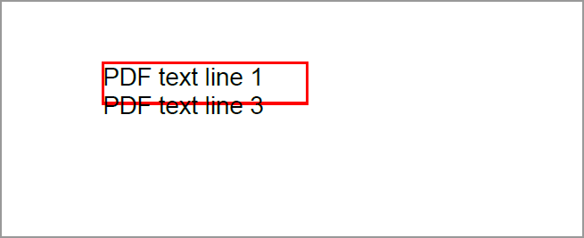

# Working with text in the PDF document

Essential<sup>®</sup> PDF supports adding text to a PDF document using the Syncfusion .NET PDF library. You can add text using standard, TrueType, CJK fonts, RTL text, and complex scripts.

To quickly get started with adding text to PDF documents using the Syncfusion<sup>®</sup> PDF library for .NET, refer to this video tutorial:


## Drawing text in a new document

You can add text in the new PDF document by using [DrawString](https://help.syncfusion.com/cr/document-processing/Syncfusion.Pdf.Graphics.PdfGraphics.html#Syncfusion_Pdf_Graphics_PdfGraphics_DrawString_System_String_Syncfusion_Pdf_Graphics_PdfFont_Syncfusion_Pdf_Graphics_PdfBrush_System_Drawing_PointF_) method of [PdfGraphics][def] class as shown in the following code sample.





using Syncfusion.Drawing;
using Syncfusion.Pdf;
using Syncfusion.Pdf.Graphics;

//Create a new PDF document.
PdfDocument document = new PdfDocument();
//Add a page to the document.
PdfPage page = document.Pages.Add();
//Create PDF graphics for the page.
PdfGraphics graphics = page.Graphics;

//Set the standard font.
PdfFont font = new PdfStandardFont(PdfFontFamily.Helvetica, 20);
//Draw the text.
graphics.DrawString("Hello World!!!", font, PdfBrushes.Black, new Syncfusion.Drawing.PointF(0, 0));

//Save the document and dispose it
document.Save("Output.pdf");
document.Close(true);





using System.Drawing;
using Syncfusion.Pdf;
using Syncfusion.Pdf.Graphics;

//Create a new PDF document.
PdfDocument document = new PdfDocument();
//Add a page to the document.
PdfPage page = document.Pages.Add();
//Create PDF graphics for the page.
PdfGraphics graphics = page.Graphics;

//Set the standard font.
PdfFont font = new PdfStandardFont(PdfFontFamily.Helvetica, 20);
//Draw the text.
graphics.DrawString("Hello World!!!", font, PdfBrushes.Black, new PointF(0, 0));

//Save the document.
document.Save("Output.pdf");
//Close the document.
document.Close(true);





Imports Syncfusion.Pdf
Imports Syncfusion.Pdf.Graphics
Imports System.Drawing

'Create a new PDF document.
Dim document As New PdfDocument()
'Add a page to the document.
Dim page As PdfPage = document.Pages.Add()
'Create PDF graphics for the page.
Dim graphics As PdfGraphics = page.Graphics

'Set the standard font.
Dim font As PdfFont = New PdfStandardFont(PdfFontFamily.Helvetica, 20)
'Draw the text.
graphics.DrawString("Hello World!!!", font, PdfBrushes.Black, New PointF(0, 0))

'Save the document.
document.Save("Output.pdf")
'Close the document.
document.Close(True)





You can download a complete working sample from [GitHub](https://github.com/SyncfusionExamples/PDF-Examples/tree/master/Text/Drawing-text-in-a-new-PDF-document/).

N>  Due to the inherent limitations of the PDF specification and the rendering capabilities of PDF libraries, emojis with skin tone modifiers are not supported in generated PDF documents. Only the base versions of emojis can be displayed. This limitation is common across most PDF libraries, as the PDF format does not explicitly support rendering skin tone variations in emojis.

## The importance of saving and restoring graphics state in PDF content rendering
Saving and restoring the graphics state in a PDF document is crucial for maintaining the consistency and integrity of the document's layout and appearance. This approach allows you to make temporary changes to the graphics state, such as transformations, clipping paths, or color adjustments, without affecting subsequent content rendering by using the [Save](https://help.syncfusion.com/cr/document-processing/Syncfusion.Pdf.Graphics.PdfGraphics.html#Syncfusion_Pdf_Graphics_PdfGraphics_Save) and [Restore](https://help.syncfusion.com/cr/document-processing/Syncfusion.Pdf.Graphics.PdfGraphics.html#Syncfusion_Pdf_Graphics_PdfGraphics_Restore) methods of the [PdfGraphics](https://help.syncfusion.com/cr/document-processing/Syncfusion.Pdf.Graphics.PdfGraphics.html) class.

Please refer to the below code example to understand how to save and restore the graphics state in PDF rendering.





using Syncfusion.Drawing;
using Syncfusion.Pdf;
using Syncfusion.Pdf.Graphics;

// Create a new PDF document
using (PdfDocument pdfDocument = new PdfDocument())
{
    PdfPage page = pdfDocument.Pages.Add();
    // Create PDF graphics
    PdfGraphics graphics = page.Graphics;
    // Save the current graphics state and apply transformations
    graphics.Save();
    graphics.TranslateTransform(100, 50);
    graphics.RotateTransform(45);
    // Define the font for drawing text
    PdfFont font = new PdfStandardFont(PdfFontFamily.Helvetica, 16);
    // Draw transformed text
    graphics.DrawString("Hello, World!", font, PdfBrushes.Black, new PointF(0, 0));
    // Restore the previous graphics state to ensure subsequent text is unaffected
    graphics.Restore();
    // Draw text that is not influenced by transformations
    graphics.DrawString("This text is not rotated.", font, PdfBrushes.Black, new PointF(0, 100));
    // Save the document to a file
    pdfDocument.Save("Output.pdf");
}






using System.Drawing;
using Syncfusion.Pdf;
using Syncfusion.Pdf.Graphics;

// Create a new PDF document
using (PdfDocument pdfDocument = new PdfDocument())
{
    PdfPage page = pdfDocument.Pages.Add();
    // Create PDF graphics
    PdfGraphics graphics = page.Graphics;
    // Save the current graphics state and apply transformations
    graphics.Save();
    graphics.TranslateTransform(100, 50);
    graphics.RotateTransform(45);
    // Define the font for drawing text
    PdfFont font = new PdfStandardFont(PdfFontFamily.Helvetica, 16);
    // Draw transformed text
    graphics.DrawString("Hello, World!", font, PdfBrushes.Black, new PointF(0, 0));
    // Restore the previous graphics state to ensure subsequent text is unaffected
    graphics.Restore();
    // Draw text that is not influenced by transformations
    graphics.DrawString("This text is not rotated.", font, PdfBrushes.Black, new PointF(0, 100));
    // Save the document to a file
    pdfDocument.Save("Output.pdf");
}





    Imports Syncfusion.Pdf
    Imports Syncfusion.Pdf.Graphics
    Imports System.Drawing

    ' Create a PDF document
    Using pdfDocument As New PdfDocument()
    ' Add Pages to the document
    Dim page As PdfPage = pdfDocument.Pages.Add()
    ' Create PDF graphics
    Dim graphics As PdfGraphics = page.Graphics
    ' Save the current graphics state and apply transformations
    graphics.Save()
    graphics.TranslateTransform(100, 50)
    graphics.RotateTransform(45)
    ' Define the font for drawing text
    Dim font As PdfFont = New PdfStandardFont(PdfFontFamily.Helvetica, 16)
    ' Draw transformed text
    graphics.DrawString("Hello, World!", font, PdfBrushes.Black, New PointF(0, 0))
    ' Restore the previous graphics state to ensure subsequent text is unaffected
    graphics.Restore()
    ' Draw text that is not influenced by transformations
    graphics.DrawString("This text is not rotated.", font, PdfBrushes.Black, New PointF(0, 100))
    ' Save and close the document to a file
    pdfDocument.Save("Output.pdf")
    pdfDocument.Close(True)





You can download a complete working sample from [GitHub](PDF-Examples/Text/Saving-and-Restoring-the-PdfGraphics/.NET/Saving-and-Restoring-the-PdfGraphics/Saving-and-Restoring-the-PdfGraphics/Program.cs). 


## Drawing text in an existing document

The following code snippet illustrates how to add text in the existing PDF document by using [DrawString](https://help.syncfusion.com/cr/document-processing/Syncfusion.Pdf.Graphics.PdfGraphics.html#Syncfusion_Pdf_Graphics_PdfGraphics_DrawString_System_String_Syncfusion_Pdf_Graphics_PdfFont_Syncfusion_Pdf_Graphics_PdfBrush_System_Drawing_PointF_) method.





using Syncfusion.Drawing;
using Syncfusion.Pdf;
using Syncfusion.Pdf.Graphics;
using Syncfusion.Pdf.Parsing;

//Load the PDF document.
PdfLoadedDocument doc = new PdfLoadedDocument("Input.pdf");
//Get first page from document.
PdfLoadedPage page = doc.Pages[0] as PdfLoadedPage;
//Create PDF graphics for the page.
PdfGraphics graphics = page.Graphics;

//Set the standard font.
PdfFont font = new PdfStandardFont(PdfFontFamily.Helvetica, 20);
//Draw the text.
graphics.DrawString("Hello World!!!", font, PdfBrushes.Black, new Syncfusion.Drawing.PointF(0, 0));

//Save the document.
doc.Save("Output.pdf");
//Close the document.
doc.Close(true);





using System.Drawing;
using Syncfusion.Pdf;
using Syncfusion.Pdf.Graphics;
using Syncfusion.Pdf.Parsing;

//Load a PDF document.
PdfLoadedDocument doc = new PdfLoadedDocument("input.pdf");
//Get first page from document.
PdfLoadedPage page = doc.Pages[0] as PdfLoadedPage;
//Create PDF graphics for the page
PdfGraphics graphics = page.Graphics;

//Set the standard font.
PdfFont font = new PdfStandardFont(PdfFontFamily.Helvetica, 20);
//Draw the text.
graphics.DrawString("Hello World!!!", font, PdfBrushes.Black, new PointF(0, 0));

//Save the document.
doc.Save("Output.pdf");
//Close the document.
doc.Close(true);





Imports Syncfusion.Pdf
Imports Syncfusion.Pdf.Graphics
Imports System.Drawing
Imports Syncfusion.Pdf.Parsing

'Load a PDF document.
Dim doc As New PdfLoadedDocument("input.pdf")
'Get first page from document
Dim page As PdfLoadedPage = TryCast(doc.Pages(0), PdfLoadedPage)
'Create PDF graphics for the page
Dim graphics As PdfGraphics = page.Graphics

'Set the standard font.
Dim font As PdfFont = New PdfStandardFont(PdfFontFamily.Helvetica, 20)
'Draw the text.
graphics.DrawString("Hello World!!!", font, PdfBrushes.Black, New PointF(0, 0))

'Save the document.
doc.Save("Output.pdf")
'Close the document.
doc.Close(True)





You can download a complete working sample from [GitHub](https://github.com/SyncfusionExamples/PDF-Examples/tree/master/Text/Draw-text-in-an-existing-PDF-document). 

## Drawing text using different fonts

Essential<sup>&reg;</sup> PDF allows you to add text to the PDF document using the following types of fonts.

1. Standard fonts
2. TrueType fonts
3. Chinese, Japanese and Korean (CJK) fonts

### Draw text using standard fonts

PDF has fourteen base fonts, also known as standard fonts which has special significance. The details can be referred from the link below.

[Standard type 1 fonts](https://en.wikipedia.org/wiki/Portable_Document_Format#Standard_Type_1_Fonts_.28Standard_14_Fonts.29)

You can add text using the standard PDF fonts, by initializing [PdfFont](https://help.syncfusion.com/cr/document-processing/Syncfusion.Pdf.Graphics.PdfFont.html) class as [PdfStandardFont](https://help.syncfusion.com/cr/document-processing/Syncfusion.Pdf.Graphics.PdfStandardFont.html) class. The following code snippet illustrates this. 





using Syncfusion.Drawing;
using Syncfusion.Pdf;
using Syncfusion.Pdf.Graphics;

//Create a new PDF document.
PdfDocument document = new PdfDocument();
//Add a page to the document.
PdfPage page = document.Pages.Add();

//Create PDF graphics for the page.
PdfGraphics graphics = page.Graphics;
//Set the standard font.
PdfFont font = new PdfStandardFont(PdfFontFamily.Helvetica, 20);
//Draw the text.
graphics.DrawString("Hello World!!!", font, PdfBrushes.Black, new Syncfusion.Drawing.PointF(0, 0));

//Save the document and dispose it
document.Save("Output.pdf");
document.Close(true);





using System.Drawing;
using Syncfusion.Pdf;
using Syncfusion.Pdf.Graphics;

//Create a new PDF document.
PdfDocument document = new PdfDocument();
//Add a page to the document.
PdfPage page = document.Pages.Add();

//Create PDF graphics for the page.
PdfGraphics graphics = page.Graphics;
//Set the standard font.
PdfFont font = new PdfStandardFont(PdfFontFamily.Helvetica, 20);
//Draw the text.
graphics.DrawString("Hello World!!!", font, PdfBrushes.Black, new PointF(0, 0));

//Save the document.
document.Save("Output.pdf");
//Close the document.
document.Close(true);





Imports Syncfusion.Pdf
Imports Syncfusion.Pdf.Graphics
Imports System.Drawing

'Create a new PDF document.
Dim document As New PdfDocument()
'Add a page to the document.
Dim page As PdfPage = document.Pages.Add()

'Create PDF graphics for the page.
Dim graphics As PdfGraphics = page.Graphics
'Set the standard font.
Dim font As PdfFont = New PdfStandardFont(PdfFontFamily.Helvetica, 20)
'Draw the text.
graphics.DrawString("Hello World!!!", font, PdfBrushes.Black, New PointF(0, 0))

'Save the document.
document.Save("Output.pdf")
'Close the document.
document.Close(True)





You can download a complete working sample from [GitHub](https://github.com/SyncfusionExamples/PDF-Examples/tree/master/Text/Draw-text-in-PDF-document-using-standard-fonts/). 

### Draw text using TrueType fonts

You can add text using the TrueType fonts installed in the system, by initializing [PdfFont](https://help.syncfusion.com/cr/document-processing/Syncfusion.Pdf.Graphics.PdfFont.html) class as [PdfTrueTypeFont](https://help.syncfusion.com/cr/document-processing/Syncfusion.Pdf.Graphics.PdfTrueTypeFont.html) class. The following code snippet illustrates this.





using Syncfusion.Pdf;
using Syncfusion.Pdf.Graphics;

//Create a new PDF document.
PdfDocument document = new PdfDocument();
//Add a page to the document.
PdfPage page = document.Pages.Add();

//Create PDF graphics for the page.
PdfGraphics graphics = page.Graphics;
//Use the font installed in the machine
PdfFont font = new PdfTrueTypeFont(new Font("Arial", 14));
//Draw the text.
graphics.DrawString("Hello World!!!", font, PdfBrushes.Black, new PointF(0, 0));

//Save the document.
document.Save("Output.pdf");
//Close the document.
document.Close(true);





using Syncfusion.Pdf;
using Syncfusion.Pdf.Graphics;

'Create a new PDF document.
Dim document As New PdfDocument()
'Add a page to the document.
Dim page As PdfPage = document.Pages.Add()

'Create PDF graphics for the page.
Dim graphics As PdfGraphics = page.Graphics
'Use the font installed in the machine
Dim font As PdfFont = New PdfTrueTypeFont(New Font("Arial", 14))
'Draw the text.
graphics.DrawString("Hello World!!!", font, PdfBrushes.Black, New PointF(0, 0))

'Save the document.
document.Save("Output.pdf")
'Close the document.
document.Close(True)





You can add text using the font file from local file system by providing the path of the TrueType font location. The following code snippet explains the same.





using Syncfusion.Pdf;
using Syncfusion.Pdf.Graphics;

//Create a new PDF document.
PdfDocument document = new PdfDocument();
//Add a page to the document.
PdfPage page = document.Pages.Add();

//Create PDF graphics for the page.
PdfGraphics graphics = page.Graphics;
//Load the TrueType font from the local *.ttf file.
FileStream fontStream = new FileStream("Arial.ttf", FileMode.Open, FileAccess.Read);
PdfFont font = new PdfTrueTypeFont(fontStream, 14);
//Draw the text.
graphics.DrawString("Hello World!!!", font, PdfBrushes.Black, new Syncfusion.Drawing.PointF(0, 0));

//Save the document and dispose it
document.Save("Output.pdf");
document.Close(true);





using Syncfusion.Pdf;
using Syncfusion.Pdf.Graphics;

//Create a new PDF document.
PdfDocument document = new PdfDocument();
//Add a page to the document.
PdfPage page = document.Pages.Add();

//Create PDF graphics for the page.
PdfGraphics graphics = page.Graphics;
//Provide the path of the local *.ttf file
PdfFont font = new PdfTrueTypeFont(new Font("Arial.ttf", 14));
//Draw the text.
graphics.DrawString("Hello World!!!", font, PdfBrushes.Black, new PointF(0, 0));

//Save the document.
document.Save("Output.pdf");
//Close the document.
document.Close(true);





Imports Syncfusion.Pdf
Imports Syncfusion.Pdf.Graphics

'Create a new PDF document.
Dim document As New PdfDocument()
'Add a page to the document.
Dim page As PdfPage = document.Pages.Add()

'Create PDF graphics for the page.
Dim graphics As PdfGraphics = page.Graphics
' Provide the path of the local *.ttf file
Dim font As PdfFont = New PdfTrueTypeFont(New Font("Arial.ttf", 14))
'Draw the text.
graphics.DrawString("Hello World!!!", font, PdfBrushes.Black, New PointF(0, 0))

'Save the document.
document.Save("Output.pdf")
'Close the document.
document.Close(True)





You can download a complete working sample from [GitHub](https://github.com/SyncfusionExamples/PDF-Examples/tree/master/Text/Draw-text-in-a-PDF-using-TrueType-fonts/). 

### Draw text using CJK fonts

You can add text using CJK fonts, initializing [PdfFont](https://help.syncfusion.com/cr/document-processing/Syncfusion.Pdf.Graphics.PdfFont.html) class as [PdfCjkStandardFont](https://help.syncfusion.com/cr/document-processing/Syncfusion.Pdf.Graphics.PdfCjkStandardFont.html) class. The following code sample illustrates this.





using Syncfusion.Pdf;
using Syncfusion.Pdf.Graphics;

//Create a new PDF document.
PdfDocument document = new PdfDocument();
//Add a page to the document.
PdfPage page = document.Pages.Add();

//Create PDF graphics for the page.
PdfGraphics graphics = page.Graphics;
//Set the standard font.
PdfFont font = new PdfCjkStandardFont(PdfCjkFontFamily.HeiseiMinchoW3, 20);
//Draw the text.
graphics.DrawString("こんにちは世界", font, PdfBrushes.Black, new Syncfusion.Drawing.PointF(0, 0));

//Save the document.
document.Save("Output.pdf");
//Close the document.
document.Close(true);





using Syncfusion.Pdf;
using Syncfusion.Pdf.Graphics;

//Create a new PDF document.
PdfDocument document = new PdfDocument();
//Add a page to the document.
PdfPage page = document.Pages.Add();

//Create PDF graphics for the page.
PdfGraphics graphics = page.Graphics;
//Set the standard font.
PdfFont font = new PdfCjkStandardFont(PdfCjkFontFamily.HeiseiMinchoW3, 20);
//Draw the text.
graphics.DrawString("こんにちは世界", font, PdfBrushes.Black, new PointF(0, 0));

//Save the document.
document.Save("Output.pdf");
//Close the document.
document.Close(true);





Imports Syncfusion.Pdf
Imports Syncfusion.Pdf.Graphics

'Create a new PDF document.
Dim document As New PdfDocument()
'Add a page to the document.
Dim page As PdfPage = document.Pages.Add()

'Create PDF graphics for the page.
Dim graphics As PdfGraphics = page.Graphics
'Set the standard font.
Dim font As PdfFont = New PdfCjkStandardFont(PdfCjkFontFamily.HeiseiMinchoW3, 20)
'Draw the text.
graphics.DrawString("こんにちは世界", font, PdfBrushes.Black, New PointF(0, 0))

'Save the document.
document.Save("Output.pdf")
'Close the document.
document.Close(True)





You can download a complete working sample from [GitHub](https://github.com/SyncfusionExamples/PDF-Examples/tree/master/Text/Draw-text-in-a-PDF-using-CJK-fonts/). 

## Measuring a string

The Essential<sup>&reg;</sup> PDF allows you to measure the size of a string which uses the ```PdfFont``` through [MeasureString](https://help.syncfusion.com/cr/document-processing/Syncfusion.Pdf.Graphics.PdfFont.html#Syncfusion_Pdf_Graphics_PdfFont_MeasureString_System_String_) method of it and returns the size. Refer to the following code sample.





using Syncfusion.Drawing;
using Syncfusion.Pdf;
using Syncfusion.Pdf.Graphics;

//Create the new PDF document
PdfDocument document = new PdfDocument();
//Add a page to the document
PdfPage page = document.Pages.Add();

//Create PDF graphics for the page
PdfGraphics graphics = page.Graphics;
//Create a new PDF font instance
PdfFont font = new PdfStandardFont(PdfFontFamily.Helvetica, 12);
string text = "Hello World!";
//Measure the text
SizeF size = font.MeasureString(text);
//Draw string to th ePDF page
graphics.DrawString(text, font, PdfBrushes.Black, new RectangleF(PointF.Empty, size));

//Save the document.
document.Save("Output.pdf");
//Close the document.
document.Close(true);





using System.Drawing;
using Syncfusion.Pdf;
using Syncfusion.Pdf.Graphics;

//Create the new PDF document
PdfDocument document = new PdfDocument();
//Add a page to the document
PdfPage page = document.Pages.Add();

//Create PDF graphics for the page
PdfGraphics graphics = page.Graphics;
//Create a new PDF font instance
PdfFont font = new PdfStandardFont(PdfFontFamily.Helvetica, 12);
string text = "Hello World!";
//Measure the text
SizeF size = font.MeasureString(text);
//Draw string to the PDF page
graphics.DrawString(text, font, PdfBrushes.Black, new RectangleF(PointF.Empty, size));

//Save the document
document.Save("Output.pdf");
//Close the document
document.Close(true);





Imports Syncfusion.Pdf
Imports Syncfusion.Pdf.Graphics
Imports System.Drawing

'Create the new PDF document
Dim document As New PdfDocument()
'Add a page to the document
Dim page As PdfPage = document.Pages.Add()

'Create PDF graphics for the page
Dim graphics As PdfGraphics = page.Graphics
'Create a new PDF font instance
Dim font As PdfFont = New PdfStandardFont(PdfFontFamily.Helvetica, 12)
Dim text As String = "Hello World!"
'Measure the text
Dim size As SizeF = font.MeasureString(text)
'Draw string to the PDF page
graphics.DrawString(text, font, PdfBrushes.Black, New RectangleF(PointF.Empty, size))

'Save the document
document.Save("Output.pdf")
'Close the document
document.Close(True)





You can download a complete working sample from [GitHub](https://github.com/SyncfusionExamples/PDF-Examples/tree/master/Text/Measure-the-text-in-PDF-document/). 


### Measure tilting space 

The Syncfusion<sup>&reg;</sup> PDF library enables users to accurately measure tilted spaces when drawing or measuring text in italic styles. This feature significantly improves measurement precision in PDF documents, especially when dealing with italicized fonts. To utilize this functionality, you can use the MeasureTiltingSpace property available in the PdfStringFormat class. 

Refer to the following code example for further information. 





using Syncfusion.Drawing;
using Syncfusion.Pdf;
using Syncfusion.Pdf.Graphics;

PdfDocument document = new PdfDocument();
//Add a page to the document 
PdfPage page = document.Pages.Add();
// Load the font file from the stream 
FileStream fontStream = new FileStream(@"../../../arial.ttf", FileMode.Open, FileAccess.Read);
//Create a new PDF font instance 
PdfFont font = new PdfTrueTypeFont(fontStream, 14, PdfFontStyle.Italic);
//Create a new PDF string format instance 
PdfStringFormat format = new PdfStringFormat();
//Enable the measure tilting space      
format.MeasureTiltingSpace = true;
string text = "Hello World!";
//Measure the tilted text 
SizeF size = font.MeasureString(text, format);
//Draw the text to the PDF document. 
page.Graphics.DrawString(text, font, PdfBrushes.Black, new RectangleF(0, 0, size.Width, size.Height)); 
//Save the document.
document.Save("Output.pdf");
//Close the document.
document.Close(true);





using System.Drawing;
using Syncfusion.Pdf;
using Syncfusion.Pdf.Graphics;

//Create a new PDF document 
PdfDocument document = new PdfDocument(); 
//Add a page to the document 
PdfPage page = document.Pages.Add(); 
//Create a new PDF font instance 
PdfFont font = new PdfTrueTypeFont(new Font("Arial", 14, PdfFontStyle.Italic),true); 
//Create a new PDF string format instance 
PdfStringFormat format = new PdfStringFormat(); 
//Enable the measure tilting space      
format.MeasureTiltingSpace = true; 
string text = "Hello World!"; 
//Measure the tilted text 
SizeF size = font.MeasureString(text, format); 
//Draw the text to the PDF document. 
page.Graphics.DrawString(text, font, PdfBrushes.Black, new RectangleF(0,0, size.Width, size.Height)); 
//Save the document.
document.Save("Output.pdf"); 
//Close the document 
document.Close(true); 





Imports Syncfusion.Pdf
Imports Syncfusion.Pdf.Graphics
Imports System.Drawing

'Create the new PDF document 
Dim document As PdfDocument = New PdfDocument() 
'Add a page to the document 
Dim page As PdfPage = document.Pages.Add() 
'Load the font file from the stream 
Dim fontStream As FileStream = New FileStream("font.ttf", FileMode.Open, FileAccess.Read) 
'Create a new PDF font instance 
Dim font As PdfFont = New PdfTrueTypeFont(fontStream, 14, PdfFontStyle.Italic) 
'Create a new PDF string format instance 
Dim format As PdfStringFormat = New PdfStringFormat() 
'Enable a measure tilting space  
format.MeasureTiltingSpace = True 
Dim text As String = "Hello World!" 
'Measure the tilted text 
Dim size As SizeF = font.MeasureString(text, format) 
'Draw the text to the PDF document.
page.Graphics.DrawString(text, font, PdfBrushes.Black, New RectangleF(0, 0, size.Width, size.Height))
Save the document 
document.Save("Output.pdf") 
Close the document 
document.Close(True) 





You can download a complete working sample from [GitHub](https://github.com/SyncfusionExamples/PDF-Examples/tree/master/Text/Measure-tilting-space-in-PDF/.NET).

## Unit conversion in text layout

The [PdfUnitConvertor](https://help.syncfusion.com/cr/document-processing/Syncfusion.Pdf.Graphics.PdfUnitConvertor.html) class is used to accurately position and layout paragraph text within a PDF document. By converting measurements from inches to points, it ensures consistent margins and precise placement of content.

This example demonstrates how to use converted units to accurately position and format paragraph text within a PDF document.





using Syncfusion.Pdf;
using Syncfusion.Pdf.Graphics;
using Syncfusion.Drawing;

// Create a new PDF document
using (PdfDocument document = new PdfDocument())
{
    // Add a page
    PdfPage page = document.Pages.Add();

    // Initialize unit converter
    PdfUnitConvertor converter = new PdfUnitConvertor();

    // Convert margins from inches to points
    float margin = converter.ConvertUnits(1f, PdfGraphicsUnit.Inch, PdfGraphicsUnit.Point);

    // Define text bounds to fill the page with margins
    RectangleF textBounds = new RectangleF(
        margin,
        margin,
        page.Graphics.ClientSize.Width - 2 * margin,
        page.Graphics.ClientSize.Height - 2 * margin
    );

    // Define font and paragraph text
    PdfFont font = new PdfStandardFont(PdfFontFamily.TimesRoman, 14);

    string paragraphText = "Adventure Works Cycles, the fictitious company on which the AdventureWorks sample databases are based, is a large, multinational manufacturing company. The company manufactures and sells metal and composite bicycles to North American, European and Asian commercial markets. While its base operation is located in Washington with 290 employees, several regional sales teams are located throughout their market base.";

    // Create text element and layout format
    PdfTextElement textElement = new PdfTextElement(paragraphText, font, PdfBrushes.Black);

    PdfLayoutFormat layoutFormat = new PdfLayoutFormat
    {
        Break = PdfLayoutBreakType.FitPage,
        Layout = PdfLayoutType.Paginate
    };

    // Draw the paragraph text within the bounds
    textElement.Draw(page, textBounds, layoutFormat);

    //Save the document
    document.Save("Output.pdf");
}





using Syncfusion.Pdf;
using Syncfusion.Pdf.Graphics;
using System.Drawing;

// Create a new PDF document
using (PdfDocument document = new PdfDocument())
{
    // Add a page
    PdfPage page = document.Pages.Add();

    // Initialize unit converter
    PdfUnitConvertor converter = new PdfUnitConvertor();

    // Convert margins from inches to points
    float margin = converter.ConvertUnits(1f, PdfGraphicsUnit.Inch, PdfGraphicsUnit.Point);

    // Define text bounds to fill the page with margins
    RectangleF textBounds = new RectangleF(
        margin,
        margin,
        page.Graphics.ClientSize.Width - 2 * margin,
        page.Graphics.ClientSize.Height - 2 * margin
    );

    // Define font and paragraph text
    PdfFont font = new PdfStandardFont(PdfFontFamily.TimesRoman, 14);

    string paragraphText = "Adventure Works Cycles, the fictitious company on which the AdventureWorks sample databases are based, is a large, multinational manufacturing company. The company manufactures and sells metal and composite bicycles to North American, European and Asian commercial markets. While its base operation is located in Washington with 290 employees, several regional sales teams are located throughout their market base.";

    // Create text element and layout format
    PdfTextElement textElement = new PdfTextElement(paragraphText, font, PdfBrushes.Black);

    PdfLayoutFormat layoutFormat = new PdfLayoutFormat
    {
        Break = PdfLayoutBreakType.FitPage,
        Layout = PdfLayoutType.Paginate
    };

    // Draw the paragraph text within the bounds
    textElement.Draw(page, textBounds, layoutFormat);

    //Save the document
    document.Save("Output.pdf");
}





Imports Syncfusion.Pdf
Imports Syncfusion.Pdf.Graphics
Imports System.Drawing

Module Program
    Sub Main()
        ' Create a new PDF document
        Using document As New PdfDocument()

            ' Add a page
            Dim page As PdfPage = document.Pages.Add()

            ' Initialize unit converter
            Dim converter As New PdfUnitConvertor()

            ' Convert 1 inch margin to points
            Dim margin As Single = converter.ConvertUnits(1.0F, PdfGraphicsUnit.Inch, PdfGraphicsUnit.Point)

            ' Define text bounds to fill the page with margins
            Dim textBounds As New RectangleF(
                margin,
                margin,
                page.Graphics.ClientSize.Width - 2 * margin,
                page.Graphics.ClientSize.Height - 2 * margin
            )

            ' Define font and paragraph text
            Dim font As PdfFont = New PdfStandardFont(PdfFontFamily.TimesRoman, 14)
            Dim paragraphText As String = "Adventure Works Cycles, the fictitious company on which the AdventureWorks sample databases are based, is a large, multinational manufacturing company. The company manufactures and sells metal and composite bicycles to North American, European and Asian commercial markets. While its base operation is located in Washington with 290 employees, several regional sales teams are located throughout their market base."

            ' Create text element and layout format
            Dim textElement As New PdfTextElement(paragraphText, font, PdfBrushes.Black)
            Dim layoutFormat As New PdfLayoutFormat With {
                .Break = PdfLayoutBreakType.FitPage,
                .Layout = PdfLayoutType.Paginate
            }

            text within the bounds
            textElement.Draw(page, textBounds, layoutFormat)

            ' Save the document
            document.Save("Output.pdf")
        End Using
    End Sub
End Module





You can download a complete working sample from GitHub.

## Embedding fonts and working with Unicode text

To embed a font or display Unicode text in the document, the ‘Unicode’ Boolean parameter of the [PdfTrueTypeFont](https://help.syncfusion.com/cr/document-processing/Syncfusion.Pdf.Graphics.PdfTrueTypeFont.html#Syncfusion_Pdf_Base__ctor) constructor has to be set to true. The following code illustrates the same.

N> To render a Unicode text in the PDF document the chosen font should have the Unicode rendering capability.





//PDF supports embedding fonts or displaying a Unicode text in the PDF document by default in ASP.NET Core platform. 





using System.Drawing;
using Syncfusion.Pdf;
using Syncfusion.Pdf.Graphics;

//Create a new PDF document.
PdfDocument document = new PdfDocument();
//Add a page to the document.
PdfPage page = document.Pages.Add();

//Create PDF graphics for the page.
PdfGraphics graphics = page.Graphics;
//use the system installed font
PdfFont font = new PdfTrueTypeFont(new Font("Arial Unicode MS", 14), true);
//Read the unicode text from the text file.
StreamReader reader = new StreamReader(@"input.txt", Encoding.Unicode);
string text = reader.ReadToEnd();
reader.Close();
//Draw the text.
graphics.DrawString(text, font, PdfBrushes.Black, new PointF(0, 0));

//Save the document.
document.Save("Output.pdf");
//Close the document.
document.Close(true);





Imports Syncfusion.Pdf
Imports Syncfusion.Pdf.Graphics
Imports System.Drawing

'Create a new PDF document.
Dim document As New PdfDocument()
'Add a page to the document.
Dim page As PdfPage = document.Pages.Add()

'Create PDF graphics for the page.
Dim graphics As PdfGraphics = page.Graphics
'use the system installed font
Dim font As PdfFont = New PdfTrueTypeFont(New Font("Arial Unicode MS", 14), True)
'Read the unicode text from the text file.
Dim reader As New StreamReader("input.txt", Encoding.Unicode)
Dim text As String = reader.ReadToEnd()
reader.Close()
'Draw the text.
graphics.DrawString(text, font, PdfBrushes.Black, New PointF(0, 0))

'Save the document.
document.Save("Output.pdf")
'Close the document.
document.Close(True)





You can download a complete working sample from [GitHub](https://github.com/SyncfusionExamples/PDF-Examples/tree/master/Text/Display-unicode-text-in-PDF-document/). 

## Drawing Right-To-Left text 

The Essential<sup>&reg;</sup> PDF allows you to draw the right-to-left language text in a PDF document. To draw RTL scripts such as Arabic, Hebrew, Persian, and Urdu, set the value of [TextDirection](https://help.syncfusion.com/cr/document-processing/Syncfusion.Pdf.Graphics.PdfStringFormat.html#Syncfusion_Pdf_Graphics_PdfStringFormat_TextDirection) property in the [PdfStringFormat](https://help.syncfusion.com/cr/document-processing/Syncfusion.Pdf.Graphics.PdfStringFormat.html) class to RightToLeft using [PdfTextDirection](https://help.syncfusion.com/cr/document-processing/Syncfusion.Pdf.Graphics.PdfTextDirection.html) Enum. The languages (e.g., Sindhi and Kurdish) that have more than one script and can be written in either right-to-left or left-to-right format. The LeftToRight value of the TextDirection property is used to draw RTL text in the left-to-right format. Refer to the following code sample.





using Syncfusion.Drawing;
using Syncfusion.Pdf;
using Syncfusion.Pdf.Graphics;

//Create a new PDF document
PdfDocument doc = new PdfDocument();
//Add a page to the document
PdfPage page = doc.Pages.Add();

//Create PDF graphics for the page
PdfGraphics graphics = page.Graphics;
//Create a new PDF font instance
FileStream fontStream = new FileStream("arial.ttf", FileMode.Open, FileAccess.Read);
PdfFont font = new PdfTrueTypeFont(fontStream, 14);
//Set the format for string
PdfStringFormat format = new PdfStringFormat();
//Set right-to-left text direction for RTL text
format.TextDirection = PdfTextDirection.RightToLeft;
//Set the alignment
format.Alignment = PdfTextAlignment.Right;
format.ParagraphIndent = 35f;

//Read the text from file
FileStream rtlText = new FileStream("Arabic.txt", FileMode.Open, FileAccess.Read);
StreamReader reader = new StreamReader(rtlText, Encoding.Unicode);
string text = reader.ReadToEnd();
reader.Dispose();
//Draw string with right-to-left format
graphics.DrawString(text, font, PdfBrushes.Black, new RectangleF(0, 0, page.GetClientSize().Width, page.GetClientSize().Height), format);
//Set left-to-right text direction for RTL text
format.TextDirection = PdfTextDirection.LeftToRight;
//Set the text alignment
format.Alignment = PdfTextAlignment.Left;
//Draw string with left-to-right format
graphics.DrawString(text, font, PdfBrushes.Black, new RectangleF(0, 100, page.GetClientSize().Width, page.GetClientSize().Height), format);

//Save the document
doc.Save("Output.pdf");
//Close the document
doc.Close(true);





using System.Drawing;
using Syncfusion.Pdf;
using Syncfusion.Pdf.Graphics;

//Create a new PDF document
PdfDocument doc = new PdfDocument();
//Add a page to the document
PdfPage page = doc.Pages.Add();

//Create PDF graphics for the page
PdfGraphics graphics = page.Graphics;
//Create a new PDF font instance
PdfFont font = new PdfTrueTypeFont(new Font("Arial", 14), true);
//Set the format for string
PdfStringFormat format = new PdfStringFormat();
//Set right-to-left text direction for RTL text
format.TextDirection = PdfTextDirection.RightToLeft;
//Set the text alignment
format.Alignment = PdfTextAlignment.Right;
format.ParagraphIndent = 35f;

//Read the text from file
StreamReader reader = new StreamReader("Arabic.txt", Encoding.Unicode);
string text = reader.ReadToEnd();
reader.Close();
//Draw string with right-to-left format
graphics.DrawString(text, font, PdfBrushes.Black, new RectangleF(0, 0, page.GetClientSize().Width, page.GetClientSize().Height), format);
//Set left-to-right text direction for RTL text
format.TextDirection = PdfTextDirection.LeftToRight;
//Set the text alignment
format.Alignment = PdfTextAlignment.Left;
//Draw string with left-to-right format
graphics.DrawString(text, font, PdfBrushes.Black, new RectangleF(0, 100, page.GetClientSize().Width, page.GetClientSize().Height), format);

//Save the document
doc.Save("Output.pdf");
//Close the document
doc.Close(true);





Imports Syncfusion.Pdf
Imports Syncfusion.Pdf.Graphics
Imports System.Drawing

'Create a new PDF document
Dim doc As PdfDocument = New PdfDocument()
'Add a page to the document
Dim page As PdfPage = doc.Pages.Add()

'Create PDF graphics for the page
Dim graphics As PdfGraphics = page.Graphics
'Create font
Dim font As PdfFont = New PdfTrueTypeFont(New Font("Arial", 14), True)
'Set the format for string
Dim format As PdfStringFormat = New PdfStringFormat()
'Set right-to-left text direction for RTL text
format.TextDirection = PdfTextDirection.RightToLeft
'Set the alignment
format.Alignment = PdfTextAlignment.Right
format.ParagraphIndent = 35.0F
'Read the text from file
Dim reader As StreamReader = New StreamReader("Arabic.txt", Encoding.Unicode)
Dim text As String = reader.ReadToEnd()
reader.Close()

'Draw string with right-to-left format
graphics.DrawString(text, font, PdfBrushes.Black, new RectangleF(0, 0, page.GetClientSize().Width, page.GetClientSize().Height), format)
'Set left-to-right text direction for RTL text
format.TextDirection = PdfTextDirection.LeftToRight
'Set the text alignment
format.Alignment = PdfTextAlignment.Left
'Draw string with left-to-right format
graphics.DrawString(text, font, PdfBrushes.Black, new RectangleF(0, 100, page.GetClientSize().Width, page.GetClientSize().Height), format)

'Save the document
doc.Save("Output.pdf")
'Close the document
doc.Close(True)





You can download a complete working sample from [GitHub](https://github.com/SyncfusionExamples/PDF-Examples/tree/master/Text/Draw-Right-To-Left-text-in-a-PDF-document/). 

## Adding a HTML Styled Text

Essential<sup>&reg;</sup> PDF provides support to render simple HTML string in a PDF document that can flow through multiple pages. This can be done by using the [PdfHTMLTextElement](https://help.syncfusion.com/cr/document-processing/Syncfusion.Pdf.Graphics.PdfHTMLTextElement.html) class.

Step 1: The PdfHTMLTextElement class provides support for a basic set of HTML tags, to render HTML format text in the PDF document.

   Supported tags (Should be XHTML-compliant)
<table border="1">
<th style="font-size:14px" width="100px">Supported tags</th>
<th style="font-size:14px">Windows-Specific</th>
<th style="font-size:14px">Cross-Platform</th>
<tr>
    <td>Font</td>
    <td>Yes</td>
    <td>Yes</td>
</tr>
<tr>
    <td>Bold (B)</td>
    <td>Yes</td>
    <td>Yes</td>
</tr>
<tr>
    <td>Italic (I)</td>
    <td>Yes</td>
    <td>Yes</td>
</tr>
<tr>
    <td>Underline (U)</td>
    <td>Yes</td>
    <td>Yes</td>
</tr>
<tr>
    <td>Subscript (Sub) (U)</td>
    <td>Yes</td>
    <td>No</td>
</tr>
<tr>
    <td>Line Break (BR) (U)</td>
    <td>Yes</td>
    <td>Yes</td>
</tr>
<tr>
    <td>Paragraph (P)</td>
    <td>Yes</td>
    <td>Yes</td>
</tr>

</table>

   
Step 2: The [PdfMetafileLayoutFormat](https://help.syncfusion.com/cr/document-processing/Syncfusion.Pdf.Graphics.PdfMetafileLayoutFormat.html) class enables to break the HTML text into multiple pages.
Step 3: Complex HTML with CSS are not supported in this class. Please use [HTML to PDF](https://help.syncfusion.com/document-processing/pdf/conversions/html-to-pdf/net/net-core) section for complex HTML with CSS and URL's

The following code example illustrates how to render the HTML string in a PDF document.   





using Syncfusion.Drawing;
using Syncfusion.Pdf;
using Syncfusion.Pdf.Graphics;

//create a new PDF document
PdfDocument doc = new PdfDocument();
//Add a page to the document
PdfPage page = doc.Pages.Add();

//create PDF graphics for the page
PdfGraphics graphics = page.Graphics;
//set the font
PdfFont font = new PdfStandardFont(PdfFontFamily.TimesRoman, 14, PdfFontStyle.Regular);
//simple HTML content
string htmlText = "<font color='#0000F8' face='TimesRoman' size='14'><i><b><u>Essential PDF</u></b></i></font> is a <u><i>.NET</i></u> library with the capability to produce Adobe PDF files";
//Render Html text
PdfHTMLTextElement richTextElement = new PdfHTMLTextElement(htmlText, font, PdfBrushes.Black);
//Format layout
PdfLayoutFormat format = new PdfLayoutFormat();
format.Layout = PdfLayoutType.Paginate;
format.Break = PdfLayoutBreakType.FitPage;
//Draw htmlString.
richTextElement.Draw(page, new RectangleF(0, 20, page.GetClientSize().Width, page.GetClientSize().Height), format);

//Save the document
doc.Save("Output.pdf");
//Close the document
doc.Close(true);





using System.Drawing;
using Syncfusion.Pdf;
using Syncfusion.Pdf.Graphics;

//Create a new PDF document.
PdfDocument doc = new PdfDocument();
//Add a page to the document.
PdfPage page = doc.Pages.Add();

//Create PDF graphics for the page.
PdfGraphics graphics = page.Graphics;
//Set the font.
PdfFont font = new PdfStandardFont(PdfFontFamily.Courier, 14);
//Simple HTML content
string htmlText = "<font color='#0000F8'>Essential PDF</font> is a <u><i>.NET</i></u> " +
"library with the capability to produce Adobe PDF files ";
//Render HtmlText.
PdfHTMLTextElement richTextElement = new PdfHTMLTextElement(htmlText, font, PdfBrushes.Black);
richTextElement.TextAlign = TextAlign.Left;
//Format Layout.
PdfMetafileLayoutFormat format = new PdfMetafileLayoutFormat();
format.Layout = PdfLayoutType.Paginate;
format.Break = PdfLayoutBreakType.FitPage;
//Draw htmlString.
richTextElement.Draw(page, new RectangleF(0, 20, page.GetClientSize().Width, page.GetClientSize().Height), format);

//Save the document.
doc.Save("Output.pdf");
//Close the document.
doc.Close(true);





Imports Syncfusion.Pdf
Imports Syncfusion.Pdf.Graphics
Imports System.Drawing

'Create a new PDF document.
Dim doc As New PdfDocument()
'Add a page to the document.
Dim page As PdfPage = doc.Pages.Add()

'Create PDF graphics for the page.
Dim graphics As PdfGraphics = page.Graphics
'Set the font.
Dim font As PdfFont = New PdfStandardFont(PdfFontFamily.Courier, 14)
'Simple HTML content
Dim htmlText As String = "<font color='#0000F8'>Essential PDF</font> is a <u><i>.NET</i></u> " + "library with the capability to produce Adobe PDF files "
'Render HtmlText.
Dim richTextElement As New PdfHTMLTextElement(htmlText, font, PdfBrushes.Black)
richTextElement.TextAlign = TextAlign.Left
'Format Layout.
Dim format As New PdfMetafileLayoutFormat()
format.Layout = PdfLayoutType.Paginate
format.Break = PdfLayoutBreakType.FitPage
'Draw htmlString.
richTextElement.Draw(page, New RectangleF(0, 20, page.GetClientSize().Width, page.GetClientSize().Height), format)

'Save the document.
doc.Save("Output.pdf")
'Close the document.
doc.Close(True)





You can download a complete working sample from [GitHub](https://github.com/SyncfusionExamples/PDF-Examples/tree/master/Text/Adding-HTML-styled-text-to-PDF-document/). 

## Creating a multicolumn PDF document

Essential<sup>&reg;</sup> PDF allows you to create multi-column text in PDF document by using [PdfTextElement](https://help.syncfusion.com/cr/document-processing/Syncfusion.Pdf.Graphics.PdfTextElement.html) class. The following code example illustrates the same.





using Syncfusion.Pdf;
using Syncfusion.Pdf.Graphics;

//Create a PDF document instance
PdfDocument document = new PdfDocument();
//Add page to the document
PdfPage page = document.Pages.Add();

//Create PDF graphics for the page
PdfGraphics graphics = page.Graphics;
string text = "Adventure Works Cycles, the fictitious company on which the AdventureWorks sample databases are based, is a large, multinational manufacturing company. The company manufactures and sells metal and composite bicycles to North American, European and Asian commercial markets. While its base operation is located in Washington with 290 employees, several regional sales teams are located throughout their market base.";
//Create a text element with the text and font
PdfTextElement textElement = new PdfTextElement(text, new PdfStandardFont(PdfFontFamily.TimesRoman, 14));
//Draw the text in the first column
textElement.Draw(page, new RectangleF(0, 0, page.GetClientSize().Width / 2, page.GetClientSize().Height));
textElement = new PdfTextElement(text, new PdfStandardFont(PdfFontFamily.TimesRoman, 14));
//Draw the text in the second column
textElement.Draw(page, new RectangleF(page.GetClientSize().Width / 2, 0, page.GetClientSize().Width / 2, page.GetClientSize().Height));

//Save the document.
document.Save("Output.pdf");
//Close the document.
document.Close(true);





using Syncfusion.Pdf;
using Syncfusion.Pdf.Graphics;

//Create a PDF document instance
PdfDocument document = new PdfDocument();
//Add page to the document
PdfPage page = document.Pages.Add();

//Create PDF graphics for the page.
PdfGraphics graphics = page.Graphics;
string text = "Adventure Works Cycles, the fictitious company on which the AdventureWorks sample databases are based, is a large, multinational manufacturing company. The company manufactures and sells metal and composite bicycles to North American, European and Asian commercial markets. While its base operation is located in Washington with 290 employees, several regional sales teams are located throughout their market base.";
//Create a text element with the text and font
PdfTextElement textElement = new PdfTextElement(text, new PdfStandardFont(PdfFontFamily.TimesRoman, 14));
//Draw the text in the first column
textElement.Draw(page, new RectangleF(0, 0, page.GetClientSize().Width / 2, page.GetClientSize().Height));
textElement = new PdfTextElement(text, new PdfStandardFont(PdfFontFamily.TimesRoman, 14));
//Draw the text in the second column
textElement.Draw(page, new RectangleF(page.GetClientSize().Width / 2, 0, page.GetClientSize().Width / 2, page.GetClientSize().Height));

//Save and close the document
document.Save("Output.pdf");
document.Close(true);





Imports Syncfusion.Pdf
Imports Syncfusion.Pdf.Graphics

'Create a PDF document instance
Dim document As New PdfDocument()
'Add page to the document
Dim page As PdfPage = document.Pages.Add()

'Create PDF graphics for the page
Dim graphics As PdfGraphics = page.Graphics
Dim text As String = "Adventure Works Cycles, the fictitious company on which the AdventureWorks sample databases are based, is a large, multinational manufacturing company. The company manufactures and sells metal and composite bicycles to North American, European and Asian commercial markets. While its base operation is located in Washington with 290 employees, several regional sales teams are located throughout their market base."
'Create a text element with the text and font
Dim textElement As New PdfTextElement(text, New PdfStandardFont(PdfFontFamily.TimesRoman, 14))
'Draw the text in the first column
textElement.Draw(page, New RectangleF(0, 0, page.GetClientSize().Width / 2, page.GetClientSize().Height))
textElement = New PdfTextElement(text, New PdfStandardFont(PdfFontFamily.TimesRoman, 14))
'Draw the text in the second column
textElement.Draw(page, New RectangleF(page.GetClientSize().Width / 2, 0, page.GetClientSize().Width / 2, page.GetClientSize().Height))

'Save and close the document
document.Save("Output.pdf")
document.Close(True)





You can download a complete working sample from [GitHub](https://github.com/SyncfusionExamples/PDF-Examples/tree/master/Text/Creating-a-multicolumn-PDF-document/).

## Add text across multiple PDF pages

The [PdfLayoutFormat](https://help.syncfusion.com/cr/document-processing/Syncfusion.Pdf.Graphics.PdfLayoutFormat.html) class enables text to flow seamlessly across multiple pages in a PDF document. The [PdfLayoutResult](https://help.syncfusion.com/cr/document-processing/Syncfusion.Pdf.Graphics.PdfLayoutResult.html) class provides the position and bounds of the previously rendered text, allowing you to place subsequent elements without overlapping.

The following code example demonstrates how to add elements relatively and also allow the text to flow across multiple pages.





using Syncfusion.Pdf;
using Syncfusion.Pdf.Graphics;

//Create a PDF document instance
PdfDocument document = new PdfDocument();
//Add page to the document
PdfPage page = document.Pages.Add();

//Create PDF graphics for the page
PdfGraphics graphics = page.Graphics;
//Read the long text from the text file
FileStream inputStream = new FileStream("Input.txt", FileMode.Open, FileAccess.Read);
StreamReader reader = new StreamReader(inputStream, Encoding.ASCII);
string text = reader.ReadToEnd();
reader.Dispose();
const int paragraphGap = 10;
//Create a text element with the text and font
PdfTextElement textElement = new PdfTextElement(text, new PdfStandardFont(PdfFontFamily.TimesRoman, 14));
PdfLayoutFormat layoutFormat = new PdfLayoutFormat();
layoutFormat.Layout = PdfLayoutType.Paginate;
layoutFormat.Break = PdfLayoutBreakType.FitPage;
//Draw the first paragraph
PdfLayoutResult result = textElement.Draw(page, new RectangleF(0, 0, page.GetClientSize().Width / 2, page.GetClientSize().Height), layoutFormat);
//Draw the second paragraph from the first paragraph end position
result = textElement.Draw(page, new RectangleF(0, result.Bounds.Bottom + paragraphGap, page.GetClientSize().Width / 2, page.GetClientSize().Height), layoutFormat);

//Save the document.
document.Save("Output.pdf");
//Close the document.
document.Close(true);





using Syncfusion.Pdf;
using Syncfusion.Pdf.Graphics;

//Create a PDF document instance
PdfDocument document = new PdfDocument();
//Add page to the document
PdfPage page = document.Pages.Add();

//Create PDF graphics for the page.
PdfGraphics graphics = page.Graphics;
//Read the long text from the text file
StreamReader reader = new StreamReader(@"input.txt", Encoding.ASCII);
string text = reader.ReadToEnd();
reader.Close();

const int paragraphGap = 10;
//Create a text element with the text and font
PdfTextElement textElement = new PdfTextElement(text, new PdfStandardFont(PdfFontFamily.TimesRoman, 14));
PdfLayoutFormat layoutFormat = new PdfLayoutFormat();
layoutFormat.Layout = PdfLayoutType.Paginate;
layoutFormat.Break = PdfLayoutBreakType.FitPage;
//Draw the first paragraph
PdfLayoutResult result = textElement.Draw(page, new RectangleF(0, 0, page.GetClientSize().Width / 2, page.GetClientSize().Height), layoutFormat);
//Draw the second paragraph from the first paragraph end position
result = textElement.Draw(page, new RectangleF(0, result.Bounds.Bottom + paragraphGap, page.GetClientSize().Width / 2, page.GetClientSize().Height), layoutFormat);

//Save and close the document
document.Save("Output.pdf");
document.Close(true);





Imports Syncfusion.Pdf
Imports Syncfusion.Pdf.Graphics

'Create a PDF document instance
Dim document As New PdfDocument()
'Add page to the document
Dim page As PdfPage = document.Pages.Add()

'Create PDF graphics for the page
Dim graphics As PdfGraphics = page.Graphics
'Read the RTL text from the text file.
Dim reader As New StreamReader("input.txt", Encoding.ASCII)
Dim text As String = reader.ReadToEnd()
reader.Close()

Const paragraphGap As Integer = 10
'Create a text element with the text and font
Dim textElement As New PdfTextElement(text, New PdfStandardFont(PdfFontFamily.TimesRoman, 14))
Dim layoutFormat As New PdfLayoutFormat()
layoutFormat.Layout = PdfLayoutType.Paginate
layoutFormat.Break = PdfLayoutBreakType.FitPage
'Draw the first paragraph

Dim result As PdfLayoutResult = textElement.Draw(page, New RectangleF(0, 0, page.GetClientSize().Width / 2, page.GetClientSize().Height), layoutFormat)
'Draw the second paragraph from the first paragraph end position
result = textElement.Draw(page, New RectangleF(0, result.Bounds.Bottom + paragraphGap, page.GetClientSize().Width / 2, page.GetClientSize().Height), layoutFormat)

'Save and close the document
document.Save("Output.pdf")
document.Close(True)





You can download a complete working sample from [GitHub](https://github.com/SyncfusionExamples/PDF-Examples/tree/master/Text/Add-text-across-multiple-pages). 

## Inserting Rich Text Format contents 

Essential<sup>&reg;</sup> PDF allows you to insert a RTF text into a PDF document by converting it as bitmap or metafile image and rendering it using [FromRtf](https://help.syncfusion.com/cr/document-processing/Syncfusion.Pdf.Graphics.PdfImage.html#Syncfusion_Pdf_Graphics_PdfImage_FromRtf_System_String_System_Single_Syncfusion_Pdf_Graphics_PdfImageType_) method of [PdfImage](https://help.syncfusion.com/cr/document-processing/Syncfusion.Pdf.Graphics.PdfImage.html) class.

The following code example illustrates how to insert RTF text in PDF document.





//PDF supports inserting rich text format contents only in Windows Forms, WPF, ASP.NET and ASP.NET MVC platforms.





using System.Drawing;
using Syncfusion.Pdf;
using Syncfusion.Pdf.Graphics;

//Create a new PDF document.
PdfDocument doc = new PdfDocument();
//Add a page.
PdfPage page = doc.Pages.Add();

SizeF bounds = page.GetClientSize();
//Read RTF document.
StreamReader reader = new StreamReader(@"input.rtf", Encoding.ASCII);
string text = reader.ReadToEnd();
reader.Close();

//Convert it to Metafile.
PdfMetafile imageMetafile = (PdfMetafile)PdfImage.FromRtf(text, bounds.Width, PdfImageType.Metafile);
PdfMetafileLayoutFormat format = new PdfMetafileLayoutFormat();
//Allow text to flow multiple pages without any break.
format.SplitTextLines = true;
//Draws image.
imageMetafile.Draw(page, 0, 0, format);

//Save and close the document.
doc.Save("Output.pdf");
doc.Close(true);





Imports Syncfusion.Pdf
Imports Syncfusion.Pdf.Graphics
Imports System.Drawing

'Create a new PDF document.
Dim doc As New PdfDocument()
'Add a page.
Dim page As PdfPage = doc.Pages.Add()

Dim bounds As SizeF = page.GetClientSize()
'Read RTF document.
Dim reader As New StreamReader("input.rtf", Encoding.ASCII)
Dim text As String = reader.ReadToEnd()
reader.Close()
'Convert it to Metafile.
Dim imageMetafile As PdfMetafile = DirectCast(PdfImage.FromRtf(text, bounds.Width, PdfImageType.Metafile), PdfMetafile)
Dim format As New PdfMetafileLayoutFormat()
'Allow text to flow multiple pages without any break.
format.SplitTextLines = True
'Draws image.
imageMetafile.Draw(page, 0, 0, format)

'Save and close the document.
doc.Save("Output.pdf")
doc.Close(True)





You can download a complete working sample from [GitHub](https://github.com/SyncfusionExamples/PDF-Examples/tree/master/Text/Insert-RTF-text-in-PDF-document/). 

N> For converting complex RTF content to PDF, refer the [RTF to PDF](https://help.syncfusion.com/document-processing/pdf/pdf-library/net/working-with-document-conversions#converting-rtf-documents-to-pdf) section.

## Adding an Ordered List 

Essential<sup>&reg;</sup> PDF allows you to create an ordered list in the document. Ordered List is represented by the [PdfOrderedList](https://help.syncfusion.com/cr/document-processing/Syncfusion.Pdf.Lists.PdfOrderedList.html) class and can be numerical or alphabetical. The following code snippet illustrates the same.





using Syncfusion.Drawing;
using Syncfusion.Pdf;
using Syncfusion.Pdf.Graphics;

//Create a new instance of PdfDocument class.
PdfDocument document = new PdfDocument();
//Add a new page to the document.
PdfPage page = document.Pages.Add();

//Create PDF graphics for the page.
PdfGraphics graphics = page.Graphics;
SizeF size = page.Graphics.ClientSize;
//Create font 
PdfFont font = new PdfStandardFont(PdfFontFamily.TimesRoman, 10, PdfFontStyle.Italic);
string[] products = { "Tools", "Grid", "Chart", "Edit", "Diagram", "XlsIO", "Grouping", "Calculate", "PDF", "HTMLUI", "DocIO" };
//Create string format
PdfStringFormat format = new PdfStringFormat();
format.LineSpacing = 10f;
//Create Ordered list
PdfOrderedList pdfList = new PdfOrderedList();
pdfList.Marker.Brush = PdfBrushes.Black;
pdfList.Indent = 20;
//Set format for sub list
pdfList.Font = font;
pdfList.StringFormat = format;

foreach (string s in products)
{
    //Add items
    pdfList.Items.Add(string.Concat("Essential ", s));
}
pdfList.Draw(page, new RectangleF(0, 20, size.Width, size.Height));

//Save the document.
document.Save("Output.pdf");
//Close the document.
document.Close(true);





using System.Drawing;
using Syncfusion.Pdf;
using Syncfusion.Pdf.Graphics;

//Create a new instance of PdfDocument class.
PdfDocument document = new PdfDocument();
//Add a new page to the document.
PdfPage page = document.Pages.Add();

//Create PDF graphics for the page.
PdfGraphics graphics = page.Graphics;
SizeF size = page.Graphics.ClientSize;
//Create font 
PdfFont font = new PdfStandardFont(PdfFontFamily.TimesRoman, 10, PdfFontStyle.Italic);
string[] products = { "Tools", "Grid", "Chart", "Edit", "Diagram", "XlsIO", "Grouping", "Calculate", "PDF", "HTMLUI", "DocIO" };

//Create string format
PdfStringFormat format = new PdfStringFormat();
format.LineSpacing = 10f;
//Create Ordered list
PdfOrderedList pdfList = new PdfOrderedList();
pdfList.Marker.Brush = PdfBrushes.Black;
pdfList.Indent = 20;
//Set format for sub list
pdfList.Font = font;
pdfList.StringFormat = format;
foreach (string s in products)
{
//Add items
pdfList.Items.Add(string.Concat("Essential ", s));
}
pdfList.Draw(page, new RectangleF(0, 20, size.Width, size.Height));  

// Save and close the document.
document.Save("Output.pdf");
document.Close(true);





Imports Syncfusion.Pdf
Imports Syncfusion.Pdf.Graphics
Imports System.Drawing

'Create a new instance of PdfDocument class.
Dim document As New PdfDocument()
'Add a new page to the document.
Dim page As PdfPage = document.Pages.Add()

'Create PDF graphics for the page.
Dim graphics As PdfGraphics = page.Graphics
Dim size As SizeF = page.Graphics.ClientSize
'Create font 
Dim font As PdfFont = New PdfStandardFont(PdfFontFamily.TimesRoman, 10, PdfFontStyle.Italic)
Dim products As String() = {"Tools", "Grid", "Chart", "Edit", "Diagram", "XlsIO", _
"Grouping", "Calculate", "PDF", "HTMLUI", "DocIO"}

'Create string format
Dim format As New PdfStringFormat()
format.LineSpacing = 10.0F
'Create Ordered list
Dim pdfList As New PdfOrderedList()
pdfList.Marker.Brush = PdfBrushes.Black
pdfList.Indent = 20
'Set format for sub list
pdfList.Font = font
pdfList.StringFormat = format
For Each s As String In products
'Add items
pdfList.Items.Add(String.Concat("Essential ", s))
Next
pdfList.Draw(page, New RectangleF(0, 20, size.Width, size.Height))

'Save and close the document.
document.Save("Output.pdf")
document.Close(True)





You can download a complete working sample from [GitHub](https://github.com/SyncfusionExamples/PDF-Examples/tree/master/Text/Adding-an-ordered-list-to-PDF-document/). 

## Adding an Unordered List 

Essential<sup>&reg;</sup> PDF also provides support to create an unordered List that is represented by the [PdfUnorderedList](https://help.syncfusion.com/cr/document-processing/Syncfusion.Pdf.Lists.PdfUnorderedList.html) class. An Unordered list can be bullets, circle or an image. The following code snippet illustrates the same.





using Syncfusion.Drawing;
using Syncfusion.Pdf;
using Syncfusion.Pdf.Graphics;

//Create a new instance of PdfDocument class.
PdfDocument document = new PdfDocument();
//Add a new page to the document.
PdfPage page = document.Pages.Add();

//Create PDF graphics for the page.
PdfGraphics graphics = page.Graphics;
SizeF size = page.Graphics.ClientSize;
//Create an unordered list
PdfUnorderedList list = new PdfUnorderedList();
//Set the marker style
list.Marker.Style = PdfUnorderedMarkerStyle.Disk;
//Create font and write title
PdfFont font = new PdfStandardFont(PdfFontFamily.Helvetica, 12, PdfFontStyle.Regular);
//Create string format
PdfStringFormat format = new PdfStringFormat();
format.LineSpacing = 10f;

// Format list
list.Font = font;
list.StringFormat = format;
//Set list indent
list.Indent = 10;
//Add items to the list
list.Items.Add("PDF");
list.Items.Add("XlsIO");
list.Items.Add("DocIO");
list.Items.Add("PPT");
//Set text indent
list.TextIndent = 10;
//Draw list
list.Draw(page, new RectangleF(0, 10, size.Width, size.Height));

//Save the document.
document.Save("Output.pdf");
//Close the document.
document.Close(true);





using System.Drawing;
using Syncfusion.Pdf;
using Syncfusion.Pdf.Graphics;

//Create a new instance of PdfDocument class.
PdfDocument document = new PdfDocument();
//Add a new page to the document.
PdfPage page = document.Pages.Add();

//Create PDF graphics for the page.
PdfGraphics graphics = page.Graphics;
SizeF size = page.Graphics.ClientSize;
//Create an unordered list
PdfUnorderedList list = new PdfUnorderedList();
//Set the marker style
list.Marker.Style = PdfUnorderedMarkerStyle.Disk;
//Create font and write title
PdfFont font = new PdfStandardFont(PdfFontFamily.Helvetica, 12, PdfFontStyle.Regular);
//Create string format
PdfStringFormat format = new PdfStringFormat();
format.LineSpacing = 10f;

// Format list
list.Font = font;
list.StringFormat = format;
//Set list indent
list.Indent = 10;
//Add items to the list
list.Items.Add("PDF");
list.Items.Add("XlsIO");
list.Items.Add("DocIO");
list.Items.Add("PPT");
//Set text indent
list.TextIndent = 10;
//Draw list
list.Draw(page, new RectangleF(0, 10, size.Width, size.Height));

// Save and close the document.
document.Save("Output.pdf");
document.Close(true);





Imports Syncfusion.Pdf
Imports Syncfusion.Pdf.Graphics
Imports System.Drawing

'Create a new instance of PdfDocument class.
Dim document As New PdfDocument()
'Add a new page to the document.
Dim page As PdfPage = document.Pages.Add()

'Create PDF graphics for the page.
Dim graphics As PdfGraphics = page.Graphics
Dim size As SizeF = page.Graphics.ClientSize
'Create an unordered list
Dim list As New PdfUnorderedList()
'Set the marker style
list.Marker.Style = PdfUnorderedMarkerStyle.Disk
'Create font and write title
Dim font As PdfFont = New PdfStandardFont(PdfFontFamily.Helvetica, 12, PdfFontStyle.Regular)
'Create string format
Dim format As New PdfStringFormat()
format.LineSpacing = 10.0F

' Format list
list.Font = font
list.StringFormat = format
'Set list indent
list.Indent = 10
'Add items to the list
list.Items.Add("PDF")
list.Items.Add("XlsIO")
list.Items.Add("DocIO")
list.Items.Add("PPT")
'Set text indent
list.TextIndent = 10
'Draw list
list.Draw(page, New RectangleF(0, 10, size.Width, size.Height))

'Save and close the document.
document.Save("Output.pdf")
document.Close(True)





You can download a complete working sample from [GitHub](https://github.com/SyncfusionExamples/PDF-Examples/tree/master/Text/Adding-an-unordered-list-to-PDF-document/). 

## Replace Fonts in an existing document

Essential<sup>&reg;</sup> PDF allows you to replace the fonts in an existing PDF document by using the [Replace](https://help.syncfusion.com/cr/document-processing/Syncfusion.Pdf.Graphics.Fonts.PdfUsedFont.html#Syncfusion_Pdf_Graphics_Fonts_PdfUsedFont_Replace_Syncfusion_Pdf_Graphics_PdfFont_) method. The following code snippet illustrates the same.





//PDF supports Replace fonts in an existing document only in Windows Forms, WPF, ASP.NET and ASP.NET MVC platforms.





using System.Drawing;
using Syncfusion.Pdf;
using Syncfusion.Pdf.Graphics;

//Creates a new PDF document.
PdfLoadedDocument loadedDocument = new PdfLoadedDocument("Input.pdf");
//Replace font 
loadedDocument.UsedFonts[0].Replace(new PdfStandardFont(PdfFontFamily.TimesRoman, 12));

//Save the document
loadedDocument.Save("Output.pdf");
loadedDocument.Close(true);





Imports Syncfusion.Pdf
Imports Syncfusion.Pdf.Graphics
Imports System.Drawing

'Creates a new PDF document.
Dim loadedDocument As New PdfLoadedDocument("Input.pdf")
'Replace font
loadedDocument.UsedFonts(0).Replace(New PdfStandardFont(PdfFontFamily.TimesRoman, 12))

'Save the document
loadedDocument.Save("Output.pdf")
loadedDocument.Close(True)





You can download a complete working sample from [GitHub](https://github.com/SyncfusionExamples/PDF-Examples/tree/master/Text/Replace-fonts-in-an-existing-PDF-document/). 

## Search and get the bounds of a text in a document

You can search for a particular text in a document and get the bounds using [FindText](https://help.syncfusion.com/cr/document-processing#Syncfusion_Windows_Forms_PdfViewer_PdfViewerControl_FindText_System_String_System_Collections_Generic_Dictionary_System_Int32_System_Collections_Generic_List_System_Drawing_RectangleF____/Syncfusion.DocIO.html) method of [PdfViewerControl](https://help.syncfusion.com/cr/windowsforms/Syncfusion.Windows.Forms.PdfViewer.PdfViewerControl.html) class. To include this functionality, you need to add the below mentioned assemblies as reference to the project.

1. Syncfusion.Compression.Base.dll
2. Syncfusion.Pdf.Base.dll
3. Syncfusion.PdfViewer.Windows.dll 

The following code snippet illustrates how to get the bound of a text from PDF document.





using System.Drawing;
using Syncfusion.PdfViewer;

PdfViewerControl documentViewer = new PdfViewerControl();
//Load the PDF document
documentViewer.Load("Input.pdf");

//Get the occurrences of the target text and location.
Dictionary<int, List<RectangleF>> textSearch = new Dictionary<int, List<RectangleF>>();
bool IsMatchFound = documentViewer.FindText("hello", out textSearch);
documentViewer.Dispose();





Imports System.Drawing;
Imports Syncfusion.PdfViewer;

Dim documentViewer As New PdfViewerControl()
'Load the PDF document
documentViewer.Load("Input.pdf")

'Get the occurrences of the target text and location.
Dim textSearch As New Dictionary(Of Integer, List(Of RectangleF))()
Dim IsMatchFound As Boolean = documentViewer.FindText("hello", textSearch)
documentViewer.Dispose()





## Drawing complex script language text

Essential<sup>&reg;</sup> PDF allows you to add complex script language text in the PDF document by using the [ComplexScript](https://help.syncfusion.com/cr/document-processing/Syncfusion.Pdf.Graphics.PdfStringFormat.html#Syncfusion_Pdf_Graphics_PdfStringFormat_ComplexScript) property available in [PdfStringFormat](https://help.syncfusion.com/cr/document-processing/Syncfusion.Pdf.Graphics.PdfStringFormat.html) class. The following code snippet illustrates this.





using Syncfusion.Pdf;
using Syncfusion.Pdf.Graphics;
using Syncfusion.Drawing;

//Create a new PDF document
PdfDocument doc = new PdfDocument();
//Add a page to the document
PdfPage page = doc.Pages.Add();

//Create PDF graphics for the page
PdfGraphics graphics = page.Graphics;
FileStream fontStream = new FileStream("tahoma.ttf", FileMode.Open, FileAccess.Read);
//Create a new PDF font instance
PdfFont pdfFont = new PdfTrueTypeFont(fontStream, 10);
//Set the format for string
PdfStringFormat format = new PdfStringFormat();
//Set the format as complex script layout type
format.ComplexScript = true;
//Draw the text
graphics.DrawString("สวัสดีชาวโลก", pdfFont, PdfBrushes.Black, new RectangleF(0, 0, page.GetClientSize().Width, page.GetClientSize().Height), format);

//Save the document
doc.Save("Output.pdf");
//Close the document
doc.Close(true);





using Syncfusion.Pdf;
using Syncfusion.Pdf.Graphics;
using System.Drawing;

//Create a new PDF document
PdfDocument doc = new PdfDocument();
//Add a page to the document
PdfPage page = doc.Pages.Add();

//Create PDF graphics for the page
PdfGraphics graphics = page.Graphics;
//Set the font with Unicode option
Font font = new Font("Tahoma", 14);
PdfFont pdfFont = new PdfTrueTypeFont(font, true);
//Set the format for string
PdfStringFormat format = new PdfStringFormat();
//Set the format as complex script layout type
format.ComplexScript = true;
//Draw the text
graphics.DrawString("สวัสดีชาวโลก", pdfFont, PdfBrushes.Black, new RectangleF(0, 0, page.GetClientSize().Width, page.GetClientSize().Height), format);

//Save the document
doc.Save("Output.pdf");
//Close the document
doc.Close(true);





Imports Syncfusion.Pdf
Imports Syncfusion.Pdf.Graphics
Imports System.Drawing

'Create a new PDF document 
Dim doc As New PdfDocument()
'Add a page to the document
Dim page As PdfPage = doc.Pages.Add()

'Create PDF graphics for the page 
Dim graphics As PdfGraphics = page.Graphics
'Set the font with Unicode option 
Dim font As New Font("Tahoma", 14)
Dim pdfFont As PdfFont = New PdfTrueTypeFont(font, True)
'Set the format for string
Dim format As New PdfStringFormat()
'Set the format as complex script layout type 
format.ComplexScript = True
'Draw the text
graphics.DrawString("สวัสดีชาวโลก", pdfFont, PdfBrushes.Black, New RectangleF(0, 0, page.GetClientSize().Width, page.GetClientSize().Height), format)

'Save the document 
doc.Save("Output.pdf")
'Close the document
doc.Close(True)





You can download a complete working sample from [GitHub](https://github.com/SyncfusionExamples/PDF-Examples/tree/master/Text/Drawing-complex-script-language-text-to-PDF/). 

You can add the complex script language text in an existing PDF document by using the following code sample.





using Syncfusion.Pdf;
using Syncfusion.Pdf.Graphics;
using Syncfusion.Drawing;

//Load a PDF document
PdfLoadedDocument doc = new PdfLoadedDocument("Input.pdf");
//Get first page from the document
PdfLoadedPage page = doc.Pages[0] as PdfLoadedPage;

//Create PDF graphics for the page
PdfGraphics graphics = page.Graphics;
//Set the font with Unicode option
Font font = new Font("Tahoma", 14);
PdfFont pdfFont = new PdfTrueTypeFont(font, true);
//Set the format for string
PdfStringFormat format = new PdfStringFormat();
//Set the format as complex script layout type
format.ComplexScript = true;
//Draw the text
graphics.DrawString("สวัสดีชาวโลก", pdfFont, PdfBrushes.Black, new RectangleF(0, 0, page.Size.Width, page.Size.Height), format);

//Save the document
doc.Save("Output.pdf");
//Close the document
doc.Close(true);





using Syncfusion.Pdf;
using Syncfusion.Pdf.Graphics;
using System.Drawing;

//Load a PDF document
PdfLoadedDocument doc = new PdfLoadedDocument("input.pdf");
//Get first page from the document
PdfLoadedPage page = doc.Pages[0] as PdfLoadedPage;

//Create PDF graphics for the page
PdfGraphics graphics = page.Graphics;
//Set the font with Unicode option
Font font = new Font("Tahoma", 14);
PdfFont pdfFont = new PdfTrueTypeFont(font, true);
//Set the format for string
PdfStringFormat format = new PdfStringFormat();
//Set the format as complex script layout type
format.ComplexScript = true;
//Draw the text
graphics.DrawString("สวัสดีชาวโลก", pdfFont, PdfBrushes.Black, new RectangleF(0, 0, page.Size.Width, page.Size.Height), format);

//Save the document
doc.Save("Output.pdf");
//Close the document
doc.Close(true);





Imports Syncfusion.Pdf
Imports Syncfusion.Pdf.Graphics
Imports System.Drawing

'Load a PDF document
Dim doc As New PdfLoadedDocument("input.pdf")
'Get first page from the document 
Dim page As PdfLoadedPage = TryCast(doc.Pages(0), PdfLoadedPage)

'Create PDF graphics for the page 
Dim graphics As PdfGraphics = page.Graphics
'Set the font with Unicode option 
Dim font As New Font("Tahoma", 14)
Dim pdfFont As PdfFont = New PdfTrueTypeFont(font, True)
'Set the format for string 
Dim format As New PdfStringFormat()
'Set the format as complex script layout type 
format.ComplexScript = True
'Draw the text 
graphics.DrawString("สวัสดีชาวโลก", pdfFont, PdfBrushes.Black, New RectangleF(0, 0, page.Size.Width, page.Size.Height), format)

'Save the document 
doc.Save("Output.pdf")
'Close the document
doc.Close(True)





You can download a complete working sample from [GitHub](https://github.com/SyncfusionExamples/PDF-Examples/tree/master/Text/Add-complex-script-to-an-existing-PDF-document/). 

## Drawing text using OpenType font

Essential<sup>&reg;</sup> PDF supports drawing text on a PDF document with OpenType font using [PdfTrueTypeFont](https://help.syncfusion.com/cr/document-processing/Syncfusion.Pdf.Graphics.PdfTrueTypeFont.html) class, by providing the path of font file from local file system. The following code snippet illustrates this.





using Syncfusion.Pdf;
using Syncfusion.Pdf.Graphics;
using Syncfusion.Drawing;

//Create a new PDF document
PdfDocument document = new PdfDocument();
//Add a page
PdfPage page = document.Pages.Add();

//Create font
FileStream fontFileStream = new FileStream("Font.otf", FileMode.Open, FileAccess.Read);
PdfFont font = new PdfTrueTypeFont(fontFileStream, 14);
//Text to draw
string text = "Syncfusion Essential PDF is a.NET Core PDF library used to create, read, and edit PDF files in any application";
//Create a brush
PdfBrush brush = new PdfSolidBrush(new PdfColor(0, 0, 0));
//Create a pen
PdfPen pen = new PdfPen(new PdfColor(0, 0, 0));
//Get page client size
SizeF clipBounds = page.Graphics.ClientSize;
RectangleF rect = new RectangleF(0, 0, clipBounds.Width, clipBounds.Height);            
//Draw the text
page.Graphics.DrawString(text, font, brush, rect);

//Save the document.
document.Save("Output.pdf");
//Close the document.
document.Close(true);





using Syncfusion.Pdf;
using Syncfusion.Pdf.Graphics;
using System.Drawing;

//Create a new PDF document
PdfDocument document = new PdfDocument();
//Add a page to the document
PdfPage page = document.Pages.Add();

//Create  font
Stream fontStream = System.IO.File.OpenRead("Font.otf");
PdfFont font = new PdfTrueTypeFont(fontStream, 14);
//Text to draw
string text = "Syncfusion Essential PDF is a.NET PDF library used to create, read, and edit PDF files in any application";
//Get page client size
SizeF clipBounds = page.Graphics.ClientSize;
RectangleF rect = new RectangleF(0, 0, clipBounds.Width, clipBounds.Height); 
//Draw the text
page.Graphics.DrawString(text, font, PdfBrushes.Blue, rect);

//Save the document
document.Save("Output.pdf");
//Close the document
document.Close(true); 





Imports Syncfusion.Pdf
Imports Syncfusion.Pdf.Graphics
Imports System.Drawing

'Create a new PDF document
Dim document As PdfDocument = New PdfDocument 
'Add a page to the document
Dim page As PdfPage = document.Pages.Add

'Create font
Dim fontStream As Stream = System.IO.File.OpenRead("Font.otf")
Dim font As PdfFont = New PdfTrueTypeFont(fontStream, 14)
'Text to draw
Dim text As String = "Syncfusion Essential PDF is a.NET PDF library used to create, read, and edit PDF files in any application"
'Get page client size
Dim clipBounds As SizeF = page.Graphics.ClientSize
Dim rect As RectangleF = New RectangleF(0, 0, clipBounds.Width, clipBounds.Height)
'Draw the text
page.Graphics.DrawString(text, font, PdfBrushes.Blue, rect)

'Save the document
document.Save("Output.pdf")
'Close the document
document.Close(true)





You can download a complete working sample from [GitHub](https://github.com/SyncfusionExamples/PDF-Examples/tree/master/Text/Draw-text-using-OpenTypeFont-in-PDF-document/). 

## Drawing text with baseline alignment

The Essential<sup>&reg;</sup> PDF allows you to draw text using a different type of fonts with different sizes with the same baseline alignment in the PDF document by using the EnableBaseline property available in [PdfStringFormat](https://help.syncfusion.com/cr/document-processing/Syncfusion.Pdf.Graphics.PdfStringFormat.html) class. The following code sample explains this.





using Syncfusion.Pdf;
using Syncfusion.Pdf.Graphics;
using Syncfusion.Drawing;

//Create a new PDF document
PdfDocument doc = new PdfDocument();
//Add a page to the document
PdfPage page = doc.Pages.Add();

//Create PDF graphics for the page
PdfGraphics graphics = page.Graphics;
FileStream fontStream = new FileStream("tahoma.ttf", FileMode.Open, FileAccess.Read);
FileStream fontStream1 = new FileStream("Arial.ttf", FileMode.Open, FileAccess.Read);
FileStream fontStream2 = new FileStream("Calibri.ttf", FileMode.Open, FileAccess.Read);
//Create a new PDF font instance
PdfFont font = new PdfTrueTypeFont(fontStream, 8);
PdfFont font1 = new PdfTrueTypeFont(fontStream1, 20);
PdfFont font2 = new PdfStandardFont(PdfFontFamily.Helvetica,16);
PdfFont font3 = new PdfTrueTypeFont(fontStream2, 25);       
//Set the format for string
PdfStringFormat format = new PdfStringFormat();
//Set the line alignment
format.LineAlignment = PdfVerticalAlignment.Bottom;
//Set baseline for the line alignment
format.EnableBaseline = true;

//Draw the text
graphics.DrawString("Hello World!", font, PdfBrushes.Black, new PointF(0, 50), format);
graphics.DrawString("Hello World!", font1, PdfBrushes.Black, new PointF(65, 50), format);
graphics.DrawString("Hello World!", font2, PdfBrushes.Black, new PointF(220, 50), format);
graphics.DrawString("Hello World!", font3, PdfBrushes.Black, new PointF(320, 50), format);

//Save the document
doc.Save("Output.pdf");
//Close the document
doc.Close(true);




using Syncfusion.Pdf;
using Syncfusion.Pdf.Graphics;
using System.Drawing;

//Create a new PDF document
PdfDocument document = new PdfDocument();
//Add a page to the document
PdfPage page = document.Pages.Add();

//Create PDF graphics for the page
PdfGraphics graphics = page.Graphics;
//Create a new PDF font instance
PdfFont font = new PdfTrueTypeFont(new Font("Tahoma",8), 8);
PdfFont font1 = new PdfTrueTypeFont(new Font("Calibri",20), 20);
PdfFont font2 = new PdfStandardFont(PdfFontFamily.Helvetica,16);
PdfFont font3 = new PdfTrueTypeFont(new Font("Arial",25), 25);
//Set the format for string
PdfStringFormat format = new PdfStringFormat();
//Set the line alignment
format.LineAlignment = PdfVerticalAlignment.Bottom;
//Set baseline for the line alignment
format.EnableBaseline = true;

//Draw the text
graphics.DrawString("Hello World!", font, PdfBrushes.Black, new PointF(0, 50), format);
graphics.DrawString("Hello World!", font1, PdfBrushes.Black, new PointF(65, 50), format);
graphics.DrawString("Hello World!", font2, PdfBrushes.Black, new PointF(220, 50), format);
graphics.DrawString("Hello World!", font3, PdfBrushes.Black, new PointF(320, 50), format);

//Save the document
document.Save("Output.pdf");
//Close the document
document.Close(true);





Imports Syncfusion.Pdf
Imports Syncfusion.Pdf.Graphics
Imports System.Drawing

'Create a new PDF document 
Dim document As New PdfDocument()
'Add a page to the document
Dim page As PdfPage = document.Pages.Add()

'Create PDF graphics for the page 
Dim graphics As PdfGraphics = page.Graphics
'Create a new PDF font instance
Dim font As PdfFont = New PdfTrueTypeFont(new Font("Tahoma",8), 8)
Dim font1 As PdfFont = New PdfTrueTypeFont(new Font("Calibri",20), 20)
Dim font2 As PdfFont = New PdfStandardFont(PdfFontFamily.Helvetica,16)
Dim font3 As PdfFont = New PdfTrueTypeFont(new Font("Arial",25), 25)
'Set the format for string
Dim format As New PdfStringFormat()
'Set the line alignment
format.LineAlignment = PdfVerticalAlignment.Bottom;
'Set baseline for the line alignment
format.EnableBaseline = True

'Draw the text
graphics.DrawString("Hello World!", font, PdfBrushes.Black, New PointF(0, 50), format)
graphics.DrawString("Hello World!", font1, PdfBrushes.Black, New PointF(65, 50), format)
graphics.DrawString("Hello World!", font2, PdfBrushes.Black, New PointF(220, 50), format)
graphics.DrawString("Hello World!", font3, PdfBrushes.Black, New PointF(320, 50), format)

'Save the document 
document.Save("Output.pdf")
'Close the document
document.Close(True)





You can download a complete working sample from [GitHub](https://github.com/SyncfusionExamples/PDF-Examples/tree/master/Text/Drawing-text-with-baseline-alignment-in-a-PDF/). 

## Drawing text using different text alignment

The Essential<sup>&reg;</sup> PDF allows you to add text in the PDF document with different text alignment using the [Alignment](https://help.syncfusion.com/cr/document-processing/Syncfusion.Pdf.Graphics.PdfStringFormat.html#Syncfusion_Pdf_Graphics_PdfStringFormat_Alignment) property available in [PdfStringFormat](https://help.syncfusion.com/cr/document-processing/Syncfusion.Pdf.Graphics.PdfStringFormat.html) class.

The following code sample explains this.





using Syncfusion.Pdf;
using Syncfusion.Pdf.Graphics;
using Syncfusion.Drawing;

//Create a new PDF document
PdfDocument document = new PdfDocument();
//Add a page to the document
PdfPage page = document.Pages.Add();
//Create PDF graphics for the page
PdfGraphics graphics = page.Graphics;
//Create new instance for string format
PdfStringFormat format = new PdfStringFormat();

//Set horizontal text alignment
format.Alignment = PdfTextAlignment.Right;
format.WordSpacing = 2f;
format.CharacterSpacing = 1f;

//Set the standard font
PdfFont font = new PdfStandardFont(PdfFontFamily.Helvetica, 12);
//Draw the rectangle
graphics.DrawRectangle(PdfPens.Black, new RectangleF(10, 10, 200, 20));
//Draw the text
graphics.DrawString("Right-Alignment", font, PdfBrushes.Red, new RectangleF(10, 10, 200, 20), format);

//Save the document.
document.Save("Output.pdf");
//Close the document.
document.Close(true);





using Syncfusion.Pdf;
using Syncfusion.Pdf.Graphics;
using System.Drawing;

//Create a new PDF document
PdfDocument document = new PdfDocument();
//Add a page to the document
PdfPage page = document.Pages.Add();
//Create PDF graphics for the page
PdfGraphics graphics = page.Graphics;
//Create new instance for string format
PdfStringFormat format = new PdfStringFormat();

//Set horizontal text alignment
format.Alignment = PdfTextAlignment.Right;
format.WordSpacing = 2f;
format.CharacterSpacing = 1f;

//Set the standard font
PdfFont font = new PdfStandardFont(PdfFontFamily.Helvetica, 12);
//Draw the rectangle
graphics.DrawRectangle(PdfPens.Black, new RectangleF(10, 10, 200, 20));
//Draw the text
graphics.DrawString("Right-Alignment", font, PdfBrushes.Red, new RectangleF(10, 10, 200, 20), format);

//Save the document
document.Save("Output.pdf");
//Close the document
document.Close(true);






Imports Syncfusion.Pdf
Imports Syncfusion.Pdf.Graphics
Imports System.Drawing

'Create a new PDF document
 Dim document As New PdfDocument()
'Add a page to the document
Dim page As PdfPage = document.Pages.Add()
'Create PDF graphics for the page
Dim graphics As PdfGraphics = page.Graphics
'Create new instance for string format
Dim format As New PdfStringFormat()

'Set horizontal text alignment
format.Alignment = PdfTextAlignment.Right
format.WordSpacing = 2.0F
format.CharacterSpacing = 1.0F

'Set the standard font
Dim font As New PdfStandardFont(PdfFontFamily.Helvetica, 12)
'Draw the rectangle
graphics.DrawRectangle(PdfPens.Black, New RectangleF(10, 10, 200, 20))
'Draw the text
graphics.DrawString("Right-Alignment", font, PdfBrushes.Red, New RectangleF(10, 10, 200, 20), format)

'Save the document
document.Save("Output.pdf")
'Close the document
document.Close(True)





You can download a complete working sample from [GitHub](https://github.com/SyncfusionExamples/PDF-Examples/tree/master/Text/Drawing-text-using-different-text-alignment/.NET).

## Adding a text encoding to the PdfStandardFont 

The following code sample shows how to add a text encoding using the standard PDF fonts by initializing [PdfFont](https://help.syncfusion.com/cr/document-processing/Syncfusion.Pdf.Graphics.PdfFont.html) class as [PdfStandardFont](https://help.syncfusion.com/cr/document-processing/Syncfusion.Pdf.Graphics.PdfStandardFont.html) class.

N>To enable this functionality in .NET Core, ensure that the following encoding registration is added at the beginning of your code.
`System.Text.Encoding.RegisterProvider(CodePagesEncodingProvider.Instance);`





using Syncfusion.Pdf;
using Syncfusion.Pdf.Graphics;
using Syncfusion.Drawing;

//Create a new PDF document.
PdfDocument document = new PdfDocument();
//Adding a new page to the PDF document 
PdfPage page = document.Pages.Add();

//Create PDF graphics for the page.
PdfGraphics graphics = page.Graphics;
//Create a new PDF standard font instance.
PdfStandardFont font = new PdfStandardFont(PdfFontFamily.Helvetica, 12);
//Set the text encoding.
font.SetTextEncoding(Encoding.GetEncoding("Windows-1250"));
//Draw string to a PDF page.
graphics.DrawString("äÖíßĆŇ", font, PdfBrushes.Black, PointF.Empty);

//Save the document.
document.Save("Output.pdf");
//Close the document.
document.Close(true);





using Syncfusion.Pdf;
using Syncfusion.Pdf.Graphics;
using System.Drawing;

//Create a new PDF document.
PdfDocument document = new PdfDocument();
//Adding a new page to the PDF document. 
PdfPage page = document.Pages.Add();

//Create PDF graphics for the page.
PdfGraphics graphics = page.Graphics;
//Create a new PDF standard font instance.
PdfStandardFont font = new PdfStandardFont(PdfFontFamily.Helvetica, 12);
//Set the text encoding.
font.SetTextEncoding(Encoding.GetEncoding("Windows-1250"));
//Draw string to a PDF page.
graphics.DrawString("äÖíßĆŇ", font, PdfBrushes.Black, PointF.Empty);

//Save the PDF document.
document.Save("Output.pdf");
//Close the PDF document.
document.Close(true);





Imports Syncfusion.Pdf
Imports Syncfusion.Pdf.Graphics
Imports System.Drawing

'Create a new PDF document.
Dim document As PdfDocument =  New PdfDocument() 
'Adding a new page to the PDF document. 
Dim page As PdfPage =  document.Pages.Add() 

'Create PDF graphics for the page.
Dim graphics As PdfGraphics =  page.Graphics 
'Create a new PDF standard font instance.
Dim font As PdfStandardFont =  New PdfStandardFont(PdfFontFamily.Helvetica,12) 
'Set the text encoding.
font.SetTextEncoding(Encoding.GetEncoding("Windows-1250"))
'Draw string to a PDF page.
graphics.DrawString("äÖíßCN", font, PdfBrushes.Black, PointF.Empty)

'Save the PDF document.
document.Save("Output.pdf")
'Close the PDF document.
document.Close(True)





You can download a complete working sample from [GitHub](https://github.com/SyncfusionExamples/PDF-Examples/tree/master/Text/Add-text-encoding-using-standard-PDF-fonts).

## Detecting Text Clipping in PDF Layouts

Essential PDF provides functionality to determine whether text exceeds the specified layout bounds using the Remainder property of [PdfStringLayoutResult](https://help.syncfusion.com/cr/xamarin/Syncfusion.Pdf.Graphics.PdfStringLayoutResult.html) and [PdfStringLayouter](https://help.syncfusion.com/cr/document-processing/Syncfusion.Pdf.Graphics.PdfStringLayouter.html). This feature helps identify clipped text and retrieve the remaining portion that doesn't fit within the defined area.

The following code example demonstrates how to access the remainder text when the content overflows the given bounds.





using Syncfusion.Pdf;
using Syncfusion.Pdf.Graphics;
using Syncfusion.Drawing;

// Create a new PDF document
PdfDocument document = new PdfDocument();

// Add a page to the document
PdfPage page = document.Pages.Add();

// Create PDF graphics for the page
PdfGraphics graphics = page.Graphics;

// Set the standard font
PdfFont font = new PdfStandardFont(PdfFontFamily.Helvetica, 30);

// Declare the text to be drawn
string text = "Adventure Works Cycles, the fictitious company on which the AdventureWorks sample databases are based, is a large, multinational manufacturing company. The company manufactures and sells metal and composite bicycles to North American, European and Asian commercial markets. While its base operation is located in Washington with 290 employees, several regional sales teams are located throughout their market base.";

// Define the bounds within which the text should be drawn
RectangleF border = new RectangleF(0, 0, page.GetClientSize().Width, 150);

// Draw a rectangle to visualize the layout bounds
graphics.DrawRectangle(PdfPens.Black, border);

// Initialize the PdfStringLayouter to layout the text
PdfStringLayouter layouter = new PdfStringLayouter();

// Layout the text and get the result to check if it fits within the bounds
PdfStringLayoutResult result = layouter.Layout(text, font, new PdfStringFormat(PdfTextAlignment.Center), new SizeF(border.Width, border.Height));

// Check if any part of the text was clipped (did not fit within the specified bounds)
if (result.Remainder != null)
{
    // Store the clipped portion of the text for further processing or logging
    string remainderText = result.Remainder;
    // Output the clipped text to the console for debugging or review
    Console.WriteLine("Remainder Text: " + remainderText);
}
// Close the document and release resources
document.Close(true);





using Syncfusion.Pdf;
using Syncfusion.Pdf.Graphics;
using System.Drawing;

// Create a new PDF document
PdfDocument document = new PdfDocument();

// Add a page to the document
PdfPage page = document.Pages.Add();

// Create PDF graphics for the page
PdfGraphics graphics = page.Graphics;

// Set the standard font
PdfFont font = new PdfStandardFont(PdfFontFamily.Helvetica, 30);

// Declare the text to be drawn
string text = "Adventure Works Cycles, the fictitious company on which the AdventureWorks sample databases are based, is a large, multinational manufacturing company. The company manufactures and sells metal and composite bicycles to North American, European and Asian commercial markets. While its base operation is located in Washington with 290 employees, several regional sales teams are located throughout their market base.";

// Define the bounds within which the text should be drawn
RectangleF border = new RectangleF(0, 0, page.GetClientSize().Width, 150);

// Draw a rectangle to visualize the layout bounds
graphics.DrawRectangle(PdfPens.Black, border);

// Initialize the PdfStringLayouter to layout the text
PdfStringLayouter layouter = new PdfStringLayouter();

// Layout the text and get the result to check if it fits within the bounds
PdfStringLayoutResult result = layouter.Layout(text, font, new PdfStringFormat(PdfTextAlignment.Center), new SizeF(border.Width, border.Height));

// Check if any part of the text was clipped (did not fit within the specified bounds)
if (result.Remainder != null)
{
    // Store the clipped portion of the text for further processing or logging
    string remainderText = result.Remainder;
    // Output the clipped text to the console for debugging or review
    Console.WriteLine("Remainder Text: " + remainderText);
}
// Close the document and release resources
document.Close(true);





Imports Syncfusion.Pdf
Imports Syncfusion.Pdf.Graphics
Imports System.Drawing

' Create a new PDF document
Dim document As New PdfDocument()

' Add a page to the document
Dim page As PdfPage = document.Pages.Add()

' Create PDF graphics for the page
Dim graphics As PdfGraphics = page.Graphics

' Set the standard font
Dim font As PdfFont = New PdfStandardFont(PdfFontFamily.Helvetica, 30)

' Declare the text to be drawn
Dim text As String = "Adventure Works Cycles, the fictitious company on which the AdventureWorks sample databases are based, is a large, multinational manufacturing company. The company manufactures and sells metal and composite bicycles to North American, European and Asian commercial markets. While its base operation is located in Washington with 290 employees, several regional sales teams are located throughout their market base."

' Define the bounds within which the text should be drawn
Dim border As New RectangleF(0, 0, page.GetClientSize().Width, 150)

' Draw a rectangle to visualize the layout bounds
graphics.DrawRectangle(PdfPens.Black, border)

' Initialize the PdfStringLayouter to layout the text
Dim layouter As New PdfStringLayouter()

' Layout the text and get the result to check if it fits within the bounds
Dim result As PdfStringLayoutResult = layouter.Layout(text, font, New PdfStringFormat(PdfTextAlignment.Center), New SizeF(border.Width, border.Height))

' Check if any part of the text was clipped (did not fit within the specified bounds)
If result.Remainder IsNot Nothing Then
    ' Store the clipped portion of the text for further processing or logging
    Dim remainderText As String = result.Remainder
    ' Output the clipped text to the console for debugging or review
    Console.WriteLine("Remainder Text: " & remainderText)
End If
' Close the document and release resources
document.Close(True)





A complete working sample is available for download on GitHub.

## Customizing TrueType fonts in a PDF document

The Syncfusion<sup>&reg;</sup> PDF library provides extensive options for customizing TrueType font settings in PDF documents through the `PdfFontSettings` class. Users can modify font size, style, and choose to embed or subset fonts. Additionally, measurement settings can be adjusted using a floating factor for precise control over font rendering.

The following code example illustrates this.





using Syncfusion.Pdf;
using Syncfusion.Pdf.Graphics;
using Syncfusion.Drawing;

//Create a new PDF document. 
PdfDocument document = new PdfDocument(); 
//Add a page to the document. 
PdfPage page = document.Pages.Add(); 
//Create PDF graphics for the page. 
PdfGraphics graphics = page.Graphics; 
//Load the TrueType font from the local *.ttf file. 
FileStream fontStream = new FileStream("Arial.ttf", FileMode.Open, FileAccess.Read); 
// Initialize the PdfFontSettings 
PdfFontSettings fontSettings = new PdfFontSettings(10, PdfFontStyle.Bold, true, true, true); 
PdfFont pdfFont = new PdfTrueTypeFont(fontStream, fontSettings); 
//Draw the text.
graphics.DrawString("Hello World!!!", pdfFont, PdfBrushes.Black, new PointF(0, 0));

//Save the document.
document.Save("Output.pdf");
//Close the document.
document.Close(true);





using Syncfusion.Pdf;
using Syncfusion.Pdf.Graphics;
using System.Drawing;

//Create a new PDF document. 
PdfDocument document = new PdfDocument(); 
//Add a page to the document. 
PdfPage page = document.Pages.Add(); 
//Create PDF graphics for the page. 
PdfGraphics graphics = page.Graphics; 
// Initialize the PdfFontSettings 
PdfFontSettings fontSettings = new PdfFontSettings(10, PdfFontStyle.Bold, true, true, true); 
PdfFont pdfFont = new PdfTrueTypeFont(new Font("Arial"), fontSettings); 
//Draw the text. 
graphics.DrawString("Hello World!!!", pdfFont, PdfBrushes.Black, new PointF(0, 0)); 
//Save the document. 
document.Save("Output.pdf"); 
//Close the document. 
document.Close(true);





Imports Syncfusion.Pdf
Imports Syncfusion.Pdf.Graphics
Imports System.Drawing

'Create a new PDF document. 
Dim document As PdfDocument = New PdfDocument 
'Add a page to the document. 
Dim page As PdfPage = document.Pages.Add 
'Create PDF graphics for the page. 
Dim graphics As PdfGraphics = page.Graphics 
'Use the fontStream installed in the machine. 
Dim fontStream As FileStream = New FileStream("Arial.ttf", FileMode.Open, FileAccess.Read) 
'Initialize the PdfFontSettings.
Dim fontSettings As PdfFontSettings = New PdfFontSettings(10, PdfFontStyle.Bold, true, true, true) 
Dim pdfFont As PdfFont = New PdfTrueTypeFont(fontStream, fontSettings)
'Draw the text. 
graphics.DrawString("Hello World!!!", pdfFont, PdfBrushes.Black, New PointF(0, 0)) 
'Save the document. 
document.Save("Output.pdf") 
'Close the document. 
document.Close(true)





You can download a complete working sample from [GitHub](https://github.com/SyncfusionExamples/PDF-Examples/tree/master/Text/Customizing-truetype-fonts-in-a-PDF/.NET).

## LineLimit, ClipPath, NoClip properties in PdfStringFormat

**LineLimit:** When LineLimit is enabled, the provided string will be laid out within the specified bounds. If the LineLimit property is disabled, the layout will continue to fill any remaining space. The default value of the LineLimit property is true.

**NoClip:** If we enable the NoClip option, it will show the text without cutting any words. If we disable the NoClip option, any text outside the fitting area will be hidden.

The following code example illustrates this.





    using Syncfusion.Pdf;
    using Syncfusion.Pdf.Graphics;
    using Syncfusion.Drawing;

    // Create a new PdfStringFormat and set its properties
    PdfStringFormat format = new PdfStringFormat();
    //Set no clip
    format.NoClip = true;
    //Set line limit
    format.LineLimit = false;

    // Create a new PdfFont using the Helvetica font family
    PdfFont font = new PdfStandardFont(PdfFontFamily.Helvetica, 12);

    // Create a new PdfDocument
    PdfDocument document = new PdfDocument();
    // Set the page margins to zero
    document.PageSettings.Margins.All = 0;

    // Add a new page to the document
    PdfPage page = document.Pages.Add();

    // Get the graphics object of the page
    PdfGraphics graphics = page.Graphics;

    // Draw a red rectangle at the specified position and size
    graphics.DrawRectangle(PdfPens.Red, new RectangleF(100, 100, 100, 20));

    // Draw the string inside the rectangle with the specified font, brush, and format
    graphics.DrawString("PDF text line 1 \r\nPDF text line 3", font, PdfBrushes.Black, new RectangleF(100, 100, 100, 20), format);

    //Save the document.
    document.Save("Output.pdf");
    //Close the document.
    document.Close(true);






    using Syncfusion.Pdf;
    using Syncfusion.Pdf.Graphics;
    using System.Drawing;

    // Create a new PdfStringFormat and set its properties
    PdfStringFormat format = new PdfStringFormat();
    //Set no clip
    format.NoClip = true;
    //Set line limit
    format.LineLimit = false;

    // Create a new PdfFont using the Helvetica font family
    PdfFont font = new PdfStandardFont(PdfFontFamily.Helvetica, 12);

    // Create a new PdfDocument
    PdfDocument document = new PdfDocument();
    // Set the page margins to zero
    document.PageSettings.Margins.All = 0;

    // Add a new page to the document
    PdfPage page = document.Pages.Add();

    // Get the graphics object of the page
    PdfGraphics graphics = page.Graphics;

    // Draw a red rectangle at the specified position and size
    graphics.DrawRectangle(PdfPens.Red, new RectangleF(100, 100, 100, 20));

    // Draw the string inside the rectangle with the specified font, brush, and format
    graphics.DrawString("PDF text line 1 \r\nPDF text line 3", font, PdfBrushes.Black, new RectangleF(100, 100, 100, 20), format);

    //Save the document. 
    document.Save("Output.pdf"); 
    //Close the document.
    document.Close(true);





    Imports Syncfusion.Pdf
    Imports Syncfusion.Pdf.Graphics
    Imports System.Drawing

    ' Create a new PdfStringFormat and set its properties
    Dim format As New PdfStringFormat()
    ' Set no clip
    format.NoClip = True
    ' Set line limit
    format.LineLimit = False

    ' Create a new PdfFont using the Helvetica font family
    Dim font As New PdfStandardFont(PdfFontFamily.Helvetica, 12)

    ' Create a new PdfDocument
    Dim document As New PdfDocument()
    ' Set the page margins to zero
    document.PageSettings.Margins.All = 0

    ' Add a new page to the document
    Dim page As PdfPage = document.Pages.Add()

    ' Get the graphics object of the page
    Dim graphics As PdfGraphics = page.Graphics

    ' Draw a red rectangle at the specified position and size
    graphics.DrawRectangle(PdfPens.Red, New RectangleF(100, 100, 100, 20))

    ' Draw the string inside the rectangle with the specified font, brush, and format
    graphics.DrawString("PDF text line 1" & vbCrLf & "PDF text line 3", font, PdfBrushes.Black, New RectangleF(100, 100, 100, 20), format)

    ' Save the document
    document.Save("Output.pdf")
    ' Close the document
    document.Close(True)





<table border="1">
<th style="font-size:14px" width="100px">LineLimit</th>
<th style="font-size:14px">NoClip</th>
<th style="font-size:14px">Result</th>
<tr>
    <td>true</td>
    <td>true</td>
    <td></td>
</tr>
<tr>
    <td>false</td>
    <td>true</td>
    <td></td>
</tr>
<tr>
    <td>true</td>
    <td>false</td>
    <td></td>
</tr>
<tr>
    <td>false</td>
    <td>false</td>
    <td></td>
</tr>

</table>

You can download a complete working sample from [GitHub](https://github.com/SyncfusionExamples/PDF-Examples/tree/master/Text/Line-limit-in-PDF/.NET).

## Troubleshooting and FAQ's

### Why are German culture-specific characters (like € or umlauts) not printing correctly in the PDF when exporting the Grid?
<table>
<th style="font-size:14px" width="100px">Exception
</th>
<th style="font-size:14px">German culture-specific characters and other Unicode symbols, such as (€) and umlaut characters (ä, ö, ü), are not rendered correctly in the exported PDF file.
</th>

<tr>
<th style="font-size:14px" width="100px">Reason
</th>
<td>By default, standard PDF fonts (like Helvetica, Times Roman, Courier) <b>do not support Unicode characters</b>. These fonts have a limited set of glyphs and can't render many non-ASCII or non-Latin characters. As a result, Unicode text will not appear or will be replaced by missing-character symbols in the PDF.
</td>
</tr>

<tr>
<th style="font-size:14px" width="100px">Solution
</th>
<td>
To properly render Unicode characters (including German-specific symbols) in your PDF export:<br>
<b> Use a TrueType Font: </b><br>
Utilize Syncfusion’s PdfTrueTypeFont when creating or exporting PDFs. TrueType fonts fully support Unicode text rendering and will display all culture-specific characters correctly.<br>
<b>Check Standard Font Support:</b><br>
To determine if a specific font supports your text, use the font's MeasureString function to check if each character can be rendered:<br>




string cellValue = "2,30 €";
bool standardFontNotSupported = true;
foreach(char charvalue in cellValue.ToCharArray())
{
    string measureCharacter = charvalue.ToString();
    SizeF sizeF = font.MeasureString(measureCharacter);
    if(sizeF.Width == 0)
    {
        standardFontNotSupported = false;
        break;
    }
}
string fontSupport = (standardFontNotSupported == true) ? "Support" : "Not supported";
Console.WriteLine(cellValue + ":" + "PdfStandardFont" + fontSupport);



<br>
<b>Update Your Export Logic:</b><br>
If your test reveals that the standard font cannot display certain characters, switch to a PdfTrueTypeFont that supports the required Unicode range.<br>

</td>
</tr>
</table>

### Optimizing PDF text replacement: common issues, causes, and proven solutions

<table>
<th style="font-size:14px" width="100px">Issue
</th>
<th style="font-size:14px">When replacing multiple texts in a PDF file, the process becomes very slow and sometimes duplicates labels, inserting them multiple times.
</th>

<tr>
<th style="font-size:14px" width="100px">Reason
</th>
<td>This issue typically arises due to:<br>
1.<b>Inefficient text search</b> – Searching for each label individually across all pages increases processing time.<br>
2.<b>Unnecessary page processing</b> – Pages without relevant labels are still being scanned and modified.<br>
3.<b>Redundant resource creation</b> – Fonts, brushes, and pens are recreated repeatedly, consuming memory and slowing down rendering.<br>
</td>
</tr>

<tr>
<th style="font-size:14px" width="100px">Solution
</th>
<td>
To improve performance and accuracy, implement the following optimizations:<br>
1.<b>Batch Text Search</b>
<br>
Use a single batched search per page instead of individual label searches:<br>



document.FindText(searchText, pageIndex, TextSearchOptions.None, out List matchedItems);



<br>
2.<b>Early Page Skipping</b>

Skip pages that don't contain any of the target labels:<br>



if (!searchText.Any(text => pageText.Contains(text)))
{
    continue; // Skip to next page
}


3.<b>Font and Brush Reuse</b>
<br>
Create fonts, brushes, and pens once and reuse them throughout the document to reduce memory usage and improve rendering speed.

</td>
</tr>
</table>