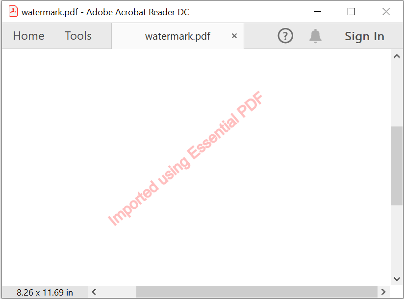
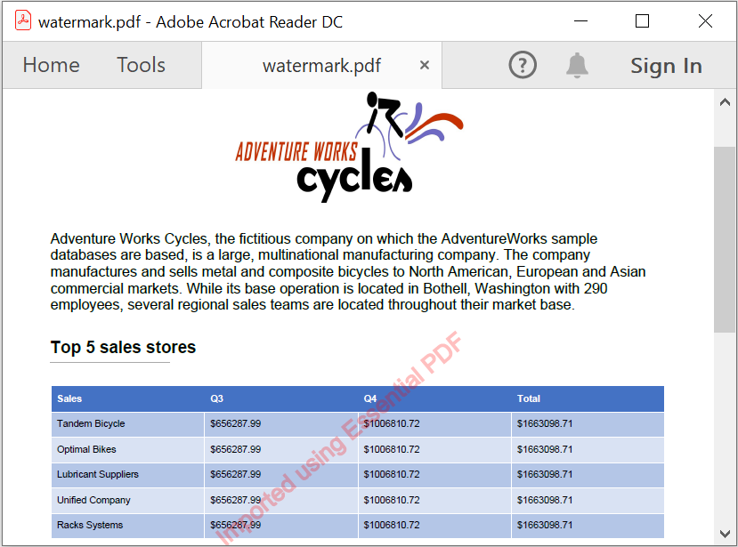

# Working with Watermarks

The Essential&reg; PDF provides support to add watermark or stamp with text and images in the PDF document.

To quickly get started, add Watermarks and Bookmarks to a PDF document in .NET using the PDF Library. Please, check this video:


## Adding text watermark in PDF document

The below code illustrates how to draw the text watermark in new PDF document using [DrawString](https://help.syncfusion.com/cr/document-processing/Syncfusion.Pdf.Graphics.PdfGraphics.html#Syncfusion_Pdf_Graphics_PdfGraphics_DrawString_System_String_Syncfusion_Pdf_Graphics_PdfFont_Syncfusion_Pdf_Graphics_PdfPen_Syncfusion_Pdf_Graphics_PdfBrush_System_Drawing_PointF_) method of [PdfGraphics](https://help.syncfusion.com/cr/document-processing/Syncfusion.Pdf.Graphics.PdfGraphics.html) class. The transparency can be applied to the text or images using [SetTransparency](https://help.syncfusion.com/cr/document-processing/Syncfusion.Pdf.Graphics.PdfGraphics.html#Syncfusion_Pdf_Graphics_PdfGraphics_SetTransparency_System_Single_) method and rotation can be applied using [RotateTransform](https://help.syncfusion.com/cr/document-processing/Syncfusion.Pdf.Graphics.PdfGraphics.html#Syncfusion_Pdf_Graphics_PdfGraphics_RotateTransform_System_Single_) method.

The [PdfGraphicsState](https://help.syncfusion.com/cr/document-processing/Syncfusion.Pdf.Graphics.PdfGraphicsState.html) class is used to save the current graphics context of a PdfGraphics object. This includes properties like transformations, transparency settings, clipping paths, and other graphical configurations. By calling `graphics.Save()`, you store the current state before applying changes such as rotation or transparency. Later, you can restore this state using `graphics.Restore(state)` to revert to the original settings, ensuring that temporary modifications do not affect subsequent drawing operations. This is especially useful when adding watermarks, as it allows you to isolate the watermark styling from other content on the page.



 

using Syncfusion.Drawing;
using Syncfusion.Pdf;
using Syncfusion.Pdf.Graphics;

//Create a new PDF document.
PdfDocument pdfDocument = new PdfDocument();
//Add a page to the PDF document.
PdfPage pdfPage = pdfDocument.Pages.Add();
//Create PDF graphics for the page.
PdfGraphics graphics = pdfPage.Graphics;

//Set the font.
PdfFont font = new PdfStandardFont(PdfFontFamily.Helvetica, 20);
//Add watermark text.
PdfGraphicsState state = graphics.Save();
graphics.SetTransparency(0.25f);
graphics.RotateTransform(-40);
graphics.DrawString("Imported using Essential PDF", font, PdfPens.Red, PdfBrushes.Red, new PointF(-150, 450));

//Save and close the document.
pdfDocument.Save("Watermark.pdf");
pdfDocument.Close(true);





using System.Drawing;
using Syncfusion.Pdf;
using Syncfusion.Pdf.Graphics;

//Create a new PDF document.
PdfDocument pdfDocument = new PdfDocument();
//Add a page to the PDF document.
PdfPage pdfPage = pdfDocument.Pages.Add();
//Create PDF graphics for the page.
PdfGraphics graphics = pdfPage.Graphics;

//Set the font.
PdfFont font = new PdfStandardFont(PdfFontFamily.Helvetica, 20);
//Add watermark text.
PdfGraphicsState state = graphics.Save();
graphics.SetTransparency(0.25f);
graphics.RotateTransform(-40);
graphics.DrawString("Imported using Essential PDF", font, PdfPens.Red, PdfBrushes.Red, new PointF(-150, 450));

//Save and close the document.
pdfDocument.Save("Watermark.pdf");
pdfDocument.Close(true);





Imports Syncfusion.Pdf
Imports Syncfusion.Pdf.Graphics
Imports System.Drawing

'Create a new PDF document.
Dim pdfDocument As New PdfDocument()
'Add a page to the PDF document.
Dim pdfPage As PdfPage = pdfDocument.Pages.Add()
'Create PDF graphics for the page.
Dim graphics As PdfGraphics = pdfPage.Graphics

'Set the font.
Dim font As PdfFont = New PdfStandardFont(PdfFontFamily.Helvetica, 20)
'Add watermark text.
Dim state As PdfGraphicsState = graphics.Save()
graphics.SetTransparency(0.25F)
graphics.RotateTransform(-40)
graphics.DrawString("Imported using Essential PDF", font, PdfPens.Red, PdfBrushes.Red, New PointF(-150, 450))

'Save and close the document.
pdfDocument.Save("Watermark.pdf")
pdfDocument.Close(True)





You can download a complete working sample from [GitHub](https://github.com/SyncfusionExamples/PDF-Examples/tree/master/Watermark/Adding-text-watermark-in-PDF-document).

The following screenshot shows the output of adding text watermark to PDF document. 

The below code illustrates how to draw the text watermark in an existing PDF document using [DrawString](https://help.syncfusion.com/cr/document-processing/Syncfusion.Pdf.Graphics.PdfGraphics.html#Syncfusion_Pdf_Graphics_PdfGraphics_DrawString_System_String_Syncfusion_Pdf_Graphics_PdfFont_Syncfusion_Pdf_Graphics_PdfBrush_System_Drawing_PointF_) method of [PdfGraphics](https://help.syncfusion.com/cr/document-processing/Syncfusion.Pdf.Graphics.PdfGraphics.html) class.



 

using Syncfusion.Drawing;
using Syncfusion.Pdf;
using Syncfusion.Pdf.Graphics;
using Syncfusion.Pdf.Parsing;

//Load an existing PDF document.
PdfLoadedDocument loadedDocument = new PdfLoadedDocument("Input.pdf");
//Get first page from document.
PdfPageBase loadedPage = loadedDocument.Pages[0];
//Create PDF graphics for the page.
PdfGraphics graphics = loadedPage.Graphics;

//Set the standard font.
PdfFont font = new PdfStandardFont(PdfFontFamily.Helvetica, 20);

//Add watermark text.
PdfGraphicsState state = graphics.Save();
graphics.SetTransparency(0.25f);
graphics.RotateTransform(-40);
graphics.DrawString("Imported using Essential PDF", font, PdfPens.Red, PdfBrushes.Red, new PointF(-150, 450));

//Save and close the document.
loadedDocument.Save("Watermark.pdf");
loadedDocument.Close(true);





using System.Drawing;
using Syncfusion.Pdf;
using Syncfusion.Pdf.Graphics;
using Syncfusion.Pdf.Parsing;

//Load an existing PDF document.
PdfLoadedDocument loadedDocument = new PdfLoadedDocument("Input.pdf");
//Get first page from document.
PdfPageBase loadedPage = loadedDocument.Pages[0];
//Create PDF graphics for the page.
PdfGraphics graphics = loadedPage.Graphics;

//Set the standard font.
PdfFont font = new PdfStandardFont(PdfFontFamily.Helvetica, 20);
//Add watermark text.
PdfGraphicsState state = graphics.Save();
graphics.SetTransparency(0.25f);
graphics.RotateTransform(-40);
graphics.DrawString("Imported using Essential PDF", font, PdfPens.Red, PdfBrushes.Red, new PointF(-150, 450));

//Save and close the document.
loadedDocument.Save("Watermark.pdf");
loadedDocument.Close(true);





Imports Syncfusion.Pdf
Imports Syncfusion.Pdf.Graphics
Imports Syncfusion.Pdf.Parsing
Imports System.Drawing

'Load an existing PDF document.
Dim loadedDocument As New PdfLoadedDocument("Input.pdf")
'Get first page from document.
Dim loadedPage As PdfPageBase = loadedDocument.Pages(0)
'Create PDF graphics for the page.
Dim graphics As PdfGraphics = loadedPage.Graphics

'Set the font.
Dim font As PdfFont = New PdfStandardFont(PdfFontFamily.Helvetica, 20)

'Add watermark text.
Dim state As PdfGraphicsState = graphics.Save()
graphics.SetTransparency(0.25F)
graphics.RotateTransform(-40)
graphics.DrawString("Imported using Essential PDF", font, PdfPens.Red, PdfBrushes.Red, New PointF(-150, 450))

'Save and close the document.
loadedDocument.Save("Watermark.pdf")
loadedDocument.Close(True)





You can download a complete working sample from [GitHub](https://github.com/SyncfusionExamples/PDF-Examples/tree/master/Watermark/Add-text-watermark-in-an-existing-PDF-document/).

The following screenshot shows the output of adding text watermark to an existing PDF document. 

## Adding image watermark in PDF document

The below code sample illustrates how to add image watermark in PDF document, using [DrawImage](https://help.syncfusion.com/cr/document-processing/Syncfusion.Pdf.Graphics.PdfGraphics.html#Syncfusion_Pdf_Graphics_PdfGraphics_DrawImage_Syncfusion_Pdf_Graphics_PdfImage_System_Drawing_PointF_System_Drawing_SizeF_) method of [PdfGraphics](https://help.syncfusion.com/cr/document-processing/Syncfusion.Pdf.Graphics.PdfGraphics.html) class. The transparency can be applied to the text or images using [SetTransparency](https://help.syncfusion.com/cr/document-processing/Syncfusion.Pdf.Graphics.PdfGraphics.html#Syncfusion_Pdf_Graphics_PdfGraphics_SetTransparency_System_Single_) method and rotation can be applied using [RotateTransform](https://help.syncfusion.com/cr/document-processing/Syncfusion.Pdf.Graphics.PdfGraphics.html#Syncfusion_Pdf_Graphics_PdfGraphics_RotateTransform_System_Single_) method.

The [PdfGraphicsState](https://help.syncfusion.com/cr/document-processing/Syncfusion.Pdf.Graphics.PdfGraphicsState.html) class is used to save the current graphics context of a PdfGraphics object. This includes properties like transformations, transparency settings, clipping paths, and other graphical configurations. By calling `graphics.Save()`, you store the current state before applying changes such as rotation or transparency. Later, you can restore this state using `graphics.Restore(state)` to revert to the original settings, ensuring that temporary modifications do not affect subsequent drawing operations. This is especially useful when adding watermarks, as it allows you to isolate the watermark styling from other content on the page.



 	

using Syncfusion.Drawing;
using Syncfusion.Pdf;
using Syncfusion.Pdf.Graphics;

//Create a new PDF document.
PdfDocument pdfDocument = new PdfDocument();
//Add a page to the PDF document.
PdfPage pdfPage = pdfDocument.Pages.Add();
//Create PDF graphics for the page. 
PdfGraphics graphics = pdfPage.Graphics;

//Load the image as stream.
FileStream imageStream = new FileStream("Image.jpeg", FileMode.Open, FileAccess.Read);
//Image watermark.
PdfImage image = new PdfBitmap(imageStream);
PdfGraphicsState state = graphics.Save();
graphics.SetTransparency(0.25f);
//Draw the image. 
graphics.DrawImage(image, new PointF(0, 0), pdfPage.Graphics.ClientSize);

//Save and close the document.
pdfDocument.Save("Watermark.pdf");
pdfDocument.Close(true);





using System.Drawing;
using Syncfusion.Pdf;
using Syncfusion.Pdf.Graphics;

//Create a new PDF document.
PdfDocument pdfDocument = new PdfDocument();
//Add a page to the PDF document.
PdfPage pdfPage = pdfDocument.Pages.Add();
//Create PDF graphics for the page.
PdfGraphics graphics = pdfPage.Graphics;

//Add image watermark.
PdfImage image = new PdfBitmap("Image.jpeg");
PdfGraphicsState state = graphics.Save();
graphics.SetTransparency(0.25f);
//Draw the image
graphics.DrawImage(image, new PointF(0, 0), pdfPage.Graphics.ClientSize);

//Save and close the document.
pdfDocument.Save("Watermark.pdf");
pdfDocument.Close(true);





Imports Syncfusion.Pdf
Imports Syncfusion.Pdf.Graphics
Imports System.Drawing

'Create a new PDF document.
Dim pdfDocument As New PdfDocument()
'Add a page to the PDF document.
Dim pdfPage As PdfPage = pdfDocument.Pages.Add()
'Create PDF graphics for the page
Dim graphics As PdfGraphics = pdfPage.Graphics

'Add image watermark.
Dim image As PdfImage = New PdfBitmap("Image.jpeg")
Dim state As PdfGraphicsState = graphics.Save()
graphics.SetTransparency(0.25F)
'Draw the image.
graphics.DrawImage(image, New PointF(0, 0), pdfPage.Graphics.ClientSize)

'Save and close the document.
pdfDocument.Save("Watermark.pdf")
pdfDocument.Close(True)





You can download a complete working sample from [GitHub](https://github.com/SyncfusionExamples/PDF-Examples/tree/master/Watermark/Adding-image-watermark-in-PDF-document).

The following screenshot shows the output of adding image watermark to PDF document. 

The below code illustrates how to draw the image watermark in existing PDF document using  using [DrawImage](https://help.syncfusion.com/cr/document-processing/Syncfusion.Pdf.Graphics.PdfGraphics.html#Syncfusion_Pdf_Graphics_PdfGraphics_DrawImage_Syncfusion_Pdf_Graphics_PdfImage_System_Drawing_PointF_System_Drawing_SizeF_) method of [PdfGraphics](https://help.syncfusion.com/cr/document-processing/Syncfusion.Pdf.Graphics.PdfGraphics.html) class. 



 

using Syncfusion.Drawing;
using Syncfusion.Pdf;
using Syncfusion.Pdf.Graphics;
using Syncfusion.Pdf.Parsing;

//Load the PDF document
PdfLoadedDocument loadedDocument = new PdfLoadedDocument("Input.pdf");
//Get first page from document
PdfPageBase loadedPage = loadedDocument.Pages[0];
//Create PDF graphics for the page
PdfGraphics graphics = loadedPage.Graphics;

//Load the image file as stream
FileStream imageStream = new FileStream("Image.jpeg", FileMode.Open, FileAccess.Read);
PdfImage image = new PdfBitmap(imageStream);
PdfGraphicsState state = graphics.Save();
graphics.SetTransparency(0.25f);
//Draw the image
graphics.DrawImage(image, new PointF(0, 0), loadedPage.Graphics.ClientSize);

//Save and close the document.
loadedDocument.Save("watermark.pdf");
loadedDocument.Close(true);





using System.Drawing;
using Syncfusion.Pdf;
using Syncfusion.Pdf.Graphics;
using Syncfusion.Pdf.Parsing;

//Load an existing document.
PdfLoadedDocument loadedDocument = new PdfLoadedDocument("Input.pdf");
//Get first page from document.
PdfPageBase loadedPage = loadedDocument.Pages[0];
//Create PDF graphics for the page.
PdfGraphics graphics = loadedPage.Graphics;

//Add image watermark.
PdfImage image = new PdfBitmap("Image.jpeg");
PdfGraphicsState state = graphics.Save();
graphics.SetTransparency(0.25f);
//Draw the image. 
graphics.DrawImage(image, new PointF(0, 0), loadedPage.Graphics.ClientSize);

//Save and close the document.
loadedDocument.Save("watermark.pdf");
loadedDocument.Close(true);





Imports Syncfusion.Pdf
Imports Syncfusion.Pdf.Graphics
Imports Syncfusion.Pdf.Parsing
Imports System.Drawing

'Load the document.
Dim loadedDocument As New PdfLoadedDocument("Input.pdf")
'Get first page from document.
Dim loadedPage As PdfPageBase = loadedDocument.Pages(0)
'Create PDF graphics for the page
Dim graphics As PdfGraphics = loadedPage.Graphics

'Add image watermark.
Dim image As PdfImage = New PdfBitmap("Image.jpeg")
Dim state As PdfGraphicsState = graphics.Save()
graphics.SetTransparency(0.25F)
'Draw the image.
graphics.DrawImage(image, New PointF(0, 0), loadedPage.Graphics.ClientSize)

'Save and close the document.
loadedDocument.Save("watermark.pdf")
loadedDocument.Close(True)





You can download a complete working sample from [GitHub](https://github.com/SyncfusionExamples/PDF-Examples/tree/master/Watermark/Draw-the-image-watermark-in-an-existing-PDF-document).

The following screenshot shows the output of adding image watermark to an existing PDF document. 

## Adding Watermark Annotation

A watermark annotation is used to represent graphics that are expected to be printed at a fixed size and position on a page, regardless of the dimensions of the printed page. [PdfWatermarkAnnotation](https://help.syncfusion.com/cr/document-processing/Syncfusion.Pdf.Interactive.PdfWatermarkAnnotation.html) can be used.
The following code example explains how to add a watermark annotation in the PDF document


 

using Syncfusion.Drawing;
using Syncfusion.Pdf;
using Syncfusion.Pdf.Graphics;
using Syncfusion.Pdf.Parsing;

//Load the PDF document
PdfLoadedDocument loadedDocument = new PdfLoadedDocument("Input.pdf");
//Get the page 
PdfLoadedPage lpage = loadedDocument.Pages[0] as PdfLoadedPage;

//Creates PDF watermark annotation 
PdfWatermarkAnnotation watermark = new PdfWatermarkAnnotation(new RectangleF(100, 100, 200, 50));
//Sets properties to the annotation 
watermark.Opacity = 0.5f; 
//Create the appearance of watermark 
watermark.Appearance.Normal.Graphics.DrawString("Watermark Text", new PdfStandardFont(PdfFontFamily.Helvetica, 20), PdfBrushes.Red, new RectangleF(0, 0, 200, 50), new PdfStringFormat(PdfTextAlignment.Center, PdfVerticalAlignment.Middle));
//Adds the annotation to page 
lpage.Annotations.Add(watermark);

//Saves the document. 
loadedDocument.Save("WatermarkAnnotation.pdf"); 
loadedDocument.Close(true);





using System.Drawing;
using Syncfusion.Pdf;
using Syncfusion.Pdf.Graphics;
using Syncfusion.Pdf.Parsing;

//Load the existing PDF document
PdfLoadedDocument loadedDocument = new PdfLoadedDocument("input.pdf");
//Get the page 
PdfLoadedPage lpage = loadedDocument.Pages[0] as PdfLoadedPage;

//Creates PDF watermark annotation 
PdfWatermarkAnnotation watermark = new PdfWatermarkAnnotation(new RectangleF(100, 100, 200, 50));
//Sets properties to the annotation 
watermark.Opacity = 0.5f; 
//Create the appearance of watermark 
watermark.Appearance.Normal.Graphics.DrawString("Watermark Text", new PdfStandardFont(PdfFontFamily.Helvetica, 20), PdfBrushes.Red, new RectangleF(0, 0, 200, 50), new PdfStringFormat(PdfTextAlignment.Center, PdfVerticalAlignment.Middle));
//Adds the annotation to page 
lpage.Annotations.Add(watermark); 

//Saves the document to disk. 
loadedDocument.Save("WatermarkAnnotation.pdf"); 
loadedDocument.Close(true);





Imports Syncfusion.Pdf
Imports Syncfusion.Pdf.Graphics
Imports Syncfusion.Pdf.Parsing
Imports System.Drawing

'Load the existing PDF document
 Dim loadedDocument As New PdfLoadedDocument("input.pdf")
'Get the page 
Dim lpage As PdfLoadedPage = TryCast(loadedDocument.Pages(0),PdfLoadedPage)

'Creates PDF watermark annotation
Dim watermark As New PdfWatermarkAnnotation(New RectangleF(100, 100, 200, 50)) 
watermark.Opacity = 0.5f; 
'Creates the appearance of watermark
watermark.Appearance.Normal.Graphics.DrawString("Watermark Text", New PdfStandardFont(PdfFontFamily.Helvetica, 20), PdfBrushes.Red, New RectangleF(0, 0, 200, 50), New PdfStringFormat(PdfTextAlignment.Center, PdfVerticalAlignment.Middle))
'Adds annotation to the page 
lpage.Annotations.Add(watermark)

'Saves the document to disk. 
loadedDocument.Save("WatermarkAnnotation.pdf")
loadedDocument.Close(True)





You can download a complete working sample from [GitHub](https://github.com/SyncfusionExamples/PDF-Examples/tree/master/Annotation/Add-watermark-annotation-in-the-PDF-document).

## Removing Watermark Annotation

You can remove the Watermark annotation from the annotation collection, represented by the [PdfLoadedAnnotationCollection](https://help.syncfusion.com/cr/document-processing/Syncfusion.Pdf.Parsing.PdfLoadedAnnotationCollection.html) of the loaded page. The following code illustrates this.


 

    using Syncfusion.Pdf;
    using Syncfusion.Pdf.Graphics;
    using Syncfusion.Pdf.Parsing;

    //Load the PDF document
    PdfLoadedDocument loadedDocument = new PdfLoadedDocument("Input.pdf");
    // Iterate through the annotations collection and remove PdfLoadedWatermark annotations
    foreach (PdfPageBase page in loadedDocument.Pages)
    {
        for (int i = page.Annotations.Count - 1; i >= 0; i--)
        {
            // Check if the annotation is a PdfLoadedWatermarkAnnotation
            if (page.Annotations[i] is PdfLoadedWatermarkAnnotation)
            {
                // Remove the PdfLoadedWatermarkAnnotation
                page.Annotations.RemoveAt(i);
            }
        }
    }

    //Saves the document to disk. 
    loadedDocument.Save("WatermarkAnnotation.pdf"); 
    loadedDocument.Close(true);





    using Syncfusion.Pdf;
    using Syncfusion.Pdf.Graphics;
    using Syncfusion.Pdf.Parsing;

    //Load the existing PDF document
    PdfLoadedDocument loadedDocument = new PdfLoadedDocument("input.pdf");
    // Iterate through the annotations collection and remove PdfLoadedWatermark annotations
    foreach (PdfPageBase page in loadedDocument.Pages)
    {
        for (int i = page.Annotations.Count - 1; i >= 0; i--)
        {
            // Check if the annotation is a PdfLoadedWatermarkAnnotation
            if (page.Annotations[i] is PdfLoadedWatermarkAnnotation)
            {
                // Remove the PdfLoadedWatermarkAnnotation
                page.Annotations.RemoveAt(i);
            }
        }
    } 

    //Saves the document to disk. 
    loadedDocument.Save("WatermarkAnnotation.pdf"); 
    loadedDocument.Close(true);





    Imports Syncfusion.Pdf
    Imports Syncfusion.Pdf.Graphics
    Imports Syncfusion.Pdf.Parsing

    'Load the existing PDF document
    Dim loadedDocument As New PdfLoadedDocument("input.pdf")
    ' Iterate through the annotations collection and remove PdfLoadedWatermark annotations
    For Each page As PdfPageBase In loadedDocument.Pages
        Dim i As Integer = page.Annotations.Count - 1
        While i >= 0
            ' Check if the annotation is a PdfLoadedWatermarkAnnotation
            If TypeOf page.Annotations(i) Is PdfLoadedWatermarkAnnotation Then
                ' Remove the PdfLoadedWatermarkAnnotation
                page.Annotations.RemoveAt(i)
            End If
            i -= 1
        End While
    Next

    'Saves the document to disk. 
    loadedDocument.Save("WatermarkAnnotation.pdf")
    loadedDocument.Close(True)





You can download a complete working sample from [GitHub](https://github.com/SyncfusionExamples/PDF-Examples/tree/master/Watermark/Removing-watermark-annotation-in-PDF-document).

