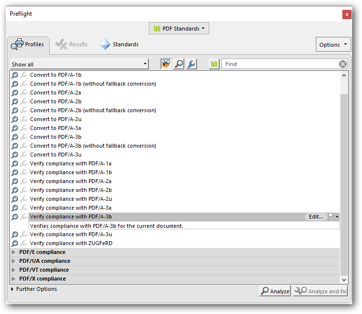
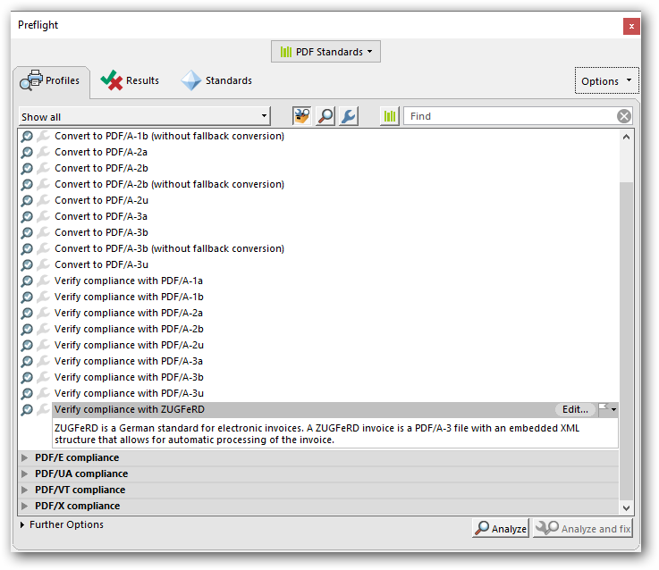
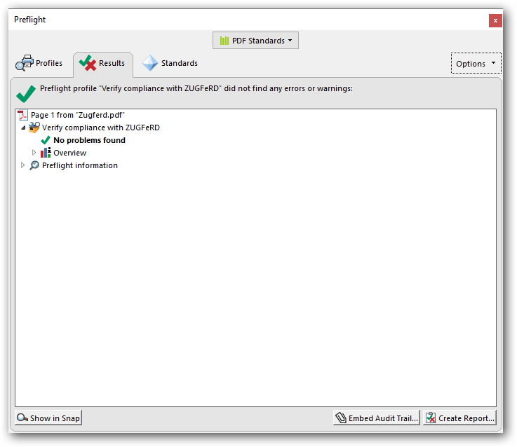

# Working with ZUGFeRD invoice 

The ZUGFeRD invoice is one of the uniformed data format for electronic invoices based on the ISO standard PDF/A-3, which is specifically designed for long term archiving. The ZUGFeRD invoice contains both human-readable invoice and machine-readable structured invoice data (XML).

## Generating ZUGFeRD invoice 

The Syncfusion&reg; .NET PDF library supports creating PDF documents with PDF/A-3b conformance, allowing external files to be added as attachments. ZUGFeRD has three versions: **ZugferdVersion 1.0**, **ZugferdVersion 2.0**, and **Factur-X**.

ZUGFeRD includes six conformance levels: 

* **Basic**: Represents structured data for simple invoices. Additional information can be included as free text. 
* **Comfort**: Provides structured data for fully automated invoice processing. 
* **Extended**: Includes additional structured data for exchanging invoices across different industry segments. 
* **Minimum**: Represents basic invoice details compatible with the French Standard Factur-X. 
* **EN16931**: Fully compliant with the *EU Standard*, though it only defines the core elements of an invoice. 
* **XRechnung**: Aligns with Germany's e-invoicing regulations, ensuring compliance with **EN 16931** standards.

N> The **Minimum** and **EN16931** conformance levels are only supported in **ZugferdVersion 2.0**. 
N> The **XRechnung** conformance level is only supported in **Factur-X**. 
N> A **PDF/A-3** file contains embedded XML data, making the invoice both **human-readable (PDF)** and **machine-readable (XML)** within the same document.  

The ZUGFeRD invoice document can be created by specifying the conformance level as ``Pdf_A3B`` through [PdfConformanceLevel](https://help.syncfusion.com/cr/document-processings/Syncfusion.Pdf.PdfConformanceLevel.html) Enum when creating the new PDF document and set the [ZugferdConformanceLevel](https://help.syncfusion.com/cr/document-processings/Syncfusion.Pdf.PdfDocument.html#Syncfusion_Pdf_PdfDocument_ZugferdConformanceLevel) property as *Basic* in [ZugferdConformanceLevel](https://help.syncfusion.com/cr/document-processings/Syncfusion.Pdf.ZugferdConformanceLevel.html) Enum. 

 

 

//Create ZUGFeRD invoice PDF document
PdfDocument document = new PdfDocument(PdfConformanceLevel.Pdf_A3B);

//Set ZUGFeRD conformance level
document.ZugferdConformanceLevel = ZugferdConformanceLevel.Basic;





//Create ZUGFeRD invoice PDF document
PdfDocument document = new PdfDocument(PdfConformanceLevel.Pdf_A3B);

//Set ZUGFeRD conformance level
document.ZugferdConformanceLevel = ZugferdConformanceLevel.Basic;





'Create ZUGFeRD invoice PDF document
Dim document As PdfDocument = New PdfDocument(PdfConformanceLevel.Pdf_A3B) 

'Set ZUGFeRD conformance level
document.ZugferdConformanceLevel = ZugferdConformanceLevel.Basic



  

Using PDF/A-3b conformance, you can create a ZUGFeRD invoice PDF by specifying the [ZugferdVersion](https://help.syncfusion.com/cr/document-processings/Syncfusion.Pdf.PdfDocument.html#Syncfusion_Pdf_PdfDocument_ZugferdVersion) property as *ZugferdVersion2_0* of [ZugferdVersion](https://help.syncfusion.com/cr/document-processings/Syncfusion.Pdf.ZugferdVersion.html) Enum. By default, ZugferdVersion1.0 used. 

 

 	

//Create ZUGFeRD invoice PDF document
PdfDocument document = new PdfDocument(PdfConformanceLevel.Pdf_A3B);

//Specifies ZUGFeRD version            
document.ZugferdVersion = ZugferdVersion.ZugferdVersion2_0;





//Create ZUGFeRD invoice PDF document
PdfDocument document = new PdfDocument(PdfConformanceLevel.Pdf_A3B);

//Specifies ZUGFeRD version 
document.ZugferdVersion = ZugferdVersion.ZugferdVersion2_0;





'Create ZUGFeRD invoice PDF document
Dim document As PdfDocument = New PdfDocument(PdfConformanceLevel.Pdf_A3B) 

'Specifies ZUGFeRD version 
document.ZugferdVersion = ZugferdVersion.ZugferdVersion2_0



  

## Adding ZUGFeRD structured data as attachment

The PDF/A-3b conformance supports the external files as attachment to the PDF document using [PdfAttachment](https://help.syncfusion.com/cr/document-processings/Syncfusion.Pdf.Interactive.PdfAttachment.html) class. 

 

 

//Creates an attachment
FileStream fontStream = new FileStream("../../Data/ZUGFeRD-invoice.xml", FileMode.Open, FileAccess.Read);
PdfAttachment attachment = new PdfAttachment("ZUGFeRD-invoice.xml",invoiceStream);
attachment.Relationship = PdfAttachmentRelationship.Alternative;
attachment.ModificationDate = DateTime.Now;
attachment.Description = "ZUGFeRD-invoice";
attachment.MimeType = "application/xml";
//Add attachment to PDF document
document.Attachments.Add(attachment);





//Creates an attachment
FileStream invoiceStream = new FileStream("../../Data/ZUGFeRD-invoice.xml", FileMode.Open, FileAccess.Read);
PdfAttachment attachment = new PdfAttachment("ZUGFeRD-invoice.xml",invoiceStream);
attachment.Relationship = PdfAttachmentRelationship.Alternative;
attachment.ModificationDate = DateTime.Now;
attachment.Description = "ZUGFeRD-invoice";
attachment.MimeType = "application/xml";
//Add attachment to PDF document
document.Attachments.Add(attachment);





'Creates an attachment
Dim invoiceStream As FileStream = New FileStream("../../Data/ZUGFeRD-invoice.xml", FileMode.Open, FileAccess.Read)
Dim attachment As PdfAttachment = New PdfAttachment("ZUGFeRD-invoice.xml", invoiceStream)
attachment.Relationship = PdfAttachmentRelationship.Alternative
attachment.ModificationDate = DateTime.Now
attachment.Description = "ZUGFeRD-invoice"
attachment.MimeType = "application/xml"
//Add attachment to PDF document 
document.Attachments.Add(attachment)



  

N> **XML Naming Guidelines** 

N> As per the ZUGFeRD standard guidelines, the XML file name must follow the specified format: 

N> 1. **ZUGFeRD 1.0**: The file name should be "ZUGFeRD-invoice.xml". 
N> 2. **ZUGFeRD 2.0**: The file name should be "zugferd-invoice.xml". 
N> 3. **Factur-X**: The file name should be "factur-x.xml", except for **XRechnung**, where the file name must be "xrechnung.xml".

Using **PDF/A-3b** conformance, you can create a **ZUGFeRD invoice PDF** by specifying the [ZugferdVersion](https://help.syncfusion.com/cr/document-processings/Syncfusion.Pdf.PdfDocument.html#Syncfusion_Pdf_PdfDocument_ZugferdVersion) property as **Factur-X** in the [ZugferdVersion](https://help.syncfusion.com/cr/document-processings/Syncfusion.Pdf.ZugferdVersion.html) Enum.

 

 

using Syncfusion.Pdf.Interactive;
using Syncfusion.Pdf;

//Create a new PDF document 
PdfDocument document = new PdfDocument(PdfConformanceLevel.Pdf_A3B);

//Set ZUGFeRD conformance level  
 document.ZugferdConformanceLevel = ZugferdConformanceLevel.XRechnung; 

//Set ZUGFeRD version 
document.ZugferdVersion = ZugferdVersion.FacturX; 

// Load the font file as stream 
FileStream fontStream = new FileStream(@"xrechnung.xml", FileMode.Open, FileAccess.Read); 

//Set an attachment  
 PdfAttachment attachment = new PdfAttachment(@"xrechnung.xml", fontStream); 
attachment.Relationship = PdfAttachmentRelationship.Alternative; 
attachment.ModificationDate = DateTime.Now; 
attachment.Description = " ZUGFeRD-Xrechnung"; 
attachment.MimeType = "text/xml"; 

//Add attachment to PDF document 
document.Attachments.Add(attachment); 

//Save the document
document.Save("Output.pdf"); 
//Closes the document 
document.Close(true);  





using Syncfusion.Pdf.Interactive;
using Syncfusion.Pdf;

//Create a new PDF document 
PdfDocument document = new PdfDocument(PdfConformanceLevel.Pdf_A3B);

//Set ZUGFeRD conformance level  
 document.ZugferdConformanceLevel = ZugferdConformanceLevel.XRechnung; 

//Set ZUGFeRD version 
document.ZugferdVersion = ZugferdVersion.FacturX; 

// Load the font file as stream 
FileStream fontStream = new FileStream(@"xrechnung.xml", FileMode.Open, FileAccess.Read); 

//Set an attachment  
 PdfAttachment attachment = new PdfAttachment(@"xrechnung.xml", fontStream); 
attachment.Relationship = PdfAttachmentRelationship.Alternative; 
attachment.ModificationDate = DateTime.Now; 
attachment.Description = " ZUGFeRD-Xrechnung"; 
attachment.MimeType = "text/xml"; 

//Add attachment to PDF document 
document.Attachments.Add(attachment); 

//Save the document
document.Save("Output.pdf"); 
//Closes the document 
document.Close(true); 





Imports Syncfusion.Pdf.Interactive
Imports Syncfusion.Pdf

' Create a new PDF document  
Dim document As New PdfDocument(PdfConformanceLevel.Pdf_A3B)  

' Set ZUGFeRD conformance level  
document.ZugferdConformanceLevel = ZugferdConformanceLevel.XRechnung  

' Set ZUGFeRD version  
document.ZugferdVersion = ZugferdVersion.FacturX  

' Load the file as stream  
Dim fontStream As New FileStream("xrechnung.xml", FileMode.Open, FileAccess.Read)  
' Set an attachment  
Dim attachment As New PdfAttachment("xrechnung.xml", fontStream)  
attachment.Relationship = PdfAttachmentRelationship.Alternative  
attachment.ModificationDate = DateTime.Now 
attachment.Description = "ZUGFeRD-Xrechnung"  
attachment.MimeType = "text/xml" 

' Add attachment to PDF document  
document.Attachments.Add(attachment)  

' Save the document
document.Save("Output.pdf")  
' Closes the document 
document.Close(True) 



 

You can download a complete working sample from [GitHub](https://github.com/SyncfusionExamples/PDF-Examples/tree/master/ZUGFeRD/Factur-X/.NET).

## Complete code

The complete code to create ZUGFeRD invoice PDF document as follows.

 

 

using Syncfusion.Pdf.Interactive;
using Syncfusion.Pdf;

//Create ZUGFeRD invoice PDF document
PdfDocument document = new PdfDocument(PdfConformanceLevel.Pdf_A3B);
//Set ZUGFeRD conformance level 
document.ZugferdConformanceLevel = ZugferdConformanceLevel.Basic;

//Creates an attachment 
FileStream fontStream = new FileStream("../../ Data / ZUGFeRD - invoice.xml", FileMode.Open, FileAccess.Read);
PdfAttachment attachment = new PdfAttachment("ZUGFeRD-invoice.xml",invoiceStream);
attachment.Relationship = PdfAttachmentRelationship.Alternative;
attachment.ModificationDate = DateTime.Now;
attachment.Description = "ZUGFeRD-invoice";
attachment.MimeType = "application/xml";
//Add attachment to PDF document
document.Attachments.Add(attachment);

//Save the document
document.Save("Output.pdf"); 
//Closes the document 
document.Close(true); 





using Syncfusion.Pdf.Interactive;
using Syncfusion.Pdf;

//Create ZUGFeRD invoice PDF document
PdfDocument document = new PdfDocument(PdfConformanceLevel.Pdf_A3B);
//Set ZUGFeRD conformance level 
document.ZugferdConformanceLevel = ZugferdConformanceLevel.Basic;

//Creates an attachment 
FileStream invoiceStream = new FileStream("../../ Data / ZUGFeRD - invoice.xml", FileMode.Open, FileAccess.Read);
PdfAttachment attachment = new PdfAttachment("ZUGFeRD-invoice.xml",invoiceStream);
attachment.Relationship = PdfAttachmentRelationship.Alternative;
attachment.ModificationDate = DateTime.Now;
attachment.Description = "ZUGFeRD-invoice";
attachment.MimeType = "application/xml";
//Add attachment to PDF document
document.Attachments.Add(attachment);

//Save and close the document
document.Save("Zugferd.pdf");
document.Close(true);





Imports Syncfusion.Pdf.Interactive
Imports Syncfusion.Pdf

'Create ZUGFeRD invoice PDF document
Dim document As PdfDocument = New PdfDocument(PdfConformanceLevel.Pdf_A3B)
'Set ZUGFeRD conformance level 
document.ZugferdConformanceLevel = ZugferdConformanceLevel.Basic

'Creates an attachment
Dim invoiceStream As FileStream = New FileStream("../../ Data / ZUGFeRD - invoice.xml", FileMode.Open, FileAccess.Read)
Dim attachment As PdfAttachment = New PdfAttachment("ZUGFeRD-invoice.xml",invoiceStream)
attachment.Relationship = PdfAttachmentRelationship.Alternative
attachment.ModificationDate = DateTime.Now
attachment.Description = "ZUGFeRD-invoice"
attachment.MimeType = "application/xml"
//Add attachment to PDF document
document.Attachments.Add(attachment)

'Save and close the document
document.Save("Zugferd.pdf")
document.Close(True)



  

You can download a complete working sample from [GitHub](https://github.com/SyncfusionExamples/PDF-Examples/tree/master/ZUGFeRD/Create-ZUGFeRD-compliment-PDF-invoice).

## Extract ZUGFeRD invoice from PDF

You can extract the ZUGFeRD invoice using [PdfAttachment](https://help.syncfusion.com/cr/document-processings/Syncfusion.Pdf.Interactive.PdfAttachment.html) class. 



 	

using Syncfusion.Pdf.Interactive;
using Syncfusion.Pdf.Parsing;

//Loads the PDF document
PdfLoadedDocument document = new PdfLoadedDocument("Sample.pdf");

//Iterates the attachments
foreach (PdfAttachment attachment in document.Attachments)
{
//Extracts the ZUGFeRD invoice attachment and saves it to the disk
FileStream s = new FileStream(attachment.FileName, FileMode.Create);
s.Write(attachment.Data, 0, attachment.Data.Length);
s.Dispose();
}

//Saves and closes the document
document.Save("Output.pdf");
document.Close(true);





using Syncfusion.Pdf.Interactive;
using Syncfusion.Pdf.Parsing;

//Loads the PDF document
PdfLoadedDocument document = new PdfLoadedDocument("Sample.pdf");

//Iterates the attachments
foreach (PdfAttachment attachment in document.Attachments)
{
//Extracts the ZUGFeRD invoice attachment and saves it to the disk
FileStream s = new FileStream(attachment.FileName, FileMode.Create);
s.Write(attachment.Data, 0, attachment.Data.Length);
s.Dispose();
}

//Saves and closes the document
document.Save("Output.pdf");
document.Close(true);





Imports Syncfusion.Pdf.Interactive
Imports Syncfusion.Pdf.Parsing

'Loads the PDF document
Dim document As New PdfLoadedDocument("Sample.pdf")

'Iterates the attachments
For Each attachment As PdfAttachment In document.Attachments
'Extracts the attachment and saves it to the disk
Dim s As New FileStream(attachment.FileName, FileMode.Create)
s.Write(attachment.Data, 0, attachment.Data.Length)
s.Dispose()
Next

'Saves and closes the document
document.Save("Output.pdf")
document.Close(True)





You can download a complete working sample from [GitHub](https://github.com/SyncfusionExamples/PDF-Examples/tree/master/ZUGFeRD/Extract-ZUGFeRD-invoice-from-PDF-document).

## Validating ZUGFeRD invoices using Adobe Acrobat

The ZUGFeRD invoices can be validated as follows:

1. Conformance to the PDF/A-3b standard can be checked with Preflight function in Adobe acrobat. 

    * Open the PDF and choose Tools > Print Production > Preflight in the right pane.

    * Select the PDF/A-3b profile and click the Analyze button.

    * Check the result

2. Conformance to the ZUGFeRD invoice can be checked as follows:

    * Open the PDF and choose Tools > Print Production > Preflight in the right pane.

    * Select the ZUGFeRD profile and click the Analyze button.

    * Check the result

