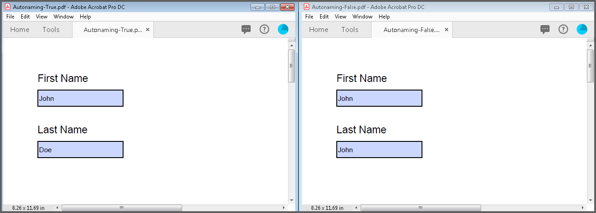
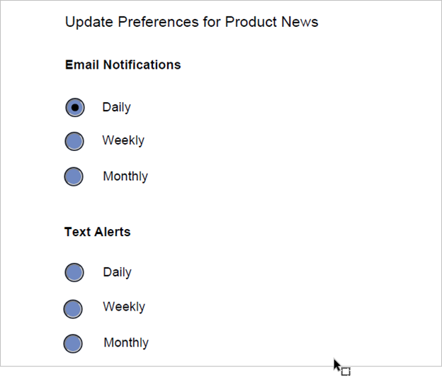
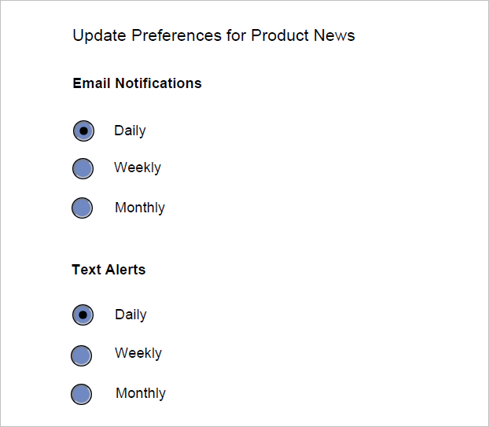

# Working with PDF Forms    

An interactive form, sometimes referred to as an AcroForm is a collection of fields for gathering information. A PDF document can contain any number of fields appearing on any combination of pages, all of that make a single, globally interactive form spanning the entire document.

To quickly get started with creating, filling and flattening PDF form fields in .NET using the Syncfusion&reg; PDF library, refer to this video tutorial:


## Creating a new PDF form

Essential&reg; PDF allows you to [create and manage the form](https://www.syncfusion.com/document-processing/pdf-framework/net/pdf-library/pdf-form-fields) (AcroForm) in PDF document by using [PdfForm](https://help.syncfusion.com/cr/document-processing/Syncfusion.Pdf.Interactive.PdfForm.html) class. The [PdfFormFieldCollection](https://help.syncfusion.com/cr/document-processing/Syncfusion.Pdf.Interactive.PdfFormFieldCollection.html) class represents the entire field collection of the form.

### Adding the text box field 

[PdfTextBoxField](https://help.syncfusion.com/cr/document-processing/Syncfusion.Pdf.Interactive.PdfTextBoxField.html) class is used to create a text box field in PDF forms. 

The below code snippet illustrates how to add a textbox field to a new PDF document.





using Syncfusion.Drawing;
using Syncfusion.Pdf;
using Syncfusion.Pdf.Graphics;
using Syncfusion.Pdf.Interactive;

//Create a new PDF document.
PdfDocument document = new PdfDocument();
//Add a new page to the PDF document.
PdfPage page = document.Pages.Add();

//Create a textbox field and add the properties.
PdfTextBoxField textBoxField = new PdfTextBoxField(page, "FirstName");
textBoxField.Bounds = new Syncfusion.Drawing.RectangleF(0, 0, 100, 20);
textBoxField.ToolTip = "First Name";
//Add the form field to the document.
document.Form.Fields.Add(textBoxField);

//Save the document.
document.Save("Output.pdf");
//Close the document.
document.Close(true);





using Syncfusion.Drawing;
using Syncfusion.Pdf;
using Syncfusion.Pdf.Graphics;
using Syncfusion.Pdf.Interactive;

//Create a new PDF document.
PdfDocument document = new PdfDocument();
//Add a new page to the PDF document.
PdfPage page = document.Pages.Add();

//Create a textbox field and add the properties.
PdfTextBoxField textBoxField = new PdfTextBoxField(page, "FirstName");
textBoxField.Bounds = new RectangleF(0, 0, 100, 20);
textBoxField.ToolTip = "First Name";
//Add the form field to the document.
document.Form.Fields.Add(textBoxField);

//Save the document.
document.Save("Form.pdf");
//Close the document.
document.Close(true);





Imports Syncfusion.Drawing
Imports Syncfusion.Pdf
Imports Syncfusion.Pdf.Graphics
Imports Syncfusion.Pdf.Interactive

'Load the PDF document.
Dim document As PdfDocument = New PdfDocument()
'Add a new page to the PDF document.
Dim page As PdfPage = document.Pages.Add()

'Create a textbox field and add the properties.
Dim textBoxField As PdfTextBoxField = New PdfTextBoxField(page, "FirstName")
textBoxField.Bounds = New RectangleF(0, 0, 100, 20)
textBoxField.ToolTip = "First Name"
'Add the form field to the document.
document.Form.Fields.Add(textBoxField)

'Save the document.
document.Save("Form.pdf")
'Close the document.
document.Close(True)



  

You can download a complete working sample from [GitHub](https://github.com/SyncfusionExamples/PDF-Examples/tree/master/Forms/Add-a-textbox-field-to-a-new-PDF-document).

The below code snippet illustrates how to add the textbox to an existing PDF document.

  



using Syncfusion.Pdf;
using Syncfusion.Pdf.Interactive;
using Syncfusion.Pdf.Parsing;

//Load the PDF document.
PdfLoadedDocument loadedDocument = new PdfLoadedDocument("Input.pdf");
//Create the form if the form does not exist in the loaded document.
if (loadedDocument.Form == null)
    loadedDocument.CreateForm();
//Load the page.
PdfLoadedPage loadedPage = loadedDocument.Pages[0] as PdfLoadedPage;

//Create a textbox field and add the properties.
PdfTextBoxField textBoxField = new PdfTextBoxField(loadedPage, "FirstName");
textBoxField.Bounds = new Syncfusion.Drawing.RectangleF(0, 0, 100, 20);
textBoxField.ToolTip = "First Name";
//Add the form field to the existing PDF document.
loadedDocument.Form.Fields.Add(textBoxField);

//Save the document.
loadedDocument.Save("Form.pdf");
//Close the document.
loadedDocument.Close(true);





using Syncfusion.Pdf;
using Syncfusion.Pdf.Interactive;
using Syncfusion.Pdf.Parsing;

//Load the existing PDF document.
PdfLoadedDocument loadedDocument = new PdfLoadedDocument("Input.pdf");
//Create the form if the form does not exist in the loaded document.
if(loadedDocument.Form==null)
loadedDocument.CreateForm();
//Load the page.
PdfLoadedPage loadedPage = loadedDocument.Pages[0] as PdfLoadedPage;

//Create a textbox field and add the properties.
PdfTextBoxField textBoxField = new PdfTextBoxField(loadedPage, "FirstName");
textBoxField.Bounds = new RectangleF(0, 0, 100, 20);
textBoxField.ToolTip = "First Name";
//Add the form field to the existing PDF document.
loadedDocument.Form.Fields.Add(textBoxField);

//Save the document.
loadedDocument.Save("Form.pdf");
//Close the document.
loadedDocument.Close(true);





Imports Syncfusion.Pdf
Imports Syncfusion.Pdf.Interactive
Imports Syncfusion.Pdf.Parsing

'Load the PDF document.
Dim loadedDocument As New PdfLoadedDocument("Input.pdf")
'Create the form if the form does not exist in the loaded document
If loadedDocument.Form Is Nothing Then
loadedDocument.CreateForm()
End If
'Load the page
Dim loadedPage As PdfLoadedPage = TryCast(loadedDocument.Pages(0), PdfLoadedPage)

'Create a text box field and add the properties
Dim textBoxField As New PdfTextBoxField(loadedPage, "FirstName")
textBoxField.Bounds = New RectangleF(0, 0, 100, 20)
textBoxField.ToolTip = "First Name"
'Add the form field to the existing PDF document
loadedDocument.Form.Fields.Add(textBoxField)

'Save the document
loadedDocument.Save("Form.pdf")
'Close the document
loadedDocument.Close(True)



  

You can download a complete working sample from [GitHub](https://github.com/SyncfusionExamples/PDF-Examples/tree/master/Forms/Add-the-textbox-to-an-existing-PDF-document).

### Adding the combo box field

[PdfComboBoxField](https://help.syncfusion.com/cr/document-processing/Syncfusion.Pdf.Interactive.PdfComboBoxField.html) class is used to create a combo box field in PDF forms. You can add a list of items to the combo box by using the [PdfListFieldItem](https://help.syncfusion.com/cr/document-processing/Syncfusion.Pdf.Interactive.PdfListFieldItem.html) class.

Please refer the below code snippet for adding the combo box in new PDF document.

 



using Syncfusion.Pdf;
using Syncfusion.Pdf.Interactive;

//Create a new PDF document.
PdfDocument document = new PdfDocument();
//Add a new page to PDF document.
PdfPage page = document.Pages.Add();

//Create a combo box for the first page.
PdfComboBoxField comboBoxField = new PdfComboBoxField(page, "JobTitle");
//Set the combo box properties.
comboBoxField.Bounds = new Syncfusion.Drawing.RectangleF(0, 40, 100, 20);
//Set tooltip.
comboBoxField.ToolTip = "Job Title";
//Add list items.
comboBoxField.Items.Add(new PdfListFieldItem("Development", "accounts"));
comboBoxField.Items.Add(new PdfListFieldItem("Support", "advertise"));
comboBoxField.Items.Add(new PdfListFieldItem("Documentation", "content"));
//Add combo box to the form.
document.Form.Fields.Add(comboBoxField);

//Save the document.
document.Save("Output.pdf");
//Close the document.
document.Close(true);





using Syncfusion.Pdf;
using Syncfusion.Pdf.Interactive;

//Create a new PDF document.
PdfDocument document = new PdfDocument();
//Add a new page to PDF document.
PdfPage page = document.Pages.Add();

//Create a combo box for the first page.
PdfComboBoxField comboBoxField = new PdfComboBoxField(page, "JobTitle");
//Set the combo box properties.
comboBoxField.Bounds = new RectangleF(0, 40, 100, 20);
//Set tooltip.
comboBoxField.ToolTip = "Job Title";
//Add list items.
comboBoxField.Items.Add(new PdfListFieldItem("Development", "accounts"));
comboBoxField.Items.Add(new PdfListFieldItem("Support", "advertise"));
comboBoxField.Items.Add(new PdfListFieldItem("Documentation", "content"));
//Add combo box to the form.
document.Form.Fields.Add(comboBoxField);

//Save the document.
document.Save("Form.pdf");
//Close the document.
document.Close(true);





Imports Syncfusion.Pdf
Imports Syncfusion.Pdf.Interactive

'Load the PDF document.
Dim document As New PdfDocument()
'Add a new page to PDF document
Dim page As PdfPage = document.Pages.Add()

'Create a combo box for the first page
Dim comboBoxField As New PdfComboBoxField(page, "JobTitle")
'Set the combo box properties
comboBoxField.Bounds = New RectangleF(0, 40, 100, 20)
'Set tooltip
comboBoxField.ToolTip = "Job Title"
'Add list items
comboBoxField.Items.Add(New PdfListFieldItem("Development", "accounts"))
comboBoxField.Items.Add(New PdfListFieldItem("Support", "advertise"))
comboBoxField.Items.Add(New PdfListFieldItem("Documentation", "content"))
'Add combo box to the form
document.Form.Fields.Add(comboBoxField)

'Save the PDF document
document.Save("Form.pdf")
'Close the document                       
document.Close(True)



  

You can download a complete working sample from [GitHub](https://github.com/SyncfusionExamples/PDF-Examples/tree/master/Forms/Adding-combo-box-in-the-new-PDF-document).

Please refer the below code snippet for adding the combo box in existing PDF document.

 



using Syncfusion.Pdf;
using Syncfusion.Pdf.Interactive;
using Syncfusion.Pdf.Parsing;

//Load the PDF document.
PdfLoadedDocument loadedDocument = new PdfLoadedDocument("Input.pdf");
//Create the form if the form does not exist in the loaded document.
if (loadedDocument.Form == null)
    loadedDocument.CreateForm();
//Load the page.
PdfLoadedPage loadedPage = loadedDocument.Pages[0] as PdfLoadedPage;

//Create a combo box for the first page.
PdfComboBoxField comboBoxField = new PdfComboBoxField(loadedPage, "JobTitle");
//Set the combo box properties.
comboBoxField.Bounds = new Syncfusion.Drawing.RectangleF(0, 40, 100, 20);
//Set tooltip.
comboBoxField.ToolTip = "Job Title";
//Add list items.
comboBoxField.Items.Add(new PdfListFieldItem("Development", "accounts"));
comboBoxField.Items.Add(new PdfListFieldItem("Support", "advertise"));
comboBoxField.Items.Add(new PdfListFieldItem("Documentation", "content"));
//Add combo box to the form.
loadedDocument.Form.Fields.Add(comboBoxField);

//Save the document.
loadedDocument.Save("Form.pdf");
//Close the document.
loadedDocument.Close(true);





using Syncfusion.Pdf;
using Syncfusion.Pdf.Interactive;
using Syncfusion.Pdf.Parsing;

//Load the existing PDF document.
PdfLoadedDocument loadedDocument = new PdfLoadedDocument("Input.pdf");
//Create the form if the form does not exist in the loaded document.
if(loadedDocument.Form==null)
loadedDocument.CreateForm();
//Load the page.
PdfLoadedPage loadedPage = loadedDocument.Pages[0] as PdfLoadedPage;

//Create a combo box for the first page.
PdfComboBoxField comboBoxField = new PdfComboBoxField(loadedPage, "JobTitle");
//Set the combo box properties.
comboBoxField.Bounds = new RectangleF(0, 40, 100, 20);
//Set tooltip.
comboBoxField.ToolTip = "Job Title";
//Add list items.
comboBoxField.Items.Add(new PdfListFieldItem("Development", "accounts"));
comboBoxField.Items.Add(new PdfListFieldItem("Support", "advertise"));
comboBoxField.Items.Add(new PdfListFieldItem("Documentation", "content"));
//Add combo box to the form.
loadedDocument.Form.Fields.Add(comboBoxField);

//Save the document.
loadedDocument.Save("Form.pdf");
//Close the document.
loadedDocument.Close(true);





Imports Syncfusion.Pdf
Imports Syncfusion.Pdf.Interactive
Imports Syncfusion.Pdf.Parsing

'Load the PDF document.
Dim loadedDocument As New PdfLoadedDocument("Input.pdf")
'Create the form if the form does not exist in the loaded document
If loadedDocument.Form Is Nothing Then
loadedDocument.CreateForm()
End If
'Load the page
Dim loadedPage As PdfLoadedPage = TryCast(loadedDocument.Pages(0), PdfLoadedPage)

'Create a combo box for the first page.
Dim comboBoxField As New PdfComboBoxField(loadedPage, "JobTitle")
'Set the combo box properties
comboBoxField.Bounds = New RectangleF(0, 40, 100, 20)
'Set tooltip
comboBoxField.ToolTip = "Job Title"
'Add list items
comboBoxField.Items.Add(New PdfListFieldItem("Development", "accounts"))
comboBoxField.Items.Add(New PdfListFieldItem("Support", "advertise"))
comboBoxField.Items.Add(New PdfListFieldItem("Documentation", "content"))
'Add combo box to the form
loadedDocument.Form.Fields.Add(comboBoxField)

'Save the document
loadedDocument.Save("Form.pdf")
'Close the document
loadedDocument.Close(True)



  

You can download a complete working sample from [GitHub](https://github.com/SyncfusionExamples/PDF-Examples/tree/master/Forms/Adding-the-combo-box-in-existing-PDF-document).

### Set text alignment in a Combo Box field

Use the [TextAlignment](https://help.syncfusion.com/cr/document-processing/Syncfusion.Pdf.Parsing.PdfLoadedComboBoxField.html#Syncfusion_Pdf_Parsing_PdfLoadedComboBoxField_TextAlignment) property of the [PdfLoadedComboBoxField](https://help.syncfusion.com/cr/document-processing/Syncfusion.Pdf.Parsing.PdfLoadedComboBoxField.html) to customize the text alignment in a combo box field. Refer to the following example for more details.

 



    using Syncfusion.Pdf;
    using Syncfusion.Pdf.Interactive;
    using Syncfusion.Pdf.Parsing;

    // Load an existing document.
    PdfLoadedDocument doc = new PdfLoadedDocument("SourceForm.pdf");
    // Load an existing combo box field by its name.
    PdfLoadedComboBoxField comboField = doc.Form.Fields["EmployeeCombo"] as PdfLoadedComboBoxField;
    // Set text alignment to center for the combo box field.
    comboField.TextAlignment = PdfTextAlignment.Center;
    // Save the updated document.
    doc.Save("Form.pdf");
    doc.Close(true);





    using Syncfusion.Pdf;
    using Syncfusion.Pdf.Interactive;
    using Syncfusion.Pdf.Parsing;

    // Load an existing document.
    PdfLoadedDocument doc = new PdfLoadedDocument("SourceForm.pdf");
    // Load an existing combo box field by its name.
    PdfLoadedComboBoxField comboField = doc.Form.Fields["EmployeeCombo"] as PdfLoadedComboBoxField;
    // Set text alignment to center for the combo box field.
    comboField.TextAlignment = PdfTextAlignment.Center;
    // Save the updated document.
    doc.Save("Form.pdf");
    doc.Close(true);





    Imports Syncfusion.Pdf
    Imports Syncfusion.Pdf.Interactive

    'Load the PDF document.
    Dim doc As New PdfLoadedDocument("SourceForm.pdf")
    ' Load an existing combo box field by its name.
    Dim comboField As PdfLoadedComboBoxField = TryCast(doc.Form.Fields("EmployeeCombo"), PdfLoadedComboBoxField)
    ' Set text alignment to center for the combo box field.
    comboField.TextAlignment = PdfTextAlignment.Center
    ' Save the updated document.
    doc.Save("Form.pdf")
    doc.Close(True)



  

You can download a complete working sample from [GitHub](https://github.com/SyncfusionExamples/PDF-Examples/tree/master/Annotation/Set-text-alignment-in-a-Combo-Box-field/.NET).

### Adding the radio button field

To create the radio button in the PDF forms, you can use [PdfRadioButtonListField](https://help.syncfusion.com/cr/document-processing/Syncfusion.Pdf.Interactive.PdfRadioButtonListField.html) class and you can create the radio button list items by using the [PdfRadioButtonListItem](https://help.syncfusion.com/cr/document-processing/Syncfusion.Pdf.Interactive.PdfRadioButtonListItem.html) class.

Please refer the below code snippet for adding the radio button in new PDF document.

 



using Syncfusion.Pdf;
using Syncfusion.Pdf.Interactive;

//Create a new PDF document.
PdfDocument document = new PdfDocument();
//Add a new page to PDF document.
PdfPage page = document.Pages.Add();

//Create a Radio button.
PdfRadioButtonListField employeesRadioList = new PdfRadioButtonListField(page, "employeesRadioList");
//Add the radio button into form.
document.Form.Fields.Add(employeesRadioList);
//Create radio button items.
PdfRadioButtonListItem radioButtonItem1 = new PdfRadioButtonListItem("1-9");
radioButtonItem1.Bounds = new Syncfusion.Drawing.RectangleF(100, 140, 20, 20);
PdfRadioButtonListItem radioButtonItem2 = new PdfRadioButtonListItem("10-49");
radioButtonItem2.Bounds = new Syncfusion.Drawing.RectangleF(100, 170, 20, 20);
//Add the items to radio button group.
employeesRadioList.Items.Add(radioButtonItem1);
employeesRadioList.Items.Add(radioButtonItem2);

//Save the document.
document.Save("Form.pdf");
//Close the document.
document.Close(true);




using Syncfusion.Pdf;
using Syncfusion.Pdf.Interactive;

//Create a new PDF document.
PdfDocument document = new PdfDocument();
//Add a new page to PDF document.
PdfPage page = document.Pages.Add();

//Create a Radio button.
PdfRadioButtonListField employeesRadioList = new PdfRadioButtonListField(page, "employeesRadioList");
//Add the radio button into form
document.Form.Fields.Add(employeesRadioList);
//Create radio button items.
PdfRadioButtonListItem radioButtonItem1 = new PdfRadioButtonListItem("1-9");
radioButtonItem1.Bounds = new RectangleF(100, 140, 20, 20);
PdfRadioButtonListItem radioButtonItem2 = new PdfRadioButtonListItem("10-49");
radioButtonItem2.Bounds = new RectangleF(100, 170, 20, 20);
//Add the items to radio button group.
employeesRadioList.Items.Add(radioButtonItem1);
employeesRadioList.Items.Add(radioButtonItem2);

//Save the document.
document.Save("Form.pdf");
//Close the document.
document.Close(true);





Imports Syncfusion.Pdf
Imports Syncfusion.Pdf.Interactive

'Load the PDF document.
Dim document As New PdfDocument()
'Add a new page to PDF document.
Dim page As PdfPage = document.Pages.Add()

'Create a Radio button.
Dim employeesRadioList As New PdfRadioButtonListField(page, "employeesRadioList")
'Add the radio button into form.
document.Form.Fields.Add(employeesRadioList)
'Create radio button items.
Dim radioItem1 As New PdfRadioButtonListItem("1-9")
radioItem1.Bounds = New RectangleF(100, 140, 20, 20)
Dim radioItem2 As New PdfRadioButtonListItem("10-49")
radioItem2.Bounds = New RectangleF(100, 170, 20, 20)
'Add the items to radio button group.
employeesRadioList.Items.Add(radioItem1)
employeesRadioList.Items.Add(radioItem2)

'Save the PDF document.
document.Save("Form.pdf")
'Close the document.
document.Close(True)



  

You can download a complete working sample from [GitHub](https://github.com/SyncfusionExamples/PDF-Examples/tree/master/Forms/Adding-radio-button-in-new-PDF-document).

The below code snippet illustrates how to add the radio button in existing PDF document.

  



using Syncfusion.Pdf;
using Syncfusion.Pdf.Interactive;
using Syncfusion.Pdf.Parsing;

//Load the PDF document.
PdfLoadedDocument loadedDocument = new PdfLoadedDocument("Input.pdf");
//Create the form if the form does not exist in the loaded document.
if (loadedDocument.Form == null)
    loadedDocument.CreateForm();
//Load the page.
PdfLoadedPage loadedPage = loadedDocument.Pages[0] as PdfLoadedPage;

//Create a Radio button.
PdfRadioButtonListField employeesRadioList = new PdfRadioButtonListField(loadedPage, "employeesRadioList");
//Add the radio button into loaded document.
loadedDocument.Form.Fields.Add(employeesRadioList);
//Create radio button items.
PdfRadioButtonListItem radioButtonItem1 = new PdfRadioButtonListItem("1-9");
radioButtonItem1.Bounds = new Syncfusion.Drawing.RectangleF(100, 140, 20, 20);
PdfRadioButtonListItem radioButtonItem2 = new PdfRadioButtonListItem("10-49");
radioButtonItem2.Bounds = new Syncfusion.Drawing.RectangleF(100, 170, 20, 20);
//Add the items to radio button group.
employeesRadioList.Items.Add(radioButtonItem1);
employeesRadioList.Items.Add(radioButtonItem2);

//Save the document.
loadedDocument.Save("Form.pdf");
//Close the document.
loadedDocument.Close(true);





using Syncfusion.Pdf;
using Syncfusion.Pdf.Interactive;
using Syncfusion.Pdf.Parsing;

//Load the existing PDF document.
PdfLoadedDocument loadedDocument = new PdfLoadedDocument("Input.pdf");
//Create the form if the form does not exist in the loaded document.
if(loadedDocument.Form==null)
loadedDocument.CreateForm();
//Load the page.
PdfLoadedPage loadedPage = loadedDocument.Pages[0] as PdfLoadedPage;

//Create a Radio button.
PdfRadioButtonListField employeesRadioList = new PdfRadioButtonListField(loadedPage, "employeesRadioList");
//Add the radio button into loaded document.
loadedDocument.Form.Fields.Add(employeesRadioList);
//Create radio button items.
PdfRadioButtonListItem radioButtonItem1 = new PdfRadioButtonListItem("1-9");
radioButtonItem1.Bounds = new RectangleF(100, 140, 20, 20);
PdfRadioButtonListItem radioButtonItem2 = new PdfRadioButtonListItem("10-49");
radioButtonItem2.Bounds = new RectangleF(100, 170, 20, 20);
//Add the items to radio button group.
employeesRadioList.Items.Add(radioButtonItem1);
employeesRadioList.Items.Add(radioButtonItem2);

//Save the document.
loadedDocument.Save("Form.pdf");
//Close the document.
loadedDocument.Close(true);





Imports Syncfusion.Pdf
Imports Syncfusion.Pdf.Interactive
Imports Syncfusion.Pdf.Parsing

'Load the PDF document.
Dim loadedDocument As New PdfLoadedDocument("Input.pdf")
'Create the form if the form does not exist in the loaded document
If loadedDocument.Form Is Nothing Then
loadedDocument.CreateForm()
End If
'Load the page
Dim loadedPage As PdfLoadedPage = TryCast(loadedDocument.Pages(0), PdfLoadedPage)

'Create a Radio button
Dim employeesRadioList As New PdfRadioButtonListField(loadedPage, "employeesRadioList")
'Add the radio button into loaded document
loadedDocument.Form.Fields.Add(employeesRadioList)
'Create radio button items
Dim radioButtonItem1 As New PdfRadioButtonListItem("1-9")
radioButtonItem1.Bounds = New RectangleF(100, 140, 20, 20)
Dim radioButtonItem2 As New PdfRadioButtonListItem("10-49")
radioButtonItem2.Bounds = New RectangleF(100, 170, 20, 20)
'Add the items to radio button group
employeesRadioList.Items.Add(radioButtonItem1)
employeesRadioList.Items.Add(radioButtonItem2)

'Save the document
loadedDocument.Save("Form.pdf")
'Close the document
loadedDocument.Close(True)



  

You can download a complete working sample from [GitHub](https://github.com/SyncfusionExamples/PDF-Examples/tree/master/Forms/Add-radio-button-in-existing-PDF-document).

#### Choose default value for radio button field

You can choose default value for radio button field using [SelectedIndex](https://help.syncfusion.com/cr/document-processing/Syncfusion.Pdf.Parsing.PdfLoadedRadioButtonListField.html#Syncfusion_Pdf_Parsing_PdfLoadedRadioButtonListField_SelectedIndex) properties of [PdfLoadedRadioButtonListField](https://help.syncfusion.com/cr/document-processing/Syncfusion.Pdf.Parsing.PdfLoadedRadioButtonListField.html) class. Please refer the below code snippet to choose default value for radio button field in PDF document. 

  



    using Syncfusion.Pdf;
    using Syncfusion.Pdf.Interactive;

    // Create a new PDF document
    PdfDocument document = new PdfDocument();
    // Add a new page to the PDF document
    PdfPage page = document.Pages.Add();

    // Create a new radio button list field named "employeesRadioList"
    PdfRadioButtonListField employeesRadioList = new PdfRadioButtonListField(page, "employeesRadioList");
    // Create a font
    PdfFont font = new PdfStandardFont(PdfFontFamily.Helvetica, 12, PdfFontStyle.Regular);

    // Create a new radio button item for "Male"
    PdfRadioButtonListItem radioItem1 = new PdfRadioButtonListItem("Male");
    // Set the bounds for the radio button
    radioItem1.Bounds = new RectangleF(90, 203, 15, 15);
    // Draw the label "Male"
    page.Graphics.DrawString("Male", font, PdfBrushes.Black, new RectangleF(110, 204, 180, 20));
    // Add the radio button item to the list
    employeesRadioList.Items.Add(radioItem1);

    // Create a new radio button item for "Female"
    PdfRadioButtonListItem radioItem2 = new PdfRadioButtonListItem("Female");
    // Set the bounds for the radio button
    radioItem2.Bounds = new RectangleF(205, 203, 15, 15);
    // Draw the label "Female"
    page.Graphics.DrawString("Female", font, PdfBrushes.Black, new RectangleF(225, 204, 180, 20));
    // Add the radio button item to the list
    employeesRadioList.Items.Add(radioItem2);

    employeesRadioList.SelectedIndex = 1;
    // Add the radio button list to the form
    document.Form.Fields.Add(employeesRadioList);

//Save the document.
document.Save("Form.pdf");
//Close the document.
document.Close(true);
 




    using Syncfusion.Pdf;
    using Syncfusion.Pdf.Interactive;

    // Create a new PDF document
    PdfDocument document = new PdfDocument();
    // Add a new page to the PDF document
    PdfPage page = document.Pages.Add();

    // Create a new radio button list field named "employeesRadioList"
    PdfRadioButtonListField employeesRadioList = new PdfRadioButtonListField(page, "employeesRadioList");
    // Create a font
    PdfFont font = new PdfStandardFont(PdfFontFamily.Helvetica, 12, PdfFontStyle.Regular);

    // Create a new radio button item for "Male"
    PdfRadioButtonListItem radioItem1 = new PdfRadioButtonListItem("Male");
    // Set the bounds for the radio button
    radioItem1.Bounds = new RectangleF(90, 203, 15, 15);
    // Draw the label "Male"
    page.Graphics.DrawString("Male", font, PdfBrushes.Black, new RectangleF(110, 204, 180, 20));
    // Add the radio button item to the list
    employeesRadioList.Items.Add(radioItem1);

    // Create a new radio button item for "Female"
    PdfRadioButtonListItem radioItem2 = new PdfRadioButtonListItem("Female");
    // Set the bounds for the radio button
    radioItem2.Bounds = new RectangleF(205, 203, 15, 15);
    // Draw the label "Female"
    page.Graphics.DrawString("Female", font, PdfBrushes.Black, new RectangleF(225, 204, 180, 20));
    // Add the radio button item to the list
    employeesRadioList.Items.Add(radioItem2);

    employeesRadioList.SelectedIndex = 1;
    // Add the radio button list to the form
    document.Form.Fields.Add(employeesRadioList);

    //Save the document.
    document.Save("Output.pdf");
    //Close the document.
    document.Close(true);





    Imports Syncfusion.Pdf
    Imports Syncfusion.Pdf.Interactive

    'Load the PDF document.
    Dim document As New PdfDocument()
    ' Add a new page to the PDF document
    Dim page As PdfPage = document.Pages.Add()

    ' Create a new radio button list field named "employeesRadioList"
    Dim employeesRadioList As New PdfRadioButtonListField(page, "employeesRadioList")
    ' Create a font
    Dim font As PdfFont = New PdfStandardFont(PdfFontFamily.Helvetica, 12, PdfFontStyle.Regular)

    ' Create a new radio button item for "Male"
    Dim radioItem1 As New PdfRadioButtonListItem("Male")
    ' Set the bounds for the radio button
    radioItem1.Bounds = New RectangleF(90, 203, 15, 15)
    ' Draw the label "Male"
    page.Graphics.DrawString("Male", font, PdfBrushes.Black, New RectangleF(110, 204, 180, 20))
    ' Add the radio button item to the list
    employeesRadioList.Items.Add(radioItem1)

    ' Create a new radio button item for "Female"
    Dim radioItem2 As New PdfRadioButtonListItem("Female")
    ' Set the bounds for the radio button
    radioItem2.Bounds = New RectangleF(205, 203, 15, 15)
    ' Draw the label "Female"
    page.Graphics.DrawString("Female", font, PdfBrushes.Black, New RectangleF(225, 204, 180, 20))
    ' Add the radio button item to the list
    employeesRadioList.Items.Add(radioItem2)

    employeesRadioList.SelectedIndex = 1
    ' Add the radio button list to the form
    document.Form.Fields.Add(employeesRadioList)

    ' Save the document
    document.Save("Output.pdf")
    ' Close the document
    document.Close(True)



  

You can download a complete working sample from [GitHub](https://github.com/SyncfusionExamples/PDF-Examples/tree/master/Forms/Default-value-for-radio-button-field/.NET).

### Adding the list box field

You can create the list box field in PDF forms using [PdfListBoxField](https://help.syncfusion.com/cr/document-processing/Syncfusion.Pdf.Interactive.PdfListBoxField.html) class.

Please refer the below code snippet for adding the list box field in new PDF document.

  



using Syncfusion.Pdf;
using Syncfusion.Pdf.Interactive;

//Create a new PDF document.
PdfDocument document = new PdfDocument();
//Add a new page to PDF document.
PdfPage page = document.Pages.Add();

//Create list box.
PdfListBoxField listBoxField = new PdfListBoxField(page, "list1");
//Set the properties.
listBoxField.Bounds = new Syncfusion.Drawing.RectangleF(100, 60, 100, 50);
//Add the items to the list box.
listBoxField.Items.Add(new PdfListFieldItem("English", "English"));
listBoxField.Items.Add(new PdfListFieldItem("French", "French"));
listBoxField.Items.Add(new PdfListFieldItem("German", "German"));
//Select the item.
listBoxField.SelectedIndex = 0;
//Set the multi select option.
listBoxField.MultiSelect = true;
//Add the list box into PDF document.
document.Form.Fields.Add(listBoxField);

//Save the document.
document.Save("Form.pdf");
//Close the document.
document.Close(true);





using Syncfusion.Pdf;
using Syncfusion.Pdf.Interactive;

//Create a new PDF document.
PdfDocument document = new PdfDocument();
//Add a new page to PDF document.
PdfPage page = document.Pages.Add();

//Create list box.
PdfListBoxField listBoxField = new PdfListBoxField(page, "list1");
//Set the properties.
listBoxField.Bounds = new RectangleF(100, 60, 100, 50);
//Add the items to the list box.
listBoxField.Items.Add(new PdfListFieldItem("English", "English"));
listBoxField.Items.Add(new PdfListFieldItem("French", "French"));
listBoxField.Items.Add(new PdfListFieldItem("German", "German"));
//Select the item.
listBoxField.SelectedIndex = 2;
//Set the multi select option.
listBoxField.MultiSelect = true;
//Add the list box into PDF document.
document.Form.Fields.Add(listBoxField);

//Save the document.
document.Save("Form.pdf");
//Close the document.
document.Close(true);





Imports Syncfusion.Pdf
Imports Syncfusion.Pdf.Interactive

'Load the PDF document.
Dim document As New PdfDocument()
'Add a new page to PDF document.
Dim page As PdfPage = document.Pages.Add()

'Create list box.
Dim listBoxField As New PdfListBoxField(page, "list1")
'Set the properties.
listBoxField.Bounds = New RectangleF(100, 60, 100, 50)
'Add the items to the list box.
listBoxField.Items.Add(New PdfListFieldItem("English", "English"))
listBoxField.Items.Add(New PdfListFieldItem("French", "French"))
listBoxField.Items.Add(New PdfListFieldItem("German", "German"))
'Select the item.
listBoxField.SelectedIndex = 2
'Set the multi select option.
listBoxField.MultiSelect = True
'Add the list box into PDF document.
document.Form.Fields.Add(listBoxField)

'Save the document.
document.Save("Form.pdf")
'Close the document.
document.Close(True)



  

You can download a complete working sample from [GitHub](https://github.com/SyncfusionExamples/PDF-Examples/tree/master/Forms/Add-listbox-field-in-new-PDF-document).

Please refer the below code snippet for adding the list box field in existing PDF document.

 



using Syncfusion.Pdf;
using Syncfusion.Pdf.Interactive;
using Syncfusion.Pdf.Parsing;

//Load the PDF document.
PdfLoadedDocument loadedDocument = new PdfLoadedDocument("Input.pdf");
//Create the form if the form does not exist in the loaded document.
if (loadedDocument.Form == null)
    loadedDocument.CreateForm();
//Load the page.
PdfLoadedPage loadedPage = loadedDocument.Pages[0] as PdfLoadedPage;

//Create list box.
PdfListBoxField listBoxField = new PdfListBoxField(loadedPage, "list1");
//Set the properties.
listBoxField.Bounds = new Syncfusion.Drawing.RectangleF(100, 60, 100, 50);
//Add the items to the list box.
listBoxField.Items.Add(new PdfListFieldItem("English", "English"));
listBoxField.Items.Add(new PdfListFieldItem("French", "French"));
listBoxField.Items.Add(new PdfListFieldItem("German", "German"));
//Select the item.
listBoxField.SelectedIndex = 2;
//Set the multi select option.
listBoxField.MultiSelect = true;
//Add the list box into PDF document.
loadedDocument.Form.Fields.Add(listBoxField);

//Save the document.
loadedDocument.Save("Form.pdf");
//Close the document.
loadedDocument.Close(true);





using Syncfusion.Pdf;
using Syncfusion.Pdf.Interactive;
using Syncfusion.Pdf.Parsing;

//Load the existing PDF document.
PdfLoadedDocument loadedDocument = new PdfLoadedDocument("Input.pdf");
//Create the form if the form does not exist in the loaded document.
if(loadedDocument.Form==null)
  loadedDocument.CreateForm();
//Load the page.
PdfLoadedPage loadedPage = loadedDocument.Pages[0] as PdfLoadedPage;

//Create list box.
PdfListBoxField listBoxField = new PdfListBoxField(loadedPage, "list1");
//Set the properties.
listBoxField.Bounds = new RectangleF(100, 60, 100, 50);
//Add the items to the list box.
listBoxField.Items.Add(new PdfListFieldItem("English", "English"));
listBoxField.Items.Add(new PdfListFieldItem("French", "French"));
listBoxField.Items.Add(new PdfListFieldItem("German", "German"));
//Select the item.
listBoxField.SelectedIndex = 2;
//Set the multi select option.
listBoxField.MultiSelect = true;
//Add the list box into PDF document.
loadedDocument.Form.Fields.Add(listBoxField);

//Save the document.
loadedDocument.Save("Form.pdf");
//close the document.
loadedDocument.Close(true);





Imports Syncfusion.Pdf
Imports Syncfusion.Pdf.Interactive
Imports Syncfusion.Pdf.Parsing

'Load the PDF document.
Dim loadedDocument As New PdfLoadedDocument("Input.pdf")
'Create the form if the form does not exist in the loaded document.
If loadedDocument.Form Is Nothing Then
loadedDocument.CreateForm()
End If
'Load the page.
Dim loadedPage As PdfLoadedPage = TryCast(loadedDocument.Pages(0), PdfLoadedPage)

'Create list box.
Dim listBoxField As New PdfListBoxField(loadedPage, "list1")
'Set the properties.
listBoxField.Bounds = New RectangleF(100, 60, 100, 50)
'Add the items to the list box.
listBoxField.Items.Add(New PdfListFieldItem("English", "English"))
listBoxField.Items.Add(New PdfListFieldItem("French", "French"))
listBoxField.Items.Add(New PdfListFieldItem("German", "German"))
'Select the item.
listBoxField.SelectedIndex = 2
'Set the multi select option.
listBoxField.MultiSelect = True
'Add the list box into PDF document.
loadedDocument.Form.Fields.Add(listBoxField)

'Save the document.
loadedDocument.Save("Form.pdf")
'close the document.
loadedDocument.Close(True)



  
 
You can download a complete working sample from [GitHub](https://github.com/SyncfusionExamples/PDF-Examples/tree/master/Forms/Add-listbox-field-in-an-existing-PDF-document).

### Adding the check Box field

You can create the check box field in PDF forms using [PdfCheckBoxField](https://help.syncfusion.com/cr/document-processing/Syncfusion.Pdf.Interactive.PdfCheckBoxField.html) class. 

Please refer the below code snippet for adding the check box field in new PDF document.

  



using Syncfusion.Pdf;
using Syncfusion.Pdf.Interactive;

//Create a new PDF document.
PdfDocument document = new PdfDocument();
//Add a new page to PDF document.
PdfPage page = document.Pages.Add();

//Create Check Box field.
PdfCheckBoxField checkBoxField = new PdfCheckBoxField(page, "CheckBox");
//Set check box properties.
checkBoxField.ToolTip = "Check Box";
checkBoxField.Bounds = new Syncfusion.Drawing.RectangleF(0, 20, 10, 10);
//Add the form field to the document.
document.Form.Fields.Add(checkBoxField);

//Save the document.
document.Save("Form.pdf");
//Close the document.
document.Close(true);





using Syncfusion.Pdf;
using Syncfusion.Pdf.Interactive;

//Create a new PDF document.
PdfDocument document = new PdfDocument();
//Add a new page to PDF document.
PdfPage page = document.Pages.Add();

//Create Check Box field.
PdfCheckBoxField checkBoxField = new PdfCheckBoxField(page, "CheckBox");
//Set check box properties.
checkBoxField.ToolTip = "Check Box";
checkBoxField.Bounds = new RectangleF(0, 20, 10, 10);
//Add the form field to the document.
document.Form.Fields.Add(checkBoxField);

//Save the document.
document.Save("Form.pdf");
//Close the document.
document.Close(true);





Imports Syncfusion.Pdf
Imports Syncfusion.Pdf.Interactive

'Load the PDF document.
Dim document As New PdfDocument()
'Add a new page to PDF document.
Dim page As PdfPage = document.Pages.Add()

'Create Check Box field.
Dim checkBoxField As New PdfCheckBoxField(page, "CheckBox")
'Set check box properties.
checkBoxField.ToolTip = "Check Box"
checkBoxField.Bounds = New RectangleF(0, 20, 10, 10)
'Add the form field to the document.
document.Form.Fields.Add(checkBoxField)

'Save the document.
document.Save("Form.pdf")
'Close the document.
document.Close(True)



  

You can download a complete working sample from [GitHub](https://github.com/SyncfusionExamples/PDF-Examples/tree/master/Forms/Add-checkbox-field-in-new-PDF-document).

Please refer the below code snippet for adding the check box field in existing PDF document.





using Syncfusion.Pdf;
using Syncfusion.Pdf.Interactive;
using Syncfusion.Pdf.Parsing;

//Load the existing PDF document.
PdfLoadedDocument loadedDocument = new PdfLoadedDocument("Input.pdf");
//Create the form if the form does not exist in the loaded document.
if(loadedDocument.Form==null)
  loadedDocument.CreateForm();
//Load the page.
PdfLoadedPage loadedPage = loadedDocument.Pages[0] as PdfLoadedPage;

//Create Check Box field.
PdfCheckBoxField checkBoxField = new PdfCheckBoxField(loadedPage, "CheckBox");
//Set check box properties.
checkBoxField.ToolTip = "Check Box";
checkBoxField.Bounds = new RectangleF(0, 20, 10, 10);
//Add the form field to the existing document.
loadedDocument.Form.Fields.Add(checkBoxField);

//Save the document.
loadedDocument.Save("Form.pdf");
//Close the document.
loadedDocument.Close(true);





using Syncfusion.Pdf;
using Syncfusion.Pdf.Interactive;
using Syncfusion.Pdf.Parsing;

//Load the existing PDF document.
PdfLoadedDocument loadedDocument = new PdfLoadedDocument("Input.pdf");
//Create the form if the form does not exist in the loaded document.
if(loadedDocument.Form==null)
  loadedDocument.CreateForm();
//Load the page.
PdfLoadedPage loadedPage = loadedDocument.Pages[0] as PdfLoadedPage;

//Create Check Box field.
PdfCheckBoxField checkBoxField = new PdfCheckBoxField(loadedPage, "CheckBox");
//Set check box properties.
checkBoxField.ToolTip = "Check Box";
checkBoxField.Bounds = new RectangleF(0, 20, 10, 10);
//Add the form field to the existing document.
loadedDocument.Form.Fields.Add(checkBoxField);

//Save the document.
loadedDocument.Save("Form.pdf");
//Close the document.
loadedDocument.Close(true);





Imports Syncfusion.Pdf
Imports Syncfusion.Pdf.Interactive
Imports Syncfusion.Pdf.Parsing

'Load the PDF document.
PdfLoadedDocument loadedDocument = new PdfLoadedDocument("Input.pdf");
//Create the form if the form does not exist in the loaded document.
if (loadedDocument.Form == null)
    loadedDocument.CreateForm();
//Load the page.
PdfLoadedPage loadedPage = loadedDocument.Pages[0] as PdfLoadedPage;

//Create Check Box field.
PdfCheckBoxField checkBoxField = new PdfCheckBoxField(loadedPage, "CheckBox");
//Set check box properties.
checkBoxField.ToolTip = "Check Box";
checkBoxField.Bounds = new Syncfusion.Drawing.RectangleF(0, 20, 10, 10);
//Add the form field to the existing document.
loadedDocument.Form.Fields.Add(checkBoxField);

//Save the document.
loadedDocument.Save("Form.pdf");
//Close the document.
loadedDocument.Close(true);



  
  
You can download a complete working sample from [GitHub](https://github.com/SyncfusionExamples/PDF-Examples/tree/master/Forms/Adding-checkbox-field-in-an-existing-PDF-document).

### Adding the signature field

You can add the signature field in PDF forms using [PdfSignatureField](https://help.syncfusion.com/cr/document-processing/Syncfusion.Pdf.Interactive.PdfSignatureField.html) class.

Please refer the below code snippet for adding the signature field in new PDF document.

 



using Syncfusion.Pdf;
using Syncfusion.Pdf.Interactive;

//Create a new PDF document.
PdfDocument document = new PdfDocument();
//Add a new page to PDF document.
PdfPage page = document.Pages.Add();

//Create PDF Signature field.
PdfSignatureField signatureField = new PdfSignatureField(page, "Signature");
//Set properties to the signature field.
signatureField.Bounds = new Syncfusion.Drawing.RectangleF(0, 400, 90, 20);
signatureField.ToolTip = "Signature";
//Add the form field to the document.
document.Form.Fields.Add(signatureField);

//Save the document.
document.Save("Form.pdf");
//Close the document.
document.Close(true);





using Syncfusion.Pdf;
using Syncfusion.Pdf.Interactive;

//Create a new PDF document.
PdfDocument document = new PdfDocument();
//Add a new page to PDF document.
PdfPage page = document.Pages.Add();

//Create PDF Signature field.
PdfSignatureField signatureField = new PdfSignatureField(page, "Signature");
//Set properties to the signature field.
signatureField.Bounds = new RectangleF(0, 400, 90, 20);
signatureField.ToolTip = "Signature";
//Add the form field to the document.
document.Form.Fields.Add(signatureField);

//Save the document.
document.Save("Form.pdf");
//Close the document.
document.Close(true);





Imports Syncfusion.Pdf
Imports Syncfusion.Pdf.Interactive

'Load the PDF document.
Dim document As New PdfDocument()
'Add a new page to PDF document.
Dim page As PdfPage = document.Pages.Add()

'Create PDF Signature field.
Dim signatureField As New PdfSignatureField(page, "Signature")
'Set properties to the signature field.
signatureField.Bounds = New RectangleF(0, 400, 90, 20)
signatureField.ToolTip = "Signature"
'Add the form field to the document.
document.Form.Fields.Add(signatureField)

'Save the document.
document.Save("Form.pdf")
'Close the document.
document.Close(True)



  

You can download a complete working sample from [GitHub](https://github.com/SyncfusionExamples/PDF-Examples/tree/master/Forms/Add-signature-field-in-a-new-PDF-document).

Please refer the below code snippet for adding the signature field in existing PDF document.

 



using Syncfusion.Pdf;
using Syncfusion.Pdf.Interactive;
using Syncfusion.Pdf.Parsing;

//Load the PDF document.
PdfLoadedDocument loadedDocument = new PdfLoadedDocument("Input.pdf");
//Create the form if the form does not exist in the loaded document.
if (loadedDocument.Form == null)
  loadedDocument.CreateForm();
//Load the page.
PdfLoadedPage loadedPage = loadedDocument.Pages[0] as PdfLoadedPage;

//Create PDF signature field.
PdfSignatureField signatureField = new PdfSignatureField(loadedPage, "Signature");
//Set properties to the signature field.
signatureField.Bounds = new Syncfusion.Drawing.RectangleF(0, 400, 90, 20);
signatureField.ToolTip = "Signature";
//Add the form field to the existing document.
loadedDocument.Form.Fields.Add(signatureField);

//Save the document.
loadedDocument.Save("Form.pdf");
//Close the document.
loadedDocument.Close(true);





using Syncfusion.Pdf;
using Syncfusion.Pdf.Interactive;
using Syncfusion.Pdf.Parsing;

//Load the existing PDF document.
PdfLoadedDocument loadedDocument = new PdfLoadedDocument("Input.pdf");
//Create the form if the form does not exist in the loaded document.
if(loadedDocument.Form==null)
  loadedDocument.CreateForm();
//Load the page.
PdfLoadedPage loadedPage = loadedDocument.Pages[0] as PdfLoadedPage;

//Create PDF Signature field.
PdfSignatureField signatureField = new PdfSignatureField(loadedPage, "Signature");
//Set properties to the signature field.
signatureField.Bounds = new RectangleF(0, 400, 90, 20);
signatureField.ToolTip = "Signature";
//Add the form field to the existing document.
loadedDocument.Form.Fields.Add(signatureField);

//Save the document.
loadedDocument.Save("Form.pdf");
//Close the document.
loadedDocument.Close(true);





Imports Syncfusion.Pdf
Imports Syncfusion.Pdf.Interactive
Imports Syncfusion.Pdf.Parsing

'Load the PDF document.
Dim loadedDocument As New PdfLoadedDocument("Input.pdf")
'Create the form if the form does not exist in the loaded document.
If loadedDocument.Form Is Nothing Then
  loadedDocument.CreateForm()
End If
'Load the page.
Dim loadedPage As PdfLoadedPage = TryCast(loadedDocument.Pages(0), PdfLoadedPage)

'Create PDF Signature field.
Dim signatureField As New PdfSignatureField(loadedPage, "Signature")
'Set properties to the signature field.
signatureField.Bounds = New RectangleF(0, 400, 90, 20)
signatureField.ToolTip = "Signature"
'Add the form field to the existing document.
loadedDocument.Form.Fields.Add(signatureField)

'Save the document.
loadedDocument.Save("Form.pdf")
'Close the document.
loadedDocument.Close(True)



  

You can download a complete working sample from [GitHub](https://github.com/SyncfusionExamples/PDF-Examples/tree/master/Forms/Adding-the-signatre-field-in-existing-PDF-document).

### Customize the signed date

The signedDate parameter in the [PdfSignature](https://help.syncfusion.com/cr/document-processing/Syncfusion.Pdf.Security.PdfSignature.html) class allows you to specify a custom date when signing a PDF document. Refer to the following example for more details.

  

{% highlight c# tabtitle="C# [Cross-platform]" playgroundButtonLink="https://raw.githubusercontent.com/SyncfusionExamples/PDF-Examples/master/Digital%20Signature/Customize-the-signed-date/.NET/Customize-the-signed-date/Program.cs" %}

using Syncfusion.Pdf;
using Syncfusion.Pdf.Interactive;

//Creates a new PDF document.
PdfDocument document = new PdfDocument();
//Adds a new page.
PdfPage page = document.Pages.Add();
//Creates a digital signature.
PdfSignature signature = new PdfSignature(page, "Signature", new DateTime(2020, 12, 24, 10, 50, 10));
signature.TimeStampServer = new TimeStampServer(new Uri("http://timestamp.digicert.com"));
signature.SignedName = "Test";
signature.Bounds = new RectangleF(new PointF(0, 0), new SizeF(200, 100));
//Save the document.
document.Save("Form.pdf");
//Close the document.
document.Close(true);





using Syncfusion.Pdf;
using Syncfusion.Pdf.Interactive;

//Creates a new PDF document.
PdfDocument document = new PdfDocument();
//Adds a new page.
PdfPage page = document.Pages.Add();
//Creates a digital signature.
PdfSignature signature = new PdfSignature(page, "Signature", new DateTime(2020, 12, 24, 10, 50, 10));
signature.TimeStampServer = new TimeStampServer(new Uri("http://timestamp.digicert.com"));
signature.SignedName = "Test";
signature.Bounds = new RectangleF(new PointF(0, 0), new SizeF(200, 100));
//Save the document.
document.Save("Signature.pdf");
//Close the document.
document.Close(true);





Imports Syncfusion.Pdf
Imports Syncfusion.Pdf.Interactive

'Load the PDF document.
Dim document As New PdfDocument()
'Adds a new page.
Dim page As PdfPage = document.Pages.Add()
'Creates a digital signature.
Dim signature As New PdfSignature(page, "Signature", New DateTime(2020, 12, 24, 10, 50, 10))
signature.TimeStampServer = New TimeStampServer(New Uri("http://timestamp.digicert.com"))
signature.SignedName = "Test"
signature.Bounds = New RectangleF(New PointF(0, 0), New SizeF(200, 100))
'Save the document.
document.Save("Signature.pdf")
'Close the document.
document.Close(True)



  

You can download a complete working sample from [GitHub](https://github.com/SyncfusionExamples/PDF-Examples/tree/master/Digital%20Signature/Customize-the-signed-date/.NET).

### Adding the button field 

To create button fields in PDF forms, you can use [PdfButtonField](https://help.syncfusion.com/cr/document-processing/Syncfusion.Pdf.Interactive.PdfButtonField.html) class.

The below code illustrates how to add the button field in new PDF document.

  



using Syncfusion.Pdf;
using Syncfusion.Pdf.Interactive;

//Create a new PDF document.
PdfDocument document = new PdfDocument();
//Add a new page to PDF document.
PdfPage page = document.Pages.Add();

//Create a Button.
PdfButtonField buttonField = new PdfButtonField(page, "Click");
//Set properties to the Button field.
buttonField.Bounds = new Syncfusion.Drawing.RectangleF(0, 150, 90, 20);
buttonField.Text = "Click";
//Add the form field to the document.
document.Form.Fields.Add(buttonField);

//Save the document.
document.Save("Form.pdf");
//Close the document.
document.Close(true);





using Syncfusion.Pdf;
using Syncfusion.Pdf.Interactive;

//Create a new PDF document.
PdfDocument document = new PdfDocument();
//Add a new page to PDF document.
PdfPage page = document.Pages.Add();

//Create a Button.
PdfButtonField buttonField = new PdfButtonField(page, "Click");
//Set properties to the Button field.
buttonField.Bounds = new RectangleF(0, 150, 90, 20);
buttonField.Text = "Click";
//Add the form field to the document.
document.Form.Fields.Add(buttonField);

//Save the document.
document.Save("Form.pdf");
//Close the document.
document.Close(true);





Imports Syncfusion.Pdf
Imports Syncfusion.Pdf.Interactive

'Load the PDF document.
Dim document As New PdfDocument()
'Add a new page to PDF document.
Dim page As PdfPage = document.Pages.Add()

'Create a Button.
Dim buttonField As New PdfButtonField(page, "Click")
'Set properties to the Button field.
buttonField.Bounds = New RectangleF(0, 150, 90, 20)
buttonField.Text = "Click"
'Add the form field to the document.
document.Form.Fields.Add(buttonField)

'Save the document.
document.Save("Form.pdf")
'Close the document.
document.Close(True)



  

You can download a complete working sample from [GitHub](https://github.com/SyncfusionExamples/PDF-Examples/tree/master/Forms/Add-the-button-field-in-a-new-PDF-document).

Please refer the below code snippet for adding the button field in existing PDF document.

  



using Syncfusion.Pdf;
using Syncfusion.Pdf.Interactive;
using Syncfusion.Pdf.Parsing;

//Load the PDF document.
PdfLoadedDocument loadedDocument = new PdfLoadedDocument("Input.pdf");
//Create the form if the form does not exist in the loaded document.
if (loadedDocument.Form == null)
    loadedDocument.CreateForm();
//Load the page.
PdfLoadedPage loadedPage = loadedDocument.Pages[0] as PdfLoadedPage;

//Create a Button and set properties to the Button field.
PdfButtonField buttonField = new PdfButtonField(loadedPage, "Click");
buttonField.Bounds = new Syncfusion.Drawing.RectangleF(0, 150, 90, 20);
buttonField.Text = "Click";
//Add the form field to the existing document.
loadedDocument.Form.Fields.Add(buttonField);

//Save the document.
loadedDocument.Save("Form.pdf");
//Close the document.
loadedDocument.Close(true);





using Syncfusion.Pdf;
using Syncfusion.Pdf.Interactive;
using Syncfusion.Pdf.Parsing;

//Load the existing PDF document.
PdfLoadedDocument loadedDocument = new PdfLoadedDocument("Input.pdf");
//Create the form if the form does not exist in the loaded document.
if (loadedDocument.Form == null)
  loadedDocument.CreateForm();
//Load the page.
PdfLoadedPage loadedPage = loadedDocument.Pages[0] as PdfLoadedPage;

//Create a Button and set properties to the Button field.
PdfButtonField buttonField = new PdfButtonField(loadedPage, "Click");
buttonField.Bounds = new RectangleF(0, 150, 90, 20);
buttonField.Text = "Click";
//Add the form field to the existing document.
loadedDocument.Form.Fields.Add(buttonField);

//Save the document.
loadedDocument.Save("Form.pdf");
//close the document.
loadedDocument.Close(true);





Imports Syncfusion.Pdf
Imports Syncfusion.Pdf.Interactive
Imports Syncfusion.Pdf.Parsing

'Load the PDF document.
Dim loadedDocument As New PdfLoadedDocument("Input.pdf")
'Create the form if the form does not exist in the loaded document.
If loadedDocument.Form Is Nothing Then
  loadedDocument.CreateForm()
End If
'Load the page.
Dim loadedPage As PdfLoadedPage = TryCast(loadedDocument.Pages(0), PdfLoadedPage)

'Create a Button and set properties to the Button field.
Dim buttonField As New PdfButtonField(loadedPage, "Click")
buttonField.Bounds = New RectangleF(0, 150, 90, 20)
buttonField.Text = "Click"
'Add the form field to the existing document.
loadedDocument.Form.Fields.Add(buttonField)

'Save the document.
loadedDocument.Save("Form.pdf")
'close the document.
loadedDocument.Close(True)



  

You can download a complete working sample from [GitHub](https://github.com/SyncfusionExamples/PDF-Examples/tree/master/Forms/Adding-button-field-in-an-existing-PDF-document).

### Complex script support for form fields

You can add a complex script language text in PDF AcroForm fields by using the [ComplexScript](https://help.syncfusion.com/cr/document-processing/Syncfusion.Pdf.Interactive.PdfTextBoxField.html#Syncfusion_Pdf_Interactive_PdfTextBoxField_ComplexScript) property of the form field instance. The following code snippet illustrates this.





using Syncfusion.Pdf;
using Syncfusion.Pdf.Interactive;

//Create a new PDF document.
PdfDocument document = new PdfDocument();
//Add a new PDF page.
PdfPage page = document.Pages.Add();

//Create the new PDF text box field.
PdfTextBoxField textField = new PdfTextBoxField(page, "textBox");
//Set bounds.
textField.Bounds = new RectangleF(10, 10, 200, 30);
//Set text.
textField.Text = "สวัสดีชาวโลก";
FileStream fontStream = new FileStream("tahoma.ttf", FileMode.Open, FileAccess.Read);
//Create a new PDF font instance.
PdfFont font = new PdfTrueTypeFont(fontStream, 10);
//Set font.
textField.Font = font;
//Enable complex script layout.
textField.ComplexScript = true;
//Add the text box field to the form collection.
document.Form.Fields.Add(textField);
//Set default appearance as false.
document.Form.SetDefaultAppearance(false);

//Save the document.
document.Save("Form.pdf");
//Close the document.
document.Close(true);

      



using Syncfusion.Pdf;
using Syncfusion.Pdf.Interactive;

//Create a new PDF document.
PdfDocument document = new PdfDocument();
//Add a new PDF page.
PdfPage page = document.Pages.Add();

//Create new PDF text box field.
PdfTextBoxField textField = new PdfTextBoxField(page, "textBox");
//Set bounds.
textField.Bounds = new RectangleF(10, 10, 200, 30);
//Set text.
textField.Text = "สวัสดีชาวโลก";
//Create new PdfTrueTypeFont instance.
PdfTrueTypeFont font = new PdfTrueTypeFont(new Font("Tahoma", 10), true);
//Set font.
textField.Font = font;
//Enable complex script layout.
textField.ComplexScript = true;
//Add the text box field to the form collection.
document.Form.Fields.Add(textField);
//Set default appearance as false.
document.Form.SetDefaultAppearance(false);

//Save the PDF document.
document.Save("Form.pdf");
//Close the document.
document.Close(true);





Imports Syncfusion.Pdf
Imports Syncfusion.Pdf.Interactive

'Load the PDF document.
Dim document As New PdfDocument()
'Add a new PDF page.
Dim page As PdfPage = document.Pages.Add()

'Create new PDF text box field.
Dim textField As New PdfTextBoxField(page, "textBox")
'Set bounds.
textField.Bounds = New RectangleF(10, 10, 200, 30)
'Set text.
textField.Text = "สวัสดีชาวโลก"
'Create new PdfTrueTypeFont instance.
Dim font As New PdfTrueTypeFont(New Font("Tahoma", 10), True)
'Set font.
textField.Font = font
'Enable complex script layout.
textField.ComplexScript = True
'Add the text box field to the form collection.
document.Form.Fields.Add(textField)
'Set default appearance as false.
document.Form.SetDefaultAppearance(False)

'Save the PDF document.
document.Save("Form.pdf")
'Close the document.
document.Close(True)

                                                                                                                



You can add the complex script for all the supported form fields by enabling the [ComplexScript](https://help.syncfusion.com/cr/document-processing/Syncfusion.Pdf.Interactive.PdfForm.html#Syncfusion_Pdf_Interactive_PdfForm_ComplexScript) property of [PdfForm](https://help.syncfusion.com/cr/document-processing/Syncfusion.Pdf.Interactive.PdfForm.html) or [PdfLoadedForm](https://help.syncfusion.com/cr/document-processing/Syncfusion.Pdf.Parsing.PdfLoadedForm.html) instance.

Supported form fields:

* Text box field
* Combo box field
* List box field
* Button field

The following code example illustrates how to add complex script support for all the supported fields in PDF document.





using Syncfusion.Pdf;
using Syncfusion.Pdf.Interactive;

//Create a new PDF document.
PdfDocument document = new PdfDocument();
//Add a new PDF page.
PdfPage page = document.Pages.Add();

//Create the new PDF text box field.
PdfTextBoxField textField = new PdfTextBoxField(page, "textBox");
//Set bounds.
textField.Bounds = new RectangleF(10, 10, 200, 30);
//Set text.
textField.Text = "สวัสดีชาวโลก";
FileStream fontStream = new FileStream("tahoma.ttf", FileMode.Open, FileAccess.Read);
//Create a new PDF font instance.
PdfFont font = new PdfTrueTypeFont(fontStream, 10);
//Set font.
textField.Font = font;
//Add the text box field to the form collection.
document.Form.Fields.Add(textField);
//Set default appearance as false.
document.Form.SetDefaultAppearance(false);
//Enable complex script layout for form.
document.Form.ComplexScript = true;

//Save the document.
document.Save("Form.pdf");
//Close the document.
document.Close(true);





using Syncfusion.Pdf;
using Syncfusion.Pdf.Interactive;

//Create a new PDF document.
PdfDocument document = new PdfDocument();
//Add a new PDF page.
PdfPage page = document.Pages.Add();

//Create the new PDF text box field.
PdfTextBoxField textField = new PdfTextBoxField(page, "textBox");
//Set bounds.
textField.Bounds = new RectangleF(10, 10, 200, 30);
//Set text.
textField.Text = "สวัสดีชาวโลก";
//Create new PdfTrueTypeFont instance.
PdfTrueTypeFont font = new PdfTrueTypeFont(new Font("Tahoma", 10), true);
//Set font.
textField.Font = font;
//Add the text box field to the form collection.
document.Form.Fields.Add(textField);
//Set default appearance to false.
document.Form.SetDefaultAppearance(false);
//Enable complex script layout for form.
document.Form.ComplexScript = true;

//Save the PDF document.
document.Save("Form.pdf");
//Close the document.
document.Close(true);





Imports Syncfusion.Pdf
Imports Syncfusion.Pdf.Interactive
Imports Syncfusion.Pdf.Parsing

'Load the PDF document.
Dim document As New PdfDocument()
'Add a new PDF page
Dim page As PdfPage = document.Pages.Add()

'Create the new PDF text box field
Dim textField As New PdfTextBoxField(page, "textBox")
'Set bounds
textField.Bounds = New RectangleF(10, 10, 200, 30)
'Set text
textField.Text = "สวัสดีชาวโลก"
'Create new PdfTrueTypeFont instance
Dim font As New PdfTrueTypeFont(New Font("Tahoma", 10), True)
'Set font
textField.Font = font
'Add the text box field to the form collection
document.Form.Fields.Add(textField)
'Set default appearance to false
document.Form.SetDefaultAppearance(False)
'Enable complex script layout for form
document.Form.ComplexScript = True

'Save the PDF document
document.Save("Form.pdf")
'Close the document
document.Close(True)





You can also flatten the existing form fields with complex script layout by using the following code snippet.





using Syncfusion.Pdf;
using Syncfusion.Pdf.Interactive;
using Syncfusion.Pdf.Parsing;
//Load the PDF document.
PdfLoadedDocument loadedDocument = new PdfLoadedDocument("Input.pdf");
//Get the existing PDF form.
PdfLoadedForm lForm = loadedDocument.Form as PdfLoadedForm;
//Set the complex script layout.
lForm.ComplexScript = true;
//Set flatten.
lForm.Flatten = true;

//Save the document.
loadedDocument.Save("flatten.pdf");
//Close the document.
loadedDocument.Close(true);





using Syncfusion.Pdf;
using Syncfusion.Pdf.Interactive;
using Syncfusion.Pdf.Parsing;

//Load the existing PDF document.
PdfLoadedDocument loadedDocument = new PdfLoadedDocument("Form.pdf");
//Get the existing PDF form.
PdfLoadedForm lForm = loadedDocument.Form as PdfLoadedForm;
//Set the complex script layout.
lForm.ComplexScript = true;
//Set flatten.
lForm.Flatten = true;

//Save the document.
loadedDocument.Save("flatten.pdf");
//Close the document.
loadedDocument.Close(true);





Imports Syncfusion.Pdf
Imports Syncfusion.Pdf.Interactive
Imports Syncfusion.Pdf.Parsing

'Load the PDF document.
Dim loadedDocument As New PdfLoadedDocument("Form.pdf")
'Get the existing PDF form
Dim lForm As PdfLoadedForm = TryCast(loadedDocument.Form, PdfLoadedForm)
'Set the complex script layout
lForm.ComplexScript = True
'Set flatten
lForm.Flatten = True

'Save the document
loadedDocument.Save("flatten.pdf")
'Close the document
loadedDocument.Close(True)





You can download a complete working sample from [GitHub](https://github.com/SyncfusionExamples/PDF-Examples/tree/master/Forms/Flatten-the-existing-form-fields-with-complex-script).

### Adding actions to form fields 

Please refer to the [actions](https://help.syncfusion.com/document-processing/pdf/pdf-library/net/working-with-action#adding-an-action-to-the-form-field) section for more details.

N> Essential&reg; PDF allows users to preserve the extended rights for form filling alone.

## Filling form fields in an existing PDF Document

Essential&reg; PDF allows you to fill the form fields using [PdfLoadedField](https://help.syncfusion.com/cr/document-processing/Syncfusion.Pdf.Parsing.PdfLoadedField.html) class. 

### Filling the text box field

You can fill a text box field using [Text](https://help.syncfusion.com/cr/document-processing/Syncfusion.Pdf.Parsing.PdfLoadedTextBoxField.html#Syncfusion_Pdf_Parsing_PdfLoadedTextBoxField_Text) property of [PdfLoadedTextBoxField](https://help.syncfusion.com/cr/document-processing/Syncfusion.Pdf.Parsing.PdfLoadedTextBoxField.html) class. The below code snippet illustrates this.

  



using Syncfusion.Pdf;
using Syncfusion.Pdf.Interactive;
using Syncfusion.Pdf.Parsing;

//Load the PDF document.
PdfLoadedDocument loadedDocument = new PdfLoadedDocument("Input.pdf");
//Get the loaded form.
PdfLoadedForm loadedForm = loadedDocument.Form;

//Get the loaded text box field and fill it.
PdfLoadedTextBoxField loadedTextBoxField = loadedForm.Fields[0] as PdfLoadedTextBoxField;
loadedTextBoxField.Text = "First Name";

//Save the document.
loadedDocument.Save("flatten.pdf");
//Close the document.
loadedDocument.Close(true);





using Syncfusion.Pdf;
using Syncfusion.Pdf.Interactive;
using Syncfusion.Pdf.Parsing;

//Load the PDF document.
PdfLoadedDocument loadedDocument = new PdfLoadedDocument("Input.pdf");
//Get the loaded form.
PdfLoadedForm loadedForm = loadedDocument.Form;

//Get the loaded text box field and fill it.
PdfLoadedTextBoxField loadedTextBoxField = loadedForm.Fields[0] as PdfLoadedTextBoxField;
loadedTextBoxField.Text = "First Name";

//Save the modified document.
loadedDocument.Save("sample.pdf");
//Close the document.
loadedDocument.Close(true);





Imports Syncfusion.Pdf
Imports Syncfusion.Pdf.Interactive
Imports Syncfusion.Pdf.Parsing

'Load the PDF document.
Dim loadedDocument As New PdfLoadedDocument("Input.pdf")
'Get the loaded form.
Dim loadedForm As PdfLoadedForm = loadedDocument.Form

'Get the loaded text box field and fill it.
Dim loadedTextBoxField As PdfLoadedTextBoxField = TryCast(loadedForm.Fields(0), PdfLoadedTextBoxField)
loadedTextBoxField.Text = "First Name"

'Save the modified document.
loadedDocument.Save("sample.pdf")
'Close the document.
loadedDocument.Close(True)



  

You can download a complete working sample from [GitHub](https://github.com/SyncfusionExamples/PDF-Examples/tree/master/Forms/Filling-the-textbox-field-in-an-existing-PDF-document).

### Filling the combo box field

You can fill a combo box field using [SelectedValue](https://help.syncfusion.com/cr/document-processing/Syncfusion.Pdf.Parsing.PdfLoadedComboBoxField.html#Syncfusion_Pdf_Parsing_PdfLoadedComboBoxField_SelectedValue) or [SelectedIndex](https://help.syncfusion.com/cr/document-processing/Syncfusion.Pdf.Parsing.PdfLoadedComboBoxField.html#Syncfusion_Pdf_Parsing_PdfLoadedComboBoxField_SelectedIndex) properties of [PdfLoadedComboBoxField](https://help.syncfusion.com/cr/document-processing/Syncfusion.Pdf.Parsing.PdfLoadedComboBoxField.html) class. Please refer the below code snippet to fill the combo box field in an existing PDF document.

 



using Syncfusion.Pdf;
using Syncfusion.Pdf.Interactive;
using Syncfusion.Pdf.Parsing;

//Load the PDF document.
PdfLoadedDocument loadedDocument = new PdfLoadedDocument("Input.pdf");
//Get the loaded form.
PdfLoadedForm loadedForm = loadedDocument.Form;

//Get the loaded combo box field  and modify the properties.
PdfLoadedComboBoxField loadedComboboxField = loadedForm.Fields[1] as PdfLoadedComboBoxField;
//Select the item.
loadedComboboxField.SelectedIndex = 1;

//Save the document.
loadedDocument.Save("flatten.pdf");
//Close the document.
loadedDocument.Close(true);





using Syncfusion.Pdf;
using Syncfusion.Pdf.Interactive;
using Syncfusion.Pdf.Parsing;

//Load the PDF document.
PdfLoadedDocument loadedDocument = new PdfLoadedDocument("Input.pdf");
//Get the loaded form.
PdfLoadedForm loadedForm = loadedDocument.Form;

//Get the loaded combo box field  and modify the properties.
PdfLoadedComboBoxField loadedComboboxField = loadedForm.Fields[1] as PdfLoadedComboBoxField;
//Select the item.
loadedComboboxField.SelectedIndex = 1;

//Save the modified document.
loadedDocument.Save("Sample.pdf");
//Close the document.
loadedDocument.Close(true);





Imports Syncfusion.Pdf
Imports Syncfusion.Pdf.Interactive
Imports Syncfusion.Pdf.Parsing

'Load the PDF document.
Dim loadedDocument As New PdfLoadedDocument("Input.pdf")
'Get the loaded form.
Dim loadedForm As PdfLoadedForm = loadedDocument.Form

'Get the loaded combo box field and modify the properties.
Dim loadedComboboxField As PdfLoadedComboBoxField = TryCast(loadedForm.Fields(1), PdfLoadedComboBoxField)
'Select the item.
loadedComboboxField.SelectedIndex = 1

'Save the modified document.
loadedDocument.Save("Sample.pdf")
'Close the document.
loadedDocument.Close(True)



  

You can download a complete working sample from [GitHub](https://github.com/SyncfusionExamples/PDF-Examples/tree/master/Forms/Fill-the-combobox-field-in-an-existing-PDF-document).

### Filling the radio button field

You can fill a radio button field using [SelectedValue](https://help.syncfusion.com/cr/document-processing/Syncfusion.Pdf.Parsing.PdfLoadedRadioButtonListField.html#Syncfusion_Pdf_Parsing_PdfLoadedRadioButtonListField_SelectedValue) or [SelectedIndex](https://help.syncfusion.com/cr/document-processing/Syncfusion.Pdf.Parsing.PdfLoadedRadioButtonListField.html#Syncfusion_Pdf_Parsing_PdfLoadedRadioButtonListField_SelectedIndex) properties of [PdfLoadedRadioButtonListField](https://help.syncfusion.com/cr/document-processing/Syncfusion.Pdf.Parsing.PdfLoadedRadioButtonListField.html) class. Please refer the below code snippet to fill the radio button field in an existing PDF document.

  



using Syncfusion.Pdf;
using Syncfusion.Pdf.Interactive;
using Syncfusion.Pdf.Parsing;

//Load the PDF document.
PdfLoadedDocument loadedDocument = new PdfLoadedDocument("Input.pdf");
//Get the loaded form.
PdfLoadedForm loadedForm = loadedDocument.Form;

//Get the loaded radio button field.
PdfLoadedRadioButtonListField loadedRadioButtonField = loadedForm.Fields[3] as PdfLoadedRadioButtonListField;
//Select the item.
loadedRadioButtonField.SelectedIndex = 1;

//Save the document.
loadedDocument.Save("flatten.pdf");
//Close the document.
loadedDocument.Close(true);





using Syncfusion.Pdf;
using Syncfusion.Pdf.Interactive;
using Syncfusion.Pdf.Parsing;

//Load the PDF document.
PdfLoadedDocument loadedDocument = new PdfLoadedDocument("Input.pdf");
//Get the loaded form.
PdfLoadedForm loadedForm = loadedDocument.Form;

//Get the loaded radio button field.
PdfLoadedRadioButtonListField loadedRadioButtonField = loadedForm.Fields[3] as PdfLoadedRadioButtonListField;
//Select the item.
loadedRadioButtonField.SelectedIndex = 1;

//Save the document.
loadedDocument.Save("Sample.pdf");
//Close the document.
loadedDocument.Close(true);





Imports Syncfusion.Pdf
Imports Syncfusion.Pdf.Interactive
Imports Syncfusion.Pdf.Parsing

'Load the PDF document.
Dim loadedDocument As New PdfLoadedDocument("Input.pdf")
'Get the loaded form.
Dim loadedForm As PdfLoadedForm = loadedDocument.Form

'Get the loaded radio button field.
Dim loadedRadioButtonField As PdfLoadedRadioButtonListField = TryCast(loadedForm.Fields(3), PdfLoadedRadioButtonListField)
'Select the item.
loadedRadioButtonField.SelectedIndex = 1

'Save the document.
loadedDocument.Save("Sample.pdf")
'Close the document.
loadedDocument.Close(True)



  

You can download a complete working sample from [GitHub](https://github.com/SyncfusionExamples/PDF-Examples/tree/master/Forms/Fill-radio-button-field-in-an-existing-PDF-document).

### Filling the list box field

The below code snippet illustrates how to fill the list box field in an existing PDF document, using [SelectedIndex](https://help.syncfusion.com/cr/document-processing/Syncfusion.Pdf.Parsing.PdfLoadedChoiceField.html#Syncfusion_Pdf_Parsing_PdfLoadedChoiceField_SelectedIndex) property of [PdfLoadedListBoxField](https://help.syncfusion.com/cr/document-processing/Syncfusion.Pdf.Parsing.PdfLoadedListBoxField.html) class.

 



using Syncfusion.Pdf;
using Syncfusion.Pdf.Interactive;
using Syncfusion.Pdf.Parsing;

//Load the PDF document.
PdfLoadedDocument loadedDocument = new PdfLoadedDocument("Input.pdf");
//Get the loaded form.
PdfLoadedForm loadedForm = loadedDocument.Form;

//Fill list box.
PdfLoadedListBoxField loadedListBox = loadedForm.Fields[2] as PdfLoadedListBoxField;
//Fill list box and Modify the list box select index.
loadedListBox.SelectedIndex = new int[2] { 1, 2 };

//Save the document.
loadedDocument.Save("flatten.pdf");
//Close the document.
loadedDocument.Close(true);





using Syncfusion.Pdf;
using Syncfusion.Pdf.Interactive;
using Syncfusion.Pdf.Parsing;

//Load the PDF document.
PdfLoadedDocument loadedDocument = new PdfLoadedDocument("Input.pdf");
//Get the loaded form.
PdfLoadedForm loadedForm = loadedDocument.Form;

//Fill list box.
PdfLoadedListBoxField loadedListBox = loadedForm.Fields[2] as PdfLoadedListBoxField;
//Fill list box and Modify the list box select index.
loadedListBox.SelectedIndex = new int[2] { 1, 2 };

//Save the document.
loadedDocument.Save("Sample.pdf");
//Close the document.
loadedDocument.Close(true);





Imports Syncfusion.Pdf
Imports Syncfusion.Pdf.Interactive
Imports Syncfusion.Pdf.Parsing

'Load the PDF document.
Dim loadedDocument As New PdfLoadedDocument("Input.pdf")
'Get the loaded form.
Dim loadedForm As PdfLoadedForm = loadedDocument.Form

'Fill list box.
Dim loadedListBox As PdfLoadedListBoxField = TryCast(loadedForm.Fields(0), PdfLoadedListBoxField)
'Fill list box and Modify the list box select index.
loadedListBox.SelectedIndex = New Integer(1) {1, 2}

'Save the document.
loadedDocument.Save("Sample.pdf")
'Close the document.
loadedDocument.Close(True)



  

You can download a complete working sample from [GitHub](https://github.com/SyncfusionExamples/PDF-Examples/tree/master/Forms/Fill-list-box-field-in-an-existing-PDF-document).

### Filling the check Box field

You can fill a check box field by enabling [Checked](https://help.syncfusion.com/cr/document-processing/Syncfusion.Pdf.Parsing.PdfLoadedCheckBoxField.html#Syncfusion_Pdf_Parsing_PdfLoadedCheckBoxField_Checked) property of [PdfLoadedCheckBoxField](https://help.syncfusion.com/cr/document-processing/Syncfusion.Pdf.Parsing.PdfLoadedCheckBoxField.html) class. Please refer the below code snippet to fill the check box field.

 



using Syncfusion.Pdf;
using Syncfusion.Pdf.Interactive;
using Syncfusion.Pdf.Parsing;

//Load the PDF document.
PdfLoadedDocument loadedDocument = new PdfLoadedDocument("Input.pdf");
//Get the loaded form.
PdfLoadedForm loadedForm = loadedDocument.Form;

//load the check box from field collection.
PdfLoadedCheckBoxField loadedCheckBoxField = loadedForm.Fields[0] as PdfLoadedCheckBoxField;
//fill the checkbox.
loadedCheckBoxField.Items[0].Checked = true;
//Check the checkbox if it is not grouped.
loadedCheckBoxField.Checked = true;

//Save the document.
loadedDocument.Save("flatten.pdf");
//Close the document.
loadedDocument.Close(true);





using Syncfusion.Pdf;
using Syncfusion.Pdf.Interactive;
using Syncfusion.Pdf.Parsing;

//Load the PDF document.
PdfLoadedDocument loadedDocument = new PdfLoadedDocument("Input.pdf");
//Get the loaded form.
PdfLoadedForm loadedForm = loadedDocument.Form;

//load the check box from field collection.
PdfLoadedCheckBoxField loadedCheckBoxField = loadedForm.Fields[0] as PdfLoadedCheckBoxField;
//fill the checkbox.
loadedCheckBoxField.Items[0].Checked = true;
//Check the checkbox if it is not grouped.
loadedCheckBoxField.Checked = true;

//Save the document.
loadedDocument.Save("sample.pdf");
//Close the document.
loadedDocument.Close(true);





Imports Syncfusion.Pdf
Imports Syncfusion.Pdf.Interactive
Imports Syncfusion.Pdf.Parsing

'Load the PDF document.
Dim loadedDocument As New PdfLoadedDocument("Input.pdf")
'Get the loaded form.
Dim loadedForm As PdfLoadedForm = loadedDocument.Form

'load the check box from field collection.
Dim loadedCheckBoxField As PdfLoadedCheckBoxField = TryCast(loadedForm.Fields(0), PdfLoadedCheckBoxField)
'Fill the checkbox.
loadedCheckBoxField.Items(0).Checked = True
'Check the checkbox if it is not grouped.
loadedCheckBoxField.Checked = True

'Save the document.
loadedDocument.Save("sample.pdf")
'Close the document.
loadedDocument.Close(True)



  

You can download a complete working sample from [GitHub](https://github.com/SyncfusionExamples/PDF-Examples/tree/master/Forms/Fill-the-checkbox-field-in-an-existing-PDF-document).

### Filling the signature field

The below code snippet illustrates how to fill the signature field with certificate using [Certificate](https://help.syncfusion.com/cr/document-processing/Syncfusion.Pdf.Security.PdfSignature.html#Syncfusion_Pdf_Security_PdfSignature_Certificate) property.

 



using Syncfusion.Pdf;
using Syncfusion.Pdf.Interactive;
using Syncfusion.Pdf.Parsing;

//Load the PDF document.
PdfLoadedDocument loadedDocument = new PdfLoadedDocument("Input.pdf");
PdfLoadedPage loadedPage = loadedDocument.Pages[0] as PdfLoadedPage;
//Get the loaded form.
PdfLoadedForm loadedForm = loadedDocument.Form;
//Create PDF Certificate.
FileStream certificateStream = new FileStream("PDF.pfx", FileMode.Open, FileAccess.Read);
PdfCertificate certificate = new PdfCertificate(certificateStream, "syncfusion");

//Load the signature field from field collection and fill this with certificate.
PdfLoadedSignatureField loadedSignatureField = loadedForm.Fields[9] as PdfLoadedSignatureField
loadedSignatureField.Signature = new PdfSignature();
loadedSignatureField.Signature.Certificate = certificate;
loadedSignatureField.Signature.Reason = "Reason";

//Save the document.
loadedDocument.Save("flatten.pdf");
//Close the document.
loadedDocument.Close(true);





using Syncfusion.Pdf;
using Syncfusion.Pdf.Interactive;
using Syncfusion.Pdf.Parsing;

//Load the PDF document.
PdfLoadedDocument loadedDocument = new PdfLoadedDocument("Input.pdf");
PdfLoadedPage loadedPage = loadedDocument.Pages[0] as PdfLoadedPage;
//Get the loaded form.
PdfLoadedForm loadedForm = loadedDocument.Form;
//Create PDF Certificate.
PdfCertificate certificate = new PdfCertificate("Pdf.pfx", "password");

//Load the signature field from field collection and fill this with certificate.
PdfLoadedSignatureField loadedSignatureField = loadedForm.Fields[0] as PdfLoadedSignatureField;
loadedSignatureField.Signature = new PdfSignature(loadedPage);
loadedSignatureField.Signature.Certificate = certificate;
loadedSignatureField.Signature.Reason = "Reason";

//Save the document.
loadedDocument.Save("output.pdf");
//Close the document.
loadedDocument.Close(true);





Imports Syncfusion.Pdf
Imports Syncfusion.Pdf.Interactive
Imports Syncfusion.Pdf.Parsing

'Load the PDF document.
Dim loadedDocument As New PdfLoadedDocument("Input.pdf")
Dim loadedPage As PdfLoadedPage = TryCast(loadedDocument.Pages(0), PdfLoadedPage)
'Get the loaded form.
Dim loadedForm As PdfLoadedForm = loadedDocument.Form
'Create PDF Certificate.
Dim certificate As New PdfCertificate("Pdf.pfx", "password")

'Load the signature field from field collection and fill with certificate.
Dim loadedSignatureField As PdfLoadedSignatureField = TryCast(loadedForm.Fields(0), PdfLoadedSignatureField)
loadedSignatureField.Signature = New PdfSignature(loadedPage)
loadedSignatureField.Signature.Certificate = certificate
loadedSignatureField.Signature.Reason = "Reason"

'Save the document.
loadedDocument.Save("output.pdf")
'Close the document.
loadedDocument.Close(True)



  

You can download a complete working sample from [GitHub](https://github.com/SyncfusionExamples/PDF-Examples/tree/master/Forms/Fill-the-signature-field-in-an-existing-PDF).

### Fill the XFA form fields along with Acroform in a same API

The static XFA document contains both the XFA and Acroform.
 
The Essential&reg; PDF supports filling both the XFA and Acroform in a same instance (Fills the XFA form via Acroform instance) by enabling the [EnableXfaFormFill](https://help.syncfusion.com/cr/document-processing/Syncfusion.Pdf.Parsing.PdfLoadedForm.html#Syncfusion_Pdf_Parsing_PdfLoadedForm_EnableXfaFormFill) property available in the [PdfLoadedForm](https://help.syncfusion.com/cr/document-processing/Syncfusion.Pdf.Parsing.PdfLoadedForm.html) class.

The following code snippet illustrates how to fill XFA forms via Acroform API.

  



using Syncfusion.Pdf;
using Syncfusion.Pdf.Interactive;
using Syncfusion.Pdf.Parsing;

//Load the PDF document.
PdfLoadedDocument loadedDocument = new PdfLoadedDocument("Input.pdf");
//Get the existing Acroform.
PdfLoadedForm acroform = loadedDocument.Form;
//Enable XFA form filling.
acroform.EnableXfaFormFill = true;

//Get the existing text box field.
PdfLoadedTextBoxField firstName = acroform.Fields["FirstName"] as PdfLoadedTextBoxField;
//Set text.
firstName.Text = "Simon";
PdfLoadedTextBoxField lastName = acroform.Fields["LastName"] as PdfLoadedTextBoxField;
//Set text.
lastName.Text = "Bistro";

//Save the document.
loadedDocument.Save("Form.pdf");
//Close the document.
loadedDocument.Close(true);





using Syncfusion.Pdf;
using Syncfusion.Pdf.Interactive;
using Syncfusion.Pdf.Parsing;

//Load the existing XFA PDF document.
PdfLoadedDocument loadedDocument = new PdfLoadedDocument("Form.pdf");
//Get the existing Acroform.
PdfLoadedForm acroform = loadedDocument.Form;
//Enable XFA form filling.
acroform.EnableXfaFormFill = true;

//Get the existing text box field.
PdfLoadedTextBoxField firstName = acroform.Fields["FirstName"] as PdfLoadedTextBoxField;
//Set text.
firstName.Text = "Simon";
PdfLoadedTextBoxField lastName = acroform.Fields["LastName"] as PdfLoadedTextBoxField;
//Set text.
lastName.Text = "Bistro";

//Save the document.
loadedDocument.Save("Output.pdf");
//Close the document.
loadedDocument.Close(true);





Imports Syncfusion.Pdf
Imports Syncfusion.Pdf.Interactive
Imports Syncfusion.Pdf.Parsing

'Load the PDF document.
Dim loadedDocument As PdfLoadedDocument = New PdfLoadedDocument("Form.pdf")
'Get the existing Acroform.
Dim acroform As PdfLoadedForm = loadedDocument.Form
'Enable XFA form filling.
acroform.EnableXfaFormFill = True

'Get the existing text box field.
Dim firstName As PdfLoadedTextBoxField = TryCast(acroform.Fields("FirstName"), PdfLoadedTextBoxField)
'Set text.
firstName.Text = "Simon"
Dim lastName As PdfLoadedTextBoxField = TryCast(acroform.Fields("LastName"), PdfLoadedTextBoxField)
'Set text.
lastName.Text = "Bistro"

'Save the document.
loadedDocument.Save("Output.pdf")
'Close the document.
loadedDocument.Close(True)



  

You can download a complete working sample from [GitHub](https://github.com/SyncfusionExamples/PDF-Examples/tree/master/Forms/Fill-the-XFA-forms-fields-via-acroform-API).

### Enumerate the form fields

All the form fields are maintained in [PdfLoadedFormFieldCollection](https://help.syncfusion.com/cr/document-processing/Syncfusion.Pdf.Parsing.PdfLoadedFormFieldCollection.html) class. You can enumerate the fields from this form field collection and fill them. 

The following code example illustrates this.

 



using Syncfusion.Pdf;
using Syncfusion.Pdf.Interactive;
using Syncfusion.Pdf.Parsing;

//Load the PDF document.
PdfLoadedDocument document = new PdfLoadedDocument("Input.pdf");

//Get the loaded form.
PdfLoadedForm form = document.Form;
PdfLoadedFormFieldCollection fields = form.Fields;
//Enumerates the form fields.
for (int i = 0; i < fields.Count; i++)
{
  if (fields[i] is PdfLoadedTextBoxField)
  {
    PdfLoadedTextBoxField loadedTextBoxField = fields[i] as PdfLoadedTextBoxField;
    loadedTextBoxField.Text = "Text";
  }
}

//Save the document.
document.Save("Form.pdf");
//Close the document.
document.Close(true);





using Syncfusion.Pdf;
using Syncfusion.Pdf.Interactive;
using Syncfusion.Pdf.Parsing;

//Load the PDF document.
PdfLoadedDocument document = new PdfLoadedDocument("Input.pdf");

//Get the loaded form.
PdfLoadedForm form = document.Form;
PdfLoadedFormFieldCollection fields = form.Fields;
//Enumerates the form fields.
for (int i = 0; i < fields.Count; i++)
{
  if (fields[i] is PdfLoadedTextBoxField)
  {
    PdfLoadedTextBoxField loadedTextBoxField = fields[i] as PdfLoadedTextBoxField;
    loadedTextBoxField.Text = "Text";
  }
}

//Save and close the modified document.
document.Save("Sample.pdf");
document.Close(true);





Imports Syncfusion.Pdf
Imports Syncfusion.Pdf.Interactive
Imports Syncfusion.Pdf.Parsing

'Load the PDF document.
Dim document As New PdfLoadedDocument("Input.pdf")

'Get the loaded form.
Dim form As PdfLoadedForm = document.Form
Dim fields As PdfLoadedFormFieldCollection = form.Fields
'Enumerate the form fields.
For i As Integer = 0 To fields.Count - 1
  If TypeOf fields(i) Is PdfLoadedTextBoxField Then
    Dim loadedTextBoxField As PdfLoadedTextBoxField = TryCast(fields(i), PdfLoadedTextBoxField)
    loadedTextBoxField.Text = "Text"
  End If
Next i

'Save and close the modified document.
document.Save("Sample.pdf")
document.Close(True)



  
 
You can download a complete working sample from [GitHub](https://github.com/SyncfusionExamples/PDF-Examples/tree/master/Forms/Enumarate-form-fields-in-a-PDF-document).

### Grouping (auto naming) of form fields

The Essential&reg; PDF supports grouping (auto naming) of form fields in a PDF document while creating form fields with same name. The [FieldAutoNaming](https://help.syncfusion.com/cr/document-processing/Syncfusion.Pdf.Interactive.PdfForm.html#Syncfusion_Pdf_Interactive_PdfForm_FieldAutoNaming) property of [PdfForm](https://help.syncfusion.com/cr/document-processing/Syncfusion.Pdf.Interactive.PdfForm.html) is used to enable or disable auto naming of form field. 

While enabling this property, the field names are auto naming. If the fields are created using same/common name, the created fields will act as individual. 

While disabling this property, the field names are not auto naming and the created fields are saved in a single group. The same value will be referred in all the same name fields.

By default, the value is set to true. This is illustrated in the following code sample.

  



using Syncfusion.Pdf;
using Syncfusion.Pdf.Interactive;

//Create a new PDF document.
PdfDocument document = new PdfDocument();
//Add a new page to the PDF document.
PdfPage page = document.Pages.Add();

//Create the form.
PdfForm form = document.Form;
//Enable the field auto naming. 
form.FieldAutoNaming = true;
//Create a text box field and add the properties.
PdfTextBoxField textBoxField = new PdfTextBoxField(page, "Name");
textBoxField.Bounds = new RectangleF(0, 0, 100, 20);
textBoxField.ToolTip = "FirstName";
textBoxField.Text = "John";
//Add the form field to the document.
document.Form.Fields.Add(textBoxField);
//Create a text box field with the same name and add the properties.
PdfTextBoxField textBoxField1 = new PdfTextBoxField(page, "Name");
textBoxField1.Bounds = new RectangleF(0, 50, 100, 20);
textBoxField1.ToolTip = "LastName";
textBoxField1.Text = "Doe";
//Add form field to the document.
document.Form.Fields.Add(textBoxField1);

//Save the document.
document.Save("Output.pdf");
//Close the document.
document.Close(true);





using Syncfusion.Pdf;
using Syncfusion.Pdf.Interactive;

//Create a new PDF document.
PdfDocument document = new PdfDocument();
//Add a new page to the PDF document.
PdfPage page = document.Pages.Add();

//Create the form.
PdfForm form = document.Form;
//Enable the field auto naming. 
form.FieldAutoNaming = true;
//Create a textbox field and add the properties.
PdfTextBoxField textBoxField = new PdfTextBoxField(page, "Name");
textBoxField.Bounds = new RectangleF(0, 0, 100, 20);
textBoxField.ToolTip = "FirstName";
textBoxField.Text = "John";
//Add the form field to the document.
document.Form.Fields.Add(textBoxField);
//Create a text box field with the same name and add the properties.
PdfTextBoxField textBoxField1 = new PdfTextBoxField(page, "Name");
textBoxField1.Bounds = new RectangleF(0, 50, 100, 20);
textBoxField1.ToolTip = "LastName";
textBoxField1.Text = "Doe";
//Add form field to the document.
document.Form.Fields.Add(textBoxField1);

//Save the document.
document.Save("Output.pdf");
//Close the document.
document.Close(true);





Imports Syncfusion.Pdf
Imports Syncfusion.Pdf.Interactive
Imports Syncfusion.Pdf.Parsing

'Load the PDF document.
Dim document As New PdfDocument()
'Add a new page to the PDF document
Dim page As PdfPage = document.Pages.Add()

'Create the form
Dim form As PdfForm = document.Form
'Enable the field auto naming 
form.FieldAutoNaming = True
'Create a text box field and add the properties
Dim textBoxField As New PdfTextBoxField(page, "Name")
textBoxField.Bounds = New RectangleF(0, 0, 100, 20)
textBoxField.ToolTip = "FirstName"
textBoxField.Text = "John"
'Add the form field to the document
document.Form.Fields.Add(textBoxField)
'Create a text box field with the same name and add the properties
Dim textBoxField1 As New PdfTextBoxField(page, "Name")
textBoxField1.Bounds = New RectangleF(0, 50, 100, 20)
textBoxField1.ToolTip = "LastName"
textBoxField1.Text = "Doe"
'Add form field to the document
document.Form.Fields.Add(textBoxField1)

'Save the document
document.Save("Output.pdf")
'Close the document
document.Close(True)





You can download a complete working sample from [GitHub](https://github.com/SyncfusionExamples/PDF-Examples/tree/master/Forms/Auto-naming-of-form-fields-in-a-PDF-document).

The following screenshot shows the enabling and disabling of form fields auto naming in PDF documents. 

## Retrieving/Modifying the form fields

### Modifying the existing form field in PDF document 

You can modify an existing form field by getting the field from the [PdfFormFieldCollection](https://help.syncfusion.com/cr/document-processing/Syncfusion.Pdf.Interactive.PdfFormFieldCollection.html). You can retrieve a field from the field collection by index or by field name. 

The following code snippet explains how to modify an existing form field in a PDF document.

  



using Syncfusion.Pdf;
using Syncfusion.Pdf.Interactive;
using Syncfusion.Pdf.Parsing;

//Load the PDF document.
PdfLoadedDocument loadedDocument = new PdfLoadedDocument("Input.pdf");
//Get the loaded form.
PdfLoadedForm loadedForm = loadedDocument.Form;

//Get the loaded form field and modify the properties.
PdfLoadedTextBoxField loadedTextBoxField = loadedForm.Fields[0] as PdfLoadedTextBoxField;
RectangleF newBounds = new RectangleF(100, 100, 150, 50);
loadedTextBoxField.Bounds = newBounds;
loadedTextBoxField.SpellCheck = true;
loadedTextBoxField.Text = "New text of the field.";
loadedTextBoxField.Password = false;

//Save the document.
loadedDocument.Save("flatten.pdf");
//Close the document.
loadedDocument.Close(true);





using Syncfusion.Pdf;
using Syncfusion.Pdf.Interactive;
using Syncfusion.Pdf.Parsing;

//Load the PDF document.
PdfLoadedDocument loadedDocument = new PdfLoadedDocument("Input.pdf");
//Get the loaded form.
PdfLoadedForm loadedForm = loadedDocument.Form;

//Get the loaded form field and modify the properties.
PdfLoadedTextBoxField loadedTextBoxField= loadedForm.Fields[0] as PdfLoadedTextBoxField;
RectangleF newBounds = new RectangleF(100, 100, 150, 50);
loadedTextBoxField.Bounds = newBounds;
loadedTextBoxField.SpellCheck = true;
loadedTextBoxField.Text = "New text of the field.";
loadedTextBoxField.Password = false;

//Save the document.
loadedDocument.Save("sample.pdf");
//Close the document.
loadedDocument.Close(true);





Imports Syncfusion.Pdf
Imports Syncfusion.Pdf.Interactive
Imports Syncfusion.Pdf.Parsing

'Load the PDF document.
Dim loadedDocument As New PdfLoadedDocument("Input.pdf")
'Get the loaded form.
Dim loadedForm As PdfLoadedForm = loadedDocument.Form

'Get the loaded form field and Modify the properties.
Dim loadedTextBoxField As PdfLoadedTextBoxField = TryCast(loadedForm.Fields(0), PdfLoadedTextBoxField)
Dim newBounds As New RectangleF(100, 100, 150, 50)
loadedTextBoxField.Bounds = newBounds
loadedTextBoxField.SpellCheck = True
loadedTextBoxField.Text = "New text of the field."
loadedTextBoxField.Password = False

'Save the document.
loadedDocument.Save("sample.pdf")
'Close the document.
loadedDocument.Close(True)



 

You can download a complete working sample from [GitHub](https://github.com/SyncfusionExamples/PDF-Examples/tree/master/Forms/Modify-the-existing-form-field-in-PDF-document).

### Modify export value in check box item

You can Modified the export value a check box field property of [PdfLoadedCheckBoxItem](https://help.syncfusion.com/cr/document-processing/Syncfusion.Pdf.Parsing.PdfLoadedCheckBoxItem.html) class.  

Please refer to the code example below to set the check box item.

 



using Syncfusion.Pdf;
using Syncfusion.Pdf.Interactive;
using Syncfusion.Pdf.Parsing;

//Load the PDF document.
PdfLoadedDocument loadedDocument = new PdfLoadedDocument("Input.pdf");

//Get the loaded form. 
PdfLoadedForm loadedForm = loadedDocument.Form; 

//load the check box from field collection. 
PdfLoadedCheckBoxField loadedCheckBoxField = loadedForm.Fields[0] as PdfLoadedCheckBoxField; 
PdfLoadedCheckBoxItem pdfLoadedCheckBoxItem = loadedCheckBoxField.Items[0] as PdfLoadedCheckBoxItem; 

//Set the Export value  
pdfLoadedCheckBoxItem.ExportValue = "123"; 

//Save the document.
document.Save("Output.pdf");
//Close the document.
document.Close(true); 





using Syncfusion.Pdf;
using Syncfusion.Pdf.Interactive;
using Syncfusion.Pdf.Parsing;

//Load the PDF document. 
PdfLoadedDocument loadedDocument = new PdfLoadedDocument("Input.pdf"); 

//Get the loaded form. 
PdfLoadedForm loadedForm = loadedDocument.Form; 

//load the check box from field collection. 
PdfLoadedCheckBoxField loadedCheckBoxField = loadedForm.Fields[0] as PdfLoadedCheckBoxField; 
//load the check box from field collection. 
PdfLoadedCheckBoxField loadedCheckBoxField = loadedForm.Fields[0] as PdfLoadedCheckBoxField; 
PdfLoadedCheckBoxItem pdfLoadedCheckBoxItem = loadedCheckBoxField.Items[0] as PdfLoadedCheckBoxItem; 

//Set the Export value  
pdfLoadedCheckBoxItem.ExportValue = "123"; 

//Save the document. 
loadedDocument.Save("Output.pdf"); 
//Close the document. 
loadedDocument.Close(true); 





Imports Syncfusion.Pdf
Imports Syncfusion.Pdf.Interactive
Imports Syncfusion.Pdf.Parsing

'Load the PDF document. 
Dim loadedDocument As New PdfLoadedDocument("Input.pdf") 

'Get the loaded form. 
Dim loadedForm As PdfLoadedForm = loadedDocument.Form 

'load the check box from field collection. 
Dim loadedCheckBoxField As PdfLoadedCheckBoxField = TryCast(loadedForm.Fields(0), PdfLoadedCheckBoxField) 
' Get the first item in the checkbox field 
Dim pdfLoadedCheckBoxItem As PdfLoadedCheckBoxItem = TryCast(loadedCheckBoxField.Items(0), PdfLoadedCheckBoxItem) 
' Set the Export value 
pdfLoadedCheckBoxItem.ExportValue = "123" 

'Save the document. 
loadedDocument.Save("Output.pdf") 
'Close the document. 
loadedDocument.Close(True) 





You can download a complete working sample from GitHub.

### Retrieving/Modifying the fore and back color of an existing form fields

You can retrieve/modify the fore and background color of existing form fields in a PDF document by using [ForeColor](https://help.syncfusion.com/cr/document-processing/Syncfusion.Pdf.Parsing.PdfLoadedTextBoxField.html#Syncfusion_Pdf_Parsing_PdfLoadedTextBoxField_ForeColor) and [BackColor](https://help.syncfusion.com/cr/document-processing/Syncfusion.Pdf.Parsing.PdfLoadedTextBoxField.html#Syncfusion_Pdf_Parsing_PdfLoadedTextBoxField_BackColor) properties of the respective form fields. The following code snippet illustrate this. 

 



using Syncfusion.Pdf;
using Syncfusion.Pdf.Interactive;
using Syncfusion.Pdf.Parsing;

//Load the PDF document.
PdfLoadedDocument loadedDocument = new PdfLoadedDocument("Input.pdf");
//Get the loaded form.
PdfLoadedForm loadedForm = loadedDocument.Form;

//Get the loaded form field.
PdfLoadedTextBoxField loadedTextBoxField = loadedForm.Fields[0] as PdfLoadedTextBoxField;
//Get fore color of the field.
PdfColor foreColor = loadedTextBoxField.ForeColor;
//Set the fore color.
loadedTextBoxField.ForeColor = new PdfColor(Color.Red);
//Get background color of the field.
PdfColor backColor = loadedTextBoxField.BackColor;
//Set the background color.
loadedTextBoxField.BackColor = new PdfColor(Color.Green);

//Save the document.
loadedDocument.Save("flatten.pdf");
//Close the document.
loadedDocument.Close(true);         





using Syncfusion.Pdf;
using Syncfusion.Pdf.Interactive;
using Syncfusion.Pdf.Parsing;

//Load the PDF document.
PdfLoadedDocument loadedDocument = new PdfLoadedDocument("Input.pdf");
//Get the loaded form.
PdfLoadedForm loadedForm = loadedDocument.Form;

//Get the loaded form field.
PdfLoadedTextBoxField loadedTextBoxField = loadedForm.Fields[0] as PdfLoadedTextBoxField;
//Get fore color of the field.
PdfColor foreColor = loadedTextBoxField.ForeColor;
//Set the fore color.
loadedTextBoxField.ForeColor = new PdfColor(Color.Red);
//Get background color of the field.
PdfColor backColor = loadedTextBoxField.BackColor;
//Set the background color.
loadedTextBoxField.BackColor = new PdfColor(Color.Green);

//Save the document.
loadedDocument.Save("Form.pdf");
//Close the document.
loadedDocument.Close(true);





Imports Syncfusion.Pdf
Imports Syncfusion.Pdf.Interactive
Imports Syncfusion.Pdf.Parsing

'Load the PDF document.
Dim loadedDocument As New PdfLoadedDocument("Input.pdf")
'Get the loaded form
Dim loadedForm As PdfLoadedForm = loadedDocument.Form

'Get the loaded form field
Dim loadedTextBoxField As PdfLoadedTextBoxField = TryCast(loadedForm.Fields(0), PdfLoadedTextBoxField)
'Get fore color of the field
Dim foreColor As PdfColor = loadedTextBoxField.ForeColor
'Set the fore color
loadedTextBoxField.ForeColor = New PdfColor(Color.Red)
'Get background color of the field
Dim backColor As PdfColor = loadedTextBoxField.BackColor
'Set the background color
loadedTextBoxField.BackColor = New PdfColor(Color.Green)

'Save the document
loadedDocument.Save("Form.pdf")
'Close the document
loadedDocument.Close(True)



 

You can download a complete working sample from [GitHub](https://github.com/SyncfusionExamples/PDF-Examples/tree/master/Forms/Modifying-fore-and-backcolor-of-existing-form-fields).

### Retrieving option values from acroform radio button

The Essential&reg; PDF supports retrieving option values from acroform radio button. The [OptionValue](https://help.syncfusion.com/cr/document-processing/Syncfusion.Pdf.Parsing.PdfLoadedRadioButtonItem.html#Syncfusion_Pdf_Parsing_PdfLoadedRadioButtonItem_OptionValue) property is used to get option values of [PdfLoadedRadioButtonItem](https://help.syncfusion.com/cr/document-processing/Syncfusion.Pdf.Parsing.PdfLoadedRadioButtonItem.html) instance.

The following code example illustrates how to get option values from acroform radio button.





using Syncfusion.Pdf;
using Syncfusion.Pdf.Interactive;
using Syncfusion.Pdf.Parsing;

//Load the PDF document.
PdfLoadedDocument doc = new PdfLoadedDocument("Input.pdf");
//Gets the loaded form.
PdfLoadedForm form = doc.Form;
//Set default appearance to false.
form.SetDefaultAppearance(false);

//Gets the 'Gender' radio button field.
PdfLoadedRadioButtonListField radioButtonField = form.Fields["Gender"] as PdfLoadedRadioButtonListField;
//Select the item that contains option value as "Male".
foreach (PdfLoadedRadioButtonItem item in radioButtonField.Items)
{
  //Gets an option value of the item.
  if (item.OptionValue == "Male")
  {
    item.Selected = true;
  }
}

//Save the document.
doc.Save("Output.pdf");
//Close the document.
doc.Close(true);





using Syncfusion.Pdf;
using Syncfusion.Pdf.Interactive;
using Syncfusion.Pdf.Parsing;

//Load an existing document.
PdfLoadedDocument doc = new PdfLoadedDocument("SourceForm.pdf");
//Gets the loaded form.
PdfLoadedForm form = doc.Form;
//Set default appearance to false.
form.SetDefaultAppearance(false);

//Gets the 'Gender' radio button field.
PdfLoadedRadioButtonListField radioButtonField = form.Fields["Gender"] as PdfLoadedRadioButtonListField;
//Select the item that contains option value as "Male".
foreach (PdfLoadedRadioButtonItem item in radioButtonField.Items)
{
  //Gets an option value of the item.
  if (item.OptionValue == "Male")
  {
    item.Selected = true;
  }
}

//Save and close the PDF document.
doc.Save("Form.pdf");
doc.Close(true);





Imports Syncfusion.Pdf
Imports Syncfusion.Pdf.Interactive
Imports Syncfusion.Pdf.Parsing

'Load the PDF document.
Dim doc As New PdfLoadedDocument("SourceForm.pdf")
'Gets the loaded form.
Dim form As PdfLoadedForm = doc.Form
'Set default appearance to false.
form.SetDefaultAppearance(False)

'Gets the 'Gender' radio button field. 
Dim radioButtonField As PdfLoadedRadioButtonListField = TryCast(form.Fields("Gender"), PdfLoadedRadioButtonListField)
'Select the item that contains option value as "Male".
For Each item As PdfLoadedRadioButtonItem In radioButtonField.Items
'Gets an option value of the item.
If item.OptionValue = "Male" Then
item.Selected = True
End If
Next

'Save and close the PDF document.
doc.Save("Form.pdf")
doc.Close(True)





You can download a complete working sample from [GitHub](https://github.com/SyncfusionExamples/PDF-Examples/tree/master/Forms/Get-option-value-from-acroform-radio-button).

### Retrieving the widget annotation in PDF document

You can retrieve an existing widget annotation in a PDF document by using the [PdfLoadedWidgetAnnotation](https://help.syncfusion.com/cr/document-processing/Syncfusion.Pdf.Interactive.PdfLoadedWidgetAnnotation.html) class.

The following code snippet demonstrates how to retrieving an existing widget annotation in a PDF document.

  



using Syncfusion.Pdf;
using Syncfusion.Pdf.Interactive;
using Syncfusion.Pdf.Parsing;

//Load the PDF document.
PdfLoadedDocument loadedDocument = new PdfLoadedDocument("Input.pdf");
// Loop through each page in the loaded PDF document.
foreach (PdfLoadedPage page in loadedDocument.Pages)
{
    // Initialize the widget count to zero.
    int widgetCount = 0;
    // Loop through each annotation on the current page.
    foreach (PdfLoadedAnnotation annot in page.Annotations)
    {
        // Check if the annotation is a widget annotation.
        if (annot is PdfLoadedWidgetAnnotation)
        {
            // Cast the annotation to a PdfLoadedWidgetAnnotation type.
            PdfLoadedWidgetAnnotation widget = annot as PdfLoadedWidgetAnnotation;
            // Retrieve the bounds of the widget annotation.
            RectangleF bounds = widget.Bounds;
            // Display the index and bounds value of the widget annotation.
            Console.WriteLine("Index: {0}, Bounds Value: {1}", widgetCount, bounds);
            // Increment the widget count.
            widgetCount++;
        }
    }
    // Display the total number of widget annotations.
    Console.WriteLine("Total number of widgets: {0}", widgetCount);
}

//Close the document.
loadedDocument.Close(true);





using Syncfusion.Pdf;
using Syncfusion.Pdf.Interactive;
using Syncfusion.Pdf.Parsing;

//Load the PDF document.
PdfLoadedDocument loadedDocument = new PdfLoadedDocument("Input.pdf");
// Loop through each page in the loaded PDF document.
foreach (PdfLoadedPage page in loadedDocument.Pages)
{
    // Initialize the widget count to zero.
    int widgetCount = 0;
    // Loop through each annotation on the current page.
    foreach (PdfLoadedAnnotation annot in page.Annotations)
    {
        // Check if the annotation is a widget annotation.
        if (annot is PdfLoadedWidgetAnnotation)
        {
            // Cast the annotation to a PdfLoadedWidgetAnnotation type.
            PdfLoadedWidgetAnnotation widget = annot as PdfLoadedWidgetAnnotation;
            // Retrieve the bounds of the widget annotation.
            RectangleF bounds = widget.Bounds;
            // Display the index and bounds value of the widget annotation.
            Console.WriteLine("Index: {0}, Bounds Value: {1}", widgetCount, bounds);
            // Increment the widget count.
            widgetCount++;
        }
    }
    // Display the total number of widget annotations.
    Console.WriteLine("Total number of widgets: {0}", widgetCount);
}

//Close the document.
loadedDocument.Close(true);
 




Imports Syncfusion.Pdf
Imports Syncfusion.Pdf.Interactive
Imports Syncfusion.Pdf.Parsing

'Load the PDF document.
Dim loadedDocument As New PdfLoadedDocument("Input.pdf")

' Loop through each page in the loaded PDF document.
For Each page As PdfLoadedPage In loadedDocument.Pages
    ' Initialize the widget count to zero.
    Dim widgetCount As Integer = 0
    ' Loop through each annotation on the current page.
    For Each annot As PdfLoadedAnnotation In page.Annotations
        ' Check if the annotation is a widget annotation.
        If TypeOf annot Is PdfLoadedWidgetAnnotation Then
            ' Cast the annotation to a PdfLoadedWidgetAnnotation type.
            Dim widget As PdfLoadedWidgetAnnotation = CType(annot, PdfLoadedWidgetAnnotation)
            ' Retrieve the bounds of the widget annotation.
            Dim bounds As RectangleF = widget.Bounds
            ' Display the index and bounds value of the widget annotation.
            Console.WriteLine("Index: {0}, Bounds Value: {1}", widgetCount, bounds)
            ' Increment the widget count.
            widgetCount += 1
        End If
    Next
    ' Display the total number of widget annotations.
    Console.WriteLine("Total number of widgets: {0}", widgetCount)
Next

' Close the document.
loadedDocument.Close(True)



  

You can download a complete working sample from [GitHub](https://github.com/SyncfusionExamples/PDF-Examples/tree/master/Forms/Get-widget-annotation-in-PDF/.NET).

### Retrieving Custom Values from PDF Form Fields 

Essential&reg; PDF supports retrieving custom values from form fields using the [TryGetValue](https://help.syncfusion.com/cr/document-processing/Syncfusion.Pdf.Interactive.PdfLoadedAnnotation.html#Syncfusion_Pdf_Interactive_PdfLoadedAnnotation_TryGetValue_System_String_System_Object__) method available in the PdfField class. This method enables developers to safely access custom properties embedded within a PDF form field without throwing exceptions if the specified key is missing. 

Refer to the code snippet below to retrieve a custom value from a form field using the TryGetValue method.

  



using Syncfusion.Pdf;
using Syncfusion.Pdf.Interactive;
using Syncfusion.Pdf.Parsing;

//Load the PDF document.
PdfLoadedDocument loadedDocument = new PdfLoadedDocument("Input.pdf");

//Gets the first page of the document 
 PdfField field = loadedDocument.Form.Fields[0] as PdfField; 

// Get the custom value from the annotation 
 object values; 
 bool foundValue = field.TryGetValue("T", out values); 

// Check the values 
 if (foundValue && values is List<string> stringValues) 
 { 
     foreach (string value in stringValues) 
     { 
        // Print the custom value to the console 
         Console.WriteLine($"Found value: {value}"); 
     } 
 } 
 else 
 { 
     Console.WriteLine("not found "); 
 } 
// Close the document and release resources 
loadedDocument.Close(true); 





using Syncfusion.Pdf;
using Syncfusion.Pdf.Interactive;
using Syncfusion.Pdf.Parsing;

// Load the PDF document
PdfLoadedDocument loadedDocument = new PdfLoadedDocument("Input.pdf"); 

//Gets the first page of the document 
 PdfField field = loadedDocument.Form.Fields[0] as PdfField; 

// Get the custom value from the annotation 
 object values; 
 bool foundValue = field.TryGetValue("T", out values); 

// Check the values 
 if (foundValue && values is List<string> stringValues) 
 { 
     foreach (string value in stringValues) 
     { 

        // Print the custom value to the console 
         Console.WriteLine($"Found value: {value}"); 
     } 
 } 
 else 
 { 
     Console.WriteLine("not found "); 
 } 
// Close the document and release resources 
loadedDocument.Close(true); 
 




Imports Syncfusion.Pdf
Imports Syncfusion.Pdf.Interactive
Imports Syncfusion.Pdf.Parsing

'Load the PDF document.
Dim loadedDocument As New PdfLoadedDocument("Input.pdf")

' Get the first form field from the document
Dim field As PdfField = TryCast(loadedDocument.Form.Fields(0), PdfField)

' Try to get the custom value "T" from the field
Dim values As Object = Nothing
Dim foundValue As Boolean = field.TryGetValue("T", values)

' Check and print the values if found
If foundValue AndAlso TypeOf values Is List(Of String) Then
    Dim stringValues As List(Of String) = CType(values, List(Of String))
    For Each value As String In stringValues
        ' Print the custom value to the console
        Console.WriteLine($"Found value: {value}")
    Next
Else
    Console.WriteLine("Value not found.")
End If
' Close the document and release resources
loadedDocument.Close(True)



 

You can download a complete working sample from GitHub.

### TryGetField

To get a form field from an existing document using the field name, you can use the [TryGetField](https://help.syncfusion.com/cr/document-processing/Syncfusion.Pdf.Parsing.PdfLoadedFormFieldCollection.html#Syncfusion_Pdf_Parsing_PdfLoadedFormFieldCollection_TryGetField_System_String_Syncfusion_Pdf_Parsing_PdfLoadedField__) method in the [PdfFormFieldCollection](https://help.syncfusion.com/cr/document-processing/Syncfusion.Pdf.Parsing.PdfLoadedFormFieldCollection.html) class. It specifies whether the particular field is available in the form or not by returning a boolean value.

The below code snippet explains how to get the field from collection using [TryGetField](https://help.syncfusion.com/cr/document-processing/Syncfusion.Pdf.Parsing.PdfLoadedFormFieldCollection.html#Syncfusion_Pdf_Parsing_PdfLoadedFormFieldCollection_TryGetField_System_String_Syncfusion_Pdf_Parsing_PdfLoadedField__) method.

 



using Syncfusion.Pdf;
using Syncfusion.Pdf.Interactive;
using Syncfusion.Pdf.Parsing;

//Load the PDF document.
PdfLoadedDocument doc = new PdfLoadedDocument("Input.pdf");
//Load the form from the loaded document.
PdfLoadedForm form = doc.Form;

//Load the form field collections from the form.
PdfLoadedFormFieldCollection fieldCollection = form.Fields as PdfLoadedFormFieldCollection;
PdfLoadedField loadedField = null;
//Get the field using TryGetField Method.
if (fieldCollection.TryGetField("f1-1", out loadedField))
{
  (loadedField as PdfLoadedTextBoxField).Text = "1";
}

//Save the document.
doc.Save("Output.pdf");
//Close the document.
doc.Close(true);





using Syncfusion.Pdf;
using Syncfusion.Pdf.Interactive;
using Syncfusion.Pdf.Parsing;

//Load the document.
PdfLoadedDocument doc = new PdfLoadedDocument("Input.pdf");
//Load the form from the loaded document.
PdfLoadedForm form = doc.Form;

//Load the form field collections from the form.
PdfLoadedFormFieldCollection fieldCollection = form.Fields as PdfLoadedFormFieldCollection;
PdfLoadedField loadedField = null;
//Get the field using TryGetField Method.
if (fieldCollection.TryGetField("f1-1", out loadedField))
{
  (loadedField as PdfLoadedTextBoxField).Text = "1";
}

//Save and close the modified document.
doc.Save("Output.pdf");
doc.Close(true);





Imports Syncfusion.Pdf
Imports Syncfusion.Pdf.Interactive
Imports Syncfusion.Pdf.Parsing

'Load the PDF document.
Dim loadedDocument As New PdfLoadedDocument("Input.pdf")
'Load the form from the loaded document.
Dim form As PdfLoadedForm = loadedDocument.Form

'Load the form field collections from the form.
Dim fieldCollection As PdfLoadedFormFieldCollection = TryCast(form.Fields, PdfLoadedFormFieldCollection)
Dim loadedField As PdfLoadedField = Nothing
'Get the field using TryGetField Method.
If fieldCollection.TryGetField("f1-1", loadedField) Then
  TryCast(loadedField, PdfLoadedTextBoxField).Text = "1"
End If

'Save and close the modified document.
loadedDocument.Save("Output.pdf")
loadedDocument.Close(True)



  

You can download a complete working sample from [GitHub](https://github.com/SyncfusionExamples/PDF-Examples/tree/master/Forms/Get-the-field-from-collection-using-TryGetField).

### TryGetValue

To get the field value from the given field name, you can use [TryGetValue](https://help.syncfusion.com/cr/document-processing/Syncfusion.Pdf.Parsing.PdfLoadedFormFieldCollection.html#Syncfusion_Pdf_Parsing_PdfLoadedFormFieldCollection_TryGetValue_System_String_System_String__) method in [PdfFormFieldCollection](https://help.syncfusion.com/cr/document-processing/Syncfusion.Pdf.Parsing.PdfLoadedFormFieldCollection.html) class. It specifies whether the particular field is available in the form or not by returning a boolean value.

Please refer the below code snippet to get the field value from collection using [TryGetValue](https://help.syncfusion.com/cr/document-processing/Syncfusion.Pdf.Parsing.PdfLoadedFormFieldCollection.html#Syncfusion_Pdf_Parsing_PdfLoadedFormFieldCollection_TryGetValue_System_String_System_String__) method.

 



using Syncfusion.Pdf;
using Syncfusion.Pdf.Interactive;
using Syncfusion.Pdf.Parsing;

//Load the PDF document.
PdfLoadedDocument loadedDocument = new PdfLoadedDocument("Input.pdf");
//Load the form from the loaded document.
PdfLoadedForm form = loadedDocument.Form;

//Load the form field collections from the form.
PdfLoadedFormFieldCollection fieldCollection = form.Fields as PdfLoadedFormFieldCollection;
string fieldValue = string.Empty;
//Get the field value using TryGetValue Method.
fieldCollection.TryGetValue("FirstName", out fieldValue);

//Save the document.
loadedDocument.Save("flatten.pdf");
//Close the document.
loadedDocument.Close(true);





using Syncfusion.Pdf;
using Syncfusion.Pdf.Interactive;
using Syncfusion.Pdf.Parsing;

//Load the document.
PdfLoadedDocument loadedDocument = new PdfLoadedDocument("Input.pdf");
//Load the form from the loaded document.
PdfLoadedForm form = loadedDocument.Form;

//Load the form field collections from the form.
PdfLoadedFormFieldCollection fieldCollection = form.Fields as PdfLoadedFormFieldCollection;
string fieldValue = string.Empty;
//Get the field value using TryGetValue Method.
fieldCollection.TryGetValue("f1-2", out fieldValue);

//Save and close the modified document.
loadedDocument.Save("Output.pdf");
loadedDocument.Close(true);





Imports Syncfusion.Pdf
Imports Syncfusion.Pdf.Interactive
Imports Syncfusion.Pdf.Parsing

'Load the PDF document.
Dim loadedDocument As New PdfLoadedDocument("Input.pdf")
'Load the form from the loaded document.
Dim form As PdfLoadedForm = loadedDocument.Form

'Load the form field collections from the form.
Dim fieldCollection As PdfLoadedFormFieldCollection = TryCast(form.Fields, PdfLoadedFormFieldCollection)
Dim fieldValue As String = String.Empty
'Get the field value using TryGetValue Method.
fieldCollection.TryGetValue("f1-2", fieldValue)

'Save and close the modified document.
loadedDocument.Save("Output.pdf")
loadedDocument.Close(True)



  

You can download a complete working sample from [GitHub](https://github.com/SyncfusionExamples/PDF-Examples/tree/master/Forms/Get-the-field-from-collection-using-TryGetValue).

### Get the pages of a form field in the PDF

We need to iterate through all the pages to check and determine the page index of each field. To avoid using nested loops.

The below code illustrates get the pages of a form fields.

 



    using Syncfusion.Pdf;
    using Syncfusion.Pdf.Interactive;
    using Syncfusion.Pdf.Parsing;

    // Load the PDF document from the stream.
    PdfLoadedDocument document = new PdfLoadedDocument("Input.pdf");

    // Get all the form fields in the PDF.
    PdfLoadedForm loadedForm = document.Form;
    PdfLoadedFormFieldCollection fieldCollection = loadedForm.Fields;

    // Create a dictionary to map each page object to its respective page number.
    Dictionary<PdfPageBase, int> pageNumberMapping = new Dictionary<PdfPageBase, int>();

    // Populate the pageNumberMapping dictionary with page objects and their corresponding page numbers.
    for (int i = 0; i < document.Pages.Count; i++)
    {
        // Page numbers are 1-based, so we add 1 to the index.
        pageNumberMapping[document.Pages[i]] = i + 1;
    }

    // Iterate through each form field and find its page number using the dictionary.
    foreach (PdfLoadedField field in fieldCollection)
    {
        // Check if the field is associated with a page.
        if (field.Page != null && pageNumberMapping.TryGetValue(field.Page, out int pageNumber))
        {
            // Output the field name and its associated page number.
            Console.WriteLine($"{field.Name} - Page number: {pageNumber}");
        }
    }

    // Close the PDF document.
    document.Close(true);





using Syncfusion.Pdf;
using Syncfusion.Pdf.Interactive;
using Syncfusion.Pdf.Parsing;

// Load the PDF document.
PdfLoadedDocument document = new PdfLoadedDocument("Input.pdf");

// Get all the form fields in the PDF.
PdfLoadedForm loadedForm = document.Form;
PdfLoadedFormFieldCollection fieldCollection = loadedForm.Fields;

// Create a dictionary to map each page object to its respective page number.
Dictionary<PdfPageBase, int> pageNumberMapping = new Dictionary<PdfPageBase, int>();

// Populate the pageNumberMapping dictionary with page objects and their corresponding page numbers.
for (int i = 0; i < document.Pages.Count; i++)
{
    // Page numbers are 1-based, so we add 1 to the index.
    pageNumberMapping[document.Pages[i]] = i + 1;
}

// Iterate through each form field and find its page number using the dictionary.
foreach (PdfLoadedField field in fieldCollection)
{
    // Check if the field is associated with a page.
    if (field.Page != null && pageNumberMapping.TryGetValue(field.Page, out int pageNumber))
    {
        // Output the field name and its associated page number.
        Console.WriteLine($"{field.Name} - Page number: {pageNumber}");
    }
}

// Close the PDF document.
document.Close(true);





Imports Syncfusion.Pdf
Imports Syncfusion.Pdf.Interactive
Imports Syncfusion.Pdf.Parsing

'Load the PDF document.
Dim document As New PdfLoadedDocument("Input.pdf")

' Get all the form fields in the PDF.
Dim loadedForm As PdfLoadedForm = document.Form
Dim fieldCollection As PdfLoadedFormFieldCollection = loadedForm.Fields

' Create a dictionary to map each page object to its respective page number.
Dim pageNumberMapping As New Dictionary(Of PdfPageBase, Integer)()

' Populate the pageNumberMapping dictionary with page objects and their corresponding page numbers.
For i As Integer = 0 To document.Pages.Count - 1
    ' Page numbers are 1-based, so we add 1 to the index.
    pageNumberMapping(document.Pages(i)) = i + 1
Next

' Iterate through each form field and find its page number using the dictionary.
For Each field As PdfLoadedField In fieldCollection
    ' Check if the field is associated with a page.
    If field.Page IsNot Nothing AndAlso pageNumberMapping.ContainsKey(field.Page) Then
        ' Output the field name and its associated page number.
        Console.WriteLine(String.Format("{0} - Page number: {1}", field.Name, pageNumberMapping(field.Page)))
    End If
Next

' Close the PDF document.
document.Close(True)





## Removing the form fields from existing PDF document

You can remove the form fields from an existing PDF document using [Remove](https://help.syncfusion.com/cr/document-processing/Syncfusion.Pdf.Interactive.PdfFieldCollection.html#Syncfusion_Pdf_Interactive_PdfFieldCollection_Remove_Syncfusion_Pdf_Interactive_PdfField_) or [RemoveAt](https://help.syncfusion.com/cr/document-processing/Syncfusion.Pdf.Interactive.PdfFieldCollection.html#Syncfusion_Pdf_Interactive_PdfFieldCollection_RemoveAt_System_Int32_) methods of [PdfFieldCollection](https://help.syncfusion.com/cr/document-processing/Syncfusion.Pdf.Interactive.PdfFieldCollection.html) class.

The below code illustrates how to remove the form fields from the existing PDF document.

 



using Syncfusion.Pdf;
using Syncfusion.Pdf.Interactive;
using Syncfusion.Pdf.Parsing;

//Load the PDF document.
PdfLoadedDocument loadedDocument = new PdfLoadedDocument("Input.pdf");
//Load the page.
PdfLoadedPage loadedPage = loadedDocument.Pages[0] as PdfLoadedPage;
//Get the loaded form.
PdfLoadedForm loadedForm = loadedDocument.Form;
//Load the textbox field.
PdfLoadedTextBoxField loadedTextBoxField = loadedForm.Fields[0] as PdfLoadedTextBoxField;
//Remove the field.
loadedForm.Fields.Remove(loadedTextBoxField);
//Remove the field at index 0.
loadedForm.Fields.RemoveAt(0);

//Save the document.
loadedDocument.Save("flatten.pdf");
//Close the document.
loadedDocument.Close(true);





using Syncfusion.Pdf;
using Syncfusion.Pdf.Interactive;
using Syncfusion.Pdf.Parsing;

//Load the PDF document.
PdfLoadedDocument loadedDocument = new PdfLoadedDocument("Input.pdf");
//Load the page.
PdfLoadedPage loadedPage = loadedDocument.Pages[0] as PdfLoadedPage;
//Get the loaded form.
PdfLoadedForm loadedForm = loadedDocument.Form;
//Load the textbox field.
PdfLoadedTextBoxField loadedTextBoxField = loadedForm.Fields[0] as PdfLoadedTextBoxField;
//Remove the field.
loadedForm.Fields.Remove(loadedTextBoxField);
//Remove the field at index 0.
loadedForm.Fields.RemoveAt(0);

//Save the document.
loadedDocument.Save("Form.pdf");
//Close the document.
loadedDocument.Close(true);





Imports Syncfusion.Pdf
Imports Syncfusion.Pdf.Interactive
Imports Syncfusion.Pdf.Parsing

'Load the PDF document.
Dim loadedDocument As New PdfLoadedDocument("Input.pdf")
'Load the page
Dim loadedPage As PdfLoadedPage = TryCast(loadedDocument.Pages(0), PdfLoadedPage)
'Get the loaded form
Dim loadedForm As PdfLoadedForm = loadedDocument.Form
'Load the textbox field
Dim loadedTextBoxField As PdfLoadedTextBoxField = TryCast(loadedForm.Fields(0), PdfLoadedTextBoxField)
'Remove the field
loadedForm.Fields.Remove(loadedTextBoxField)
'Remove the field at index 0 
loadedForm.Fields.RemoveAt(0);

'Save the document
loadedDocument.Save("Form.pdf")
'Close the document
loadedDocument.Close(True)



  

You can download a complete working sample from [GitHub](https://github.com/SyncfusionExamples/PDF-Examples/tree/master/Forms/Remove-the-form-fields-form-the-existing-PDF-document).

### Flattening form fields in a PDF

Essential&reg; PDF provides support to [Flatten](https://help.syncfusion.com/cr/document-processing/Syncfusion.Pdf.Interactive.PdfField.html#Syncfusion_Pdf_Interactive_PdfField_Flatten) a form field by removing the existing form field and replacing it with graphical objects that would resemble the form field and cannot be edited.

Please refer the sample for flattening the form fields in new PDF document.

  



using Syncfusion.Pdf;
using Syncfusion.Pdf.Interactive;

//Create a new PDF document.
PdfDocument document = new PdfDocument();
//Add a new page to PDF document.
PdfPage page = document.Pages.Add();

//Create a Text box field and add the properties.
PdfTextBoxField textBoxField = new PdfTextBoxField(page, "FirstName");
textBoxField.Bounds = new RectangleF(0, 0, 100, 20);
textBoxField.ToolTip = "First Name";
//Flatten the whole form field. 
document.Form.Flatten = true;
//Add the form field to the document.
document.Form.Fields.Add(textBoxField);

//Save the document.
document.Save("Form.pdf");
//Close the document.
document.Close(true);





using Syncfusion.Pdf;
using Syncfusion.Pdf.Interactive;

//Create a new PDF document.
PdfDocument document = new PdfDocument();
//Add a new page to PDF document.
PdfPage page = document.Pages.Add();

//Create a Text box field and add the properties.
PdfTextBoxField textBoxField = new PdfTextBoxField(page, "FirstName");
textBoxField.Bounds = new RectangleF(0, 0, 100, 20);
textBoxField.ToolTip = "First Name";
//Flatten the whole form field. 
document.Form.Flatten = true;
//Add the form field to the document.
document.Form.Fields.Add(textBoxField);

//Save the document.
document.Save("Form.pdf");
//Close the document.
document.Close(true);





Imports Syncfusion.Pdf
Imports Syncfusion.Pdf.Interactive

'Load the PDF document.
Dim document As New PdfDocument()
'Add a new page to PDF document.
Dim page As PdfPage = document.Pages.Add()

'Create a Text box field and add the properties.
Dim textBoxField As New PdfTextBoxField(page, "FirstName")
textBoxField.Bounds = New RectangleF(0, 0, 100, 20)
textBoxField.ToolTip = "First Name"
'Flatten the whole form field.
document.Form.Flatten = True
'Add the form field to the document.
document.Form.Fields.Add(textBoxField)

'Save the PDF document.
document.Save("Form.pdf")
'Close the document.
document.Close(True)



  

You can download a complete working sample from [GitHub](https://github.com/SyncfusionExamples/PDF-Examples/tree/master/Forms/Removing-editing-capability-of-form-fields).

Please refer the sample for flattening the form fields in existing PDF document.

  



using Syncfusion.Pdf;
using Syncfusion.Pdf.Interactive;
using Syncfusion.Pdf.Parsing;

//Load the PDF document.
PdfLoadedDocument loadedDocument = new PdfLoadedDocument("Input.pdf");
//Get the loaded form.
PdfLoadedForm loadedForm = loadedDocument.Form;
PdfLoadedFormFieldCollection fields = loadedForm.Fields;
//Get the loaded text box field.
PdfLoadedTextBoxField loadedTextBoxField = fields[0] as PdfLoadedTextBoxField;
loadedTextBoxField.Text = "Text";
//Flatten the whole form.
loadedForm.Flatten = true;

//Save the document.
loadedDocument.Save("flatten.pdf");
//Close the document.
loadedDocument.Close(true);





using Syncfusion.Pdf;
using Syncfusion.Pdf.Interactive;
using Syncfusion.Pdf.Parsing;

//Load the PDF document.
PdfLoadedDocument loadedDocument = new PdfLoadedDocument("Input.pdf");
//Get the loaded form.
PdfLoadedForm  = loadedDocument.Form;
PdfLoadedFormFieldCollection fields = loadedForm.Fields;
//Get the loaded text box field.
PdfLoadedTextBoxField loadedTextBoxField = fields[0] as PdfLoadedTextBoxField;
loadedTextBoxField.Text = "Text";
//Flatten the whole form.
loadedForm.Flatten = true;

//Save and close the modified document.
loadedDocument.Save("Output.pdf");
loadedDocument.Close(true);





Imports Syncfusion.Pdf
Imports Syncfusion.Pdf.Interactive
Imports Syncfusion.Pdf.Parsing

'Load the PDF document.
Dim loadedDocument As New PdfLoadedDocument("Input.pdf")
'Get the loaded form.
Dim loadedForm As PdfLoadedForm = loadedDocument.Form
Dim fields As PdfLoadedFormFieldCollection = loadedForm.Fields
'Get the loaded text box field.
Dim loadedTextBoxField As PdfLoadedTextBoxField = TryCast(fields(0), PdfLoadedTextBoxField)
loadedTextBoxField.Text = "Text"
'Flatten the whole form.
loadedForm.Flatten = True

'Save and close the modified document.
loadedDocument.Save("Output.pdf")
loadedDocument.Close(True)



  

You can download a complete working sample from [GitHub](https://github.com/SyncfusionExamples/PDF-Examples/tree/master/Forms/Flattening-form-fields-in-an-existing-PDF-document).

N> The form fields will be flattened only after the PDF document is saved. 

PDF provides support to Flatten a form fields before saving the PDF document using the [FlattenFields](https://help.syncfusion.com/cr/document-processing/Syncfusion.Pdf.Parsing.PdfLoadedForm.html#Syncfusion_Pdf_Parsing_PdfLoadedForm_FlattenFields).

Please refer the code sample to flatten the form fields before saving the PDF document.

  



using Syncfusion.Pdf;
using Syncfusion.Pdf.Interactive;
using Syncfusion.Pdf.Parsing;

//Load the PDF document.
PdfLoadedDocument loadedDocument = new PdfLoadedDocument("Input.pdf");
//Get the loaded form.
PdfLoadedForm loadedForm = loadedDocument.Form;           
//Flatten the form fields.
loadedForm.FlattenFields();

//Save the document.
loadedDocument.Save("Output.pdf");
//Close the document.
loadedDocument.Close(true);





using Syncfusion.Pdf;
using Syncfusion.Pdf.Interactive;
using Syncfusion.Pdf.Parsing;

//Load a PDF document.
PdfLoadedDocument loadedDocument = new PdfLoadedDocument("input.pdf");
//Get the loaded form.
PdfLoadedForm loadedForm = loadedDocument.Form;           
//Flatten the form fields.
loadedForm.FlattenFields();

//Save the document.
loadedDocument.Save("Output.pdf");
//Close the document.
loadedDocument.Close(true);





Imports Syncfusion.Pdf
Imports Syncfusion.Pdf.Interactive
Imports Syncfusion.Pdf.Parsing

'Load the PDF document.
Dim loadedDocument As New PdfLoadedDocument("Input.pdf")
'Get the loaded form.
Dim loadedForm As PdfLoadedForm = loadedDocument.Form
'Flatten the form fields.
loadedForm.FlattenFields()

'Save and close the modified document.
loadedDocument.Save("Output.pdf")
loadedDocument.Close(True)



  

You can download a complete working sample from [GitHub](https://github.com/SyncfusionExamples/PDF-Examples/tree/master/Forms/Flattening-form-fields-in-an-existing-PDF-document).

### Marking form fields as Read-Only

To prevent the user from changing the form field content, you can also use [Readonly](https://help.syncfusion.com/cr/document-processing/Syncfusion.Pdf.Interactive.PdfField.html#Syncfusion_Pdf_Interactive_PdfField_ReadOnly) property.

The below code snippet illustrates how to set the [ReadOnly](https://help.syncfusion.com/cr/document-processing/Syncfusion.Pdf.Interactive.PdfField.html#Syncfusion_Pdf_Interactive_PdfField_ReadOnly) property to a new PDF document.

 



using Syncfusion.Pdf;
using Syncfusion.Pdf.Interactive;

//Create a new PDF document.
PdfDocument document = new PdfDocument();
//Add a new page to PDF document.
PdfPage page = document.Pages.Add();
//Create the form.
PdfForm form = document.Form;
//Set the form as read only.
form.ReadOnly = true;

//Create a text box field and add the properties.
PdfTextBoxField textBoxField = new PdfTextBoxField(page, "FirstName");
textBoxField.Bounds = new RectangleF(0, 0, 100, 20);
textBoxField.ToolTip = "First Name";
textBoxField.Text = "john";
//Add the form field to the document.
document.Form.Fields.Add(textBoxField);

//Save the document.
document.Save("Form.pdf");
//Close the document.
document.Close(true);





using Syncfusion.Pdf;
using Syncfusion.Pdf.Interactive;

//Create a new PDF document.
PdfDocument document = new PdfDocument();
//Add a new page to PDF document.
PdfPage page = document.Pages.Add();
//Create the form.
PdfForm form = document.Form;
//Set the form as read only.
form.ReadOnly = true;

//Create a text box field and add the properties.
PdfTextBoxField textBoxField = new PdfTextBoxField(page, "FirstName");
textBoxField.Bounds = new RectangleF(0, 0, 100, 20);
textBoxField.ToolTip = "First Name";
textBoxField.Text = "john";
//Add the form field to the document.
document.Form.Fields.Add(textBoxField);

//Save the document.
document.Save("Form.pdf");
//close the document.
document.Close(true);





Imports Syncfusion.Pdf
Imports Syncfusion.Pdf.Interactive

'Load the PDF document.
Dim document As New PdfDocument()
'Add a new page to PDF document.
Dim page As PdfPage = document.Pages.Add()
'Create the form.
Dim form As PdfForm = document.Form
'Set the form as read only.
form.ReadOnly = True

'Create a Text box field and add the properties.
Dim textBoxField As New PdfTextBoxField(page, "FirstName")
textBoxField.Bounds = New RectangleF(0, 0, 100, 20)
textBoxField.ToolTip = "First Name"
textBoxField.Text = "john"
'Add the form field to the document.
document.Form.Fields.Add(textBoxField)

'Save the document.
document.Save("Form.pdf")
'close the document.
document.Close(True)



  

You can download a complete working sample from [GitHub](https://github.com/SyncfusionExamples/PDF-Examples/tree/master/Forms/Set-readonly-property-to-a-new-PDF-document).

The below code snippet illustrates how to set the [ReadOnly](https://help.syncfusion.com/cr/document-processing/Syncfusion.Pdf.Interactive.PdfField.html#Syncfusion_Pdf_Interactive_PdfField_ReadOnly) property to an existing PDF document.

 



using Syncfusion.Pdf;
using Syncfusion.Pdf.Interactive;
using Syncfusion.Pdf.Parsing;

//Load the PDF document.
PdfLoadedDocument loadedDocument = new PdfLoadedDocument("Input.pdf");
//Get the loaded form.
PdfLoadedForm loadedForm = loadedDocument.Form;
//Set the form as read only.
loadedForm.ReadOnly = true;

//Save the document.
loadedDocument.Save("flatten.pdf");
//Close the document.
loadedDocument.Close(true);





using Syncfusion.Pdf;
using Syncfusion.Pdf.Interactive;
using Syncfusion.Pdf.Parsing;

//Load the PDF document.
PdfLoadedDocument loadedDocument = new PdfLoadedDocument("Input.pdf");
//Get the loaded form.
PdfLoadedForm loadedForm = loadedDocument.Form;
//Set the form as read only.
loadedForm.ReadOnly = true;

//Save the document.
loadedDocument.Save("Sample.pdf");
//close the document.
loadedDocument.Close(true);





Imports Syncfusion.Pdf
Imports Syncfusion.Pdf.Interactive
Imports Syncfusion.Pdf.Parsing

'Load the PDF document.
Dim loadedDocument As New PdfLoadedDocument("Input.pdf")
'Get the loaded form.
Dim loadedForm As PdfLoadedForm = loadedDocument.Form
'Set the form as read only.
loadedForm.ReadOnly = True

'Save the document.
loadedDocument.Save("Sample.pdf")
'close the document.
loadedDocument.Close(True)



  

You can download a complete working sample from [GitHub](https://github.com/SyncfusionExamples/PDF-Examples/tree/master/Forms/Set-the-ReadOnly-property-to-an-existing-PDF-document).

N> Flattening and adding Read-only properties can be done to the entire form or an individual form field.

## Importing form fields
### Importing FDF file to PDF

FDF stands for Forms Data Format. FDF is a file format for representing form data and annotations that are contained in a PDF form. You can import the FDF file to PDF using [ImportDataFDF](https://help.syncfusion.com/cr/document-processing/Syncfusion.Pdf.Parsing.PdfLoadedForm.html#Syncfusion_Pdf_Parsing_PdfLoadedForm_ImportDataFDF_System_Byte___) method in [PdfLoadedForm](https://help.syncfusion.com/cr/document-processing/Syncfusion.Pdf.Parsing.PdfLoadedForm.html) class.

The below code illustrates how to import FDF file to PDF.

 



using Syncfusion.Pdf;
using Syncfusion.Pdf.Interactive;
using Syncfusion.Pdf.Parsing;

//Load the PDF document.
PdfLoadedDocument loadedDocument = new PdfLoadedDocument("Input.pdf");
//Get stream from an existing PDF document.
FileStream fdfStream = new FileStream("ImportFDF.fdf", FileMode.Open, FileAccess.Read);
//Import the FDF stream.
loadedDocument.Form.ImportDataFDF(fdfStream, true);
//Save the document.
loadedDocument.Save("flatten.pdf");
//Close the document.
loadedDocument.Close(true);





using Syncfusion.Pdf;
using Syncfusion.Pdf.Interactive;
using Syncfusion.Pdf.Parsing;

//Load an existing document.  
PdfLoadedDocument loadedDocument = new PdfLoadedDocument("Input.pdf");
//Load the existing form.
PdfLoadedForm loadedForm = loadedDocument.Form;
//Load the FDF file.
FileStream stream = new FileStream("ImportFDF.fdf", FileMode.Open);
//Import the FDF stream.
loadedForm.ImportDataFDF(stream, true);
//Close the document.
loadedDocument.Close(true);





Imports Syncfusion.Pdf
Imports Syncfusion.Pdf.Interactive
Imports Syncfusion.Pdf.Parsing

'Load the PDF document.
Dim loadedDocument As New PdfLoadedDocument("Input.pdf")
'Load the existing form.
Dim loadedForm As PdfLoadedForm = loadedDocument.Form
'Load the FDF file.
Dim stream As New FileStream("ImportFDF.fdf", FileMode.Open)
'Import the FDF stream.
loadedForm.ImportDataFDF(stream, True)
'Close the document.
loadedDocument.Close(True)



  
 
You can download a complete working sample from [GitHub](https://github.com/SyncfusionExamples/PDF-Examples/tree/master/Forms/Importing-FDF-file-to-PDF-document).

## Exporting form fields
### Export PDF file to FDF

To export the FDF file from PDF document, you can use [ExportData](https://help.syncfusion.com/cr/document-processing/Syncfusion.Pdf.Parsing.PdfLoadedForm.html#Syncfusion_Pdf_Parsing_PdfLoadedForm_ExportData_System_IO_Stream_Syncfusion_Pdf_Parsing_DataFormat_System_String_) method in [PdfLoadedForm](https://help.syncfusion.com/cr/document-processing/Syncfusion.Pdf.Parsing.PdfLoadedForm.html) class.

The below code illustrates how to export FDF file from PDF document.

 



using Syncfusion.Pdf;
using Syncfusion.Pdf.Interactive;
using Syncfusion.Pdf.Parsing;

//Load the PDF document.
PdfLoadedDocument loadedDocument = new PdfLoadedDocument("Input.pdf");
//Load an existing form.
PdfLoadedForm loadedForm = loadedDocument.Form;
//Load the FDF file.
FileStream stream = new FileStream("Export.fdf", FileMode.Create, FileAccess.ReadWrite);
//Export the existing PDF document to FDF file.
loadedForm.ExportData(stream, DataFormat.Fdf, "SourceForm.pdf");
//Close the document.
loadedDocument.Close(true);





using Syncfusion.Pdf;
using Syncfusion.Pdf.Interactive;
using Syncfusion.Pdf.Parsing;

//Load an existing document.
PdfLoadedDocument loadedDocument = new PdfLoadedDocument("Input.pdf");
//Load an existing form.
PdfLoadedForm loadedForm = loadedDocument.Form;
//Export the existing PDF document to FDF file.
loadedForm.ExportData("Export.fdf", DataFormat.Fdf, "SourceForm.pdf");
//Close the document.
loadedDocument.Close(true);





Imports Syncfusion.Pdf
Imports Syncfusion.Pdf.Interactive
Imports Syncfusion.Pdf.Parsing

'Load the PDF document.
Dim loadedDocument As New PdfLoadedDocument("Input.pdf")
'Load an existing form
Dim loadedForm As PdfLoadedForm = loadedDocument.Form
'Export the existing PDF document to FDF file
loadedForm.ExportData("Export.fdf", DataFormat.Fdf, "SourceForm.pdf")
'Close the document
loadedDocument.Close(True)



  

You can download a complete working sample from [GitHub](https://github.com/SyncfusionExamples/PDF-Examples/tree/master/Forms/Export-FDF-file-from-PDF-document).

### Export value for check box field 

You can set the export value of the check box field in PDF forms using [PdfCheckBoxField](https://help.syncfusion.com/cr/document-processing/Syncfusion.Pdf.Interactive.PdfCheckBoxField.html) class.

 



using Syncfusion.Pdf;
using Syncfusion.Pdf.Interactive;

//Create a new PDF document 
PdfDocument document = new PdfDocument(); 
//Add a new page to the PDF document. 
PdfPage page = document.Pages.Add(); 

//Create the form. 
PdfForm form = document.Form; 

//Enable the field auto naming.  
form.FieldAutoNaming = false;  

//Set default appearance as false. 
document.Form.SetDefaultAppearance(false); 

// Create First checkbox field 
PdfCheckBoxField checkBoxField1 = new PdfCheckBoxField(page, "CheckBox"); 
checkBoxField1.Bounds = new RectangleF(10, 150, 50, 20); 
checkBoxField1.BorderColor = Color.Red; 
checkBoxField1.BorderWidth = 3; 
checkBoxField1.BackColor = Color.Yellow; 

//Set the Export value 
checkBoxField1.ExportValue = "Value"; 
checkBoxField1.Checked = true; 

// Add to form 
form.Fields.Add(checkBoxField1); 

// Create Second checkbox field 
PdfCheckBoxField checkBoxField2 = new PdfCheckBoxField(page, "CheckBox"); 
checkBoxField2.Bounds = new RectangleF(10, 250, 50, 20); 
checkBoxField2.BorderColor = Color.Green; 
checkBoxField2.BorderWidth = 2; 
checkBoxField2.BackColor = Color.YellowGreen; 

// Add to form 
form.Fields.Add(checkBoxField2); 

//Save the document.
document.Save("Output.pdf");
//Close the document.
document.Close(true); 





using Syncfusion.Pdf;
using Syncfusion.Pdf.Interactive;

//Create a new PDF document 
PdfDocument document = new PdfDocument(); 
//Add a new page to the PDF document. 
PdfPage page = document.Pages.Add(); 

//Create the form. 
PdfForm form = document.Form; 

//Enable the field auto naming.  
form.FieldAutoNaming = false; 

//Set default appearance as false. 
document.Form.SetDefaultAppearance(false); 

// Create First checkbox field 
PdfCheckBoxField checkBoxField1 = new PdfCheckBoxField(page, "CheckBox"); 
checkBoxField1.Bounds = new RectangleF(10, 150, 50, 20); 
checkBoxField1.BorderColor = Color.Red; 
checkBoxField1.BorderWidth = 3; 
checkBoxField1.BackColor = Color.Yellow; 

//Set the Export value 
checkBoxField1.ExportValue = "Value"; 
checkBoxField1.Checked = true; 

// Add to form 
form.Fields.Add(checkBoxField1);  

// Create Second checkbox field 
PdfCheckBoxField checkBoxField2 = new PdfCheckBoxField(page, "CheckBox"); 
checkBoxField2.Bounds = new RectangleF(10, 250, 50, 20); 
checkBoxField2.BorderColor = Color.Green; 
checkBoxField2.BorderWidth = 2; 
checkBoxField2.BackColor = Color.YellowGreen; 

// Add to form 
form.Fields.Add(checkBoxField2); 

//Save the document. 
document.Save("Output.pdf"); 
//Close the document. 
document.Close(true); 





Imports Syncfusion.Pdf
Imports Syncfusion.Pdf.Interactive

'Load the PDF document.
Dim document As New PdfDocument() 
'Add a new page to the PDF document 
Dim page As PdfPage = document.Pages.Add() 

'Create the form 
Dim form As PdfForm = document.Form 

'Enable the field auto naming  
form.FieldAutoNaming = False 

'Set default appearance as false. 
document.Form.SetDefaultAppearance(False) 

' Create First checkbox field  
Dim checkBoxField1 As New PdfCheckBoxField(page, "CheckBox") 
checkBoxField1.Bounds = New RectangleF(10, 150, 50, 20) 
checkBoxField1.BorderColor = Color.Red 
checkBoxField1.BorderWidth = 3 
checkBoxField1.BackColor = Color.Yellow 
checkBoxField1.ExportValue = "Value" 
checkBoxField1.Checked = True 
'Add to form
form.Fields.Add(checkBoxField1) 

' Create Second checkbox field  
Dim checkBoxField2 As New PdfCheckBoxField(page, "CheckBox") 
checkBoxField2.Bounds = New RectangleF(10, 250, 50, 20) 
checkBoxField2.BorderColor = Color.Green 
checkBoxField2.BorderWidth = 2 
checkBoxField2.BackColor = Color.YellowGreen 
'Add to form
form.Fields.Add(checkBoxField2) 

'Save the document 
document.Save("Output.pdf") 
'Close the document 
document.Close(True) 





You can download a complete working sample from [GitHub](https://github.com/SyncfusionExamples/PDF-Examples/tree/master/Forms/Export_checkbox_values/.NET).

## Unified radio button selection

The essential&reg; PDF allows radio buttons within the same group that have identical export values to be selected or deselected simultaneously. 

If **AllowUnisonSelection** is disabled, radio buttons, even with the same label, operate independently and do not share selection states. 

With  **AllowUnisonSelection** enabled, radio buttons sharing the same name within a group will function collectively, maintaining a unified selection state. 

The following code example illustrates how to enable or disable unison functionality for radio button fields.

  



using Syncfusion.Pdf;
using Syncfusion.Pdf.Interactive;

//Create a new PDF document 
PdfDocument document = new PdfDocument(); 
//Add a new page to the PDF document. 
PdfPage page = document.Pages.Add(); 

//Create the form. 
PdfForm form = document.Form; 
//Set default appearance as false. 
document.Form.SetDefaultAppearance(false); 

// Create a radio button list  
PdfRadioButtonListField reportFrequencyRadioList = new PdfRadioButtonListField(page, "reportFrequency"); 

//only one selection allowed 
reportFrequencyRadioList.AllowUnisonSelection = false; 
PdfRadioButtonListItem dailyItem = new PdfRadioButtonListItem(page, "Daily"); 
dailyItem.Bounds = new RectangleF(100, 100, 20, 20); 

// Create radio button item: "Weekly" 
PdfRadioButtonListItem weeklyItem = new PdfRadioButtonListItem(page, "Weekly"); 
weeklyItem.Bounds = new RectangleF(100, 140, 20, 20); 

// Create radio button item: "Monthly" 
PdfRadioButtonListItem monthlyItem = new PdfRadioButtonListItem(page, "Monthly"); 
monthlyItem.Bounds = new RectangleF(100, 180, 20, 20); 

// Add items to the radio button list 
reportFrequencyRadioList.Items.Add(dailyItem); 
reportFrequencyRadioList.Items.Add(weeklyItem); 
reportFrequencyRadioList.Items.Add(monthlyItem); 

// Add the radio button list field to the document's form fields 
document.Form.Fields.Add(reportFrequencyRadioList); 

//Save the document.
document.Save("Output.pdf");
//Close the document.
document.Close(true); 





using Syncfusion.Pdf;
using Syncfusion.Pdf.Interactive;

//Create a new PDF document 
PdfDocument document = new PdfDocument(); 
//Add a new page to the PDF document. 
PdfPage page = document.Pages.Add(); 

//Create the form. 
PdfForm form = document.Form; 
//Set default appearance as false. 
document.Form.SetDefaultAppearance(false); 

// Create a radio button list  
PdfRadioButtonListField reportFrequencyRadioList = new PdfRadioButtonListField(page, "reportFrequency"); 

//only one selection allowed 
reportFrequencyRadioList.AllowUnisonSelection = false; 
PdfRadioButtonListItem dailyItem = new PdfRadioButtonListItem(page, "Daily"); 
dailyItem.Bounds = new RectangleF(100, 100, 20, 20); 

// Create radio button item: "Weekly" 
PdfRadioButtonListItem weeklyItem = new PdfRadioButtonListItem(page, "Weekly"); 
weeklyItem.Bounds = new RectangleF(100, 140, 20, 20); 

// Create radio button item: "Monthly" 
PdfRadioButtonListItem monthlyItem = new PdfRadioButtonListItem(page, "Monthly"); 
monthlyItem.Bounds = new RectangleF(100, 180, 20, 20); 

// Add items to the radio button list 
reportFrequencyRadioList.Items.Add(dailyItem); 
reportFrequencyRadioList.Items.Add(weeklyItem); 
reportFrequencyRadioList.Items.Add(monthlyItem); 

// Add the radio button list field to the document's form fields 
document.Form.Fields.Add(reportFrequencyRadioList); 

//Save the document. 
document.Save("Output.pdf"); 
//Close the document. 
document.Close(true); 





Imports Syncfusion.Pdf
Imports Syncfusion.Pdf.Interactive

'Load the PDF document.
Dim document As New PdfDocument() 
'Add a new page to the PDF document 
Dim page As PdfPage = document.Pages.Add() 

'Create the form 
Dim form As PdfForm = document.Form 

' Set default appearance as false.
document.Form.SetDefaultAppearance(False)

' Create a radio button list
Dim reportFrequencyRadioList As New PdfRadioButtonListField(page, "reportFrequency")

' Only one selection allowed
reportFrequencyRadioList.AllowUnisonSelection = False

' Create radio button item: "Daily"
Dim dailyItem As New PdfRadioButtonListItem(page, "Daily")
dailyItem.Bounds = New RectangleF(100, 100, 20, 20)

' Create radio button item: "Weekly"
Dim weeklyItem As New PdfRadioButtonListItem(page, "Weekly")
weeklyItem.Bounds = New RectangleF(100, 140, 20, 20)

' Create radio button item: "Monthly"
Dim monthlyItem As New PdfRadioButtonListItem(page, "Monthly")
monthlyItem.Bounds = New RectangleF(100, 180, 20, 20)

' Add items to the radio button list
reportFrequencyRadioList.Items.Add(dailyItem)
reportFrequencyRadioList.Items.Add(weeklyItem)
reportFrequencyRadioList.Items.Add(monthlyItem)

' Add the radio button list field to the document's form fields
document.Form.Fields.Add(reportFrequencyRadioList) 

'Save the document 
document.Save("Output.pdf") 
'Close the document 
document.Close(True) 





You can download a complete working sample from GitHub.

The screenshot below highlights the difference between having the radio button unison feature disabled versus enabled.

<table>
  <thead>
    <tr>
      <th>Disabling Unison</th>
      <th>Unison Enabled</th>
    </tr>
  </thead>
  <tbody>
    <tr>
      <td>
            
          
               
      </td>
      <td>
         
          
             
      </td>
    </tr>
  </tbody>
</table>

## Set appearance to the PDF form fields

After filling the form fields in the PDF document, it may appear empty due to the absence of the appearance dictionary. By setting false to the [SetDefaultAppearance](https://help.syncfusion.com/cr/document-processing/Syncfusion.Pdf.Interactive.PdfForm.html#Syncfusion_Pdf_Interactive_PdfForm_SetDefaultAppearance_System_Boolean_) method in [PdfForm](https://help.syncfusion.com/cr/aspnetmvc/Syncfusion.Pdf.Interactive.PdfForm.html) class, you can create the appearance dictionary. By this, the text will be visible in all PDF Viewers.

The following code snippet explains how to set appearance to the PDF form fields.

  



using Syncfusion.Pdf;
using Syncfusion.Pdf.Interactive;
using Syncfusion.Pdf.Parsing;

//Load the PDF document.
PdfLoadedDocument loadedDocument = new PdfLoadedDocument("Input.pdf");
//Get the loaded form.
PdfLoadedForm loadedForm = loadedDocument.Form;
//Set the default appearance.
loadedForm.SetDefaultAppearance(false);

//Get the loaded form field.
PdfLoadedTextBoxField loadedTextBoxField = loadedForm.Fields[0] as PdfLoadedTextBoxField;
loadedTextBoxField.Text ="text";

//Save the document.
loadedDocument.Save("flatten.pdf");
//Close the document.
loadedDocument.Close(true);





using Syncfusion.Pdf;
using Syncfusion.Pdf.Interactive;
using Syncfusion.Pdf.Parsing;

//Load the PDF document.
PdfLoadedDocument loadedDocument = new PdfLoadedDocument("Input.pdf");
//Get the loaded form.
PdfLoadedForm loadedForm = loadedDocument.Form;
//Set the default appearance.
loadedForm.SetDefaultAppearance(false);

//Get the loaded form field.
PdfLoadedTextBoxField loadedTextBoxField = loadedForm.Fields[0] as PdfLoadedTextBoxField;
loadedTextBoxField.Text = "Text";

//Save the document.
loadedDocument.Save("Form.pdf");
//Close the document.
loadedDocument.Close(true);





Imports Syncfusion.Pdf
Imports Syncfusion.Pdf.Interactive
Imports Syncfusion.Pdf.Parsing

'Load the PDF document.
Dim loadedDocument As New PdfLoadedDocument("Input.pdf")
'Get the loaded form.
Dim loadedForm As PdfLoadedForm = loadedDocument.Form
'Set the default appearance.
loadedForm.SetDefaultAppearance(False)

'Get the loaded form field.
Dim loadedTextBoxField As PdfLoadedTextBoxField = TryCast(loadedForm.Fields(0), PdfLoadedTextBoxField)
loadedTextBoxField.Text = "Text"

'Save the document.
loadedDocument.Save("Form.pdf")
'Close the document.
loadedDocument.Close(True)



 

You can download a complete working sample from [GitHub](https://github.com/SyncfusionExamples/PDF-Examples/tree/master/Forms/Set-appearance-to-the-PDF-form-fields).

## Managing form field visibility

The [PdfFormFieldVisibility](https://help.syncfusion.com/cr/document-processing/Syncfusion.Pdf.Interactive.PdfFormFieldVisibility.html) enum, available in the PdfStyledField class, allows you to control the visibility of form fields in different scenarios.

Refer to the following details to explore the available field visibility options.

<table border="1">
<th style="font-size:14px">Name</th>
<th style="font-size:14px">Description</th>
<tr>
    <td>Hidden</td>
    <td>Hides the form field from view.</td>
</tr>
<tr>
    <td>HiddenPrintable</td>
    <td>Form field is hidden but will still appear when printed.</td>
</tr>
<tr>
    <td>Visible</td>
    <td>Form field is visible to users.</td>
</tr>
<tr>
    <td>VisibleNotPrintable</td>
    <td>Form field is visible but will not appear when printed.</td>
</tr>

</table>

The following code snippet explains how to set the visibility of form fields in a PDF document.

  



using Syncfusion.Pdf;
using Syncfusion.Pdf.Interactive;

//Create a new PDF document.
PdfDocument document = new PdfDocument();
//Creates a new page of the document.
PdfPage page = document.Pages.Add();
PdfFont font = new PdfStandardFont(PdfFontFamily.Courier, 12f);
//Create a text box.
PdfTextBoxField firstNameTextBox = new PdfTextBoxField(page, "firstNameTextBox");
firstNameTextBox.MaxLength = 8;
firstNameTextBox.Bounds = new RectangleF(100, 20, 200, 20);
firstNameTextBox.Font = font;
firstNameTextBox.Text = "Text Box";
//Set the visibility.
firstNameTextBox.Visibility = PdfFormFieldVisibility.Visible;
page.Graphics.DrawString("First Name", font, PdfBrushes.Black, 10, 55);
//Add the textbox in document.
document.Form.Fields.Add(firstNameTextBox);
//Save the document.
document.Save("Output.pdf");
//Close the document.
document.Close(true);





using Syncfusion.Pdf;
using Syncfusion.Pdf.Interactive;

//Create a new PDF document.
PdfDocument document = new PdfDocument();
//Creates a new page of the document.
PdfPage page = document.Pages.Add();
PdfFont font = new PdfStandardFont(PdfFontFamily.Courier, 12f);
//Create a text box.
PdfTextBoxField firstNameTextBox = new PdfTextBoxField(page, "firstNameTextBox");
firstNameTextBox.MaxLength = 8;
firstNameTextBox.Bounds = new RectangleF(100, 20, 200, 20);
firstNameTextBox.Font = font;
firstNameTextBox.Text = "Text Box";
//Set the visibility.
firstNameTextBox.Visibility = PdfFormFieldVisibility.Visible;
page.Graphics.DrawString("First Name", font, PdfBrushes.Black, 10, 55);
//Add the textbox in document.
document.Form.Fields.Add(firstNameTextBox);
//Save the document.
document.Save("Output.pdf");
//Close the document.
document.Close(true);





Imports Syncfusion.Pdf
Imports Syncfusion.Pdf.Interactive

'Load the PDF document.
Dim document As New PdfDocument()
'Creates a new page and adds it as the last page of the document.
Dim page As PdfPage = document.Pages.Add()
Dim font As PdfFont = New PdfStandardFont(PdfFontFamily.Courier, 12F)
'Create a text box.
Dim firstNameTextBox As New PdfTextBoxField(page, "firstNameTextBox")
firstNameTextBox.MaxLength = 8
firstNameTextBox.Bounds = New RectangleF(100, 20, 200, 20)
firstNameTextBox.Font = font
firstNameTextBox.Text = "Text Box"
'Set the visibility.
firstNameTextBox.Visibility = PdfFormFieldVisibility.Visible
page.Graphics.DrawString("First Name", font, PdfBrushes.Black, 10, 55)
'Add the textbox in document.
document.Form.Fields.Add(firstNameTextBox)

'Save the document.
document.Save("Output.pdf")
'Close the document.
document.Close(True)



 

You can download a complete working sample from GitHub.

## Customize indicator colors in PDF checkboxes and radio buttons

You can customize the color of the check mark in checkbox fields and the dot in radio button fields within a PDF document by setting the [ForeColor](https://help.syncfusion.com/cr/document-processing/Syncfusion.Pdf.Parsing.PdfLoadedTextBoxField.html#Syncfusion_Pdf_Parsing_PdfLoadedTextBoxField_ForeColor) property. This allows you to improve the appearance and maintain the visual consistency of your PDF forms.

The following code example demonstrates how to modify these indicator colors programmatically.

  



    using Syncfusion.Pdf;
    using Syncfusion.Pdf.Interactive;
    using Syncfusion.Pdf.Parsing;

    // Load the PDF document from the input stream.
    PdfLoadedDocument loadedDocument = new PdfLoadedDocument("Input.pdf");

    // Access the existing form fields in the PDF.
    PdfLoadedForm form = loadedDocument.Form;

    // Iterate through all form fields to find checkboxes and radio button lists.
    foreach (PdfLoadedField field in form.Fields)
    {
        // If the field is a checkbox, change its check mark color using ForeColor.
        if (field is PdfLoadedCheckBoxField checkBoxField)
        {
            checkBoxField.ForeColor = Color.Red; // Set desired checkbox color.
        }
        // If the field is a radio button list, change each item's dot color.
        else if (field is PdfLoadedRadioButtonListField radioButtonField)
        {
            foreach (PdfLoadedRadioButtonItem item in radioButtonField.Items)
            {
                item.ForeColor = Color.Blue; // Set desired radio button color.
            }
        }
    }
    // Disable the default appearance to allow custom rendering of form fields.
    form.SetDefaultAppearance(false);
    
    // Save the modified PDF document
    loadedDocument.Save("Output.pdf");
    // Close the PDF document.
    loadedDocument.Close(true);





using Syncfusion.Pdf;
using Syncfusion.Pdf.Interactive;
using Syncfusion.Pdf.Parsing;

// Load the PDF document from the input PDF file.
PdfLoadedDocument loadedDocument = new PdfLoadedDocument("Input.pdf");

// Access the form fields in the loaded PDF document.
PdfLoadedForm form = loadedDocument.Form;

// Loop through all fields in the form to find checkboxes and radio buttons.
foreach (PdfLoadedField field in form.Fields)
{
    // If the field is a checkbox, set the checkmark color using the ForeColor property.
    if (field is PdfLoadedCheckBoxField checkBoxField)
    {
        checkBoxField.ForeColor = Color.Red; // Set checkbox checkmark to red
    }
    // If the field is a radio button list, set the dot color for each radio button item.
    else if (field is PdfLoadedRadioButtonListField radioButtonField)
    {
        foreach (PdfLoadedRadioButtonItem item in radioButtonField.Items)
        {
            item.ForeColor = Color.Blue; // Set radio button dot to blue
        }
    }
}
// Disable the default appearance to allow custom rendering of form fields.
form.SetDefaultAppearance(false);
// Save the updated PDF document to a new file.
loadedDocument.Save("Output.pdf");

// Close the PDF document and release resources.
loadedDocument.Close(true);
 




Imports Syncfusion.Pdf
Imports Syncfusion.Pdf.Interactive
Imports Syncfusion.Pdf.Parsing

'Load the PDF document.
Dim loadedDocument As New PdfLoadedDocument("Input.pdf")

' Access the form fields in the loaded PDF document.
Dim form As PdfLoadedForm = loadedDocument.Form

' Loop through all fields in the form to find checkboxes and radio buttons.
For Each field As PdfLoadedField In form.Fields
    ' If the field is a checkbox, set the checkmark color using the ForeColor property.
    If TypeOf field Is PdfLoadedCheckBoxField Then
        Dim checkBoxField As PdfLoadedCheckBoxField = CType(field, PdfLoadedCheckBoxField)
        checkBoxField.ForeColor = Color.Red ' Set checkbox checkmark to red
    ' If the field is a radio button list, set the dot color for each radio button item.
    ElseIf TypeOf field Is PdfLoadedRadioButtonListField Then
        Dim radioButtonField As PdfLoadedRadioButtonListField = CType(field, PdfLoadedRadioButtonListField)
        For Each item As PdfLoadedRadioButtonItem In radioButtonField.Items
            item.ForeColor = Color.Blue ' Set radio button dot to blue
        Next
    End If
Next
' Disable the default appearance to allow custom rendering of form fields.
form.SetDefaultAppearance(False)
' Save the updated PDF document to a new file.
loadedDocument.Save("Output.pdf")

' Close the PDF document and release resources.
loadedDocument.Close(True)



  

You can download a complete working sample from [GitHub](https://github.com/SyncfusionExamples/PDF-Examples/tree/master/Forms/Customize-indicator-colors/.NET).

## Auto resizing text box field text

The Essential&reg; PDF provides support to automatically resize the text of text box field based on the field width and height. You can auto resize the text box text by using the [AutoResizeText](https://help.syncfusion.com/cr/document-processing/Syncfusion.Pdf.Parsing.PdfLoadedTextBoxField.html#Syncfusion_Pdf_Parsing_PdfLoadedTextBoxField_AutoResizeText) property available in [PdfLoadedTextBox](https://help.syncfusion.com/cr/document-processing/Syncfusion.Pdf.Parsing.PdfLoadedTextBoxField.html) instance.

The following code illustrates how to set [AutoResizeText](https://help.syncfusion.com/cr/document-processing/Syncfusion.Pdf.Parsing.PdfLoadedTextBoxField.html#Syncfusion_Pdf_Parsing_PdfLoadedTextBoxField_AutoResizeText) in an existing PDF text box field. 

  



using Syncfusion.Pdf;
using Syncfusion.Pdf.Interactive;
using Syncfusion.Pdf.Parsing;

//Load the PDF document.
PdfLoadedDocument loadedDocument = new PdfLoadedDocument("Input.pdf");
//Get the loaded form.
PdfLoadedForm loadedForm = loadedDocument.Form;

//Read the text box field.
PdfLoadedTextBoxField loadedField = loadedDocument.Form.Fields[0] as PdfLoadedTextBoxField;
//Enable auto resize.
loadedField.AutoResizeText = true;
//Flatten the form.
form.Flatten = true;

//Save the document.
loadedDocument.Save("flatten.pdf");
//Close the document.
loadedDocument.Close(true);





using Syncfusion.Pdf;
using Syncfusion.Pdf.Interactive;
using Syncfusion.Pdf.Parsing;

//Load an existing document.
PdfLoadedDocument doc = new PdfLoadedDocument("SourceForm.pdf");
//Read the text box field.
PdfLoadedForm form = doc.Form;

//Read the text box field.
PdfLoadedTextBoxField loadedField = doc.Form.Fields[0] as PdfLoadedTextBoxField;
//Enable auto resize.
loadedField.AutoResizeText = true;
//Flatten the form.
form.Flatten = true;

//Save the document.
doc.Save("Form.pdf");
//Close the document.
doc.Close(true);
 




Imports Syncfusion.Pdf
Imports Syncfusion.Pdf.Interactive
Imports Syncfusion.Pdf.Parsing

'Load the PDF document.
Dim doc As PdfLoadedDocument = New PdfLoadedDocument("SourceForm.pdf")
Dim form As PdfLoadedForm = doc.Form

'Read the text box field.
Dim loadedField As PdfLoadedTextBoxField = TryCast(doc.Form.Fields(0), PdfLoadedTextBoxField)
'Enable auto resize.
loadedField.AutoResizeText = True
'Flatten the form.
form.Flatten = True

'Save the document.
doc.Save("Form.pdf")
'Close the document.
doc.Close(True)



  

You can download a complete working sample from [GitHub](https://github.com/SyncfusionExamples/PDF-Examples/tree/master/Forms/Auto-resize-the-text-of-textboxfield-in-a-PDF).

## Preserve form fields when creating a PDF Template from an existing page

When you create a  [PdfTemplate](https://help.syncfusion.com/cr/document-processing/Syncfusion.Pdf.Graphics.PdfTemplate.html) from an existing page, interactive **AcroForm** fields (textbox, checkbox, etc.) are **not copied** to the template.  
If you still need the visual appearance of those form fields in the final document, you can flatten the form using the [FlattenFields](https://help.syncfusion.com/cr/document-processing/Syncfusion.Pdf.Parsing.PdfLoadedForm.html#Syncfusion_Pdf_Parsing_PdfLoadedForm_FlattenFields) API. 

Please refer the code sample to flatten the form fields before saving the PDF document.

N>  Flattening permanently removes interactivity. The resulting PDF shows the form content exactly as it appears on screen, but users can no longer edit the fields.





using Syncfusion.Drawing;
using Syncfusion.Pdf;
using Syncfusion.Pdf.Graphics;
using Syncfusion.Pdf.Parsing;
using System.IO;

//Open the source PDF that contains form fields.
PdfLoadedDocument loadedDocument = new PdfLoadedDocument("Form.pdf");

//Flatten all form fields to make them part of the page graphics.
PdfLoadedForm loadedForm = loadedDocument.Form;
loadedForm.FlattenFields();

//Create a template from the first page.
PdfLoadedPage loadedPage = loadedDocument.Pages[0] as PdfLoadedPage;
PdfTemplate template = loadedPage.CreateTemplate();

//Create the destination PDF (no page margins so the template fills it edge-to-edge).
PdfDocument newDocument = new PdfDocument();
newDocument.PageSettings.Margins.All = 0;
PdfPage newPage = newDocument.Pages.Add();

//Draw the template so it fills the entire new page.
newPage.Graphics.DrawPdfTemplate(
    template,
    PointF.Empty,
    new SizeF(newPage.Size.Width, newPage.Size.Height));

//Save the result.
newDocument.Save("Output.pdf");

//Close documents.
loadedDocument.Close(true);
newDocument.Close(true);



using System.Drawing;
using Syncfusion.Pdf;
using Syncfusion.Pdf.Graphics;
using Syncfusion.Pdf.Parsing;
using System.IO;

//Open the source PDF that contains form fields.
PdfLoadedDocument loadedDocument = new PdfLoadedDocument("Form.pdf");

//Flatten all form fields.
PdfLoadedForm loadedForm = loadedDocument.Form;
loadedForm.FlattenFields();

//Create a template from the first page.
PdfLoadedPage loadedPage = loadedDocument.Pages[0] as PdfLoadedPage;
PdfTemplate template = loadedPage.CreateTemplate();

//Create the destination PDF.
PdfDocument newDocument = new PdfDocument();
newDocument.PageSettings.Margins.All = 0;
PdfPage newPage = newDocument.Pages.Add();

//Draw the template so it fills the entire new page.
newPage.Graphics.DrawPdfTemplate(
    template,
    PointF.Empty,
    new SizeF(newPage.Size.Width, newPage.Size.Height));

//Save the result.
newDocument.Save(@"Output.pdf");

//Close documents.
loadedDocument.Close(true);
newDocument.Close(true);



Imports Syncfusion.Pdf
Imports Syncfusion.Pdf.Graphics
Imports Syncfusion.Pdf.Parsing
Imports System.Drawing
Imports System.IO

'Open the source PDF that contains form fields.
Dim loadedDocument As New PdfLoadedDocument("Form.pdf")

'Flatten all form fields.
Dim loadedForm As PdfLoadedForm = loadedDocument.Form
loadedForm.FlattenFields()

'Create a template from the first page.
Dim loadedPage As PdfLoadedPage = TryCast(loadedDocument.Pages(0), PdfLoadedPage)
Dim template As PdfTemplate = loadedPage.CreateTemplate()

'Create the destination PDF.
Dim newDocument As New PdfDocument()
newDocument.PageSettings.Margins.All = 0
Dim newPage As PdfPage = newDocument.Pages.Add()

'Draw the template so it fills the entire new page.
newPage.Graphics.DrawPdfTemplate(
        template,
        PointF.Empty,
        New SizeF(newPage.Size.Width, newPage.Size.Height))

'Save the result.
newDocument.Save("Output.pdf")

'Close documents.
loadedDocument.Close(True)
newDocument.Close(True)
End Using




You can download a complete working sample from [GitHub](https://github.com/SyncfusionExamples/PDF-Examples/tree/master/Forms/Auto-resize-the-text-of-textboxfield-in-a-PDF).
 
## Troubleshooting

<b>Form fields are sometimes missing in the acrobat and the other PDF Viewer applications.</b>

Form fields may appear empty in adobe reader some time due to the absence of the appearance dictionary. To resolve this, you have to enable the Adobe Reader default appearance by using the [SetDefaultAppearance](https://help.syncfusion.com/cr/document-processing/Syncfusion.Pdf.Interactive.PdfForm.html#Syncfusion_Pdf_Interactive_PdfForm_SetDefaultAppearance_System_Boolean_) method in [PdfForm](https://help.syncfusion.com/cr/document-processing/Syncfusion.Pdf.Interactive.PdfForm.html) class.

The below code illustrates how to enable the default appearance in new PDF document.

  



using Syncfusion.Pdf;
using Syncfusion.Pdf.Interactive;

//Create a new PDF document.
PdfDocument document = new PdfDocument();
//Add a new page to PDF document.
PdfPage page = document.Pages.Add();

//Create a Text box field and add the properties.
PdfTextBoxField textBoxField = new PdfTextBoxField(page, "FirstName");
textBoxField.Bounds = new RectangleF(0, 0, 100, 20);
textBoxField.ToolTip = "First Name";
//Add the form field to the document.
document.Form.Fields.Add(textBoxField);
//Enable the default Appearance.
document.Form.SetDefaultAppearance(false);

//Save the document.
document.Save("Form.pdf");
//Close the document.
document.Close(true);





using Syncfusion.Pdf;
using Syncfusion.Pdf.Interactive;

//Create a new PDF document.
PdfDocument document = new PdfDocument();
//Add a new page to PDF document.
PdfPage page = document.Pages.Add();

//Create a Text box field and add the properties.
PdfTextBoxField textBoxField = new PdfTextBoxField(page, "FirstName");
textBoxField.Bounds = new RectangleF(0, 0, 100, 20);
textBoxField.ToolTip = "First Name";
//Add the form field to the document.
document.Form.Fields.Add(textBoxField);
//Enable the default Appearance.
document.Form.SetDefaultAppearance(false);

//Save the document.
document.Save("Form.pdf");
//Close the document.
document.Close(true);





Imports Syncfusion.Pdf
Imports Syncfusion.Pdf.Interactive

'Load the PDF document.
Dim document As New PdfDocument()
'Add a new page to PDF document.
Dim page As PdfPage = document.Pages.Add()

'Create a Text box field and add the properties.
Dim textBoxField As New PdfTextBoxField(page, "FirstName")
textBoxField.Bounds = New RectangleF(0, 0, 100, 20)
textBoxField.ToolTip = "First Name"
'Add the form field to the document.
document.Form.Fields.Add(textBoxField)
'Enable the default Appearance.
document.Form.SetDefaultAppearance(False)

'Save the document.
document.Save("Form.pdf")
'Close the document.
document.Close(True)





You can download a complete working sample from [GitHub](https://github.com/SyncfusionExamples/PDF-Examples/tree/master/Forms/Enable-default-appearance-in-new-PDF-document).

The below code illustrates how to enable the default appearance in existing PDF document.

  



using Syncfusion.Pdf;
using Syncfusion.Pdf.Interactive;
using Syncfusion.Pdf.Parsing;

//Load the PDF document.
PdfLoadedDocument loadedDocument = new PdfLoadedDocument("Input.pdf");
//Get the loaded form.
PdfLoadedForm loadedForm = loadedDocument.Form;

//Get the loaded text box field and fill it.
PdfLoadedTextBoxField loadedTextBoxField = loadedForm.Fields[0] as PdfLoadedTextBoxField;
loadedTextBoxField.Text = "First Name";
//Enable the default Appearance.
loadedDocument.Form.SetDefaultAppearance(false);

//Save the document.
loadedDocument.Save("flatten.pdf");
//Close the document.
loadedDocument.Close(true);





using Syncfusion.Pdf;
using Syncfusion.Pdf.Interactive;
using Syncfusion.Pdf.Parsing;

//Load the PDF document.
PdfLoadedDocument loadedDocument = new PdfLoadedDocument("Input.pdf");
//Get the loaded form.
PdfLoadedForm loadedForm = loadedDocument.Form;

//Get the loaded text box field and fill it.
PdfLoadedTextBoxField loadedTextBoxField = loadedForm.Fields[0] as PdfLoadedTextBoxField;
loadedTextBoxField.Text = "First Name";
//Enable the default Appearance.
loadedDocument.Form.SetDefaultAppearance(false);

//Save the document.
loadedDocument.Save("Sample.pdf");
//Close the document.
loadedDocument.Close(true);





Imports Syncfusion.Pdf
Imports Syncfusion.Pdf.Interactive
Imports Syncfusion.Pdf.Parsing

'Load the PDF document.
Dim loadedDocument As New PdfLoadedDocument("Input.pdf")
'Get the loaded form.
Dim loadedForm As PdfLoadedForm = loadedDocument.Form

'Get the loaded text box field and fill it.
Dim loadedTextBoxField As PdfLoadedTextBoxField = TryCast(loadedForm.Fields(0), PdfLoadedTextBoxField)
loadedTextBoxField.Text = "First Name"
'Enable the default Appearance.
loadedDocument.Form.SetDefaultAppearance(False)

'Save the document.
loadedDocument.Save("Sample.pdf")
'Close the document.
loadedDocument.Close(True)



 

You can download a complete working sample from [GitHub](https://github.com/SyncfusionExamples/PDF-Examples/tree/master/Forms/Enable-default-appearance-in-existing-PDF-document).
