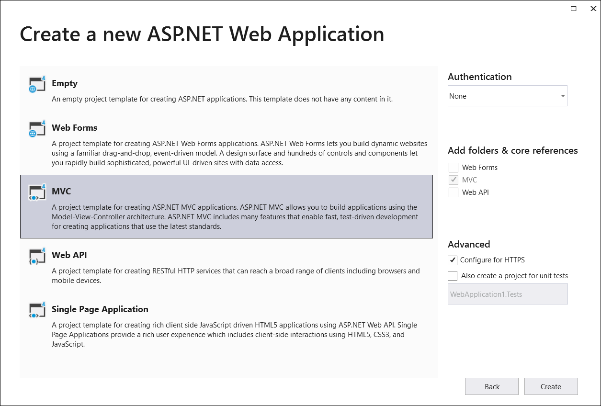

# Getting Started with ASP.NET MVC PDF library

The Syncfusion&reg; .NET Core PDF library is used to create, read, and edit PDF documents. This library also offers functionality to merge, split, stamp, fill forms, and secure PDF files.

This guide explains how to integrate the EJ2 PDF library control into an ASP.NET Core MVC application using Visual Studio.

## Prerequisites

[System requirements for ASP.NET MVC controls](https://help.syncfusion.com/document-processing/system-requirements)

## Integrate PDF Viewer into an ASP.NET MVC application

1. Start Visual Studio and select **Create a new project**.
2. Create a new ASP.NET MVC Web Application project.

3. Choose the target framework.

4. Select Web Application pattern (MVC) for the project and then select **Create** button.

5. **Add script reference** : Add the required scripts using the CDN inside the `<head>` of `~/Views/Shared/_Layout.cshtml` as follows:




<head>
    ...
    <!-- Syncfusion EJ2 PDF Library (CDN) -->
    
</head>



 
6. **Create a PDF document** : Add the script in `~/Views/Home/Index.cshtml` by creating a button and attaching a click event that uses the EJ2 PDF API to generate a PDF document.




    <h1 class="h4 mb-3">Create PDF document</h1>
    
Click the button to generate and download a PDF.

    <button id="btnCreatePdf" class="btn btn-primary">Generate PDF</button>

@section Scripts {
    
}




7. **Build the project** : Click on Build > Build Solution or press Ctrl + Shift + B to build the project.

8. **Run the project** : Click the Start button (green arrow) or press F5 to run the app.

By executing the program, you will generate the following PDF document.

