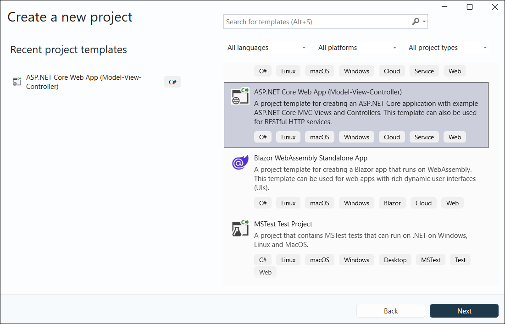
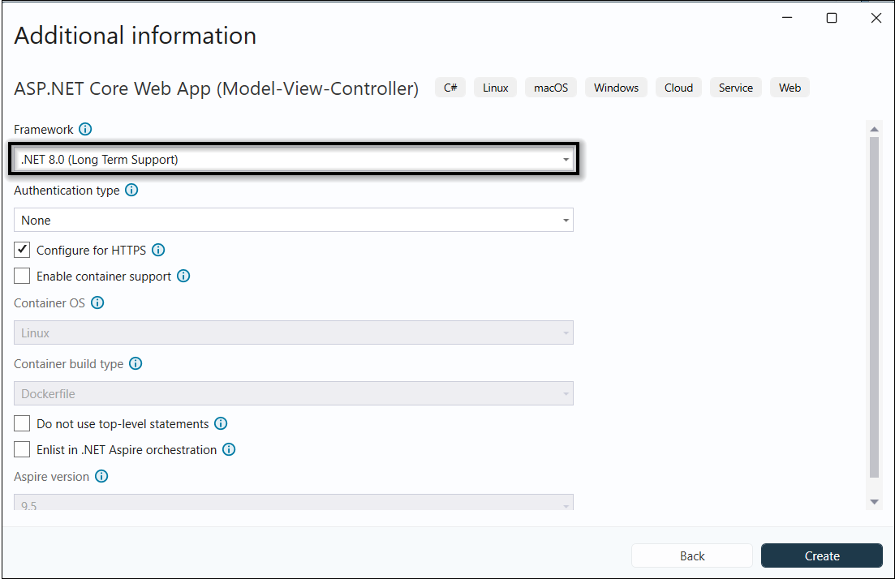

# Create or Generate PDF in ASP.NET Core

The Syncfusion&reg; JavaScript PDF library is used to create, read, and edit PDF documents. This library also offers functionality to merge, split, stamp, forms, and secure PDF files.

This guide explains how to integrate the JavaScript PDF library into an ASP.NET Core application.

## Integrate PDF library into an ASP.NET Core application

Step 1: Start Visual Studio and select **Create a new project**.
Step 2: In the **Create a new project** dialog, select **ASP.NET Core Web App**.

Step 3: In the **Configure your new project** dialog, enter the project name and select **Next**.

Step 4: In the **Additional information** dialog, select a .NET LTS version (for example, **.NET 8.0 (Long-term Support)**) and then select **Create**.

Step 5: **Add script reference** : Add the required scripts using the CDN inside the `<head>` of `~/Views/Shared/_Layout.cshtml` as follows:



<head>
    <!-- Syncfusion JavaScript PDF Library (CDN) -->
    
</head>


 
Step 6: **Create a PDF document** : Add the script in `~/Views/Home/Index.cshtml` by creating a button and attaching a click event that uses the JavaScript PDF API to generate a PDF document.




    <h1 class="h4 mb-3">Create PDF document</h1>
    
Click the button to generate and download a PDF.

    <button id="btnCreatePdf" class="btn btn-primary">Generate PDF document</button>

@section Scripts {
    
}



step 7: **Build the project** : Click on Build > Build Solution or press Ctrl + Shift + B to build the project.

Step 8: **Run the project** : Click the Start button (green arrow) or press F5 to run the app.

By executing the program, you will generate the following PDF document.

