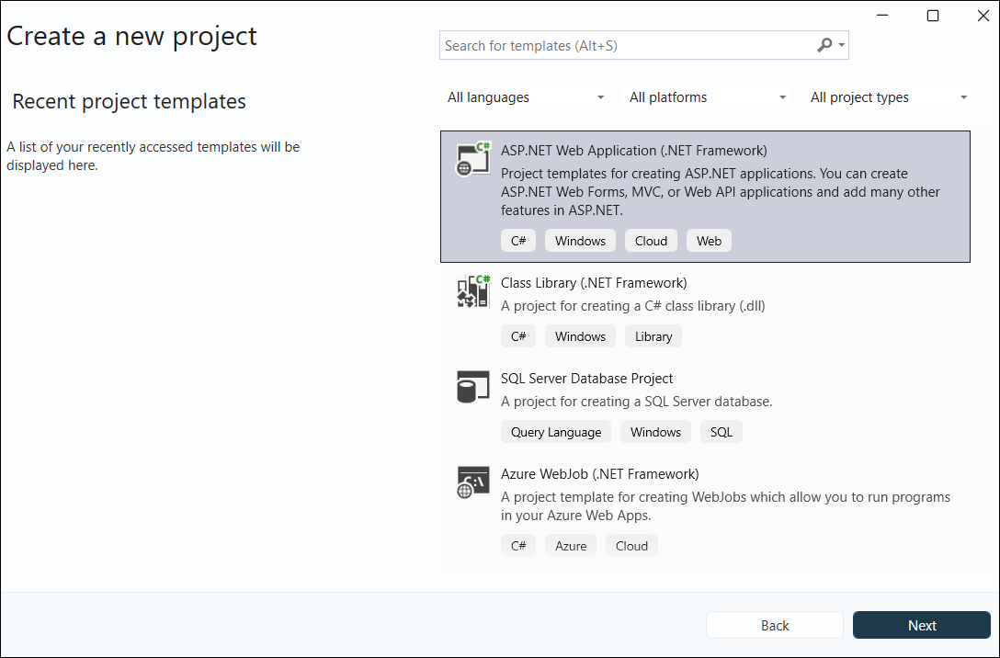
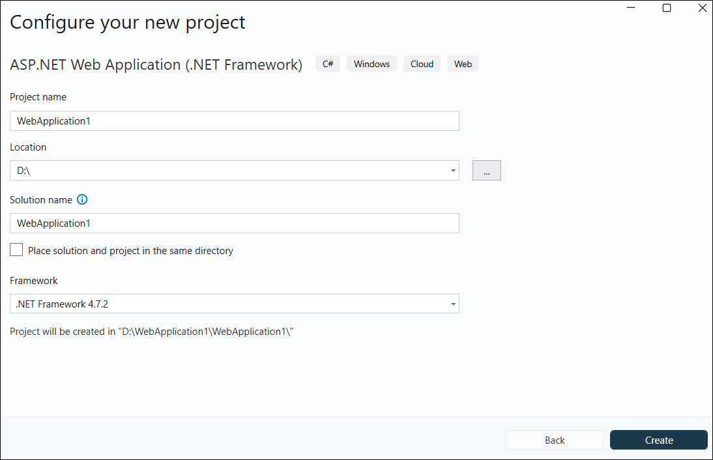
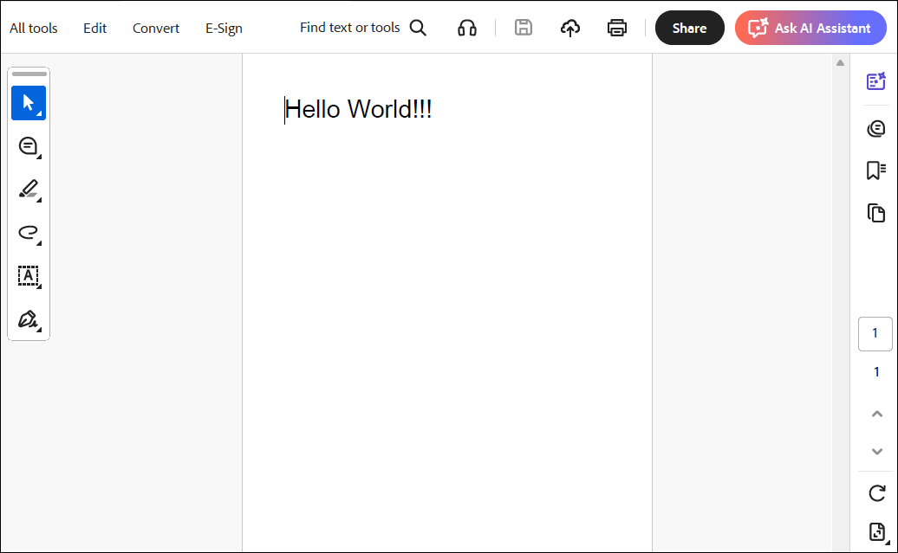

# Create or Generate PDF file in ASP.NET Core MVC

The Syncfusion&reg; JavaScript PDF library is used to create, read, and edit PDF documents. This library also offers functionality to merge, split, stamp, fill forms, and secure PDF files.

This guide explains how to integrate the JavaScript PDF library into an ASP.NET Core MVC application.

## Integrate PDF library into an ASP.NET MVC Core application

Step 1: Start Visual Studio and select **Create a new project**.
Step 2: Create a new ASP.NET MVC Web Application project.

Step 3: Choose the target framework.

Step 4: Select Web Application pattern (MVC) for the project and then select **Create** button.

Step 5: **Add script reference**: Add the required scripts using the CDN inside the `<head>` of `~/Views/Shared/_Layout.cshtml` as follows:



<head>
    ...
    <!-- Syncfusion JavaScript PDF Library (CDN) -->
    
</head>



N> Check out the following topics for including script references in an ASP.NET MVC application to enable PDF creation using the Syncfusion&reg; JavaScript PDF library:
*   [CDN](https://ej2.syncfusion.com/aspnetmvc/documentation/common/adding-script-references)
*   [NPM Package](https://ej2.syncfusion.com/aspnetmvc/documentation/common/adding-script-references#node-package-manager-npm)
*   [CRG](https://ej2.syncfusion.com/aspnetmvc/documentation/common/custom-resource-generator)
And ensure the application includes an `openjpeg` folder under `Scripts` (or a publicly accessible static path). This folder must contain the `openjpeg.js` and `openjpeg.wasm` files, along with the PDF file to extract images. Keep these in the same static content area as `ej2.min.js`.

Step 6: **Create a PDF document**: Add the script in `~/Views/Home/Index.cshtml` by creating a button and attaching a click event that uses the JavaScript PDF API to generate a PDF document.




    <h1 class="h4 mb-3">Create PDF document</h1>
    
Click the button to generate and download a PDF.

    <button id="btnCreatePdf" class="btn btn-primary">Generate PDF document</button>

@section Scripts {
    
}



Step 7: **Build the project**: Click on Build > Build Solution or press Ctrl + Shift + B to build the project.

Step 8: **Run the project**: Click the Start button (green arrow) or press F5 to run the app.

When you run the application and click the button, it generates the following PDF document.

