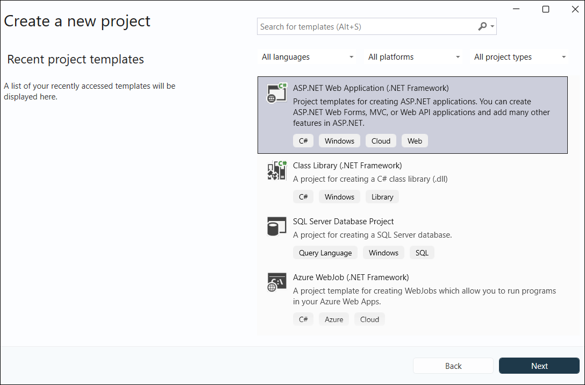
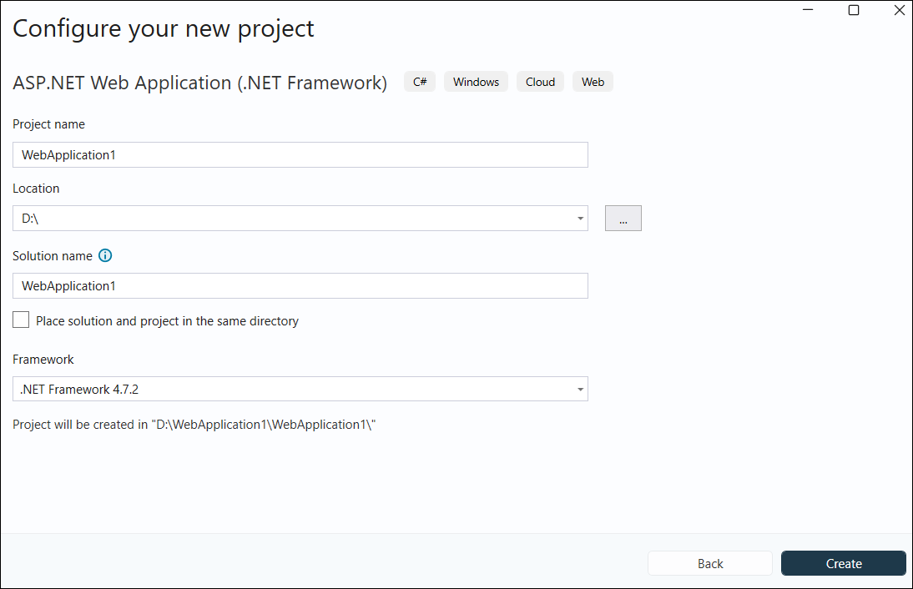
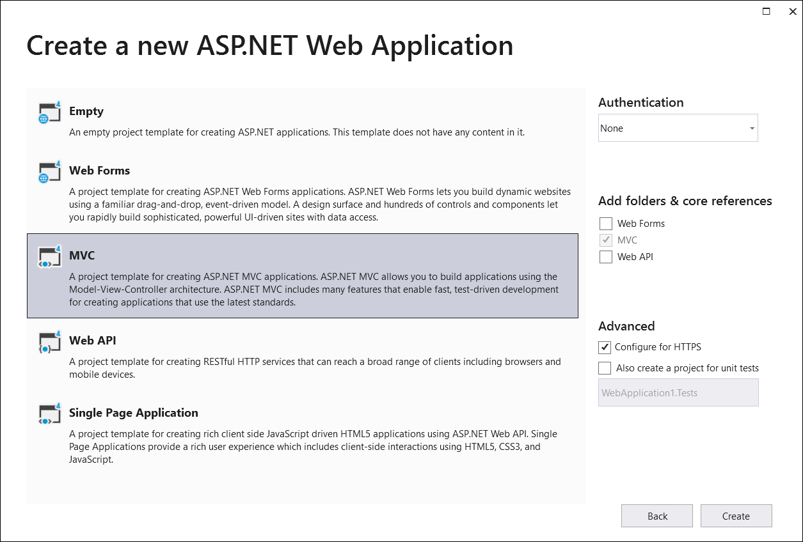

# Create or Generate a PDF File in ASP.NET MVC

The [JavaScript PDF Library](https://www.syncfusion.com/document-sdk/javascript-pdf-library) is used to create, read, and edit PDF documents. The [JavaScript PDF Library](https://www.syncfusion.com/document-sdk/javascript-pdf-library) also offers functionality to merge, split, stamp, fill forms, and secure PDF files.

This guide explains how to integrate the [JavaScript PDF Library](https://www.syncfusion.com/document-sdk/javascript-pdf-library) into an ASP.NET MVC application. The PDF is generated **client-side in the browser** using the Syncfusion JavaScript PDF Library loaded from a CDN; ASP.NET MVC is used to host the page that triggers the download.

## Prerequisites

Before you begin, make sure you have the following installed:

- Visual Studio 2019 or later (Visual Studio 2022 recommended) with the **ASP.NET and web development** workload.
- .NET Framework 4.6.2 or later.
- An active internet connection (the sample loads the JavaScript PDF Library from the Syncfusion CDN).
- A supported browser such as the latest versions of Microsoft Edge, Google Chrome, or Mozilla Firefox.

N> This guide uses the CDN distribution of the JavaScript PDF Library. No client-side `registerLicense` call is required when loading the library from the Syncfusion CDN; licensing is handled at the account level.

## Create the Project

Step 1: Start Visual Studio and select **Create a new project**.

Step 2: In the **Create a new project** dialog, select **ASP.NET MVC Web Application project (.NET Framework)**.



Step 3: In the **Configure your new project** dialog, enter the project name, choose the target framework (for example, **.NET Framework 4.7.2**).



Step 4: Confirm that **Web Application pattern (Model-View-Controller)** is selected in the additional information dialog, and then select the **Create** button.



## Add the Script Reference

Step 5: Add the script reference: open `~/Views/Shared/_Layout.cshtml` and add the Syncfusion CDN reference inside the `<head>` element. Also confirm that the layout contains `@await RenderSectionAsync("Scripts", required: false)` so the `@section Scripts` block in Step 6 can render.



<head>
    ...
    <!-- JavaScript PDF Library (CDN) -->
    <script src="https://cdn.syncfusion.com/ej2/31.2.15/dist/ej2.min.js"></script>
</head>
<body>
    @RenderBody()
    @await RenderSectionAsync("Scripts", required: false)
</body>



N> Check out the following topics for including script references in an ASP.NET MVC application to enable PDF creation using the [JavaScript PDF Library](https://www.syncfusion.com/document-sdk/javascript-pdf-library):
- [CDN](https://ej2.syncfusion.com/aspnetmvc/documentation/common/adding-script-references)
- [NPM Package](https://ej2.syncfusion.com/aspnetmvc/documentation/common/adding-script-references#node-package-manager-npm)
- [CRG](https://ej2.syncfusion.com/aspnetmvc/documentation/common/custom-resource-generator)

N> The `31.2.15` CDN version is compatible with the .NET 8 and .NET 9 target frameworks. If you use a different Syncfusion version in your application, replace the CDN URL with the matching version.

## Generate the PDF

Step 6: Create a PDF document: open `~/Views/Home/Index.cshtml` and add a button plus a click handler that uses the [JavaScript PDF Library](https://www.syncfusion.com/document-sdk/javascript-pdf-library) to generate a PDF in the browser.



<div class="container py-4">
    <h1 class="h4 mb-3">Create PDF document</h1>
    <p class="text-muted">Click the button to generate and download a PDF.</p>
    <button id="btnCreatePdf" class="btn btn-primary">Generate PDF document</button>
</div>
@section Scripts {
    <script>
        document.getElementById('btnCreatePdf').addEventListener('click', function () {
            // Create a new PDF document
            let pdf = new ej.pdf.PdfDocument();
            // Add a new page
            let page = pdf.addPage();
            // Get graphics from the page
            let graphics = page.graphics;
            // Set font
            let font = pdf.embedFont(ej.pdf.PdfFontFamily.helvetica, 36, ej.pdf.PdfFontStyle.regular);
            // Create a new black brush
            let brush = new ej.pdf.PdfBrush({ r: 0, g: 0, b: 0 });
            // Draw text
            graphics.drawString('Hello World!!!', font, { x: 20, y: 20, width: graphics.clientSize.width - 20, height: 60 }, brush);
            // Save and download PDF (client-side)
            pdf.save('output.pdf');
            // Destroy the PDF document instance
            pdf.destroy();
        });
    </script>
}



## Code Explanation

- `ej.pdf.PdfDocument` — creates a new PDF document instance.
- `addPage()` — appends a blank page to the document and returns the `PdfPage` object.
- `page.graphics` — returns the `PdfGraphics` drawing surface for the page.
- `embedFont(family, size, style)` — embeds one of the standard PDF font families (here, Helvetica 36pt regular) and returns a `PdfStandardFont` object.
- `new ej.pdf.PdfBrush({ r, g, b })` — creates a solid color brush from an RGB object (each channel `0`-`255`); here, black.
- `drawString(text, font, layoutRect, brush)` — draws the text inside the rectangle defined by `x`, `y`, `width`, and `height`. The rectangle object has the shape `{ x, y, width, height }`.
- `graphics.clientSize.width` — the writable width of the page in points.
- `save('output.pdf')` — saves the PDF and **triggers a client-side browser download** with the specified file name. The file is sent to the browser's default downloads folder; nothing is written to the server. The call is synchronous in the browser build.
- `destroy()` — releases native resources held by the document. It is safe to call immediately after `save()` because the download is initiated before the document is destroyed.

## Build and Run the Application

Step 7: Build the project: click **Build** > **Build Solution** or press **Ctrl + Shift + B** to build the project.

Step 8: Run the project: click the **Start** button (green arrow) or press **F5** to run the app. Visual Studio launches the app in your default browser.

After running the application, click **Generate PDF document**. The browser downloads `output.pdf`, which contains a single page with the text "Hello World!!!" drawn at the top-left.


## Additional Configuration (Optional)

N> The following steps are required **only** if you need image or data extraction features. They are not required for the basic PDF creation shown in this guide.

If you need image and data extraction, install the data-extraction add-on and copy the `ej2-pdf-lib` folder into your project.

1. Install the add-on package:

   ```bash
   npm install @syncfusion/ej2-pdf-data-extract --save
   ```

2. Copy the `ej2-pdf-lib` folder from `node_modules/@syncfusion/ej2-pdf-data-extract/dist/ej2-pdf-lib` into `wwwroot/lib/ej2-pdf-lib/`. The folder must contain the required `.js` and `.wasm` files.

3. Confirm that the `ej2-pdf-lib` folder is reachable at runtime (for example, at `https://localhost:xxxx/lib/ej2-pdf-lib/`).

## Troubleshooting

| Problem | Cause | Resolution |
|---|---|---|
| `ej is not defined` in the browser console | The CDN script tag is missing or blocked | Confirm the `<script>` reference in `_Layout.cshtml` is reachable and not blocked by an ad blocker or network policy |
| Button click does nothing | The click handler is rendered before the button exists, or `@section Scripts` is missing in the layout | Confirm `_Layout.cshtml` contains `@await RenderSectionAsync("Scripts", required: false)` |
| `SyntaxError: Unexpected token ':'` | TypeScript annotations were left inside a plain `<script>` block | Remove the `: ej.pdf.PdfType` annotations; the script must be plain JavaScript |
| `Failed to load resource: 404` on `ej2.min.js` | The CDN version path is incorrect or the network is restricted | Verify the CDN URL and internet access; switch to the [NPM](https://ej2.syncfusion.com/aspnetmvc/documentation/common/adding-script-references#node-package-manager-npm) or [CRG](https://ej2.syncfusion.com/aspnetmvc/documentation/common/custom-resource-generator) approach if the CDN is not reachable |
| `output.pdf` does not download | The browser blocks the download | Check the browser's download settings and the downloads folder |
| `WASM` or `.js` 404s for data extraction | The `ej2-pdf-lib` folder is not under `wwwroot/` | Copy the `ej2-pdf-lib` folder from the `@syncfusion/ej2-pdf-data-extract` package into `wwwroot/lib/` |
| CORS errors when loading the data-extraction assets | The `ej2-pdf-lib` assets are served from a different origin | Serve the `ej2-pdf-lib` folder from the same ASP.NET MVC application under `wwwroot/` |

## See Also

- [JavaScript PDF Library](https://www.syncfusion.com/document-sdk/javascript-pdf-library)
- [JavaScript PDF Library documentation](https://help.syncfusion.com/document-processing/pdf/pdf-library/javascript/overview)
- [JavaScript PDF Library API reference](https://ej2.syncfusion.com/documentation/api/pdf)
- [Syncfusion licensing documentation](https://help.syncfusion.com/document-processing/licensing/overview)