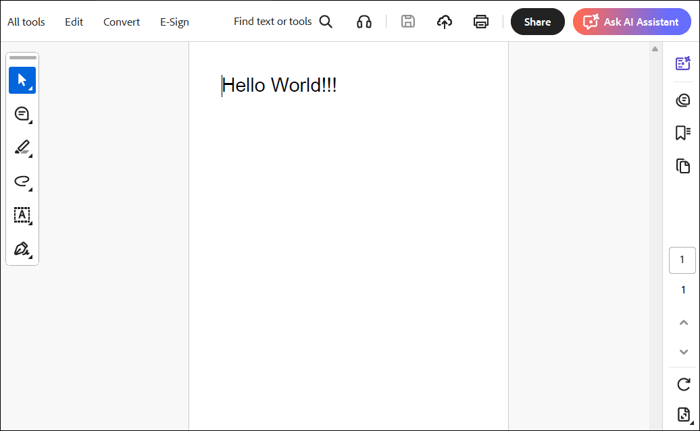

# Create or Generate a PDF File in a Node.js Server Environment

The Syncfusion<sup>&reg;</sup> TypeScript PDF library is used to create, read, and edit PDF documents. This library also offers functionality to merge, split, stamp, fill forms, and secure PDF files.

This guide explains how to integrate the Syncfusion TypeScript PDF library into an application with **Node.js server environment**.

## Installing the Syncfusion TypeScript PDF package

All Syncfusion JS 2 packages are published in `npmjs.com` registry.

* To install the PDF library, use the following command.

```bash
npm install @syncfusion/ej2-pdf --save
```

N> For image and data extraction features, you need to install the `@syncfusion/ej2-pdf-data-extract` package as an add-on.
Ensure that your application includes an `ej2-pdf-lib` folder within a publicly accessible static directory (such as wwwroot, public, or dist). This folder must contain the required `.js` and `.wasm` files needed for image and data extraction.
This setup is not required for basic PDF creation. Image extraction and image‑based redaction features are optimized for browser environments where visual rendering is available. These features rely on browser technologies such as DOM APIs, Canvas, and client‑side rendering, and therefore are not supported in pure Node.js server environments.

## Dependencies

The following list of dependencies are required to use the `TypeScript PDF library` component in your application.

```bash
|-- @syncfusion/ej2-compression
|-- @syncfusion/ej2-base
```

## Create a Node.js Server Application to Generate a PDF Document

* Add a simple button to `index.html` and attach a click handler that uses the TypeScript PDF API to create a new PDF document.



<html>
  <head>
    <title>PDF Generator</title>
  </head>
  <body>
    <h2>Generate PDF Example</h2>
    <button onclick="generatePDF()">Create PDF</button>
    <script>
      async function generatePDF() {
        const response = await fetch('http://localhost:3000/generate-pdf');
        const blob = await response.blob();
        const url = window.URL.createObjectURL(blob);
        const a = document.createElement('a');
        a.href = url;
        a.download = 'Output.pdf';
        document.body.appendChild(a);
        a.click();
        a.remove();
        window.URL.revokeObjectURL(url);
      }
    </script>
  </body>
</html>



* Create a new project folder and initialize it.

```bash
mkdir pdf-node-app
cd pdf-node-app
npm init -y
```

* Include the following namespaces in `server.js` file.




import { PdfDocument, PdfGraphics, PdfPage, PdfFont, PdfFontFamily, PdfFontStyle, PdfBrush } from '@syncfusion/ej2-pdf';




* Include the following code example in the node.js environment to generate a PDF document 




const express = require('express');
const {
  PdfDocument,
  PdfFontFamily,
  PdfFontStyle,
  PdfBrush
} = require('@syncfusion/ej2-pdf');
const app = express();
const PORT = 3000;
// Serve frontend files
app.use(express.static('public'));
// PDF generation API
app.get('/generate-pdf', (req, res) => {
  // Create PDF document
  const document = new PdfDocument();
  const page = document.addPage();
  const graphics = page.graphics;
  const font = document.embedFont(
    PdfFontFamily.helvetica,
    36,
    PdfFontStyle.regular
  );
  const brush = new PdfBrush({ r: 0, g: 0, b: 0 });
  graphics.drawString(
    'Hello from Frontend!',
    font,
    {
      x: 20,
      y: 20,
      width: graphics.clientSize.width - 20,
      height: 60
    },
    brush
  );
  // Save PDF as bytes
  const pdfBytes = document.save();
  document.destroy();
  // Send PDF to browser
  res.setHeader('Content-Type', 'application/pdf');
  res.setHeader('Content-Disposition', 'attachment; filename=Output.pdf');
  res.send(Buffer.from(pdfBytes));
});
// Start server
app.listen(PORT, () => {
  console.log(`Server running at http://localhost:${PORT}`);
});




* **Run the application**

Run the following command to start the Node.js server:

```bash
node server.js
```

This command starts the server and allows you to generate and download the PDF file from the browser.

By executing the program, you will get the PDF document as follows.


