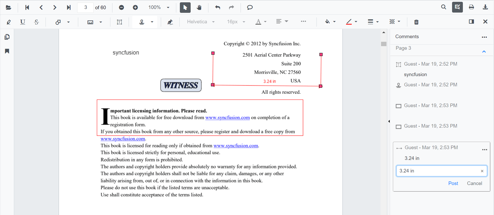

N> Syncfusion<sup style="font-size:70%">&reg;</sup> recommends using [Blazor PDF Viewer (NextGen)](https://blazor.syncfusion.com/documentation/pdfviewer-2/getting-started/server-side-application) Component which provides fast rendering of pages and improved performance. Also, there is no need of external Web service for processing the files and ease out the deployment complexity. It can be used in Blazor Server, WASM and MAUI applications without any changes.

# Comments in Blazor PDF Viewer Component

The PDF Viewer control provides options to add, edit, and delete the comments to the following annotation in the PDF documents:

* Shape annotation
* Stamp annotation
* Sticky note annotation
* Measurement annotation
* Text markup annotation
* Free text annotation



## Adding a comment to the annotation

Annotation comment, comment replies, and status can be added to the PDF document using the comment panel.

### Comment panel

Annotation comments can be added to the PDF using the comment panel. Comment panel can be opened by the following ways:

1. Using the annotation menu.

    * Click the Edit Annotation button in the PDF Viewer toolbar. A toolbar appears below it.
    * Click the Comment Panel button. A comment panel will appear.

2. Using Context menu.

    * Select annotation in the PDF document and right-click it.
    * Select comment option in the context menu that appears.

3. Using Mouse click.

    * Select annotation in the PDF document and double click it, a comment panel will appear.

If the comment panel is already in open state, you can select the annotations and add annotation comment using comment panel.

### Adding comments

* Select annotation in the PDF document and click it.
* Selected annotation comment container is highlighted in the comment panel.
* Now, you can add comment and comment replies using comment panel.


### Adding Comment Replies

* PDF Viewer control provides an option to add multiple replies to the comment.
* After adding the annotation comment, you can add reply to the comment.

### Adding Comment or Reply Status

* Select the Annotation Comments in the comment panel.
* Click the more options button showing in Comments or reply container.
* Select Set Status option in the context menu that appears.
* Select the status of the annotation comment in the context menu that appears.


### Editing the comments and comments replies of the annotations

The comment, comment replies, and status of the annotation can be edited using the comment panel.

### Editing Comment or Comment Replies

The annotation comment and comment replies can be edited by the following ways:

1. Using Context menu.

    * Select the Annotation Comments in comment panel.
    * Click the More option button showing in Comments or reply container.
    * Select Edit option in the context menu that appears.
    * Now, editable text box appears. You can change the content of the annotation comment or comment reply.

2. Using Mouse Click.

    * Select the annotation comments in comment panel.
    * Double click the comment or comment reply content.
    * Now, editable text box appears. You can change the content of the annotation comment or comment reply.

### Editing Comment or Reply Status

* Select the Annotation Comments in comment panel.
* Click the more options button showing in Comments or reply container.
* Select Set Status option in the context menu that appears.
* Select the status of the annotation comment in the context menu that appears.
* Status ‘None’ is the default state. If status set to ‘None’, the comments or reply does not appear.


### Delete Comment or Comment Replies

* Select the Annotation Comments in comment panel.
* Click the more options button shown in Comments or reply container.
* Select Delete option in the context menu that appears.


N> The annotation will be deleted on deleting the comment using comment panel.

N> You can refer to the [Blazor PDF Viewer](https://www.syncfusion.com/blazor-components/blazor-pdf-viewer) feature tour page for its groundbreaking feature representations.

### Show or hide the Comment panel

The PDF Viewer control provides an option to show or hide the Comment panel by using the `CommentPanelVisible` property of the SfPdfViewerServer class.

The following code snippet explains how to show the Comment panel.

```cshtml
@using Syncfusion.Blazor.Buttons
@using Syncfusion.Blazor.PdfViewerServer
@using Syncfusion.Blazor.PdfViewer

<SfButton OnClick="@OnClick">ShowOrHideCommentPanel</SfButton>

<SfPdfViewerServer @ref="Viewer" @bind-CommentPanelVisible="@isOpen" Width="1000" Height="700" DocumentPath="@documentPath">   
</SfPdfViewerServer>

@code
{
    SfPdfViewerServer Viewer;
    //Sets the PDF document path for initial loading.
    private string documentPath { get; set; } = "wwwroot/Data/PDF_Succinctly.pdf";

    private bool isOpen = true;

    //Method to update the visibility of the comment panel.
    public void OnClick()
    {
        if(isOpen)
        {
            isOpen = false;
        }
        else
        {
            isOpen = true;
        }
    }
}
```
N> [View sample in GitHub](https://github.com/SyncfusionExamples/blazor-pdf-viewer-classic-examples/tree/master/Annotations/Comment%20Panel/Show%20or%20hide%20comment%20panel).
