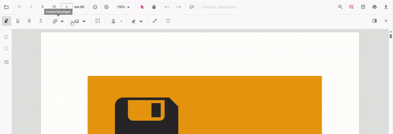

# Set a new language in the Angular PDF Viewer

Use the Angular PDF Viewer's [locale](https://ej2.syncfusion.com/angular/documentation/api/pdfviewer/index-default#locale) property together with `L10n.load` to display UI text, tooltips, and messages in your users' language. Provide only the keys you need to override; missing keys fall back to the default `en-US` values.

## When to use this
- You need the viewer UI (e.g., toolbar text, dialogs, tooltips) to appear in a specific language.
- You want to override a few labels (e.g., “Open”, “Zoom”, “Print”) without redefining every string.

## Prerequisites
- `@syncfusion/ej2-angular-pdfviewer` installed in an Angular app.
- (Optional) A list of keys you want to override.

## Quick start (set German)
1. **Load translations** with `L10n.load` at app start (only include the keys you want to change).
2. **Set the culture** by passing `locale` value to the PDF Viewer component.
3. **Render the viewer** as usual. Missing keys will automatically fall back to `en-US`.



import { Component } from '@angular/core';
import { L10n } from '@syncfusion/ej2-base';
import {
  PdfViewerModule,
  ToolbarService,
  MagnificationService,
  NavigationService,
  LinkAnnotationService,
  BookmarkViewService,
  ThumbnailViewService,
  PrintService,
  TextSelectionService,
  TextSearchService,
  AnnotationService,
  FormDesignerService,
  FormFieldsService,
  PageOrganizerService
} from '@syncfusion/ej2-angular-pdfviewer';

/** 1) Provide only the keys you want to override; others fall back to en-US */
L10n.load({
  'de': {
    'PdfViewer': {
              'PdfViewer': 'PDF-Viewer',
        'Cancel': 'Abbrechen',
        'Download file': 'Datei herunterladen',
        'Download': 'Herunterladen',
        'Enter Password': 'Dieses Dokument ist passwortgeschützt. Bitte geben Sie ein Passwort ein.',
        'File Corrupted': 'Datei beschädigt',
        'File Corrupted Content': 'Die Datei ist beschädigt und kann nicht geöffnet werden.',
        'Fit Page': 'Seite anpassen',
        'Fit Width': 'Breite anpassen',
        'Automatic': 'Automatisch',
        'Go To First Page': 'Erste Seite anzeigen',
        'Invalid Password': 'Falsches Passwort. Bitte versuchen Sie es erneut.',
        'Next Page': 'Nächste Seite anzeigen',
        'OK': 'OK',
        'Open': 'Datei öffnen',
        'Page Number': 'Aktuelle Seitenzahl',
        'Previous Page': 'Vorherige Seite anzeigen',
        'Go To Last Page': 'Letzte Seite anzeigen',
        'Zoom': 'Zoomen',
        'Zoom In': 'Hineinzoomen',
        'Zoom Out': 'Herauszoomen',
        'Page Thumbnails': 'Miniaturansichten der Seiten',
        'Bookmarks': 'Lesezeichen',
        'Print': 'Druckdatei',
        'Organize Pages': 'Seiten organisieren',
        'Insert Right': 'Rechts einfügen',
        'Insert Left': 'Links einfügen',
        'Total': 'Gesamt',
        'Pages': 'Seiten',
        'Rotate Right': 'Drehe nach rechts',
        'Rotate Left': 'Nach links drehen',
        'Delete Page': 'Seite löschen',
        'Delete Pages': 'Seiten löschen',
        'Copy Page': 'Seite kopieren',
        'Copy Pages': 'Seiten kopieren',
        'Import Document': 'Dokument importieren',
        'Save': 'Speichern',
        'Save As': 'Speichern als',
        'Select All': 'Wählen Sie Alle',
        'Change Page Zoom': 'Change Page Zoom',
        'Increase Page Zoom': 'Increase Page Zoom',
        'Decrease Page Zoom': 'Decrease Page Zoom',
        'Password Protected': 'Passwort erforderlich',
        'Copy': 'Kopieren',
        'Text Selection': 'Textauswahltool',
        'Panning': 'Schwenkmodus',
        'Text Search': 'Text finden',
        'Find in document': 'Im Dokument suchen',
        'Match case': 'Gross- / Kleinschreibung',
        'Match any word': 'Passen Sie ein beliebiges Wort an',
        'Apply': 'Anwenden',
        'GoToPage': 'Gehen Sie zur Seite',
        'No Matches': 'PDF Viewer hat die Suche im Dokument abgeschlossen. Es wurden keine Übereinstimmungen gefunden.',
        'No More Matches': 'PDF Viewer hat die Suche im Dokument abgeschlossen. Es wurden keine weiteren Übereinstimmungen gefunden.',
        'No Search Matches': 'Keine Treffer gefunden',
        'No More Search Matches': 'Keine weiteren Übereinstimmungen gefunden',
        'Exact Matches': 'Genaue Übereinstimmungen',
        'Total Matches': 'Gesamtspiele',
        'Undo': 'Rückgängig machen',
        'Redo': 'Wiederholen',
        'Annotation': 'Anmerkungen hinzufügen oder bearbeiten',
        'FormDesigner': 'Fügen Sie Formularfelder hinzu und bearbeiten Sie sie',
        'Highlight': 'Text hervorheben',
        'Underline': 'Text unterstreichen',
        'Strikethrough': 'Durchgestrichener Text',
        'Squiggly': 'Squiggly Text',
        'Delete': 'Anmerkung löschen',
        'Opacity': 'Opazität',
        'Color edit': 'Farbe ändern',
        'Opacity edit': 'Deckkraft ändern',
        'Highlight context': 'Markieren',
        'Underline context': 'Unterstreichen',
        'Strikethrough context': 'Durchschlagen',
        'Squiggly context': 'Squiggly',
        'Server error': 'Der Webdienst hört nicht zu. ',
        'Client error': 'Der Client-Seiten-Fehler wird gefunden. Bitte überprüfen Sie die benutzerdefinierten Header in der Eigenschaft von AjaxRequestSets und Web -Aktion in der Eigenschaftsassettierungseigenschaft.',
        'Cors policy error': 'Das Dokument kann aufgrund einer ungültigen URL- oder Zugriffsbeschränkungen nicht abgerufen werden. Bitte überprüfen Sie die Dokument -URL und versuchen Sie es erneut.',
        'Open text': 'Offen',
        'First text': 'Erste Seite',
        'Previous text': 'Vorherige Seite',
        'Next text': 'Nächste Seite',
        'Last text': 'Letzte Seite',
        'Zoom in text': 'Hineinzoomen',
        'Zoom out text': 'Rauszoomen',
        'Selection text': 'Auswahl',
        'Pan text': 'Pfanne',
        'Print text': 'Drucken',
        'Search text': 'Suchen',
        'Annotation Edit text': 'Anmerkung bearbeiten',
        'FormDesigner Edit text': 'Fügen Sie Formularfelder hinzu und bearbeiten Sie sie',
        'Line Thickness': 'Dicke der Linie',
        'Line Properties': 'Linieneigenschaften',
        'Start Arrow': 'Pfeil starten',
        'End Arrow': 'Endpfeil',
        'Line Style': 'Linienstil',
        'Fill Color': 'Füllfarbe',
        'Line Color': 'Linienfarbe',
        'None': 'Keiner',
        'Open Arrow': 'Offen',
        'Closed Arrow': 'Geschlossen',
        'Round Arrow': 'Runden',
        'Square Arrow': 'Quadrat',
        'Diamond Arrow': 'Diamant',
        'Butt': 'Hintern',
        'Cut': 'Schneiden',
        'Paste': 'Paste',
        'Delete Context': 'Löschen',
        'Properties': 'Eigenschaften',
        'Add Stamp': 'Stempel hinzufügen',
        'Add Shapes': 'Formen hinzufügen',
        'Stroke edit': 'Ändern Sie die Strichfarbe',
        'Change thickness': 'Randstärke ändern',
        'Add line': 'Zeile hinzufügen',
        'Add arrow': 'Pfeil hinzufügen',
        'Add rectangle': 'Rechteck hinzufügen',
        'Add circle': 'Kreis hinzufügen',
        'Add polygon': 'Polygon hinzufügen',
        'Add Comments': 'Füge Kommentare hinzu',
        'Comments': 'Kommentare',
        'SubmitForm': 'Formular abschicken',
        'No Comments Yet': 'Noch keine Kommentare',
        'Accepted': 'Akzeptiert',
        'Completed': 'Vollendet',
        'Cancelled': 'Abgesagt',
        'Rejected': 'Abgelehnt',
        'Leader Length': 'Führungslänge',
        'Scale Ratio': 'Skalenverhältnis',
        'Calibrate': 'Kalibrieren',
        'Calibrate Distance': 'Distanz kalibrieren',
        'Calibrate Perimeter': 'Umfang kalibrieren',
        'Calibrate Area': 'Bereich kalibrieren',
        'Calibrate Radius': 'Radius kalibrieren',
        'Calibrate Volume': 'Lautstärke kalibrieren',
        'Depth': 'Tiefe',
        'Closed': 'Geschlossen',
        'Round': 'Runden',
        'Square': 'Quadrat',
        'Diamond': 'Diamant',
        'Edit': 'Bearbeiten',
        'Comment': 'Kommentar',
        'Comment Panel': 'Kommentarpanel',
        'Set Status': 'Status festlegen',
        'Post': 'Post',
        'Page': 'Seite',
        'Add a comment': 'Einen Kommentar hinzufügen',
        'Add a reply': 'Fügen Sie eine Antwort hinzu',
        'Import Annotations': 'Importieren Sie Annotationen aus der JSON -Datei',
        'Export Annotations': 'Annotation an die JSON -Datei exportieren',
        'Export XFDF': 'Annotation in XFDF -Datei exportieren',
        'Import XFDF': 'Importieren Sie Annotationen aus der XFDF -Datei',
        'Add': 'Hinzufügen',
        'Clear': 'Klar',
        'Bold': 'Deutlich',
        'Italic': 'Kursiv',
        'Strikethroughs': 'Durchgestrichen',
        'Underlines': 'Unterstreichen',
        'Superscript': 'Hochgestellt',
        'Subscript': 'Index',
        'Align left': 'Linksbündig',
        'Align right': 'Rechts ausrichten',
        'Center': 'Center',
        'Justify': 'Rechtfertigen',
        'Font color': 'Schriftfarbe',
        'Text Align': 'Textausrichtung',
        'Text Properties': 'Schriftstil',
        'SignatureFieldDialogHeaderText': 'Signatur hinzufügen',
        'HandwrittenSignatureDialogHeaderText': 'Signatur hinzufügen',
        'InitialFieldDialogHeaderText': 'Initial hinzufügen',
        'HandwrittenInitialDialogHeaderText': 'Initial hinzufügen',
        'Draw Ink': 'Tinte zeichnen',
        'Create': 'Erstellen',
        'Font family': 'Schriftfamilie',
        'Font size': 'Schriftgröße',
        'Free Text': 'Freier Text',
        'Import Failed': 'Ungültiger JSON -Dateityp oder Dateiname; Bitte wählen Sie eine gültige JSON -Datei aus',
        'Import PDF Failed': 'Ungültige PDF -Dateityp oder PDF -Datei nicht gefunden. Bitte wählen Sie eine gültige PDF -Datei aus',
        'File not found': 'Die importierte JSON -Datei wird nicht am gewünschten Ort gefunden',
        'Export Failed': 'Exportanmerkungen sind gescheitert. Bitte stellen Sie sicher, dass Anmerkungen ordnungsgemäß hinzugefügt werden',
        'of': 'von ',
        'Dynamic': 'Dynamisch',
        'Standard Business': 'Standardgeschäft',
        'Sign Here': 'Hier unterschreiben',
        'Custom Stamp': 'Benutzerdefinierte Stempel',
        'Enter Signature as Name': 'Gib deinen Namen ein',
        'Draw-hand Signature': 'ZIEHEN',
        'Type Signature': 'TYP',
        'Upload Signature': 'HOCHLADEN',
        'Browse Signature Image': 'DURCHSUCHE',
        'Save Signature': 'Signatur speichern',
        'Save Initial': 'Initial speichern',
        'Textbox': 'Textfeld',
        'Password': 'Passwort',
        'Check Box': 'Kontrollkästchen',
        'Radio Button': 'Radio knopf',
        'Dropdown': 'Runterfallen',
        'List Box': 'Listenfeld',
        'Signature': 'Unterschrift',
        'Delete FormField': 'Formular löschen',
        'Textbox Properties': 'Textbox -Eigenschaften',
        'Name': 'Name',
        'Tooltip': 'Tooltip',
        'Value': 'Wert',
        'Form Field Visibility': 'Sichtbarkeit von Feldwäschen',
        'Read Only': 'Schreibgeschützt',
        'Required': 'Erforderlich',
        'Checked': 'Geprüft',
        'Show Printing': 'Drucken zeigen',
        'Formatting': 'Format',
        'Fill': 'Füllen',
        'Border': 'Grenze',
        'Border Color': 'Randfarbe',
        'Thickness': 'Dicke',
        'Max Length': 'Maximale Länge',
        'List Item': 'Artikelname',
        'Export Value': 'Gegenstandswert',
        'Dropdown Item List': 'Dropdown -Elementliste',
        'List Box Item List': 'Listenfeldelementliste',
        'General': 'ALLGEMEIN',
        'Appearance': 'AUSSEHEN',
        'Options': 'OPTIONEN',
        'Delete Item': 'Löschen',
        'Up': 'Hoch',
        'Down': 'Runter',
        'Multiline': 'Multiline',
        'Revised': 'Überarbeitet',
        'Reviewed': 'Bewertet',
        'Received': 'Erhalten',
        'Confidential': 'Vertraulich',
        'Approved': 'Genehmigt',
        'Not Approved': 'Nicht bestätigt',
        'Witness': 'Zeuge',
        'Initial Here': 'Anfang hier',
        'Draft': 'Entwurf',
        'Final': 'Finale',
        'For Public Release': 'Für die Veröffentlichung',
        'Not For Public Release': 'Nicht für die Veröffentlichung',
        'For Comment': 'Für Kommentar',
        'Void': 'Leere',
        'Preliminary Results': 'Vorläufige Ergebnisse',
        'Information Only': 'Nur Informationen',
        'in': 'In',
        'm': 'M',
        'ft_in': 'ft_in',
        'ft': 'ft',
        'p': 'P',
        'cm': 'cm',
        'mm': 'mm',
        'pt': 'pt',
        'cu': 'cu',
        'sq': 'Quadrat',
        'Initial': 'Initiale',
        'Extract Pages': 'Extract Pages',
        'Delete Pages After Extracting': 'Delete Pages After Extracting',
        'Extract Pages As Separate Files': 'Extract Pages As Separate Files',
        'Extract': 'Extract',
        'Example: 1,3,5-12': 'Example: 1,3,5-12',
        'No matches': 'Der Viewer hat die Suche im Dokument abgeschlossen. ',
        'No Text Found': 'Kein Text gefunden'
    }
  }
});

@Component({
  selector: 'app-root',
  standalone: true,
  imports: [PdfViewerModule],
  providers: [
    ToolbarService,
    MagnificationService,
    NavigationService,
    LinkAnnotationService,
    BookmarkViewService,
    ThumbnailViewService,
    PrintService,
    TextSelectionService,
    TextSearchService,
    AnnotationService,
    FormDesignerService,
    FormFieldsService,
    PageOrganizerService
  ],
  template: `
    

      <!-- 2) Set locale="de" on the component -->
      <ejs-pdfviewer
        id="pdfViewer"
        [documentPath]="documentPath"
        [resourceUrl]="resourceUrl"
        locale="de"
        style="height: 640px">
      </ejs-pdfviewer>
    

  `
})
export class AppComponent {

  public documentPath: string =
    'https://cdn.syncfusion.com/content/pdf/pdf-succinctly.pdf';

  public resourceUrl: string =
    'https://cdn.syncfusion.com/ej2/31.2.2/dist/ej2-pdfviewer-lib';
}



## How it works
- [locale](https://ej2.syncfusion.com/angular/documentation/api/pdfviewer/index-default#locale) sets the culture used by the viewer for all strings.
- `L10n.load({...})` registers your culture-specific string overrides at runtime.
- Missing keys fall back to `en-US`.

## Troubleshooting
- **Overrides not applied?** Ensure the culture code matches in both `locale` and `L10n.load`.
- **Some labels still English?** Add those keys to your `L10n.load` object.
- **Resource loading issues?** Verify your `resourceUrl` property is correctly configured.

## See also
- [Default Language](./default-language)
- [RTL Language Support](./rtl-language-support)
