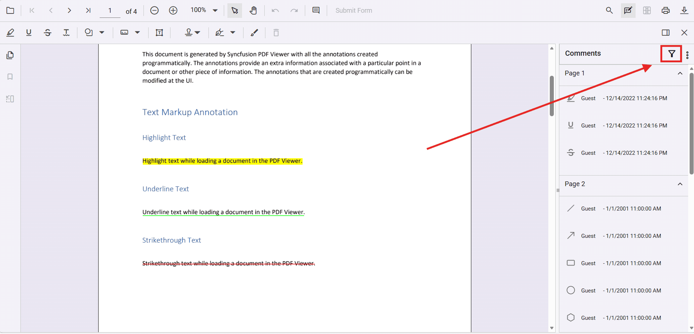
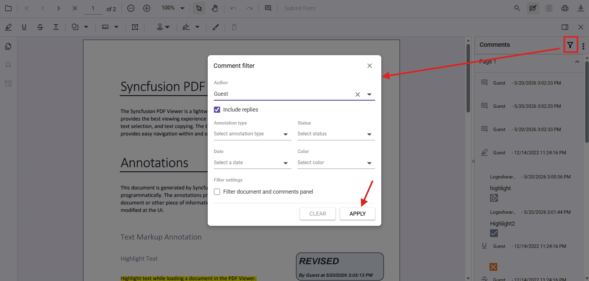
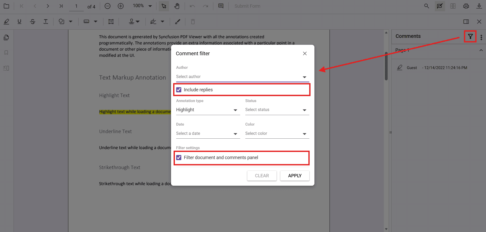

# Annotation comment filter in Angular

## Overview

The comment filter feature in Angular PDF Viewer allows you to efficiently manage and view annotations by filtering comments and annotations based on various criteria. Access the filter options through the filter icon in the comments panel to display only the annotations that match your filter criteria.

Imagine reviewing a PDF document with feedback from 5 team members, resulting in 100+ annotations across different pages. Without filtering, finding all comments from your manager or locating all rejected items becomes a tedious task. The comment filter feature solves this by letting you instantly focus on the annotations that matter to you.



## When to use comment filtering

Comment filtering is most useful in these scenarios:

- **Team reviews**: Filter annotations by author to see feedback from specific reviewers
- **Status tracking**: Filter by status (Accepted, Rejected, Canceled) to track document workflow progress
- **Color-coded reviews**: Filter by annotation color to organize feedback by priority or type
- **Time-based review**: Filter by modification date to see recent changes
- **Document collaboration**: Use "Filter document and comments panel" to synchronize your view with the document
- **Focused comments panel**: Use panel-only filtering to study all comments without hiding annotations in the document

## UI-based filtering

The Angular PDF Viewer provides a comment filter dialog in the comments panel that allows you to filter annotations by the following criteria.

### Filter options

- **Author**: Filter annotations by the author who created them. Use the "Include replies" checkbox to also include comments where the author has replied to other annotations.
- **Annotation Type**: Filter by specific annotation types such as Highlight, Underline, Strikethrough, Text Box, Sticky Notes, and more.
- **Status**: Filter annotations by their status (e.g., Accepted, Rejected, Canceled, Completed, None).
- **Date**: Filter annotations by their modification date.
- **Color**: Filter annotations by their color.



### How to filter annotations by author

Follow these steps to filter and display only annotations created by a specific author:

1. Open the PDF document in the Angular PDF Viewer
2. Click the **filter icon** in the comments panel toolbar (top-right corner of the comments panel)
3. Click the **Author** dropdown menu
4. Select the author(s) you want to filter by from the list
5. (Optional) Check the **"Include replies"** checkbox to also display replies from the selected author
6. Click **APPLY** to activate the filter
7. The comments panel now displays only annotations from the selected author(s)

> **Note**: To reset the author filter, uncheck all selected authors or click **CLEAR** to remove all filters.

### How to filter by annotation type and status

Follow these steps to filter annotations by their type and status:

1. Click the **filter icon** in the comments panel toolbar
2. In the **Annotation Type** dropdown, select the annotation types you want to view (e.g., Highlight, Underline)
3. In the **Status** dropdown, select the status you want to filter by (e.g., Accepted, Rejected, Pending)
4. Click **APPLY** to see only annotations matching your criteria
5. Use the **CLEAR** button to reset all filters

### How to filter by date and color

Follow these steps to filter annotations by when they were modified or by their color:

1. Click the **filter icon** in the comments panel toolbar
2. Click the **Date** dropdown and select the modification date range you're interested in
3. (Optional) Click the **Color** dropdown and select specific colors to display only annotations in those colors
4. Click **APPLY** to activate the filters
5. The panel now shows only annotations matching your date and color criteria

### Using combined filters

You can apply multiple filter criteria simultaneously:

1. Click the **filter icon**
2. Set the **Author** to "John Smith"
3. Set the **Annotation Type** to "Highlight"
4. Set the **Status** to "Accepted"
5. Click **APPLY**
6. Result: Only highlights created by John Smith with "Accepted" status are displayed

### Filter settings

- **Include replies**: When enabled, displays replies from the selected author along with their original annotations.
- **Filter document and comments panel**: When checked, the filter is applied to both the comments panel and the annotations visible in the document. When unchecked, the filter is applied only to the comments panel.



### Understanding "Filter document and comments panel" option

This checkbox controls where the filter is applied:

**When CHECKED** (Filter both panel and document):
- Filtered annotations **disappear from the document** view
- Filtered comments **disappear from the comments panel**
- Use this when you want focused reviewing—see only the annotations you're interested in both visually and in the list

**When UNCHECKED** (Filter comments panel only):
- Filtered annotations **remain visible in the document**
- Filtered comments **are hidden from the comments panel**
- Use this when you want to study comments in the side panel without losing visual context of all annotations in the document

**Example scenario**:
- Document has 50 annotations from 3 reviewers
- You filter by "Manager" author with the checkbox CHECKED → See only Manager's annotations on the document
- You filter by "Manager" author with the checkbox UNCHECKED → See all 50 annotations in the document, but only Manager's comments in the panel

## Programmatic filtering

You can programmatically apply comment filters using the `applyCommentFilter` method on the annotation service. This allows you to set filter criteria dynamically and control filter behavior through code.

This approach is useful when you want to:
- Auto-apply filters based on user roles (e.g., show only "Manager" annotations for manager users)
- Implement custom filter logic in your application
- Provide keyboard shortcuts or buttons to apply saved filter presets
- Integrate filtering with your application's workflow

### Applying filters programmatically

Use the `applyCommentFilter` method to apply filters with specific criteria:




import {
  PdfViewerModule,
  LinkAnnotationService,
  BookmarkViewService,
  MagnificationService,
  ThumbnailViewService,
  ToolbarService,
  NavigationService,
  TextSearchService,
  TextSelectionService,
  PrintService,
  PageOrganizerService,
  AnnotationService,
  FormDesignerService,
  FormFieldsService,
} from '@syncfusion/ej2-angular-pdfviewer';

import { Component, OnInit } from '@angular/core';

@Component({
  imports: [PdfViewerModule],
  standalone: true,
  selector: 'app-container',
  template: `<div class="content-wrapper">
    <button (click)="applyFilter()" style="margin-bottom: 10px;">Apply Filter</button>
    <button (click)="clearFilter()" style="margin-left: 10px;">Clear Filter</button>
    <ejs-pdfviewer 
      id="pdfViewer" 
      [documentPath]='document' 
      [resourceUrl]='resource' 
      style="height:640px;display:block">
    </ejs-pdfviewer>
  </div>`,
  providers: [
    LinkAnnotationService,
    BookmarkViewService,
    MagnificationService,
    ThumbnailViewService,
    ToolbarService,
    NavigationService,
    AnnotationService,
    TextSearchService,
    TextSelectionService,
    PrintService,
    FormDesignerService,
    FormFieldsService,
    PageOrganizerService,
  ],
})
export class AppComponent implements OnInit {
  public document = 'https://cdn.syncfusion.com/content/pdf/programmatical-annotations.pdf';
  public resource: string = 'https://cdn.syncfusion.com/ej2/33.1.44/dist/ej2-pdfviewer-lib';
  
  ngOnInit(): void {
  }
  
  applyFilter() {
    var pdfviewer = (<any>document.getElementById('pdfViewer')).ej2_instances[0];
    pdfviewer.annotation.applyCommentFilter({
      type: ['Highlight', 'Underline'],
      // color: ['#ffff00', '#00ffff'],
      // status: 'Accepted',
      // author: ['Guest', 'Admin'],
      // modifiedDate: ['1/1/2024'],
      // includereplies: true,
      applyToDocument: true
    });
  }
  
  clearFilter() {
    var pdfviewer = (<any>document.getElementById('pdfViewer')).ej2_instances[0];
    pdfviewer.annotation.applyCommentFilter(null);
  }
}




### Filter configuration options

The following table describes the filter configuration options available in the `applyCommentFilter` method:

| Property | Type | Description |
|----------|------|-------------|
| `type` | `string[]` | Array of annotation types to filter. Example: `['Highlight', 'Underline', 'Strikethrough']` |
| `color` | `string[]` | Array of hex color codes to filter annotations by color. Example: `['#ffff00', '#ff0000']` |
| `status` | `string` | Filter annotations by status. Example: `'Accepted'`, `'Rejected'`, `'Cancelled'`, `'Completed'`, or `'None'` |
| `author` | `string[]` | Array of author names to filter annotations. Example: `['Guest', 'Admin']` |
| `modifiedDate` | `string[]` | Array of dates to filter annotations by modification date. Example: `['1/1/2024']` |
| `includereplies` | `boolean` | When set to `true`, includes replies from the specified authors. Default is `false` |
| `applyToDocument` | `boolean` | When set to `true`, applies the filter to both the comments panel and annotations visible in the document. When `false`, filters only the comments panel. Default is `false` |

### Practical example: Role-based filtering

Here's a real-world scenario where you filter annotations based on the current user's role:

```ts
// Pseudo-code showing role-based filtering
export class AppComponent {
    applyRoleBasedFilter() {
        var userRole = this.getCurrentUserRole(); // Returns: 'manager', 'reviewer', 'viewer'
        var pdfviewer = (<any>document.getElementById('pdfViewer')).ej2_instances[0];
        
        if (userRole === 'manager') {
            // Managers see only their own annotations and status-flagged items
            pdfviewer.annotation.applyCommentFilter({
                author: ['John Smith'], // Current user
                status: 'Accepted',
                applyToDocument: true
            });
        } else if (userRole === 'reviewer') {
            // Reviewers see all review-type annotations
            pdfviewer.annotation.applyCommentFilter({
                type: ['Highlight', 'Underline'],
                applyToDocument: false // See all in document, but filtered in panel
            });
        }
    }
    
    getCurrentUserRole() {
        // Your role retrieval logic here
        return 'reviewer';
    }
}
```

### Filter with multiple criteria

You can combine multiple filter criteria to create more specific filters:




import {
  PdfViewerModule,
  LinkAnnotationService,
  BookmarkViewService,
  MagnificationService,
  ThumbnailViewService,
  ToolbarService,
  NavigationService,
  TextSearchService,
  TextSelectionService,
  PrintService,
  PageOrganizerService,
  AnnotationService,
  FormDesignerService,
  FormFieldsService,
} from '@syncfusion/ej2-angular-pdfviewer';

import { Component, OnInit } from '@angular/core';

@Component({
  imports: [PdfViewerModule],
  standalone: true,
  selector: 'app-container',
  template: `<div class="content-wrapper">
    <button (click)="applyComplexFilter()" style="margin-bottom: 10px;">Apply Multi-Criteria Filter</button>
    <button (click)="clearFilter()" style="margin-left: 10px;">Clear Filter</button>
    <ejs-pdfviewer 
      id="pdfViewer" 
      [documentPath]='document' 
      [resourceUrl]='resource' 
      style="height:640px;display:block">
    </ejs-pdfviewer>
  </div>`,
  providers: [
    LinkAnnotationService,
    BookmarkViewService,
    MagnificationService,
    ThumbnailViewService,
    ToolbarService,
    NavigationService,
    AnnotationService,
    TextSearchService,
    TextSelectionService,
    PrintService,
    FormDesignerService,
    FormFieldsService,
    PageOrganizerService,
  ],
})
export class AppComponent implements OnInit {
  public document = 'https://cdn.syncfusion.com/content/pdf/programmatical-annotations.pdf';
  public resource: string = 'https://cdn.syncfusion.com/ej2/33.1.44/dist/ej2-pdfviewer-lib';
  
  ngOnInit(): void {
  }
  
  applyComplexFilter() {
    var pdfviewer = (<any>document.getElementById('pdfViewer')).ej2_instances[0];
    // Filter for all Highlight and Underline annotations in red color created by Guest user
    pdfviewer.annotation.applyCommentFilter({
      type: ['Highlight', 'Underline'],
      color: ['#ff0000'],
      author: ['Guest'],
      includereplies: true,
      applyToDocument: true
    });
  }
  
  clearFilter() {
    var pdfviewer = (<any>document.getElementById('pdfViewer')).ej2_instances[0];
    pdfviewer.annotation.applyCommentFilter(null);
  }
}




## Behavior notes and best practices

### Filter mechanics
- **Filter icon location**: The filter icon is located in the comments panel toolbar at the top right.
- **Apply to document**: When the "Filter document and comments panel" option is checked, both the comments panel and the visible annotations in the document are filtered. Only annotations that match the filter criteria are displayed in the document.
- **Comments only**: When unchecked, filtering is applied only to the comments panel. All annotations remain visible in the document.
- **Include replies**: Enabling this option displays not only annotations by the specified author but also any replies they have made to other annotations.
- **Clear filter**: Pass `null` to the `applyCommentFilter` method to clear all applied filters and display all annotations and comments.
- **Filter combination**: When multiple criteria are specified, annotations must match **all criteria** to be displayed (AND logic).

### Best practices

- **Use "Filter document and comments panel"** when you want a distraction-free review experience focusing on specific annotations
- **Use "Comments panel only" filtering** when you need full visual context but want to organize the comments panel
- **Combine multiple criteria** to narrow down your search (e.g., Author + Status + Type)
- **Include replies** when collaborating with teams to see the full conversation thread
- **Clear filters regularly** after completing a review task to avoid forgetting filters are active
- **Save filter presets** in your application for commonly used filter combinations (author + status)

## See also

- [Annotation Overview](../overview)
- [Annotation Types](../annotation/annotation-types/area-annotation)
- [Annotation Permissions](../annotation/annotation-permission)
- [Annotation Toolbar](../toolbar-customization/annotation-toolbar)
- [Create and Modify Annotation](../annotation/create-modify-annotation)
- [Annotation Events](../annotation/annotation-event)
- [Export and Import Annotation](../annotation/export-import/export-annotation)
- [Annotation API](../annotation/annotations-api)
